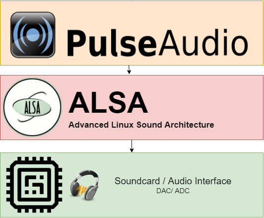

{: style="display: block; margin: 0 auto"}
<H2 style="text-align: center;">ALSA/PULSE</H2>

## A complete audio guide for Linux, as well debunking the myths regarding ALSA and Pulse.

Linux Audio Users Guide

A few days ago, an user asked about audio quality on Linux, and whether it is worse or better than audio on Windows. The thread became a mess quickly, full of misconceptions and urban myths about Linux. I figured it would be worthwhile to create a complete guide to Linux audio, as well as dispelling some myths and misconceptions.

To all be on the same page, this is going to be thorough, slowly introducing more concepts.

## What is sound? How and what can I hear?

You might remember from high school that sound is waves traveling through the air. Vibrations of any kind cause molecules in the air to move. When that wave form finds your ears, it causes little hairs in your ear to move. Different hairs are susceptible to different frequencies, and the signals sent by these hairs are turned into sound you hear by your brain.

In reality it is a little more complicated, but for the sake of this post, that's all you need to know.

The pitch of sound comes from its frequency, the 'shorter' the waves are in a waveform, the higher the sound. The volume of sound comes from how 'tall' the waves are. Human hearing sits in a range between 20Hz and 20,000 Hz, though it deviates per person. Being the egocentric species we are, waves below 20 Hz are called 'infrasound' and waves above 20kHz are called 'ultrasound.' Almost no humans can hear beyond ultrasound, you will find that your hearing probably cuts off at 16kHz.

 
Tone Generator
 
To play around with this, check out this <a href="https://www.szynalski.com/tone-generator" target="_blank" rel="noopener"><strong>tone generator</strong></a>, you can prove anything above with this yourself. As a fun fact: human hearing is actually really bad, we've among the most limited frequency ranges. A cat can hear up to 40kHz, and dolphins can even hear up to 160kHz!!
 

Warning

<b>FACT: Playing loud music is dangerous!</b> If you listen to music and you are feeling a discomfort, you should turn the volume down. A true alert is when you hear a beep - this is called tinnitus, and that beep you're hearing is pretty much the death cry of the cells that can hear that frequency. That beep is the last time you will hear that very specific frequency ever again. Please, listening to loud music is not worth the permanent hearing damage, please dial it down for your own sake!

## How does my computer generate sound?

To listen to sound, you will probably be using headphones or speakers, inside of them are cones that are driven by an electromagnet, causing them to vibrate at very precise frequencies. This is essentially how sound works, though modern headphones certainly can be pretty complex.

To drive that magnet, an audio source will send an analog signal (a waveform) over a wire to the driver, causing it to move at the frequency of that waveform. This is in essence how audio playback works; and we're not going to get into it much deeper than this.

Computers are digital - which is to say, they don't do analog; processors understand ON and OFF, they do not understand 38.689138% OFF and 78.21156% ON. When converting an analog signal (like sound) to a digital one, we make use of a format called PCM. For PCM to be turned into an analog signal, you need a DAC - or as you probably know it: a sound card. DAC stands for 'Digital to Analog Converter', or some people mistakenly call it "Digital Audio Converter/Chip"

<b>PCM</b> stands for <b>P</b>ulse-<b>C</b>ode <b>M</b>odulation, which is a way to represent sampled analog signals in a digital format. We're not going to get into it too much here, but imagine taking a sample of a waveform at regular intervals and storing the value, and then rounding that value to a nearest 'step' (remember this). That's <b>PCM</b>.

The fidelity of <b>PCM</b> comes from two elements, which we are going to discuss next: **Sampling rate** and **Bit depth.**

## What is sampling rate? Or: How 'Good' Is The Sound?

Sampling rate is the most important part of making PCM sound good. Remember how humans hear in a range of 20Hz to 20kHz? The sample rate of audio has a lot to do with this. You cannot capture high frequencies if you do not capture samples often enough. Since our ears can hear up to 20 kHz, you would imagine that 20kHz would be ideal for capturing audio; however, a result of sampling is that you actually need twice the sample rate, this is called the [**Nyquist-Sannon Sampling Theorem**](https://en.wikipedia.org/wiki/Nyquist%E2%80%93Shannon_sampling_theorem), which is a complicated thing. Just understand that to reproduce a 20kHz frequency, you need a sample rate of 40kHz.

To have a little bit of room and leeway, we settled on a sample rate of 48kHz (a multiple of 8) for playback, and 96kHz for recording. We record at this frequency only to make sure absolutely no data is lost. You might be more familiar with 44.1kHz for audio, which is a standard we settled on for CD playback and NTSC. A lot of scientific research has been done on sound quality, and there is no evidence to suggest people can tell the difference between 48kHz or anything higher.

MYTH BUST

<ul><li>Humans cannot hear beyond <b>20 kHz</b>, period. Anyone who claims to be able to is either supernatural or lying to you - I'll let you choose which.</li></ul>

## What is bit-depth? Or: How To Make It Sound Really Good?

Remember how I told you to remember that PCM rounds values to the nearest step? This has to do with how binary works. The more bits, the bigger the number you can store. In PCM, the bit-depth decides the number of bits of information in each sample. With 16-bit, the range of values that can be stored is 0 to 65535. Going beyond this is pointless for humans, with no scientific research showing any proven benefit, though marketeers would like you to believe there's benefits.

MYTH BUST

<ul><li><b> 24-bit depth</b> is often touted as 'high-resolution audio', claiming benefits of a better sonic experience. Such is nothing more than marketing speech, there is no meaningful data 24-bit can capture that 16-bit cannot.</li></ul>

## Channels? Or: How To Produce Sound From The Left But Not From The Right?

We'll briefly touch on the last part of PCM audio, channels. This is very self explanatory, humans have two ears and can hear separate sounds on both of them, which means we have stereo hearing. As a result, most music is recorded with 2 channels. For some surround settings, you need more channels, this is why you may have heard of 5.1 or 7.1; the first digit is the amount of channels the PCM carries.

For most desktop usage, the only sound we care about is 2-channel PCM.

## Recap

So, we've covered all the elements of PCM sound. Let's go over it quickly: sample rate is expressed in Hz and is how often a sample of a waveform is captured, representing the x-axis of a waveform. Bit-depth is the bits of information stored in each sample, and represents the y-axis of the waveform. Channels decide how many simultaneous outputs the PCM can drive separately, since we have 2 ears, you need at least two channels.

As a result, the standard audio playback for both consumers and professionals is 48kHz, 16-bit, 2 channel PCM. This is more than enough to fully represent the full range of human hearing.

## How it works in Linux.

So, now that we know how PCM works, how does Linux produce sound? How can you make Linux sound great? A few important components come into play here, and we'll need to discuss each of them in some detail.

{: style="display: block; margin: 0 auto"}
<H1 style="text-align: center;">ALSA</H1>

## ALSA

ALSA is the interface to the kernel's sound driver. ALSA can take a PCM signal and send it to your hardware by talking to the driver. Something important to know about most DACs is that they can only take one signal at a time, actually. That means that only a single application can send sound to ALSA at once. Long ago, in a darker time, you couldn't watch a movie while listening to music!

This problem was solved a long time ago with the use of `alsalib`, but doing mixing at a library level isn't a very good solution to the problem. This gave rise to sound servers, of which many have existed. Before PulseAudio, `esound` was a very popular one but had many problems, eventually it was succeeded by PulseAudio.

{: style="display: block; margin: 0 auto"}
<H2 style="text-align: center;">PulseAudio</H2>

## PulseAudio

When you think audio on Linux, PulseAudio is probably among the first things you think of. PulseAudio is NOT a driver, nor does it talk to your drivers. Actually, PulseAudio only does two things that we'll discuss in detail later. PulseAudio talks to ALSA, taking control of its single audio stream, and allows other applications to talk to PulseAudio instead. Pulse is an 'audio multiplexer', turning multiple signals into one through a process that is called **mixing.** Mixing is an incredibly complicated subject that we won't talk about here.

To be able to mix sounds, one must make sure that all the PCM sources are in the same format (the one that's being sent to ALSA); if the PCM format being sent to Pulse does not match the PCM format being sent to ALSA, pulse does a step before mixing it called **resampling.** Resampling is another very complicated subject that can turn a 8kHz, 4-bit, 1-channel PCM stream into a 24kHz, 24-bit, 2-channel PCM stream.

These two things allow you to play a game, listen to music and watch YouTube, and notifications to produce a sound all at the same time. PulseAudio is the most critical element of the Linux sound stack.

 
FACT
 
PulseAudio is a contentious subject, many people have a dislike for this particular bit of software. In all honesty, PulseAudio was brought to the general public in a bit of a premature state, breaking audio for many people. PulseAudio these days is a very stable, solid piece of software. If you have audio issues these days, it's usually a problem in ALSA or your driver.
 

## *What about [*JACK*](https://jackaudio.org/) and [*Pipewire*](https://pipewire.org)?*

PulseAudio isn't the only sound server/daemon available for Linux, though it is certainly the most popular and most likely the default of whatever distribution you are using. PulseAudio has become a bit of a standard for Linux sound and has by far the best compatibility with most applications, but that doesn't mean there aren't alternatives.

[**JACK**](http://jackaudio.org/) (JACK Audio Connection Kit, a recursive acronym like GNU) is a sound server focused primarily on low latency. If you are doing professional audio work on Linux, you will already be very familiar with JACK. JACK's development is very focused on low latency, real-time audio and is critical for such people. JACK is available on most distros as an alternative, and you can try it for yourself if you so want; but you might find some applications do not work nicely with JACK.

[**PipeWire**](https://pipewire.org/) is a project that is currently in development, looking to solve key problems that exist in current sound servers. PipeWire isn't just a sound server but also handles the multiplexing of video sources (like a camera). Special attention has been put into working with sandboxed applications (like Flatpaks), which is an area where PulseAudio is lacking. PipeWire is a very promising project that might very well succeed PulseAudio in the future and you should expect to see appearing in distribution repositories very soon. You can try it yourself right now, though it isn't quite as easy to get started with as JACK is.

More audio servers exist, but are beyond the scope of this post.

## What is resampling?

Resampling is the process of turning a PCM stream into another PCM stream of a different resolution. Your DAC only accepts a limited range of PCM signals, and it is up to the software to make sure the PCM stream is compatible. There is almost no DAC out there that doesn't support 44.1kHz, 16-bit, 2-channel PCM, so this tends to be the default. When you play an audio source (like an OggVorbis file), the PCM stream might be 96kHz, 24-bit, 2-channel PCM.

To fix that, PulseAudio will use a **resampling algorithm**. There are two kinds of resampling methods: upsampling and downsampling. Upsamling is lossless, since you can always represent less data with more data. Downsampling is lossy by definition, you cannot represent 24-bit PCM with 16-bit PCM.

MYTH

<b>That</b> <a href="https://en.wikipedia.org/wiki/Downsampling_(signal_processing)"><strong>Downsampling</strong></a> results in a loss of quality! This is only true in a technical sense, or if you are downsampling to less than 48kHz, 16-bit PCM. When you downsample a 96kHz, 24-bit PCM stream to a 48kHz, 16-bit stream, no meaningful data is lost in the process; because the discarded data lies outside of the human ear's hearing range.

 
FACT
 
Resampling is expensive. Good quality resampling algorithms actually take a non-trivial amount of processing power. PulseAudio defaults to a resampling method with a good balance between CPU time used and quality.
 

## What is mixing?

Mixing is the process of taking two PCM streams and combining them into one. This is extremely complicated and not something we're going to discuss at length. It is not important to understand how this works, only to understand that it exists. Without mixing, you wouldn't be able to hear sounds from multiple sources. This is true not just for PulseAudio and computer sound, this is true for anything. In real life, you might use an A/V receiver to accept sound from your TV and music player at once, the receiver then mixes the signals and plays it through your speakers.

## What is encoding?

Finally we can talk a little about encoding. Encoding is the process of taking a PCM stream and writing it to a permanent format, two types exist. You have *lossy* encoding and *lossless* encoding. Lossy encoding removes data from the PCM stream to safe space. Usually the discarded data is useless to you, and will not make a difference in sound quality; examples of lossy encoding are *MP3*, *AAC* and *Ogg Vorbis*. *Lossless* encoding takes a PCM stream and encodes it in such a way that no data is lost, examples of lossless encodings are *FLAC*, *ALAC* and *WAV.*

Note that lossy and lossless do not mean compressed and uncompressed. A lossless format can be compressed and usually is, as uncompressed lossless encoding would be very large; it would just be the raw PCM stream. An example of lossless uncompressed audio is *WAV*.

A new element encodings bring is their *bit rate*, not to be confused with samplerate and bit depth. Bit rate has to do with how much data is stored in every second of audio. For a lossless, uncompressed PCM stream this is easy to calculate with the formula `bit rate = sample rate * bit depth * channels`, for 16-bit, 48kHz, 2 channel PCM this is 1,5 Mbit. To get the value in bytes, divide by 8, thus 192kB per second.

The bit rate of an encoder means how much the audio will be compressed. PCM compression is super complicated, but it generally involves discarding silence, cutting off frequencies you cannot hear, and so forth. Radio encoding has a bit rate of roughly 128 Kbps, while most CDs have a bit rate of 1360kbps.

Lastly, there is the concept of VBR and CBR. VBR stands for **V**ariable **B**it **R**ate, while CBR stands for **C**onstant Bit Rate. In a VBR encoding, the encoder aim for a target bit rate that you set, but it can deviate if it thinks it needs more or less. CBR will encode a constant bit rate, and will never deviate.

MYTH

<b>Lossless sounds better than lossy.</b>This is blatantly untrue, lossless audio formats were created for perservation and archival reasons. When you encode a lossy file from a lossless source, and you make sure that it's a 48kHz, 16-bit PCM encoding, you will not lose any important information. What is enough depends on the quality of the encoder. For OggVorbis, 192kbps is sufficient, for MP3, 256kbps should be preferred. 320kbps is excessive and the highest quality supported by MP3. In general, 256kbps does the trick, but with storage being abundant these days, you can play it safe and use 320kbps if it makes you feel better.

MYTH

<b>CBR is better than VBR.</b>There is no reason not to use VBR at all, there is no point in writing 256Kbps of data if there is only silence or a constant tone. Let your encoder do what it does best!

 
FACT
 
<b>Encoding a lossy format to another lossy format will result in a loss of data!</b> You will compress data that is already compressed, which is really bad. When encoding to a lossy format, always use a high quality recording in a lossless format as the source!
 

More Info

<b>I DON'T BELIEVE YOU!</b> This article from the guys at xiph.org, (The people who brought you FLAC and Ogg Vorbis) who explain it better than I can: &rarr; <a href="https://people.xiph.org/%7Exiphmont/demo/neil-young.html"><strong>xiph.org</strong></a>

## TL;DR  I Just Want The Best Sound Quality!

Here is a quick guide to achieving great sound quality on Linux with the above in mind.

- When you want to encode audio, prefer open, free formats like Ogg Vorbis. MP3 is not your friend.
  
- Never encode a lossy format to another lossy format. Always try to encode from a 96kHz, 24-bit FLAC if you can.
  
- Generally you won't have to touch PulseAudio, but there are a few things you can change in the `/etc/pulse/daemon.conf` file.
  
  - You can pick a different resampling method, see the manual for your options.
    
  - You should probably match the `default-sample-*` settings to your sound card.
    
  - Generally you shouldn't touch this file unless you are experiencing sound issues.
    
  - Do not set `avoid-resampling` to `true`, this is a huge misconception, this does not improve sound quality at best, and in the worst case, can actually break things.
    

As you can see, there's little you can do in Linux in the first place, so what can you do if you want better sound?

- Buy a good external DAC, turning a digital signal into analog inside of a PC case is a bad idea due to electromagnetic interference. Ever plugged your headphones into the front audio jack of your case? You will hear the noise. A good DAC will make a meaningful improvement your listening experience.
  
- Your headphones and amplifier really make the biggest difference. Having a good pair of headphones paired with a good headphone amplifier ten times more important than whatever chip you got in your PC.
  

MYTH

<i>Linux sound quality is worse than Windows.</i> They are basically the same, Pulse doesn't function any differently as opposed to how MS Windows mixes and resamples.

MYTH

<i>Linux sound quality can be better than Windows.</i> They are exactly the same. All improvements in quality come from the driver and your DAC, not the sound server. Pulse and ALSA do not touch the PCM beyond moving it around and resampling it.

I hope this (long) guide was of help to you, and that it helped to dispell some [all?] of the myths around PulseAudio. Did I miss anything? Ask or let me know, and I'll answer the best I can. Did I make any factual errors? Please correct me with a source and I'll amend the post immediately.

 
Notes And Additions
 
<b>24bit</b> is also useful for recording live inputs. You're less likely to get clipping. Once you have a good sample, sure, reduce it to 16. But for recording it is useful.
 

<h2 style="display: inline;" id="screenshots">Linux Audio Stack and Architecture</h2>

PulseAudio.

PulseAudio is the de facto standard sound server for almost all Linux distributions. It can handle virtually any audio-related scenario. Its design is easy to understand and scalable, utilizing a common source/sink approach. This makes PulseAudio the optimal solution for most users (though its rich feature set may increase audio latency, making it unsuitable for professionals demanding low-latency audio).

So, it's time to get a little more familiar with PulseAudio. As you can see in the image above, PulseAudio can interact with your sound card (a general term for any device capable of recording or playing audio, regardless of how it's connected to your PC).

How to output audio to a Bluetooth headset?

 

There is a PulseAudio sink for Bluetooth's A2DP (Advanced Audio Distribution) profile that can interact directly with the BlueZ5-Bluetooth-Stack.

 How to output audio to TV/monitor via HDMI?

PulseAudio also has syncs for various graphics cards if they are not supported by the default ALSA modules.

How to send recorded audio to a separate system?

PulseAudio has excellent networking capabilities and can stream audio to other SoundServers via RTP. RTP is the Real-Time Transport Protocol, a well-known protocol for transmitting audio and video data over IP.

  

<i>PulseAudio Diagram</i>

<b>Advanced Linux Sound Architecture.</b> 

ALSA (Advanced Linux Sound Architecture) is the lowest-level interface that allows applications to interact with the system's physical hardware. It can be thought of as a driver that abstracts access to sound-related hardware (audio interfaces, sound cards, etc.). It supports most existing audio devices out of the box. In its simplest form, ALSA accepts PCM (= Pulse-Coded-Modulation) signals as input and sends them directly to the hardware.

Due to limitations in most DAC chips, ALSA can only send one channel to the hardware at a time. This means that only a single application can send audio to ALSA at a time. This means that you can't receive music from a media player and notification sounds from a messenger at the same time. To improve this, ALSA developers implemented a mixer, which allows multiple virtual audio channels to be combined into a single channel, called alsalib.

 While this may seem like a good idea, library-level mixing still presents a problem in the desktop environment. While libraries allow mixing, only a single application can output audio. This limitation is precisely what led to the emergence of so-called "sound servers."
 

<b>The concept of a sound server.</b> 

A major problem with modern desktops is the need for multiple applications to output sound simultaneously. As described above, this wasn't possible with standard ALSA. That's why the sound server emerged. A sound server is essentially a service, or daemon, that runs continuously in the background of your computer.

 The sound server provides a mixer slot for any application that needs to output audio to speakers. Applications can connect to this sound server via various protocols and stream audio in various formats in parallel. The sound server then mixes all incoming audio slots together and passes them back to ALSA (thus acting as a master channel).
 

Finally, it became possible to output audio from multiple sources in parallel, and this concept also brought other features such as application-specific volume control and other effects.

Linux system… 
<b>Knowing this is important because most Linux distributions use this hierarchy.</b> 
 
 
  
 

 
 

