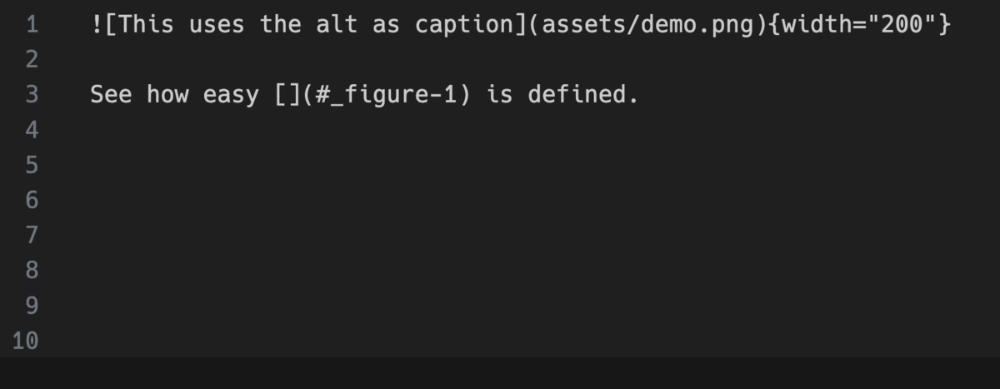

{ .center-image }

<H1 style="text-align: center;"> Welcome to MkDocs Caption</H1>


##### Project Metadata

<div class="grid cards cols-3" markdown>

-   <span style="color: #2094f3">:material-book-open-variant:</span> **Caption Readme**
    [:octicons-arrow-right-24: Go to](MkDocsCaption/Readme.md/){ .md-button style="border-color: #2094f3; color: #2094f3" }

    Overview of the plugin and basic usage.

-   <span style="color: #2094f3">:material-cog:</span> **Caption Config**
    [:octicons-arrow-right-24: Go to](MkDocsCaption/config.md/){ .md-button style="border-color: #2094f3; color: #2094f3" }

    Detailed configuration options and defaults.

-   <span style="color: #2094f3">:material-palette:</span> **Caption Custom**
    [:octicons-arrow-right-24: Go to](MkDocsCaption/custom.md/){ .md-button style="border-color: #2094f3; color: #2094f3" }

    How to apply custom CSS and styles.

-   <span style="color: #4caf50">:material-image-area:</span> **Caption Image**
    [:octicons-arrow-right-24: Go to](MkDocsCaption/image.md/){ .md-button style="border-color: #4caf50; color: #4caf50" }

    Settings for image-specific captions.

-   <span style="color: #4caf50">:material-rocket-launch:</span> **Caption Quick-Start**
    [:octicons-arrow-right-24: Go to](MkDocsCaption/Quick-Start.md/){ .md-button style="border-color: #4caf50; color: #4caf50" }

    Get up and running in under 5 minutes.

-   <span style="color: #4caf50">:material-book-search:</span> **Caption References**
    [:octicons-arrow-right-24: Go to](MkDocsCaption/references.md/){ .md-button style="border-color: #4caf50; color: #4caf50" }

    Technical API and cross-reference details.

-   <span style="color: #ff9800">:material-table-edit:</span> **Caption Table**
    [:octicons-arrow-right-24: Go to](MkDocsCaption/table.md/){ .md-button style="border-color: #ff9800; color: #ff9800" }

    Formatting and options for table captions.

-   <span style="color: #ff9800">:material-home-circle:</span> **Zensical Start Page**
    [:octicons-arrow-right-24: Return to](MkDocs-Material-Start.md){ .md-button style="border-color: #ff9800; color: #ff9800" }

    Back to the project's main landing page.

-   <span style="color: #ff9800">:material-arrow-u-left-top:</span> **MkDocs-Material**
    [:octicons-arrow-right-24: Return to](index.md){ .md-button style="border-color: #ff9800; color: #ff9800" } 

    Back to the root documentation.

</div>

<div class="grid cards cols-3" markdown>

-   <span style="color: #2094f3">:octicons-info-24:</span> &nbsp; **Project Metadata**
    
    *   [MkDocs Caption Readme](MkDocsCaption/Readme.md)
    *   [Review the Config](MkDocsCaption/config.md)
    *   [See the Custom Caption](MkDocsCaption/custom.md)

-   <span style="color: #4caf50">:octicons-gear-24:</span> &nbsp; **Technical Information**
    
    *   [Table Caption](MkDocsCaption/table.md)
    *   [References](MkDocsCaption/references.md)
    *   [Image Caption](MkDocsCaption/image.md)

-   <span style="color: #ff9800">:octicons-rocket-24:</span> &nbsp; **Quick Start**
    
    *   [Installation Guide](MkDocsCaption/Quick-Start.md)
    *   [Basic Usage](MkDocsCaption/Readme.md)
    *   [Advanced Config](MkDocsCaption/config.md)

</div>


!!! info "Enhance"

    - Enhance your [MkDocs](https://www.mkdocs.org/) documentation with easy figure, table captioning and numbering. 
    
    - But it does not stop there. You can also add captioning and numbering to literally any element you want.
    
    - And the best part you do not even need to add additional CSS or JavaScript to your site, just enable the plugin and you are good to go.

    
    

##### Features
!!! pied-piper "Features"

    * Easy to use table and figure caption declaration directly in Markdown
    * Automatic numbering of tables and figures
    * Dynamic link text generation for references
    * Highly configurable
    * Extendable to support captions for all element types
    * Cross page referencing
    
##### Installation

!!! abstract "Installation"

    ```console
    uv pip install mkdocs-caption
    ```
    
##### Credits

!!! danger "Credits"

    - This is an open source project. It lives from your contributions, be it in form of bug reports, feature requests, discussions, or fixes and other code changes. I am happy to see other people contributing ideas or even building on top of it. If you encounter any issues or have ideas for improvements, feel free to open an issue or a pull request.
    
    - Of course, I am not the only one who has thought about adding captions to MkDocs. There are numerous other projects or workarounds that try to solve the same problem. What makes this project unique is that it is able to handle captions for images, tables and even custom elements. Also, it is a native MkDocs plugin, which enable it to detect the caption elements more reliably and to integrate well with other plugins.
    
!!! warning "Alternatives"

    If you are looking for an alternative, you might want to check out the following projects:
    
    * [markdown_caption](https://github.com/evidlo/markdown_captions) native Markdown extension for adding captions to images.
    
    * [mkdocs-img2fig-plugin](https://github.com/stuebersystems/mkdocs-img2fig-plugin) MkDocs plugin for adding captions to images.
    
    If you know other plugins or projects that should be listed here, feel free to open an issue or a pull request.
    

### Advanced Configuration

!!! bug ""
    - Material for MkDocs comes with many configuration options.
    
    - The setup section explains in great detail how to configure and customize colors, fonts, icons and much more:
    

<div class="grid cards cols-3" markdown>

-   <span style="color: #2094f3">:material-palette:</span> **Changing the Colors**
    [:octicons-arrow-right-24: View Guide](./MkDocs-Material/changing-the-colors.md){ .md-button }
    
    Customise primary and accent colors to match your brand identity.

-   <span style="color: #2094f3">:material-format-font:</span> **Changing the Fonts**
    [:octicons-arrow-right-24: View Guide](./MkDocs-Material/changing-the-fonts.md){ .md-button }
    
    Configure Google Fonts or custom web fonts for typography.

-   <span style="color: #2094f3">:material-translate:</span> **Changing the Language**
    [:octicons-arrow-right-24: View Guide](./MkDocs-Material/changing-the-language.md){ .md-button }
    
    Localize your site interface and search into 50+ languages.

-   <span style="color: #2094f3">:material-emoticon-happy-outline:</span> **Changing the Logo**
    [:octicons-arrow-right-24: View Guide](./MkDocs-Material/changing-the-logo-and-icons.md){ .md-button }
    
    Set a custom logo and choose from thousands of integrated icons.

-   <span style="color: #4caf50">:material-shield-check:</span> **Data Privacy**
    [:octicons-arrow-right-24: View Guide](./MkDocs-Material/ensuring-data-privacy.md){ .md-button }
    
    Enable GDPR-compliant features and cookie consent management.

-   <span style="color: #4caf50">:material-compass:</span> **Site Navigation**
    [:octicons-arrow-right-24: View Guide](./MkDocs-Material/setting-up-navigation.md){ .md-button }
    
    Define your site structure, tabs, and table of contents behavior.

-   <span style="color: #4caf50">:material-magnify:</span> **Site Search**
    [:octicons-arrow-right-24: View Guide](./MkDocs-Material/setting-up-site-search.md){ .md-button }
    
    Configure the built-in search engine with highlighting and indexing.

-   <span style="color: #4caf50">:material-chart-bar:</span> **Site Analytics**
    [:octicons-arrow-right-24: View Guide](./MkDocs-Material/setting-up-site-analytics.md){ .md-button }
    
    Integrate Google Analytics or other privacy-focused tracking tools.

-   <span style="color: #4caf50">:material-page-layout-header:</span> **The Header**
    [:octicons-arrow-right-24: View Guide](./MkDocs-Material/setting-up-the-header.md){ .md-button }
    
    Customize the sticky header, search bar, and repository links.

-   <span style="color: #4caf50">:material-page-layout-footer:</span> **The Footer**
    [:octicons-arrow-right-24: View Guide](./MkDocs-Material/setting-up-the-footer.md){ .md-button }
    
    Manage "Previous/Next" buttons and the copyright notice area.

-   <span style="color: #ff9800">:material-card-account-details:</span> **Social Cards**
    [:octicons-arrow-right-24: View Guide](./MkDocs-Material/setting-up-social-cards.md){ .md-button }
    
    Generate automatic preview images for Twitter and LinkedIn shares.

-   <span style="color: #ff9800">:material-post:</span> **Setting up a Blog**
    [:octicons-arrow-right-24: View Guide](./MkDocs-Material/setting-up-a-blog.md){ .md-button }
    
    Transform your documentation into a fully-featured technical blog.

-   <span style="color: #ff9800">:material-tag:</span> **Setting up Tags**
    [:octicons-arrow-right-24: View Guide](./MkDocs-Material/setting-up-tags.md){ .md-button }
    
    Organize content with categories and tags for easier discovery.

-   <span style="color: #ff9800">:material-source-branch:</span> **Versioning**
    [:octicons-arrow-right-24: View Guide](./MkDocs-Material/setting-up-versioning.md){ .md-button }
    
    Host multiple versions of your documentation simultaneously.

-   <span style="color: #ff9800">:material-git:</span> **Git Repository**
    [:octicons-arrow-right-24: View Guide](./MkDocs-Material/adding-a-git-repository.md){ .md-button }
    
    Link your source code to enable "Edit this page" functionality.

-   <span style="color: #ff9800">:material-comment-text-outline:</span> **Comment System**
    [:octicons-arrow-right-24: View Guide](./MkDocs-Material/adding-a-comment-system.md){ .md-button }
    
    Integrate Giscus or Disqus to build community engagement.

-   <span style="color: #ff9800">:material-lightning-bolt:</span> **Optimization**
    [:octicons-arrow-right-24: View Guide](./MkDocs-Material/building-an-optimized-site.md){ .md-button }
    
    Minify CSS/JS and optimize images for lightning-fast loading.

-   <span style="color: #ff9800">:material-wifi-off:</span> **Offline Usage**
    [:octicons-arrow-right-24: View Guide](./MkDocs-Material/building-for-offline-usage.md){ .md-button }
    
    Package your documentation for use without an internet connection.

</div>


!!! info "Supported Markdown Extensions"
    Furthermore, see the list of supported [Markdown extensions] that are natively integrated with Material for MkDocs.
    
[Markdown extensions]: https://squidfunk.github.io/mkdocs-material/setup/extensions/python-markdown-extensions/