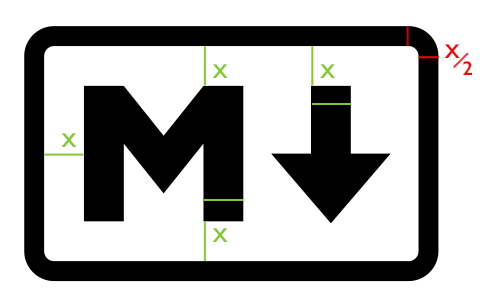

{ .center-image }
<H1 style="text-align: center;">CommonMark Spec</H1>


{ .center-image }
<H3 style="text-align: center;">John MacFarlane</H3>

[](https://creativecommons.org/licenses/by-sa/4.0/)

<div class="grid cards cols-3" markdown>

-   <span style="color: #009688">:material-information-outline:</span> **1. Introduction**
    [:octicons-arrow-right-24: View Spec](https://spec.commonmark.org/0.31.2/#introduction){ .md-button style="border-color: #009688; color: #009688" }

    *   [1.1 What is Markdown?](https://spec.commonmark.org/0.31.2/#what-is-markdown-)
    *   [1.2 Why is a spec needed?](https://spec.commonmark.org/0.31.2/#why-is-a-spec-needed-)
    *   [1.3 About this document](https://spec.commonmark.org/0.31.2/#about-this-document)

-   <span style="color: #0288d1">:material-book-open-variant:</span> **2. Preliminaries**
    [:octicons-arrow-right-24: View Spec](https://spec.commonmark.org/0.31.2/#preliminaries){ .md-button style="border-color: #0288d1; color: #0288d1" }

    *   [2.1 Characters and lines](https://spec.commonmark.org/0.31.2/#characters-and-lines)
    *   [2.2 Tabs](https://spec.commonmark.org/0.31.2/#tabs)
    *   [2.3 Insecure characters](https://spec.commonmark.org/0.31.2/#insecure-characters)
    *   [2.4 Backslash escapes](https://spec.commonmark.org/0.31.2/#backslash-escapes)
    *   [2.5 Entity and numeric references](https://spec.commonmark.org/0.31.2/#entity-and-numeric-character-references)

-   <span style="color: #388e3c">:material-layers-outline:</span> **3. Blocks and inlines**
    [:octicons-arrow-right-24: View Spec](https://spec.commonmark.org/0.31.2/#blocks-and-inlines){ .md-button style="border-color: #388e3c; color: #388e3c" }

    *   [3.1 Precedence](https://spec.commonmark.org/0.31.2/#precedence)
    *   [3.2 Container and leaf blocks](https://spec.commonmark.org/0.31.2/#container-blocks-and-leaf-blocks)

-   <span style="color: #ef6c00">:material-text-box-outline:</span> **4. Leaf blocks**
    [:octicons-arrow-right-24: View Spec](https://spec.commonmark.org/0.31.2/#leaf-blocks){ .md-button style="border-color: #ef6c00; color: #ef6c00" }

    *   [4.1 Thematic breaks](https://spec.commonmark.org/0.31.2/#thematic-breaks)
    *   [4.2 ATX headings](https://spec.commonmark.org/0.31.2/#atx-headings)
    *   [4.3 Setext headings](https://spec.commonmark.org/0.31.2/#setext-headings)
    *   [4.4 Indented code blocks](https://spec.commonmark.org/0.31.2/#indented-code-blocks)
    *   [4.5 Fenced code blocks](https://spec.commonmark.org/0.31.2/#fenced-code-blocks)
    *   [4.6 HTML blocks](https://spec.commonmark.org/0.31.2/#html-blocks)
    *   [4.7 Link definitions](https://spec.commonmark.org/0.31.2/#link-reference-definitions)
    *   [4.8 Paragraphs](https://spec.commonmark.org/0.31.2/#paragraphs)
    *   [4.9 Blank lines](https://spec.commonmark.org/0.31.2/#blank-lines)

-   <span style="color: #455a64">:material-format-list-bulleted-type:</span> **5. Container blocks**
    [:octicons-arrow-right-24: View Spec](https://spec.commonmark.org/0.31.2/#container-blocks){ .md-button style="border-color: #455a64; color: #455a64" }

    *   [5.1 Block quotes](https://spec.commonmark.org/0.31.2/#block-quotes)
    *   [5.2 List items](https://spec.commonmark.org/0.31.2/#list-items)
    *   [5.3 Lists](https://spec.commonmark.org/0.31.2/#lists)

-   <span style="color: #009688">:material-code-tags:</span> **6. Inlines**
    [:octicons-arrow-right-24: View Spec](https://spec.commonmark.org/0.31.2/#inlines){ .md-button style="border-color: #009688; color: #009688" }

    *   [6.1 Code spans](https://spec.commonmark.org/0.31.2/#code-spans)
    *   [6.2 Emphasis and strong emphasis](https://spec.commonmark.org/0.31.2/#emphasis-and-strong-emphasis)
    *   [6.3 Links](https://spec.commonmark.org/0.31.2/#links)
    *   [6.4 Images](https://spec.commonmark.org/0.31.2/#images)
    *   [6.5 Autolinks](https://spec.commonmark.org/0.31.2/#autolinks)
    *   [6.6 Raw HTML](https://spec.commonmark.org/0.31.2/#raw-html)
    *   [6.7 Hard line breaks](https://spec.commonmark.org/0.31.2/#hard-line-breaks)
    *   [6.8 Soft line breaks](https://spec.commonmark.org/0.31.2/#soft-line-breaks)
    *   [6.9 Textual content](https://spec.commonmark.org/0.31.2/#textual-content)

-   <span style="color: #455a64">:material-file-tree:</span> **Appendix**
    [:octicons-arrow-right-24: View Spec](https://spec.commonmark.org/0.31.2/#appendix-a-parsing-strategy){ .md-button style="border-color: #455a64; color: #455a64" }

    *   [Overview](https://spec.commonmark.org/0.31.2/#overview)
    *   [Phase 1: block structure](https://spec.commonmark.org/0.31.2/#phase-1-block-structure)
    *   [Phase 2: inline structure](https://spec.commonmark.org/0.31.2/#phase-2-inline-structure)

-   <span style="color: #ff9800">:material-home-circle:</span> **Zensical Start Page**
    [:octicons-arrow-right-24: Return to](MkDocs-Material-Start.md){ .md-button style="border-color: #ff9800; color: #ff9800" }

    Back to the project's main landing page.

-   <span style="color: #ff9800">:material-arrow-u-left-top:</span> **MkDocs-Material**
    [:octicons-arrow-right-24: Return to](index.md){ .md-button style="border-color: #ff9800; color: #ff9800" } 

    Back to the root documentation.

</div>

## Introduction

## What is Markdown?

!!! quote "Markdown"

    - Markdown is a plain text format for writing structured documents, based on conventions for indicating formatting in email and usenet posts. It was developed by John Gruber (with help from Aaron Swartz) and released in 2004 in the form of a [syntax description](https://daringfireball.net/projects/markdown/syntax) and a Perl script (`Markdown.pl`) for converting Markdown to HTML. In the next decade, dozens of implementations were developed in many languages. Some extended the original Markdown syntax with conventions for footnotes, tables, and other document elements. Some allowed Markdown documents to be rendered in formats other than HTML. Websites like Reddit, StackOverflow, and GitHub had millions of people using Markdown. And Markdown started to be used beyond the web, to author books, articles, slide shows, letters, and lecture notes.
    
    - What distinguishes Markdown from many other lightweight markup syntaxes, which are often easier to write, is its readability. As Gruber writes:
    
    - The overriding design goal for Markdown’s formatting syntax is to make it as readable    as possible. The idea is that a Markdown-formatted document should be publishable as is, as plain text, without looking like it’s been marked up with tags or formatting instructions. ([Daring Fireball: Markdown](https://daringfireball.net/projects/markdown/))
    
    

The point can be illustrated by comparing a sample of [AsciiDoc](https://asciidoc.org/) with an equivalent sample of Markdown.

<div class="admonition abstract">    <p class="admonition-title">A Sample of AsciiDoc. </p>
    ```asciidoc
    1. List item one.
    +
    List item one continued with a second paragraph followed by an
    Indented block.
    +
    .................
    $ ls *.sh
    $ mv *.sh ~/tmp
    .................
    +
    List item continued with a third paragraph.

    2. List item two continued with an open block.
    +
    --
    This paragraph is part of the preceding list item.

    a. This list is nested and does not require explicit item
    continuation.
    +
    This paragraph is part of the preceding list item.

    b. List item b.

    This paragraph belongs to item two of the outer list.
    --
    ```
    </div>

    And here is the equivalent in Markdown:

!!! example "The Equivalent in Markdown"

    1.  List item one.

        List item one continued with a second paragraph followed by an
        Indented block.

            $ ls *.sh
            $ mv *.sh ~/tmp

        List item continued with a third paragraph.

    2.  List item two continued with an open block.

        This paragraph is part of the preceding list item.

        a. This list is nested and does not require explicit item continuation.

           This paragraph is part of the preceding list item.

        b. List item b.

           This paragraph belongs to item two of the outer list.


</div>

## AT&amp;T

!!! quote "AsciiDoc v Markdown"

    - The AsciiDoc version is, arguably, easier to write. You don’t need to worry about indentation. 
    
    - But the Markdown version is much easier to read. 
    
    - The nesting of list items is apparent to the eye in the source, not just in the processed document.
    

## Why Is A Spec Needed?

!!! quote "Why is a spec needed?"

    **1.** John Gruber’s [canonical description of Markdown’s syntax](https://daringfireball.net/projects/markdown/syntax) does not specify the syntax unambiguously. Here are some examples of questions it does not answer:
    
    **1.1.** How much indentation is needed for a sublist? The spec says that continuation paragraphs need to be indented four spaces, but is not fully explicit about sublists. It is natural to think that they, too, must be indented four spaces, but `Markdown.pl` does not require that. This is hardly a “corner case,” and divergences between implementations on this issue often lead to surprises for users in real documents. (See [this comment by John Gruber](https://web.archive.org/web/20170611172104/http://article.gmane.org/gmane.text.markdown.general/1997).)
    
    **2.** Is a blank line needed before a block quote or heading? Most implementations do not require the blank line. However, this can lead to unexpected results in hard-wrapped text, and also to ambiguities in parsing (note that some implementations put the heading inside the blockquote, while others do not). (John Gruber has also spoken [in favor of requiring the blank lines](https://web.archive.org/web/20170611172104/http://article.gmane.org/gmane.text.markdown.general/2146).)
    
    **3.** Is a blank line needed before an indented code block? (`Markdown.pl` requires it, but this is not mentioned in the documentation, and some implementations do not require it.)
    
    ---
     
    There are some relevant comments by John Gruber [here](https://web.archive.org/web/20170611172104/http://article.gmane.org/gmane.text.markdown.general/2554).

    ---

    - In the absence of a spec, early implementers consulted `Markdown.pl` to resolve these ambiguities. But `Markdown.pl` was quite buggy, and gave manifestly bad results in many cases, so it was not a satisfactory replacement for a spec.
    
    - Because there is no unambiguous spec, implementations have converged considerably. As a result, users are often surprised to find that a document that renders one way on one system (say, a GitHub wiki) renders differently on another (say, converting to docbook using pandoc). To make matters worse, because nothing in Markdown counts as a “syntax error,” the divergence often isn’t discovered right away.
    

---

## About This Document

!!! quote "About This Document"

    **1.3** About this document.
    
    **1.3.1** This document attempts to specify Markdown syntax unambiguously. It contains many examples with side-by-side Markdown and HTML. These are intended to double as conformance tests. An accompanying  script  `spec_tests.py` can be used to run the tests against any Markdown program:
    
    ```
    python test/spec_tests.py --spec spec.txt --program PROGRAM
    ```
    
    **1.3.2** Since this document describes how Markdown is to be parsed into an abstract syntax tree, it would have made sense to use an abstract representation of the syntax tree instead of HTML. But HTML is capable of representing the structural distinctions we need to make, and the choice of HTML for the tests makes it possible to run the tests against an implementation without writing an abstract syntax tree renderer.
    
    ---
    
    **1.3.3** Note that not every feature of the HTML samples is mandated by the spec. For example, the spec says what counts as a link destination, but it doesn’t mandate that non-ASCII characters in the URL be percent-encoded. To use the automatic tests, implementers will need to provide a renderer that conforms to the expectations of the spec examples (percent-encoding non-ASCII characters in URLs). But a conforming implementation can use a different renderer and may choose not to percent-encode non-ASCII characters in URLs.
    

    ---
    
    **1.3.4** This document is generated from a text file, `spec.txt`, written in Markdown with a small extension for the side-by-side tests. The script `tools/makespec.py` can be used to convert `spec.txt` into HTML or CommonMark (which can then be converted into other formats).
    

---

### `→` Character is Used to Represent Tabs.

!!! quote "In the examples, the `→` character is used to represent tabs."

    **2.** Preliminaries
    
    **2.1** Characters and Lines
    
    - Any sequence of [characters](https://spec.commonmark.org/0.31.2/#character) is a valid CommonMark document.
    
    - A [character](https://spec.commonmark.org/0.31.2/#character) is a Unicode code point. Although some code points (for example, combining accents) do not correspond to characters in an intuitive sense, all code points count as characters for purposes of this spec.
    
    - This spec does not specify an encoding; it thinks of lines as composed of [characters](https://spec.commonmark.org/0.31.2/#character) rather than bytes. A conforming parser may be limited to a certain encoding.
    
    ---
    
    - A [line](https://spec.commonmark.org/0.31.2/#line) is a sequence of zero or more [characters](https://spec.commonmark.org/0.31.2/#character) other than line feed (`U+000A`) or carriage return (`U+000D`), followed by a [line ending](https://spec.commonmark.org/0.31.2/#line-ending) or by the end of file.
    
    - A [line ending](https://spec.commonmark.org/0.31.2/#line-ending) is a line feed (`U+000A`), a carriage return (`U+000D`) not followed by a line feed, or a carriage return and a following line feed.
    
    - A line containing no characters, or a line containing only spaces (`U+0020`) or tabs (`U+0009`), is called a [blank line](https://spec.commonmark.org/0.31.2/#blank-line).
    
    The following definitions of character classes will be used in this spec:
    
    - A [Unicode whitespace character](https://spec.commonmark.org/0.31.2/#unicode-whitespace-character) is a character in the Unicode `Zs` general category, or a tab (`U+0009`), line feed (`U+000A`), form feed (`U+000C`), or carriage return (`U+000D`).
    
    - [Unicode whitespace](https://spec.commonmark.org/0.31.2/#unicode-whitespace) is a sequence of one or more [Unicode whitespace characters](https://spec.commonmark.org/0.31.2/#unicode-whitespace-character).
    
    - A [tab](https://spec.commonmark.org/0.31.2/#tab) is `U+0009`.
    
    - A [space](https://spec.commonmark.org/0.31.2/#space) is `U+0020`.
    
    - An [ASCII control character](https://spec.commonmark.org/0.31.2/#ascii-control-character) is a character between `U+0000–1F` (both including) or `U+007F`.
    
    ---
    
    - An [ASCII punctuation character](https://spec.commonmark.org/0.31.2/#ascii-punctuation-character) is:
    `!`, `"`, `#`, `$`, `%`, `&`, `'`, `(`, `)`, `*`, `+`, `,`, `-`, `.`, `/`(U+0021–2F), `:`, `;`, `<`, `=`, `>`, `?`, `@` (U+003A–0040),
    `[`, `\`, `]`, `^`, `_`, `` ` `` (U+005B–0060), `{`, `|`, `}`, or `~` (U+007B–007E).
    
    - A [Unicode punctuation character](https://spec.commonmark.org/0.31.2/#unicode-punctuation-character) is a character in the Unicode `P` (puncuation) or `S` (symbol) general categories.
    
---

## Tabs

**2.2** Tabs in lines are not expanded to [spaces](https://spec.commonmark.org/0.31.2/#space). However, in contexts where spaces help to define block structure, tabs behave as if they were replaced by spaces with a tab stop of 4 characters.

Thus, for example, a tab can be used instead of four spaces in an indented code block. (Note, however, that internal tabs are passed through as literal tabs, not expanded to spaces.)

!!! quote "AsciiDoc v Markdown"

    The point can be illustrated by comparing a sample of <a href="https://asciidoc.org/">AsciiDoc</a> with an equivalent sample of Markdown.  Here is a sample of AsciiDoc from the AsciiDoc manual:
    
    1. List item one.
    +
    List item one continued with a second paragraph followed by an
    Indented block.
    +
    ............................
    $ ls *.sh
    $ mv *.sh ~/tmp
    ............................
    +
    List item continued with a third paragraph.
    
      2. List item two continued with an open block.
    +
    
        This paragraph is part of the preceding list item.

        a. This list is nested and does not require explicit item continuation.
        +
        
        This paragraph is part of the preceding list item. 
        b. List item b.
    
    This paragraph belongs to item two of the outer list.
    

### The Equivalent in Markdown:

!!! quote "AsciiDoc v Markdown"

    1.  List item one.
        List item one continued with a second paragraph followed by an
        Indented block.

            $ ls *.sh
            $ mv *.sh ~/tmp

        List item continued with a third paragraph.

    2.  List item two continued with an open block.
        This paragraph is part of the preceding list item.

        a.  This list is nested and does not require explicit item continuation.
            This paragraph is part of the preceding list item.

        b.  List item b.
        This paragraph belongs to item two of the outer list.


The AsciiDoc version is, arguably, easier to write. You don’t need to worry about indentation. But the Markdown version is much easier to read. The nesting of list items is apparent to the eye in the source, not just in the processed document.
