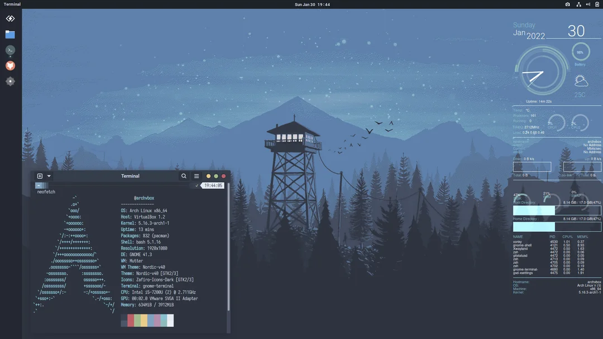

{: style="display: block; margin: 0 auto"}

 <H1 style="text-align: center;"> Arch OS Docs</H1>

---

### Contents

<div class="grid cards cols-3" markdown>

-   <span style="color: #2094f3">:material-thumb-up:</span> **Recommendation**
    [:octicons-arrow-right-24: View Recommendation](#recommendation){ .md-button style="border-color: #2094f3; color: #2094f3" }

    Our suggested setup and best practices for the best experience.

-   <span style="color: #2094f3">:material-cog-sync:</span> **Advanced Installation**
    [:octicons-arrow-right-24: View Setup](#advanced-installation){ .md-button style="border-color: #2094f3; color: #2094f3" }

    Deep dive into custom flags and complex environment configurations.

-   <span style="color: #2094f3">:material-star-circle:</span> **Features**
    [:octicons-arrow-right-24: View Features](#features){ .md-button style="border-color: #2094f3; color: #2094f3" }

    Explore the full list of capabilities and what this project can do.

-   <span style="color: #4caf50">:material-information-outline:</span> **Technical Information**
    [:octicons-arrow-right-24: View Info](#technical-information){ .md-button style="border-color: #4caf50; color: #4caf50" }

    Specifications, architecture details, and under-the-hood data.

-   <span style="color: #4caf50">:material-lifebuoy:</span> **Rescue & Recovery**
    [:octicons-arrow-right-24: View Rescue](#rescue-recovery){ .md-button style="border-color: #4caf50; color: #4caf50" }

    Essential tools and steps to recover your data or reset your state.

-   <span style="color: #4caf50">:material-tools:</span> **Troubleshooting**
    [:octicons-arrow-right-24: View Fixes](#troubleshooting){ .md-button style="border-color: #4caf50; color: #4caf50" }

    Solutions for common errors and frequently asked questions.

-   <span style="color: #ff9800">:material-xml:</span> **Development**
    [:octicons-arrow-right-24: View Dev](#development){ .md-button style="border-color: #ff9800; color: #ff9800" }

    Contribute to the project or build your own custom extensions.

-   <span style="color: #ff9800">:material-heart:</span> **Credits**
    [:octicons-arrow-right-24: View Credits](#credits){ .md-button style="border-color: #ff9800; color: #ff9800" }

    Acknowledgements for the contributors and tools that make this possible.

</div>


### Recommendation

{: style="display: block; margin: 0 auto"}


!!! info ""

    For a robust & stable Arch OS experience, install as few additional packages from the official [Arch Repository](https://archlinux.org/packages) or [AUR](https://aur.archlinux.org) as possible. Instead, use [Flatpak](https://flathub.org) or [GNOME Software](https://apps.gnome.org). Furthermore change system files only if absolutely necessary and perform regular package upgrades.
    
    ---
    
    - Arch OS System Manager: **`arch-os`**
    - System information: **`fetch`**
    - Update system: **`paru -Syu`**
    - Search package: **`paru -Ss <my search string>`**
    - Install package: **`paru -S <my package>`**
    - List installed packages: **`paru -Qe`**
    - Show package info: **`paru -Qi <my package>`**
    - Remove package: **`paru -Rsn <my package>`**
    
!!! abstract "NOTE"

    See `~/.aliases` for useful command aliases
    
    ---
    
    Add the following snippet to your ~/.bashrc (for Bash) or ~/.zshrc (for Zsh) to load your aliases automatically:
    
    ```yaml
    if [ -f ~/.aliases ]; then
        . ~/.aliases
    fi
    ```
    
    ---
    
    - System Update: alias update="sudo pacman -Syu"
    - List Files (detailed): alias ll="ls -alF"
    - View Hidden Files: alias la="ls -A"
    - Change to root user: alias root="sudo su -"
    - Display current IP: alias myip="ip -br -c a"
    - Display memory usage: alias mem="free -h"
    
### GNOME Shortcuts

!!! abstract "NOTE"

    Only available with default installation preset (desktop).
    
    - Close Window: **`Super + q`**
    - Hide Window: **`Super + h`**
    - Toggle Desktop: **`Super + d`**
    - Toggle Fullscreen: **`Super + F11`**
    
### Additional Packages (optional)

!!! abstract "NOTE"

    The target of the respective URL is also the recommended way to install the package.
    
<div class="grid cards cols-3" markdown>

-   <span style="color: #2094f3">:material-cog:</span> **Sys & Maintenance**
    { .md-button .md-button--primary style="border-color: #2094f3; color: #2094f3; background-color: transparent;" }

    * [Extension Manager](https://flathub.org)
    * [Flatseal](https://flathub.org)
    * [Warehouse](https://flathub.org)
    * [GNOME Tweaks](https://archlinux.org)
    * [Refine](https://flathub.org)
    * [GDM Settings](https://flathub.org)
    * [GNOME Firmware](https://archlinux.org)
    * [Ignition](https://flathub.org)
    * [Preload](https://wiki.archlinux.org)
    * [Mutter Performance](https://aur.archlinux.org)

-   <span style="color: #4caf50">:material-folder-zip:</span> **Files & Productivity**
    { .md-button .md-button--primary style="border-color: #4caf50; color: #4caf50; background-color: transparent;" }

    * [Pika Backup](https://flathub.org)
    * [LocalSend](https://flathub.org)
    * [File Roller](https://archlinux.org)
    * [Papers](https://flathub.org)
    * [Webapp Manager](https://aur.archlinux.org)
    * [Ferdium](https://flathub.org)
    * [Alpaca (AI)](https://flathub.org)
    * [Seahorse](https://archlinux.org)
    * [Dconf Editor](https://archlinux.org)
    * [Downgrade](https://aur.archlinux.org)

-   <span style="color: #ff9800">:material-palette:</span> **Media & Interface**
    { .md-button .md-button--primary style="border-color: #ff9800; color: #ff9800; background-color: transparent;" }

    * [EasyEffects](https://flathub.org)
    * [NoiseTorch](https://aur.archlinux.org)
    * [Amberol](https://archlinux.org) / [Gapless](https://flathub.org)
    * [Parabolic](https://flathub.org)
    * [Mission Center](https://flathub.org)
    * [Monitorets](https://flathub.org)
    * [AddWater (Firefox)](https://flathub.org)
    * [Folder Color](https://aur.archlinux.org)
    * [MenuLibre](https://aur.archlinux.org)

</div>

### Theming (optional)

<div class="grid cards cols-3" markdown>

-   <span style="color: #4caf50">:material-format-size:</span> **Desktop Font**
    [:octicons-arrow-right-24: View Packages](https://archlinux.org/packages/extra/any/inter-font/){ .md-button style="border-color: #4caf50; color: #4caf50" }

    Recommended fonts including Inter and Adwaita for a clean UI.

-   <span style="color: #2196f3">:material-palette:</span> **Desktop Theme**
    [:octicons-arrow-right-24: View Theme](https://github.com/lassekongo83/adw-gtk3){ .md-button style="border-color: #2196f3; color: #2196f3" }

    Adw-gtk3: Bringing the modern Libadwaita look to GTK3 applications.

-   <span style="color: #ff9800">:material-folder-outline:</span> **Icon Theme**
    [:octicons-arrow-right-24: View Icons](https://github.com/vinceliuice/Tela-icon-theme){ .md-button style="border-color: #ff9800; color: #ff9800" }

    Colorful and modern icon sets: Tela and Tela-circle themes.

</div>

<div class="grid cards cols-3" markdown>

-   <span style="color: #009688">:material-cursor-default:</span> **Cursor Theme**
    [:octicons-arrow-right-24: View Cursors](https://aur.archlinux.org/packages/bibata-cursor-theme-bin){ .md-button style="border-color: #009688; color: #009688" }

    Bibata and Nordzy cursor sets for precise and stylish navigation.

-   <span style="color: #66c0f4">:material-firefox:</span> **Firefox Theme**
    [:octicons-arrow-right-24: View Themes](https://github.com/rafaelmardojai/firefox-gnome-theme){ .md-button style="border-color: #66c0f4; color: #66c0f4" }

    GNOME-specific styling for Firefox via AddWater and native themes.

-   <span style="color: #4caf50">:material-puzzle:</span> **GTK3 Variant**
    [:octicons-arrow-right-24: View Extension](https://extensions.gnome.org/extension/8084/adw-gtk3-colorizer/){ .md-button style="border-color: #4caf50; color: #4caf50" }

    Adw-gtk3-colorizer: A GNOME extension to customize your GTK3 colors.

</div>


### GNOME Extensions (optional)

<div class="grid cards cols-3" markdown>

-   <span style="color: #2094f3">:material-palette-outline:</span> **UI & Visuals**
    { .md-button .md-button--primary style="border-color: #2094f3; color: #2094f3; background-color: transparent;" }

    * [Just Perfection](https://extensions.gnome.org)
    * [Blur My Shell](https://extensions.gnome.org)
    * [Open Bar](https://extensions.gnome.org)
    * [Weather O'Clock](https://extensions.gnome.org)
    * [App Hider](https://extensions.gnome.org)
    * [Lilypad](https://extensions.gnome.org)

-   <span style="color: #4caf50">:material-window-maximize:</span> **Workflow & Dock**
    { .md-button .md-button--primary style="border-color: #4caf50; color: #4caf50; background-color: transparent;" }

    * [Dash to Panel](https://extensions.gnome.org)
    * [Dash to Dock](https://extensions.gnome.org)
    * [Tiling Assistant](https://extensions.gnome.org)
    * [Hide Minimized](https://extensions.gnome.org)
    * [Happy Appy Hotkey](https://extensions.gnome.org)
    * [Fullscreen Workspace](https://extensions.gnome.org)

-   <span style="color: #ff9800">:material-pulse:</span> **System & Utils**
    { .md-button .md-button--primary style="border-color: #ff9800; color: #ff9800; background-color: transparent;" }

    * [Arch Update Indicator](https://extensions.gnome.org)
    * [AppIndicator Support](https://extensions.gnome.org)
    * [Caffeine](https://extensions.gnome.org)
    * [Vitals](https://extensions.gnome.org)
    * [System Monitor](https://extensions.gnome.org)
    * [Window Calls](https://extensions.gnome.org)

</div>


### Office Support

<div class="grid cards cols-3" markdown>

-   <span style="color: #4caf50">:material-office-building:</span> **LibreOffice**
    [:octicons-arrow-right-24: View Package](https://archlinux.org/packages/extra/x86_64/libreoffice-fresh/){ .md-button style="border-color: #4caf50; color: #4caf50" }

    The standard powerful, free, and open-source office suite.

-   <span style="color: #ff9800">:material-file-document-edit:</span> **OnlyOffice**
    [:octicons-arrow-right-24: View Flatpak](https://flathub.org/apps/org.onlyoffice.desktopeditors){ .md-button style="border-color: #ff9800; color: #ff9800" }

    High-compatibility Office Suite works with MS Office formats.

-   <span style="color: #2196f3">:material-brush:</span> **Drawing & SVG**
    [:octicons-arrow-right-24: View Drawing](https://flathub.org/apps/com.github.maoschanz.drawing){ .md-button style="border-color: #2196f3; color: #2196f3" }

    Tools for image editing and vector graphics with BoxySVG.

</div>


### Realtime Streaming to other PC, TV or Smart Device

<div class="grid cards cols-3" markdown>

-   <span style="color: #ffc107">:octicons-broadcast-24:</span> **Sunshine & Moonlight**
    [:octicons-arrow-right-24: View Sunshine](https://docs.lizardbyte.dev){ .md-button style="border-color: #ffc107; color: #ffc107" }

    Low-latency self-hosted game streaming server and client.

-   <span style="color: #5865f2">:octicons-hash-24:</span> **Vesktop**
    [:octicons-arrow-right-24: View Flatpak](https://flathub.org){ .md-button style="border-color: #5865f2; color: #5865f2" }

    Enhanced DC client with native Wayland screen sharing.

-   <span style="color: #4caf50">:material-controller:</span> **RetroDECK**
    [:octicons-arrow-right-24: View Docs](https://retrodeck.readthedocs.io){ .md-button style="border-color: #4caf50; color: #4caf50" }

    All-in-one manager for your entire retro gaming collection.

</div>


### Install Sunshine (Streaming Server)

!!! info "Sunshine Installation (Streaming Server)"

    1. Add the [LizardByte Repository](https://github.com) to your config: `sudo nano /etc/pacman.conf`
    
    ```ini
    [lizardbyte]
    SigLevel = Optional
    Server = https://github.com/releases/latest/download
    ```

    2. Install Sunshine: `sudo pacman -Syyu lizardbyte/sunshine`
    3. Start the application and access the Web Interface at [https://localhost:47990](https://localhost:47990) to set your credentials.


### For Developers

<div class="grid cards cols-3" markdown>

-   <span style="color: #607d8b">:material-package-variant:</span> **Distrobox & Toolbox**
    [:octicons-arrow-right-24: View Distrobox](https://distrobox.it/){ .md-button style="border-color: #607d8b; color: #607d8b" }

    Run any Linux distribution inside your terminal with ease.

-   <span style="color: #89b4fa">:material-docker:</span> **Container Runtimes**
    [:octicons-arrow-right-24: View Podman](https://podman.io){ .md-button style="border-color: #89b4fa; color: #89b4fa" }

    Industry standard runtimes including Podman and Docker.

-   <span style="color: #009688">:material-cube-outline:</span> **Virtualization & UI**
    [:octicons-arrow-right-24: View Boxes](https://archlinux.org/packages/extra/x86_64/gnome-boxes/){ .md-button style="border-color: #009688; color: #009688" }

    [Boxes](https://apps.gnome.org/Boxes), [Podman](https://podman-desktop.io/), [BoxBuddy](https://github.com/Dvlv/BoxBuddy) VM/Container management.

</div>


### For Gamers

<div class="grid cards cols-3" markdown>

-   <span style="color: #2196f3">:octicons-rocket-24:</span> **QEMU & Passthrough**
    [:octicons-arrow-right-24: View Wiki](https://wiki.archlinux.org/title/QEMU){ .md-button style="border-color: #2196f3; color: #2196f3" }

    Run Windows games with native GPU access using GPU Passthrough.

-   <span style="color: #4caf50">:octicons-zap-24:</span> **GameMode**
    [:octicons-arrow-right-24: View Wiki](https://wiki.archlinux.org/title/Gamemode){ .md-button style="border-color: #4caf50; color: #4caf50" }

    Optimize Linux performance on the fly with `gamemoderun <file>`.

-   <span style="color: #ffc107">:octicons-package-dependencies-24:</span> **Gaming Meta**
    [:octicons-arrow-right-24: View AUR](https://aur.archlinux.org/packages/lutris-wine-meta){ .md-button style="border-color: #ffc107; color: #ffc107" }

    Install `lutris-wine-meta` and `arch-gaming-meta` for essential libraries.

</div>


### Gaming Meta Package

<div class="grid cards cols-3" markdown>

-   <span style="color: #66c0f4">:octicons-download-24:</span> **Steam (Runtime)**
    [:octicons-arrow-right-24: View Package](https://github.com/ValveSoftware/steam-runtime){ .md-button style="border-color: #66c0f4; color: #66c0f4" }

    The [standard](https://wiki.archlinux.org/title/Steam) version. Best balance of performance and stability.

-   <span style="color: #4da5ff">:octicons-terminal-24:</span> **Steam Native**
    [:octicons-arrow-right-24: View AUR](https://aur.archlinux.org/packages/steam-native-runtime){ .md-button style="border-color: #4da5ff; color: #4da5ff" }

    Uses system [libraries](https://wiki.archlinux.org/title/Steam/Troubleshooting#Steam_runtime) instead of the Steam runtime for max performance.

-   <span style="color: #4caf50">:octicons-container-24:</span> **Steam Flatpak**
    [:octicons-arrow-right-24: View Flatpak](https://flathub.org/en/apps/com.valvesoftware.Steam){ .md-button style="border-color: #4caf50; color: #4caf50" }

    Sandboxed version for the best compatibility across distributions.

</div>


### Steam

!!! tip "Steam Theming"
    To make Steam match your GNOME desktop, install [AdwSteamGtk](https://flathub.org/apps/io.github.Foldex.AdwSteamGtk) and apply the Adwaita theme.


### Other Gaming Tools

<div class="grid cards cols-3" markdown>

-   <span style="color: #ff9800">:octicons-rocket-24:</span> **Lutris & Bottles**
    [:octicons-arrow-right-24: View Lutris](https://lutris.net/){ .md-button style="border-color: #ff9800; color: #ff9800" }

    [On github](https://github.com/aamaanaa/strinova-linux) for running Windows games via Wine & specialized environments.

-   <span style="color: #2196f3">:octicons-apps-24:</span> **Cartridges**
    [:octicons-arrow-right-24: View Flatpak](https://flathub.org/de/apps/page.kramo.Cartridges){ .md-button style="border-color: #2196f3; color: #2196f3" }

    A clean, modern GTK4 game launcher that brings all your libraries into one place.

-   <span style="color: #ffb300">:octicons-device-desktop-24:</span> **Retro & ScummVM**
    [:octicons-arrow-right-24: View RetroDeck](https://flathub.org/de/apps/net.retrodeck.retrodeck){ .md-button style="border-color: #ffb300; color: #ffb300" }

    All-in-one solutions for [retro](https://retrodeck.net/) gaming and classic point-and-click adventures. [ScummVM](https://www.scummvm.org/)

</div>

<div class="grid cards cols-3" markdown>

-   <span style="color: #66c0f4">:octicons-beaker-24:</span> **Wine & Proton**
    [:octicons-arrow-right-24: View Wine](https://archlinux.org/packages/extra/x86_64/wine/){ .md-button style="border-color: #66c0f4; color: #66c0f4" }

    Essential compatibility layers including Winetricks and GE-Proton builds. [Wine.](https://wiki.archlinux.org/title/Wine) [Proton.](https://github.com/ValveSoftware/Proton/)

-   <span style="color: #009688">:octicons-plus-circle-24:</span> **ProtonPlus & Tricks**
    [:octicons-arrow-right-24: View ProtonPlus](https://flathub.org/apps/com.vysp3r.ProtonPlus){ .md-button style="border-color: #009688; color: #009688" }

    Manage your Proton versions and prefixes with ease using these utility tools.

-   <span style="color: #607d8b">:octicons-tools-24:</span> **System Libraries**
    [:octicons-arrow-right-24: View Wiki](https://wiki.archlinux.org){ .md-button style="border-color: #607d8b; color: #607d8b" }

    Core dependencies and configurations required for high-performance gaming.

</div>

<div class="grid cards cols-3" markdown>

-   <span style="color: #4caf50">:octicons-graph-24:</span> **MangoHud**
    [:octicons-arrow-right-24: View Package](https://archlinux.org/packages/extra/x86_64/mangohud/){ .md-button style="border-color: #4caf50; color: #4caf50" }

    Vulkan and OpenGL overlay for monitoring FPS, temperatures, and CPU/GPU load.

-   <span style="color: #ffc107">:octicons-screen-full-24:</span> **Gamescope**
    [:octicons-arrow-right-24: View Package](https://archlinux.org/packages/extra/x86_64/gamescope/){ .md-button style="border-color: #ffc107; color: #ffc107" }

    SteamOS micro-compositor for improved scaling and low-latency gaming.

-   <span style="color: #2196f3">:octicons-hubot-24:</span> **Haguichi (Hamachi)**
    [:octicons-arrow-right-24: View Flatpak](https://flathub.org/apps/com.github.ztefn.haguichi){ .md-button style="border-color: #2196f3; color: #2196f3" }

    Easy-to-use VPN GUI for virtual LAN gaming with LogMeIn Hamachi.

</div>


### For Audiophiles

<div class="grid cards cols-3" markdown>

-   <span style="color: #00bcd4">:octicons-unmute-24:</span> **PipeWire Config**
    [:octicons-arrow-right-24: View Wiki](https://wiki.archlinux.org/title/PipeWire#Configuration){ .md-button style="border-color: #00bcd4; color: #00bcd4" }

    Advanced low-latency audio server configuration for Arch Linux.

-   <span style="color: #4caf50">:octicons-id-badge-24:</span> **AutoEq**
    [:octicons-arrow-right-24: View Project](https://autoeq.app/){ .md-button style="border-color: #4caf50; color: #4caf50" }

    Auto Headphone Equalization, [AutoEq](https://github.com/jaakkopasanen/AutoEq) for thousands of headphone models.

-   <span style="color: #ff9800">:material-tune-variant:</span> **EasyEffects**
    [:octicons-arrow-right-24: View Presets](https://github.com/wwmm/easyeffects/wiki/Community-presets){ .md-button style="border-color: #ff9800; color: #ff9800" }

    [EasyEffects](https://github.com/wwmm/easyeffects?tab=readme-ov-file) Community-driven presets for professional-grade audio processing.

</div>


## Advanced Installation

!!! info "Installer Configuration (`installer.conf`)"

    The `installer.conf` file is automatically generated on the first run (excluding your password for security). It updates with every setup change and acts as a preset for future installs.

    *   **Customization:** Edit this file to pre-configure your Arch OS installation.
    *   **Post-Install:** A copy of `installer.conf` and `installer.log` is moved to your new user's home directory.
    *   **Cleanup:** These files can be safely deleted or kept for future reference.

    See the [Example Installer Config](#example-installerconf) for a full property list.

### Example: `installer.conf`


??? info "installer.conf"

    - ARCH_OS_HOSTNAME='arch-os' # Hostname
    - ARCH_OS_USERNAME='tux' # User
    - ARCH_OS_DISK='/dev/sda' # Disk
    - ARCH_OS_BOOT_PARTITION='/dev/sda1' # Boot partition
    - ARCH_OS_ROOT_PARTITION='/dev/sda2' # Root partition
    - ARCH_OS_FILESYSTEM='btrfs' # Filesystem | Available: btrfs, ext4
    - ARCH_OS_BOOTLOADER='grub' # Bootloader | Available: grub, systemd
    - ARCH_OS_SNAPPER_ENABLED='true' # BTRFS Snapper enabled | Disable: false
    - ARCH_OS_ENCRYPTION_ENABLED='true' # Disk encryption | Disable: false
    - ARCH_OS_TIMEZONE='Europe/Berlin' # Timezone | Show available: ls /usr/share/zoneinfo/** | Example: Europe/Berlin
    <hr style="border: none; border-top: 1px solid #00b8d4; opacity: 0.8; margin: 15px 0;">
    
    - ARCH_OS_LOCALE_LANG='de_DE' # Locale | Show available: ls /usr/share/i18n/locales |Example: de_DE
    - ARCH_OS_LOCALE_GEN_LIST=('de_DE.UTF-8 UTF-8' 'de_DE ISO-8859-1' 'de_DE@euro ISO-8859-15' 'en_US.UTF-8 UTF-8') # Locale List | Show available: cat /etc/locale.gen
    - ARCH_OS_REFLECTOR_COUNTRY='Germany' # Country used by reflector | Default: null | Example: Germany,France
    - ARCH_OS_VCONSOLE_KEYMAP='de-latin1-nodeadkeys' # Console keymap | Show available: localectl list-keymaps | Example: de-latin1-nodeadkeys
    - ARCH_OS_VCONSOLE_FONT='' # Console font | Default: null | Show available: find /usr/share/kbd/consolefonts/*.psfu.gz | Example: eurlatgr
    - ARCH_OS_KERNEL='linux-zen' # Kernel | Default: linux-zen | Recommended: linux, linux-lts linux-zen, linux-hardened
    - ARCH_OS_MICROCODE='intel-ucode' # Microcode | Disable: none | Available: intel-ucode, amd-ucode
    - ARCH_OS_CORE_TWEAKS_ENABLED='true' # Arch OS Core Tweaks | Disable: false
    - ARCH_OS_MULTILIB_ENABLED='true' # MultiLib 32 Bit Support | Disable: false
    - ARCH_OS_AUR_HELPER='paru' # AUR Helper | Default: paru | Disable: none | Recommended: paru, yay, trizen, pikaur
    <hr style="border: none; border-top: 1px solid #00b8d4; opacity: 0.8; margin: 15px 0;">
    
    - ARCH_OS_BOOTSPLASH_ENABLED='true' # Bootsplash | Disable: false
    -ARCH_OS_HOUSEKEEPING_ENABLED='true'  # Housekeeping | Disable: false
    - ARCH_OS_MANAGER_ENABLED='true' # Arch OS Manager | Disable: false
    - ARCH_OS_SHELL_ENHANCEMENT_ENABLED='true' # Shell Enhancement | Disable: false
    -ARCH_OS_SHELL_ENHANCEMENT_FISH_ENABLED='true' # Enable fish shell | Default: true | Disable: false
    - ARCH_OS_DESKTOP_ENABLED='true' # Arch OS Desktop (caution: if disabled, only a minimal tty will be provied)| Disable: false
    - ARCH_OS_DESKTOP_GRAPHICS_DRIVER='amd' # Graphics Driver | Disable: none | Available: mesa, intel_i915, nvidia, amd, ati
    - ARCH_OS_DESKTOP_EXTRAS_ENABLED='true' # Enable desktop extra packages (caution: if disabled, only core + gnome + git packages will be installed) | Disable: false
    - ARCH_OS_DESKTOP_SLIM_ENABLED='true' # Enable Sim Desktop (only GNOME Core Apps) | Default: false
    - ARCH_OS_DESKTOP_KEYBOARD_MODEL='pc105' # X11 keyboard model | Default: pc105 | Show available: localectl list-x11-keymap-models
    <hr style="border: none; border-top: 1px solid #00b8d4; opacity: 0.8; margin: 15px 0;">
    
    - ARCH_OS_DESKTOP_KEYBOARD_LAYOUT='de' # X11 keyboard layout | Show available: localectl list-x11-keymap-layouts | Example: de
    - ARCH_OS_DESKTOP_KEYBOARD_VARIANT='nodeadkeys' # X11 keyboard variant | Default: null | Show available: localectl list-x11-keymap-variants | Example: nodeadkeys
    - ARCH_OS_SAMBA_SHARE_ENABLED='true' # Enable Samba public (anonymous) & home share (user) | Disable: false
    - ARCH_OS_VM_SUPPORT_ENABLED='true' # VM Support | Default: true | Disable: false
    - ARCH_OS_ECN_ENABLED='true' # Disable ECN support for legacy routers | Default: true | Disable: false
    
    
### Minimal Installation

??? info "Minimal Installation"

    Set these properties to install Arch OS Core only with minimal packages & configurations. This is the same as preset `core`:
    <hr style="border: none; border-top: 1px solid #00b8d4; opacity: 0.8; margin: 15px 0;">
    
    ```
    ARCH_OS_CORE_TWEAKS_ENABLED='false'
    ARCH_OS_BOOTSPLASH_ENABLED='false'
    ARCH_OS_DESKTOP_ENABLED='false'
    ARCH_OS_MULTILIB_ENABLED='false'
    ARCH_OS_HOUSEKEEPING_ENABLED='false'
    ARCH_OS_SHELL_ENHANCEMENT_ENABLED='false'
    ARCH_OS_AUR_HELPER='none'
    ```
    <hr style="border: none; border-top: 1px solid #00b8d4; opacity: 0.8; margin: 15px 0;">
    - If you want to disable VM support add
    ```
    `ARCH_OS_VM_SUPPORT_ENABLED='false'`
    ```
    
    !!! danger "NOTE"
        You will only be provided with a minimal tty after installation.
        
    
### Features

Each feature can be activated/deactivated during installation. Further information can be found in the individual feature headings.

### Core Tweaks

!!! info "Core Tweaks"

    Enable this feature with `ARCH_OS_CORE_TWEAKS_ENABLED='true'`:
    
    ---
    
    - `vm.max_map_count` is set to `1048576` for compatibility of some apps/games (default)
    
    - `quiet splash vt.global_cursor_default=0` is set to kernel parameters for silent boot
    
    - Pacman parallel downloads is set to `5`
    - Pacman colors and eyecandy is enabled
    - Sudo password feedback is enabled
    - Debug packages are disabled in `/etc/makepkg.conf`
    - Watchdog is disabled with kernel arg `nowatchdog` and blacklist: `/etc/modprobe.d/blacklist-watchdog.conf`
    
    !!! tip ""
    
        Disable this featuree with `ARCH_OS_CORE_TWEAKS_ENABLED='false'`
        
### Housekeeping

This feature will install and configure:

| Package        | Service              | Config                            | Description                                                            |
| -------------- | -------------------- | --------------------------------- | ---------------------------------------------------------------------- |
| reflector      | reflector.service    | /etc/xdg/reflector/reflector.conf | Rank & update the mirrorlist on every boot                             |
| pacman-contrib | paccache.timer       | none                              | Weekly clear the pacman cache                                          |
| pkgfile        | pkgfile-update.timer | none                              | Missing command suggestion and daily database update                   |
| smartmontools  | smartd               | none                              | Monitor storage devices                                                |
| irqbalance     | irqbalance.service   | none                              | Distribute hardware interrupts across processors on a multicore system |

Disable this feature with `ARCH_OS_HOUSEKEEPING_ENABLED='false'`

### Shell Enhancement


!!! quote ""
    - If the property `ARCH_OS_SHELL_ENHANCEMENT_ENABLED` is set to `true`, the following packages are installed and preconfigured (for root & user).
    
    - To keep `bash` as default shell, set `ARCH_OS_SHELL_ENHANCEMENT_FISH_ENABLED='false'`.
    
    ---

    **Package Dependencies:**

    === "Shell & CLI"
        :material-fish:{ style="color: #FF9F00" } [`fish`](https://fishshell.com/) &nbsp; :material-git:{ style="color: #F05032" } [`git`](https://git-scm.com/) &nbsp; :material-star:{ style="color: #F8D100" } [`starship`](https://github.com/murkl/starship-theme-arch-os) &nbsp; :material-folder-search:{ style="color: #4285F4" } [`fd`](https://github.com/sharkdp/fd) &nbsp; :material-magnify:{ style="color: #34A853" } [`fzf`](https://github.com/junegunn/fzf) &nbsp; :material-file-code:{ style="color: #FBBC05" } [`bat`](https://github.com/sharkdp/bat) &nbsp; :material-cached:{ style="color: #8E44AD" } [`zoxide`](https://github.com/ajeetdsouza/zoxide) &nbsp; :material-rocket-launch:{ style="color: #E74C3C" } [`fastfetch`](https://github.com/fastfetch-cli/fastfetch) &nbsp; :material-folder-zip:{ style="color: #3498DB" } [`mc`](https://github.com/MidnightCommander/mc) &nbsp; :material-cpu-64-bit:{ style="color: #2ECC71" } [`btop`](https://github.com/aristocratos/btop) &nbsp; :material-note-text:{ style="color: #95A5A6" } [`nano`](https://github.com/madnight/nano)

    === "System & Fonts"
        :material-book-open-variant:{ style="color: #BDC3C7" } [`man-db`](https://gitlab.com/man-db/man-db) &nbsp; :material-console:{ style="color: #FFFFFF" } [`bash-completion`](https://github.com/scop/bash-completion) &nbsp; :material-format-color-fill:{ style="color: #D35400" } [`nano-syntax-highlighting`](https://github.com/galenguyer/nano-syntax-highlighting) &nbsp; :material-format-size:{ style="color: #1ABC9C" } [`ttf-firacode-nerd`](https://archlinux.org/packages/extra/any/ttf-firacode-nerd) &nbsp; :material-emoticon-happy:{ style="color: #F1C40F" } [`ttf-nerd-fonts-symbols`](https://archlinux.org/packages/extra/any/ttf-nerd-fonts-symbols/)

---

<div class="grid cards cols-3" markdown>

-   <span style="color: #2196f3">:octicons-terminal-24:</span> **Shell & Prompt**
    [:octicons-arrow-right-24: View Theme](https://github.com/murkl/starship-theme-arch-os){ .md-button style="border-color: #2196f3; color: #2196f3" }

    `fish` is the default shell with a pre-configured `starship` prompt for a modern CLI experience.

-   <span style="color: #4caf50">:octicons-file-code-24:</span> **Modern CLI Tools**
    [:octicons-arrow-right-24: View eza](https://github.com/eza-community/eza){ .md-button style="border-color: #4caf50; color: #4caf50" }

    Standard tools are enhanced: `ls` is replaced by `eza`, and `man` pages are colorized via `bat`.

-   <span style="color: #ff9800">:octicons-info-24:</span> **System Info**
    [:octicons-arrow-right-24: View Fastfetch](https://github.com/fastfetch-cli/fastfetch){ .md-button style="border-color: #ff9800; color: #ff9800" }

    `fastfetch` provides instant system overview, while `nano` serves as the reliable default editor.

</div>

<div class="grid cards cols-3" markdown>

-   <span style="color: #9c27b0">:octicons-search-24:</span> **Navigation & Search**
    [:octicons-arrow-right-24: View zoxide](https://github.com/ajeetdsouza/zoxide){ .md-button style="border-color: #9c27b0; color: #9c27b0" }

    [ZSH-z](https://github.com/agkozak/zsh-z) smart directory jumping, [fd](https://github.com/sharkdp/fd) for fast searching, and `ll`/`la`/`lt` for listing files.

-   <span style="color: #ff9800">:octicons-cpu-24:</span> **System Management**
    [:octicons-arrow-right-24: View btop](https://github.com/aristocratos/btop){ .md-button style="border-color: #ff9800; color: #ff9800" }

    Run [fetch](https://github.com/jrmarino/fetch-freebsd) for info, [`btop`](https://github.com/aristocratos/btop) for task management, and `logs` to view system activity.

-   <span style="color: #607d8b">:octicons-file-directory-24:</span> **File Operations**
    [:octicons-arrow-right-24: View MC](https://midnight-commander.org){ .md-button style="border-color: #607d8b; color: #607d8b" }

    Open [mc](https://github.com/MidnightCommander/mc) for a dual-pane manager or use [`open <file>`](https://aur.archlinux.org/packages/open) to launch files in GNOME.

</div>

### Useful Terminal Keyboard Shortcuts

!!! tip "Keyboard Productivity"
    *   **`Tab`**: Autocomplete commands.
    *   **`Ctrl + r`**: Search command history.
    *   **`Alt + s`**: Run previous command as `sudo`.
    *   **`Alt + .`**: Paste the last parameter from previous command.

!!! example "Configuration File Paths"
    Detailed aliases and configurations can be found at these locations:

    *   **Aliases**: `~/.aliases`
    *   **Shells**: `~/.config/fish/config.fish` & `~/.bashrc`
    *   **Prompt**: `~/.config/starship.toml`
    *   **System Tools**: `~/.config/fastfetch/config.jsonc` & `~/.config/btop/btop.conf`
    *   **System Wide**: `/etc/nanorc` & `/etc/environment`


**Promt Theme [➜ Arch OS Starship Theme](https://github.com/murkl/starship-theme-arch-os)**

??? info "Starship Theme"

    - ***`fish`*** is set as default shell
    - ***`starship`*** is set as fancy default promt see `~/.config/fish/config.fish`
    - ***`ls`*** is replaced with colorful `eza` see `~/.aliases`
    <hr style="border: none; border-top: 1px solid #00b8d4; opacity: 0.8; margin: 15px 0;">
    - ***`man`*** is replaced with colorful `bat` see `~/.config/fish/config.fish`
    - ***`nano`*** is set as default editor
    - ***`fastfetch`*** is preconfigured as system info
    
### Useful Terminal Commands

??? info "Terminal Commands"

    - ***`help`*** open fish help in browser
    - ***`history`*** open command history
    - ***`fish`*** open fish shell (default)
    - ***`bash`*** switch to bash shell (go back to fish with `q`)
    - ***`fetch`*** show system info
    <hr style="border: none; border-top: 1px solid #00b8d4; opacity: 0.8; margin: 15px 0;">
    
    - ***`btop`*** show system manager
    - ***`logs`*** show system logs
    - ***`mc`*** open file manager
    - ***`fd`*** Alternative search
    <hr style="border: none; border-top: 1px solid #00b8d4; opacity: 0.8; margin: 15px 0;">
    
    - ***`z`*** Alternative cd (zoxide)
    - ***`ll`*** list files in dir
    - ***`la`*** list all files (+ hidden files) in dir
    - ***`lt`*** tree files in dir
    <hr style="border: none; border-top: 1px solid #00b8d4; opacity: 0.8; margin: 15px 0;">
    
    - ***`.`*** go back
    - ***`c`*** clear screen
    - ***`q`*** exit
    - ***`open <file>`*** open file in GNOME app
    
    !!! note "Note"
    
        See `~/.aliases` for all command aliases
        

### Configuration

??? pied-piper "Config Files" 

    These config files are created or modified during the Arch OS installation.

    <hr style="border: none; border-top: 1px solid #2B9B46; opacity: 0.3; margin: 15px 0;">
    
     # Aliases
     ~/.aliases
        
     # Bash config
     ~/.bashrc
          
     # Fish config
     ~/.config/fish/config.fish
         
     # Starship config
     ~/.config/starship.toml
    <hr style="border: none; border-top: 1px solid #2B9B46; opacity: 0.3; margin: 15px 0;">
    
     # Fastfetch config
     ~/.config/fastfetch/config.jsonc
    
     # Midnight Commander config
    ~/.config/mc/ini
    
     # Btop config
    ~/.config/btop/btop.conf
    <hr style="border: none; border-top: 1px solid #2B9B46; opacity: 0.3; margin: 15px 0;">
    
     # Nano config
     /etc/nanorc
    
     # Environment config
    /etc/environment
    
     # Open Fish web config
    fish_config
    
### Arch OS Manager

**GitHub Project ➜ [github.com/murkl/arch-os-manager](https://github.com/murkl/arch-os-manager)**


Install **➜ [archlinux-updates-indicator](https://extensions.gnome.org/extension/1010/)** and set this in extension options to integrate [Arch OS Manager](https://github.com/murkl/arch-os-manager):

- Check command: `/usr/bin/arch-os check`
- Update command: `arch-os --kitty upgrade`
- Package Manager (optional): `arch-os --kitty`

### Install Graphics Driver (manually)

Set the property `ARCH_OS_DESKTOP_GRAPHICS_DRIVER='none'` and install your graphics driver manually:

<div class="grid cards cols-3" markdown>

-   <span style="color: #607d8b">:material-package-variant:</span> **OpenGL**
    [:octicons-arrow-right-24: View OpenGL](https://wiki.archlinux.org/title/OpenGL){ .md-button style="border-color: #607d8b; color: #607d8b" }

    Dev of OpenGL ceased 2017 in favour of [Vulkan](https://wiki.archlinux.org/title/Vulkan).

-   <span style="color: #89b4fa">:material-docker:</span> **Intel HD**
    [:octicons-arrow-right-24: View Intel HD](https://wiki.archlinux.org/title/Intel_graphics#){ .md-button style="border-color: #89b4fa; color: #89b4fa" }

    Intel graphics are essentially plug-and-play.

-   <span style="color: #009688">:material-cube-outline:</span> **NVIDIA**
    [:octicons-arrow-right-24: View Nvidia](https://wiki.archlinux.org/title/NVIDIA#){ .md-button style="border-color: #009688; color: #009688" }

    Community open-source driver, see Nouveau.

</div>

<div class="grid cards cols-3" markdown>

-   <span style="color: #2196f3">:octicons-rocket-24:</span> **NVIDIA Optimus**
    [:octicons-arrow-right-24: View Arch Wiki](https://wiki.archlinux.org/title/NVIDIA_Optimus#){ .md-button style="border-color: #2196f3; color: #2196f3" }

    Tech allows Integrated GPU & Discrete NVIDIA GPU

-   <span style="color: #4caf50">:octicons-zap-24:</span> **AMDGPU**
    [:octicons-arrow-right-24: View Arch Wiki](https://wiki.archlinux.org/title/AMDGPU#){ .md-button style="border-color: #4caf50; color: #4caf50" }

    AMDGPU open source graphics driver.

-   <span style="color: #ffc107">:octicons-package-dependencies-24:</span> **ATI Legacy**
    [:octicons-arrow-right-24: View Arch Wiki](https://wiki.archlinux.org/title/ATI#){ .md-button style="border-color: #ffc107; color: #ffc107" }

    Open source driver which supports older AMD. 

</div>

### Tools

- [AMD LACT](https://archlinux.org/packages/extra/x86_64/lact-libadwaita/): Overclocking Tool

### VM Support

If the installation is executed in a VM (autodetected), the corresponding packages are installed.

Supported VMs:

- kvm
- vmware
- oracle
- microsoft

Disable this feature with `ARCH_OS_VM_SUPPORT_ENABLED='false'`

### Technical Information

Here are some technical information regarding the Arch OS Core installation.

### Partitions Layout

The partitions layout is seperated in two partitions:

1. **FAT32** partition (1 GiB), mounted at `/boot` as ESP
2. **EXT4/BTRFS** partition (rest of disk) optional with **LUKS2 encrypted container**, mounted at `/` as root

| Partition | Label                    | Size         | Mount | Filesystem                      |
| --------- | ------------------------ | ------------ | ----- | ------------------------------- |
| 1         | BOOT                     | 1 GiB        | /boot | FAT32                           |
| 2         | ROOT / BTRFS / cryptroot | Rest of disk | /     | EXT4/BTRFS + Encryption (LUKS2) |

### BTRFS

Great GUI for managing Snapshots: [AUR/btrfs-assistant](https://gitlab.com/btrfs-assistant/btrfs-assistant)

| Subvolume  | Mountpoint  | Description                            | Snapper Config            |
| ---------- | ----------- | -------------------------------------- | ------------------------- |
| @          | /           | Mount point for root                   | /etc/snapper/configs/root |
| @home      | /home       | Mount point for home                   | x                         |
| @snapshots | /.snapshots | Read-only snapshots created by snapper | x                         |

!!! note "NOTE"

    If `btrfs` as filesystem and `grub` as bootloader is selected, _OverlayFS_ is used and lets you overlay a writable layer on top of a read-only Btrfs snapshot, so changes are temporary and the original data stays untouched. It is enabled by adding `grub-btrfs-overlayfs` to the `HOOKS` array in `/etc/mkinitcpio.conf`.
    

| Package     | Service/Timer               | Description                                                          |
| ----------- | --------------------------- | -------------------------------------------------------------------- |
| grub-btrfs  | grub-btrfsd.service         | Automatically updates GRUB menu entries when Btrfs snapshots change. |
| btrfs-progs | btrfs-scrub@-.timer         | Schedules regular Btrfs scrub for the root filesystem.               |
| btrfs-progs | btrfs-scrub@home.timer      | Schedules regular Btrfs scrub for the /home subvolume.               |
| btrfs-progs | btrfs-scrub@snapshots.timer | Schedules regular Btrfs scrub for the /snapshots subvolume.          |
| snapper     | snapper-boot.timer          | Automatically creates a Btrfs snapshot at every system boot.         |
| snapper     | snapper-timeline.timer      | Automatically creates periodic Btrfs snapshots.                      |
| snapper     | snapper-cleanup.timer       | Cleans up old Btrfs snapshots based on retention policy.             |


!!! info "Installed Packages"

    These packages are installed:
    
    ```
    base-devel btrfs-progs efibootmgr inotify-tools
    grub grub-btrfs snapper snap-pac
    ```
    
!!! note "NOTE"

    By installing `snap-pac`, a Pacman hook is created that automatically generates Btrfs snapshots before and after each package transaction.
    
### Swap

As default, `zram-generator` is used to create swap with enhanced config.

You can edit the zram-generator default configuration in `/etc/systemd/zram-generator.conf` and to modify the enhanced kernel parameter in `/etc/sysctl.d/99-vm-zram-parameters.conf`

### Packages

!!! pied-piper "Packages"

    This group of packages will be installed during Arch OS Core Installation (~150 packages in total):
    
    ```
    base; base-devel; linux-firmware; zram-generator; networkmanager [kernel_pkg] [microcode_pkg]
    ```
    
### Services

!!! pied-piper "Services"

    
    These services will be enabled during Arch OS Core Installation:
    
    ---
    
    ```
    NetworkManager; fstrim.timer; systemd;-zram-setup@zram0.service; 
    systemd-oomd.service; systemd-boot-update.service; systemd-timesyncd.service
    ```
    
### Configuration

!!! quote ""
    This configuration will be set during Arch OS Core Installation:
    
    ---
    
    - Bootloader timeout is set to `0`
    - User is added to group `wheel` to use `sudo`
    
    !!! note "Note"
        The password (`ARCH_OS_PASSWORD`) is used for encryption (optional), root and user login and can be changed afterwards with `passwd` if necessary.
        

## Rescue & Recovery


!!! quote ""

    If you need to rescue your Arch OS in case of a crash, **boot from an Arch ISO device** and start the **[Arch OS Recovery](https://github.com/murkl/arch-os-recovery)**.
    
    ---
    
    ```
    curl -Ls bit.ly/arch-os-recovery | bash
    ```
    
### BTRFS Rollback - Manually

!!! quote "BTRFS Rollback - Manually"

    ```
    btrfs subvolume list /mnt/recovery # List BTRFS snapshots
    btrfs subvolume delete --recursive /mnt/recovery/@
    btrfs subvolume snapshot /mnt/recovery/@snapshots/<ID>/snapshot /mnt/recovery/@
    ```
    
### EXT4 Recovery - manually

!!! quote ""
    Follow these instructions to do this manually.
    
### 1. Disk Information

!!! pied-piper "Disk Information"

    - Show disk info: `lsblk`
    
    ---
    
    _**Example**_
    
    - _Example Disk: `/dev/sda`_
    - _Example Boot: `/dev/sda1`_
    - _Example Root: `/dev/sda2`_
    
### 2. Mount

!!! info "Mount"

    **Note:** _You may have to replace the example `/dev/sda` with your own disk_
    
    ---
    
    - Create mount dir: `mkdir -p /mnt/boot`
    - a) Mount root partition (disk encryption enabled):
        - `cryptsetup open /dev/sda2 cryptroot`
        - `mount /dev/mapper/cryptroot /mnt`
      
    - b) Mount root partition (disk encryption disabled):
        - `mount /dev/sda2 /mnt`
    - Mount boot partition: `mount /dev/sda1 /mnt/boot`
    
### 3. Chroot

!!! info "Chroot"

    - Enter chroot: `arch-chroot /mnt`
    - _Fix your Arch OS..._
    - Exit: `exit`
    
### Troubleshooting

!!! info "Troubleshooting"

    If an error occurs, see created `installer.log` for more details.
    
### Installation Failed

!!! info "Installation Failed"

    If you encounter problems with a server during Arch OS installation (`error: failed retrieving file` or related errors), remove this server from `/etc/pacman.d/mirrorlist` (Arch ISO) and run Arch OS Installer again.
    
### Example

!!! info "Example"

     # From booted Arch ISO:
     nano /etc/pacman.d/mirrorlist
    
    ---
    
    
    ```
    ....
    # Disable this server
    # Server = https://archlinux.thaller.ws/$repo/os/$arch
    Server = https://london.mirror.pkgbuild.com/$repo/os/$arch
    Server = https://mirror.ubrco.de/archlinux/$repo/os/$arch
    Server = https://mirror.f4st.host/archlinux/$repo/os/$arch
    ....
    ```
    
### Device is Busy

!!! info "Device is Busy"

    Try terminate all processes with:
    
    ```
    fuser -km /mnt
    ```
    
### Legacy Routers (ECN disabled)

!!! info "Legacy Routers"

    Set `ARCH_OS_ECN_ENABLED="false"` in Arch OS `installer.conf`.
    
### Downgrade a Package

!!! info "Downgrade a Package"

    ```
    paru -S downgrade
    sudo downgrade my_package_name
    ```
    
### Reset Pacman Keyring & Update

!!! info "Reset Pacman Keyring & Update"

    ```
    sudo rm -rf /etc/pacman.d/gnupg
    sudo pacman-key --init
    sudo pacman-key --populate
    
    # Do update
    sudo pacman -Sy archlinux-keyring && paru -Su
    ```
    
### Reset Pacman/AUR cache

!!! info "Reset Pacman/AUR cache"

    ```
    paru -Scc
    ```
    
### Development

!!! warning "Development"

    Create new pull request branches only from [main branch](https://github.com/murkl/arch-os/tree/main)! The [dev branch](https://github.com/murkl/arch-os/tree/dev) will be deleted after each merge into main.
    
    The Arch OS [dev branch](https://github.com/murkl/arch-os/tree/dev) can be broken, use only for testing!
    
    ```bash
    curl -Ls bit.ly/arch-os-dev | bash
    ```
    
### Parameter

!!! info "Parameter"

    ```
    # Set password:
    ARCH_OS_PASSWORD=mySecret123 ./installer.sh
        
    # Force install:
    FORCE=true ./installer.sh
        
    # Custom gum:
    GUM=/usr/bin/gum ./installer.sh
    
    # Debug Simulator:
    DEBUG=true ./installer.sh
    ```
    
### Credits

??? info "Credits"

    Many thanks for these projects and the people behind them!
    
    ---
    
    - Arch Linux
    - GNOME
    - Gum by charm
    

\[ y(0,t) = -a \sin(\omega t) \]
