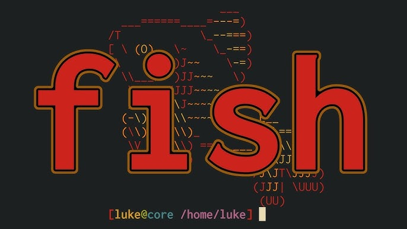

{ .center-image }

<div style="text-align: center;" markdown="1">

# [<u>Fish-Shell</u>](https://fishshell.com)

</div>

!!! abstract "The official website for the friendly interactive shell. These contents are hosted at [Fishshell](https://fishshell.com)."

    ### [<u>Fish-Shell</u>](https://fishshell.com)
    
    - Contributions to fish shell documentation are very welcome.
    - However, the contents of the docs in particular are derived from the [fish-shell](https://github.com/fish-shell/fish-shell/) repository.
    - Please direct pull requests concerned with fish shell documentation to that repo (see the doc\_src directory).
    - If you've read the above and would like to help hack on the site, turn to page [CONTRIBUTING.md](https://github.com/fish-shell/fish-site/blob/master/CONTRIBUTING.md)!


!!! pied-piper "Fish"

    - Fish is a smart and user-friendly command line shell for macOS, Linux, and the rest of the family. Fish includes features like syntax highlighting, autosuggest-as-you-type, and fancy tab completions that just work, with no configuration required.
    

    ---

    - For downloads, screenshots and more, [Fish-Shell](https://fishshell.com). [Quick Start](https://fishshell.com/docs/current/tutorial.html#getting-started)
    
    ---
    
    - Fish generally works like other shells, like bash or zsh. A few important differences can be found at [Tutorial](https://fishshell.com/docs/current/tutorial.html) by searching for the magic phrase “unlike other shells”.
    
!!! desc ""
    Detailed user documentation is available by running ``help`` within fish, and also at [Detailed User Documentation](https://fishshell.com/docs/current/index.html)
    
!!! git "A few links for Linux and Homebrew All others at [Fish-Shell](https://fishshell.com)"

    #### Getting Fish.
    
<div align="center">

<!-- Row 1 -->
<!-- Ubuntu Box -->
<div style="display: inline-block; border: 1px solid #444; border-radius: 6px; padding: 15px; margin: 5px; width: 28%; min-width: 200px; vertical-align: top; min-height: 200px;">
  <br><br>
  <a href="https://launchpad.net">Subscribe</a> or <a href="https://launchpad.net/+packages">Download</a>
</div>
<!-- Debian Box -->
<div style="display: inline-block; border: 1px solid #444; border-radius: 6px; padding: 15px; margin: 5px; width: 28%; min-width: 200px; vertical-align: top; min-height: 200px;">
  <br><br>
  <a href="https://www.debian.org/">Subscribe</a> or <a href="https://download.opensuse.org/repositories/shells:/fish/">Download</a>
</div>
<div style="display: inline-block; border: 1px solid #444; border-radius: 6px; padding: 15px; margin: 5px; width: 28%; min-width: 200px; vertical-align: top; min-height: 200px;">
  <br><br>
  <a href="https://packages.fedoraproject.org/pkgs/fish/fish/">Packages</a><br>
  <code>dnf install fish</code>
</div>

<!-- Row 2 -->
<div style="display: inline-block; border: 1px solid #444; border-radius: 6px; padding: 15px; margin: 5px; width: 28%; min-width: 200px; vertical-align: top; min-height: 200px;">
  <br><br>
  <a href="https://software.opensuse.org/download.html?project=shells%3Afish%3Arelease%3A4&package=fish">Subscribe or Download</a>
</div>
<div style="display: inline-block; border: 1px solid #444; border-radius: 6px; padding: 15px; margin: 5px; width: 28%; min-width: 200px; vertical-align: top; min-height: 200px;" align="center">
  
  <!-- CentOS Logo for Light Mode (Black Text) -->
  

  <!-- CentOS Logo for Dark Mode (White Text) -->
  

  <br><br>
  <a href="https://software.opensuse.org/download.html?project=shells%3Afish%3Arelease%3A3&package=fish">
    Subscribe or Download
  </a>
</div>
<div style="display: inline-block; border: 1px solid #444; border-radius: 6px; padding: 15px; margin: 5px; width: 28%; min-width: 200px; vertical-align: top; min-height: 200px;">
  <br><br>
  <a href="https://www.archlinux.org/packages/extra/x86_64/fish/">Packages</a><br>
  <code>pacman -S fish</code>
</div>

<!-- Row 3 -->
<div style="display: inline-block; border: 1px solid #444; border-radius: 6px; padding: 15px; margin: 5px; width: 28%; min-width: 200px; vertical-align: top; min-height: 200px;">
  <br><br>
  <a href="https://gentoo.org">Packages</a><br>
  <code>emerge fish</code>
</div>
<div style="display: inline-block; border: 1px solid #444; border-radius: 6px; padding: 15px; margin: 5px; width: 28%; min-width: 200px; vertical-align: top; min-height: 200px;">
  <br><br>
  <a href="https://github.com/void-linux/void-packages/tree/master/srcpkgs/fish-shell">Packages</a><br>
  <code>xbps-install</code>
</div>

<div style="display: inline-block; border: 1px solid #444; border-radius: 6px; padding: 15px; margin: 5px; width: 28%; min-width: 200px; vertical-align: top; min-height: 200px;" align="center">
  
  <!-- NixOS Logo for Light Mode -->
  

  <!-- NixOS Logo for Dark Mode -->
  

  <br><br>
  <a href="https://search.nixos.org/packages?show=fish">Packages</a><br>
  <code>nix-env -i fish</code>
</div>

<!-- Row 4 -->
<style>
  /* This targets ONLY the logo in this box */
  [data-md-color-scheme="slate"] .guix-logo-toggle {
    filter: invert(1) hue-rotate(180deg) brightness(1.5);
  }
</style>

<div style="display: inline-block; border: 1px solid #444; border-radius: 6px; padding: 15px; margin: 5px; width: 28%; min-width: 200px; vertical-align: top; min-height: 200px;" align="center">
  
  

  <br><br>
  <a href="https://hpc.guix.info/package/fish">Packages</a><br>
  <code>guix-pkg -i fish</code>
</div>

<div style="display: inline-block; border: 1px solid #444; border-radius: 6px; padding: 15px; margin: 5px; width: 28%; min-width: 200px; vertical-align: top; min-height: 200px;">
  <br><br>
  <a href="https://github.com/getsolus/packages/tree/main/packages/f/fish">Solus Packages</a><br>
  <code>eopkg install fish</code>
</div>
<div style="display: inline-block; border: 1px solid #444; border-radius: 6px; padding: 15px; margin: 5px; width: 28%; min-width: 200px; vertical-align: top; min-height: 200px;">
  <br><br>
  <a href="https://github.com/Homebrew/homebrew-core/blob/master/Formula/f/fish.rb">Homebrew</a><br>
  <code>brew install fish</code>
</div>

</div>

## Packages for Linux

### Installation Methods

!!! info "Installation Methods"

    * **Using Distribution's Package Manager:**
    * **Debian/Ubuntu:**
    
    !!! desc "Debian/Ubuntu"
        ```bash
        sudo apt update
        ```
        
        ```bash
        sudo apt install fish
        ```
    
    * **Fedora:**
    
    !!! desc "Fedora"
        ```bash
        sudo dnf install fish
        ```
    
    * **Arch Linux:**
    
    !!! desc "Arch Linux"
        ```bash
        sudo pacman -S fish
        ```
    
---

### Alternative Repositories

!!! ex "Alternative Repositories"

    - Packages for Debian, Fedora, openSUSE, and Red Hat Enterprise Linux/CentOS are available from the [openSUSE BuildService](https://opensuse.org).
    
    - Packages for Ubuntu are available from the [fish PPA](https://launchpad.net) and can be installed using:
    
    ```bash
    sudo apt-add-repository ppa:fish-shell/release-4
    ```
    
    ```bash
    sudo apt update
    ```
    
    ```bash
    sudo apt install fish
    ```
    
    !!! info "Other Distro's"
        Instructions for other distributions may be found at [fishshell.com](https://fishshell.com).
        
    
### Windows

!!! pied-piper "Windows"

    -  On Windows 10/11, fish can be installed under the WSL Windows Subsystem for Linux with the instructions for the appropriate distribution listed above under “Packages for Linux”, or from source with the instructions below.
    
    -  Fish can also be installed on all versions of Windows using [Cygwin](https://cygwin.com/) or [MSYS2](https://github.com/Berrysoft/fish-msys2).
    
### Building from Source

!!! desc "Building from Source:"

    If packages are not available for your platform, GPG-signed tarballs are available from [FishShell](https://fishshell.com/) and fish-shell on [GitHub](https://github.com/fish-shell/fish-shell/releases). See the `Building <#building>`_ section for instructions.
    
    ---
    
    - Running fish
    
    Once installed, run ``fish`` from your current shell to try fish out!
    
    - Dependencies
    
    ---
    
    Running fish requires:
    
    -  some common \*nix system utilities (currently ``mktemp``), in addition to the basic POSIX utilities (``cat``, ``cut``, ``dirname``, ``ls``, ``mkdir``, ``mkfifo``, ``rm``, ``sh``, ``sort``, ``tee``, ``tr``, ``uname`` and ``sed`` at least, but the full coreutils plus ``find`` and ``awk`` is preferred)
    
    - The following optional features also have specific requirements:
    
    -  builtin commands that have the ``--help`` option or print usage messages require ``man`` for display
    -  automated completion generation from manual pages requires Python 3.5+
    -  the ``fish_config`` web configuration tool requires Python 3.5+ and a web browser
    -  the :ref:`alt-o <shared-binds-alt-o>` binding requires the ``file`` program.
    -  system clipboard integration (with the default Ctrl-V and Ctrl-X bindings) require either the ``xsel``, ``xclip``,  ``wl-copy``/``wl-paste`` or ``pbcopy``/``pbpaste`` utilities
    -  full completions for ``yarn`` and ``npm`` require the ``all-the-package-names`` NPM module
    -  ``colorls`` is used, if installed, to add color when running ``ls`` on platforms that do not have color support (such as OpenBSD)
    
!!! info "Building and Dependencies"

    ### Building and Dependencies
    
    ---
    
    Building:
    
    - Dependencies
    
    Compiling fish requires:
    
    -  Rust (version 1.85 or later)
    -  CMake (version 3.15 or later)
    -  a C compiler (for system feature detection and the test helper binary)
    -  PCRE2 (headers and libraries) - optional, this will be downloaded if missing
    -  gettext (only the msgfmt tool) - optional, for translation support
    -  an Internet connection, as other dependencies will be downloaded automatically
    
    ---
    
    Sphinx is also optionally required to build the documentation from a cloned git repository.
    
    Additionally, running the full test suite requires diff, git, Python 3.5+, pexpect, less, tmux and wget.
    
    Building from source with CMake
    
    Rather than building from source, consider using a packaged build for your platform. Using the steps below makes fish difficult to uninstall or upgrade. Release packages are available from the links above, and up-to-date development builds of fish are available for many platforms [Development-builds](https://github.com/fish-shell/fish-shell/wiki/Development-builds)
    
    ---
    
    To install into ``/usr/local``, run:
    
    ```bash
    mkdir build; cd build
    cmake ..
    cmake --build .
    sudo cmake --install .
    ```
    
    The install directory can be changed using the ``-DCMAKE_INSTALL_PREFIX`` parameter for ``cmake``.
    
### CMake Build Options

!!! info "CMake Build Options"

    In addition to the normal CMake build options (like ``CMAKE_INSTALL_PREFIX``), fish's CMake build has some other options available to customize it.
    
    - Rust_COMPILER=path - the path to rustc. If not set, cmake will check $PATH and ~/.cargo/bin
    - Rust_CARGO=path - the path to cargo. If not set, cmake will check $PATH and ~/.cargo/bin
    - Rust_CARGO_TARGET=target - the target to pass to cargo. Set this for cross-compilation.
    - BUILD_DOCS=ON|OFF - whether to build the documentation. This is automatically set to OFF when Sphinx isn't installed.
    - INSTALL_DOCS=ON|OFF - whether to install the docs. This is automatically set to on when BUILD_DOCS is or prebuilt documentation is available (like when building in-tree from a tarball).
    - FISH_USE_SYSTEM_PCRE2=ON|OFF - whether to use an installed pcre2. This is normally autodetected.
    - MAC_CODESIGN_ID=String|OFF - the codesign ID to use on Mac, or "OFF" to disable codesigning.
    - WITH_GETTEXT=ON|OFF - whether to include translations.
    - extra_functionsdir, extra_completionsdir and extra_confdir - to compile in an additional directory to be searched for functions, completions and configuration snippets
    
### Building fish with Cargo

!!! info "Building fish with Cargo"

    - You can also build fish with Cargo.
    
    This example uses [UV](https://github.com/astral-sh/uv) to install Sphinx (which is used for man-pages and ``--help`` options).
    
    You can also install Sphinx another way and drop the ``uv run --no-managed-python`` prefix.
    
    ```bash
    git clone https://github.com/fish-shell/fish-shell
    cd fish-shell
    
    # Optional: check out a specific version rather than building the latest
    # development version.
    git checkout "$(git for-each-ref refs/tags/ | awk '$2 == "tag" { print $3 }' | tail -1)"
    
    uv run --no-managed-python \
        cargo install --path .
    ```
    
    - This will place standalone binaries in ``~/.cargo/bin/``, but you can move them wherever you want.
    
    ---
    
    - To disable translations, disable the ``localize-messages`` feature by passing ``--no-default-features --features=embed-data`` to cargo.
    
    - You can also link this build statically (but not against glibc) and move it to other computers.
    
    ---
    
    Here are the remaining advantages of a full installation, as currently done by CMake:
    
    - Man pages like ``fish(1)`` installed in standard locations, easily accessible from outside fish.
    - A local copy of the HTML documentation, typically accessed via the ``help`` fish function. In Cargo builds, ``help`` will redirect to [Docs Current](https://fishshell.com/docs/current/)
    - Ability to use our CMake options extra_functionsdir, extra_completionsdir and extra_confdir, (also recorded in ``$PREFIX/share/pkgconfig/fish.pc``) which are used by some package managers to house third-party completions.
    
    - Regardless of build system, fish uses ``$XDG_DATA_DIRS/{vendor_completion.d,vendor_conf.d,vendor_functions.d}``.
    
### Contributing Changes to the Code


See the `Guide for Developers: CONTRIBUTING.rst` [Contributing Guidelines](https://github.com/fish-shell/fish-site/blob/master/CONTRIBUTING.md)

#### Contact Us

Questions, comments, rants and raves can be posted to the official fish mailing list at https://lists.sourceforge.net/lists/listinfo/fish-users or join us on our [matrix channel](https://matrix.to/#/#fish-shell:matrix.org). Or use the [Fish tag on Unix & Linux Stack exchange](https://unix.stackexchange.com/questions/tagged/fish).

!!! desc ""
    There is also a fish tag on Stackoverflow, but it is typically a poor fit.
    
!!! bug "Found a Bug?"
    Found a bug? Have an awesome idea? Please [Open an Issue](https://github.com/fish-shell/fish-shell/issues/new).
    
[Build Status Image]( https://github.com/fish-shell/fish-shell/tree/master/.github/workflows) [Target]( https://github.com/fish-shell/fish-shell/actions)

---

<iframe width="560" height="315" src="https://www.youtube.com/embed/D0RvVkebVSY?si=3OK5LigtjKqFPEzL" title="YouTube video player" frameborder="0" allow="accelerometer; autoplay; clipboard-write; encrypted-media; gyroscope; picture-in-picture; web-share" referrerpolicy="strict-origin-when-cross-origin" allowfullscreen></iframe>