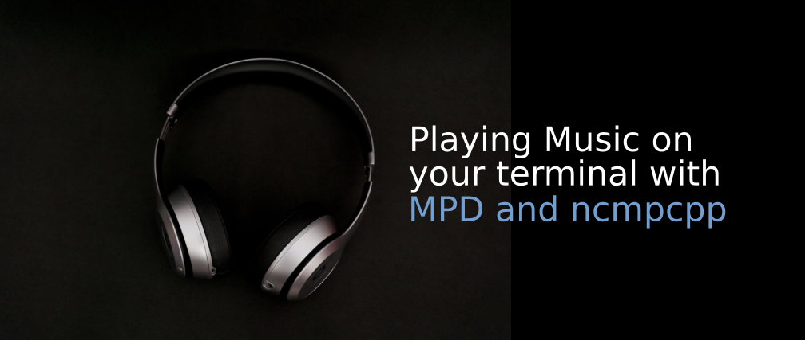

{: style="display: block; margin: 0 auto"}
<H2 style="text-align: center;">ncmpcpp++ Keys & Movement Cheat Sheet [List]</H2>

This document outlines common keybindings for navigating and controlling `ncmpcpp`, presented in a simple list format to avoid display issues.

## Keys - Movement

!!! pied-piper "keys - Movement"

    

    -   `Up` / `k` - Move cursor up
    -   `[` - Move cursor up one album
    -   `{` - Move cursor up one artist
    -   `Page Up` - Page up
    -   `Home` - Home
    -   `Tab` - Next screen

    -   `Down` / `j` - Move cursor down
    -   `]` - Move cursor down one album
    -   `}` - Move cursor down one artist
    -   `Page Down` - Page down
    -   `End` - End
    -   `Shift-Tab` - Previous screen

    

## Screen Switching

!!! tip "Screen Switching"

    

    - `F1` - Show help
    - `1` - Show playlist
    - `2` - Show browser
    - `3` - Show search engine
    - `4` - Show media library
    - `5` - Show playlist editor

    - `6` - Show tag editor
    - `7` - Show outputs
    - `8` - Show music visualizer
    - `=` - Show clock
    - `@` - Show server info

    

## Keys - Global Control & Settings

!!! info "Keys - Global Control & Settings"

    

    - `s` - Stop
    - `p` - Pause
    - `>` - Next track
    - `<` - Previous track
    - `Ctrl-H` / `Backspace` - Replay
    - `f` - Seek forward
    - `b` - Seek backward
    - `-` / `Left` - Vol Down (2%)
    - `+` / `Right` - Vol Up (2%)
    - `t` - Toggle space mode
    - `T` - Toggle add mode
    - `|` - Mouse support
    - `v` - Reverse selection
    - `V` - Remove selection

    - `B` - Select album
    - `a` - Add to playlist
    - `` ` `` - Add random
    - `r` - Repeat mode
    - `z` - Random mode
    - `y` - Single mode
    - `R` - Consume mode
    - `Y` - Replay gain
    - `#` - Bitrate visibility
    - `Z` - Shuffle playlist

    

!!! info "Keys - Global Control & Settings (cont.)"

    

    - `x` - Crossfade mode
    - `X` - Set crossfade
    - `u` - DB update
    - `:` - Execute command
    - `Ctrl-F` - Filter
    - `/` - Find forward
    - `?` - Find backward
    - `,` - Previous match
    - `.` - Next match

    - `w` - Find mode
    - `G` - Locate browser
    - `~` - Locate library
    - `Ctrl-L` - Lock screen
    - `Left` / `h` - Master screen
    - `Right` / `l` - Slave screen
    - `E` - Tag editor
    - `P` - Display mode
    - `\` - Toggle UI
    - `!` - Toggle separators
    - `g` - Jump to position
    - `i` - Song info
    - `I` - Artist info
    - `L` - Lyrics fetcher
    - `F` - Background lyrics
    - `q` - Quit

    

## Keys - Playlist Screen

!!! info "Keys - Playlist Screen"

    

    - `Enter` - Play selected item
    - `Delete` - Delete item(s)
    - `c` - Clear playlist
    - `C` - Clear except selected
    - `Ctrl-P` - Set priority
    - `Ctrl-K m` - Move item(s) up
    - `n Ctrl-J` - Move item(s) down
    - `M` - Move to cursor

    - `A` - Add item to playlist
    - `e` - Edit song
    - `S` - Save playlist
    - `Ctrl-V` - Sort playlist
    - `Ctrl-R` - Reverse playlist
    - `o` - Jump to current song
    - `U` - Toggle song centering

    

## Keys - Browser & Media Library

!!! info "Keys - Browser & Media Library"

    *(Note: Many keys overlap between these screens.)*

    

    - `Enter` - Enter dir / Play item
    - `Space` - Add item / Select
    - `e` - Edit song/dir/playlist
    - `Left` / `h` - Previous column
    - `Right` / `l` - Next column
    - `Ctrl-H` / `Backsp` - Parent dir
    - `Delete` - Delete from disk/PE

    - `2` - Browse MPD/Local (Browser)
    - `` ` `` - Toggle sort (Browser)
    - `4` - 2/3 column mode (ML)
    - `o` - Locate playing song (Browser)
    - `G` - Jump to editor (Browser)

    

## Keys - Search Engine

!!! tip "Keys - Search Engine"

    

    - `Enter` - Play / Change option
    - `Space` - Add to playlist
    - `e` - Edit song

    - `y` - Start searching
    - `3` - Reset search constraints

    

    
## Keys - Lyrics

!!! tip "Keys - Lyrics"

    

    - `Space` - Toggle auto-reload
    - `e` - Open in external editor
    - `` ` `` - Refetch lyrics

    

## Keys - Tag Editors

!!! info "Keys - Tag Editors"

    

    - `Enter` - Edit tag / Perform op
    - `y` - Save (Tiny editor)
    - `Space` - Switch views / Select

    - `Left` / `h` - Previous column
    - `Right` / `l` - Next column
    - `Ctrl-H` / `Backsp` - Parent dir

    

