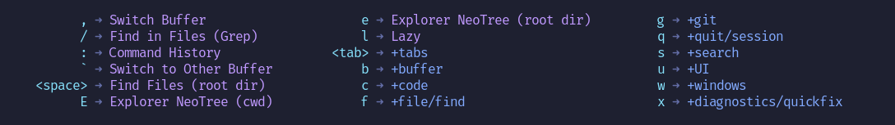

<h4 align="center">
  <a href="https://lazyvim.github.io/installation">Install</a>
  ·
  <a href="https://lazyvim.github.io/configuration">Configure</a>
  ·
  <a href="https://lazyvim.github.io">Docs</a>
</h4>

<div align="center"><p>
    <a href="https://github.com/LazyVim/LazyVim/releases/latest">
      
    </a>
    <a href="https://github.com/LazyVim/LazyVim/pulse">
      
    </a>
    <a href="https://github.com/LazyVim/LazyVim/blob/main/LICENSE">
      
    </a>
    <a href="https://github.com/LazyVim/LazyVim/stargazers">
      
    </a>
    <a href="https://github.com/LazyVim/LazyVim/issues">
      
    </a>
    <a href="https://github.com/LazyVim/LazyVim">
      
    </a>
    <a href="https://twitter.com/intent/follow?screen_name=folke">
      
    </a>
</div>

<H1 style="text-align: center;">Migrating from LunarVim to LazyVim</H1>


### Background

!!! desc "Background"

    - LunarVim served well as a terminal-based, low-maintenance-ish IDE for Markdown, HTML, and general editing, but active maintenance has slowed significantly, with core maintainers moving on to other projects. After evaluating alternatives, [LazyVim](https://github.com/LazyVim/LazyVim) was chosen as the replacement — actively maintained, large community, easy to source support for.
    
    - System: Arch Linux, GNOME Shell, Wayland. Neovim 0.12.5 already installed (well above LazyVim's minimum of 0.9), along with git, ripgrep, fd, and gcc.
    

## Part 1 — Removing LunarVim

!!! abstract "Part 1 — Removing LunarVim"

    LunarVim's own uninstaller (fetched fresh, since a local copy wasn't present on this install) proved unreliable — it uses `set -eo pipefail`, and its `command -v lvim` lookup fails silently if `lvim` isn't on `PATH` in a non-interactive shell, killing the script before it reaches the actual directory-removal step. Manual cleanup was more reliable:
    
    ```bash
    # Confirm nothing worth keeping in the config first, then remove
    # LunarVim's directories directly (no sudo needed — all under $HOME):
    rm -rf ~/.local/share/lunarvim ~/.config/lvim ~/.cache/lvim ~/.local/state/lvim
    
    # Verify — should print nothing:
    ls -d ~/.local/share/lunarvim ~/.config/lvim ~/.cache/lvim ~/.local/state/lvim 2>/dev/null
    ```
    
    No leftover binary, desktop file, or icon file was found on this system, so no further cleanup was required.
    
## Part 2 — Installing LazyVim

### Prerequisites Check

!!! abstract "Prerequisites Check"

    ```bash
    nvim --version | head -1   # need >= 0.9
    git --version
    rg --version | head -1     # ripgrep
    fd --version
    ```
    
    A C compiler (`gcc`) is also required, for building Treesitter parsers.
    
### Back up Nvim

!!! abstract "Back up anything already at ~/.config/nvim"

    ```bash
    mv ~/.config/nvim ~/.config/nvim.bak
    ```
    
    Also worth backing up plain Neovim's own data/cache/state directories if `nvim` was ever run standalone before, to start from a genuinely clean slate:
    
    ```bash
    mv ~/.local/share/nvim ~/.local/share/nvim.bak
    mv ~/.local/state/nvim ~/.local/state/nvim.bak
    mv ~/.cache/nvim ~/.cache/nvim.bak 2>/dev/null
    ```
    
### LazyVim Starter Template

!!! abstract "Clone the LazyVim Starter Template"
    
    Note: `LazyVim/LazyVim` is the plugin distribution itself, **not** meant to be cloned directly into `~/.config/nvim` — the correct starting point is the separate `LazyVim/starter` template repo.
    
    ```bash
    git clone https://github.com/LazyVim/starter ~/.config/nvim
    rm -rf ~/.config/nvim/.git
    ```
    
### First Launch

!!! abstract "First Launch"
    ```bash
    nvim
    ```
    
    This bootstraps `lazy.nvim` and installs all default plugins — expect 1–3 minutes of activity in the Lazy UI window, plus Treesitter parsers compiling in the background.
    
### Treesitter Build Error

!!! abstract "Fixing a Treesitter Build Error"

    The newer `nvim-treesitter` (main branch, used by LazyVim) needs the actual `tree-sitter` CLI binary to compile parsers — a plain C compiler isn't enough. If you see errors like:
    
    ```bash
    # Error: spawn .../tree-sitter-cli/tree-sitter ENOENT
    ```
    
    Install the proper Arch package:
    
    ```bash
    sudo pacman -S tree-sitter-cli
    ```
    
    ---
    
    If pacman reports a file conflict at `/usr/bin/tree-sitter`, check what currently owns it — in this case, leftover global installs via both npm and Bun (`bun pm ls -g` / `npm list -g --depth=0`) had put their own `tree-sitter-cli` copies ahead of the system one on `PATH`. Removing those (`bun remove -g tree-sitter-cli`, plus clearing the stray npm symlink at `/usr/bin/tree-sitter` if present) let the pacman-installed binary resolve correctly — confirm with:
    
    ```bash
    which -a tree-sitter
    tree-sitter --version
    ```
    
    Then rebuild the parsers inside Neovim:
    
    :TSUpdate
    
### Health Check

!!! abstract "Health Check"

    :checkhealth
    
    Genuine issues worth addressing (as opposed to benign warnings for features not in use — `luarocks`, the Perl provider, unused Treesitter languages like `css`/`latex`/`vue`, etc.):
    
    - **Mermaid diagrams** — `:checkhealth` flags a missing `mmdc` tool. Install it via `npm install -g @mermaid-js/mermaid-cli`.
    
    - **Kitty graphics protocol** — needed for inline image/diagram rendering; supported by Ghostty but not Tilix, so launch `nvim` from Ghostty when that matters.
    
## Part 3 — Launcher

!!! abstract "Part 3 — Launcher"

    A `.desktop` launcher opens LazyVim inside Ghostty from the app grid:
    
    ```ini
    [Desktop Entry]
    Name=LazyVim
    Comment=Open LazyVim in Ghostty
    Exec=ghostty -e bash -c "cd /home/johnpc && nvim"
    Icon=com.mitchellh.ghostty
    Terminal=false
    Type=Application
    Categories=Development;
    ```
    
    Saved to `~/.local/share/applications/lazyvim.desktop`, then:
    
    ```bash
    update-desktop-database ~/.local/share/applications/
    ```
    
<iframe width="560" height="315" src="https://www.youtube.com/embed/N93cTbtLCIM?si=CRET8OIWIkiDQD2f" title="YouTube video player" frameborder="0" allow="accelerometer; autoplay; clipboard-write; encrypted-media; gyroscope; picture-in-picture; web-share" referrerpolicy="strict-origin-when-cross-origin" allowfullscreen></iframe>

⌨️ Keymaps

LazyVim uses which-key.nvim to help you remember your keymaps. Just press any key like <space> and you'll see a popup with all possible keymaps starting with <space>.



- default <leader> is <space>
- default <localleader> is \

## General


| Key | Description | Mode |
| :--- | :--- | :--- |
| `j` | Down | n, x |
| `<Down>` | Down | n, x |
| `k` | Up | n, x |
| `<Up>` | Up | n, x |
| `<C-h>` | Go to Left Window | n |
| `<C-j>` | Go to Lower Window | n |
| `<C-k>` | Go to Upper Window | n |
| `<C-l>` | Go to Right Window | n |
| `<C-Up>` | Increase Window Height | n |
| `<C-Down>` | Decrease Window Height | n |
| `<C-Left>` | Decrease Window Width | n |
| `<C-Right>` | Increase Window Width | n |
| `<A-j>` | Move Down | n, i, v |
| `<A-k>` | Move Up | n, i, v |
| `<S-h>` | Prev Buffer | n |
| `<S-l>` | Next Buffer | n |
| `[b` | Prev Buffer | n |
| `]b` | Next Buffer | n |
| `<leader>bb` | Switch to Other Buffer | n |
| `<leader>` | Switch to Other Buffer | n |
| `<leader>bd` | Delete Buffer | n |
| `<leader>bo` | Delete Other Buffers | n |
| `<leader>bi` | Delete Invisible Buffers | n |
| `<leader>bD` | Delete Buffer and Window | n |
| `<esc>` | Escape and Clear hlsearch | i, n, s |
| `<leader>ur` | Redraw / Clear hlsearch / Diff Update | n |
| `n` | Next Search Result | n, x, o |
| `N` | Prev Search Result | n, x, o |
| `<C-s>` | Save File | i, x, n, s |
| `<leader>K` | Keywordprg | n |
| `gco` | Add Comment Below | n |
| `gcO` | Add Comment Above | n |
| `<leader>l` | Lazy | n |
| `<leader>fn` | New File | n |
| `<leader>xl` | Location List | n |
| `<leader>xq` | Quickfix List | n |
| `[q` | Previous Quickfix | n |
| `]q` | Next Quickfix | n |
| `<leader>cf` | Format | n, x |
| `<leader>cd` | Line Diagnostics | n |
| `]d` | Next Diagnostic | n |
| `[d` | Prev Diagnostic | n |
| `]e` | Next Error | n |
| `[e` | Prev Error | n |
| `]w` | Next Warning | n |
| `[w` | Prev Warning | n |
| `<leader>uf` | Toggle Auto Format (Global) | n |
| `<leader>uF` | Toggle Auto Format (Buffer) | n |
| `<leader>us` | Toggle Spelling | n |
| `<leader>uw` | Toggle Wrap | n |
| `<leader>uL` | Toggle Relative Number | n |
| `<leader>ud` | Toggle Diagnostics | n |
| `<leader>ul` | Toggle Line Numbers | n |
| `<leader>uc` | Toggle Conceal Level | n |
| `<leader>uA` | Toggle Tabline | n |
| `<leader>uT` | Toggle Treesitter Highlight | n |
| `<leader>ub` | Toggle Dark Background | n |
| `<leader>uD` | Toggle Dimming | n |
| `<leader>ua` | Toggle Animations | n |
| `<leader>ug` | Toggle Indent Guides | n |
| `<leader>uS` | Toggle Smooth Scroll | n |
| `<leader>dpp` | Toggle Profiler | n |
| `<leader>dph` | Toggle Profiler Highlights | n |
| `<leader>uh` | Toggle Inlay Hints | n |
| `<leader>gL` | Git Log (cwd) | n |
| `<leader>gb` | Git Blame Line | n |
| `<leader>gf` | Git Current File History | n |
| `<leader>gl` | Git Log | n |
| `<leader>gB` | Git Browse (open) | n, x |
| `<leader>gY` | Git Browse (copy) | n, x |
| `<leader>qq` | Quit All | n |
| `<leader>ui` | Inspect Pos | n |
| `<leader>uI` | Inspect Tree | n |
| `<leader>L` | LazyVim Changelog | n |
| `<leader>fT` | Terminal (cwd) | n |
| `<leader>ft` | Terminal (Root Dir) | n |
| `<c-/>` | Terminal (Root Dir) | n, t |
| `<c-_>` | which_key_ignore | n, t |
| `<leader>-` | Split Window Below | n |
| `<leader>\|` | Split Window Right | n |
| `<leader>wd` | Delete Window | n |
| `<leader>wm` | Toggle Zoom Mode | n |
| `<leader>uZ` | Toggle Zoom Mode | n |
| `<leader>uz` | Toggle Zen Mode | n |
| `<leader><tab>l` | Last Tab | n |
| `<leader><tab>o` | Close Other Tabs | n |
| `<leader><tab>f` | First Tab | n |
| `<leader><tab><tab>` | New Tab | n |
| `<leader><tab>]` | Next Tab | n |
| `<leader><tab>d` | Close Tab | n |
| `<leader><tab>[` | Previous Tab | n |


!!! git " Backing-up Your config When making Changes"

    To reset the LazyVim CmdLine to the bottom left hand corner:
    
    ```bash
    cat > ~/.config/nvim/lua/plugins/noice.lua << 'EOF'
    return {
    {
    "folke/noice.nvim",
    opts = {
      cmdline = {
        enabled = false,
      },
      messages = {
        enabled = false,
            },
          },
        },
    }
    EOF
    ```
    
    ```bash
    cd ~/.config/nvim
    git add -A
    git commit -m "Disable noice cmdline/messages for classic bottom cmdline"
    [master 31fc09a] Disable noice cmdline/messages for classic bottom cmdline
    1 file changed, 13 insertions(+)
    create mode 100644 lua/plugins/noice.lua
    ```
   
