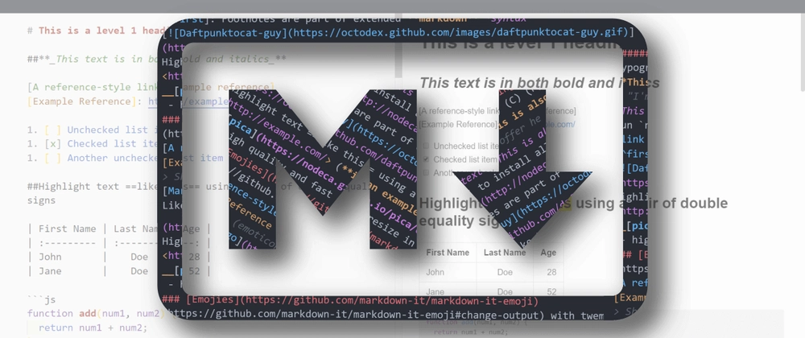

{ .center-image }
{ .center-image }

<div align="center">
<a href="https://www.markdownguide.org/"" title="Return to the main page"><h1>Markdown Guide</h></a>
 </div>
### [Markdown Guide](https://www.markdownguide.org/)

* [Get Started](https://www.markdownguide.org/getting-started/)
* [Cheat Sheet](https://www.markdownguide.org/cheat-sheet/)
* [Basic Syntax](https://www.markdownguide.org/basic-syntax/)
* [Extended Syntax](https://www.markdownguide.org/extended-syntax/)
* [Hacks](https://www.markdownguide.org/hacks/)
* [Tools](https://www.markdownguide.org/tools/)
* [Book](https://www.markdownguide.org/book/)



<H1 style="text-align: center;">Basic Syntax</H1>

!!! pied-piper "Markdown"

    <b>The Markdown elements outlined in the original design document.</b>
    

    ---

    ```text {.no-copy .no-style}
    NB: Nearly all Markdown applications support the basic syntax as outlined in
    the original Markdown design document.
    ```
    
    ---
    
    ```text {.no-copy .no-style}
    There are a few minor variations, as well as discrepancies between Markdown
    processors — Most of these are noted inline wherever possible.
    ```


<h2 id="headings">Headings<a class="anchorjs-link " aria-label="Anchor" data-anchorjs-icon="" href="#headings" style="font: 1em / 1 anchorjs-icons; padding-left: 0.375em;"></a></h2>
<p>To create a heading, add number signs (<code class="language-plaintext highlighter-rouge">#</code>) in front of a word or phrase. The number of number signs you use should correspond to the heading level. For example, to create a heading level three (<code class="language-plaintext highlighter-rouge">&lt;h3&gt;</code>), use three number signs (e.g., <code class="language-plaintext highlighter-rouge">### My Header</code>).</p>

<div class="isolated-table-container">
  <style>
    /* Use CSS Variables instead of hardcoded colors for dynamic theming */

    .isolated-table-container .table.table-bordered {
      border-collapse: collapse;
      width: 100%;
      max-width: 800px;
      margin: 20px auto;
      /* Use theme default border color */
      border: 1px solid var(--md-default-fg-color--light); 
      font-size: 16px;
      /* Default background color */
      background-color: var(--md-default-bg-color); 
      /* Default text color */
      color: var(--md-default-fg-color);
    }
    .isolated-table-container .table.table-bordered th,
    .isolated-table-container .table.table-bordered td {
      /* Use theme default border color */
      border: 1px solid var(--md-default-fg-color--light); 
      padding: 8px;
      text-align: left;
    }
    .isolated-table-container .table.table-bordered thead th {
      /* Use primary theme color for header background */
      background-color: var(--md-primary-fg-color); 
      font-weight: bold;
      /* Ensure header text is readable against primary color */
      color: var(--md-primary-bg-color); 
    }
    .isolated-table-container .table.table-bordered tbody tr:nth-child(odd) {
        /* Add some striping using a slightly different background color variable */
        background-color: var(--md-default-bg-color--light);
    }
    .isolated-table-container .table.table-bordered a {
      /* Use theme accent color for links */
      color: var(--md-accent-fg-color); 
      text-decoration: underline;
    }

    /* 
      You don't need the @media (prefers-color-scheme: dark) block anymore 
      because the CSS variables handle the dark/light mode switching dynamically.
    */
  </style>

<!-- Your original HTML table code starts here -->
<table class="table table-bordered">
  <thead class="thead-light">
    <tr>
      <th>Markdown</th>
      <th>HTML</th>
      <th>Rendered Output</th>
    </tr>
  </thead>
  <tbody>
    <tr>
      <td><code class="highlighter-rouge"># Heading level 1</code></td>
      <td><code class="highlighter-rouge">&lt;h1&gt;Heading level 1&lt;/h1&gt;</code></td>
      <td><h1 class="no-anchor" data-toc-skip="" id="heading-level-1">Heading level 1</h1></td>
    </tr>
    <tr>
      <td><code class="highlighter-rouge">## Heading level 2</code></td>
      <td><code class="highlighter-rouge">&lt;h2&gt;Heading level 2&lt;/h2&gt;</code></td>
      <td><h2 class="no-anchor" data-toc-skip="" id="heading-level-2">Heading level 2</h2></td>
    </tr>
    <tr>
      <td><code class="highlighter-rouge">### Heading level 3</code></td>
      <td><code class="highlighter-rouge">&lt;h3&gt;Heading level 3&lt;/h3&gt;</code></td>
      <td><h3 class="no-anchor" data-toc-skip="" id="heading-level-3">Heading level 3</h3></td>
    </tr>
    <tr>
      <td><code class="highlighter-rouge">#### Heading level 4</code></td>
      <td><code class="highlighter-rouge">&lt;h4&gt;Heading level  4&lt;/h4&gt;</code></td>
      <td><h4 class="no-anchor" id="heading-level-4">Heading level 4</h4></td>
    </tr>
    <tr>
      <td><code class="highlighter-rouge">##### Heading level 5</code></td>
      <td><code class="highlighter-rouge">&lt;h5&gt;Heading level 5&lt;/h5&gt;</code></td>
      <td><h5 class="no-anchor" id="heading-level-5">Heading level 5</h5></td>
    </tr>
    <tr>
      <td><code class="highlighter-rouge">###### Heading level 6</code></td>
      <td><code class="highlighter-rouge">&lt;h6&gt;Heading level 6&lt;/h6&gt;</code></td>
      <td><h6 class="no-anchor">Heading level 6</h6></td>
    </tr>
  </tbody>
</table>

</div> <!-- Ends the isolated-table-container div -->


<h3 id="alternate-syntax">Alternate Syntax<a class="anchorjs-link " aria-label="Anchor" data-anchorjs-icon="" href="#alternate-syntax" style="font: 1em / 1 anchorjs-icons; padding-left: 0.375em;"></a></h3>
<p>Alternatively, on the line below the text, add any number of <code class="language-plaintext highlighter-rouge">==</code> characters for heading level 1 or <code class="language-plaintext highlighter-rouge">--</code> characters for heading level 2.</p>

<div class="isolated-table-container">
  <style>
    /* Use CSS Variables instead of hardcoded colors for dynamic theming */
    .isolated-table-container .table.table-bordered {
      border-collapse: collapse;
      width: 100%;
      max-width: 800px;
      margin: 20px auto;
      /* Use theme default border color */
      border: 1px solid var(--md-default-fg-color--light); 
      font-size: 16px;
      /* Default background color */
      background-color: var(--md-default-bg-color); 
      /* Default text color */
      color: var(--md-default-fg-color);
    }
    .isolated-table-container .table.table-bordered th,
    .isolated-table-container .table.table-bordered td {
      /* Use theme default border color */
      border: 1px solid var(--md-default-fg-color--light); 
      padding: 8px;
      text-align: left;
    }
    .isolated-table-container .table.table-bordered thead th {
      /* Use primary theme color for header background */
      background-color: var(--md-primary-fg-color); 
      font-weight: bold;
      /* Ensure header text is readable against primary color */
      color: var(--md-primary-bg-color); 
    }
    .isolated-table-container .table.table-bordered tbody tr:nth-child(odd) {
        /* Add some striping using a slightly different background color variable */
        background-color: var(--md-default-bg-color--light);
    }
    .isolated-table-container .table.table-bordered a {
      /* Use theme accent color for links */
      color: var(--md-accent-fg-color); 
      text-decoration: underline;
    }
  </style>

  <!-- The HTML Table provided in your prompt -->
  <table class="table table-bordered">
    <thead class="thead-light">
      <tr>
        <th>Markdown</th>
        <th>HTML</th>
        <th>Rendered Output</th>
      </tr>
    </thead>
    <tbody>
      <tr>
        <td><code class="highlighter-rouge">Heading level 1<br>===============</code></td>
        <td><code class="highlighter-rouge">&lt;h1&gt;Heading level 1&lt;/h1&gt;</code></td>
        <td><h1 class="no-anchor" data-toc-skip="" id="heading-level-1-1">Heading level 1</h1></td>
      </tr>
      <tr>
        <td><code class="highlighter-rouge">Heading level 2<br>---------------</code></td>
        <td><code class="highlighter-rouge">&lt;h2&gt;Heading level 2&lt;/h2&gt;</code></td>
        <td><h2 class="no-anchor" data-toc-skip="" id="heading-level-2-1">Heading level 2</h2></td>
      </tr>
    </tbody>
  </table>

</div> <!-- Ends the isolated-table-container div -->

<h3 id="heading-best-practices">Heading Best Practices<a class="anchorjs-link " aria-label="Anchor" data-anchorjs-icon="" href="#heading-best-practices" style="font: 1em / 1 anchorjs-icons; padding-left: 0.375em;"></a></h3>
<p>Markdown applications don’t agree on how to handle a missing space between the number signs (<code class="language-plaintext highlighter-rouge">#</code>) and the heading name. For compatibility, always put a space between the number signs and the heading name.</p> 

<h2 id="paragraphs-1">Paragraphs<a class="anchorjs-link " aria-label="Anchor" data-anchorjs-icon="" href="#paragraphs-1" style="font: 1em / 1 anchorjs-icons; padding-left: 0.375em;"></a></h2>
<p>To create paragraphs, use a blank line to separate one or more lines of text.</p>
<h3 id="paragraph-best-practices">Paragraph Best Practices<a class="anchorjs-link " aria-label="Anchor" data-anchorjs-icon="" href="#paragraph-best-practices" style="font: 1em / 1 anchorjs-icons; padding-left: 0.375em;"></a></h3>
<p>Unless the <a href="https://www.markdownguide.org/basic-syntax/#paragraphs">paragraph is in a list</a>, don’t indent paragraphs with spaces or tabs.</p>

1. List item one.
+
List item one continued with a second paragraph followed by an
Indented block.
+
.................
$ ls *.sh
$ mv *.sh ~/tmp
.................
+
List item continued with a third paragraph.

2. List item two continued with an open block.
+
--
This paragraph is part of the preceding list item.

a. This list is nested and does not require explicit item
continuation.
+
This paragraph is part of the preceding list item.

b. List item b.

This paragraph belongs to item two of the outer list.
--