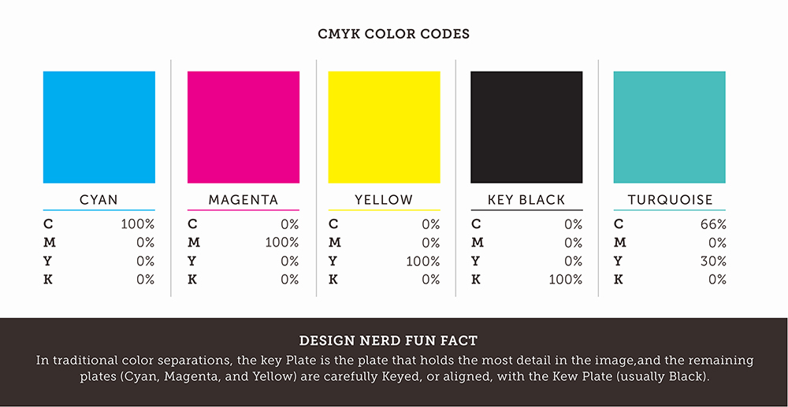

{ .center-image }

<H1 style="text-align: center;">And other Text Colors</H1>
 
 
### Text Colours 
 
Be wary that the below color names are case-sensitive. For example, `\color{olivegreen}` raises an "undefined color" error, but `\color{OliveGreen}` works fine. Table can be sorted by color name, by hue, by saturation, or by lightness.


<style>.copy-btn { color: #007BA7 !important; }</style>

| Name | Color | Hex | Hue | Saturation | Lightness |
| :--- | :---: | :--- | :--- | :--- | :--- |
| **Apricot** | <span style="display:block; background:#FBB982; height:24px; width:100%; border-radius:4px; border:1px solid #444;"></span> | `#FBB982` <span class="copy-btn" data-clipboard-text="#FBB982" title="Copy Hex" style="cursor:pointer; margin-left:8px;">:material-content-copy:</span> | 27.3 | 239.2 | 190.5 |
| **Aquamarine** | <span style="display:block; background:#00B5BE; height:24px; width:100%; border-radius:4px; border:1px solid #444;"></span> | `#00B5BE` <span class="copy-btn" data-clipboard-text="#00B5BE" title="Copy Hex" style="cursor:pointer; margin-left:8px;">:material-content-copy:</span> | 182.8 | 255.0 | 95.0 |
| **Bittersweet** | <span style="display:block; background:#C04F17; height:24px; width:100%; border-radius:4px; border:1px solid #444;"></span> | `#C04F17` <span class="copy-btn" data-clipboard-text="#C04F17" title="Copy Hex" style="cursor:pointer; margin-left:8px;">:material-content-copy:</span> | 19.9 | 200.4 | 107.5 |
| **Black** | <span style="display:block; background:#221E1F; height:24px; width:100%; border-radius:4px; border:1px solid #444;"></span> | `#221E1F` <span class="copy-btn" data-clipboard-text="#221E1F" title="Copy Hex" style="cursor:pointer; margin-left:8px;">:material-content-copy:</span> | 0.3 | 15.9 | 32.0 |
| **Blue** | <span style="display:block; background:#2D2F92; height:24px; width:100%; border-radius:4px; border:1px solid #444;"></span> | `#2D2F92` <span class="copy-btn" data-clipboard-text="#2D2F92" title="Copy Hex" style="cursor:pointer; margin-left:8px;">:material-content-copy:</span> | 238.2 | 134.8 | 95.5 |
| **BlueGreen** | <span style="display:block; background:#00B3B8; height:24px; width:100%; border-radius:4px; border:1px solid #444;"></span> | `#00B3B8` <span class="copy-btn" data-clipboard-text="#00B3B8" title="Copy Hex" style="cursor:pointer; margin-left:8px;">:material-content-copy:</span> | 181.6 | 255.0 | 92.0 |
| **BlueViolet** | <span style="display:block; background:#473992; height:24px; width:100%; border-radius:4px; border:1px solid #444;"></span> | `#473992` <span class="copy-btn" data-clipboard-text="#473992" title="Copy Hex" style="cursor:pointer; margin-left:8px;">:material-content-copy:</span> | 249.4 | 111.8 | 101.5 |
| **BrickRed** | <span style="display:block; background:#B6321C; height:24px; width:100%; border-radius:4px; border:1px solid #444;"></span> | `#B6321C` <span class="copy-btn" data-clipboard-text="#B6321C" title="Copy Hex" style="cursor:pointer; margin-left:8px;">:material-content-copy:</span> | 8.6 | 187.0 | 105.0 |
| **Brown** | <span style="display:block; background:#792500; height:24px; width:100%; border-radius:4px; border:1px solid #444;"></span> | `#792500` <span class="copy-btn" data-clipboard-text="#792500" title="Copy Hex" style="cursor:pointer; margin-left:8px;">:material-content-copy:</span> | 18.3 | 255.0 | 60.5 |
| **BurntOrange** | <span style="display:block; background:#F7921D; height:24px; width:100%; border-radius:4px; border:1px solid #444;"></span> | `#F7921D` <span class="copy-btn" data-clipboard-text="#F7921D" title="Copy Hex" style="cursor:pointer; margin-left:8px;">:material-content-copy:</span> | 32.2 | 237.6 | 138.0 |
| **CadetBlue** | <span style="display:block; background:#74729A; height:24px; width:100%; border-radius:4px; border:1px solid #444;"></span> | `#74729A` <span class="copy-btn" data-clipboard-text="#74729A" title="Copy Hex" style="cursor:pointer; margin-left:8px;">:material-content-copy:</span> | 243.0 | 42.1 | 134.0 |
| **CarnationPink** | <span style="display:block; background:#F282B4; height:24px; width:100%; border-radius:4px; border:1px solid #444;"></span> | `#F282B4` <span class="copy-btn" data-clipboard-text="#F282B4" title="Copy Hex" style="cursor:pointer; margin-left:8px;">:material-content-copy:</span> | 333.2 | 207.0 | 186.0 |
| **Cerulean** | <span style="display:block; background:#00A2E3; height:24px; width:100%; border-radius:4px; border:1px solid #444;"></span> | `#00A2E3` <span class="copy-btn" data-clipboard-text="#00A2E3" title="Copy Hex" style="cursor:pointer; margin-left:8px;">:material-content-copy:</span> | 197.2 | 255.0 | 113.5 |
| **CornflowerBlue** | <span style="display:block; background:#41B0E4; height:24px; width:100%; border-radius:4px; border:1px solid #444;"></span> | `#41B0E4` <span class="copy-btn" data-clipboard-text="#41B0E4" title="Copy Hex" style="cursor:pointer; margin-left:8px;">:material-content-copy:</span> | 199.1 | 191.5 | 146.5 |
| **Cyan** | <span style="display:block; background:#00AEEF; height:24px; width:100%; border-radius:4px; border:1px solid #444;"></span> | `#00AEEF` <span class="copy-btn" data-clipboard-text="#00AEEF" title="Copy Hex" style="cursor:pointer; margin-left:8px;">:material-content-copy:</span> | 196.3 | 255.0 | 119.5 |
| **Dandelion** | <span style="display:block; background:#FDBC42; height:24px; width:100%; border-radius:4px; border:1px solid #444;"></span> | `#FDBC42` <span class="copy-btn" data-clipboard-text="#FDBC42" title="Copy Hex" style="cursor:pointer; margin-left:8px;">:material-content-copy:</span> | 39.1 | 249.7 | 159.5 |
| **DarkOrchid** | <span style="display:block; background:#A4538A; height:24px; width:100%; border-radius:4px; border:1px solid #444;"></span> | `#A4538A` <span class="copy-btn" data-clipboard-text="#A4538A" title="Copy Hex" style="cursor:pointer; margin-left:8px;">:material-content-copy:</span> | 319.3 | 83.6 | 123.5 |
| **Emerald** | <span style="display:block; background:#00A99D; height:24px; width:100%; border-radius:4px; border:1px solid #444;"></span> | `#00A99D` <span class="copy-btn" data-clipboard-text="#00A99D" title="Copy Hex" style="cursor:pointer; margin-left:8px;">:material-content-copy:</span> | 175.7 | 255.0 | 84.5 |
| **ForestGreen** | <span style="display:block; background:#009B55; height:24px; width:100%; border-radius:4px; border:1px solid #444;"></span> | `#009B55` <span class="copy-btn" data-clipboard-text="#009B55" title="Copy Hex" style="cursor:pointer; margin-left:8px;">:material-content-copy:</span> | 152.9 | 255.0 | 77.5 |
| **Fuchsia** | <span style="display:block; background:#8C368C; height:24px; width:100%; border-radius:4px; border:1px solid #444;"></span> | `#8C368C` <span class="copy-btn" data-clipboard-text="#8C368C" title="Copy Hex" style="cursor:pointer; margin-left:8px;">:material-content-copy:</span> | 300.0 | 113.0 | 97.0 |
| **Goldenrod** | <span style="display:block; background:#FFDF42; height:24px; width:100%; border-radius:4px; border:1px solid #444;"></span> | `#FFDF42` <span class="copy-btn" data-clipboard-text="#FFDF42" title="Copy Hex" style="cursor:pointer; margin-left:8px;">:material-content-copy:</span> | 49.8 | 255.0 | 160.5 |
| **Gray** | <span style="display:block; background:#949698; height:24px; width:100%; border-radius:4px; border:1px solid #444;"></span> | `#949698` <span class="copy-btn" data-clipboard-text="#949698" title="Copy Hex" style="cursor:pointer; margin-left:8px;">:material-content-copy:</span> | 0.2 | 4.9 | 150.0 |
| **Green** | <span style="display:block; background:#00A64F; height:24px; width:100%; border-radius:4px; border:1px solid #444;"></span> | `#00A64F` <span class="copy-btn" data-clipboard-text="#00A64F" title="Copy Hex" style="cursor:pointer; margin-left:8px;">:material-content-copy:</span> | 148.6 | 255.0 | 83.0 |
| **GreenYellow** | <span style="display:block; background:#DFE674; height:24px; width:100%; border-radius:4px; border:1px solid #444;"></span> | `#DFE674` <span class="copy-btn" data-clipboard-text="#DFE674" title="Copy Hex" style="cursor:pointer; margin-left:8px;">:material-content-copy:</span> | 63.7 | 177.3 | 173.0 |
| **JungleGreen** | <span style="display:block; background:#00A99A; height:24px; width:100%; border-radius:4px; border:1px solid #444;"></span> | `#00A99A` <span class="copy-btn" data-clipboard-text="#00A99A" title="Copy Hex" style="cursor:pointer; margin-left:8px;">:material-content-copy:</span> | 174.7 | 255.0 | 84.5 |
| **Lavender** | <span style="display:block; background:#F49EC4; height:24px; width:100%; border-radius:4px; border:1px solid #444;"></span> | `#F49EC4` <span class="copy-btn" data-clipboard-text="#F49EC4" title="Copy Hex" style="cursor:pointer; margin-left:8px;">:material-content-copy:</span> | 333.5 | 203.1 | 201.0 |
| **LimeGreen** | <span style="display:block; background:#8DC73E; height:24px; width:100%; border-radius:4px; border:1px solid #444;"></span> | `#8DC73E` <span class="copy-btn" data-clipboard-text="#8DC73E" title="Copy Hex" style="cursor:pointer; margin-left:8px;">:material-content-copy:</span> | 85.4 | 140.3 | 130.5 |
| **Magenta** | <span style="display:block; background:#EC008C; height:24px; width:100%; border-radius:4px; border:1px solid #444;"></span> | `#EC008C` <span class="copy-btn" data-clipboard-text="#EC008C" title="Copy Hex" style="cursor:pointer; margin-left:8px;">:material-content-copy:</span> | 324.4 | 255.0 | 118.0 |
| **Mahogany** | <span style="display:block; background:#A9341F; height:24px; width:100%; border-radius:4px; border:1px solid #444;"></span> | `#A9341F` <span class="copy-btn" data-clipboard-text="#A9341F" title="Copy Hex" style="cursor:pointer; margin-left:8px;">:material-content-copy:</span> | 9.1 | 176.0 | 100.0 |
| **Maroon** | <span style="display:block; background:#AF3235; height:24px; width:100%; border-radius:4px; border:1px solid #444;"></span> | `#AF3235` <span class="copy-btn" data-clipboard-text="#AF3235" title="Copy Hex" style="cursor:pointer; margin-left:8px;">:material-content-copy:</span> | 358.6 | 141.7 | 112.5 |
| **Melon** | <span style="display:block; background:#F89E7B; height:24px; width:100%; border-radius:4px; border:1px solid #444;"></span> | `#F89E7B` <span class="copy-btn" data-clipboard-text="#F89E7B" title="Copy Hex" style="cursor:pointer; margin-left:8px;">:material-content-copy:</span> | 16.8 | 229.3 | 185.5 |
| **MidnightBlue** | <span style="display:block; background:#006795; height:24px; width:100%; border-radius:4px; border:1px solid #444;"></span> | `#006795` <span class="copy-btn" data-clipboard-text="#006795" title="Copy Hex" style="cursor:pointer; margin-left:8px;">:material-content-copy:</span> | 198.5 | 255.0 | 74.5 |
| **Mulberry** | <span style="display:block; background:#A93C93; height:24px; width:100%; border-radius:4px; border:1px solid #444;"></span> | `#A93C93` <span class="copy-btn" data-clipboard-text="#A93C93" title="Copy Hex" style="cursor:pointer; margin-left:8px;">:material-content-copy:</span> | 312.1 | 121.4 | 114.5 |
| **NavyBlue** | <span style="display:block; background:#006EB8; height:24px; width:100%; border-radius:4px; border:1px solid #444;"></span> | `#006EB8` <span class="copy-btn" data-clipboard-text="#006EB8" title="Copy Hex" style="cursor:pointer; margin-left:8px;">:material-content-copy:</span> | 204.1 | 255.0 | 92.0 |
| **OliveGreen** | <span style="display:block; background:#3C8031; height:24px; width:100%; border-radius:4px; border:1px solid #444;"></span> | `#3C8031` <span class="copy-btn" data-clipboard-text="#3C8031" title="Copy Hex" style="cursor:pointer; margin-left:8px;">:material-content-copy:</span> | 111.6 | 113.8 | 88.5 |
| **Orange** | <span style="display:block; background:#F58137; height:24px; width:100%; border-radius:4px; border:1px solid #444;"></span> | `#F58137` <span class="copy-btn" data-clipboard-text="#F58137" title="Copy Hex" style="cursor:pointer; margin-left:8px;">:material-content-copy:</span> | 23.4 | 230.7 | 150.0 |
| **OrangeRed** | <span style="display:block; background:#ED135A; height:24px; width:100%; border-radius:4px; border:1px solid #444;"></span> | `#ED135A` <span class="copy-btn" data-clipboard-text="#ED135A" title="Copy Hex" style="cursor:pointer; margin-left:8px;">:material-content-copy:</span> | 340.5 | 218.9 | 128.0 |
| **Orchid** | <span style="display:block; background:#AF72B0; height:24px; width:100%; border-radius:4px; border:1px solid #444;"></span> | `#AF72B0` <span class="copy-btn" data-clipboard-text="#AF72B0" title="Copy Hex" style="cursor:pointer; margin-left:8px;">:material-content-copy:</span> | 299.0 | 71.9 | 145.0 |
| **Peach** | <span style="display:block; background:#F7965A; height:24px; width:100%; border-radius:4px; border:1px solid #444;"></span> | `#F7965A` <span class="copy-btn" data-clipboard-text="#F7965A" title="Copy Hex" style="cursor:pointer; margin-left:8px;">:material-content-copy:</span> | 22.9 | 231.4 | 168.5 |
| **Periwinkle** | <span style="display:block; background:#7977B8; height:24px; width:100%; border-radius:4px; border:1px solid #444;"></span> | `#7977B8` <span class="copy-btn" data-clipboard-text="#7977B8" title="Copy Hex" style="cursor:pointer; margin-left:8px;">:material-content-copy:</span> | 241.8 | 80.1 | 151.5 |
| **PineGreen** | <span style="display:block; background:#008B72; height:24px; width:100%; border-radius:4px; border:1px solid #444;"></span> | `#008B72` <span class="copy-btn" data-clipboard-text="#008B72" title="Copy Hex" style="cursor:pointer; margin-left:8px;">:material-content-copy:</span> | 169.2 | 255.0 | 69.5 |
| **Plum** | <span style="display:block; background:#92268F; height:24px; width:100%; border-radius:4px; border:1px solid #444;"></span> | `#92268F` <span class="copy-btn" data-clipboard-text="#92268F" title="Copy Hex" style="cursor:pointer; margin-left:8px;">:material-content-copy:</span> | 301.7 | 149.7 | 92.0 |
| **ProcessBlue** | <span style="display:block; background:#00B0F0; height:24px; width:100%; border-radius:4px; border:1px solid #444;"></span> | `#00B0F0` <span class="copy-btn" data-clipboard-text="#00B0F0" title="Copy Hex" style="cursor:pointer; margin-left:8px;">:material-content-copy:</span> | 196.0 | 255.0 | 120.0 |
| **Purple** | <span style="display:block; background:#99479B; height:24px; width:100%; border-radius:4px; border:1px solid #444;"></span> | `#99479B` <span class="copy-btn" data-clipboard-text="#99479B" title="Copy Hex" style="cursor:pointer; margin-left:8px;">:material-content-copy:</span> | 298.6 | 94.8 | 113.0 |
| **RawSienna** | <span style="display:block; background:#974006; height:24px; width:100%; border-radius:4px; border:1px solid #444;"></span> | `#974006` <span class="copy-btn" data-clipboard-text="#974006" title="Copy Hex" style="cursor:pointer; margin-left:8px;">:material-content-copy:</span> | 24.0 | 235.5 | 78.5 |
| **Red** | <span style="display:block; background:#ED1B23; height:24px; width:100%; border-radius:4px; border:1px solid #444;"></span> | `#ED1B23` <span class="copy-btn" data-clipboard-text="#ED1B23" title="Copy Hex" style="cursor:pointer; margin-left:8px;">:material-content-copy:</span> | 357.7 | 217.7 | 132.0 |
| **RedOrange** | <span style="display:block; background:#F26035; height:24px; width:100%; border-radius:4px; border:1px solid #444;"></span> | `#F26035` <span class="copy-btn" data-clipboard-text="#F26035" title="Copy Hex" style="cursor:pointer; margin-left:8px;">:material-content-copy:</span> | 13.7 | 224.2 | 147.5 |
| **RedViolet** | <span style="display:block; background:#A1246B; height:24px; width:100%; border-radius:4px; border:1px solid #444;"></span> | `#A1246B` <span class="copy-btn" data-clipboard-text="#A1246B" title="Copy Hex" style="cursor:pointer; margin-left:8px;">:material-content-copy:</span> | 325.9 | 161.8 | 98.5 |
| **Rhodamine** | <span style="display:block; background:#EF559F; height:24px; width:100%; border-radius:4px; border:1px solid #444;"></span> | `#EF559F` <span class="copy-btn" data-clipboard-text="#EF559F" title="Copy Hex" style="cursor:pointer; margin-left:8px;">:material-content-copy:</span> | 331.2 | 211.1 | 162.0 |
| **RoyalBlue** | <span style="display:block; background:#0071BC; height:24px; width:100%; border-radius:4px; border:1px solid #444;"></span> | `#0071BC` <span class="copy-btn" data-clipboard-text="#0071BC" title="Copy Hex" style="cursor:pointer; margin-left:8px;">:material-content-copy:</span> | 203.9 | 255.0 | 94.0 |
| **RoyalPurple** | <span style="display:block; background:#613F99; height:24px; width:100%; border-radius:4px; border:1px solid #444;"></span> | `#613F99` <span class="copy-btn" data-clipboard-text="#613F99" title="Copy Hex" style="cursor:pointer; margin-left:8px;">:material-content-copy:</span> | 262.7 | 106.3 | 108.0 |
| **RubineRed** | <span style="display:block; background:#ED017D; height:24px; width:100%; border-radius:4px; border:1px solid #444;"></span> | `#ED017D` <span class="copy-btn" data-clipboard-text="#ED017D" title="Copy Hex" style="cursor:pointer; margin-left:8px;">:material-content-copy:</span> | 328.5 | 252.9 | 119.0 |
| **Salmon** | <span style="display:block; background:#F69289; height:24px; width:100%; border-radius:4px; border:1px solid #444;"></span> | `#F69289` <span class="copy-btn" data-clipboard-text="#F69289" title="Copy Hex" style="cursor:pointer; margin-left:8px;">:material-content-copy:</span> | 13.5 | 224.8 | 150.0 |


[Source](https://en.wikibooks.org/wiki/LaTeX/Colors#Adding_the_color_package)

### HTML Code for Text Colour


??? info "HTML Text Colour"
    <div class="color-table-wrapper">
        <style>
            .color-table-wrapper table {
                border-collapse: collapse;
                width: 100%;
                margin-top: 10px;
                border: 1px solid #ddd;
            }
            .color-table-wrapper th, .color-table-wrapper td {
                border: 1px solid #ddd;
                padding: 8px;
                text-align: left;
            }
            .color-table-wrapper th {
                background-color: #009966;
                color: white;
            }
            .color-table-wrapper .color-swatch {
                height: 20px;
                width: 50px;
                border: 1px solid #000;
                display: inline-block;
                vertical-align: middle;
            }
        </style>

        <table>
            <thead>
                <tr>
                    <th>Color Name</th>
                    <th>Color Swatch</th>
                    <th>Example</th>
                </tr>
            </thead>
            <tbody>
                <tr>
                    <td>Apricot</td>
                    <td><span class="color-swatch" style="background-color: #FFB3A6;"></span></td>
                    <td><span style="color: #FFB3A6;">The quick brown fox jumps over the lazy dog.</span></td>
                </tr>
                <tr>
                    <td>Aquamarine</td>
                    <td><span class="color-swatch" style="background-color: #7FFFD4;"></span></td>
                    <td><span style="color: #7FFFD4;">The quick brown fox jumps over the lazy dog.</span></td>
                </tr>
                <tr>
                    <td>Bittersweet</td>
                    <td><span class="color-swatch" style="background-color: #FE6F5E;"></span></td>
                    <td><span style="color: #FE6F5E;">The quick brown fox jumps over the lazy dog.</span></td>
                </tr>
                <tr>
                    <td>Black</td>
                    <td><span class="color-swatch" style="background-color: #000000;"></span></td>
                    <td><span style="color: #000000;">The quick brown fox jumps over the lazy dog.</span></td>
                </tr>
                <tr>
                    <td>Blue</td>
                    <td><span class="color-swatch" style="background-color: #0000FF;"></span></td>
                    <td><span style="color: #0000FF;">The quick brown fox jumps over the lazy dog.</span></td>
                </tr>
                <tr>
                    <td>BlueGreen</td>
                    <td><span class="color-swatch" style="background-color: #009966;"></span></td>
                    <td><span style="color: #009966;">The quick brown fox jumps over the lazy dog.</span></td>
                </tr>
                <tr>
                    <td>BlueViolet</td>
                    <td><span class="color-swatch" style="background-color: #8A2BE2;"></span></td>
                    <td><span style="color: #8A2BE2;">The quick brown fox jumps over the lazy dog.</span></td>
                </tr>
                <tr>
                    <td>BrickRed</td>
                    <td><span class="color-swatch" style="background-color: #CB4154;"></span></td>
                    <td><span style="color: #CB4154;">The quick brown fox jumps over the lazy dog.</span></td>
                </tr>
                <tr>
                    <td>Brown</td>
                    <td><span class="color-swatch" style="background-color: #964B00;"></span></td>
                    <td><span style="color: #964B00;">The quick brown fox jumps over the lazy dog.</span></td>
                </tr>
                <tr>
                    <td>BurntOrange</td>
                    <td><span class="color-swatch" style="background-color: #CC5500;"></span></td>
                    <td><span style="color: #CC5500;">The quick brown fox jumps over the lazy dog.</span></td>
                </tr>
                <tr>
                    <td>CadetBlue</td>
                    <td><span class="color-swatch" style="background-color: #5F9EA0;"></span></td>
                    <td><span style="color: #5F9EA0;">The quick brown fox jumps over the lazy dog.</span></td>
                </tr>
                <tr>
                    <td>CarnationPink</td>
                    <td><span class="color-swatch" style="background-color: #FFA6C9;"></span></td>
                    <td><span style="color: #FFA6C9;">The quick brown fox jumps over the lazy dog.</span></td>
                </tr>
                <tr>
                    <td>Cerulean</td>
                    <td><span class="color-swatch" style="background-color: #007BA7;"></span></td>
                    <td><span style="color: #007BA7;">The quick brown fox jumps over the lazy dog.</span></td>
                </tr>
                <tr>
                    <td>CornflowerBlue</td>
                    <td><span class="color-swatch" style="background-color: #6495ED;"></span></td>
                    <td><span style="color: #6495ED;">The quick brown fox jumps over the lazy dog.</span></td>
                </tr>
                <tr>
                    <td>Cyan</td>
                    <td><span class="color-swatch" style="background-color: #00FFFF;"></span></td>
                    <td><span style="color: #00FFFF;">The quick brown fox jumps over the lazy dog.</span></td>
                </tr>
                <tr>
                    <td>Dandelion</td>
                    <td><span class="color-swatch" style="background-color: #F0E68C;"></span></td>
                    <td><span style="color: #F0E68C;">The quick brown fox jumps over the lazy dog.</span></td>
                </tr>
                <tr>
                    <td>DarkOrchid</td>
                    <td><span class="color-swatch" style="background-color: #9932CC;"></span></td>
                    <td><span style="color: #9932CC;">The quick brown fox jumps over the lazy dog.</span></td>
                </tr>
                <tr>
                    <td>Emerald</td>
                    <td><span class="color-swatch" style="background-color: #50C878;"></span></td>
                    <td><span style="color: #50C878;">The quick brown fox jumps over the lazy dog.</span></td>
                </tr>
                <tr>
                    <td>ForestGreen</td>
                    <td><span class="color-swatch" style="background-color: #228B22;"></span></td>
                    <td><span style="color: #228B22;">The quick brown fox jumps over the lazy dog.</span></td>
                </tr>
                <tr>
                    <td>Fuchsia</td>
                    <td><span class="color-swatch" style="background-color: #FF00FF;"></span></td>
                    <td><span style="color: #FF00FF;">The quick brown fox jumps over the lazy dog.</span></td>
                </tr>
                <tr>
                    <td>Goldenrod</td>
                    <td><span class="color-swatch" style="background-color: #DAA520;"></span></td>
                    <td><span style="color: #DAA520;">The quick brown fox jumps over the lazy dog.</span></td>
                </tr>
                <tr>
                    <td>Gray</td>
                    <td><span class="color-swatch" style="background-color: #808080;"></span></td>
                    <td><span style="color: #808080;">The quick brown fox jumps over the lazy dog.</span></td>
                </tr>
                <tr>
                    <td>Green</td>
                    <td><span class="color-swatch" style="background-color: #008000;"></span></td>
                    <td><span style="color: #008000;">The quick brown fox jumps over the lazy dog.</span></td>
                </tr>
                <tr>
                    <td>GreenYellow</td>
                    <td><span class="color-swatch" style="background-color: #ADFF2F;"></span></td>
                    <td><span style="color: #ADFF2F;">The quick brown fox jumps over the lazy dog.</span></td>
                </tr>
                <tr>
                    <td>JungleGreen</td>
                    <td><span class="color-swatch" style="background-color: #29AB87;"></span></td>
                    <td><span style="color: #29AB87;">The quick brown fox jumps over the lazy dog.</span></td>
                </tr>
                <tr>
                    <td>Lavender</td>
                    <td><span class="color-swatch" style="background-color: #E6E6FA;"></span></td>
                    <td><span style="color: #E6E6FA;">The quick brown fox jumps over the lazy dog.</span></td>
                </tr>
                <tr>
                    <td>LimeGreen</td>
                    <td><span class="color-swatch" style="background-color: #32CD32;"></span></td>
                    <td><span style="color: #32CD32;">The quick brown fox jumps over the lazy dog.</span></td>
                </tr>
            </tbody>
        </table>
    </div>


---

<!-- md:option type:quote -->

!!! quote "Adding Colors"

    Adding colors to your text is supported by the [xcolor](https://www.ctan.org/pkg/xcolor) (supersedes package `color`). Using this package, you can set the font color, text background, or page background. You can choose from predefined colors or define your own colors using RGB, Hex, or CMYK. Mathematical formulas can also be colored.
    
---

!!! pied-piper "Pied Piper"

    ``` markdown title="The last 3 special directories."


     NB: The last 3 special directories (last, week and month) which links repectively to the last
     synced repository, to the last Monday and to the first of the current month.
    ```

---

<!-- md:option type:bug -->

!!! abstract "LaTeX/Package"

    ==Adding the xcolor package==
    To make use of these features, the {{LaTeX/Package|xcolor}} package must be imported. {{LaTeX/Package|xcolor}} starts from the basic facilities of the {{LaTeX/Package|color}} package and extends it.
    
    ---
    
    \\(\\sum_{i=0}^n i^2 = \\frac{(n^2+n)(2n+1)}{6}\\)
    
    \\(\\sum_{i=0}^n i^2 = \\frac{(n^2+n)(2n+1)}{6}\\)
    
    ---
    
    \\[\\sum_{i=0}^n i^2 = \\frac{(n^2+n)(2n+1)}{6}\\]
    
    ---
    
    The package allows you to use the names of 19 base colors (black, white, blue, green, yellow, red etc.); these names are always available. Besides, the package has some options to get more predefined colors, which should be added globally.
    
    ---
    
    {{LaTeX/Parameter|dvipsnames}} allows you to access more than 60 colors, and {{LaTeX/Parameter|svgnames}} allows access to about 150 colors. If you need more color names, then you may also want to look at the {{LaTeX/Parameter|x11names}} option that offers more than 300 colors.
    
    ---
    
    The {{LaTeX/Parameter|table}} option allows colors to be added to tables.
    
---

!!! pied-piper ""

    \begin{align}
        p(v_i=1|\mathbf{h}) & = \sigma\left(\sum_j w_{ij}h_j + b_i\right) \\
        p(h_j=1|\mathbf{v}) & = \sigma\left(\sum_i w_{ij}v_i + c_j\right)
    \end{align}
    
    ---
    
    \begin{flalign}
        p(v_i=1|\mathbf{h}) & = \sigma\left(\sum_j w_{ij}h_j + b_i\right) & \\
        p(h_j=1|\mathbf{v}) & = \sigma\left(\sum_i w_{ij}v_i + c_j\right) &
    \end{flalign}
    
    ---
    
    <p>
      When $a \ne 0$, there are two solutions to \(ax^2 + bx + c = 0\) and they are
      
      $$x = {-b \pm \sqrt{b^2-4ac} \over 2a}.$$
    </p>
    
---

### **The Lorenz Equations**

!!! quote "The Lorenz Equations"

    $$
    \begin{aligned}
    \frac{dx}{dt} &= \sigma(y - x) \\
    \frac{dy}{dt} &= x(\rho - z) - y \\
    \frac{dz}{dt} &= xy - \beta z
    \end{aligned}
    $$
    
---

### **The Cauchy-Schwarz Inequality**

!!! quote "The Cauchy-Schwarz Inequality"

    \[
      \left( \sum_{k=1}^n a_k b_k \right)^{\!\!2} \leq
      \left( \sum_{k=1}^n a_k^2 \right) \left( \sum_{k=1}^n b_k^2 \right)
    \]
    
---

### **A Cross Product Formula**

!!! quote "A Cross Product Formula"

    \[
    \mathbf{V}_1 \times \mathbf{V}_2 =
    \begin{vmatrix}
    \mathbf{i} & \mathbf{j} & \mathbf{k} \\
    \frac{\partial X}{\partial u} & \frac{\partial Y}{\partial u} & 0 \\
    \frac{\partial X}{\partial v} & \frac{\partial Y}{\partial v} & 0 \\
    \end{vmatrix}
    \]


---

!!! quote "A Cross Product Formula"

    <b>The probability of getting $k$ heads when flipping $n$ coins is:</b>

    $$P(E) = {n \choose k} p^k (1-p)^{ n-k}$$

!!! quote "A Cross Product Formula"

    The probability of getting $k$ heads when flipping $n$ coins is:

    $$P(E) = \binom{n}{k} p^k (1-p)^{n-k}$$

---

!!! quote "An Identity of Ramanujan"

    An Identity of Ramanujan:

    $$
    \frac{1}{\left(\sqrt{\phi \sqrt{5}}-\phi\right) e^{\frac25 \pi}} =
      1 + \dfrac{e^{-2\pi}}{
        1 + \dfrac{e^{-4\pi}}{
          1 + \dfrac{e^{-6\pi}}{
            1 + \dfrac{e^{-8\pi}}{1+\ldots}
          }
        }
      }
    $$


---

!!! quote "A Rogers-Ramanujan Identity"

    A Rogers-Ramanujan Identity:

    $$
    1 + \frac{q^2}{(1-q)}+\frac{q^6}{(1-q)(1-q^2)}+\cdots =
      \prod_{j=0}^{\infty}\frac{1}{(1-q^{5j+2})(1-q^{5j+3})},
       \quad\quad \text{for $|q| < 1$}
    $$

---

!!! quote "Maxwell's Equations"

    Maxwell's Equations:

    $$
    \begin{aligned}
    \nabla \cdot \mathbf{E} &= \frac{\rho}{\varepsilon_0} && \text{(Gauss's Law)} \\
    \nabla \cdot \mathbf{B} &= 0 && \text{(Gauss's Law for Magnetism)} \\
    \nabla \times \mathbf{E} &= -\frac{\partial \mathbf{B}}{\partial t} && \text{(Faraday's Law)} \\
    \nabla \times \mathbf{B} &= \mu_0 \left( \mathbf{J} + \varepsilon_0 \frac{\partial \mathbf{E}}{\partial t} \right) && \text{(Ampère-Maxwell Law)}
    \end{aligned}
    $$


---

!!! quote "In-line Mathematics"
    #### In-line Mathematics
    Finally, while display equations look good for a page of samples, the ability to mix math and text in a paragraph is also important. This expression $\sqrt{3x-1}+(1+x)^2$ is an example of an inline equation. As you see, MathJax equations can be used this way as well, without unduly disturbing the spacing between lines.

---

!!! info "1. The Derivative Cycle"
    #### The Derivative Cycle
    The magic of $\cos(x)$ is that its derivatives follow a repeating pattern of four. Let’s calculate them at the center $a = 0$:

    *   **$n=0$:** $f(0) = \cos(0) = \mathbf{1}$
    *   **$n=1$:** $f'(0) = -\sin(0) = \mathbf{0}$
    *   **$n=2$:** $f''(0) = -\cos(0) = \mathbf{-1}$
    *   **$n=3$:** $f'''(0) = \sin(0) = \mathbf{0}$
    *   **$n=4$:** $f^{(4)}(0) = \cos(0) = \mathbf{1}$ (and we are back to the start)


!!! example "2. Plugging into the Formula"
    #### Plugging into the Formula
    Now we substitute these values into the series. Notice that every **odd** power of $x$ disappears because the derivative is $0$.

    $$f(x) = \frac{1}{0!}x^0 + \frac{0}{1!}x^1 + \frac{-1}{2!}x^2 + \frac{0}{3!}x^3 + \frac{1}{4!}x^4 + \dots$$

    Simplifying that, we get:
    $$1 - \frac{x^2}{2!} + \frac{x^4}{4!} - \frac{x^6}{6!} + \dots$$

!!! success "3. Generalizing with Sigma Notation"
    #### Generalizing with Sigma Notation
    To turn this into the summation you provided, we need to account for two things:
    1.  **Alternating Signs:** We use $(-1)^k$. When $k=0$ it's positive, when $k=1$ it's negative, etc.
    2.  **Even Powers Only:** Since only the even positions survived, we replace $n$ with $2k$.

    This leads us exactly to:
    $$\cos x = \sum_{k=0}^{\infty} \frac{(-1)^k}{(2k)!} x^{2k}$$


!!! quote "The Maclaurin Expansion of $\cos(x)$"
    #### Breaking Down the Series
    The expansion of $\cos(x)$ is essentially an "infinite polynomial" that mimics the curve of the cosine wave perfectly around the origin. Because $\cos(x)$ is an **even function** (symmetrical across the y-axis), its series only contains **even powers** of $x$. 
    
    As you add more terms from the series, the approximation "hugs" the actual cosine wave further and further away from zero. 
    
    $$ \cos x = 1 - \frac{x^2}{2!} + \frac{x^4}{4!} - \frac{x^6}{6!} + \dots $$

---

!!! abstract "The Lorenz Equations"
    #### System of Equations
    The Lorenz system is a set of three ordinary differential equations originally derived as a simplified model for atmospheric convection.
    
    $$
    \begin{aligned}
    \frac{dx}{dt} &= \sigma(y - x) \\
    \frac{dy}{dt} &= x(\rho - z) - y \\
    \frac{dz}{dt} &= xy - \beta z
    \end{aligned}
    $$

!!! note "The Variables & Parameters"
    *   **$x, y, z$**: The state variables (representing convection rate, horizontal temperature variation, and vertical temperature variation).
    *   **$\sigma$ (sigma)**: The Prandtl number (ratio of momentum diffusivity to thermal diffusivity).
    *   **$\rho$ (rho)**: The Rayleigh number (representing the heat flow into the system).
    *   **$\beta$ (beta)**: A geometric factor related to the physical dimensions of the layer.

!!! tip "Why It Matters"
    #### Deterministic Chaos
    For certain parameter values (famously $\sigma=10, \rho=28, \beta=8/3$), the system exhibits **chaotic behavior**. Even though the equations are deterministic, the smallest change in starting conditions leads to vastly different outcomes—this is why long-term weather forecasting is so difficult!


