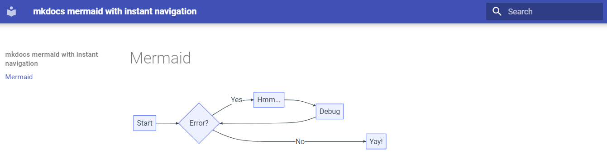
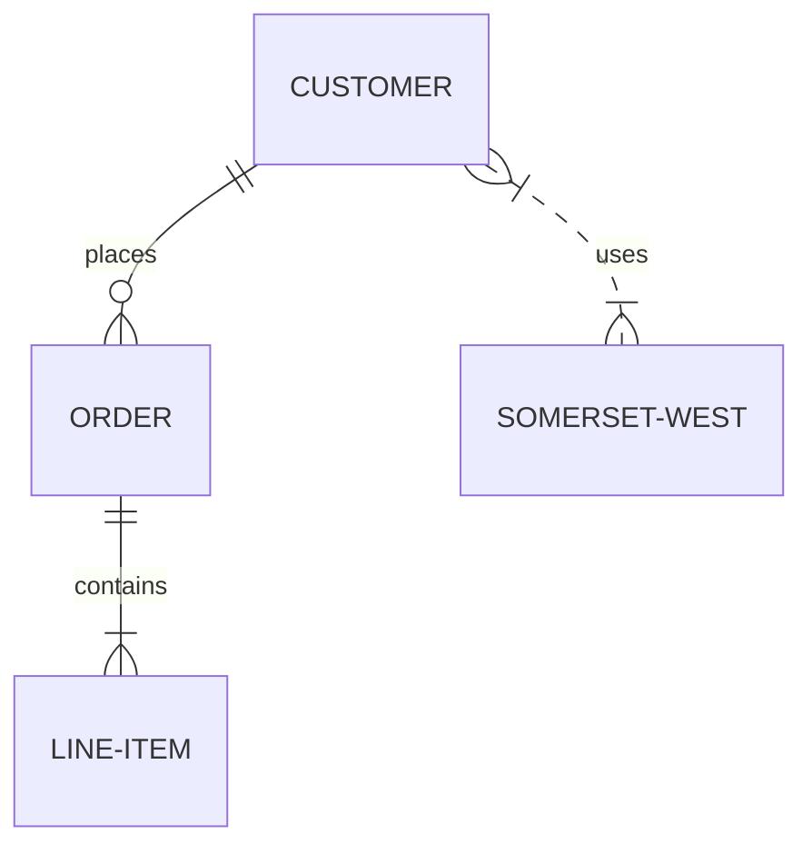

<div style="display: none;">
  <h1>Header</h1>
</div>


{: style="display: block; margin: 0 auto"}
<H1 style="text-align: center;">MkDocs-Material: Mermaid & Admonition Guide</H1>


##### 1. The "Pied Piper" Admonition Block
To wrap a Mermaid diagram in a custom admonition box, use the following structure. 
**Crucial:** The content inside must be indented by exactly **4 spaces**.

---

!!! pied-piper "Mermaid Flowchart"

    <div style="text-align: center;">

    ```mermaid
    graph TD
    A["Sagittarius A* (supermassive black hole)"] --> B["Orbit of Star S62"]
    B --> C["Periapsis (closest approach): 17.8 AU\n(AU = Astronomical Units, 1 AU ≈ Earth-Sun distance)"]
    B --> D["Apoapsis (farthest distance): 1,462.2 AU\n(AU = Astronomical Units, 1 AU ≈ Earth-Sun distance)"]
    style A fill:#7a7878,stroke:#948686,stroke-width:4px
    style B fill:#4d6aa1,stroke:#747474,stroke-width:2px
    style C fill:#f05b5b,stroke:#000,stroke-width:2px
    style D fill:#4d964d,stroke:#000,stroke-width:2px
    ```

    </div>

---
##### 2. Permanent CSS Centering (Recommended)

!!! info "CSS Centering"

    Add this to your `custom.css` (or `extra.css`) to automatically center all diagrams site-wide without needing the `<div>` tags every time.
    
    ```css
    /* Center all Mermaid diagrams on the site */
    .mermaid {
    text-align: center;
    }
    ```
    
    ---
    
    ```css
    /* Optional: Add spacing inside admonition boxes */
    .admonition .mermaid {
    margin-top: 1em;
    margin-bottom: 1em;
    }
    ```
   
    ---
    
    ##### STEP 1: CONFIGURATION
    
    ---

    - Configuration (mkdocs.yml)
    
    ```css
    theme:
      name: material
    ```
    
    ---
    
    - I'm useing `styles/custom.css` under extra-css!
    
    ```css
    extra_css:
      - styles/custom.css
    ```
     
    ---
    
    ```css
    markdown_extensions:
      - pymdownx.superfences:
          custom_fences:
            - name: mermaid
              class: mermaid
              format: !!python/name:pymdownx.superfences.fence_code_format
      - admonition
    ```
    
##### Step 2: How to save as a clean PDF

!!! info "Save as a clean PDF"

    1.  **Online (Fastest):** Go to [Dillinger.io](https://dillinger.io/), Paste the text above into the left pane, and click **Export > PDF** at the top.
    
    2.  **Local (Cleanest):** If you use **VS Code**, install the "Markdown PDF" extension. Open your `.md` file, press `Ctrl+Shift+P`, and select **Markdown PDF: Export (pdf)**.
    
    3.  **Browser Trick:** Paste the text into any online Markdown viewer (like GitHub or a StackEdit), then use your browser's **Print (Ctrl+P)** function and choose **"Save as PDF"**.
    
##### ⚡**Add custom icons or change the colors of the admonition box header.**

!!! info " Custom Icon to Header and Colour"

    Option 1: 🌟 The "Direct & Detailed" Addition
    
    ---
    
    Customizing Your Admonitions:
    
    - To make your callouts stand out, you can tweak the visual style using custom CSS or plugin settings.
    
    - Custom Icons: Most systems allow you to override the default icon by specifying a Lucide icon name or an SVG path in the block's metadata.
    
    - Color Schemes: You can change the header and background colors by adding a color parameter (e.g., color: 255, 0, 0 for red) to the code block.
    
##### ⚡ Global Styles: For a consistent look, define your brand colors in your CSS snippets to automatically skin every admonition across your vault. 

!!! pied-piper "Global Styles"

    Option 2: 🌟 The "Quick Reference" Addition
    
    
    ---
    
    
    Pro Tip: Styling & Icons:
    
    Want to match your theme? You can easily customize admonitions:
    
    - Change Icons: Use the :icon: parameter followed by any Remix Icon or FontAwesome identifier.
    
    - Adjust Colors: Use hex codes or RGB values in the configuration to modify the header bar.
    
    
    ---
    
    
    Example:
    
    title: Custom Style
    color: #7b2cbf
    icon: rocket
    This is a purple box with a rocket icon!
    
##### 🌐 Pro-Tips for "Cut-Off" Insurance

!!! example "Pro-Tips"

    1. **The "Micro-Update" Method:** If we are working on a long project (like your cheat-sheet), feel free to ask me to provide updates in smaller, bite-sized sections. It’s easier to copy-paste as we go!
       <hr style="border: none; border-top: 1px solid #7c4dff; opacity: 0.3; margin: 15px 0;">

    2. **The Resume Command:**
        **A:** If a response hangs or vanishes mid-sentence, just type "Continue from [last line]".
        **B:** I can usually pick up the thread right where we left off.
       <hr style="border: none; border-top: 1px solid #7c4dff; opacity: 0.3; margin: 15px 0;">

    3. **Version Control:**
        **A:** Whenever we hit a milestone, I can give you a "Clean Export" version of everything we've covered so you have a fresh master copy to save.
       <hr style="border: none; border-top: 1px solid #7c4dff; opacity: 0.3; margin: 15px 0;">

    4. **Handy Tools for your Cheat-Sheet:**
        **A: Backup & Sync:**
        **B:** If you are using Obsidian, check out the Obsidian Git plugin to automatically back up your notes so nothing gets lost.
       <hr style="border: none; border-top: 1px solid #7c4dff; opacity: 0.3; margin: 15px 0;">

    5. **Note Organisation:** Use the Periodic Notes plugin to keep track of when you added specific tips to your sheet.
       <hr style="border: none; border-top: 1px solid #7c4dff; opacity: 0.3; margin: 15px 0;">

    6. **CSS Troubleshooting:** If your custom colors aren't showing up, the Obsidian Forum is the best place to find specific CSS fixes for different themes.


    
##### 🌐 Making sessions "interruption-proof" is about managing two technical ceilings: Time Limits (how long a session stays active) and Token Limits (how much text the AI can "remember" at once).
 
!!! example "Making Sessions "interruption-proof""

    - 🌐 Here is how both work and how they lead to those irritating cut-offs:
    
    ---
    
    1. Time Limits (Session Timeouts)
    
    2. Idle Timeouts: Most web-based AI platforms have "idle" limits. If there is no message sent for 20–30 minutes, the connection may "time out" to save server resources.
    
    3. Active Caps: High-performance models often have rolling windows. For instance, some models might limit the user to 160 messages every 3 hours. If this cap is hit, the session effectively "interrupts" until the timer resets.
    
    4. Token Limits (Amount of Text)
    
    5. The "Context Window": This is the AI's "short-term memory." It includes the entire conversation history.
    <hr style="border: none; border-top: 1px solid #7c4dff; opacity: 0.3; margin: 15px 0;">
    
    6. The Displacement Effect: When the maximum "tokens" (units of text) is reached, the AI may begin to "forget" the earliest messages to make room for new ones. This can cause the AI to lose track of initial instructions or specific formatting.
    
    7. Output Cut-offs: If a specific response is too long (often over 500–1,000 words), the model may stop mid-sentence because it hit a single-response token limit.
    
    8. How to "Interruption-Proof" Your Work.
    
    9. To avoid these limits, some strategies include:
    
    10. Segmented Output: Breaking large blocks of code or text into smaller chunks to prevent hitting the single-response limit.
    <hr style="border: none; border-top: 1px solid #7c4dff; opacity: 0.3; margin: 15px 0;">
    
    11. Context Compression: Summarizing previous steps so the "memory" doesn't fill up with old data.
    
    12. The "Resume" Anchor: Using phrases like "Continue from [last line]" to reconnect a timed-out session without needing to re-send the whole prompt.
    
    13. Pro-Tip: If building a large guide, occasionally ask for a "Summary of current rules". This forces the AI to pull the most important context into a single, recent message, keeping it "fresh" in its memory.
    

---
Order Example
---



---

!!! info "Mermaid Colours"

    If you ever want to override Mermaid colors in mkdocs-material, you can add custom CSS:
    
    ```
    /* In your mkdocs.yml, under extra_css: */
    
    .mermaid .node rect {
        fill: #f9f !important;
        stroke: #333 !important;
    }
    ```
    


