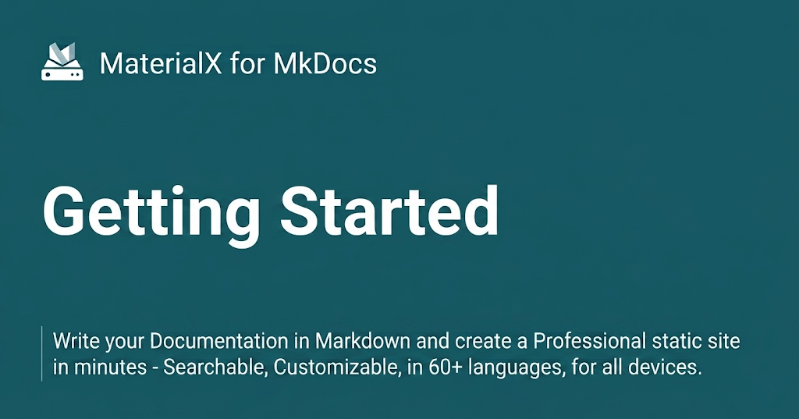

{ .center-image }
<H1 style="text-align: center;">Getting Started</H1>
 

!!! quote ""

    MaterialX for MkDocs is a powerful documentation framework on top of [MkDocs], a static site generator for project documentation.[^1] If you're familiar with Python, you can install Material for MkDocs with [`pip`][pip], the Python package manager. If not, we recommend using [`docker`][docker].
    

  [^1]:
    In 2016, MaterialX for MkDocs started out as a simple theme for MkDocs, but over the course of several years, it's now much more than that – with the many built-in plugins, settings, and countless customization abilities, Material for MkDocs is now one of the simplest and most powerful frameworks for creating documentation for your project.

  [MkDocs]: https://www.mkdocs.org
  [pip]: #with-pip
  [docker]: #with-docker

## Installation

Back to: MkDocs [Creating Your Site](rl.md)

### With pip <small>recommended</small>. { #with-pip data-toc-label="With pip" }

MaterialX for MkDocs is published as a [Python package] and can be installed with `pip`, ideally by using a [virtual environment]. Open up a terminal and install Material for MkDocs with:

!!! info "Installation"
    === "Latest"
        ``` sh
        pip install mkdocs-materialx
        ```
    === "Pin"
        ``` sh
        pip install mkdocs-materialx=="10.1.8"
        ```
    === "Upgrade"

        ```
        pip install --upgrade mkdocs-materialx
        ```

    This will automatically install compatible versions of all dependencies:  [MkDocs], [Markdown], [Pygments] and [Python Markdown Extensions].  MaterialX always strives to support the latest versions, so there's no need to install those packages separately.
    

  [Python package]: https://pypi.org/project/mkdocs-materialx/
  [virtual environment]: https://realpython.com/what-is-pip/#using-pip-in-a-python-virtual-environment
  [Markdown]: https://python-markdown.github.io/
  [Pygments]: https://pygments.org/
  [Python Markdown Extensions]: https://facelessuser.github.io/pymdown-extensions/

---

:fontawesome-brands-youtube:{ style="color: #EE0F0F" } __[How to set up Material for MkDocs]__ by @james-willett – :octicons-clock-24: 27m – Learn how to create and host a documentation site using Material for MkDocs on GitHub Pages in a step-by-step guide.

[How to set up Material for MkDocs]: https://www.youtube.com

---

!!! important ""

    If you don't have prior experience with Python, we recommend reading [Using Python's pip to Manage Your Projects' Dependencies], which is a really good introduction on the mechanics of Python package management and helps you troubleshoot if you run into errors.

  [Python package]: https://pypi.org/project/mkdocs-material/
  [virtual environment]: https://realpython.com/what-is-pip/#using-pip-in-a-python-virtual-environment
  [semantic versioning]: https://semver.org/
  [upgrade to the next major version]: MkDocs-Material/upgrade.md
  [Markdown]: https://python-markdown.github.io/
  [Pygments]: https://pygments.org/
  [Python Markdown Extensions]: https://facelessuser.github.io/pymdown-extensions/
  [Using Python's pip to Manage Your Projects' Dependencies]: https://realpython.com/what-is-pip/

### With Docker

??? deep-dive "With Docker"
    The official [Docker image] is a great way to get up and running in a few minutes, as it comes with all dependencies pre-installed. Open up a terminal and pull the image with:

    === "Latest"
        ```
        docker pull jaywhj/mkdocs-materialx
        ```

    === "Pin"
        ```
        docker pull jaywhj/mkdocs-materialx:10.1.8
        ```
    
    ``` title="Selected Plugins"
    
    MaterialX for MkDocs only bundles selected plugins in order to keep the size of the official
    image small. If the plugin you want to use is not included, you can add them easily. Create
    a `Dockerfile` and extend the official image:
    ```
    
    ``` Dockerfile title="Dockerfile"
    FROM jaywhj/mkdocs-materialx
    RUN pip install mkdocs-glightbox
    ```
    
    [Docker image]: https://hub.docker.com/r/jaywhj/mkdocs-materialx
    
#### Build the Image

!!! desc "Build the Image"

    ```
    docker build -t materialx .
    ```
    
#### Run the Container

!!! desc "Run the Container"

    ```
    docker run -p 8000:8000 -v ${PWD}:/docs materialx
    ```
    
### With Git

!!! git "With Git"
    MaterialX for MkDocs can be directly used from [GitHub] by cloning the repository into a subfolder of your project root which might be useful if you want to use the very latest version:
    
    You can clone the source code from a GitHub repo via `git clone` and install it locally:

    ```
    git clone https://github.com/jaywhj/mkdocs-materialx.git
    ```

    Next, install it with the following command

    ```
    pip install -e mkdocs-materialx
    ```
    
  [GitHub]: https://github.com/jaywhj/mkdocs-materialx


The following plugins are bundled with the Docker image:

- [mkdocs-minify-plugin]
- [mkdocs-redirects]

  [Docker image]: https://hub.docker.com/r/squidfunk/mkdocs-material/
  [mkdocs-minify-plugin]: https://github.com/byrnereese/mkdocs-minify-plugin
  [mkdocs-redirects]: https://github.com/datarobot/mkdocs-redirects

???+ tldr "Docker Container is Intended for Local Previewing Purposes Only!"

    The Docker container is intended for local previewing purposes only and is not suitable for deployment. This is because the web server used by MkDocs for live previews is not designed for production use and may have security vulnerabilities.

??? question "How to add plugins to the Docker image?"

    Material for MkDocs only bundles selected plugins in order to keep the size of the official image small. If the plugin you want to use is not included, you can add them easily. Create a `Dockerfile` and extend the official image:
    

    ``` Dockerfile title="Dockerfile"
    FROM squidfunk/mkdocs-material
    RUN pip install mkdocs-macros-plugin
    RUN pip install mkdocs-glightbox
    ```

    Next, build the image with the following command:

    ```
    docker build -t squidfunk/mkdocs-material .
    ```

    The new image will have additional packages installed and can be used exactly like the official image.

### Advanced Configuration

!!! bug ""
    - MaterialX for MkDocs comes with many configuration options.
    
    - The setup section explains in great detail how to configure and customize colors, fonts, icons and much more:
    

<div class="grid cards cols-3" markdown>

-   <span style="color: #2094f3">:material-palette:</span> **Changing the Colors**
    [:octicons-arrow-right-24: View Guide](./MkDocs-Material/changing-the-colors.md){ .md-button style="border-color: #2094f3; color: #2094f3" }
    
    Customise primary and accent colors to match your brand identity.

-   <span style="color: #2094f3">:material-format-font:</span> **Changing the Fonts**
    [:octicons-arrow-right-24: View Guide](./MkDocs-Material/changing-the-fonts.md){ .md-button style="border-color: #2094f3; color: #2094f3" }
    
    Configure Google Fonts or custom web fonts for typography.

-   <span style="color: #2094f3">:material-translate:</span> **Changing the Language**
    [:octicons-arrow-right-24: View Guide](./MkDocs-Material/changing-the-language.md){ .md-button style="border-color: #2094f3; color: #2094f3" }
    
    Localize your site interface and search into 50+ languages.

-   <span style="color: #00e5ff">:material-emoticon-happy-outline:</span> **Changing the Logo**
    [:octicons-arrow-right-24: View Guide](./MkDocs-Material/changing-the-logo-and-icons.md){{ .md-button style="border-color: #00e5ff; color: #00e5ff" }
    
    Set a custom logo and choose from thousands of integrated icons.

-   <span style="color: #00e5ff">:material-shield-check:</span> **Data Privacy**
    [:octicons-arrow-right-24: View Guide](./MkDocs-Material/ensuring-data-privacy.md){ .md-button style="border-color: #00e5ff; color: #00e5ff" }
    
    Enable GDPR-compliant features and cookie consent management.

-   <span style="color: #00e5ff">:material-compass:</span> **Site Navigation**
    [:octicons-arrow-right-24: View Guide](./MkDocs-Material/setting-up-navigation.md){ .md-button style="border-color: #00e5ff; color: #00e5ff" }
    
    Define your site structure, tabs, and table of contents behavior.

-   <span style="color: #4caf50">:material-magnify:</span> **Site Search**
    [:octicons-arrow-right-24: View Guide](./MkDocs-Material/setting-up-site-search.md){ .md-button style="border-color: #4caf50; color: #4caf50" }
    
    Configure the built-in search engine with highlighting and indexing.

-   <span style="color: #4caf50">:material-chart-bar:</span> **Site Analytics**
    [:octicons-arrow-right-24: View Guide](./MkDocs-Material/setting-up-site-analytics.md){ .md-button style="border-color: #4caf50; color: #4caf50" }
    
    Integrate Google Analytics or other privacy-focused tracking tools.

-   <span style="color: #4caf50">:material-page-layout-header:</span> **The Header**
    [:octicons-arrow-right-24: View Guide](./MkDocs-Material/setting-up-the-header.md){ .md-button style="border-color: #4caf50; color: #4caf50" }
    
    Customize the sticky header, search bar, and repository links.

-   <span style="color: #ff9800">:material-page-layout-footer:</span> **The Footer**
    [:octicons-arrow-right-24: View Guide](./MkDocs-Material/setting-up-the-footer.md){ .md-button style="border-color: #ff9800; color: #ff9800" }
    
    Manage "Previous/Next" buttons and the copyright notice area.

-   <span style="color: #ff9800">:material-card-account-details:</span> **Social Cards**
    [:octicons-arrow-right-24: View Guide](./MkDocs-Material/setting-up-social-cards.md){ .md-button style="border-color: #ff9800; color: #ff9800" }
    
    Generate automatic preview images for Twitter and LinkedIn shares.

-   <span style="color: #ff9800">:material-post:</span> **Setting up a Blog**
    [:octicons-arrow-right-24: View Guide](./MkDocs-Material/setting-up-a-blog.md){ .md-button style="border-color: #ff9800; color: #ff9800" }
    
    Transform your documentation into a fully-featured technical blog.

-   <span style="color: #005eff">:material-tag:</span> **Setting up Tags**
    [:octicons-arrow-right-24: View Guide](./MkDocs-Material/setting-up-tags.md){ .md-button style="border-color: #005eff; color: #005eff" }
    
    Organize content with categories and tags for easier discovery.

-   <span style="color: #005eff">:material-source-branch:</span> **Versioning**
    [:octicons-arrow-right-24: View Guide](./MkDocs-Material/setting-up-versioning.md){ .md-button style="border-color: #005eff; color: #005eff" }
    
    Host multiple versions of your documentation simultaneously.

-   <span style="color: #005eff">:material-git:</span> **Git Repository**
    [:octicons-arrow-right-24: View Guide](./MkDocs-Material/adding-a-git-repository.md){ .md-button style="border-color: #005eff; color: #005eff" }
    
    Link your source code to enable "Edit this page" functionality.

-   <span style="color: #f44336">:material-comment-text-outline:</span> **Comment System**
    [:octicons-arrow-right-24: View Guide](./MkDocs-Material/adding-a-comment-system.md){ .md-button style="border-color: #f44336; color:#f44336" }
    
    Integrate Giscus or Disqus to build community engagement.

-   <span style="color: #f44336;">:material-lightning-bolt:</span> **Optimization**
    [:octicons-arrow-right-24: View Guide](./MkDocs-Material/building-an-optimized-site.md){ .md-button style="border-color: #f44336; color:#f44336" }
    
    Minify CSS/JS and optimize images for lightning-fast loading.

-   <span style="color: #f44336;">:material-wifi-off:</span> **Offline Usage**
    [:octicons-arrow-right-24: View Guide](./MkDocs-Material/building-for-offline-usage.md){ .md-button style="border-color: #f44336; color:#f44336" }
    
    Package your documentation for use without an internet connection.

</div>

!!! info "Supported Markdown Extensions"
    Furthermore, see the list of supported [Markdown extensions] that are natively integrated with Material for MkDocs.
    
[Markdown extensions]: https://squidfunk.github.io/mkdocs-material/setup/extensions/python-markdown-extensions/

  
### Python Markdown Extensions

The [Python Markdown Extensions](https://facelessuser.github.io/pymdown-extensions/) package is an excellent collection of additional extensions perfectly suited for advanced technical writing. Material for MkDocs lists this package as an explicit dependency, so it's automatically installed with a supported version.

### Supported Extensions

In general, all extensions that are part of [Python Markdown Extensions](https://facelessuser.github.io/pymdown-extensions/) should work with Material for MkDocs. The following list includes all extensions that are natively supported, meaning they work without any further adjustments.

### Arithmatex

<!-- md:version 1.0.0 -->
<!-- md:extension [pymdownx.arithmatex][Arithmatex] -->

!!! info "Arithmatex"

    The [Arithmatex] extension allows for rendering of block and inline block equations and integrates seamlessly with [MathJax][^3] – a library for mathematical typesetting. Enable it via `mkdocs.yml`:

    ``` yaml
    markdown_extensions:
      - pymdownx.arithmatex:
          generic: true
    ```

    [^3]:
        Other libraries like [KaTeX] are also supported and can be integrated with some additional effort. See the [Arithmatex documentation on KaTeX] for further guidance, as this is beyond the scope of Material for MkDocs.


Besides enabling the extension in `mkdocs.yml`, a MathJax configuration and the JavaScript runtime need to be included, which can be done with a few lines of [additional JavaScript]:

!!! info "Arithmatex"

    === ":octicons-file-code-16: `docs/javascripts/mathjax.js`"
        ``` js
        window.MathJax = {
          tex: {
            inlineMath: [["\\(", "\\)"], ["$", "$"]],
            displayMath: [["\\[", "\\]"], ["$$", "$$"]],
            processEscapes: true,
            processEnvironments: true,
            packages: {'[+]': ['color']}
          },
          loader: {
            load: ['[tex]/color']
          },
          options: {
            ignoreHtmlClass: ".*",
            processHtmlClass: "arithmatex",
            menuOptions: {
              settings: {
                zoom: 'Click',
                zscale: '200%'
              }
            }
          }
        };
        
        document$.subscribe(() => { // (1)!
          MathJax.startup.output.clearCache()
          MathJax.typesetClear()
          MathJax.texReset()
          MathJax.typesetPromise()
        })
        ```
        
        1. This integrates MathJax with [instant loading]
        
        
    === ":octicons-file-code-16: `mkdocs.yml`"
    
        ``` yaml
        extra_javascript:
          - javascripts/mathjax.js
          - https://unpkg.com/mathjax@3/es5/tex-mml-chtml.js
        ```

The other configuration options of this extension are not officially supported by Material for MkDocs, which is why they may yield unexpected results. Use them at your own risk.

See reference for usage:

- [Using block syntax]
- [Using inline block syntax]

  [Arithmatex]: https://facelessuser.github.io/pymdown-extensions/extensions/arithmatex/
  [Arithmatex documentation on KaTeX]: https://facelessuser.github.io/pymdown-extensions/extensions/arithmatex/#loading-katex
  [MathJax]: https://www.mathjax.org/
  [KaTeX]: https://github.com/Khan/KaTeX
  [additional JavaScript]: https://github.com/squidfunk/mkdocs-material/blob/master/docs/customization.md#additional-javascript
  [instant loading]: MkDocs-Material/setting-up-navigation.md#instant-loading
  [Using block syntax]: https://github.com/squidfunk/mkdocs-material/blob/master/docs/reference/math.md#using-block-syntax
  [Using inline block syntax]: https://github.com/squidfunk/mkdocs-material/blob/master/docs/reference/math.md#using-inline-block-syntax

---

##### Useful Links

<div class="grid cards cols-3" markdown>

-   <span style="color: #2094f3">:material-download:</span> **Installation Guide**
    [:octicons-arrow-right-24: View Guide](https://github.com/mkdocs/mkdocs/blob/master/docs/user-guide/installation.md){ .md-button style="border-color: #2094f3; color: #2094f3" }

    Step-by-step instructions to get MkDocs up and running.

-   <span style="color: #2094f3">:material-cog:</span> **Configuration (docs_dir)**
    [:octicons-arrow-right-24: View Config](https://github.com/mkdocs/mkdocs/blob/master/docs/user-guide/configuration.md#docs_dir){ .md-button style="border-color: #2094f3; color: #2094f3" }

    Learn how to set up your source directory structure.

-   <span style="color: #2094f3">:material-rocket-launch:</span> **Deploying Your Docs**
    [:octicons-arrow-right-24: View Guide](https://www.mkdocs.org/user-guide/deploying-your-docs/){ .md-button style="border-color: #2094f3; color: #2094f3" }

    How to publish your documentation to the web.

-   <span style="color: #4caf50">:material-map-legend:</span> **Documentation Layout**
    [:octicons-arrow-right-24: View Layout](https://www.mkdocs.org/user-guide/configuration/#nav){ .md-button style="border-color: #4caf50; color: #4caf50" }

    Configure the navigation and global site structure.

-   <span style="color: #4caf50">:material-forum:</span> **GitHub Discussions**
    [:octicons-arrow-right-24: Join Discussions](https://github.com/mkdocs/mkdocs/discussions){ .md-button style="border-color: #4caf50; color: #4caf50" }

    Ask questions and engage with the community.

-   <span style="color: #4caf50">:material-alert-circle:</span> **GitHub Issues**
    [:octicons-arrow-right-24: View Issues](https://github.com/mkdocs/mkdocs/issues){ .md-button style="border-color: #4caf50; color: #4caf50" }

    Report bugs or request new features.

-   <span style="color: #ff9800">:material-card-text:</span> **Site Name**
    [:octicons-arrow-right-24: View Settings](https://www.mkdocs.org/user-guide/configuration/#site_name){ .md-button style="border-color: #ff9800; color: #ff9800" }

    Define the title of your project and browser tab.

-   <span style="color: #ff9800">:material-brush:</span> **Theme**
    [:octicons-arrow-right-24: View Theme](https://www.mkdocs.org/user-guide/configuration/#theme){ .md-button style="border-color: #ff9800; color: #ff9800" }

    Customise the look and feel of your documentation.

-   <span style="color: #ff9800">:material-book-open-variant:</span> **User Guide**
    [:octicons-arrow-right-24: Open Guide](https://www.mkdocs.org/user-guide/){ .md-button style="border-color: #ff9800; color: #ff9800" }

    The complete manual for all MkDocs features.

</div>

---

