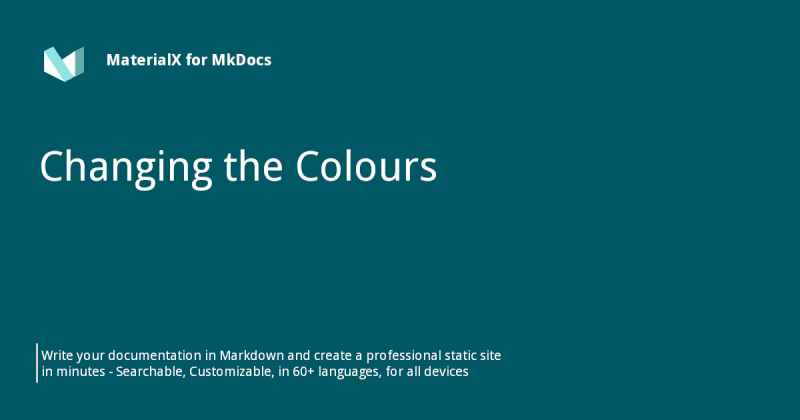

{ .center-image }
<H1 style="text-align: center;">Changing the Colours</H1>

[Back to: #Advanced-Configuration  :fontawesome-solid-paper-plane:](../MkDocs-Material-Start.md/#advanced-configuration){ .md-button .md-button--custom }


!!! quote ""
    As any proper Material Design implementation, Material for MkDocs supports Google's original [color palette], which can be easily configured through `mkdocs.yml`. Furthermore, colors can be customized with a few lines of CSS to fit your brand's identity by using [CSS variables][custom colors].
    
  [color palette]: http://www.materialui.co/colors
  [custom colors]: #custom-colors

## Configuration
### Colour Palette

<style>
  /* 1. Layout and Pointer Fix */
  .mdx-switch {
    display: flex;
    flex-wrap: wrap;
    gap: 8px;
    justify-content: flex-start;
    margin: 1em 0;
  }
  .mdx-switch button {
    cursor: pointer; border: none; background: none; padding: 0; margin: 0; display: inline-block;
  }
  .mdx-switch button code {
    padding: 4px 10px; border-radius: 4px; color: white !important; font-weight: bold; font-size: 0.85em;
  }

  /* 2. Text Color Fix for Bright Buttons (Primary & Accent) */
  button[data-md-color-primary="lime"] code, button[data-md-color-accent="lime"] code,
  button[data-md-color-primary="yellow"] code, button[data-md-color-accent="yellow"] code,
  button[data-md-color-primary="amber"] code, button[data-md-color-accent="amber"] code,
  button[data-md-color-primary="white"] code { color: #000 !important; }

  /* 3. Color Definitions for BOTH Primary and Accent Buttons */
  button[data-md-color-primary="red"] code, button[data-md-color-accent="red"] code { background-color: #ef5350 !important; }
  button[data-md-color-primary="pink"] code, button[data-md-color-accent="pink"] code { background-color: #ec407a !important; }
  button[data-md-color-primary="purple"] code, button[data-md-color-accent="purple"] code { background-color: #ab47bc !important; }
  button[data-md-color-primary="deep-purple"] code, button[data-md-color-accent="deep-purple"] code { background-color: #7e57c2 !important; }
  button[data-md-color-primary="indigo"] code, button[data-md-color-accent="indigo"] code { background-color: #3f51b5 !important; }
  button[data-md-color-primary="blue"] code, button[data-md-color-accent="blue"] code { background-color: #2196f3 !important; }
  button[data-md-color-primary="light-blue"] code, button[data-md-color-accent="light-blue"] code { background-color: #03a9f4 !important; }
  button[data-md-color-primary="cyan"] code, button[data-md-color-accent="cyan"] code { background-color: #00bcd4 !important; }
  button[data-md-color-primary="teal"] code, button[data-md-color-accent="teal"] code { background-color: #009688 !important; }
  button[data-md-color-primary="green"] code, button[data-md-color-accent="green"] code { background-color: #4caf50 !important; }
  button[data-md-color-primary="light-green"] code, button[data-md-color-accent="light-green"] code { background-color: #8bc34a !important; }
  button[data-md-color-primary="lime"] code, button[data-md-color-accent="lime"] code { background-color: #cddc39 !important; }
  button[data-md-color-primary="yellow"] code, button[data-md-color-accent="yellow"] code { background-color: #ffeb3b !important; }
  button[data-md-color-primary="amber"] code, button[data-md-color-accent="amber"] code { background-color: #ffc107 !important; }
  button[data-md-color-primary="orange"] code, button[data-md-color-accent="orange"] code { background-color: #ff9800 !important; }
  button[data-md-color-primary="deep-orange"] code, button[data-md-color-accent="deep-orange"] code { background-color: #ff5722 !important; }
  button[data-md-color-primary="brown"] code { background-color: #795548 !important; }
  button[data-md-color-primary="grey"] code { background-color: #9e9e9e !important; }
  button[data-md-color-primary="blue-grey"] code { background-color: #607d8b !important; }
  button[data-md-color-primary="black"] code { background-color: #000000 !important; }
  button[data-md-color-primary="white"] code { background-color: #ffffff !important; border: 1px solid #ddd !important; }

  /* 4. Scheme Buttons (Default/Slate) - Picks up your Accent Color */
  button[data-md-color-scheme] code {
    background-color: var(--md-accent-fg-color) !important;
    color: var(--md-accent-bg-color) !important;
  }
</style>

#### Color Scheme

Material for MkDocs supports two color schemes: a **`light mode`**, which is called `default`, and a **`dark mode`**, which is called `slate`.

!!! info "Configuration & Preview"

    === "Interactive Preview"
        Click on a tile to switch between light and dark mode:

        <div class="mdx-switch">
          <button data-md-color-scheme="default"><code>default</code></button>
          <button data-md-color-scheme="slate"><code>slate</code></button>
        </div>

    === "Setup (mkdocs.yml)"
        Set the default color scheme by updating your `mkdocs.yml`:
        ```yaml
        theme:
          palette:
            scheme: default # (1)!
        ```
        1. Set to `slate` to make dark mode the default for your users.

<script>
  var buttons = document.querySelectorAll("button[data-md-color-scheme]")
  buttons.forEach(function(button) {
    button.addEventListener("click", function() {
      document.body.setAttribute("data-md-color-switching", "")
      var attr = this.getAttribute("data-md-color-scheme")
      document.body.setAttribute("data-md-color-scheme", attr)
      var name = document.querySelector("#__code_0 code span.l")
      if(name) name.textContent = attr
      setTimeout(function() {
        document.body.removeAttribute("data-md-color-switching")
      })
    })
  })
</script>


#### Primary Colour

The primary color is used for the header, the sidebar, text links and several other components.

!!! info "Configuration & Preview"

    === "Interactive Preview"
        Click on a tile to change the primary color of this page:

        <div class="mdx-switch">
          <button data-md-color-primary="red"><code>red</code></button>
          <button data-md-color-primary="pink"><code>pink</code></button>
          <button data-md-color-primary="purple"><code>purple</code></button>
          <button data-md-color-primary="deep-purple"><code>deep purple</code></button>
          <button data-md-color-primary="indigo"><code>indigo</code></button>
          <button data-md-color-primary="blue"><code>blue</code></button>
          <button data-md-color-primary="light-blue"><code>light blue</code></button>
          <button data-md-color-primary="cyan"><code>cyan</code></button>
          <button data-md-color-primary="teal"><code>teal</code></button>
          <button data-md-color-primary="green"><code>green</code></button>
          <button data-md-color-primary="light-green"><code>light green</code></button>
          <button data-md-color-primary="lime"><code>lime</code></button>
          <button data-md-color-primary="yellow"><code>yellow</code></button>
          <button data-md-color-primary="amber"><code>amber</code></button>
          <button data-md-color-primary="orange"><code>orange</code></button>
          <button data-md-color-primary="deep-orange"><code>deep orange</code></button>
          <button data-md-color-primary="brown"><code>brown</code></button>
          <button data-md-color-primary="grey"><code>grey</code></button>
          <button data-md-color-primary="blue-grey"><code>blue grey</code></button>
          <button data-md-color-primary="black"><code>black</code></button>
          <button data-md-color-primary="white"><code>white</code></button>
        </div>

    === "Setup (mkdocs.yml)"
        Set the primary color by updating your `mkdocs.yml`:
        ```yaml
        theme:
          palette:
            primary: indigo
        ```

<script>
  var buttons = document.querySelectorAll("button[data-md-color-primary]")
  buttons.forEach(function(button) {
    button.addEventListener("click", function() {
      var attr = this.getAttribute("data-md-color-primary")
      document.body.setAttribute("data-md-color-primary", attr)
      // This part updates the code block text if it exists
      var name = document.querySelector("#__code_1 code span.l")
      if(name) name.textContent = attr.replace("-", " ")
    })
  })
</script>


See our guide below to learn how to set [custom colors].

#### Accent Colour

The accent color is used for interactive elements like hovered links, buttons, and scrollbars.

!!! info "Configuration & Preview"

    === "Interactive Preview"
        Click on a tile to change the accent color of this page:

        <div class="mdx-switch">
          <button data-md-color-accent="red"><code>red</code></button>
          <button data-md-color-accent="pink"><code>pink</code></button>
          <button data-md-color-accent="purple"><code>purple</code></button>
          <button data-md-color-accent="deep-purple"><code>deep purple</code></button>
          <button data-md-color-accent="indigo"><code>indigo</code></button>
          <button data-md-color-accent="blue"><code>blue</code></button>
          <button data-md-color-accent="light-blue"><code>light blue</code></button>
          <button data-md-color-accent="cyan"><code>cyan</code></button>
          <button data-md-color-accent="teal"><code>teal</code></button>
          <button data-md-color-accent="green"><code>green</code></button>
          <button data-md-color-accent="light-green"><code>light green</code></button>
          <button data-md-color-accent="lime"><code>lime</code></button>
          <button data-md-color-accent="yellow"><code>yellow</code></button>
          <button data-md-color-accent="amber"><code>amber</code></button>
          <button data-md-color-accent="orange"><code>orange</code></button>
          <button data-md-color-accent="deep-orange"><code>deep orange</code></button>
        </div>

    === "Setup (mkdocs.yml)"
        Set the accent color by updating your `mkdocs.yml`:
        ```yaml
        theme:
          palette:
            accent: indigo
        ```

<script>
  var buttons = document.querySelectorAll("button[data-md-color-accent]")
  buttons.forEach(function(button) {
    button.addEventListener("click", function() {
      var attr = this.getAttribute("data-md-color-accent")
      document.body.setAttribute("data-md-color-accent", attr)
      // Updates the code block text in the 'Setup' tab if it exists
      var name = document.querySelector("#__code_2 code span.l")
      if(name) name.textContent = attr.replace("-", " ")
    })
  })
</script>


See our guide below to learn how to set [custom colors].

### Colour Palette Toggle

Offering a light _and_ dark color palette makes your documentation pleasant to read at different times of the day, so the user can choose accordingly.

!!! info "Configuration"

    Add the following lines to `mkdocs.yml`:

    ``` yaml
    theme:
      palette: # (1)!

        # Palette toggle for light mode
        - scheme: default
          toggle:
            icon: material/brightness-7 # (2)!
            name: Switch to dark mode

        # Palette toggle for dark mode
        - scheme: slate
          toggle:
            icon: material/brightness-4
            name: Switch to light mode
    ```

    1.  Note that the `theme.palette` setting is now defined as a list.
    2.  Enter a few keywords to find the perfect icon using our [icon search] and click on the shortcode to copy it to your clipboard.

This configuration will render a color palette toggle next to the search bar. Note that you can also define separate settings for [`primary`][palette.primary] and [`accent`][palette.accent] per color palette.

---

#### Toggle Properties

!!! info "Required Properties"

    Each palette toggle in your `mkdocs.yml` requires these specific properties:

    **`icon`**
    :   This must point to a valid icon path. Popular pairings include:

        * :material-brightness-7: + :material-brightness-4: – `material/brightness-7` + `material/brightness-4`
        * :material-toggle-switch: + :material-toggle-switch-off-outline: – `material/toggle-switch` + `material/toggle-switch-off-outline`
        * :material-weather-night: + :material-weather-sunny: – `material/weather-night` + `material/weather-sunny`
        * :material-eye: + :material-eye-outline: – `material/eye` + `material/eye-outline`
        * :material-lightbulb: + :material-lightbulb-outline: – `material/lightbulb` + `material/lightbulb-outline`

    **`name`**
    :   This acts as the toggle's `title` attribute. It is rendered as a [tooltip] and is essential for screen readers and accessibility.


### System Preference

!!! info "Automatic Light/Dark Mode"

    Each color palette can be linked to the user's system preference (Light or Dark mode) using a media query. 

    Add the `media` property to your `mkdocs.yml` like this:

    ``` yaml
    theme:
      palette:

        # Palette toggle for light mode
        - media: "(prefers-color-scheme: light)" # (1)!
          scheme: default
          toggle:
            icon: material/brightness-7
            name: Switch to dark mode

        # Palette toggle for dark mode
        - media: "(prefers-color-scheme: dark)"
          scheme: slate
          toggle:
            icon: material/brightness-4
            name: Switch to light mode
    ```

    1.  The media queries are evaluated in the order they are defined. The first one that matches becomes the default for a first-time visitor.


### Automatic Light / Dark Mode

!!! info "OS-Level Automation"

    Newer operating systems can automatically switch between light and dark appearance based on the time of day. Material for MkDocs can follow this lead, delegating the palette selection to the OS.

    === "Automatic Setup (mkdocs.yml)"
        Add these lines to enable seamless switching without a page reload:

        ``` yaml
        theme:
          palette:

            # Palette toggle for automatic mode
            - media: "(prefers-color-scheme)"
              toggle:
                icon: material/brightness-auto
                name: Switch to light mode

            # Palette toggle for light mode
            - media: "(prefers-color-scheme: light)"
              scheme: default
              toggle:
                icon: material/brightness-7
                name: Switch to dark mode

            # Palette toggle for dark mode
            - media: "(prefers-color-scheme: dark)"
              scheme: slate
              toggle:
                icon: material/brightness-4
                name: Switch to system preference
        ```

    === "Pro Tip: Custom Colors"
        You can define separate settings for [`primary`][palette.primary] and [`accent`][palette.accent] per color palette. This allows you to have, for example, a "Deep Orange" accent in light mode but a "Cyan" accent in dark mode.

Material for MkDocs will now monitor the operating system's state and switch themes instantly, even if the user stays on the same page during the transition.


## Customization

### Custom Colours

Material for MkDocs uses [CSS variables] to handle its entire colour system. If you need to use brand-specific colours that aren't in the standard palette, you can override these variables using an [additional style sheet].

First, set your palette to `custom` in `mkdocs.yml`:

```yaml
theme:
  palette:
    primary: custom
```

!!! ex "Example: Branding your site like :fontawesome-brands-youtube:{ style="color: #EE0F0F" } **YouTube**"

    To implement a specific brand palette, define the primary color and its light/dark variations in your CSS, then link that file in your configuration.

    === ":octicons-file-code-16: docs/stylesheets/extra.css"

        ```css
        :root  > * {
          --md-primary-fg-color:        #EE0F0F;
          --md-primary-fg-color--light: #ECB7B7;
          --md-primary-fg-color--dark:  #90030C;
        }
        ```

    === ":octicons-file-code-16: mkdocs.yml"

        ```yaml
        extra_css:
          - stylesheets/extra.css
        ```

!!! tip "Full Variable List"
    Check the official [color definitions] file for a comprehensive list of every CSS variable you can tweak.


  [CSS variables]: https://developer.mozilla.org/en-US/docs/Web/CSS/Using_CSS_custom_properties
  [color definitions]: https://github.com/squidfunk/mkdocs-material/blob/master/src/templates/assets/stylesheets/main/_colors.scss
  [additional style sheet]: customization.md#additional-css


### Custom Colour Schemes

Besides overriding specific colors, you can create your own named color scheme by wrapping definitions in a `[data-md-color-scheme="..."]` [attribute selector]. This allows you to select your custom theme via `mkdocs.yml`.

!!! info "Defining a Custom Scheme"

    === ":octicons-file-code-16: `docs/stylesheets/extra.css`"

        ```css
        [data-md-color-scheme="youtube"] {
          --md-primary-fg-color:        #EE0F0F;
          --md-primary-fg-color--light: #ECB7B7;
          --md-primary-fg-color--dark:  #90030C;
        }
        ```

    === ":octicons-file-code-16: `mkdocs.yml`"

        ```yaml
        theme:
          palette:
            scheme: youtube
        extra_css:
          - stylesheets/extra.css
        ```

---

### Slate Theme Tuning

The `slate` color scheme defines its colors via `hsla` functions and deduces its shades from the `--md-hue` CSS variable.

!!! tip "Customizing the Slate Hue"

    You can tune the overall "tint" of the dark theme by overriding the hue value in your style sheet:

    ```css
    [data-md-color-scheme="slate"] {
      --md-hue: 210; /* (1)! */
    }
    ```

    1.  The `hue` value must be in the range of `[0, 360]`.

[attribute selector]: https://www.w3.org/TR/selectors-4/#attribute-selectors


[Back to: #Advanced-Configuration  :fontawesome-solid-paper-plane:](../MkDocs-Material-Start.md/#advanced-configuration){ .md-button .md-button--custom }

[palette.scheme]: #color-scheme
[palette.primary]: #primary-colour
[palette.accent]: #accent-colour
[custom colors]: #custom-colours
[icon search]: icons-emojis.md#search
[tooltip]: tooltips.md
