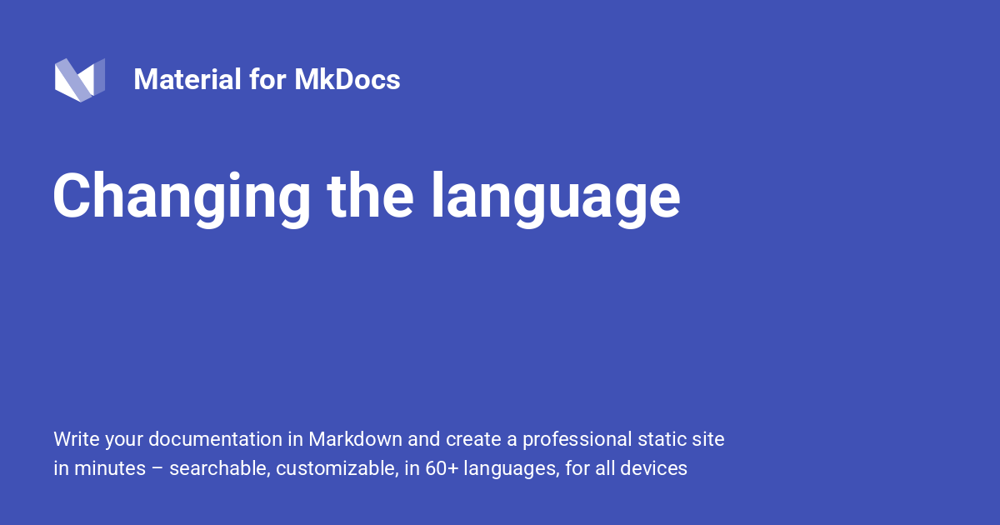

{ .center-image }
<H1 style="text-align: center;">Changing the Language</H1>

[Back to: #Advanced-Configuration  :fontawesome-solid-paper-plane:](../MkDocs-Material-Start.md/#advanced-configuration){ .md-button .md-button--custom }

!!! desc ""

    Material for MkDocs supports internationalization (i18n) and provides translations for template variables and labels in 60+ languages. Additionally, the site search can be configured to use a language-specific stemmer, if available.
    
## Configuration

!!! recommendation "Site Language"

    ### Site Language
    
    ---
    
    You can set the site language in `mkdocs.yml` with:
    
    ``` yaml
    theme:
      language: en # (1)!
    ```
    
    1.  HTML5 only allows to set a [single language per document], which
    is why Material for MkDocs only supports setting a canonical
    language for the entire project, i.e. one per `mkdocs.yml`. <br>
    The easiest way to build a multi-language documentation is to
    create one project in a subfolder per language, and then use the
    [language selector] to interlink those projects.
    
[Go to: Sphinx-Immaterial  :fontawesome-solid-paper-plane:](https://sphinx-immaterial.readthedocs.io/en/stable/index.html#){ .md-button .md-button--custom }

[Go to: Supported Languages.  :fontawesome-solid-paper-plane:](https://jaywhj.github.io/mkdocs-materialx/setup/changing-the-language.html?h#site-language){ .md-button .md-button--custom }

<!-- hooks/translations.py -->

!!! Important
    Note that some languages will produce unreadable anchor links due to the way the default slug function works. Consider using a [Unicode-aware slug function].
    
  [single language per document]: https://www.w3.org/International/questions/qa-html-language-declarations.en#attributes
  [language selector]: #site-language-selector
  [Unicode-aware slug function]: https://github.com/squidfunk/mkdocs-material/blob/master/docs/setup/extensions/python-markdown.md#+toc.slugify

### Site Language Selector

!!! deep-dive "Multiple Language Documentation"
    If your documentation is available in multiple languages, a language selector pointing to those languages can be added to the header. Alternate languages can be defined via `mkdocs.yml`.
    
    ``` yaml
    extra:
      alternate:
        - name: English
          link: /en/ # (1)!
          lang: en
        - name: Deutsch
          link: /de/
          lang: de
    ```
    
    1.  Note that this must be an absolute link. If it includes a domain
    part, it's used as defined. Otherwise the domain part of the
    [`site_url`][site_url] as set in `mkdocs.yml` is prepended to the link.
    
!!! tldr "Available Properties Alternate Languages"

    The following properties are available for each alternate language:
    
    ---
    
    1. This value of this property is used inside the language selector as the name of the language and must be set to a non-empty string.
    
    2. This property must be set to an absolute link, which might also point to another domain or subdomain not necessarily generated with MkDocs.
    
    3. This property must contain an [ISO 639-1 language code] and is used for the `hreflang` attribute of the link, improving discoverability via search engines.
    

[![Language selector preview]][Language selector preview]

  [site_url]: https://www.mkdocs.org/user-guide/configuration/#site_url
  [ISO 639-1 language code]: https://en.wikipedia.org/wiki/List_of_ISO_639-1_codes
  [Language selector preview]: ../assets/assets/screenshots/language-selection.png

#### Stay on Page

!!! instruction "Stay on Page"

    When switching between languages, e.g., if language `en` and `de` contain a page with the same path name, the user will stay on the current page:
    
    ```
    docs.example.com/en/     -> docs.example.com/de/
    docs.example.com/en/foo/ -> docs.example.com/de/foo/
    docs.example.com/en/bar/ -> docs.example.com/de/bar/
    ```
    
    No configuration is necessary.
    
### Directionality

!!! important "Directionality"
    While many languages are read `ltr` (left-to-right), Material for MkDocs also supports `rtl` (right-to-left) directionality which is deduced from the selected language, but can also be set with:
    
    ``` yaml
    theme:
      direction: ltr
    ```
    
    Click on a tile to change the directionality:
    
    <style>.mdx-switch button:hover{filter:brightness(1.15)!important;transform:translateY(-1px)!important}</style><span class="mdx-switch" style="display: flex !important; gap: 12px !important; margin: 16px 0 !important;"><button data-md-dir="ltr" style="cursor: pointer !important; background-color: var(--md-accent-fg-color, #00b0ff) !important; border: 1px solid var(--md-accent-fg-color, #00b0ff) !important; border-radius: 6px !important; padding: 6px 16px !important; color: var(--md-accent-bg-color, #ffffff) !important; font-family: var(--md-code-font-family), monospace !important; font-weight: bold !important; transition: all 0.2s !important;">ltr</button><button data-md-dir="rtl" style="cursor: pointer !important; background-color: var(--md-accent-fg-color, #00b0ff) !important; border: 1px solid var(--md-accent-fg-color, #00b0ff) !important; border-radius: 6px !important; padding: 6px 16px !important; color: var(--md-accent-bg-color, #ffffff) !important; font-family: var(--md-code-font-family), monospace !important; font-weight: bold !important; transition: all 0.2s !important;">rtl</button></span>
    
    <script>
      document$.subscribe(function() {
        var buttons = document.querySelectorAll("button[data-md-dir]")
        buttons.forEach(function(button) {
          button.addEventListener("click", function() {
            var attr = this.getAttribute("data-md-dir")
            document.body.dir = attr
            var yamlBlock = button.closest('.admonition').querySelector('code span.l')
            if (yamlBlock) {
              yamlBlock.textContent = attr
            }
          })
        })
      })
    </script>
    
    [Go to: Working Directionality Example.  :fontawesome-solid-paper-plane:](https://jaywhj.github.io/mkdocs-materialx/setup/changing-the-language.html?h#directionality){ .md-button .md-button--custom }


## Customization

### Custom Translations

!!! deep-dive "Custom Translations"
    If you want to customize some of the translations for a language, just follow the guide on [theme extension] and create a new partial in the `overrides` folder. Then, import the [translations] of the language as a fallback and only adjust the ones you want to override:
    
    ---
    
    === ":octicons-file-code-16: `overrides/partials/languages/custom.html`"
    
        ``` html
        <!-- Import translations for language and fallback -->
        
         <!-- (1)! -->
    
        <!-- Define custom translations -->
        {{ {
          "source.file.date.created": "Erstellt am", <!-- (2)! -->
          "source.file.date.updated": "Aktualisiert am"
        }[key] }}
    
        <!-- Re-export translations -->
        {{
          override(key) or language.t(key) or fallback.t(key)
        }}
        ```
    
        1.  Note that `en` must always be used as a fallback language, as it's
        the default theme language.
    
        2.  Check the [list of available languages], pick the translation you want to override for your language and add them here.
    
    === ":octicons-file-code-16: `mkdocs.yml`"
    
        ``` yaml
        theme:
          language: custom
        ```

  [theme extension]: customization.md#extending-the-theme
  [translations]: https://github.com/squidfunk/mkdocs-material/blob/master/src/templates/partials/languages/
  [list of available languages]: https://github.com/squidfunk/mkdocs-material/blob/master/src/templates/partials/languages/

---


[Back to: #Advanced-Configuration  :fontawesome-solid-paper-plane:](../MkDocs-Material-Start.md/#advanced-configuration){ .md-button .md-button--custom }


