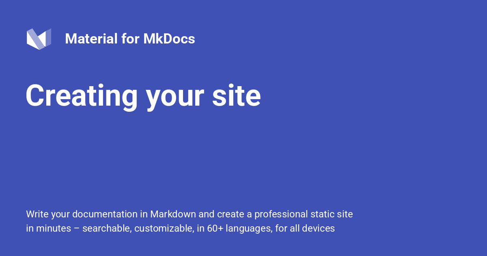

{ .center-image }
<H1 style="text-align: center;">Creating Your Site</H1>

!!! desc "After Installation"

    #### After Installation.
    
    After you've [installed] Material for MkDocs, you can bootstrap your project documentation using the `mkdocs` executable. Go to the directory where you want your project to be located and enter:
    
    ```
    mkdocs new .
    ```
    
!!! info "Docker Use"

    #### Docker Use.
    
    Alternatively, if you're running Material for MkDocs from within Docker, use:
    
    === "Unix, Powershell"
    
        ```
        docker run --rm -it -v ${PWD}:/docs squidfunk/mkdocs-material new .
        ```
        
    === "Windows (cmd)"

        ```
        docker run --rm -it -v "%cd%":/docs squidfunk/mkdocs-material new .
        ```
    
!!! desc " File Structure Created"

    #### This will create the following structure:
    
    ``` { .sh .no-copy }
    .
    ├─ docs/
    │  └─ index.md
    └─ mkdocs.yml
    ```
    
  [installed]: ../MkDocs-Material-Start.md

## Configuration

### Minimal Configuration

!!! success "Minimal Configuration"

    Simply set the `site_name` and add the following lines to `mkdocs.yml` to enable the theme:
    
    ``` yaml hl_lines="2-5"
    site_name: My site
    site_url: https://mydomain.org/mysite
    theme:
      name: material
    ```
    
    The `site_url` setting is important for a number of reasons. By default, MkDocs will assume that your site is hosted at the root of your domain. This is not the case, for example, when [publishing to GitHubpages] - unless you use a custom domain. Another reason is that some of the plugins require the `site_url` to be set, so you should always do this.
    
  [publishing to GitHub pages]: publishing-your-site.md#github-pages
  [installation methods]: getting-started.md#installation

???+ tip "Recommended: [configuration validation and auto-complete]"

    In order to minimize friction and maximize productivity, Material for MkDocsprovides its own [schema.json][`^1`] for `mkdocs.yml`. If your editor supports YAML schema validation, it's definitely recommended to set it up:

    === "Visual Studio Code"

        1.  Install [`vscode-yaml`][vscode-yaml] for YAML language support.
        2.  Add the schema under the `yaml.schemas` key in your user or workspace [`settings.json`][settings.json]:

            ``` json
            {
              "yaml.schemas": {
                "https://squidfunk.github.io/mkdocs-material/schema.json": "mkdocs.yml"
              },
              "yaml.customTags": [ // (1)!
                "!ENV scalar",
                "!ENV sequence",
                "!relative scalar",
                "tag:yaml.org,2002:python/name:material.extensions.emoji.to_svg",
                "tag:yaml.org,2002:python/name:material.extensions.emoji.twemoji",
                "tag:yaml.org,2002:python/name:pymdownx.superfences.fence_code_format",
                "tag:yaml.org,2002:python/object/apply:pymdownx.slugs.slugify mapping"
              ]
            }
            ```

        1.  This setting is necessary if you plan to use [icons and emojis], or Visual Studio Code will show errors on certain lines.

    === "Other"

        1.  Ensure your editor of choice has support for YAML schema validation.
        2.  Add the following lines at the top of `mkdocs.yml`:

            ``` yaml
            # yaml-language-server: $schema=https://squidfunk.github.io/mkdocs-material/schema.json
            ```

  [^1]:
    If you're a MkDocs plugin or Markdown extension author and your project works with Material for MkDocs, you're very much invited to contribute a schema for your [extension] or [plugin] as part of a pull request on GitHub. If you already have a schema defined, or wish to self-host your schema to reduce duplication, you can add it via [$ref].

  [configuration validation and auto-complete]: https://x.com/squidfunk/status/1487746003692400642
  [schema.json]: schema.json
  [vscode-yaml]: https://marketplace.visualstudio.com/items?itemName=redhat.vscode-yaml
  [settings.json]: https://code.visualstudio.com/docs/getstarted/settings
  [extension]: https://github.com/squidfunk/mkdocs-material/tree/master/docs/schema/extensions
  [plugin]: https://github.com/squidfunk/mkdocs-material/tree/master/docs/schema/plugins
  [$ref]: https://json-schema.org/understanding-json-schema/structuring.html#ref
  [icons and emojis]: icons-emojis.md

### Advanced Configuration

Material for MkDocs comes with many configuration options. The setup section explains in great detail how to configure and customize colors, fonts, icons and much more:

<div class="grid cards cols-3" markdown>

-   <span style="color: #2094f3">:material-palette:</span> **Changing the Colors**
    [:octicons-arrow-right-24: View Guide](changing-the-colors.md){ .md-button style="border-color: #2094f3; color: #2094f3" }
    
    Customise primary and accent colors to match your brand identity.

-   <span style="color: #2094f3">:material-format-font:</span> **Changing the Fonts**
    [:octicons-arrow-right-24: View Guide](changing-the-fonts.md){ .md-button style="border-color: #2094f3; color: #2094f3" }
    
    Configure Google Fonts or custom web fonts for typography.

-   <span style="color: #2094f3">:material-translate:</span> **Changing the Language**
    [:octicons-arrow-right-24: View Guide](changing-the-language.md){ .md-button style="border-color: #2094f3; color: #2094f3" }
    
    Localize your site interface and search into 50+ languages.

-   <span style="color: #00e5ff">:material-emoticon-happy-outline:</span> **Changing the Logo**
    [:octicons-arrow-right-24: View Guide](changing-the-logo-and-icons.md){{ .md-button style="border-color: #00e5ff; color: #00e5ff" }
    
    Set a custom logo and choose from thousands of integrated icons.

-   <span style="color: #00e5ff">:material-shield-check:</span> **Data Privacy**
    [:octicons-arrow-right-24: View Guide](ensuring-data-privacy.md){ .md-button style="border-color: #00e5ff; color: #00e5ff" }
    
    Enable GDPR-compliant features and cookie consent management.

-   <span style="color: #00e5ff">:material-compass:</span> **Site Navigation**
    [:octicons-arrow-right-24: View Guide](setting-up-navigation.md){ .md-button style="border-color: #00e5ff; color: #00e5ff" }
    
    Define your site structure, tabs, and table of contents behavior.

-   <span style="color: #4caf50">:material-magnify:</span> **Site Search**
    [:octicons-arrow-right-24: View Guide](setting-up-site-search.md){ .md-button style="border-color: #4caf50; color: #4caf50" }
    
    Configure the built-in search engine with highlighting and indexing.

-   <span style="color: #4caf50">:material-chart-bar:</span> **Site Analytics**
    [:octicons-arrow-right-24: View Guide](setting-up-site-analytics.md){ .md-button style="border-color: #4caf50; color: #4caf50" }
    
    Integrate Google Analytics or other privacy-focused tracking tools.

-   <span style="color: #4caf50">:material-page-layout-header:</span> **The Header**
    [:octicons-arrow-right-24: View Guide](setting-up-the-header.md){ .md-button style="border-color: #4caf50; color: #4caf50" }
    
    Customize the sticky header, search bar, and repository links.

-   <span style="color: #ff9800">:material-page-layout-footer:</span> **The Footer**
    [:octicons-arrow-right-24: View Guide](setting-up-the-footer.md){ .md-button style="border-color: #ff9800; color: #ff9800" }
    
    Manage "Previous/Next" buttons and the copyright notice area.

-   <span style="color: #ff9800">:material-card-account-details:</span> **Social Cards**
    [:octicons-arrow-right-24: View Guide](setting-up-social-cards.md){ .md-button style="border-color: #ff9800; color: #ff9800" }
    
    Generate automatic preview images for Twitter and LinkedIn shares.

-   <span style="color: #ff9800">:material-post:</span> **Setting up a Blog**
    [:octicons-arrow-right-24: View Guide](setting-up-a-blog.md){ .md-button style="border-color: #ff9800; color: #ff9800" }
    
    Transform your documentation into a fully-featured technical blog.

-   <span style="color: #005eff">:material-tag:</span> **Setting up Tags**
    [:octicons-arrow-right-24: View Guide](setting-up-tags.md){ .md-button style="border-color: #005eff; color: #005eff" }
    
    Organize content with categories and tags for easier discovery.

-   <span style="color: #005eff">:material-source-branch:</span> **Versioning**
    [:octicons-arrow-right-24: View Guide](setting-up-versioning.md){ .md-button style="border-color: #005eff; color: #005eff" }
    
    Host multiple versions of your documentation simultaneously.

-   <span style="color: #005eff">:material-git:</span> **Git Repository**
    [:octicons-arrow-right-24: View Guide](adding-a-git-repository.md){ .md-button style="border-color: #005eff; color: #005eff" }
    
    Link your source code to enable "Edit this page" functionality.

-   <span style="color: #f44336">:material-comment-text-outline:</span> **Comment System**
    [:octicons-arrow-right-24: View Guide](adding-a-comment-system.md){ .md-button style="border-color: #f44336; color:#f44336" }
    
    Integrate Giscus or Disqus to build community engagement.

-   <span style="color: #f44336;">:material-lightning-bolt:</span> **Optimization**
    [:octicons-arrow-right-24: View Guide](building-an-optimized-site.md){ .md-button style="border-color: #f44336; color:#f44336" }
    
    Minify CSS/JS and optimize images for lightning-fast loading.

-   <span style="color: #f44336;">:material-wifi-off:</span> **Offline Usage**
    [:octicons-arrow-right-24: View Guide](building-for-offline-usage.md){ .md-button style="border-color: #f44336; color:#f44336" }
    
    Package your documentation for use without an internet connection.

</div>

!!! desc ""
    Furthermore, see the list of supported [Markdown extensions] that are natively integrated with Material for MkDocs, delivering an unprecedented low-effort technical writing experience.
    
  [Markdown extensions]: https://facelessuser.github.io/pymdown-extensions/#extensions
  [Changing the colors]: changing-the-colors.md
  [Changing the fonts]: changing-the-fonts.md
  [Changing the language]: changing-the-language.md
  [Changing the logo and icons]: changing-the-logo-and-icons.md
  [Ensuring data privacy]: ensuring-data-privacy.md
  [Setting up navigation]: setting-up-navigation.md
  [Setting up site search]: setting-up-site-search.md
  [Setting up site analytics]: setting-up-site-analytics.md
  [Setting up social cards]: setting-up-social-cards.md
  [Setting up a blog]: setting-up-a-blog.md
  [Setting up tags]: setting-up-tags.md
  [Setting up versioning]: setting-up-versioning.md
  [Setting up the header]: setting-up-the-header.md
  [Setting up the footer]: setting-up-the-footer.md
  [Adding a git repository]: adding-a-git-repository.md
  [Adding a comment system]: adding-a-comment-system.md
  [Building for offline usage]: building-for-offline-usage.md
  [Building an optimized site]: building-an-optimized-site.md
  

## Templates

!!! instruction "Starting a New Project"

    If you want to jump start a new project, you can use one of our growing collection of templates:
    
<div class="grid cards" markdown>

-   :closed_lock_with_key: &nbsp; __[Blog][blog-template]__

    ---

    Create a blog

-   :lock_with_ink_pen: &nbsp; __[Social cards][social-cards-template]__

    ---

    Create documentation with social cards

</div>

[blog-template]: https://github.com/mkdocs-material/create-blog
[social-cards-template]: https://github.com/mkdocs-material/create-social-cards


## Previewing as you Write

!!! assumption "Previewing as you Write"

    [Back to: Previewing your Site](info.md#previewing-your-site)

    MkDocs includes a live preview server, so you can preview your changes as you write your documentation. The server will automatically rebuild the site upon saving. Start it with:

    ``` sh
    mkdocs serve # (1)!
    ```

    1.  If you have a large documentation project, it might take minutes 
    until MkDocs has rebuilt all pages for you to preview. If you're only
    interested in the current page, the [`--dirtyreload`] [--dirtyreload] flag will make
    rebuilds much faster:
    
        ```
        mkdocs serve --dirtyreload
        ```

    If you're running Material for MkDocs from within Docker, use:

    === "Unix, Powershell"

        ```
        docker run --rm -it -p 8000:8000 -v \${PWD}:/docs squidfunk/mkdocs-material
        ```

    === "Windows"

        ```
        docker run --rm -it -p 8000:8000 -v "%cd%":/docs squidfunk/mkdocs-material
        ```

    Point your browser to [localhost:8000][live preview] and you should see:

    [![Creating your site]][Creating your site]


  [--dirtyreload]: https://www.mkdocs.org/about/release-notes/#support-for-dirty-builds-990
  [live preview]: http://localhost:8000
  [Creating your site]: ../assets/assets/screenshots/creating-your-site.png
  

## Building your Site

!!! tldr "Building your Site"

    [Building your Project](info.md#)

    When you're finished editing, you can build a static site from your Markdown files with:

    ```
    mkdocs build
    ```

    !!! recommendation ""

        If you're running Material for MkDocs from within Docker, use:

        === "Unix, Powershell"

            ```
            docker run --rm -it -v \${PWD}:/docs squidfunk/mkdocs-material build
            ```

        === "Windows"

            ```
            docker run --rm -it -v "%cd%":/docs squidfunk/mkdocs-material build
            ```

    The contents of this directory make up your project documentation. There's no need for operating a database or server, as it is completely self-contained. The site can be hosted on [GitHub Pages], [GitLab Pages], a CDN of your choice or your private web space.

  [GitHub Pages]: publishing-your-site.md#github-pages
  [GitLab pages]: publishing-your-site.md#gitlab-pages

!!! decision "Read more about building for offline usage"

    If you intend to distribute your documentation as a set of files to be read from a local filesystem rather than a web server (such as in a `.zip` file), please read the notes about [building for offline usage].
    
  [building for offline usage]: building-for-offline-usage.md
  
