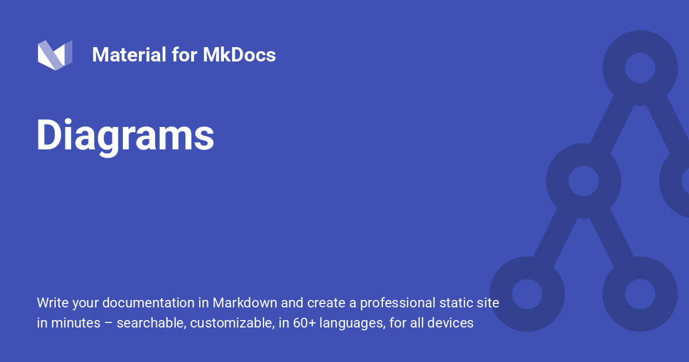{: style="display: block; margin: 0 auto"}
<H1 style="text-align: center;">Diagrams</H1>


!!! quote ""
    Diagrams help to communicate complex relationships and interconnections between different technical components, and are a great addition to project documentation. Material for MkDocs integrates with [Mermaid.js], a very popular and flexible solution for drawing diagrams.
    
  [Mermaid.js]: https://mermaid.js.org/

## Configuration

<!-- md:version 8.2.0 -->

!!! info "Configuration"

    This configuration enables native support for [Mermaid.js] diagrams. Material for MkDocs will automatically initialize the JavaScript runtime when a page includes a `mermaid` code block:
    
    ``` yaml
    markdown_extensions:
      - pymdownx.superfences:
          custom_fences:
            - name: mermaid
              class: mermaid
              format: !!python/name:pymdownx.superfences.fence_code_format
    ```
    
    ---
    
    No further configuration is necessary. Advantages over a custom integration:
    
    - [x] Works with [instant loading] without any additional effort
    - [x] Diagrams automatically use fonts and colors defined in `mkdocs.yml`[^1]
    - [x] Fonts and colors can be customized with [additional style sheets]
    - [x] Support for both, light and dark color schemes – _try it on this page!_
    
   [^1]:
    While all [Mermaid.js] features should work out-of-the-box, Material for MkDocs will currently only adjust the fonts and colors for flowcharts, sequence diagrams, class diagrams, state diagrams and entity relationship diagrams. See the section on [other diagrams] for more information why this is currently not implemented for all diagrams.
    
  [instant loading]: setting-up-navigation.md#instant-loading
  [additional style sheets]: customization.md#additional-css
  [other diagrams]: #other-diagram-types

## Usage

### Using Flowcharts

[Flowcharts] are diagrams that represent workflows or processes. The steps are rendered as nodes of various kinds and are connected by edges, describing the necessary order of steps:

!!! pied-piper ""

    ```` markdown title="Flow Chart"
    ``` mermaid
    graph LR
      A[Start] --> B{Error?};
      B -->|Yes| C[Hmm...];
      C --> D[Debug];
      D --> B;
      B ---->|No| E[Yay!];
    ```
    ````


<div class="result" markdown>

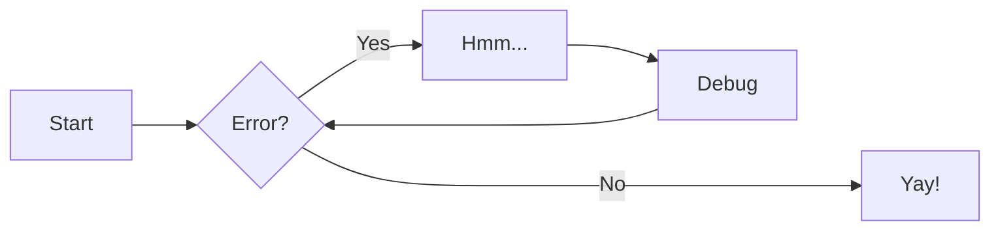
``` mermaid
graph LR
  A[Start] --> B{Error?};
  B -->|Yes| C[Hmm...];
  C --> D[Debug];
  D --> B;
  B ---->|No| E[Yay!];
```

</div>

  [Flowcharts]: https://mermaid.js.org/syntax/flowchart.html

### Using Sequence Diagrams

[Sequence diagrams] describe a specific scenario as sequential interactions between multiple objects or actors, including the messages that are exchanged between those actors:

!!! pied-piper ""

    ```` markdown title="Sequence Diagram"
    ``` mermaid
    sequenceDiagram
      autonumber
      Alice->>John: Hello John, how are you?
      loop Healthcheck
          John->>John: Fight against hypochondria
      end
      Note right of John: Rational thoughts!
      John-->>Alice: Great!
      John->>Bob: How about you?
      Bob-->>John: Jolly good!
    ```
    ````


<div class="result" markdown>

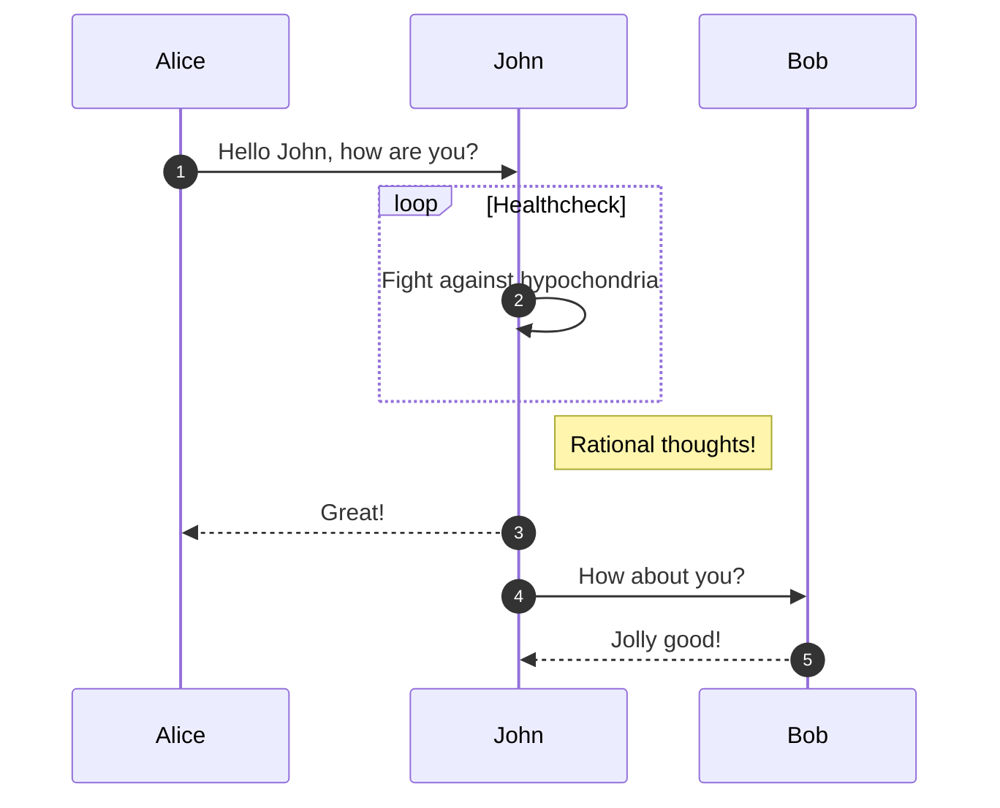
``` mermaid
sequenceDiagram
  autonumber
  Alice->>John: Hello John, how are you?
  loop Healthcheck
      John->>John: Fight against hypochondria
  end
  Note right of John: Rational thoughts!
  John-->>Alice: Great!
  John->>Bob: How about you?
  Bob-->>John: Jolly good!
```

</div>

  [Sequence diagrams]: https://mermaid.js.org/syntax/sequenceDiagram.html

### Using State Diagrams

[State diagrams] are a great tool to describe the behavior of a system, decomposing it into a finite number of states, and transitions between those states:

!!! pied-piper ""

    ```` markdown title="State Diagram"
    ``` mermaid
    stateDiagram-v2
      state fork_state <<fork>>
        [*] --> fork_state
        fork_state --> State2
        fork_state --> State3

        state join_state <<join>>
        State2 --> join_state
        State3 --> join_state
        join_state --> State4
        State4 --> [*]
    ```
    ````


<div class="result" markdown>

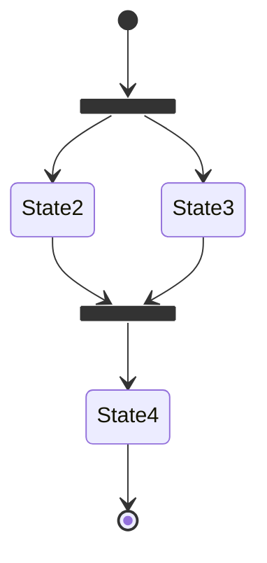
``` mermaid
stateDiagram-v2
  state fork_state <<fork>>
    [*] --> fork_state
    fork_state --> State2
    fork_state --> State3

    state join_state <<join>>
    State2 --> join_state
    State3 --> join_state
    join_state --> State4
    State4 --> [*]
```

</div>

  [State diagrams]: https://mermaid.js.org/syntax/stateDiagram.html

### Using Class Diagrams

[Class diagrams] are central to object oriented programming, describing the structure of a system by modelling entities as classes and relationships between them:

!!! pied-piper ""

    ```` markdown title="Class Diagram"
    ``` mermaid
    classDiagram
      Person <|-- Student
      Person <|-- Professor
      Person : +String name
      Person : +String phoneNumber
      Person : +String emailAddress
      Person: +purchaseParkingPass()
      Address "1" <-- "0..1" Person:lives at
      class Student{
        +int studentNumber
        +int averageMark
        +isEligibleToEnrol()
        +getSeminarsTaken()
      }
      class Professor{
        +int salary
      }
      class Address{
        +String street
        +String city
        +String state
        +int postalCode
        +String country
        -validate()
        +outputAsLabel()
      }
    ```
    ````


<div class="result" markdown>

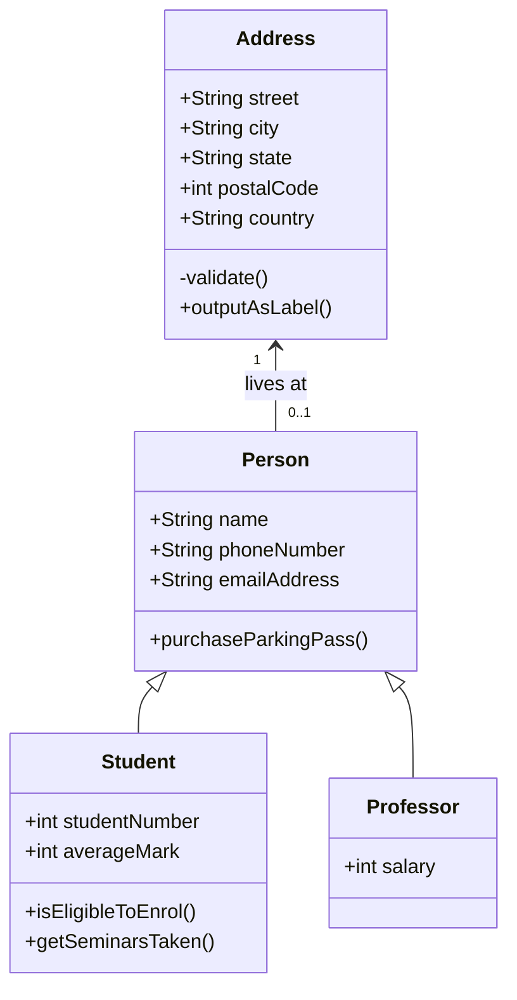
``` mermaid
classDiagram
  Person <|-- Student
  Person <|-- Professor
  Person : +String name
  Person : +String phoneNumber
  Person : +String emailAddress
  Person: +purchaseParkingPass()
  Address "1" <-- "0..1" Person:lives at
  class Student{
    +int studentNumber
    +int averageMark
    +isEligibleToEnrol()
    +getSeminarsTaken()
  }
  class Professor{
    +int salary
  }
  class Address{
    +String street
    +String city
    +String state
    +int postalCode
    +String country
    -validate()
    +outputAsLabel()
  }
```

</div>

  [Class diagrams]: https://mermaid.js.org/syntax/classDiagram.html

### Using Entity-relationship Diagrams

An [entity-relationship diagram] is composed of entity types and specifies relationships that exist between entities. It describes inter-related things in a specific domain of knowledge:

!!! pied-piper ""

    ```` markdown title="Entity-relationship Diagram"
    ``` mermaid
    erDiagram
      CUSTOMER ||--o{ ORDER : places
      ORDER ||--|{ LINE-ITEM : contains
      LINE-ITEM {
        string name
        int pricePerUnit
      }
      CUSTOMER }|..|{ DELIVERY-ADDRESS : uses
    ```
    ````


<div class="result" markdown>

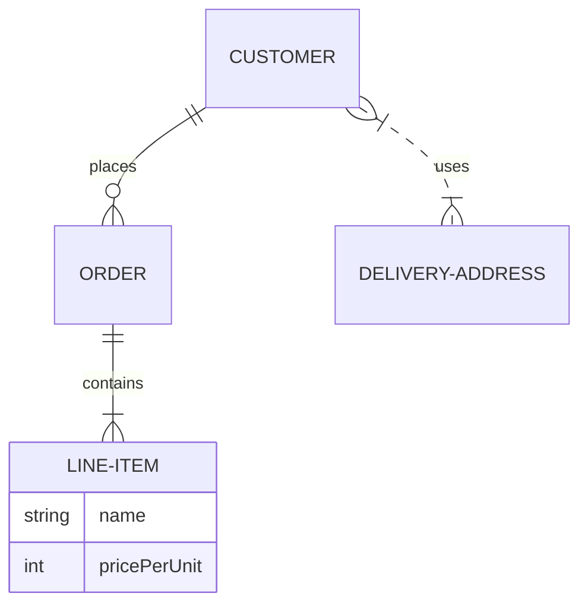
``` mermaid
erDiagram
  CUSTOMER ||--o{ ORDER : places
  ORDER ||--|{ LINE-ITEM : contains
  LINE-ITEM {
    string name
    int pricePerUnit
  }
  CUSTOMER }|..|{ DELIVERY-ADDRESS : uses
```

</div>

  [entity-relationship diagram]: https://mermaid.js.org/syntax/entityRelationshipDiagram.html

### Other Diagram Types

Besides the diagram types listed above, [Mermaid.js] provides support for [pie charts], [gantt charts], [user journeys], [git graphs] and [requirement diagrams], all of which are not officially supported by Material for MkDocs. Those diagrams should still work as advertised by [Mermaid.js], but we don't consider them a good choice, mostly as they don't work well on mobile.

  [pie charts]: https://mermaid.js.org/syntax/pie.html
  [gantt charts]: https://mermaid.js.org/syntax/gantt.html
  [user journeys]: https://mermaid.js.org/syntax/userJourney.html
  [git graphs]: https://mermaid.js.org/syntax/gitgraph.html
  [requirement diagrams]: https://mermaid.js.org/syntax/requirementDiagram.html

## Customization

If you want to customize Mermaid.js, e.g. to bring in support for [ELK layouts], you can do so by adding a custom JavaScript file to your `mkdocs.yml`:

=== ":octicons-file-code-16: `docs/javascripts/mermaid.mjs`"

    ``` js
    import mermaid from 'https://cdn.jsdelivr.net/npm/mermaid@11/dist/mermaid.esm.min.mjs';
    import elkLayouts from 'https://cdn.jsdelivr.net/npm/@mermaid-js/layout-elk@0/dist/mermaid-layout-elk.esm.min.mjs';

    mermaid.registerLayoutLoaders(elkLayouts);
    mermaid.initialize({
      startOnLoad: false,
      securityLevel: "loose",
      layout: "elk",
    });

    // Important: necessary to make it visible to Material for MkDocs
    window.mermaid = mermaid;
    ```

=== ":octicons-file-code-16: `mkdocs.yml`"

    ``` yaml
    extra_javascript:
      - javascripts/mermaid.mjs
    ```

  [ELK layouts]: https://www.npmjs.com/package/@mermaid-js/layout-elk


---

$$
\cos x=\sum_{k=0}^{\infty}\frac{(-1)^k}{(2k)!}x^{2k}
$$

---

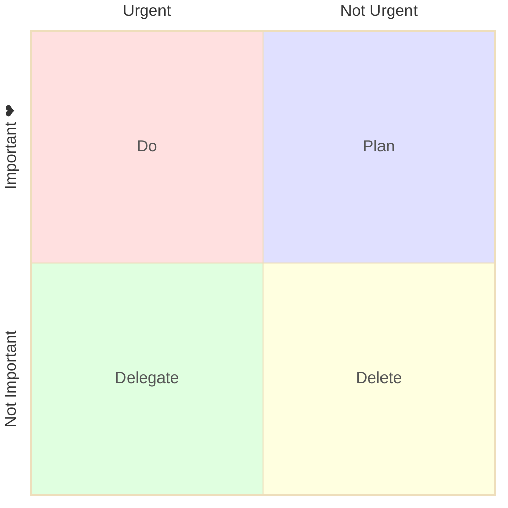
```mermaid
---
config:
  theme: base
  themeVariables:
    # Top Right (Plan) - Purple/Blue
    quadrant1Fill: "rgba(100, 100, 255, 0.2)"
    # Top Left (Do) - Red/Pink
    quadrant2Fill: "rgba(255, 100, 100, 0.2)"
    # Bottom Left (Delegate) - Green
    quadrant3Fill: "rgba(100, 255, 100, 0.2)"
    # Bottom Right (Delete) - Yellow/Brown
    quadrant4Fill: "rgba(255, 255, 100, 0.2)"
    
    # Darker text for visibility in Light Mode
    quadrant1TextFill: "#555"
    quadrant2TextFill: "#555"
    quadrant3TextFill: "#555"
    quadrant4TextFill: "#555"
    
    quadrantTitleFill: "#666"
    quadrantAxisTextFill: "#666"
    quadrantInternalBorderStroke: "rgba(128, 128, 128, 0.5)"
---
quadrantChart
  x-axis Urgent --> Not Urgent
  y-axis Not Important --> "Important ❤"
  quadrant-1 Plan
  quadrant-2 Do
  quadrant-3 Delegate
  quadrant-4 Delete
```

---


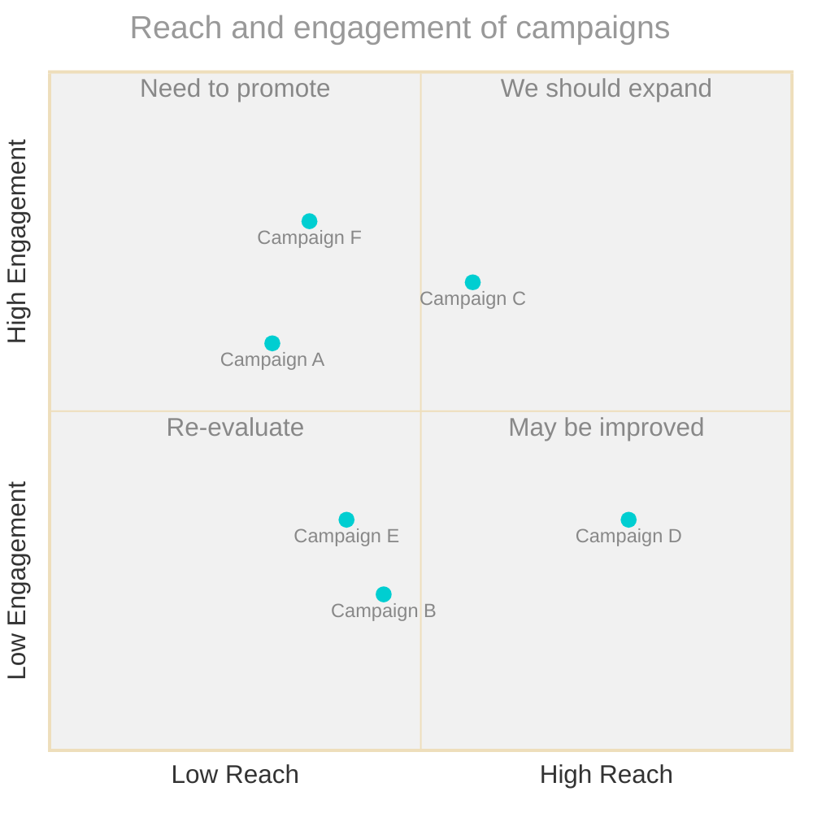
```mermaid
---
config:
  theme: base
  themeVariables:
    # Transparent fills to let the system background show through
    quadrant1Fill: "rgba(120, 120, 120, 0.1)"
    quadrant2Fill: "rgba(120, 120, 120, 0.1)"
    quadrant3Fill: "rgba(120, 120, 120, 0.1)"
    quadrant4Fill: "rgba(120, 120, 120, 0.1)"
    
    # Neutral gray text visible on both black and white
    quadrant1TextFill: "#888"
    quadrant2TextFill: "#888"
    quadrant3TextFill: "#888"
    quadrant4TextFill: "#888"
    
    # Axis and Label colors
    quadrantTitleFill: "#999"
    quadrantAxisTextFill: "#999"
    quadrantInternalBorderStroke: "#666"
    
    # Points and their labels (bright teal/cyan works for both modes)
    quadrantPointFill: "#00ced1"
    quadrantPointTextFill: "#888"
---
quadrantChart
    title Reach and engagement of campaigns
    x-axis Low Reach --> High Reach
    y-axis Low Engagement --> High Engagement
    quadrant-1 We should expand
    quadrant-2 Need to promote
    quadrant-3 Re-evaluate
    quadrant-4 May be improved
    Campaign A: [0.3, 0.6]
    Campaign B: [0.45, 0.23]
    Campaign C: [0.57, 0.69]
    Campaign D: [0.78, 0.34]
    Campaign E: [0.40, 0.34]
    Campaign F: [0.35, 0.78]
```

---

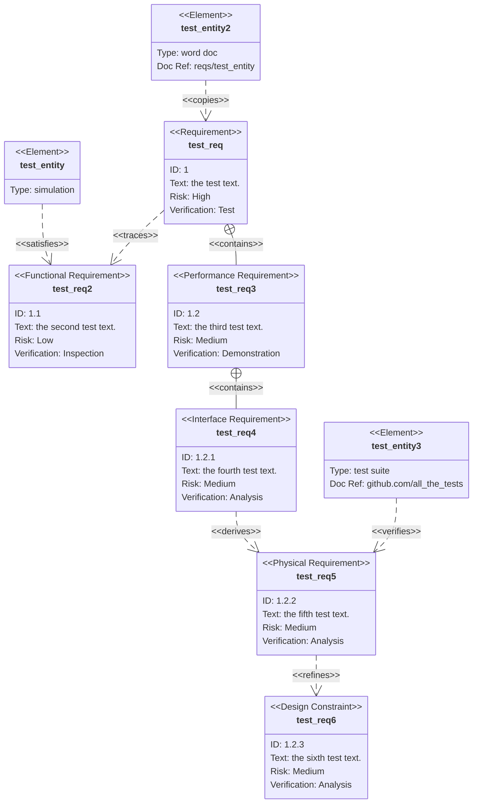
```mermaid
    requirementDiagram

    requirement test_req {
    id: 1
    text: the test text.
    risk: high
    verifymethod: test
    }

    functionalRequirement test_req2 {
    id: 1.1
    text: the second test text.
    risk: low
    verifymethod: inspection
    }

    performanceRequirement test_req3 {
    id: 1.2
    text: the third test text.
    risk: medium
    verifymethod: demonstration
    }

    interfaceRequirement test_req4 {
    id: 1.2.1
    text: the fourth test text.
    risk: medium
    verifymethod: analysis
    }

    physicalRequirement test_req5 {
    id: 1.2.2
    text: the fifth test text.
    risk: medium
    verifymethod: analysis
    }

    designConstraint test_req6 {
    id: 1.2.3
    text: the sixth test text.
    risk: medium
    verifymethod: analysis
    }

    element test_entity {
    type: simulation
    }

    element test_entity2 {
    type: word doc
    docRef: reqs/test_entity
    }

    element test_entity3 {
    type: "test suite"
    docRef: github.com/all_the_tests
    }


    test_entity - satisfies -> test_req2
    test_req - traces -> test_req2
    test_req - contains -> test_req3
    test_req3 - contains -> test_req4
    test_req4 - derives -> test_req5
    test_req5 - refines -> test_req6
    test_entity3 - verifies -> test_req5
    test_req <- copies - test_entity2
```

---


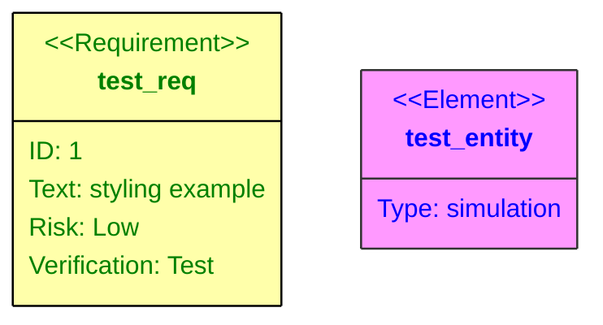
```mermaid
requirementDiagram

requirement test_req {
    id: 1
    text: styling example
    risk: low
    verifymethod: test
}

element test_entity {
    type: simulation
}

style test_req fill:#ffa,stroke:#000, color: green
style test_entity fill:#f9f,stroke:#333, color: blue
```

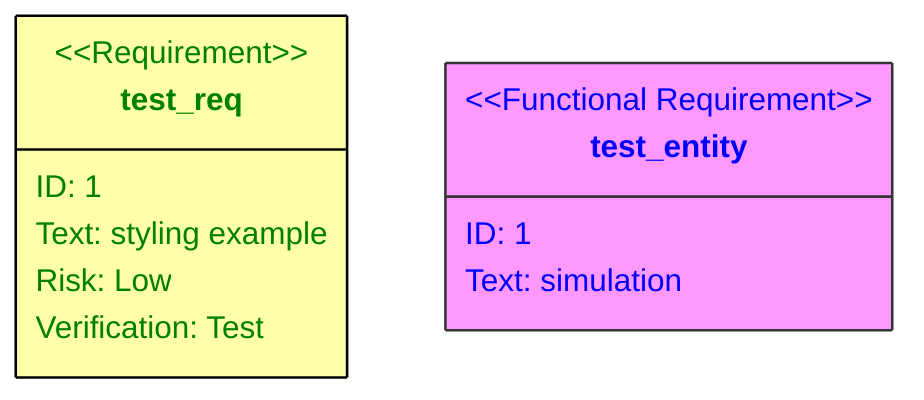
```mermaid
requirementDiagram

requirement test_req {
    id: 1
    text: styling example
    risk: low
    verifymethod: test
}

functionalRequirement test_entity {
    id: 1
    text: simulation
}

style test_req fill:#ffa,stroke:#000, color: green
style test_entity fill:#f9f,stroke:#333, color: blue
```

---


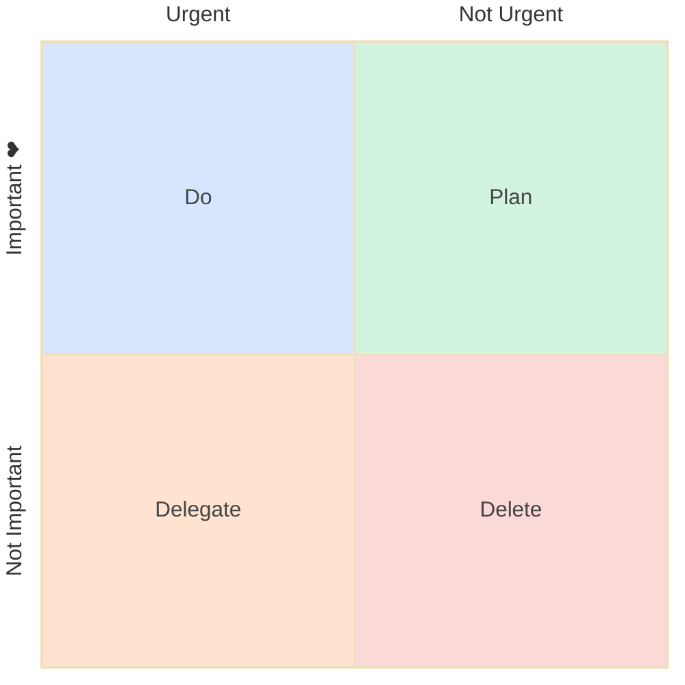
```mermaid
---
config:
  theme: base
  themeVariables:
    # Clean RGBA (no #) - 0.2 alpha gives enough color for light mode
    quadrant1Fill: "rgba(34, 197, 94, 0.2)"   # Green (Plan)
    quadrant2Fill: "rgba(59, 130, 246, 0.2)"  # Blue (Do)
    quadrant3Fill: "rgba(249, 115, 22, 0.2)"  # Orange (Delegate)
    quadrant4Fill: "rgba(239, 68, 68, 0.2)"   # Red (Delete)
    
    # Darker text to ensure it's "crisp" in light mode
    quadrant1TextFill: "#444"
    quadrant2TextFill: "#444"
    quadrant3TextFill: "#444"
    quadrant4TextFill: "#444"
    
    # Infrastructure - keeping lines subtle but present
    quadrantTitleFill: "#555"
    quadrantAxisTextFill: "#555"
    quadrantInternalBorderStroke: "rgba(0, 0, 0, 0.1)"
---
quadrantChart
  x-axis Urgent --> Not Urgent
  y-axis Not Important --> "Important ❤"
  quadrant-1 Plan
  quadrant-2 Do
  quadrant-3 Delegate
  quadrant-4 Delete
```

---

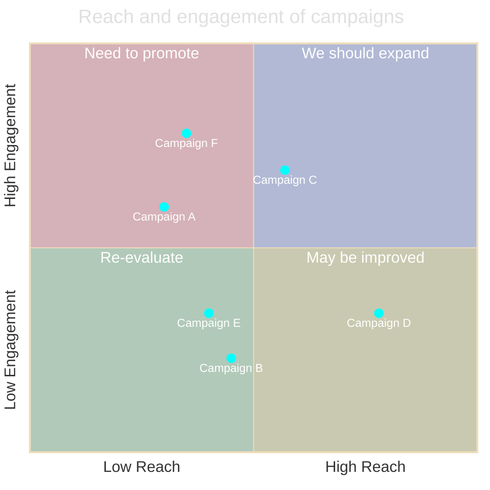
```mermaid
---
config:
  theme: base
  themeVariables:
    # Rich "Vibrant" tones
    quadrant1Fill: "rgba(60, 80, 150, 0.4)"   # Deep Blue
    quadrant2Fill: "rgba(150, 60, 80, 0.4)"   # Burgundy
    quadrant3Fill: "rgba(60, 120, 80, 0.4)"   # Forest Green
    quadrant4Fill: "rgba(120, 120, 60, 0.4)"  # Olive/Gold
    
    # White text is the secret for Dark Mode; 
    # it becomes a "Charcoal" gray in most light-mode renderers automatically
    quadrant1TextFill: "#ffffff"
    quadrant2TextFill: "#ffffff"
    quadrant3TextFill: "#ffffff"
    quadrant4TextFill: "#ffffff"
    
    # Points & Labels
    quadrantPointFill: "#00ffff"
    quadrantPointTextFill: "#ffffff"
    
    # Infrastructure
    quadrantTitleFill: "#e0e0e0"
    quadrantAxisTextFill: "#cccccc"
    quadrantInternalBorderStroke: "rgba(255, 255, 255, 0.15)"
---
quadrantChart
    title Reach and engagement of campaigns
    x-axis Low Reach --> High Reach
    y-axis Low Engagement --> High Engagement
    quadrant-1 We should expand
    quadrant-2 Need to promote
    quadrant-3 Re-evaluate
    quadrant-4 May be improved
    Campaign A: [0.3, 0.6]
    Campaign B: [0.45, 0.23]
    Campaign C: [0.57, 0.69]
    Campaign D: [0.78, 0.34]
    Campaign E: [0.40, 0.34]
    Campaign F: [0.35, 0.78]
```

---

#### "Universal Dashboard" template


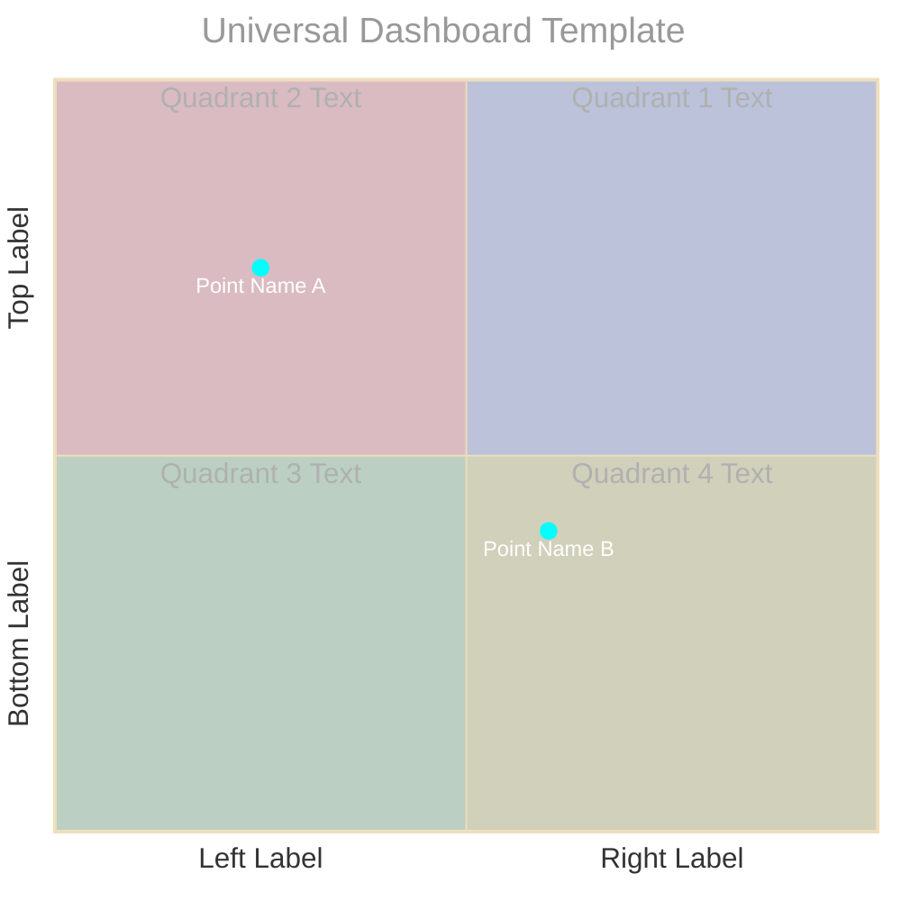
```mermaid
%%{init: {
  'theme': 'base',
  'themeVariables': {
    'quadrant1Fill': 'rgba(60, 80, 150, 0.35)',
    'quadrant2Fill': 'rgba(150, 60, 80, 0.35)',
    'quadrant3Fill': 'rgba(60, 120, 80, 0.35)',
    'quadrant4Fill': 'rgba(120, 120, 60, 0.35)',
    'quadrant1TextFill': '#b0b0b0',
    'quadrant2TextFill': '#b0b0b0',
    'quadrant3TextFill': '#b0b0b0',
    'quadrant4TextFill': '#b0b0b0',
    'quadrantPointFill': '#00ffff',
    'quadrantPointTextFill': '#ffffff',
    'quadrantTitleFill': '#999',
    'quadrantAxisTextFill': '#999',
    'quadrantInternalBorderStroke': 'rgba(150, 150, 150, 0.2)'
  }
} }%%
quadrantChart
    title Universal Dashboard Template
    x-axis Left Label --> Right Label
    y-axis Bottom Label --> Top Label
    quadrant-1 Quadrant 1 Text
    quadrant-2 Quadrant 2 Text
    quadrant-3 Quadrant 3 Text
    quadrant-4 Quadrant 4 Text
    Point Name A: [0.25, 0.75]
    Point Name B: [0.6, 0.4]
```

---


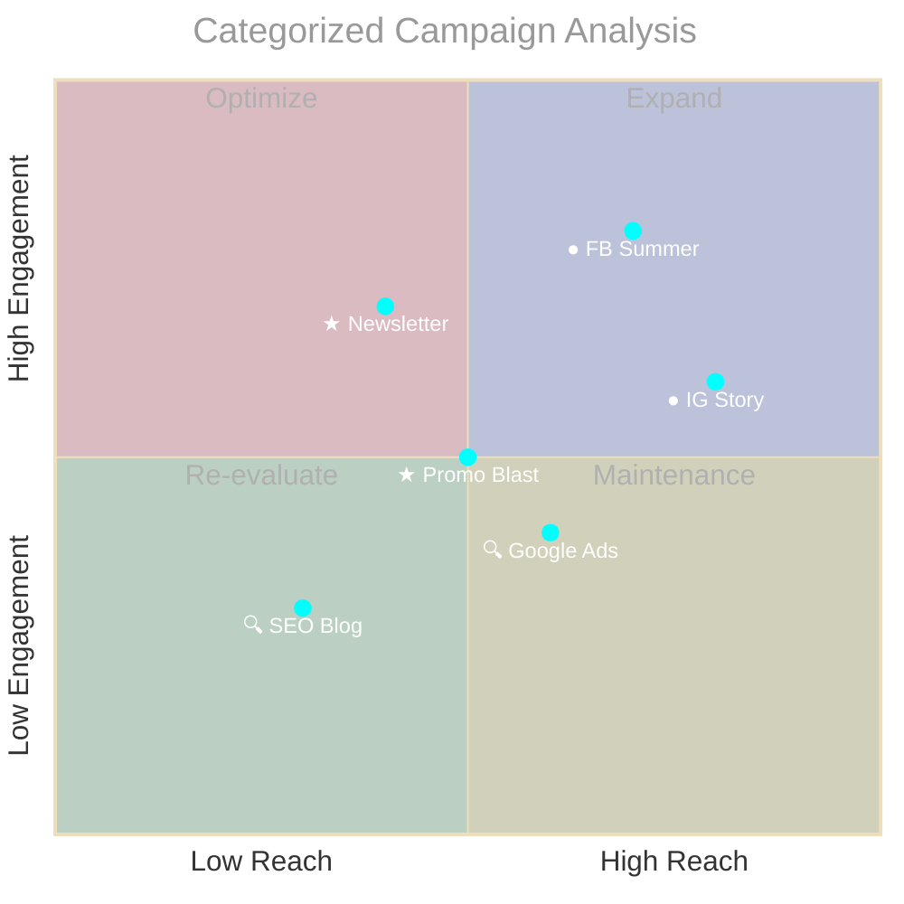
```mermaid
%%{init: {
  'theme': 'base',
  'themeVariables': {
    'quadrant1Fill': 'rgba(60, 80, 150, 0.35)',
    'quadrant2Fill': 'rgba(150, 60, 80, 0.35)',
    'quadrant3Fill': 'rgba(60, 120, 80, 0.35)',
    'quadrant4Fill': 'rgba(120, 120, 60, 0.35)',
    'quadrant1TextFill': '#b0b0b0',
    'quadrant2TextFill': '#b0b0b0',
    'quadrant3TextFill': '#b0b0b0',
    'quadrant4TextFill': '#b0b0b0',
    'quadrantPointFill': '#00ffff',
    'quadrantPointTextFill': '#ffffff',
    'quadrantTitleFill': '#999',
    'quadrantAxisTextFill': '#999',
    'quadrantInternalBorderStroke': 'rgba(150, 150, 150, 0.2)'
  }
} }%%
quadrantChart
    title Categorized Campaign Analysis
    x-axis Low Reach --> High Reach
    y-axis Low Engagement --> High Engagement
    quadrant-1 Expand
    quadrant-2 Optimize
    quadrant-3 Re-evaluate
    quadrant-4 Maintenance
    "● FB Summer": [0.7, 0.8]
    "● IG Story": [0.8, 0.6]
    "★ Newsletter": [0.4, 0.7]
    "★ Promo Blast": [0.5, 0.5]
    "🔍 Google Ads": [0.6, 0.4]
    "🔍 SEO Blog": [0.3, 0.3]
```

