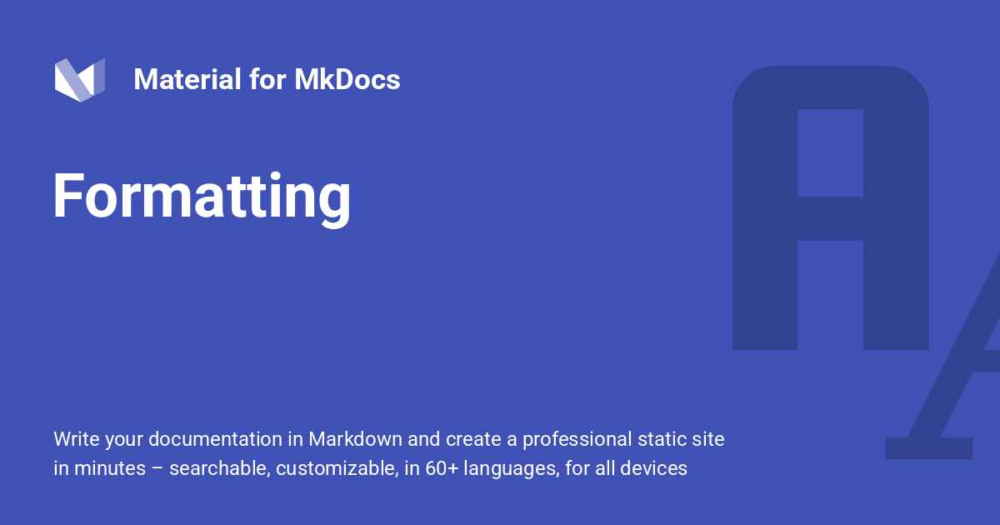

{ .center-image }
<H1 style="text-align: center;">Formatting</H1>

!!! quote "Material Support"

    Material for MkDocs provides support for several HTML elements that can be used to highlight sections of a document or apply specific formatting.
    
    Additionally, [Critic Markup] is supported, adding the ability to display suggested changes for a document.
    
  [Critic Markup]: https://github.com/CriticMarkup/CriticMarkup-toolkit

## Configuration

!!! info "Configuration Support"

    This configuration enables support for keyboard keys, tracking changes in documents, defining sub- and superscript and highlighting text. Add the following lines to `mkdocs.yml`:
    
    ``` yaml
    markdown_extensions:
      - pymdownx.critic
      - pymdownx.caret
      - pymdownx.keys
      - pymdownx.mark
      - pymdownx.tilde
    ```
    
!!! pied-piper "See additional configuration options:"

    - [Critic]
    - [Caret, Mark & Tilde]
    - [Keys]
    
  [Critic]: python-markdown-extensions.md#critic
  [Caret, Mark & Tilde]: python-markdown-extensions.md#caret-mark-tilde
  [Keys]: python-markdown-extensions.md#keys

## Usage

### Highlighting Changes

!!! Info "Highlighting Changes"

    When [Critic] is enabled, [Critic Markup] can be used, which adds the ability to highlight suggested changes, as well as add inline comments to a document:
    
    ``` title="Text with Suggested Changes"
    Text can be {--deleted--} and replacement text {++added++}. This can also be combined into {~~one~>a single~~} 
    operation. {==Highlighting==} is also possible {>>and comments can be added inline<<}.
    
    {==
    
    Formatting can also be applied to blocks by putting the opening and closing tags on separate lines
    and adding new lines between the tags and the content.
    
    ==}
    ```
    
   
<div class="result" markdown>

!!! Info " This Is The Rendered HTML"

    Text can be <del class="critic">deleted</del> and replacement text <ins class="critic">added</ins>. This can also be combined into <del class="critic">one</del><ins class="critic">a single</ins> operation. <mark class="critic">Highlighting</mark> is also possible <span class="critic comment">/* and comments can be added inline */</span>.
    <hr style="margin: 4px 0 8px 0;">
    <mark class="critic block" style="display: block; padding: 8px 15px; margin-top: 0;">Formatting can also be applied to blocks by putting the opening and closing tags on separate lines and adding new lines between the tags and the content.</mark>

</div>


### Highlighting Text

!!! abstract "Highlighting Text"

    When [Caret, Mark & Tilde] are enabled, text can be highlighted with a simple syntax, which is more convenient that directly using the corresponding:
    [`mark`][mark], [`ins`][ins] and [`del`][del] HTML tags:
    
    ``` title="Text with Highlighting"
    - ==This was marked (highlight)==
    - ^^This was inserted (underline)^^
    - ~~This was deleted (strikethrough)~~
    ```
    
    <div class="result" markdown>
    
    ``` title="Resultant Markdown"
    Rendered Code Below!
    ```
    
    - ==This was marked (highlight)==
    - ^^This was inserted (underline)^^
    - ~~This was deleted (strikethrough)~~
    
    </div>
    
  [mark]: https://developer.mozilla.org/en-US/docs/Web/HTML/Element/mark
  [ins]: https://developer.mozilla.org/en-US/docs/Web/HTML/Element/ins
  [del]: https://developer.mozilla.org/en-US/docs/Web/HTML/Element/del

### Sub- and Superscripts

!!! abstract "Sub- and Superscripts"

    When [Caret & Tilde][Caret, Mark & Tilde] are enabled, text can be sub- and superscripted with a simple syntax, which is more convenient than directly using the corresponding [`sub`][sub] and [`sup`][sup] HTML tags:
    
    ``` markdown title="Text with sub- and superscripts"
    - H~2~O
    - A^T^A
    ```
    
    <div class="result" markdown>
    
    - H~2~O
    - A^T^A
    
    </div>
    
  [sub]: https://developer.mozilla.org/en-US/docs/Web/HTML/Element/sub
  [sup]: https://developer.mozilla.org/en-US/docs/Web/HTML/Element/sup

### Adding Keyboard Keys

!!! abstract "Adding Keyboard Keys"

    When [Keys] is enabled, keyboard keys can be rendered with a simple syntax. Consult the [Python Markdown Extensions] documentation to learn about all available shortcodes:
    
    ``` markdown title="Keyboard keys"
    ++ctrl+alt+del++
    ```
    
    <div class="result" markdown>
    
    ++ctrl+alt+del++
    
    </div>
    
  [Python Markdown Extensions]: https://facelessuser.github.io/pymdown-extensions/extensions/keys/#extendingmodifying-key-map-index
