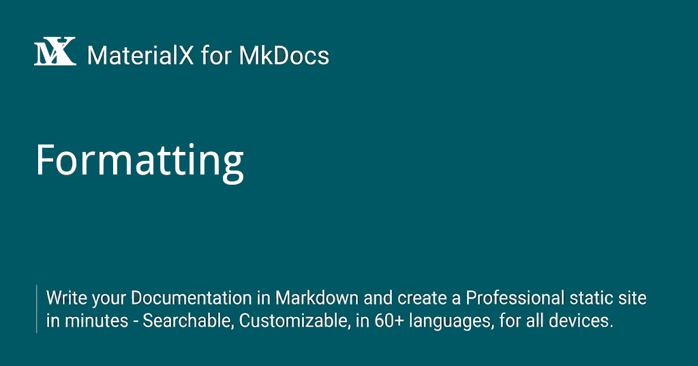

---
tags:
  - Formatting
  - Highlighting Changes

icon: simple/materialformkdocs
---

{ .center-image }
<H1 style="text-align: center;">Formatting</H1>

!!! quote "Material Support"

    Material for MkDocs provides support for several HTML elements that can be used to highlight sections of a document or apply specific formatting.
    
    Additionally, [Critic Markup] is supported, adding the ability to display suggested changes for a document.
    
  [Critic Markup]: https://github.com/CriticMarkup/CriticMarkup-toolkit

## Configuration

!!! info "Configuration Support"

    This configuration enables support for keyboard keys, tracking changes in documents, defining sub- and superscript and highlighting text. Add the following lines to `mkdocs.yml`:
    
    ``` yaml
    markdown_extensions:
      - pymdownx.critic
      - pymdownx.caret
      - pymdownx.keys
      - pymdownx.mark
      - pymdownx.tilde
    ```
    
!!! pied-piper "See additional configuration options:"

    - [Critic]
    - [Caret, Mark & Tilde]
    - [Keys]
    
  [Critic]: python-markdown-extensions.md#critic
  [Caret, Mark & Tilde]: python-markdown-extensions.md#caret-mark-tilde
  [Keys]: python-markdown-extensions.md#keys


#### Highlighting Changes

When [Critic](../MkDocs-Material/python-markdown-extensions.md/#critic) is enabled, [Critic Markup](https://github.com) can be used, which adds the ability to highlight suggested changes, as well as add inline comments to a document:

<div class="highlight"><span class="filename">Text with suggested changes</span><pre><code>Text can be {<span></span>--deleted--} and replacement text {<span></span>++added++}. This can also be combined into {<span></span>~~one~>a single~~} operation. {<span></span>==Highlighting==} is also possible {<span></span>>>and comments can be added inline<<}.

{<span></span>==

Formatting can also be applied to blocks by putting the opening and closing tags on separate lines and adding new lines between the tags and the content.

==}</code></pre></div>

#### Rendered (Highlighting) Markdown 

Text can be {--deleted--} and replacement text {++added++}. This can also be combined into {~~one~>a single~~} operation. {==Highlighting==} is also possible {>>and comments can be added inline<<}.

{==

Formatting can also be applied to blocks by putting the opening and closing tags on separate lines and adding new lines between the tags and the content.

==}

<div class="result" markdown>

!!! Info " This Is The Rendered HTML"

    Text can be <del class="critic">deleted</del> and replacement text <ins class="critic">added</ins>. This can also be combined into <del class="critic">one</del><ins class="critic">a single</ins> operation. <mark class="critic">Highlighting</mark> is also possible <span class="critic comment">/* and comments can be added inline */</span>.
    <hr style="margin: 4px 0 8px 0;">
    <mark class="critic block" style="display: block; padding: 8px 15px; margin-top: 0;">Formatting can also be applied to blocks by putting the opening and closing tags on separate lines and adding new lines between the tags and the content.</mark>

</div>

### Highlighting Changes (Incorrect Method)

!!! desc "Highlighting Changes (Incorrect Method)"

    The same block of code below, but without the `<div class="highlight"><span class="filename">` wrapper and without the `{<span></span>--` protection that blinds `pymdownx.critic`, demonstrates the failure mode directly. Left as a plain fenced code block, Critic's preprocessor reads and renders the syntax before the fence has any chance to shield it — the "raw" content shown below is already fully processed.

    This defeats the entire purpose of the code box. A copy button is pointless if the text it copies isn't the raw syntax the reader actually needs — they'd have to manually retype the correct source from scratch, which is precisely the problem this case study set out to solve.

    Note: the specific corruption observed wasn't a single character dropping from the closing tag as first suspected during troubleshooting — Critic actually consumed forward past the missing closer, collapsing "deleted" and the entire next clause together before the run finally terminated.

    When [Critic] is enabled, [Critic Markup] can be used, which adds the ability to highlight suggested changes, as well as add inline comments to a document:

``` title="Text with suggested changes"
    Text can be {--deleted--} and replacement text {++added++}. This can also be combined into
    {~~one~>a single~~} operation. {==Highlighting==} is also possible and
    {>>comments can be added inline<<}.
    {==
    Formatting can also be applied to blocks by putting the opening and closing
    tags on separate lines and adding new lines between the tags and the content.
    ==}
```

[Critic]:https://github.com/jaywhj/mkdocs-materialx/blob/main/docs/setup/extensions/python-markdown-extensions.md#critic
[Critic Markup]:https://github.com/CriticMarkup/CriticMarkup-toolkit

### ♑ Highlighting Text

!!! abstract "Highlighting Text"

    When [Caret, Mark & Tilde] are enabled, text can be highlighted with a simple syntax, which is more convenient that directly using the corresponding:
    [`mark`][mark], [`ins`][ins] and [`del`][del] HTML tags:
    
    ``` title="Text with Highlighting"
    - ==This was marked (highlight)==
    - ^^This was inserted (underline)^^
    - ~~This was deleted (strikethrough)~~
    ```
    
    <div class="result" markdown>
    
    ``` title="Resultant Markdown"
    Rendered Code Below!
    ```
    
    - ==This was marked (highlight)==
    - ^^This was inserted (underline)^^
    - ~~This was deleted (strikethrough)~~
    
    </div>
    
  [mark]: https://developer.mozilla.org/en-US/docs/Web/HTML/Element/mark
  [ins]: https://developer.mozilla.org/en-US/docs/Web/HTML/Element/ins
  [del]: https://developer.mozilla.org/en-US/docs/Web/HTML/Element/del

### Sub- and Superscripts

!!! abstract "Sub- and Superscripts"

    When [Caret & Tilde][Caret, Mark & Tilde] are enabled, text can be sub- and superscripted with a simple syntax, which is more convenient than directly using the corresponding [`sub`][sub] and [`sup`][sup] HTML tags:
    
    ``` markdown title="Text with sub- and superscripts"
    - H~2~O
    - A^T^A
    ```
    
    <div class="result" markdown>
    
    - H~2~O
    - A^T^A
    
    </div>
    
  [sub]: https://developer.mozilla.org/en-US/docs/Web/HTML/Element/sub
  [sup]: https://developer.mozilla.org/en-US/docs/Web/HTML/Element/sup

### Adding Keyboard Keys

!!! abstract "Adding Keyboard Keys"

    When [Keys] is enabled, keyboard keys can be rendered with a simple syntax. Consult the [Python Markdown Extensions] documentation to learn about all available shortcodes:
    
    ``` markdown title="Keyboard keys"
    ++ctrl+alt+del++
    ```
    
    <div class="result" markdown>
    
    ++ctrl+alt+del++
    
    </div>
    
  [Python Markdown Extensions]: https://facelessuser.github.io/pymdown-extensions/extensions/keys/#extendingmodifying-key-map-index

