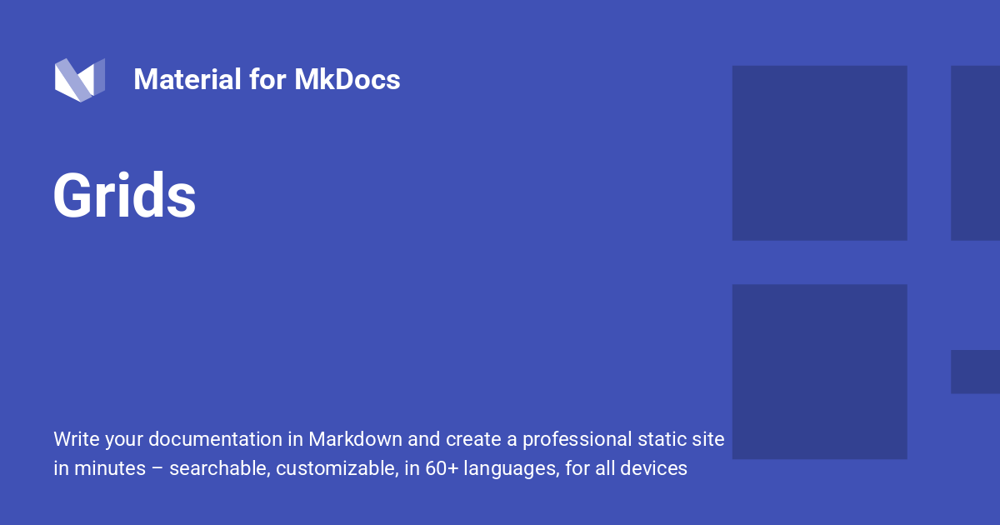

# Grids

!!! tldr "Grids"

    Material for MkDocs makes it easy to arrange sections into grids, grouping blocks that convey similar meaning or are of equal importance. Grids are just perfect for building index pages that show a brief overview of a large section of your documentation.
    
## Configuration

!!! important "Configuration"

    This configuration enables the use of grids, allowing to bring blocks of identical or different types into a rectangular shape. Add the following lines to `mkdocs.yml`:
    
    ``` yaml
    markdown_extensions: # (1)!
      - attr_list
      - md_in_html
    ```
    
    1.  Note that some of the examples listed below use [icons and emojis], which have to be [configured separately].
    
    See additional configuration options:
    
    - [Attribute Lists]
    - [Markdown in HTML]
    
  [icons and emojis]: icons-emojis.md
  [configured separately]: icons-emojis.md#configuration
  [Attribute Lists]: python-markdown.md#attribute-lists
  [Markdown in HTML]: python-markdown.md#markdown-in-html

## Usage

!!! instruction "Usage"

    Grids come in two flavors: [card grids], which wrap each element in a card that levitates on hover, and [generic grids], which allow to arrange arbitrary block elements in a rectangular shape.
    
  [card grids]: #using-card-grids
  [generic grids]: #using-generic-grids

### Using Card Grids

!!! desc "Using Card Grids"

    Card grids wrap each grid item with a beautiful hover card that levitates on hover. They come in two slightly different syntaxes: [list] and [block syntax], adding support for distinct use cases.
    
  [list]: #list-syntax
  [block syntax]: #block-syntax

#### List Syntax

!!! deep-dive "List Syntax"

    The list syntax is essentially a shortcut for [card grids], and consists of an unordered (or ordered) list wrapped by a `div` with both, the `grid` and `cards` classes:
    
    ``` html title="Card Grid"
    <div class="grid cards" markdown>
    
    - :fontawesome-brands-html5: __HTML__ for content and structure
    - :fontawesome-brands-js: __JavaScript__ for interactivity
    - :fontawesome-brands-css3: __CSS__ for text running out of boxes
    - :fontawesome-brands-internet-explorer: __Internet Explorer__ ... huh?
    
    </div>
    ```
    
<div class="result" markdown>
  <div class="grid cards" markdown>

- :fontawesome-brands-html5: [__HTML__](https://www.w3.org/TR/2011/WD-html5-20110405/) for content and structure
- :fontawesome-brands-js: [__JavaScript__](https://javascript.info/intro) for interactivity
- :fontawesome-brands-css3: [__CSS__](https://www.w3schools.com/css/) for text running out of boxes
- :fontawesome-brands-chrome: [__Chrome__](https://docs.google.com/document/d/1Uk6y1dU6NxFiJXDyYW5-i0NqEi7xjvmRsEMD0_29UHE/edit?pli=1&tab=t.0) ... huh?

  </div>
</div>

??? grey "Card grid, Complex Example. Click to see Code!"

    List elements can contain arbitrary Markdown, as long as the surrounding `div` defines the `markdown` attribute. Following is a more complex example, which includes icons and links:
    
    ``` html title="Card grid, complex example"
    <div class="grid cards" markdown>
    
    -   :material-clock-fast:{ .lg .middle } __Set up in 5 minutes__
    
    ---
    
    Install [`mkdocs-material`](#) with [`pip`](#) and get up and running in minutes
    
    [:octicons-arrow-right-24: Getting started](#)
    
    -   :fontawesome-brands-markdown:{ .lg .middle } __It's just Markdown__
    
    ---
    
    Focus on your content and generate a responsive and searchable static site

    [:octicons-arrow-right-24: Reference](#)
    
    -   :material-format-font:{ .lg .middle } __Made to measure__
    
    ---
    
    Change the colors, fonts, language, icons, logo and more with a few lines
    
    [:octicons-arrow-right-24: Customization](#)
    
    -   :material-scale-balance:{ .lg .middle } __Open Source, MIT__
    
    ---
    
    Material for MkDocs is licensed under MIT and available on [GitHub]
    
    [:octicons-arrow-right-24: License](#)
    
    </div>
    ```
    
<div class="result" markdown>
  <div class="grid cards" markdown>

-   :material-clock-fast:{ .lg .middle } __Set up in 5 minutes__

    ---

    Install [`mkdocs-material`][mkdocs-material] with [`pip`][pip] and get up and running in minutes.

    [:octicons-arrow-right-24: Getting started][getting started]

-   :fontawesome-brands-markdown:{ .lg .middle } __It's just Markdown__

    ---

    Focus on your content and generate a responsive and searchable static site

    [:octicons-arrow-right-24: Reference][reference]

-   :material-format-font:{ .lg .middle } __Made to measure__

    ---

    Change the colors, fonts, language, icons, logo and more with a few lines

    [:octicons-arrow-right-24: Customization][customization]

-   :material-scale-balance:{ .lg .middle } __Open Source, MIT__

    ---

    Material for MkDocs is licensed under MIT and available on [GitHub]

    [:octicons-arrow-right-24: License][license]

  </div>
</div>

!!! education " Adaptive Rendering-Insufficient Space"

    If there's insufficient space to render grid items next to each other, the items will stretch to the full width of the viewport, e.g. on mobile viewports. If there's more space available, grids will render in items of 3 and more, e.g. when [hiding both sidebars].
    
  [mkdocs-material]: https://pypistats.org/packages/mkdocs-material
  [pip]: ../MkDocs-Material-Start.md#with-pip
  [getting started]: ../MkDocs-Material-Start.md
  [customization]: customization.md
  [license]: license.md
  [GitHub]: https://github.com/squidfunk/mkdocs-material
  [hiding both sidebars]: setting-up-navigation.md#hiding-the-sidebars

#### Block Syntax

??? grey "Block Syntax. Click to see Code!"

    The block syntax allows for arranging cards in grids __together with other elements__, as explained in the section on [generic grids]. Just add the `card` class to any block element inside a `grid`:
    
    ``` html title="Card grid, blocks"
    <div class="grid" markdown>
    
    :fontawesome-brands-html5: __HTML__ for content and structure
    { .card }
    
    :fontawesome-brands-js: __JavaScript__ for interactivity
    { .card }
    
    :fontawesome-brands-css3: __CSS__ for text running out of boxes
    { .card }
    
    > :fontawesome-brands-internet-explorer: __Internet Explorer__ ... huh?
    
    </div>
    ```
    
<div class="result" markdown>
  <div class="grid" markdown>

:fontawesome-brands-html5: __HTML__ for content and structure
{ .card }

:fontawesome-brands-js: __JavaScript__ for interactivity
{ .card }

:fontawesome-brands-css3: __CSS__ for text running out of boxes
{ .card }

> :fontawesome-brands-internet-explorer: __Internet Explorer__ ... huh?

  </div>
</div>

!!! deep-dive "Syntax Above: ⤴️"
    While this syntax may seem unnecessarily verbose at first, the previous example shows how card grids can now be mixed with other elements that will also stretch to the grid.
    
### Using Generic Grids

!!! recommendation "Using Generic Grids"

    Generic grids allow for arranging arbitrary block elements in a grid, including [admonitions], [code blocks], [content tabs] and more. Just wrap a set of blocks by using a `div` with the `grid` class:
    
    ??? grey "Click to see Code"
    
        ```` markdown title="Generic Grid"
        <div class="grid" markdown>
        
        === "Unordered list"
        
            * First Normal Form (1NF)
            * Second Normal Form (2NF)
            * Third Normal Form (3NF)
        
        === "Ordered list"
        
            1. HTML5 (Structure)
            2. CSS3 (Styling)
            3. JavaScript (Behavior)
        
        !!! recommendation "⚖️"

            ``` markdown title="Content Tabs"
            === "Unordered list"

                * First Normal Form (1NF)
                * Second Normal Form (2NF)
                * Third Normal Form (3NF)

            === "Ordered list"

                1. HTML5 (Structure)
                2. CSS3 (Styling)
                3. JavaScript (Behavior)
            ```
        
        </div>
        ````

<div class="result" markdown>
  <div class="grid" markdown>

=== "Unordered list"

    * First Normal Form (1NF)
    * Second Normal Form (2NF)
    * Third Normal Form (3NF)

=== "Ordered list"

    1. HTML5 (Structure)
    2. CSS3 (Styling)
    3. JavaScript (Behavior)

!!! recommendation "⚖️"

    ``` title="Content Tabs"
    === "Unordered list"
    
        * First Normal Form (1NF)
        * Second Normal Form (2NF)
        * Third Normal Form (3NF)
        
    === "Ordered list"
    
        1. HTML5 (Structure)
        2. CSS3 (Styling)
        3. JavaScript (Behavior)
    ```
    
  </div>
</div>

  [admonitions]: ../admonitions.md
  [code blocks]: code-blocks.md
  [content tabs]: content-tabs.md

!!! tldr "The Quick Version"
    This article explores how custom CSS can transform boring documentation into a high-end user interface.
    
    * Save 50% more time
    * Higher reader retention
    * Looks significantly cooler


!!! deep-dive "Deep Dive/Core Concepts: Technical Details"

    This text will use a monospace-style header to signal it's for the "techies" and will have a nice dark grey beaker icon.
    
    
!!! important "Important"

    Seeing what this does!
    
!!! recommendation "Recommendation"

    Seeing what this does!
    

!!! instruction "Instruction"

    Seeing what this does!
    

!!! decision "Decision"

    Seeing what this does!
    
!!! assumption "Assumption"

    Seeing what this does!
   
!!! dollar "Dollar"

    Seeing What This Does!
    

!!! grey "Grey"

    Seeing What This Does!
    
!!! education "Education"

    Seeing What This Does!
    
!!! version-added "version-added"

    Seeing What This Does!
    
!!! version-changed "version-changed"

    Seeing What This Does!
    
!!! version-removed "version-removed"

    Seeing What This Does!
    

<div class="grid" markdown>

=== "Unordered list"

    * First Normal Form (1NF)
    * Second Normal Form (2NF)
    * Third Normal Form (3NF)

=== "Ordered list"

    1. HTML5 (Structure)
    2. CSS3 (Styling)
    3. JavaScript (Behavior)

!!! recommendation "⚖️"

    ``` markdown title="Content Tabs"
    === "Unordered list"

        * First Normal Form (1NF)
        * Second Normal Form (2NF)
        * Third Normal Form (3NF)

    === "Ordered list"

        1. HTML5 (Structure)
        2. CSS3 (Styling)
        3. JavaScript (Behavior)
    ```

</div>