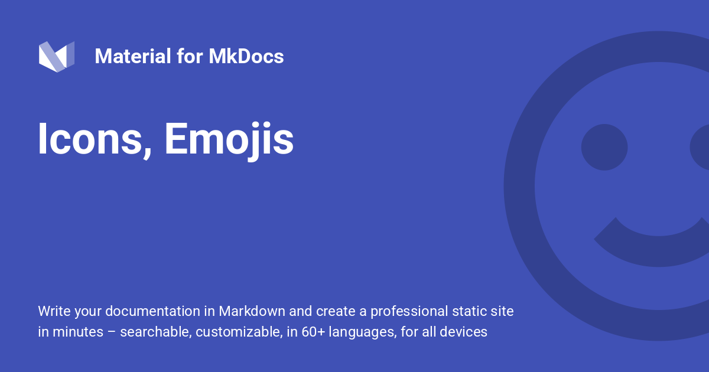

<div style="display: none;"><h1>Header</h1></div>

{ .center-image }
<H1 style="text-align: center;">Icons-Emojis</H1>

!!! desc "Icons-Emojis"

    One of the best features of Material for MkDocs is the possibility to use [more than 10,000 ==icons==][icon search] and thousands of emojis in your project documentation with practically zero additional effort. Moreover, [==custom icons== can be added][custom icons can be added] and used in `mkdocs.yml`, documents and templates.

  [icon search]: https://squidfunk.github.io/mkdocs-material/reference/icons-emojis/
  [custom icons can be added]: changing-the-logo-and-icons.md#additional-icons

## [Search](https://squidfunk.github.io/mkdocs-material/reference/icons-emojis/)

<div class="mdx-iconsearch" data-mdx-component="iconsearch">
  <!-- Interactive Navigation Search Row Bar -->
  <div class="mdx-iconsearch__bar">
    <input class="md-input md-input--stretch mdx-iconsearch__input" placeholder="Search Icons Emojis" data-mdx-component="iconsearch-query" />
    <div class="mdx-iconsearch-result__meta" data-mdx-component="iconsearch-meta"></div>
    <select
      class="mdx-iconsearch-result__select"
      data-mdx-component="iconsearch-select"
    >
      <option value="all" selected>All</option>
      <option value="icons">Icons</option>
      <option value="emojis">Emojis</option>
    </select>
  </div>
  
  <!-- Content Results Area Box -->
  <div class="mdx-iconsearch-result" data-mdx-component="iconsearch-result">
    <ol class="mdx-iconsearch-result__list"></ol>
  </div>
</div>

!!! info "Search Tip"

    Enter some keywords to find icons and emojis and click on the shortcode to copy it to your clipboard.
    
## Configuration

!!! desc "Configuration"

    This configuration enables the use of icons and emojis by using simple shortcodes which can be discovered through the [icon search]. Add the following lines to `mkdocs.yml`:
    
    ``` yaml
    markdown_extensions:
      - attr_list
      - pymdownx.emoji:
          emoji_index: !!python/name:material.extensions.emoji.twemoji
          emoji_generator: !!python/name:material.extensions.emoji.to_svg
    ```

The following icon sets are bundled with Material for MkDocs:

<div class="grid cards cols-3" markdown>

-   <span style="color: #00A99A">:material-material-design:</span> **Material Design**
    [:octicons-arrow-right-24: Go to](https://pictogrammers.com/library/mdi/){ .md-button style="border-color: #00A99A; color: #00A99A" }

    :material-vector-square: Material Design Icons.

-   <span style="color: #00A99A">:fontawesome-brands-font-awesome:</span> **FontAwesome**
    [:octicons-arrow-right-24: Go to](https://fontawesome.com/search?m=free){ .md-button style="border-color: #00A99A; color: #00A99A" }

    :fontawesome-brands-font-awesome: Font Awesome Icons.

-   <span style="color: #00A99A">:octicons-mark-github-16:</span> **Octicons**
    [:octicons-arrow-right-24: Go to](https://octicons.github.com/){ .md-button style="border-color: #00A99A; color: #00A99A" }

    :octicons-mark-github-16: Octicons Icons.

-   <span style="color: #ED1B23">:simple-simpleicons:</span> **Simple Icons**
    [:octicons-arrow-right-24: Go to](https://simpleicons.org/){ .md-button style="border-color: #ED1B23; color: #ED1B23" }

    :simple-simpleicons: Simple Icons.

-   <span style="color: #ED1B23">:simple-lucide:</span> **Lucide**
    [:octicons-arrow-right-24: Go to](https://lucide.dev/){ .md-button style="border-color: #ED1B23; color: #ED1B23" }

    :simple-lucide: Lucide Icons.

-   <span style="color: #ED1B23">:material-arrow-u-left-top:</span> **MaterialX-MkDocs**
    [:octicons-arrow-right-24: Return to](../index.md){ .md-button style="border-color: #ED1B23; color: #ED1B23" } 

    :material-arrow-u-left-top: MaterialX-MkDocs.

</div>

<a href="https://squidfunk.github.io/mkdocs-material/reference/icons-emojis/" target="_self" class="md-button md-button--primary">👉 Open Official Icon Search Database</a>

See additional configuration options:

- [Attribute Lists]
- [Emoji]
- [Emoji with custom icons]

  [Lucide]: https://lucide.dev/
  [Material Design]: https://pictogrammers.com/library/mdi/
  [FontAwesome]: https://fontawesome.com/search?m=free
  [Octicons]: https://octicons.github.com/
  [Simple Icons]: https://simpleicons.org/
  [Attribute Lists]: https://github.com/jaywhj/mkdocs-materialx/blob/main/docs/setup/extensions/python-markdown.md#attribute-lists
  [Emoji]: https://github.com/jaywhj/mkdocs-materialx/blob/main/docs/setup/extensions/python-markdown-extensions.md#emoji
  [Emoji with custom icons]: https://github.com/jaywhj/mkdocs-materialx/blob/main/docs/setup/extensions/python-markdown-extensions.md#+pymdownx.emoji.options.custom_icons

## Usage

### Using Emojis

!!! desc " Using Emojis"

    Emojis can be integrated in Markdown by putting the shortcode of the emoji between two colons. If you're using [Twemoji] (recommended), you can look up the shortcodes at [Emojipedia]:
    
    ``` title="Emoji"
    :smile:
    ```
    
    :smile:
    
!!! ex "smile"

    ```bash
    <div class="result" markdown>
    
    :smile:
    
    </div>
    ```
    
    <div class="result" markdown>
    
    :smile:
    
    </div>
    
  [Twemoji]: https://github.com
  [Emojipedia]: https://emojipedia.org

### Using Icons

!!! desc "Using Icons"

    When [Emoji] is enabled, icons can be used similar to emojis, by referencing a valid path to any icon bundled with the theme, which are located in the [`.icons`][custom icons] directory, and replacing `/` with `-`:
    
    ``` title="Icon"
    :fontawesome-regular-face-laugh-wink:
    ```
    
    <div class="result" markdown>
    :fontawesome-regular-face-laugh-wink:
    </div>
    
  [custom icons]: https://github.com

#### With Colours

When [Attribute Lists] is enabled, custom CSS classes can be added to icons by suffixing the icon with a special syntax. While HTML allows to use [inline styles], it's always recommended to add an [additional style sheet] and move declarations into dedicated CSS classes:

<style>
  .youtube {
    color: #EE0F0F;
  }
</style>

!!! info With Colours

    === ":octicons-file-code-16: `docs/stylesheets/extra.css`"
    
        ``` css
        .youtube {
        color: #EE0F0F;
        }
        ```
        
    === ":octicons-file-code-16: `mkdocs.yml`"
    
        ``` yaml
        extra_css:
          - stylesheets/extra.css
        ```
    
!!! instruction "Apply Customization"

    After applying the customization, add the CSS class to the icon shortcode:
    
    ``` markdown title="Icon with color"
    :fontawesome-brands-youtube:{ .youtube }
    ```
    
    <div class="result" markdown>
    
    :fontawesome-brands-youtube:{ .youtube }
    
    </div>
    
  [inline styles]: https://mozilla.org
  [additional style sheet]: customization.md#additional-css

#### With Animations

!!! desc "With Animations"

    Similar to adding [colors], it's just as easy to add [animations] to icons by using an [additional style sheet], defining a `@keyframes` rule and adding a dedicated CSS class to the icon:

    === ":octicons-file-code-16: `docs/stylesheets/extra.css`"

        ``` css
        @keyframes heart {
          0%, 40%, 80%, 100% {
            transform: scale(1);
          }
          20%, 60% {
            transform: scale(1.15);
          }
        }
        .heart {
          animation: heart 1000ms infinite;
        }
        ```

    === ":octicons-file-code-16: `mkdocs.yml`"

        ``` yaml
        extra_css:
          - stylesheets/extra.css
        ```

    !!! info "Add CSS Class"

        After applying the customization, add the CSS class to the icon shortcode:

        <div class="result" markdown>

        ``` markdown title="Icon with animation"
        :octicons-heart-fill-24:{ .heart }
        ```

        :octicons-heart-fill-24:{ .heart }

        </div>

  [colors]: #with-colors
  [animations]: https://mozilla.org

### Icons, emojis in sidebars :smile:

With the help of the [built-in typeset plugin], you can use icons and emojis in headings, which will then be rendered in the sidebars. The plugin preserves Markdown and HTML formatting.

  [built-in typeset plugin]: typeset.md

## Customization

### Using Icons in Templates

!!! ex "Using Icons in Templates"

    When you're [extending the theme] with partials or blocks, you can simply reference any icon that's [bundled with the theme](https://squidfunk.github.io/mkdocs-material/reference/icons-emojis/) with Jinja's `include` function and wrap it with the `.twemoji` CSS class:

    ```html
    <span class="twemoji">
       <!-- (1)! -->
    </span>
    ```

    1.  Enter a few keywords to find the perfect icon using our [icon search] and click on the shortcode to copy it to your clipboard:

        <div class="mdx-iconsearch" data-mdx-component="iconsearch">
          <div class="mdx-iconsearch__bar">
            <input class="md-input md-input--stretch mdx-iconsearch__input" placeholder="Search Icons Emojis" data-mdx-component="iconsearch-query" value="brands youtube" />
            <div class="mdx-iconsearch-result__meta" data-mdx-component="iconsearch-meta"></div>
          </div>
          <ul class="mdx-iconsearch-result__list"></ul>
        </div>

    This is exactly what Material for MkDocs does in its templates.


***
Press ++ctrl+alt+delete++ to log in.

:fontawesome-brands-viber:

##### Useful Links

<div class="grid cards cols-3" markdown>

-   <span style="color: #2094f3">:material-download:</span> **Installation Guide**
    [:octicons-arrow-right-24: View Guide](https://github.com/mkdocs/mkdocs/blob/master/docs/user-guide/installation.md){ .md-button style="border-color: #2094f3; color: #2094f3" }

    Step-by-step instructions to get MkDocs up and running.

-   <span style="color: #2094f3">:material-cog:</span> **Configuration (docs_dir)**
    [:octicons-arrow-right-24: View Config](https://github.com/mkdocs/mkdocs/blob/master/docs/user-guide/configuration.md#docs_dir){ .md-button style="border-color: #2094f3; color: #2094f3" }

    Learn how to set up your source directory structure.

-   <span style="color: #2094f3">:material-rocket-launch:</span> **Deploying Your Docs**
    [:octicons-arrow-right-24: View Guide](https://www.mkdocs.org/user-guide/deploying-your-docs/){ .md-button style="border-color: #2094f3; color: #2094f3" }

    How to publish your documentation to the web.

-   <span style="color: #4caf50">:material-map-legend:</span> **Documentation Layout**
    [:octicons-arrow-right-24: View Layout](https://www.mkdocs.org/user-guide/configuration/#nav){ .md-button style="border-color: #4caf50; color: #4caf50" }

    Configure the navigation and global site structure.

-   <span style="color: #4caf50">:material-forum:</span> **GitHub Discussions**
    [:octicons-arrow-right-24: Join Discussions](https://github.com/mkdocs/mkdocs/discussions){ .md-button style="border-color: #4caf50; color: #4caf50" }

    Ask questions and engage with the community.

-   <span style="color: #4caf50">:material-alert-circle:</span> **GitHub Issues**
    [:octicons-arrow-right-24: View Issues](https://github.com/mkdocs/mkdocs/issues){ .md-button style="border-color: #4caf50; color: #4caf50" }

    Report bugs or request new features.

-   <span style="color: #ff9800">:material-card-text:</span> **Site Name**
    [:octicons-arrow-right-24: View Settings](https://www.mkdocs.org/user-guide/configuration/#site_name){ .md-button style="border-color: #ff9800; color: #ff9800" }

    Define the title of your project and browser tab.

-   <span style="color: #ff9800">:material-brush:</span> **Theme**
    [:octicons-arrow-right-24: View Theme](https://www.mkdocs.org/user-guide/configuration/#theme){ .md-button style="border-color: #ff9800; color: #ff9800" }

    Customise the look and feel of your documentation.

-   <span style="color: #ff9800">:material-book-open-variant:</span> **User Guide**
    [:octicons-arrow-right-24: Open Guide](https://www.mkdocs.org/user-guide/){ .md-button style="border-color: #ff9800; color: #ff9800" }

    The complete manual for all MkDocs features.

</div>

---

[Back to: #Advanced-Configuration  :fontawesome-solid-paper-plane:](../MkDocs-Material-Start.md/#advanced-configuration){ .md-button .md-button--custom }