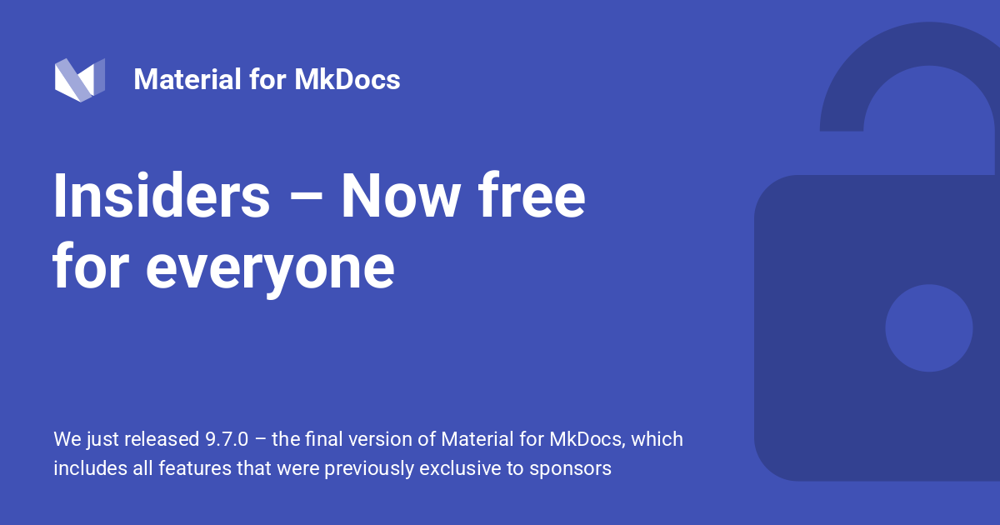

<div style="display: none;"><h1>Header</h1></div>

{ .center-image }

<H2 style="text-align: center;">Material for MkDocs Insiders – Now free for everyone.</H2>

!!! tldr "Material for MkDocs Insiders – Now free for everyone"

    __[9.7.0], the final version of Material for MkDocs, includes all features that were previously exclusive to sponsors, making Material for MkDocs Insiders available to everyone!__
    
    As we're shifting our efforts to [Zensical], Material for MkDocs is entering [maintenance mode]. This means that while we'll continue to fix critical bugs and security issues for 12 month at least, no new features will be added to Material for MkDocs.
    
    We're also discontinuing our sponsorware model, saying [goodbye to GitHub Sponsors]. If you were a sponsor of our work, you already received an email mentioning that your sponsorship was cancelled. As one of the numerous individuals and organizations sponsoring Material for MkDocs over the past years – thank you! Your continued support has been invaluable.
    
    Now, we want everyone to benefit from all features we have developed for Material for MkDocs, which is why we're making all Insiders features available to everyone!
    
    This is the logical next step in our journey as we focus on Zensical – our next-generation static site generator built from the ground up to overcome MkDocs' technical limitations. Zensical is fully [Open Source, licensed under MIT], maintains [compatibility with Material for MkDocs], and can build your existing projects with minimal changes.
    
    In the coming months, we'll close the [feature parity] gap, bringing the expressiveness of Material for MkDocs to Zensical.
    
    _You can subscribe to [our newsletter] to stay in the loop_.
    
  [Zensical]: https://zensical.org
  [maintenance mode]: https://github.com/squidfunk/mkdocs-material/issues/8523
  [goodbye to GitHub Sponsors]: zensical.md#goodbye-github-sponsors
  [compatibility with Material for MkDocs]: zensical.md#maximum-compatibility
  [Open Source, licensed under MIT]: https://zensical.org/about/license/
  [feature parity]: https://zensical.org/compatibility/features/
  [our newsletter]: https://zensical.org/about/newsletter/

---

__This is the third article in a four-part series:__

1. [Transforming Material for MkDocs]
2. [Zensical – A modern static site generator built by the creators of Material for MkDocs]
3. [Material for MkDocs Insiders – Now free for everyone]
4. [Goodbye, GitHub Discussions]

  [Transforming Material for MkDocs]: transforming-material-for-mkdocs.md
  [Zensical – A modern static site generator built by the creators of Material for MkDocs]: zensical.md
  [Material for MkDocs Insiders – Now free for everyone]: insiders-now-free-for-everyone.md
  [Goodbye, GitHub Discussions]: goodbye-github-discussions.md

## Available features

Our sponsors have enjoyed exclusive access to the following premium features
for quite some time. With the release of [9.7.0], all these features are now available to everyone:

## Available features

Our sponsors have enjoyed exclusive access to the following premium features
for quite some time. With the release of, all these features are now available to everyone:

<div class="grid cards cols-3" markdown>

-   <span style="color: #2094f3">:material-pin:</span> **Blog Plugin: Pinned Posts**
    [:octicons-arrow-right-24: View Guide][Blog plugin: pinned posts]{ .md-button style="border-color: #2094f3; color: #2094f3" }
    
    Keep important blog posts anchored to the top of your index feed page automatically.

-   <span style="color: #2094f3">:material-eye-outline:</span> **Instant Previews**
    [:octicons-arrow-right-24: View Guide][Instant previews]{ .md-button style="border-color: #2094f3; color: #2094f3" }
    
    See content changes render instantly across your pages without full reload cycles.

-   <span style="color: #2094f3">:material-comment-text-outline:</span> **Footnote Tooltips**
    [:octicons-arrow-right-24: View Guide][Footnote tooltips]{ .md-button style="border-color: #2094f3; color: #2094f3" }
    
    Display clean non-intrusive text popups directly over reference notes on hover.

-   <span style="color: #00e5ff">:material-tag-multiple:</span> **Tags Plugin: adv. settings**
    [:octicons-arrow-right-24: View Guide][Tags plugin: advanced settings]{ .md-button style="border-color: #00e5ff; color: #00e5ff" }
    
    Unlock deep taxonomy customization features to control cross-referencing indexes.

-   <span style="color: #00e5ff">:material-file-tree:</span> **Tags Plugin: Nested Tags**
    [:octicons-arrow-right-24: View Guide][Tags plugin: nested tags]{ .md-button style="border-color: #00e5ff; color: #00e5ff" }
    
    Organize hierarchical categorization schemas using multi-level classification layouts.

-   <span style="color: #00e5ff">:material-text-shadow:</span>**Tags Plugin: Shadow Tags**
    [:octicons-arrow-right-24: View Guide][Tags plugin: shadow tags]{ .md-button style="border-color: #00e5ff; color: #00e5ff" }
    
    Leverage hidden structural taxonomy identifiers for smart internal navigation logic.

-   <span style="color: #4caf50">:material-translate:</span> **Stay on page SW Lang**
    [:octicons-arrow-right-24: View Guide][Stay on page when switching languages]{ .md-button style="border-color: #4caf50; color: #4caf50" }
    
    Preserve reader context completely by hot-swapping matching localized copy files.

-   <span style="color: #4caf50">:material-account-box:</span>**Blog Plugin Author Profile**
    [:octicons-arrow-right-24: View Guide][Blog plugin: author profiles]{ .md-button style="border-color: #4caf50; color: #4caf50" }
    
    Generate dedicated bio elements, social resource widgets, custom author grids.

-   <span style="color: #4caf50">:material-cog-box:</span> **Blog Plugin: adv. settings**
    [:octicons-arrow-right-24: View Guide][Blog plugin: advanced settings]{ .md-button style="border-color: #4caf50; color: #4caf50" }
    
    Fine-tune pagination limitations, dynamic excerpt lengths, and category rulesets.

-   <span style="color: #ff9800">:material-folder-table-outline:</span> **Projects Plugin**
    [:octicons-arrow-right-24: View Guide][Projects plugin]{ .md-button style="border-color: #ff9800; color: #ff9800" }
    
    Manage multi-repository document sets cleanly under single structural parent frames.

-   <span style="color: #ff9800">:material-lightning-bolt:</span> **Instant Prefetching**
    [:octicons-arrow-right-24: View Guide][Instant prefetching]{ .md-button style="border-color: #ff9800; color: #ff9800" }
    
    Load layout resource packets silently on link mouseover for immediate page loads.

-   <span style="color: #ff9800">:material-card-account-details:</span> **Social Plugin: Cust. L/O**
    [:octicons-arrow-right-24: View Guide][Social plugin: custom layouts]{ .md-button style="border-color: #ff9800; color: #ff9800" }
    
    Design unique graphic cards layouts dynamically targeted at specific platform preview bots.

-   <span style="color: #005eff">:material-image-area:</span> **Social Plugin: bkg images**
    [:octicons-arrow-right-24: View Guide][Social plugin: background images]{ .md-button style="border-color: #005eff; color: #005eff" }
    
    Inject rich asset imagery backgrounds automatically behind text card render modules.

-   <span style="color: #005eff">:material-selection-marker:</span> **Code Range Selection**
    [:octicons-arrow-right-24: View Guide][Code range selection]{ .md-button style="border-color: #005eff; color: #005eff" }
    
    Allow users to extract high- lighted sub-sections directly inside code blocks.

-   <span style="color: #005eff">:material-comment-quote:</span> **Code annots: Custom SEL**
    [:octicons-arrow-right-24: View Guide][Code annotations: custom selectors]{ .md-button style="border-color: #005eff; color: #005eff" }
    
    Override block comment identifiers with highly targeted identifier hooks.

-   <span style="color: #f44336">:material-shield-lock:</span> **Priv. Plugin: Adv. Settings**
    [:octicons-arrow-right-24: View Guide][Privacy plugin: advanced settings]{ .md-button style="border-color: #f44336; color: #f44336" }
    
    Configure compliance tracking filters alongside complex localized cookie control modules.

-   <span style="color: #f44336">:material-speedometer:</span> **Optimize Plugin**
    [:octicons-arrow-right-24: View Guide][Optimize plugin]{ .md-button style="border-color: #f44336; color: #f44336" }
    
    Compress heavy asset pay- loads, minify HTML structures, and optimize document loads.

-   <span style="color: #f44336">:material-page-next:</span> **Nav Path (Breadcrumbs)**
    [:octicons-arrow-right-24: View Guide][Navigation path]{ .md-button style="border-color: #f44336; color: #f44336" }
    
    Render intuitive location trails to track positions within information depths.

-   <span style="color: #bfa05a">:material-format-text:</span> **Typeset Plugin**
    [:octicons-arrow-right-24: View Guide][Typeset plugin]{ .md-button style="border-color: #bfa05a; color: #bfa05a" }
    
    Apply sophisticated rule grids to refine formatting patterns and character tracking styles.

-   <span style="color: #bfa05a">:material-link-lock:</span> **Priv. Plugin: ext. links**
    [:octicons-arrow-right-24: View Guide][Privacy plugin: external links]{ .md-button style="border-color: #bfa05a; color: #bfa05a" }
    
    Process non-domain hyperlink calls securely by injecting isolation tags automatically.

-   <span style="color: #bfa05a">:material-arrow-u-left-top:</span> **➻ MkDocs-MaterialX**
    [:octicons-arrow-right-24: Return to](../index.md){ .md-button style="border-color: #bfa05a; color: #bfa05a" } 

    Back to root documentation. © Afridyne Systems™ ➠

</div>


  [Optimize plugin]: optimize.md
  [Navigation path]: setting-up-navigation.md#navigation-path
  [Blog plugin: advanced settings]: setting-up-a-blog.md#built-in-blog-plugin
  [Blog plugin: author profiles]: setting-up-a-blog.md#adding-author-profiles
  [Blog plugin: pinned posts]: setting-up-a-blog.md#pinning-a-post
  [Instant prefetching]: setting-up-navigation.md#instant-prefetching
  [Typeset plugin]: typeset.md
  [Footnote tooltips]: footnotes.md#footnote-tooltips
  [Privacy plugin: external links]: privacy.md#external-links
  [Privacy plugin: advanced settings]: ensuring-data-privacy.md#advanced-settings
  [Instant previews]: setting-up-navigation.md#instant-previews
  [Social plugin: custom layouts]: setting-up-social-cards.md#customization
  [Social plugin: background images]: social.md#option.background-image
  [Code range selection]: code-blocks.md#code-selection-button
  [Code annotations: custom selectors]: code-blocks.md#custom-selectors
  [Stay on page when switching languages]: changing-the-language.md#stay-on-page
  [Projects plugin]: projects.md
  [Tags plugin: nested tags]: setting-up-tags.md#nested-tags
  [Tags plugin: shadow tags]: setting-up-tags.md#shadow-tags
  [Tags plugin: advanced settings]: setting-up-tags.md#advanced-features

!!! tip "[mkdocstrings Insiders is now free] as well"

    With [Timothée joining the Zensical team], he announced that all features previously reserved to his sponsors as part of [mkdocstrings] Insiders are now free for everyone as well!

  [mkdocstrings Insiders is now free]: https://pawamoy.github.io/posts/sunsetting-the-sponsorware-strategy/
  [Timothée joining the Zensical team]: zensical.md#were-growing-our-team
  [mkdocstrings]: https://mkdocstrings.github.io/

## How to Upgrade.

!!! desc "How to Upgrade"

    You can upgrade with the following command:
    
    ```
    pip install --upgrade --force-reinstall mkdocs-material
    ```
    
## Switching from Insiders

!!! ex "Switching from Insiders"

    If you've been a user of Insiders, we recommend to switch to the community edition as soon as possible, as it includes all Insiders features. This will make it much easier to handle third-party contributions, since no personal access tokens are necessary.
    
    __From now on, bug fixes that we make to Material for MkDocs will only be released to the community edition. Security vulnerabilities will be fixed in both editions.__
    
    Thus, please adjust your `requirements.txt` and GitHub Actions workflows:
    
    ```diff
    - pip install git+https://${GH_TOKEN}@github.com/squidfunk/mkdocs-material-insiders. git
    + pip install mkdocs-material
    
    ```
    
    The Insiders repository itself will remain available for the next 6 months. When you build your project with Insiders, it will now show an informational message pointing to this blog post.
    
    - __On February 1, 2026, this message will be turned into a warning__.
    - __On May 1, 2026, the Insiders repository will be deleted__.
    
## Sunsetting Preparation

!!! important "Sunsetting Preparation"

    Entering [maintenance mode], we're preparing Material for MkDocs for sunsetting.
    
!!! warning "Material for MkDocs is now in maintenance mode"

    - We want to be transparent about the risks of staying on Material for MkDocs. With [MkDocs unmaintained] and facing fundamental supply chain concerns, we cannot guarantee Material for MkDocs will continue working reliably in the future. 
    
    - We're aware that transitioning takes time, which is why we commit to support it at least for the next 12 months, fixing critical bugs and security vulnerabilities as needed, but the path forward is with Zensical.

    - If documentation plays a critical role in your organization, and you're worried how this might affect your business, consider joining [Zensical Spark](https://zensical.org/spark/), or feel free to schedule a call by reaching out at hello@zensical.org.

  [MkDocs unmaintained]: https://github.com/squidfunk/mkdocs-material/discussions/8461

### Deprecations

!!! important "Deprecations"

    While we release all features to the general public, at the same time, we're deprecating the [Projects plugin] and the [Typeset plugin] due to maintainability issues. This means that these plugins will not receive any further updates, including no more bug fixes.
    
    The reason for this decision is that both plugins rely on too many workarounds to make them work with MkDocs, and subsequently have been key motivators to create [Zensical]. If you rely on these plugins, and they work for your use case, you can of course continue to use them.
    
    __With Zensical, we'll be shipping proper [sub-project support], including [internationalization] and [versioning], designing these features together with our professional users in [Zensical Spark].__
    
  [Zensical Spark]: https://zensical.org/spark/
  [sub-project support]: https://zensical.org/about/roadmap/#subprojects
  [internationalization]: https://zensical.org/about/roadmap/#internationalization
  [versioning]: https://zensical.org/about/roadmap/#versioning

### Version Ranges.

!!! instruction "Version Ranges"

    Material for MkDocs has used semver version ranges for dependencies to ensure compatibility. With the advent of [9.7.0], we're switching from semver to minimal version ranges. This provides more flexibility in dependency resolution, specifically to allow users to use newer versions of dependencies that include important bug fixes or security patches.
    
[9.7.0]: https://squidfunk.github.io/mkdocs-material/changelog/#9.7.0

### Security

!!! decision "security"

    We will **not** transfer ownership of the Material for MkDocs repository to another individual or organization. The repository and PyPI package will remain under the ownership of @squidfunk, which preserves the trusted supply chain our users depend on.
    
    Thus, if you wish to take on maintenance of Material for MkDocs, please create a fork.
    
## Looking Ahead

### Achieving Sustainability

!!! important "Achieving Sustainability"

    Where Material for MkDocs relied on sponsorware, Zensical takes a new approach, to ensure it evolves to meet the needs of organizations building complex, enterprise-scale documentation.
    
    [Zensical Spark] is a collaborative space where professional users have a direct voice in shaping Zensical's future. Through a [structured design process] and together with our Zensical Spark members, we identify opportunities, validate proposals, and define priorities – turning their real-world documentation challenges into features that benefit the entire community.
    
    Reach out at hello@zensical.org to schedule a call to learn more about Zensical Spark, discuss your organization's needs, and how it helps us to make Zensical sustainable.
    
  [Zensical Spark]: https://zensical.org/spark/
  [structured design process]: https://zensical.org/docs/community/how-we-work/

### Our commitment to you.

!!! assumption "Commitment"

    If you're currently using Material for MkDocs, there's no need to rush. We're committed to keeping it secure and functional for the next 12 months while we focus our efforts on [Zensical].
    
    ---
    
    The [9.7.0] release marks a significant shift – every Insiders feature is now available to everyone, with no sponsorship required. As we build [Zensical], each of these features will be rearchitected and improved. Zensical is entirely free and Open Source, ensuring the entire community benefits from our work without barriers.
    
    ---
    
    When you're ready to explore what's next, [Zensical is compatible with Material for MkDocs] and designed to be a natural evolution of the ideas and principles you already know.
    
    ---
    
    _If you loved Material for MkDocs and are excited about Zensical, we'll be providing new methods to support our work in the coming months, with the possibility of getting exclusive goodies._
    
    ---
    
    _Subscribe to [our newsletter] to stay in the loop._
    
  [Zensical is compatible with Material for MkDocs]: zensical.md#maximum-compatibility
