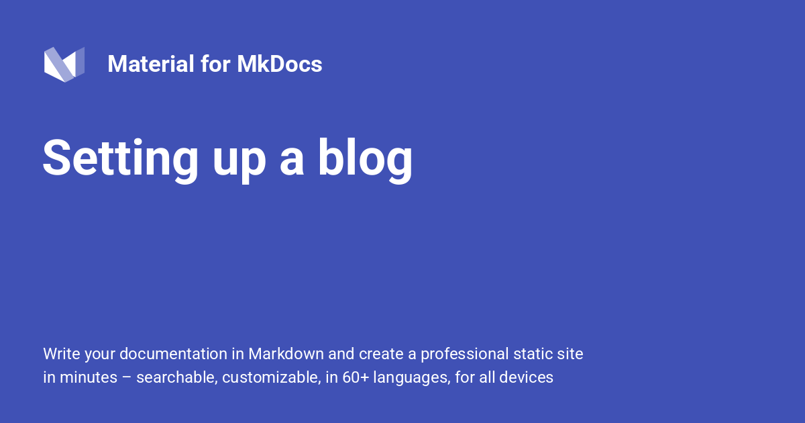

{: style="display: block; margin: 0 auto"}
<H1 style="text-align: center;"> Setting Up a Blog</H1>

!!! quote ""

    Material for MkDocs makes it very easy to build a blog, either as a sidecar to your documentation or standalone. Focus on your content while the engine does all the heavy lifting, automatically generating [archive] and [category] indexes, [post slugs], configurable [pagination] and more.
    
---

[Back to: Material-Start #Advanced-Configuration   :fontawesome-solid-paper-plane:](../MkDocs-Material-Start.md/#advanced-configuration){ .md-button }

---

__Check out our [blog](https://squidfunk.github.io/mkdocs-material/blog/), which is created with the new [built-in blog plugin](https://squidfunk.github.io/mkdocs-material/plugins/blog/)!__

  [archive]: blog.md#archive
  [category]: blog.md#categories
  [post slugs]: blog.md#config.post_url_format
  [pagination]: blog.md#pagination
  
  
## Configuration

### Built-in blog plugin

<!-- md:version 9.2.0 -->
<!-- md:plugin -->
<!-- md:flag experimental -->
<!-- md:demo create-blog -->

!!! abstract "Built-in blog plugin"

    The built-in blog plugin adds support for building a blog from a folder of posts, which are annotated with dates and other structured data. First, add the following lines to `mkdocs.yml`:
    
    ``` yaml
    plugins:
      - blog
    ```
    
    ---
    
    1. If you do not have a navigation (`nav`) definition in your `mkdocs.yml` then there is nothing else to do there as the blog plugin will add navigation automatically.
    
    2. If you do have a navigation defined then you need to add *the blog index page only* to it. You need not and should not add the individual blog posts. For example:
    
    ```yaml
    nav:
      - index.md
      - Blog:
        - blog/index.md
    ```
    
    ---
    
    For a list of all settings, please consult the [plugin documentation].
    
  [plugin documentation]: blog.md
  [built-in blog plugin]: blog.md

### RSS

<!-- md:version 9.2.0 -->
<!-- md:plugin [rss] -->

!!! abstract "RSS feed integration"

    The [built-in blog plugin] integrates seamlessly with the [RSS plugin][rss], which provides a simple way to add an RSS feed to your blog (or to your whole documentation). Install it with `uv pip`:

    ``` bash
    uv pip install mkdocs-rss-plugin
    ```

    ---

    Then, add the following lines to `mkdocs.yml`:

    ``` yaml
    plugins:
      - rss:
          match_path: blog/posts/.* # (1)!
          date_from_meta:
            as_creation: date
          categories:
            - categories
            - tags # (2)!
    ```

    1.  The RSS plugin allows to filter for URLs to be included in the feed. In this example, only blog posts will be part of the feed.
    2.  If you want to include a post's categories as well as its tags in
    the feed, add both `categories` and `tags`.


!!! abstract "Configuration Options"

    The following configuration options are supported:

    <!-- md:option rss.enabled -->

    :   <!-- md:default `true` --> This option specifies whether the plugin is enabled when building your project. If you want to speed up local builds, you can use an [environment variable][`mkdocs.env`]:

        ``` yaml
        plugins:
          - rss:
              enabled: !ENV [CI, false]
        ```

!!! abstract "Match Path Configuration"

    <!-- md:option rss.match_path -->

    :   <!-- md:default `.*` --> This option specifies which pages should be included in the feed. For example, to only include blog posts in the feed, use the following regular expression:

        ``` yaml
        plugins:
          - rss:
              match_path: blog/posts/.*
        ```


!!! abstract "Date Metadata Configuration"

    <!-- md:option rss.date_from_meta -->

    :   <!-- md:default none --> This option specifies which front matter property should be used as a creation date of a page in the feed. It's recommended to use the `date` property:

        ``` yaml
        plugins:
          - rss:
              date_from_meta:
                as_creation: date
        ```


!!! abstract "Categories Configuration"

    <!-- md:option rss.categories -->

    :   <!-- md:default none --> This option specifies which front matter properties are used as categories as part of the feed. If you use [categories] and [tags], add both with the following lines:

        ``` yaml
        plugins:
          - rss:
              categories:
                - categories
                - tags
        ```

!!! abstract "Comments Path Configuration"

    <!-- md:option rss.comments_path -->

    :   <!-- md:default none --> This option specifies the anchor at which comments for a post or page can be found. If you've integrated a [comment system], add the following lines:

        ``` yaml
        plugins:
          - rss:
              comments_path: "#__comments"
        ```


Material for MkDocs will automatically add the [necessary metadata] to your site which will make the RSS feed discoverable by browsers and feed readers.

The other configuration options of this extension are not officially supported by Material for MkDocs, which is why they may yield unexpected results. Use them at your own risk.

  [rss]: https://guts.github.io/mkdocs-rss-plugin/
  [categories]: blog.md#categories
  [tags]: setting-up-tags.md#built-in-tags-plugin
  [comment system]: adding-a-comment-system.md
  [necessary metadata]: https://guts.github.io/mkdocs-rss-plugin/configuration/#integration
  [theme extension]: customization.md

### Blog Only

!!! abstract "Pure blog configuration"

    You might need to build a pure blog without any documentation. In this case, you can create a folder tree like this:

    ``` { .sh .no-copy }
    .
    ├─ docs/
    │  ├─ posts/ # (1)!
    │  ├─ .authors.yml
    │  └─ index.md
    └─ mkdocs.yml
    ```

    1.  🙋‍♂️ Notice that the `posts` directory is in the root of `docs`
    without intermediate `blog` directory.
    
    ---

    And add the following lines to `mkdocs.yml`:

    ``` yaml
    plugins:
      - blog:
          blog_dir: . # (1)!
    ```

    1.  🙋‍♂️ Please see the [plugin documentation] for more information
    about the [`blog_dir`][blog_dir] setting.
    
    ---

    With this configuration, the url of the blog post will be `/<post_slug>` instead of `/blog/<post_slug>`.


## Usage

### Writing Your First Post

!!! abstract "Writing your first post"

    After you've successfully set up the [built-in blog plugin], it's time to write your first post. The plugin doesn't assume any specific directory structure, so you're completely free in how you organize your posts, as long as they are all located inside the `posts` directory:

    ``` { .sh .no-copy }
    .
    ├─ docs/
    │  └─ blog/
    │     ├─ posts/
    │     │  └─ hello-world.md # (1)!
    │     └─ index.md
    └─ mkdocs.yml
    ```

    1.  🙋‍♂️ If you'd like to arrange posts differently, you're free
    to do so.The URLs are built from the format specified in
    [`post_url_format`][post slugs] and the titles and dates of posts, no
    matter how they are organized inside the`posts` directory.

    Create a new file called `hello-world.md` and add the following lines:

    ``` yaml
    ---
    draft: true # (1)!
    date: 2024-01-31 # (2)!
    categories:
      - Hello
      - World
    ---

    # Hello world!
    ...
    ```

    1.  🙋‍♂️ If you mark a post as a [draft], a red marker appears next to
    the post date on index pages. When the site is built, drafts are
    not included in the output. [This behavior can be changed], e.g.
    for rendering drafts when building deploy previews.

    2.  🙋‍♂️ If you wish to provide multiple dates, you can use the
    following syntax, allowing you to define a date when you last
    updated the blog post + further custom dates you can add to
    the template:

        ``` yaml
        ---
        date:
          created: 2022-01-31
          updated: 2022-02-02
        ---

        # Hello world!
        ```

        Note that the creation date **must** be set under `date.created`, as each blog post must have a creation date set.


When you spin up the [live preview server], you should be greeted by your first post! You'll also realize, that [archive] and [category] indexes have been automatically generated for you.

  [draft]: blog.md#drafts
  [This behavior can be changed]: blog.md#config.draft
  [live preview server]: creating-your-site.md#previewing-as-you-write

#### Adding An Excerpt

!!! abstract "Adding An Excerpt"

    The blog index, as well as [archive] and [category] indexes can either list the entire content of each post, or excerpts of posts. An excerpt can be created by adding a `<!-- more -->` separator after the first few paragraphs of a post:

    ``` py
    # Hello world!

    Lorem ipsum dolor sit amet, consectetur adipiscing elit. Nulla et euismod
    nulla. Curabitur feugiat, tortor non consequat finibus, justo purus auctor
    massa, nec semper lorem quam in massa.

    <!-- more -->
    ...
    ```
    
    ---

    When the [built-in blog plugin] generates all indexes, the content before the [excerpt separator] is automatically extracted, allowing the user to start reading a post before deciding to jump in.


  [excerpt separator]: blog.md#config.post_excerpt_separator

#### Adding Authors

!!! abstract "Adding Authors"

    In order to add a little more personality to your posts, you can associate each post with one or multiple [authors]. First, create the [`.authors.yml`][authors_file] file in your blog directory, and add an author:

    ``` yaml
    authors:
      squidfunk:
        name: Martin Donath
        description: Creator
        avatar: https://github.com/squidfunk.png
    ```
    
    ---

    The [`.authors.yml`][authors_file] file associates each author with an identifier (in this example `squidfunk`), which can then be used in posts. Different attributes can be configured. For a list of all possible attributes, please consult the [`authors_file`][authors_file] documentation.


!!! abstract "Assign One or More Authors to a Post"

    Now, you can assign one or more authors to a post by referencing their identifiers in the front matter of the Markdown file under the `authors` property. For each author, a small profile is rendered in the left sidebar of each post, as well as in post excerpts on index pages:

    ``` yaml
    ---
    date: 2024-01-31
    authors:
      - squidfunk
        ...
    ---

    # Hello world!
    ...
    ```


  [authors]: blog.md#authors
  [authors_file]: blog.md#config.authors_file

#### Adding Author Profiles

<!-- md:version 9.7.0 -->
<!-- md:flag experimental -->

!!! abstract "Adding Author Profiles"

    If you wish to add a dedicated page for each author, you can enable author profiles by setting the [`authors_profiles`][authors_profiles] configuration option to `true`. Just add the following lines to `mkdocs.yml`:

    ``` yaml
    plugins:
      - blog:
          authors_profiles: true
    ```
    
    ---

    If you combine this with [custom index pages], you can create a dedicated page for each author with a short description, social media links, etc. – basically anything you can write in Markdown. The list of posts is then appended after the content of the page.


  [authors_profiles]: blog.md#config.authors_profiles
  [custom index pages]: #custom-index-pages

#### Adding Categories

!!! abstract "Adding Categories"

    Categories are an excellent way for grouping your posts thematically on dedicated index pages. This way, a user interested in a specific topic can explore all of your posts on this topic. Make sure [categories] are enabled and add them to the front matter `categories` property:

    ``` yaml
    ---
    date: 2024-01-31
    categories:
      - Hello
      - World
    ---

    # Hello world!
    ...
    ```
    
    ---

    If you want to save yourself from typos when typing out categories, you can define your desired categories in `mkdocs.yml` as part of the [`categories_allowed`][categories_allowed] configuration option. The [built-in blog plugin] will stop the build if a category is not found within the list.


  [categories_allowed]: blog.md#config.categories_allowed

#### Adding Tags

!!! abstract "Adding Tags"

    Besides [categories], the [built-in blog plugin] also integrates with the [built-in tags plugin]. If you add tags in the front matter `tags` property as part of a post, the post is linked from the [tags index]:

    ``` yaml
    ---
    date: 2024-01-31
    tags:
      - Foo
      - Bar
    ---

    # Hello world!
    ...
    ```
    
    ---

    As usual, the tags are rendered above the main headline and posts are linked on the tags index page, if configured. Note that posts are, as pages, only linked with their titles.

  [built-in tags plugin]: tags.md
  [tags index]: setting-up-tags.md#adding-a-tags-index

#### Changing The Slug

!!! abstract "Changing The Slug"

    Slugs are the shortened description of your post used in the URL. They are automatically generated, but you can specify a custom slug for a page:

    ``` yaml
    ---
    slug: hello-world
    ---

    # Hello there world!
    ...
    ```


#### Adding Related Links

<!-- md:version 9.6.0 -->
<!-- md:flag experimental -->

!!! abstract "Adding Related Links"

    Related links offer the perfect way to prominently add a _further reading_ section to your post that is included in the left sidebar, guiding the user to other destinations of your documentation. Use the front matter `links` property to add related links to a post:

    ``` yaml
    ---
    date: 2024-01-31
    links:
      - plugins/search.md
      - insiders/how-to-sponsor.md
    ---

    # Hello world!
    ...
    ```


!!! abstract "Related Links"

    You can use the exact same syntax as for the [`nav`][`mkdocs.nav`] section in `mkdocs.yml`, which means you can set explicit titles for links, add external links and even use nesting:

    ``` yaml
    ---
    date: 2024-01-31
    links:
      - plugins/search.md
      - insiders/how-to-sponsor.md
      - Nested section:
        - External link: https://example.com
        - setup/setting-up-site-search.md
    ---

    # Hello world!
    ...
    ```
    
    ---

    If you look closely, you'll realize that you can even use an anchor to link to a specific section of a document, extending the possibilities of the [`nav`][`mkdocs.nav`] syntax in `mkdocs.yml`. The [built-in blog plugin] resolves the anchor and sets the title of the anchor as a [subtitle] of the related link.

    Note that all links must be relative to [`docs_dir`][`mkdocs.docs_dir`], as is also the case for the [`nav`][`mkdocs.nav`] setting.

#### Linking From and To Posts

!!! abstract "Linking From and To Posts"

    While [post URLs][post slugs] are dynamically computed, the [built-in blog plugin] ensures that all links from and to posts and a post's assets are correct. If you want to link to a post, just use the path to the Markdown file as a link reference (links must be relative):

    ``` markdown
    [Hello World!](blog/posts/hello-world.md)
    ```
    
    ---

    Linking from a post to a page, e.g. the index, follows the same method:

    ``` markdown
    [Blog](../index.md)
    ```
    
    ---

    All assets inside the `posts` directory are copied to the `blog/assets` folder when the site is being built. Of course, you can also reference assets from posts outside of the `posts` directory. The [built-in blog plugin] ensures that all links are correct.


#### Pinning a Post

<!-- md:version 9.7.0 -->
<!-- md:flag experimental -->

!!! abstract "Pinning a Post"

    If you want to pin a post to the top of the index page, as well as the archive and category indexes it is part of, you can use the front matter `pin` property:

    ``` yaml
    ---
    date: 2024-01-31
    pin: true
    ---

    # Hello world!
    ...
    ```
    
    ---

    If multiple posts are pinned, they are sorted by their creation date, with the most recent pinned post being shown first, followed by the other pinned posts in descending order.


#### Setting the Reading Time

!!! abstract "Setting the Reading Time"

    When [enabled], the reading the expected reading time of each post is computed, which is rendered as part of the post and post excerpt. Nowadays, many blogs show reading times, which is why the [built-in blog plugin] offers this capability as well.

    Sometimes, however, the computed reading time might not feel accurate, or result in odd and unpleasant numbers. For this reason, reading time can be overridden and explicitly set with the front matter `readtime` property for a post:

    ``` yaml
    ---
    date: 2024-01-31
    readtime: 15
    ---

    # Hello world!
    ...
    ```
    
    ---

    This will disable automatic reading time computation.


!!! warning "Chinese, Japanese and Korean characters"

    Reading time computation currently does not take segmentation of Chinese, Japanese and Korean characters into account. This means that the reading time for posts in these languages may be inaccurate. We're planning on adding support in the future. In the meantime, please use the `readtime` front matter property to set the reading time.

  [enabled]: blog.md#config.post_readtime

#### Setting Defaults

<!-- md:version 9.6.0 -->
<!-- md:plugin [meta][built-in meta plugin] – built-in -->
<!-- md:flag experimental -->

!!! abstract "Default metadata configuration"

    If you have a lot of posts, it might feel redundant to define all of the above for each post. Luckily, the [built-in meta plugin] allows to set default front matter properties per folder. You can group your posts by categories, or authors, and add a `.meta.yml` file to set common properties:

    ``` { .sh .no-copy }
    .
    ├─ docs/
    │  └─ blog/
    │     ├─ posts/
    │     ├─ .meta.yml # (1)!
    │     └─ index.md
    └─ mkdocs.yml
    ```

    1.  🙋‍♂️ As already noted, you can also place a `.meta.yml` file in
    nested folders of the `posts` directory. This file then can define
    all front matter properties that are valid in posts, e.g.:

        ``` yaml
        authors:
          - squidfunk
        categories:
          - Hello
          - World
        ```

    ---

    Note that order matters – the [built-in meta plugin] must be defined before the blog plugin in `mkdocs.yml`, so that all set defaults are correctly picked up by the [built-in blog plugin]:

    ``` yaml
    plugins:
      - meta
      - blog
    ```
    
    ---

    Lists and dictionaries in `.meta.yml` files are merged and deduplicated with the values defined for a post, which means you can define common properties in `.meta.yml` and then add specific properties or overrides for each post.


  [built-in meta plugin]: meta.md

### Adding Pages

!!! info "Adding Pages"

    1. Besides posts, it's also possible to add static pages to your blog by listing the pages in the [`nav`][`mkdocs.nav`] section of `mkdocs.yml`. 
    
    2. All generated indexes are included after the last specified page. For example, to add a page on the authors of the blog, add the following to `mkdocs.yml`:
    
    ``` yaml
    nav:
       - Blog:
         - blog/index.md
         - blog/authors.md
           ...
    ```
    
## Customization

### Custom Index Pages

<!-- md:version 9.6.0 -->
<!-- md:flag experimental -->

!!! abstract "Custom Index Pages"

    If you want to add custom content to automatically generated [archive] and [category] indexes, e.g. to add a category description prior to the list of posts, you can manually create the category page in the same location where the [built-in blog plugin] would create it:

    ``` { .sh .no-copy }
    .
    ├─ docs/
    │  └─ blog/
    │     ├─ category/
    │     │  └─ hello.md # (1)!
    │     ├─ posts/
    │     └─ index.md
    └─ mkdocs.yml
    ```

    1. 🙋‍♂️ The easiest way is to first [add the category] to the blog post,
    then take the URL generated by the [built-in blog plugin] & create 
    the file at the corresponding location in the [`blog_dir`][blog_dir]folder.

        Note that the shown directory listing is based on the default
        configuration. If you specify different values for the following
        options, be sure to adjust the path accordingly:

        - [`blog_dir`][blog_dir]
        - [`categories_url_format`][categories_url_format]
        - [`categories_slugify`][categories_slugify]

    ---

    You can now add arbitrary content to the newly created file, or set specific front matter properties for this page, e.g. to change the [page description]:

    ``` yaml
    ---
    description: Nullam urna elit, malesuada eget finibus ut, ac tortor.
    ---

    # Hello
    ...
    ```

    ---

    All post excerpts belonging to the category are automatically appended. Lists and dictionaries in `.meta.yml` files are merged and deduplicated with the values defined for a post, which means you can define common properties in `.meta.yml` and then add specific properties or overrides for each post.


  [add the category]: #adding-categories
  [categories_url_format]: blog.md#config.categories_url_format
  [categories_slugify]: blog.md#config.categories_slugify
  [blog_dir]: blog.md#config.blog_dir

### Overriding Templates

The [built-in blog plugin] is built on the same basis as Material for MkDocs, which means you can override all templates used for the blog by using [theme extension] as usual.

The following templates are added by the [built-in blog plugin]:

- [`blog.html`][blog.html] – Template for blog, archive and category index
- [`blog-post.html`][blog-post.html] – Template for blog post

  [theme extension]: customization.md#extending-the-theme

  [blog.html]: https://github.com/squidfunk/mkdocs-material/blob/master/src/templates/blog.html
  [blog-post.html]: https://github.com/squidfunk/mkdocs-material/blob/master/src/templates/blog-post.html


[Back to: Material-Start #Advanced-Configuration   :fontawesome-solid-paper-plane:](../MkDocs-Material-Start.md/#advanced-configuration){ .md-button }

### Useful Links

<div class="grid cards cols-3" markdown>

-   <span style="color: #2094f3">:material-download:</span> **Installation Guide**
    [:octicons-arrow-right-24: View Guide](https://github.com/mkdocs/mkdocs/blob/master/docs/user-guide/installation.md){ .md-button style="border-color: #2094f3; color: #2094f3" }

    Step-by-step instructions to get MkDocs up and running.

-   <span style="color: #2094f3">:material-cog:</span> **Configuration (docs_dir)**
    [:octicons-arrow-right-24: View Config](https://github.com/mkdocs/mkdocs/blob/master/docs/user-guide/configuration.md#docs_dir){ .md-button style="border-color: #2094f3; color: #2094f3" }

    Learn how to set up your source directory structure.

-   <span style="color: #2094f3">:material-rocket-launch:</span> **Deploying Your Docs**
    [:octicons-arrow-right-24: View Guide](https://www.mkdocs.org/user-guide/deploying-your-docs/){ .md-button style="border-color: #2094f3; color: #2094f3" }

    How to publish your documentation to the web.

-   <span style="color: #4caf50">:material-map-legend:</span> **Documentation Layout**
    [:octicons-arrow-right-24: View Layout](https://www.mkdocs.org/user-guide/configuration/#nav){ .md-button style="border-color: #4caf50; color: #4caf50" }

    Configure the navigation and global site structure.

-   <span style="color: #4caf50">:material-forum:</span> **GitHub Discussions**
    [:octicons-arrow-right-24: Join Discussions](https://github.com/mkdocs/mkdocs/discussions){ .md-button style="border-color: #4caf50; color: #4caf50" }

    Ask questions and engage with the community.

-   <span style="color: #4caf50">:material-alert-circle:</span> **GitHub Issues**
    [:octicons-arrow-right-24: View Issues](https://github.com/mkdocs/mkdocs/issues){ .md-button style="border-color: #4caf50; color: #4caf50" }

    Report bugs or request new features.

-   <span style="color: #ff9800">:material-card-text:</span> **Site Name**
    [:octicons-arrow-right-24: View Settings](https://www.mkdocs.org/user-guide/configuration/#site_name){ .md-button style="border-color: #ff9800; color: #ff9800" }

    Define the title of your project and browser tab.

-   <span style="color: #ff9800">:material-brush:</span> **Theme**
    [:octicons-arrow-right-24: View Theme](https://www.mkdocs.org/user-guide/configuration/#theme){ .md-button style="border-color: #ff9800; color: #ff9800" }

    Customise the look and feel of your documentation.

-   <span style="color: #ff9800">:material-book-open-variant:</span> **User Guide**
    [:octicons-arrow-right-24: Open Guide](https://www.mkdocs.org/user-guide/){ .md-button style="border-color: #ff9800; color: #ff9800" }

    The complete manual for all MkDocs features.

</div>