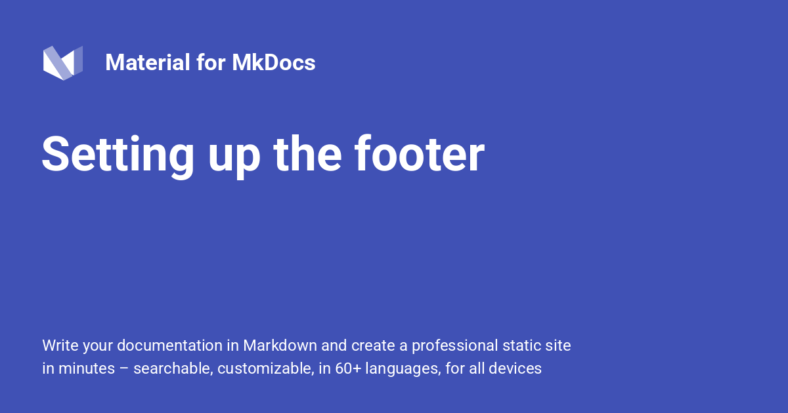

{: style="display: block; margin: 0 auto"}
<H1 style="text-align: center;">Setting up the Footer</H1>
 
!!! quote ""

    The footer of your project documentation is a great place to add links to websites or platforms you or your company are using as additional marketing channels, e.g. :fontawesome-brands-mastodon:{ style="color: #5A4CE0" } or :fontawesome-brands-youtube:{ style="color: #EE0F0F" }, which you can easily configure via `mkdocs.yml`.
    
[Back to: #Advanced-Configuration  :fontawesome-solid-paper-plane:](../MkDocs-Material-Start.md/#advanced-configuration){ .md-button .md-button--custom }

## Configuration

### Navigation

<!-- md:version 9.0.0 -->
<!-- md:feature -->

!!! info ""

    - The footer can include links to the previous and next page of the current page.
    - If you wish to enable this behavior, add the following lines to `mkdocs.yml`:
    
    ``` yaml
    theme:
      features:
        - navigation.footer
    ```
    
### Social Links

<!-- md:version 1.0.0 -->
<!-- md:default none -->

!!! info ""

    Social links are rendered next to the copyright notice as part of the footer of your project documentation. Add a list of social links in `mkdocs.yml` with:
    
    ``` yaml
    extra:
      social:
        - icon: fontawesome/brands/mastodon # (1)!
          link: https://fosstodon.org/@squidfunk
    ```
    
    1.  Enter a few keywords to find the perfect icon using our [icon search] and click on the shortcode to copy it to your clipboard:

        <div class="mdx-iconsearch" data-mdx-component="iconsearch">
          <input class="md-input md-input--stretch mdx-iconsearch__input" placeholder="Search icon" data-mdx-component="iconsearch-query" value="mastodon" />
          <div class="mdx-iconsearch-result" data-mdx-component="iconsearch-result" data-mdx-mode="file">
            <div class="mdx-iconsearch-result__meta"></div>
            <ol class="mdx-iconsearch-result__list"></ol>
          </div>
        </div>
        
!!! ex "Using Icons in Templates"

    When you're [extending the theme] with partials or blocks, you can simply reference any icon that's [bundled with the theme](https://squidfunk.github.io/mkdocs-material/reference/icons-emojis/) with Jinja's `include` function and wrap it with the `.twemoji` CSS class:

    ```html
    <span class="twemoji">
       <!-- (1)! -->
    </span>
    ```

    1.  Enter a few keywords to find the perfect icon using our [icon search] and click on the shortcode to copy it to your clipboard:

        <div class="mdx-iconsearch" data-mdx-component="iconsearch">
          <div class="mdx-iconsearch__bar">
            <input class="md-input md-input--stretch mdx-iconsearch__input" placeholder="Search Icons Emojis" data-mdx-component="iconsearch-query" value="brands youtube" />
            <div class="mdx-iconsearch-result__meta" data-mdx-component="iconsearch-meta"></div>
          </div>
          <ul class="mdx-iconsearch-result__list"></ul>
        </div>

    This is exactly what Material for MkDocs does in its templates.

The following properties are available for each link:

This property must contain a valid path to any icon bundled with the theme, or the build will not succeed. Some popular choices:

<div class="grid cards" markdown>

-   :fontawesome-brands-discord:{ style="color: #5865F2" } – `fontawesome/brands/discord`
-   :fontawesome-brands-docker:{ style="color: #2496ED" } – `fontawesome/brands/docker`
-   :fontawesome-brands-facebook:{ style="color: #1877F2" } – `fontawesome/brands/facebook`
-   :fontawesome-brands-github:{ style="color: #36C5F0" } – `fontawesome/brands/github`
-   :fontawesome-brands-gitlab:{ style="color: #FC6D26" } – `fontawesome/brands/gitlab`
-   :fontawesome-brands-instagram:{ style="color: #E1306C" } – `fontawesome/brands/instagram`
-   :fontawesome-brands-linkedin:{ style="color: #0077B5" } – `fontawesome/brands/linkedin`
-   :fontawesome-brands-mastodon:{ style="color: #5A4CE0" } – `fontawesome/brands/mastodon`
    <small>automatically adds [`rel=me`][rel=me]</small>
-   :fontawesome-brands-pied-piper-alt:{ style="color: #00A651" } – `fontawesome/brands/pied-piper-alt`
-   :fontawesome-brands-slack:{ style="color: #E01E5A" } – `fontawesome/brands/slack`
-   :fontawesome-brands-x-twitter:{ style="color: #36C5F0" } – `fontawesome/brands/x-twitter`
-   :fontawesome-brands-youtube:{ style="color: #EE0F0F" } – `fontawesome/brands/youtube`

</div>


!!! deep-dive ""

    This property must be set to a relative or absolute URL including the URI scheme. All URI schemes are supported, including `mailto` and `bitcoin`:

    === ":fontawesome-brands-mastodon: Mastodon"

        ``` yaml
        extra:
          social:
            - icon: fontawesome/brands/mastodon
              link: https://fosstodon.org/@squidfunk
        ```

    === ":octicons-mail-16: Email"

        ``` yaml
        extra:
          social:
            - icon: fontawesome/solid/paper-plane
              link: mailto:<email-address>
        ```

!!! deep-dive ""

    This property is used as the link's `title` attribute and can be set to a discernable name to improve accessibility:

    ``` yaml
    extra:
      social:
        - icon: fontawesome/brands/mastodon
          link: https://fosstodon.org/@squidfunk
          name: squidfunk on Fosstodon
    ```

  [icon search]: icons-emojis.md#search
  [rel=me]: https://docs.joinmastodon.org/user/profile/#verification

### Copyright Notice

!!! desc "Copyright Notice"

    A custom copyright banner can be rendered as part of the footer, which is displayed next to the social links. It can be defined as part of `mkdocs.yml`:
    
    !!! info ""
    
        ``` yaml
        copyright: Copyright & copy; 2016 - 2020 Martin Donath
        ```
            
### Generator Notice

!!! desc "Generator Notice"

    The footer displays a _Made with Material for MkDocs_ notice to denote how the site was generated. The notice can be removed with the following option via`mkdocs.yml`:
    
    !!! info ""
    
        ``` yaml
        extra:
          generator: false
        ```
    
!!! info "Please read this before removing the generator notice"

    - The subtle __Made with Material for MkDocs__ hint in the footer is one of the reasons why this project is so popular, as it tells the user how the site is generated, helping new users to discover this project. 
    
    - Before removing please consider that you're enjoying the benefits of @squidfunk's work for free, as this project is Open Source and has a permissive license. Thousands of hours went into this project, most of them without any financial return.
    
## Usage

### Hiding prev/next Links

!!! desc "Hiding prev/next Links"

    The footer navigation showing links to the previous and next page can be hidden with the front matter `hide` property. Add the following lines at the top of a Markdown file:
    
    !!! info ""

        ``` yaml
        ---
        hide:
          - footer
        ---
    
        # Page title
        ...
        ```
       
## Customization

### Custom Copyright

!!! copyright "Custom Copyright"

    In order to customize and override the [copyright notice], [extend the theme] and [override the `copyright.html` partial][overriding partials], which normally includes the `copyright` property set in `mkdocs.yml`.
    

  [copyright notice]: #copyright-notice
  [generator notice]: #generator-notice
  [extend the theme]: customization.md#extending-the-theme
  [overriding partials]: customization.md#overriding-partials


[Back to: #Advanced-Configuration  :fontawesome-solid-paper-plane:](../MkDocs-Material-Start.md/#advanced-configuration){ .md-button .md-button--custom }