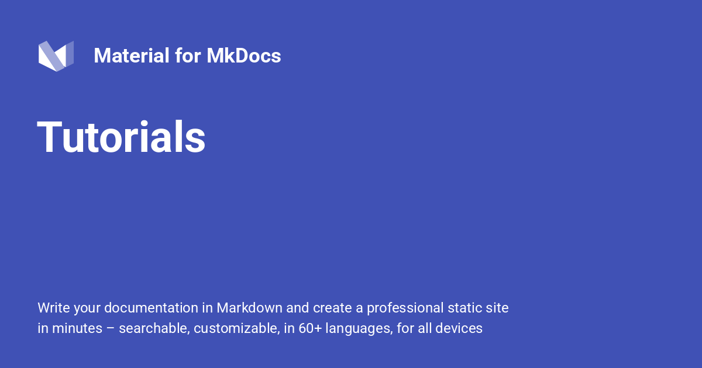

{: style="display: block; margin: 0 auto"}

<H1 style="text-align: center;">Tutorials</H1>

!!! quote " Tutorials Guide"

    In addition to the basic [Material-Getting-Started] and [creating your site] guides, we offer tutorials that aim to show how you can use Material for MkDocs in different use cases. In contrast to the getting started guides or the reference documentation, the tutorials show the breadth of features available in Material for MkDocs but also within the wider MkDocs ecosystem.
    
    The tutorials guide you through worked examples, so by following them you should gain not only an understanding of how to use Material for MkDocs, but also a template for your own projects. For convenience, these templates are also available as template repositories on GitHub.
    
[Material-Getting-Started]: ./Material-Getting-Started.md
[creating your site]: ./creating-your-site.md

!!! info "Feedback Wanted!"
    The tutorials are a recent addition to our documentation and we are still working out what shape they should have in the end. Please [provide any feedback you might have in this discussion thread].
    
    Note, however, that suggestions should be specific and feasible. We want to focus on creating more content at the moment, instead of developing a specific styling or behaviour for the tutorials. If there are worthwhile improvements that we can make through simple customization then we are happy to consider those.
    
[provide any feedback you might have in this discussion thread]: https://github.com/squidfunk/mkdocs-material/discussions/7220

## Blogs

-   :material-download: **Basics Inc. Post Metadata**
    [:octicons-arrow-right-24: View Guide](https://squidfunk.github.io/mkdocs-material/tutorials/blogs/basic/){ .md-button style="border-color: #008000; color: #008000" }

    Covers basics of setting up a blog, including post metadata. (20 min)

-   :material-cog: **Nav, Pgn, et al. Authors**
    [:octicons-arrow-right-24: View Config](https://squidfunk.github.io/mkdocs-material/tutorials/blogs/navigation/){ .md-button style="border-color: #d93026; color: #d93026" }

    Describes how to make it easier for your readers to find content. (30 min)

-   :material-rocket-launch: **Eng. and Dissemination**
    [:octicons-arrow-right-24: View Guide](https://squidfunk.github.io/mkdocs-material/tutorials/blogs/engage/){ .md-button style="border-color: #2094f3; color: #2094f3" }

    Walks you through ways of increasing engagement with your content. (30 min)

-   [:octicons-repo-template-24: Template Repository](https://github.com/mkdocs-material/create-blog)

## Social Cards

-   :material-download: **Basics for Social Cards**
    [:octicons-arrow-right-24: View Guide](https://squidfunk.github.io/mkdocs-material/tutorials/social/basic/){ .md-button style="color: #008000 !important; border: 1px solid rgba(255,255,255,0.1); background-color: rgba(255, 255, 255, 0.05) !important;" }

    Shows how to configure MaterialX to create social cards for your content. (20 min)

-   :material-palette: **Custom Cards - Social Plugin**
    [:octicons-arrow-right-24: View Guide](https://squidfunk.github.io/mkdocs-material/tutorials/social/custom/){ .md-button style="color: #2094f3 !important; border: 1px solid rgba(255,255,255,0.1); background-color: rgba(255, 255, 255, 0.05) !important;" }

    Shows you how to design your own custom social cards. (15 min)

-   [:octicons-repo-template-24: Template Repository](https://github.com/mkdocs-material/create-social-cards)

 [Back to: #Advanced-Configuration  :fontawesome-solid-paper-plane:](../MkDocs-Material-Start.md/#advanced-configuration){ .md-button .md-button--custom }