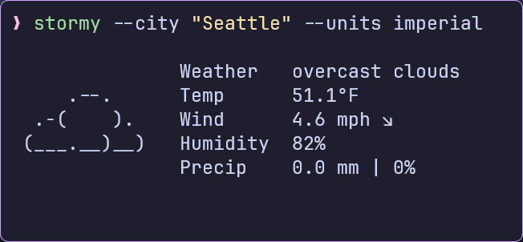

---
caption:
  figure:
    enable: true
  table:
    enable: false
  custom:
    enable: false
---

{: style="display: block; margin: 0 auto"}
<H1 style="text-align: center;">Referencing Figures And Tables.</H1>
 
 Back to: [Caption Main Page](../Caption.md)
 
!!! quote ""

    Referencing elements in markdown is pretty straight forward. Since this plugin adds a default id to all figures and tables created these ids can be used to reference the element. The following example shows how to reference a figure.
    


!!! abstract "Referencing Elements."

    !!! abstract ""

    === "Markdown"

        ```Markdown
        

        See [Figure](#_figure-1) above for more details.
        ```

    === "HTML"

        ```html
        <figure id=_figure-1>
            
            <figcaption>Figure 1. Caption</figcaption>
        </figure>
        <p>See the <a href="#_figure-1">Figure</a> above for more details.</p>
        ```


!!! warning
    Although a default id is added to each figure/table it is not recommended  use it as a reference. The reason is that the order of the figures/tables might change. This will result in the wrong figure/table being referenced. Instead it is recommended to assign a custom id to the figure/table.

##### Automatic Link Text Generation.

- Often one would like the link text to look something like `Figure 1` or `Table 1`.
- Sure this can be done manually, but it is tedious and error prone.
- This plugin can automatically generate the link text for you.
- This is done by referencing the figure/table id and not specifying a link text.


!!! abstract "Automatic Link Text Generation."

    !!! abstract ""

    === "Markdown"

        ```Markdown
        

        See [](#_figure-1) above for more details.
        ```

    === "HTML"

        ```html
        <figure id=_figure-1>
            
            <figcaption>Figure 1. Caption</figcaption>
        </figure>
        <p>See <a href="#_figure-1">Figure 1</a> above for more details.</p>
        ```

##### Config Chapter

## Config Chapter {: #return-to-config-box }

!!! danger "Config Chapter"
    The link text can be customized by using the `reference_text` option in the configuration. See the [Config Chapter](../MkDocsCaption/config.md) for more details.


##### Cross Page Referencing.

1. The automatic link text generation also works across pages.
2. The mechanism is the same as for local references.
3. If no link text is specified the plugin tries to replace it with the autogenerated link text.

!!! abstract "Cross Page Referencing."

    !!! abstract ""

    === "Markdown"

        **`page_a.md`**

        ```Markdown
        
        ```

        **`page_b.md`**

        ```Markdown
        See [](page_a.md#_figure-1) for more details.
        ```

    === "HTML"

        **`page_a.html`**

        ```html
        <figure id=_figure-1>
            
            <figcaption>Figure 1. Caption</figcaption>
        </figure>
        ```

        **`page_b.html`**

        ```html
        <p>See <a href="page_a.html#_figure-1">A/Figure 1</a> for more details.</p>
        ```


!!! note "Config Parameter"

    - The config parameter `cross_reference_text` can be used to customize the link text for cross references. The default is `{page_title}/{local_ref}`
    
    ---
    
    
    
---

<table-caption identifier="Table"         None>Stormy Weather</table-caption>

| Stormy 1| Weather 2 | 
| - | - | 
| content 1 | content 2 |
| content 3 | content 4 |

---

!!! abstract ""

    - Stormy Figure 1.
    
    ---
    
    
    

---

!!! abstract "Config Parameter"

    - The config parameter `cross_reference_text` can be used to customize the link text for cross references. The default is `{page_title}/{local_ref}`
    
    ---
    
    [](https://terminaltrove.com/stormy/)

---

!!! abstract "Config Parameter"

    - The config parameter `cross_reference_text` can be used to customize the link text for cross references. The default is `{page_title}/{local_ref}`
    
    ---
    
    [](https://terminaltrove.com/stormy/)

    [](https://terminaltrove.com/stormy/)


!!! pied-piper "Config Parameter"

    - The config parameter `cross_reference_text` can be used to customize the link text for cross references. The default is `{page_title}/{local_ref}`
    
    ---
    
    [{.reduced-image}](https://terminaltrove.com/stormy/)
    
    [{.reduced-image}](https://terminaltrove.com/stormy/)
    


!!! abstract "Example 1"

    !!! abstract ""

    === "Markdown"

        ```Markdown {#ex1-md linenums="1"}
        !(assets/demo.png)

        See [Figure](#_figure-1) above for more details.
        ```

    === "HTML"

        ```html {#ex1-html linenums="1"}
        <figure id=_figure-1>
            
            <figcaption>Figure 1. Caption</figcaption>
        </figure>
        <p>See the <a href="#_figure-1">Figure</a> above for more details.</p>
        ```

!(assets/demo.png)

See [Figure](#_figure-1) above for more details.
    
    