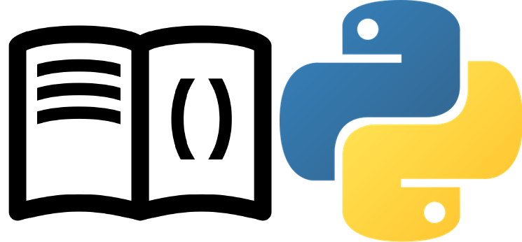

{: style="display: block; margin: 0 auto"}
<H1 style="text-align: center;"> <u>Themes</u></H1>


##### Themes
!!! pied-piper "*mkdocstrings*"

    - *mkdocstrings* can support multiple MkDocs themes. It currently supports the *[Material for MkDocs](https://squidfunk.github.io/mkdocs-material/)* theme and, partially, the built-in MkDocs and ReadTheDocs themes.
    
    ---
    - Each handler can fallback to a particular theme when the user selected theme is not supported. For example, the Python handler will fallback to the *Material for MkDocs* templates.
    

##### Customization
!!! info "Customization"

    There is some degree of customization possible in *mkdocstrings*. First, you can write custom templates to override the theme templates. Second, the provided templates make use of CSS classes, so you can tweak the look and feel with extra CSS rules.
    
##### Templates

!!! info "Templates"

    To use custom templates and override the theme ones, specify the relative path from your configuration file to your templates directory with the `custom_templates` global configuration option: (yaml title="mkdocs.yml")
    
    ```yaml {.no-copy}
    mkdocs.yaml
    ```
    
        
    ```yaml {.no-copy}
    plugins:
    - mkdocstrings:
        custom_templates: templates
    ```

    
    ---
    
    Your directory structure must be identical to the provided templates one:
    
    ```bash  {.no-copy}
    📁 templates/
    ├── 📁 <HANDLER 1>/
    │    ├── 📁 <THEME 1>/
    │    └── 📁 <THEME 2>/
    └── 📁 <HANDLER 2>/
         ├── 📁 <THEME 1>/
         └── 📁 <THEME 2>/
    ```
    
    For example, check out the Python [template tree](https://github.com/mkdocstrings/python/tree/master/src/mkdocstrings_handlers/python/templates/) on GitHub.
    
    You don't have to replicate the whole tree, only the handlers, themes or templates you want to override. For example, to override some templates of the *Material* theme for Python:
    
    ```bash {.no-copy}
    📁 templates/
    └── 📁 python/
    └── 📁 material/
         ├── 📄 parameters.html
         └── 📄 exceptions.html
    ```
    
!!! tip "Rreplace Original Contents with Modified Version"

    In the HTML files, replace the original contents with your modified version. In the future, the templates will use Jinja blocks, so it will be easier to modify small part of the templates without copy-pasting the whole files.
    
    ---
    
    See the documentation about templates for:
    
    - The [Crystal handler:](https://mkdocstrings.github.io/crystal/styling.html)
    
    - The [Python Handler:](https://mkdocstrings.github.io/python/usage/customization/#templates)
    

##### Debugging

!!! pied-piper "Debugging"

    Every template has access to a `log` function, allowing to log messages as usual:

    ```jinja {.no-copy}
    {{ log.debug("A DEBUG message.") }}
    {{ log.info("An INFO message.") }}
    {{ log.warning("A WARNING message.") }}
    {{ log.error("An ERROR message.") }}
    {{ log.critical("A CRITICAL message.") }}
    ```
    
##### CSS Classes
!!! abstract "CSS Classes"

    Since each handler provides its own set of templates, with their own CSS classes, we cannot list them all here. See the documentation about CSS classes for:
    
    - the Crystal handler: https://mkdocstrings.github.io/crystal/styling.html#custom-styles
    
    - the Python handler: https://mkdocstrings.github.io/python/usage/customization/#css-classes
    

##### Syntax Highlighting
!!! abstract "Syntax Highlighting"

    - Code blocks that occur in the docstring of an item inserted with *mkdocstrings*, as well as code blocks (such as *Source code*) that *mkdocstrings* inserts itself, are syntax-highlighted according to the same rules as other normal code blocks in your document.
    
     - See more details in [mkdocstrings.Highlighter](https://mkdocstrings.github.io/usage/theming/?h=mkdocstrings.highlighter#syntax-highlighting).
    
    ---
    
    - As for the CSS class used for code blocks -- it will also match the "normal" config, so the default (`.codehilite` or `.highlight`) will match your chosen Markdown extension for highlighting.
    
    ---
    
    IMPORTANT: **Changed in version 0.15.**
    
    - The CSS class used to always be `.highlight`, but now it depends on the configuration.
    
    - Long story short, you probably should add `pymdownx.highlight` to your `markdown_extensions`, and then use `.doc-contents .highlight` as the CSS selector in case you want to change something about *mkdocstrings'* code blocks specifically.
    


