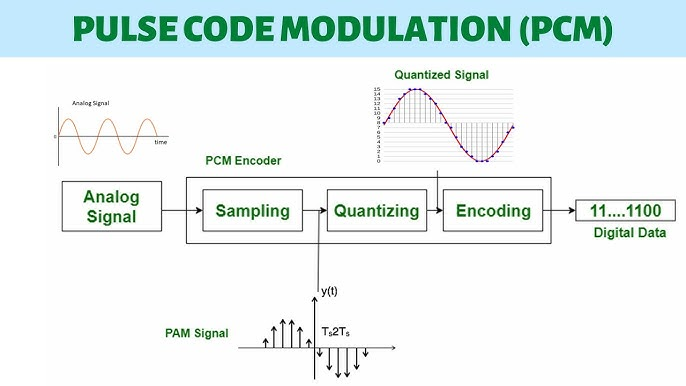
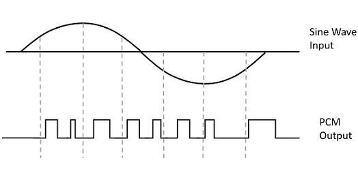
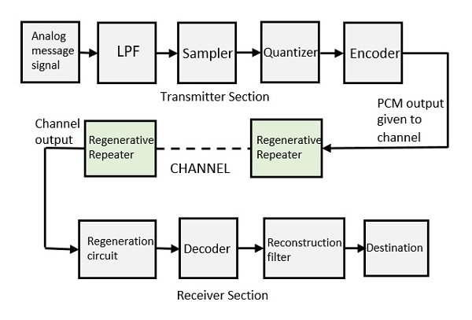

{: style="display: block; margin: 0 auto"}

<H1 style="text-align: center;">A Brief Overview of Pulse Code Modulation [PCM]</H1>

Communication refers to the transfer of information from one place to another. From dropping a letter to developments like landline phones, mobiles, FAX machines, SMS, MMS, e-mail, video calling are all part of communication. When information is transmitted from one place to another, we can expect delays, noise, data loss and much more. Sometimes due to noise or disturbance, it is hard to receive the message as it is transmitted. Here comes a concept which is known as modulation, which aids in the proper reception of the transmitted signal.

<h2></h2>
<h2>Modulation</h2>

Modulation is the process of altering one or more properties of a periodic waveform known as a carrier signal with respect to the <a href="https://byjus.com/physics/modulation-and-demodulation/">modulation </a>signal, which contains information to be transmitted. Modulation is performed by the device known as a modulator, and this technique is mainly used to overcome the interference of the signal. Modulation techniques typically aid in long-distance communication.

 
Modulation is of two types:
 
<ul>
<li>Analog Modulation</li>
<li>Digital modulation</li>
</ul>
 

In analog modulation, a continuously varying sine wave is considered a carrier wave. This wave modulates the data signal. In amplitude modulation, three parameters can be altered, they are: frequency, amplitude and phase.

 
Types of analog modulation are:
 
<ul>
<li>Amplitude modulation (AM)</li>
<li>Frequency modulation (FM)</li>
<li>Phase modulation (PM)</li>
</ul>
 

<h2>Digital Modulation</h2>

In digital modulation, an analog carrier signal is modulated by a discrete signal. The process of encoding affects the bandwidth of the transmitted signal and its robustness to channel impairments. In digital modulation, a message or information is converted into the amplitude, phase, or <a href="https://byjus.com/physics/period-angular-frequency/">frequency </a>of the transmitted signal. In the encoding process, the signal is converted from analog to digital form and then the modulated signal is carried by using a carrier wave.

 
Digital modulation is of the following types:
 
<ul>
<li>Pulse Amplitude modulation (PAM)</li>
<li>Pulse width modulation (PWM)</li>
<li>Pulse code modulation (PCM)</li>
</ul>
 

In this article, let us study in detail about one of the digital modulation techniques, Pulse code modulation (PCM).

<h2>Pulse Code Modulation</h2>

When a digital signal undergoes Pulse Code Modulation, it converts the analog information into a binary sequence (1 and 0). Through the demodulation process, we can obtain the original analog signal. The figure below represents the output of the PCM signal with respect to the sine wave.

{: style="display: block; margin: 0 auto"}

Pulse Code Modulation techniques are used to produce a series of numbers or digits in binary form. Hence this process is called digital modulation. The amplitude at that particular time of the signal sample is indicated by the binary codes.

In the PCM process, a sequence of coded pulses indicates the message signal. This message signal represents amplitude and time.

 
Pulse code modulations are of two types:
 
<ul>
<li>Differential pulse code modulation (DPCM)</li>
<li>Adaptive differential pulse code modulation (ADPCM)</li>
</ul>
 

Differential pulse-code modulation is a signal encoding process which adds functionalities based on the prediction of the samples of the signal.

Adaptive differential pulse-code modulation is a technique in which the size of the quantization step is varied, to allow the further reduction of the required data bandwidth to a given signal-to-noise ratio.

 
The Pulse Code Modulation process is done through the following steps:
 
<ul>
<li>Sampling</li>
<li>Quantisation</li>
<li>Coding</li>
</ul>
 

Block diagram of the Pulse Code Modulation process is as shown in the figure below.

{: style="display: block; margin: 0 auto"}

In the PCM process, it is possible to digitise all forms of analog data, including music, telemetry, voice, full-motion video. To obtain a pulse code modulated waveform from an analog waveform at the transmitter end and to convert the message signal into the binary form, a process known as quantisation is used.

At the receiver end of the pulse code circuit, demodulation takes place, and the signal is converted into pulses with the same quantum levels.

<strong>Low Pass Filter</strong>

A low pass filter helps in removing the high-frequency components included in the input of the analog signal. These frequency components are higher than the highest frequency of the message signal. Hence, a low pass filter is added in the pulse code modulation technique to avoid aliasing of the message signal.

<h3><strong>Sampler</strong></h3>

Sampler helps to collect the sample data at any time of the message signal, in order to reform the original signal. As per the sampling theorem, the sampling rate is greater than the highest frequency component of the message signal.

<h3><strong>Quantizer</strong></h3>

Quantizer helps to minimise the error through the process known as quantizing. The sampled output when passed through a quantizer, reduces the unnecessary bits and also helps in compressing the obtained values.

<h3><strong>Encoder</strong></h3>

The encoder is used for digitising the analog signal. Encoder helps to allot each quantised level through a binary code. The sample-and-hold process is adopted in this. Low pass filter, sampler, and quantiser aids to convert analog to digital forms. Encoding also aids in minimising the usage of bandwidth.

<h3><strong>Regenerative Repeater</strong></h3>

Regenerative repeater is used to compensate for the signal loss and also reform the signal. It also helps to increase signal strength. Hence, the output of the channel is equipped with one regenerative repeater circuit.

<h3><strong>Decoder</strong></h3>

The decoder helps to form the original signal by decoding the pulse coded waveform. Decoder acts as the demodulator.

<h3><strong>Reconstruction Filter</strong></h3>

The reconstruction filter helps to obtain the original signal. In the pulse code modulator circuit, the given analog signal is digitized, coded and sampled. The resultant signal is transmitted in an analog form. In order to obtain the original signal, the whole process is repeated in a reverse pattern .

<h2></h2>
<h2>Advantages and Disadvantages</h2>

<strong>Advantages</strong>

<ul>
<li>Pulse Code Modulation is used in long-distance communication.</li>
<li>The efficiency of the transmitter in PCM is high.</li>
<li>Higher noise immunity is seen.</li>
<li>Efficient method.</li>
</ul>

<strong>Disadvantages</strong>

<ul>
<li>The bandwidth requirement is high.</li>
<li>PCM is a complex process, since it involves encoding, decoding and quantisation of the circuit.</li>
</ul>
<h3>Applications of Pulse Code Modulation</h3>
<ul>
<li>It is used in telephony and compact discs.</li>
<li>Pulse Code Modulation is used in satellite transmission systems and space communications.</li>
</ul>

Read more about <a href="https://byjus.com/physics/modulation-need-modulation/">modulation and the need for modulation</a>.

!!! quote "Trivia"

    Related links
 
<td><a href="https://byjus.com/jee/relative-motion/">Relative Motion &rarr;</a></td><td><a href="https://byjus.com/physics/protection-against-earthquake/">Protection against Earthquakes</a></td>

<td><a href="https://byjus.com/physics/lenzs-law/">Lenz Law &rarr;</a></td><td><a href="https://byjus.com/physics/radioactivity-alpha-decay/">Radioactivity &rarr; Alpha Decay</a></td>

<h2 style="display: inline;" id="screenshots">Frequently Asked Questions on Pulse Code Modulation</h2>

<ul><b>Question 1.</b>
1. Why is a decoder used?
<li>The decoder helps to decode the pulse coded waveform to reproduce the original signal.</li></ul>

<ul><b>Question 2.</b>
2. What are the types of Pulse code modulations?
<li>Differential pulse code modulation (DPCM)</li>
<li>Adaptive differential pulse code modulation (ADPCM)</li></ul>

<ul><b>Question 3.</b>
3. Which component helps to increase the signal strength in PCM?
<li>Regenerative Repeater.</li></ul>

<ul><b>Question 4.</b>
4. What are the types of digital modulation?
<li>Pulse Amplitude modulation (PAM)</li>
<li>Pulse width modulation (PWM)</li>

<li>Pulse code modulation (PCM)</li></ul>

<ul><b>Question 5.</b>
5. In the PCM process, sequence of coded pulses indicates what?
<li>Message signal.</li>

 
<iframe width="560" height="315" src="https://www.youtube.com/embed/wCdgWp9NZlc?si=CvT_YNo5qsN-SRKU" title="YouTube video player" frameborder="0" allow="accelerometer; autoplay; clipboard-write; encrypted-media; gyroscope; picture-in-picture; web-share" referrerpolicy="strict-origin-when-cross-origin" allowfullscreen></iframe>

