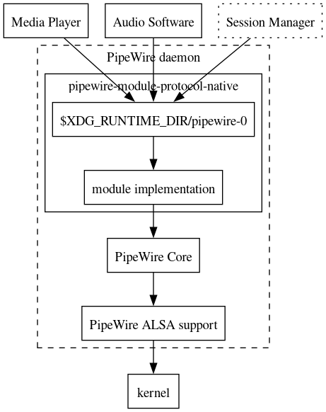

{: style="display: block; margin: 0 auto"}
<H1 style="text-align: center;"> PipeWire</H1>

!!! abstract "[PipeWire](https://pipewire.org) is a server and user space API to deal with multimedia pipelines. This includes:"

    - Making available sources of video (such as from a capture devices or application provided streams) and multiplexing this with clients.
    - Accessing sources of video for consumption.
    - Generating graphs for audio and video processing.

!!! success "Nodes"

    - Nodes in the graph can be implemented as separate processes, communicating with sockets and exchanging multimedia content using fd passing.

!!! abstract "Basic Chart"

    {: style="display: block; margin: 0 auto"}

!!! pied-piper "Building and Installation"

    - The preferred way to install PipeWire is to install it with your distribution package system. This ensures PipeWire is integrated into the rest of your system for the best experience.
    
    - If you want to build and install PipeWire yourself, refer to [install](https://github.com/PipeWire/pipewire/blob/master/INSTALL.md) for instructions.

## Usage

The most important purpose of PipeWire is to run your favorite apps.

Some applications use the native PipeWire API, such as most compositors
(gnome-shell, wayland, ...) to implement screen sharing. These apps will
just work automatically.

Most audio applications can use either ALSA, JACK or PulseAudio as a
backend. PipeWire provides support for all 3 backends. Depending on how
your distribution has configured things this should just work automatically
or with the provided scripts shown below.

PipeWire can use environment variables to control the behaviour of
applications:

* `PIPEWIRE_DEBUG=<level>`         to increase the debug level (or use one of
                                   `XEWIDT` for none, error, warnings, info,
                                   debug, or trace, respectively).
* `PIPEWIRE_LOG=<filename>`        to redirect log to filename
* `PIPEWIRE_LOG_SYSTEMD=false`     to disable logging to systemd journal
* `PIPEWIRE_LATENCY=<num/denom>`   to configure latency as a fraction. 10/1000
                                   configures a 10ms latency. Usually this is
				   expressed as a fraction of the samplerate,
				   like 256/48000, which uses 256 samples at a
				   samplerate of 48KHz for a latency of 5.33ms.
				   This function does not attempt to configure
				   the samplerate.
* `PIPEWIRE_RATE=<num/denom>`      to configure a rate for the graph.
* `PIPEWIRE_QUANTUM=<num/denom>`   to configure latency as a fraction and a
                   samplerate. This function will force the graph samplerate to
                   `denom` and force the specified `num` as the buffer size.
* `PIPEWIRE_NODE=<id>`             to request a link to the specified node. The
                    id can be a node.name or object.serial of the target node.

### Using tools

`pw-cat` can be used to play and record audio and midi. Use `pw-cat -h` to get
some more help. There are some aliases like `pw-play` and `pw-record` to make
things easier:

```
$ pw-play /home/wim/data/01.\ Firepower.wav
```

### Running JACK applications

Depending on how the system was configured, you can either run PipeWire and
JACK side-by-side or have PipeWire take over the functionality of JACK
completely.

In dual mode, JACK apps will by default use the JACK server. To direct a JACK
app to PipeWire, you can use the `pw-jack` script like this:

```
$ pw-jack <appname>
```

If you replaced JACK with PipeWire completely, `pw-jack` does not have any
effect and can be omitted.

JACK applications will automatically use the buffer-size chosen by the
server. You can force a maximum buffer size (latency) by setting the
`PIPEWIRE_LATENCY` environment variable like so:

```
PIPEWIRE_LATENCY=128/48000 jack_simple_client
```
Requests the `jack_simple_client` to run with a buffer of 128 or
less samples.


### Running PulseAudio applications

PipeWire can run a PulseAudio compatible replacement server. You can't
use both servers at the same time. Usually your package manager will
make the server conflict so that you can only install one or the
other.

PulseAudio applications still use the regular PulseAudio client
libraries and you don't need to do anything else than change the
server implementation.

A successful swap of the server can be verified by checking the
output of

```
pactl info
```
It should include the string:
```

Server Name: PulseAudio (on PipeWire 0.3.x)

```

You can use pavucontrol to change profiles and ports, change volumes
or redirect streams, just like with PulseAudio.


### Running ALSA applications

If the PipeWire alsa module is installed, it can be seen with

```
$ aplay -L
```

ALSA applications can then use the `pipewire:` device to use PipeWire
as the audio system.

### Running GStreamer applications

PipeWire includes 2 GStreamer elements called `pipewiresrc` and
`pipewiresink`. They can be used in pipelines such as this:

```
$ gst-launch-1.0 pipewiresrc ! videoconvert ! autovideosink
```

Or to play a beeping sound:

```
$ gst-launch-1.0 audiotestsrc ! pipewiresink
```

PipeWire provides a device monitor as well so that

```
$ gst-device-monitor-1.0
```

shows the PipeWire devices and applications like cheese will
automatically use the PipeWire video source when possible.

### Inspecting the PipeWire state

To inspect and manipulate the PipeWire graph via GUI, you can use [Helvum](https://gitlab.freedesktop.org/ryuukyu/helvum).

<details>

<summary><h2 style="display: inline;" id="screenshots">Helvum</h2></summary>

Helvum is a GTK-based patchbay for pipewire, inspired by the JACK tool [catia](https://kx.studio/Applications:Catia).

> [!caution]
> Helvum is currently not actively maintained.
> If you are interested in maintaining the project, please see https://gitlab.freedesktop.org/pipewire/helvum/-/issues/137


<a href="https://flathub.org/apps/details/org.pipewire.Helvum"></a>

<a href="https://repology.org/project/helvum/versions"></a>

# Features planned

- Volume control
- "Debug mode" that lets you view advanced information for nodes and ports

More suggestions are welcome!

# Building

## Via flatpak
If you don't have the flathub repo in your remote-list for flatpak you will need to add that first:
```shell
$ flatpak remote-add --if-not-exists flathub https://flathub.org/repo/flathub.flatpakrepo
```

Then install the required flatpak platform and SDK, if you dont have them already:
```shell
$ flatpak install org.gnome.{Platform,Sdk}//45 org.freedesktop.Sdk.Extension.rust-stable//23.08 org.freedesktop.Sdk.Extension.llvm16//23.08
```

To compile and install as a flatpak, clone the project, change to the project directory, and run:
```shell
$ flatpak-builder --install flatpak-build/ build-aux/org.pipewire.Helvum.json
```

You can then run the app via
```shell
$ flatpak run org.pipewire.Helvum
```

## Manually
For compilation, you will need:

- Meson
- An up-to-date rust toolchain
- `libclang-3.7` or higher
- `libadwaita-1` and `libpipewire-0.3` development packages and their dependencies

To compile and install, run

```shell
$ meson setup build && cd build
$ meson compile
$ meson install
```

in the repository root.
This will install the compiled project files into `/usr/local`.

# License and Credits
Helvum is distributed under the terms of the GPL3 license.
See LICENSE for more information.

Parts of the build system were taken from the [gtk-rust-template](https://gitlab.gnome.org/World/Rust/gtk-rust-template) project,
which is provided under the terms of the [MIT license](https://gitlab.gnome.org/World/Rust/gtk-rust-template/-/blob/master/LICENSE.md).


</div>

</details>

Alternatively, you can use use one of the excellent JACK tools, such as `Carla`,
`catia`, `qjackctl`, ...
However, you will not be able to see all features like the video
ports.

`pw-mon` dumps and monitors the state of the PipeWire daemon.

`pw-dot` can dump a graph of the pipeline, check out the help for
how to do this.

`pw-top` monitors the real-time status of the graph. This is handy to
find out what clients are running and how much DSP resources they
use.

`pw-dump` dumps the state of the PipeWire daemon in JSON format. This
can be used to find out the properties and parameters of the objects
in the PipeWire daemon.

There is a more complicated tool to inspect the state of the server
with `pw-cli`. This tool can be used interactively or it can execute
single commands like this to get the server information:

```
$ pw-cli info 0
```

## Documentation

Find tutorials and design documentation [here](https://github.com/PipeWire/pipewire/tree/master/doc/dox).

The (incomplete) autogenerated API docs are [here](https://docs.pipewire.org).

The Wiki can be found [here](https://gitlab.freedesktop.org/pipewire/pipewire/-/wikis/home)

## Contributing

PipeWire is Free Software and is developed in the open. It is mostly
licensed under the [MIT license](https://github.com/PipeWire/pipewire/blob/master/COPYING). Check [LICENSE](https://github.com/PipeWire/pipewire/blob/master/LICENSE) for
more details about the exceptions.

Contributors are encouraged to submit merge requests or file bugs on
[gitlab](https://gitlab.freedesktop.org/pipewire).

Join us on IRC at #pipewire on [OFTC](https://www.oftc.net/).

We adhere to the Contributor Covenant for our [code of conduct](https://github.com/PipeWire/pipewire/blob/master/CODE_OF_CONDUCT.md).

[Donate using Liberapay](https://liberapay.com/PipeWire/donate).

## Getting help

You can ask for help on the IRC channel (see above).  You can also ask
questions by [raising](https://gitlab.freedesktop.org/pipewire/pipewire/-/issues/new)
a gitlab issue.


## Building

PipeWire uses a build tool called [*Meson*](https://mesonbuild.com) as a basis for its build
process.  It's a tool with some resemblance to Autotools and CMake. Meson
again generates build files for a lower level build tool called [*Ninja*](https://ninja-build.org/),
working in about the same level of abstraction as more familiar GNU Make
does.

Meson uses a user-specified build directory and all files produced by Meson
are in that build directory. This build directory will be called `builddir`
in this document.

Generate the build files for Ninja:

```
$ meson setup builddir
```

For distribution-specific build dependencies, please check our
[CI pipeline](https://gitlab.freedesktop.org/pipewire/pipewire/-/blob/master/.gitlab-ci.yml)
(search for `FDO_DISTRIBUTION_PACKAGES`). Note that some dependencies are
optional and depend on options passed to meson.

Once this is done, the next step is to review the build options:

```
$ meson configure builddir
```

Define the installation prefix:

```
$ meson configure builddir -Dprefix=/usr # Default: /usr/local
```

PipeWire specific build options are listed in the "Project options"
section. They are defined in `meson_options.txt`.

Finally, invoke the build:

```
$ meson compile -C builddir
```

Just to avoid any confusion: `autogen.sh` is a script invoked by *Jhbuild*,
which orchestrates multi-component builds.

## Running

If you want to run PipeWire without installing it on your system, there is a
script that you can run. This puts you in an environment in which PipeWire can
be run from the build directory, and ALSA, PulseAudio and JACK applications
will use the PipeWire emulation libraries automatically
in this environment. You can get into this environment with:

```
$ ./pw-uninstalled.sh -b builddir
```

In most cases you would want to run the default pipewire daemon. Look
below for how to make this daemon start automatically using systemd.
If you want to run pipewire from the build directory, you can do this
by doing:

```
cd builddir/
make run
```

This will use the default config file to configure and start the daemon.
The default config will also start `pipewire-media-session`, a default
example media session and `pipewire-pulse`, a PulseAudio compatible server.

You can also enable more debugging with the `PIPEWIRE_DEBUG` and
`WIREPLUMBER_DEBUG` environment variables like so:

```
cd builddir/
PIPEWIRE_DEBUG="D" WIREPLUMBER_DEBUG="D" make run
```

You might have to stop the pipewire service/socket that might have been
started already, with:

```
systemctl --user stop pipewire.service \
                      pipewire.socket \
                      pipewire-media-session.service \
                      pipewire-pulse.service \
                      pipewire-pulse.socket
```

## Installing

PipeWire comes with quite a bit of libraries and tools, run:

```
meson install -C builddir
```

to install everything onto the system into the specified prefix.
Depending on the configured installation prefix, the above command
may need to be run with elevated privileges (e.g. with `sudo`).
Some additional steps will have to be performed to integrate
with the distribution as shown below.

### PipeWire daemon

A correctly installed PipeWire system should have a pipewire
process, a pipewire-media-session (or alternative) and an (optional)
pipewire-pulse process running. PipeWire is usually started as a
systemd unit using socket activation or as a service.

Configuration of the PipeWire daemon can be found in
`/usr/share/pipewire/pipewire.conf`. Please refer to the comments in the
config file for more information about the configuration options.

The daemon is started with:
```
systemctl --user start pipewire.service pipewire.socket
```

If you did not start the media-session in pipewire.conf, you will
also need to start it like this:
```
systemctl --user start pipewire-media-session.service
```
To make it start on system startup:
```
systemctl --user enable pipewire-media-session.service
```
you can write ```enable --now``` to start service immediately.

### ALSA plugin

The ALSA plugin is usually installed in:

On Fedora:
```
/usr/lib64/alsa-lib/libasound_module_pcm_pipewire.so
```
On Ubuntu:
```
/usr/lib/x86_64-linux-gnu/alsa-lib/libasound_module_pcm_pipewire.so
```

There is also a config file installed in:

```
/usr/share/alsa/alsa.conf.d/50-pipewire.conf
```

The plugin will be picked up by alsa when the following files
are in `/etc/alsa/conf.d/`:

```
/etc/alsa/conf.d/50-pipewire.conf -> /usr/share/alsa/alsa.conf.d/50-pipewire.conf
/etc/alsa/conf.d/99-pipewire-default.conf
```

With this setup, `aplay -l` should list a pipewire device that can be used as
a regular alsa device for playback and record.

### JACK emulation

PipeWire reimplements the 3 libraries that JACK applications use to make
them run on top of PipeWire.

These libraries are found here:

```
/usr/lib64/pipewire-0.3/jack/libjacknet.so -> libjacknet.so.0
/usr/lib64/pipewire-0.3/jack/libjacknet.so.0 -> libjacknet.so.0.304.0
/usr/lib64/pipewire-0.3/jack/libjacknet.so.0.304.0
/usr/lib64/pipewire-0.3/jack/libjackserver.so -> libjackserver.so.0
/usr/lib64/pipewire-0.3/jack/libjackserver.so.0 -> libjackserver.so.0.304.0
/usr/lib64/pipewire-0.3/jack/libjackserver.so.0.304.0
/usr/lib64/pipewire-0.3/jack/libjack.so -> libjack.so.0
/usr/lib64/pipewire-0.3/jack/libjack.so.0 -> libjack.so.0.304.0
/usr/lib64/pipewire-0.3/jack/libjack.so.0.304.0

```

The provided `pw-jack` script uses `LD_LIBRARY_PATH` to set the library
search path to these replacement libraries. This allows you to run
jack apps on both the real JACK server or on PipeWire with the script.

It is also possible to completely replace the JACK libraries by adding
a file `pipewire-jack-x86_64.conf` to `/etc/ld.so.conf.d/` with
contents like:

```
/usr/lib64/pipewire-0.3/jack/
```

Note that when JACK is replaced by PipeWire, the SPA JACK plugin (installed
in `/usr/lib64/spa-0.2/jack/libspa-jack.so`) is not useful anymore and
distributions should make them conflict.


### PulseAudio replacement

PipeWire reimplements the PulseAudio server protocol as a small service
that runs on top of PipeWire.

The binary is normally placed here:

```
/usr/bin/pipewire-pulse
```

The server can be started with provided systemd activation files or
from PipeWire itself. (See `/usr/share/pipewire/pipewire.conf`)

```
systemctl --user start pipewire-pulse.service pipewire-pulse.socket
```

You can also start additional PulseAudio servers listening on other
sockets with the `-a` option. See `pipewire-pulse -h` for more info.


## Uninstalling

To uninstall, run:

```
ninja -C builddir uninstall
```

Depending on the configured installation prefix, the above command
may need to be run with elevated privileges (e.g. with `sudo`).

Note that at the time of writing uninstallation only works with the
same build directory that was used for installation. Meson stores the
list of installed files in the build directory, and this list is
necessary for uninstallation to work.


| Name | License | Website | Description |
|:-----|:-------:|:-------:|:------------|
| [Max](https://wiki.hydrogenaudio.org/index.php?title=Max) | GPL | [here](https://max.macupdate.com/) | A secure ripper for OS X that uses additional cdparanoia functionality |
| [XLD](https://wiki.hydrogenaudio.org/index.php?title=XLD) | GPL | [here](https://x-lossless-decoder.macupdate.com/) | X Lossless Decoder(XLD) is a tool for Mac OS X that is able to decode/convert/play various 'lossless' audio files. The supported audio files can be split into some tracks with cue sheet when decoding. Can convert between many lossless and lossy formats. Plugin oriented design, for easy exchange for new encoders. |

| Name | License | Website | Description |
|:-----|:-------:|:-------:|:------------|
| CUERipper | GPL | [here](http://cue.tools/wiki/CUERipper) | A secure ripper for Windows that includes Accurate Stream functionality. [Forum](https://hydrogenaud.io/index.php/board,74.0.html) |
| [dBpoweramp](https://wiki.hydrogenaudio.org/index.php?title=DBpoweramp) | commercial | [here](http://www.dbpoweramp.com/) | A secure ripper for Windows that includes Accurate Stream functionality. |
| [EAC](https://wiki.hydrogenaudio.org/index.php?title=Exact_Audio_Copy) | Free | [here](http://www.exactaudiocopy.de/) | A secure ripper for Windows, C2 error pointers, Accurate Stream, etc. |
| [fre:ac](https://wiki.hydrogenaudio.org/index.php?title=Fre:ac) | GPL | [here](http://www.freac.org/) | fre:ac is a free audio converter and CD ripper with support for various popular formats and encoders. Plus supports the CDDB/freedb online CD database which allows you query song information. |

| name | license | website | description |
|:-----|:-------:|:-------:|:------------|
| abcde | gpl | [here](https://abcde.einval.com/wiki/) | a command-line based ripper with cdparanoia functionality |
| [cdparanoia](https://wiki.hydrogenaudio.org/index.php?title=Cdparanoia) | bsd, gpl | [here](https://xiph.org/paranoia/) | one of the first secure standalone rippers for the linux platform |
| grip | gpl | [here](https://sourceforge.net/projects/grip/) | an open-source gnome interface ripper that uses cdparanoia functionality |
| [Rubyripper](https://wiki.hydrogenaudio.org/index.php?title=Rubyripper) | gpl | [here](https://github.com/bleskodev/rubyripper) | a secure ripper for linux that uses additional cdparanoia functionality |
| [Whipper](https://wiki.hydrogenaudio.org/index.php?title=Whipper) | gpl | [here](https://github.com/whipper-team/whipper) | a secure ripper for the linux command-line built on cdparanoia |