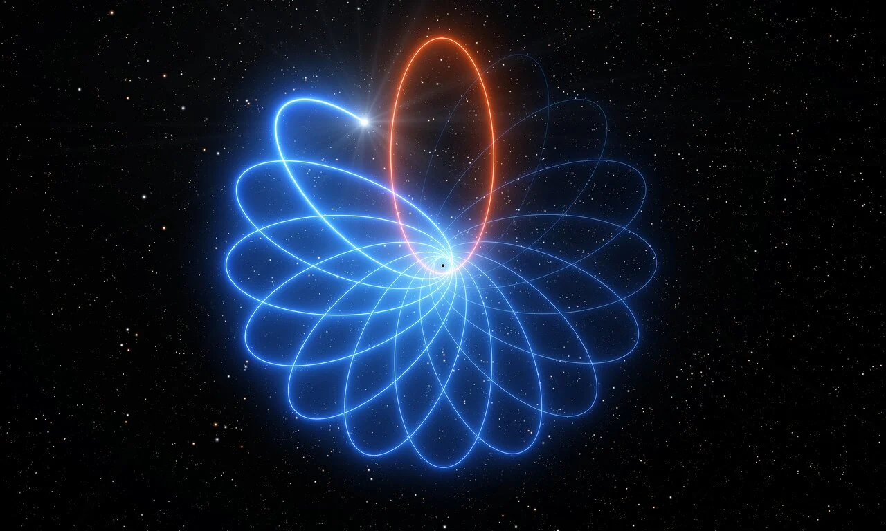
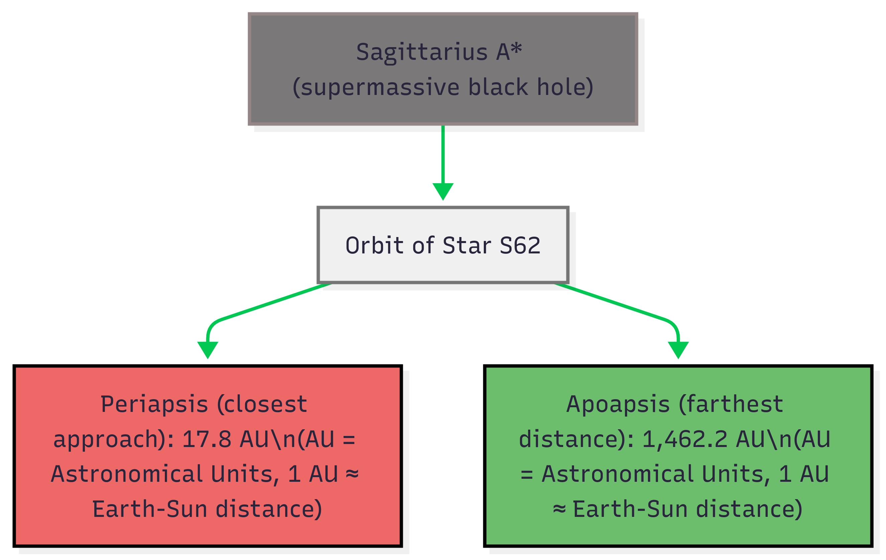
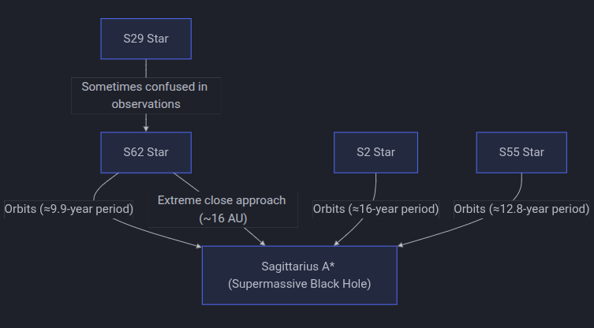
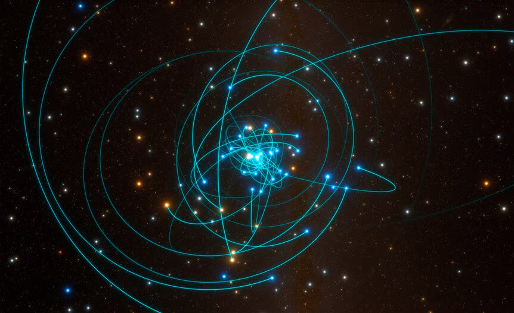
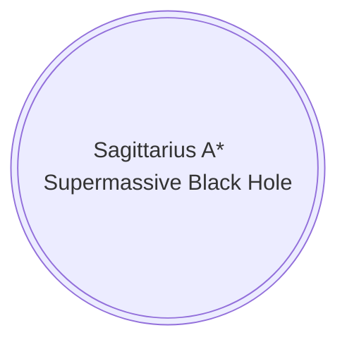
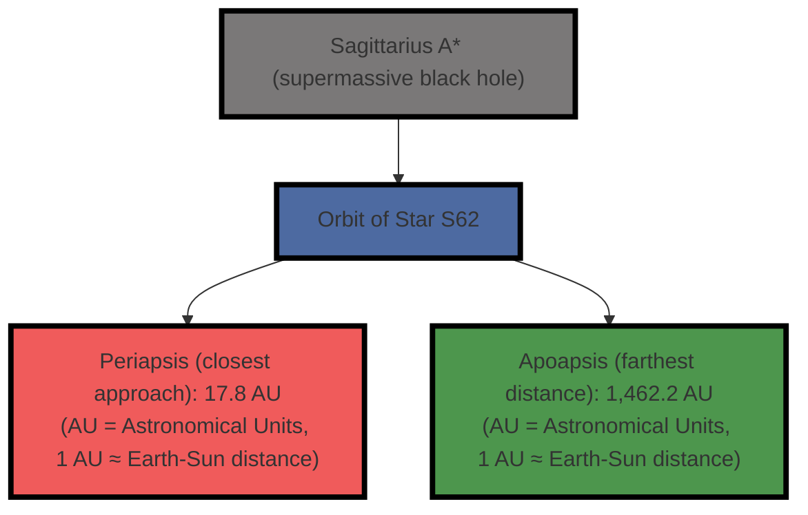
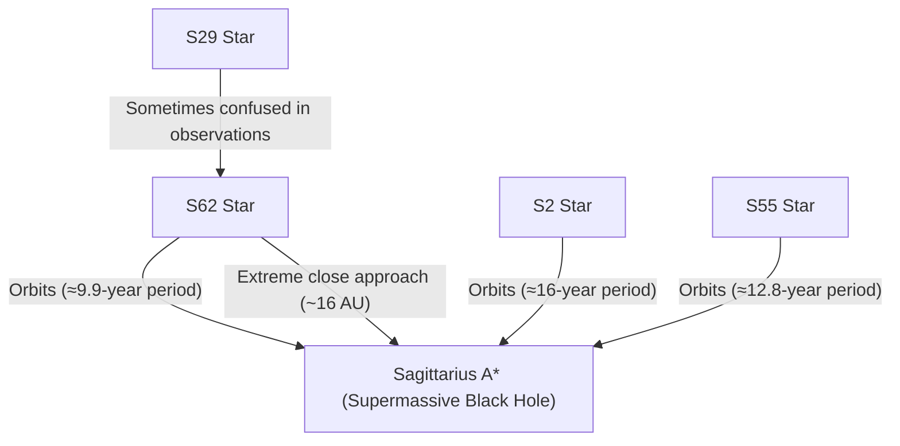
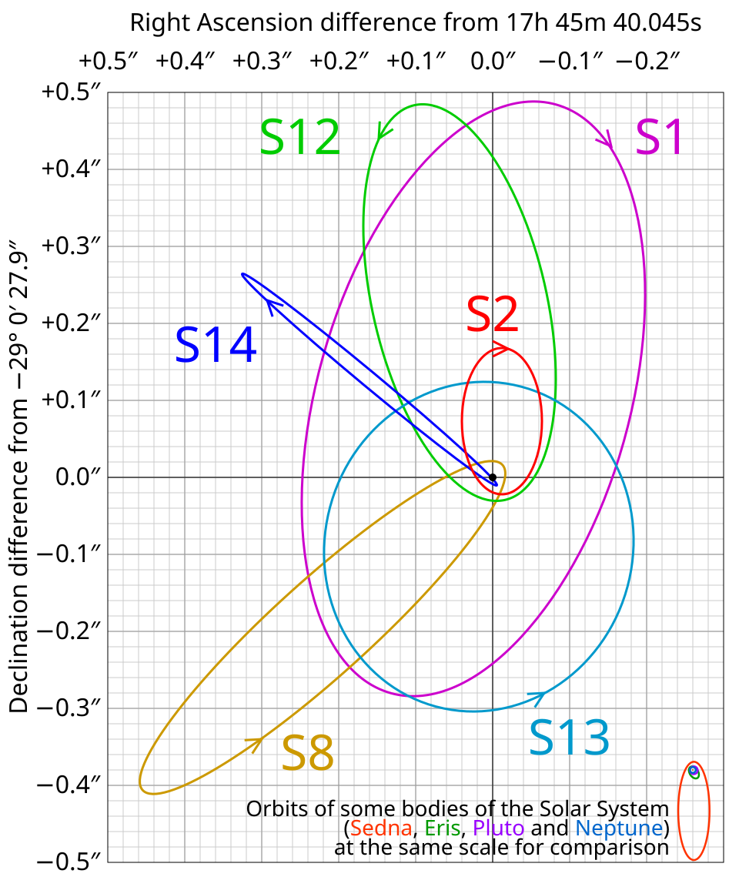

<div style="display: none;">
  <h1>Header</h1>
</div>

{: style="display: block; margin: 0 auto"}

### 🚀 <u>The Extreme Orbits of S62: A Relativistic Dance Around Sagittarius A*</u>

### 🌌 Introduction
!!! quote "Star S62"

    S62 is one of the most extreme stars in the Milky Way, orbiting the supermassive black hole **Sagittarius A*** at relativistic speeds. Its orbit is so eccentric that it plunges to within **17.8 AU** of the black hole—about 4 times the distance from the Sun to Pluto—before swinging out to **1,460 AU**.
    
    This document explores the physics of S62’s orbit, including:
    
    - Maximum orbital velocity,
    - Orbital period,
    - Relativistic effects,
    - And a comparison with other S-stars.
    
---

### 🔬 Core Physics: The Vis-Viva Equation

The velocity of a star in an elliptical orbit is given by the **vis-viva equation**:

$$
v = \sqrt{GM\left(\frac{2}{r} - \frac{1}{a}\right)}
$$

Where:
- $v$ = orbital velocity,
- $G$ = gravitational constant ($6.674 \times 10^{-11}\ \text{m}^3\text{kg}^{-1}\text{s}^{-2}$),
- $M$ = mass of Sagittarius A*,
- $r$ = distance from the black hole,
- $a$ = semi-major axis.

At **periapsis** ($r = r_p$), the velocity reaches its maximum:

$$
v_{\text{max}} = \sqrt{\frac{GM}{a}\left(\frac{1+e}{1-e}\right)}
$$

---

### 📊 S62's Orbital Parameters

| Parameter | Value |
|--------|-------|
| Semi-major axis ($a$) | 740 AU |
| Eccentricity ($e$) | 0.976 |
| Periapsis ($r_p$) | 17.8 AU |
| Apoapsis ($r_a$) | 1,462.2 AU |
| Orbital period ($T$) | 9.9 years |
| Max velocity ($v_{\text{max}}$) | 20,200 km/s |
| Fraction of $c$ | 6.7% |

---

### ⚡ Maximum Orbital Velocity

At periapsis, S62 reaches a maximum speed of:

$$
v_{\text{max}} = \sqrt{\frac{(6.674 \times 10^{-11})(4.15 \times 10^6 \times 1.989 \times 10^{30})}{740 \times 1.496 \times 10^{11}} \times \frac{1.976}{0.024}} \approx 20,200,000\ \text{m/s}
$$

This is approximately **20,200 km/s**, or **6.7% of the speed of light** ($c$).

---

### ⏳ Orbital Period and Relativistic Effects

The orbital period $T$ is derived from **Kepler's Third Law**:

$$
T = 2\pi \sqrt{\frac{a^3}{GM}}
$$

Substituting values:

$$
T = 2\pi \sqrt{\frac{(740 \times 1.496 \times 10^{11})^3}{(6.674 \times 10^{-11})(8.25 \times 10^{36})}} \approx 3.12 \times 10^8\ \text{s} \approx 9.9\ \text{years}
$$

---

### 🌐 Interactive Orbit Diagram
<br>


{: style="display: block; margin: 0 auto"}

---

### 🌟 Conclusion
!!! tip "Cosmic Speedster"

    S62 is a **cosmic speedster**, racing through the heart of the Milky Way at velocities that test the limits of general relativity. Its extreme orbit provides a unique opportunity to study:
    
    - The **dynamics of supermassive black holes**,
    - **Relativistic effects** in strong gravitational fields,
    - And the **structure of the galactic center**.

    This is not just science—it's **astrophysical theater**.
    
---
## 📤 Share This Content

You can:
- **Download** this as a PDF,
- **Embed** it in a website,
- Or **share** it with your community.

Let me know if you'd like a **printable version** or a **presentation** (e.g., in PowerPoint or Reveal.js).

---

> *All calculations assume a circular orbit approximation and neglect relativistic corrections beyond the vis-viva equation. For precise modeling, general relativity corrections are necessary.* 

{: style="display: block; margin: 0 auto"}
<H5 style="text-align: center;">Star S29 and Star S2</H5>

---

{: style="display: block; margin: 0 auto"}
<H5 style="text-align: center;">A simulation showing the positions and orbits of stars orbiting the supermassive black hole in the center of the Milky Way.</H5>


---
??? pied-piper "Mermaid Flowchart"

    - All calculations assume a circular orbit approximation and neglect relativistic corrections beyond the vis-viva equation. For precise modeling, general relativity corrections are necessary.
    
    ---

    <div style="text-align: center;">

    ```mermaid
    graph TD
    A["Sagittarius A* (supermassive black hole)"] --> B["Orbit of Star S62"]
    B --> C["Periapsis (closest approach): 17.8 AU\n(AU = Astronomical Units, 1 AU ≈ Earth-Sun distance)"]
    B --> D["Apoapsis (farthest distance): 1,462.2 AU\n(AU = Astronomical Units, 1 AU ≈ Earth-Sun distance)"]
    style A fill:#7a7878,stroke:#948686,stroke-width:4px
    style B fill:#4d6aa1,stroke:#747474,stroke-width:2px
    style C fill:#f05b5b,stroke:#000,stroke-width:2px
    style D fill:#4d964d,stroke:#000,stroke-width:2px
    ```
    </div>

---



---

### 🌟 <u>Star S62</u>

<div style="text-align: center;">



</div>
---

> *All calculations assume a circular orbit approximation and neglect relativistic corrections beyond the vis-viva equation. For precise modeling, general relativity corrections are necessary.* 

---




---

{: style="display: block; margin: 0 auto"}


### 🌐 S-Stars: Galactic Centre

Deep in the heart of our galaxy, a cluster of stars known as the **S-stars** performs a high-speed orbital dance around **Sagittarius A*** (Sgr A*), the supermassive black hole at the center of the Milky Way. These stars serve as "cosmic clocks" that allow us to test the limits of modern physics.

---

#### 🌐 1: Notable S-Star Profiles

These stars are accelerated to "relativistic" speeds—significant fractions of the speed of light—due to the immense gravity of the black hole (~4.3 million solar masses).

#### 🌐 The Record Breakers

*   **S29**: One of the closest stars ever tracked. It reached its closest approach in 2021, screaming past the black hole at **31 million km/h** (~8,700 km/s).

*   **S4714**: Currently holds the record for the fastest orbital velocity, reaching an incredible **8% of the speed of light** (~24,000 km/s).

*   **S4716**: Discovered in 2022, it has the shortest orbital period ever found, circling Sgr A* every **4 years**.

*   **S2 (or S0-2)**: The most famous S-star. Its 16-year orbit provided the first direct confirmation of gravitational redshift in 2018.

#### 🌐 S62 vs. S29 Identity Case

For a time, **S62** was hailed as the record-holder. However, recent data from the GRAVITY instrument suggests an observational error occurred:

*   **S62 (Contested):** Likely a "ghost" or misidentification in early papers.
*   **S29 (Confirmed):** Now believed to be the actual star behind the extreme data originally attributed to S62.


| Star | Status | Max Speed (km/s) | Period (Years) |
| :--- | :--- | :---: | :---: |
| **S2** | Confirmed | 7,700 | 16.0 |
| **S29** | Confirmed | 8,740 | 9.1 |
| **S4714** | Record Holder | 24,000 | 12.0 |
| **S4716** | Record Holder | 8,000 | 4.0 |
| **S62** | Contested | 20,000 | 9.9 |

---

### 🌐 Proving Einstein $E=mc^2$

Using stars like **S2** and **S29**, astronomers have successfully observed two primary relativistic effects: **Gravitational Redshift** and **Schwarzschild Precession**.

#### 🌐 2: General Relativity Tests

Using these stars, astronomers have successfully observed effects predicted by Albert Einstein that Newtonian physics cannot explain.
!!! info "Gravitational Light Bending $\Delta\phi$"
    Gravitational Light Bending $\Delta\phi$
    $\Delta\phi = \frac{4GM}{c^2b}$
    
#### 🌐 a: Gravitational Redshift

As a star makes its closest approach, it sits deep within the "gravity well." The immense pull of Sgr A* "robs" the star's light of energy, stretching the waves toward the red end of the spectrum.
!!! info "Gravitational Redshift $z \approx \frac{\Delta \Phi}{c^{2}}$"
    
    $z = \frac{\Delta\nu}{\nu_0} = \frac{\nu_{emit} - \nu_{obs}}{\nu_{obs}} \approx \frac{\Delta\Phi}{c^2}$
    

#### 🌐 The Physics

!!! info "Gravitational Redshift Factor $z_{gr}$"
    The Gravitational Redshift Factor $z_{gr}$ is calculated using the Schwarzschild radius $r_s$ and the star's distance at closest approach $r$:
    
    $z_{gr} \approx \frac{1}{\sqrt{1 - \frac{r_s}{r}}} - 1$
    
    
    > **Note: $r_s = \frac{2GM}{c^2}$ represents the radius of the Event Horizon.**
    
#### 🌐 b: The "Rosette" Orbit

!!! info "Schwarzschild Precession $\Delta\phi$"
    - In Newtonian physics, a star should return to the exact same spot after one full orbit.
    - Einstein predicted that the orbit itself should rotate over time, creating a "rosette" pattern.
    
#### 🌐 The Math
!!! info "The Math: $\Delta \phi$ : $M$ : $c$"
    The angle of this rotation (precession) per orbit, $\Delta \phi$, is calculated using the mass of the black hole $M$, the speed of light $c$, the semi-major axis $a$, and the eccentricity $e$:
    
    > *Note: $\Delta \phi \approx \frac{6\pi GM}{c^2 a (1-e^2)}$  The "Rosette" Orbit.*
    

---

#### 🌐 3: Frame Dragging

This is the next frontier. If Sgr A* is spinning, it should "drag" the fabric of space-time with it, causing the orbits of stars like **S29** to "wobble" in 3D. This would allow us to measure the black hole's spin.

| Effect | Observed? | What it Proved |
| :--- | :--- | :--- |
| **Gravitational Redshift** | **Yes (S2)** | Gravity slows down time and stretches light. |
| **Schwarzschild Precession** | **Yes (S2)** | Orbits do not close; they rotate like a flower petal. |
| **Lense-Thirring Effect** | **Pending** | The black hole "drags" space-time as it spins. |

Astronomers are now using **S29** and **S4714** to look for **Lense-Thirring Precession**. If the black hole is spinning, it should "drag" the fabric of space-time around with it. This would cause the stars' orbits to "wobble" in three dimensions, finally allowing us to measure the spin of Sagittarius A*.

***

**Scientific Note:** At these velocities, **time dilation** is significant. For a star moving at the speeds of S29 or S4714, time passes notably slower relative to an observer on Earth.

<iframe width="560" height="315" src="https://www.youtube.com/embed/Eysecnh7yqc?si=Ya0zkUbQdH0ysTCJ" title="YouTube video player" frameborder="0" allow="accelerometer; autoplay; clipboard-write; encrypted-media; gyroscope; picture-in-picture; web-share" referrerpolicy="strict-origin-when-cross-origin" allowfullscreen></iframe>

#### 🌐 Table 2:

#### 🌐 Orbital (\(\in \)) S2 and S4716

<style>
  /* Force the table to fit the page width exactly */
  .md-typeset table {
    width: 100%;
    display: table;
    table-layout: fixed; /* This is the magic: it forces columns to obey set widths */
  }

  /* Specific column widths */
  /* Column 1 (Source) - let it take the most space */
  .md-typeset td:nth-child(1) { width: 25%; }
  
  /* Column 3 (e) - force it to be very narrow */
  .md-typeset td:nth-child(3) { width: 10%; }
</style>


| Source | a (mpc) | e | i (deg) | ω (deg) | Ω (deg) | t_closest (yr) |
| :--- | :---: | :---: | :---: | :---: | :---: | :---: |
| S2 | 5.09 ± 0.01 | 0.886 ± 0.002 | 133.49 ± 0.40 | 65.89 ± 0.75 | 227.46 ± 1.03 | 2018.37 ± 0.02 |
| S4716 (est) | 1.93 ± 0.02 | 0.756 ± 0.02 | 161.24 ± 2.80 | 0.073 ± 0.02 | 151.54 ± 1.54 | 2017.41 ± 0.004 |
| S4716 (ML) | 1.94 ± 0.02 | 0.756 ± 0.02 | 161.13 ± 2.80 | 2.25 ± 0.02 | 153.55 ± 1.54 | 2017.41 ± 0.004 |

!!!note "NOTE!"

    - The estimated (est) values for S4716 are based on a Keplerian fit model, while the Maximum Likelihood (ML) stems from the MCMC simulation.
    
    - See Appendix B for a discussion of these values.
    
#### 🌐 Table 8:
#### 🌐 Derived Positions / Corresponding Uncertainty for S4716

| Epoch | DeltaR.A. (as) | DeltaDecl. (as) | DeltaR.A. Error (as) | DeltaDecl. Error (as) | lambda (mum) | Resolution (as) | Instrument |
| :--- | :--- | :--- | :--- | :--- | :--- | :--- | :--- |
| 2003.44 | -0.041 | 0.066 | 0.007 | 0.007 | 1.97-2.32 | 0.039 | NACO |
| 2005.26 | -0.033 | -0.002 | 0.007 | 0.007 | 1.97-2.32 | 0.046 | NACO |
| 2005.58 | 0.019 | 0.033 | 0.007 | 0.007 | 1.97-2.32 | 0.039 | NACO |
| 2006.33 | -0.015 | 0.077 | 0.007 | 0.007 | 1.94-2.29 | 0.029 | NIRC2 |
| 2007.25 | -0.039 | 0.073 | 0.007 | 0.007 | 1.97-2.32 | 0.030 | NACO |
| 2008.46 | -0.053 | 0.045 | 0.007 | 0.007 | 1.97-2.32 | 0.033 | NACO |
| 2010.24 | -0.017 | 0.079 | 0.013 | 0.013 | 1.97-2.32 | 0.039 | NACO |
| 2013.40 | 0.006 | -0.013 | 0.007 | 0.007 | 2.00-2.20 | 0.037 | SINFONI |
| 2013.66 | 0.013 | 0.000 | 0.007 | 0.007 | 1.97-2.32 | 0.046 | NACO |
| 2014.50 | -0.024 | 0.070 | 0.007 | 0.007 | 2.00-2.20 | 0.037 | SINFONI |
| 2015.30 | -0.050 | 0.062 | 0.007 | 0.007 | 2.00-2.20 | 0.042 | SINFONI |
| 2019.30 | -0.027 | 0.073 | 0.007 | 0.007 | 1.97-2.32 | 0.029 | NIRC2 |
| 2019.67 | -0.044 | 0.064 | 0.005 | 0.005 | 1.94-2.29 | 0.028 | NIRC2 |
| 2019.73 | -0.053 | 0.066 | 0.007 | 0.007 | 1.97-2.32 | 0.038 | NACO |
| 2020.42 | -0.050 | 0.050 | 0.005 | 0.005 | 2.12-2.22 | 0.039 | OSIRIS |
| 2020.58 | -0.050 | 0.050 | 0.005 | 0.005 | 2.12-2.22 | 0.029 | OSIRIS |
| 2021.24 | -0.051 | 0.034 | 0.0005 | 0.0005 | 2.00-2.40 | 65 x 10^-6 | GRAVITY |
| 2021.41 | 0.0029 | -0.01176 | 0.0005 | 0.0005 | 2.00-2.40 | 65 x 10^-6 | GRAVITY |
| 2021.47 | 0.0129 | -0.0029 | 0.0005 | 0.0005 | 2.00-2.40 | 65 x 10^-6 | GRAVITY |
| 2021.56 | 0.0182 | 0.00941 | 0.0005 | 0.0005 | 2.00-2.40 | 65 x 10^-6 | GRAVITY |

!!! info "Here is the analysis of the data provided in Table 8."

    - Observation Summary for S4716
    - The observations for S4716 span from 2003.44 to 2021.56.
    - Total Time Span: 18.12 years
    - Total Data Points: 20 positions
    - Instruments Used: 5 (NACO, NIRC2, SINFONI, OSIRIS, GRAVITY)
    - Mean Astrometric Uncertainty by Instrument
    - The table below summarizes the average precision (uncertainty) achieved by each instrument used in this study.
    - Note the significant leap in precision provided by the GRAVITY interferometer.
    

| Instrument | Data Points | Mean DeltaR.A. Error (as) | Mean DeltaDecl. Error (as) |
| :--- | :---: | :--- | :--- |
| GRAVITY | 4 | 0.00050 | 0.00050 |
| OSIRIS | 2 | 0.00500 | 0.00500 |
| NIRC2 | 3 | 0.00633 | 0.00633 |
| SINFONI | 3 | 0.00700 | 0.00700 |
| NACO | 8 | 0.00775 | 0.00775 |

!!! example "Key Insight"

    Key Insight: The GRAVITY instrument provides an order of magnitude improvement in precision (\(0.5\) mas) compared to the older NACO and SINFONI data (~\(7\) mas), which is crucial for tracking the high-velocity orbit of S4716 near the Galactic Center.
    
#### 🌐 Summary Statistics for S4716 Dataset

#### 🌐 Mean Resolution (FWHM) by Instrument:

| Instrument | Mean Resolution (as) |
| :--- | :--- |
| GRAVITY | 0.000065 |
| NIRC2 | 0.0287 |
| OSIRIS | 0.0340 |
| SINFONI | 0.0387 |
| NACO | 0.0389 |


??? info "Observation Density By Year."

    **Observation Density by Year:**
    
    * 2003: 1
    * 2005: 2
    * 2006: 1
    * 2007: 1
    * 2008: 1
    * 2010: 1
    * 2013: 2
    * 2014: 1
    * 2015: 1
    * 2019: 3
    * 2020: 2
    * 2021: 4
    

---

#### 🌐 Astrometric Monitoring of S4716

!!!pied-piper "Data Summary: Astrometric Monitoring of S4716"

    The astrometric dataset for S4716 covers a total time span of 18.12 years (2003.44–2021.56) across 20 observation epochs. The data demonstrates a significant technological progression in precision;
    
    - Early observations via NACO and SINFONI provided positional uncertainties of ~7 mas, while recent GRAVITY observations (2021) achieved a superior precision of 0.5 mas.
    
    - The observation density peaked in 2021 with four high-precision data points, providing critical constraints for the star's high-velocity orbital model near Sagittarius A*.
    
    


