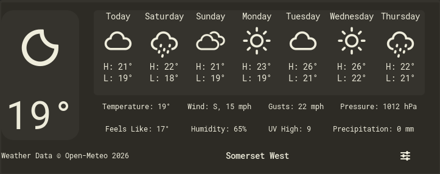

---
tags:
  - SimpleWeather
  - Changelog
  - v49.0.0 dev
  - SimpleWeather-development

authors:
  - Afridyne
  - "John Piers Cilliers <https://avatars.githubusercontent.com/u/1306639?s=400&v=4>"
  - SimpleWeather
  - "Roman Lefler <https://github.com/romanlefler/SimpleWeather/blob/development/AUTHORS>"

icon: material/weather-night
---

{:style="display: block; margin: 0 auto"}
<H1 style="text-align: center;"> Changelog</H1>

## v49.0.0 dev

!!! desc "v49.0.0 dev"

    ==v49.0.0 dev==
    
    ***`Features`***
    
    - Option to use packaged icons in panel
    - Option to use symbolic or realistic icons
    
    ---
    
    ***`Translations`***
    
    - Chinese (thanks JiaoxianDu)
    - Dutch (thanks koenraad-verv)
    - Japanese (thanks hidenosuke)
    - Russian (thanks Valetss)
    
## v48.2.0

!!! desc "v48.2.0"

    ==v48.2.0 dev==
    
    ***`Features`***
    
    - Option to show sun countdown instead of times in the pop-up
    - Sun countdown detail
    
    ---
    
    ***`Bug Fixes`***
    
    - Fix some of pop-up not being translated
    - Fix cardinal directions not being translated (thanks Davide Murtas)
    
    ---
    
    ***`Translations`***
    
    - Brazilian Portugese (thanks Alzemand)
    - Bulgarian (thanks Lyubomir Vasilev)
    - Chinese (thanks know-nothing-but-123)
    - French (thanks Samuel St. Jean, mdouchin, & Neo-29)
    - German (thanks Ahmet Ala)
    - Indonesian (thanks Fakhrul Rijal)
    - Italian (thanks Davide Murtas)
    - Turkish (thanks Ahmet Ala)
    
## v48.1.0

!!! desc "v48.1.0"
    
    ==v48.1.0 dev==
    
    ***`Features`***
    
    - Support for GNOME 46
    - Themes (choose between default, Light, Afterdark, and Immersive)
    - Label in panel can show any weather detail
    - Second available label in panel
    - Show or hide the condition icon in panel
    - Current weather details can be configured
    - Configure where panel is shown in top bar
    - Configure the location provider
    
    ---
    
    ***`Improvements`***
    
    - Change cloudy night icon to be more clear
    - Credits dialog in About
    - Use the word "Today" in the forecast
    - Weather data copyright always shows current year
    - Improve keyboard and mouse shortcuts in locations menus
    - Pop-up shows which city it thinks you're in when set to My Location
    - Better make script for packaging
    
    ---
    
    ***`Bug Fixes`***
    
    - Fix Mutter crash on some machines if Mutter couldn't find cursor when hovering the panel
    
    ---
    
    ***`Translations`***
    
    - German (Thanks Ahmet Ala)
    - Turkish (Thanks Ahmet Ala)
    
