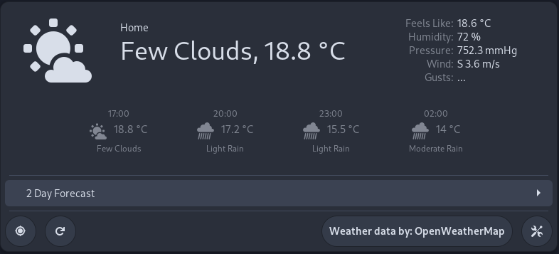

{: style="display: block; margin: 0 auto"}
<H1 style="text-align: center;"> Building</H1>


## Testing

!!! recommendation "Testing"
    Build extension and launch shell window for testing:
    
    ```shell
    ./nest-test.sh
    ```
    
## Build to Build Directory

!!! desc "Build to Build Directory"
    Build extension into `dist/build`:
    
    ```shell
    make
    ```
    
## Create Zip Archive
!!! desc "Create Zip Archive"
    Create zip archive of extension to `dist/simple-weather@romanlefler.com-vVERSION.zip`:
    
    ```shell
    make pack
    ```
    
## Install to User

!!! info "Install to User"
    Install the extension for this user:
    
    ```shell
    make install
    ```
    
## Clean Build Directory

!!! example "Clean Build Directory"
    Remove build files:
    
    ```shell
    make clean
    ```
    

