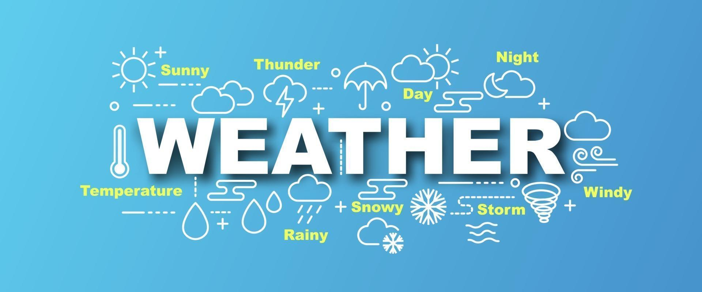
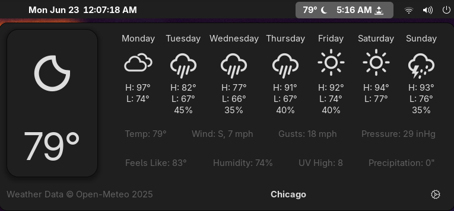
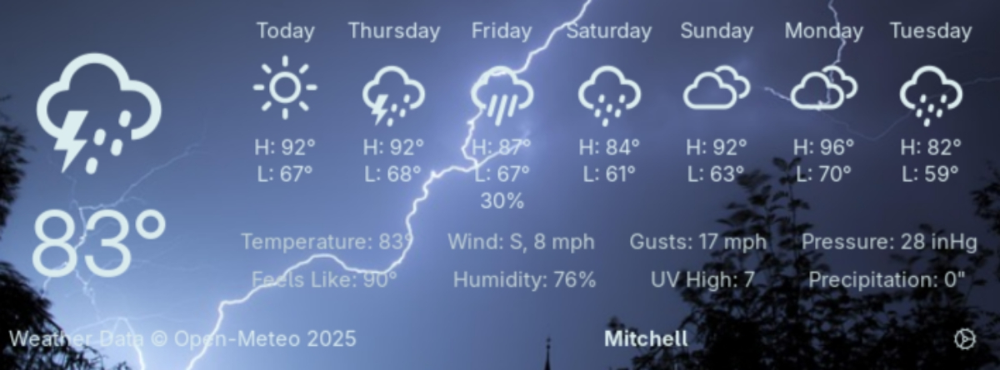

---
# This tells MkDocs to ignore the 'caption' features for this page
caption:
  figure:
    enable: false
  table:
    enable: false
  custom:
    enable: false

icon: material/weather-night
---

{ .center-image }

<H1 style="text-align: center;">SimpleWeather</H1>

<H3 style="text-align: center;">A highly configurable GNOME shell extension for viewing the weather.</H3>

{ .center-image }

Support for themes, the following screenshot uses the *Immersive* theme:

{ .center-image }

## Installation

---

## Features

- Display temperature and conditions in top bar.
- Configure units.
- Get current location or add any number of locations.

---

## Translations

Many translations have been auto-generated using CrowdIn. They are not of the required standard and in general, bad; Please create pull requests in order to fix these errors or you can help by adding missing translations.

Many languages or dialects also do not exist in the project.

Everybody is encouraged to make pull requests to add or fix translations.

---

## Building
*   [Building Documentation](SimpleWeather-development/docs/building.md)

---
## Contributing
*   Read about the [Authors](SimpleWeather-development/Authors.md)

Everybody is encouraged to make pull requests to contribute to the source code. If you plan to add a feature, it is a good idea to make an [issue](https://github.com/romanlefler/SimpleWeather/issues) first and label it as a feature request and add that you are willing to do it (and perhaps how).

---

# SimpleWeather Documentation
---
Welcome to the SimpleWeather documents section.
---
## Project Metadata
*   Read about the [Authors](SimpleWeather-development/Authors.md)
*   Review the [License](SimpleWeather-development/License.md)
*   See the [Changelog](SimpleWeather-development/Changelog.md)
---
## Technical Information
*   [Building Documentation](SimpleWeather-development/docs/building.md)
*   [Setup Guide](SimpleWeather-development/docs/setup.md)
*   [Source Documentation](SimpleWeather-development/docs/source.md)
*   [Theming Guide](SimpleWeather-development/docs/themes.md)
---

