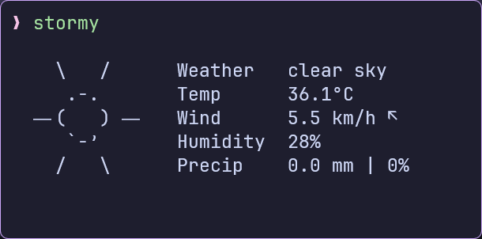
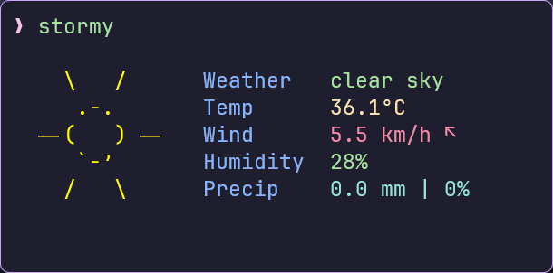
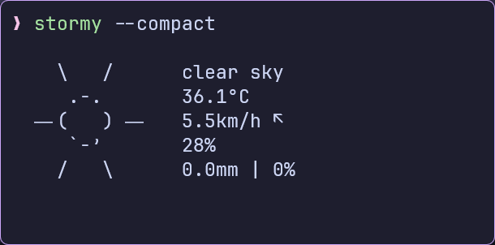
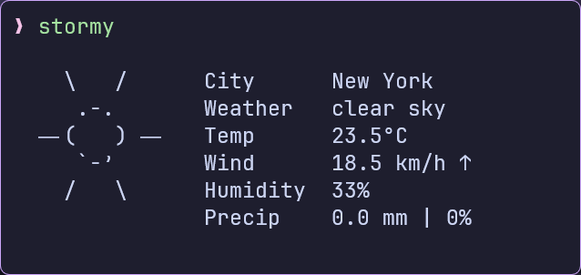
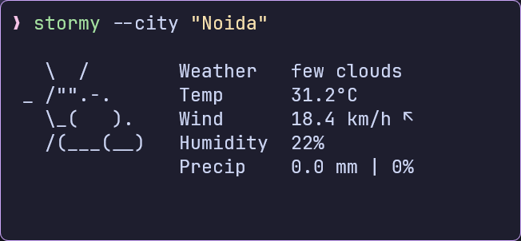
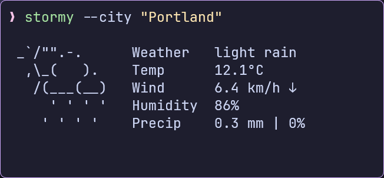
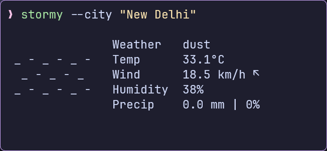

---
# This tells MkDocs to ignore the 'caption' features for this page
caption:
  figure:
    enable: true
  table:
    enable: false
  custom:
    enable: false

icon: material/weather-night
---
{: style="display: block; margin: 0 auto"}

<h1 align="center">Stormy</h1>

<p align="center">
Minimal, customizable and neofetch-like weather CLI inspired by
<a href="https://github.com/liveslol/rainy">rainy</a>, written in Go
</p>


!!! info "Stormy"
    <p style="text-align:center;">Minimal, customizable, and neofetch-like weather CLI inspired by [rainy](https://github.com/liveslol/rainy), written  in Go.</p>
     
    
    [{.reduced-image}](https://github.com/ashish0kumar/stormy/blob/main/README.md)
    
    [{.reduced-image}](https://terminaltrove.com/stormy/)

---

## Motivation

- Stormy’s idea, structure, and design are based off [rainy](https://github.com/liveslol/rainy), but it’s written in Go instead of Python.
- I built this because I really liked the concept of a Neofetch-style weather CLI.
- The simplicity and visual appeal of _rainy_ instantly clicked with me, and I wanted to recreate that experience in Go — Partly for my own satisfaction and partly because I enjoy building clean CLI tools.

## Features

- Multiple weather providers: OpenMeteo (default, no API key required) and OpenWeatherMap
- Current weather conditions with ASCII art representation
- Temperature, wind, humidity, and precipitation information
- Customizable units (metric, imperial, standard)
- Local configuration file
- Color support for terminals
- Compact display mode
- Works out of the box with OpenMeteo

## Installation

### Nix

#### One-time run

```bash
nix run github:ashish0kumar/stormy -- --city "London"
```

#### Permanent installation

```bash
nix profile install github:ashish0kumar/stormy#stormy
```

#### Add to your system configuration (using flakes)

```bash
# In your flake.nix
inputs.stormy.url = "github:ashish0kumar/stormy";

# In your system or home-manager configuration
environment.systemPackages = [ inputs.stormy.packages.x86_64-linux.stormy ];
```

### Via `go install`

```bash
go install github.com/ashish0kumar/stormy@latest
```

### Build from Source

```bash
# Clone the repository
git clone https://github.com/ashish0kumar/stormy.git
cd stormy

# Build the application
go build

# Move to a directory in your PATH
sudo mv stormy /usr/local/bin/
```

## Configuration

`stormy` follows the XDG Base Directory Specification for configuration files and will create a default configuration
file on first run:

- Linux/macOS: `~/.config/stormy/stormy.toml`
- Windows: `%APPDATA%\stormy\stormy.toml`
- Custom: Set `XDG_CONFIG_HOME` environment variable to override the default location

### Configuration Options

- `provider`: Weather data provider ("`OpenMeteo`" or "`OpenWeatherMap`"). Defaults to "`OpenMeteo`".
- `api_key`: Your OpenWeatherMap API key.
- `city`: The city for which to fetch weather data.
- `units`: Units for temperature and wind speed (`metric`, `imperial` or
  `standard`).
- `showcityname`: Whether to display the city name (`true` or `false`).
- `use_colors`: Enables and disables text colors (`true` or `false`).
- `live_mode`: Enables the "live" mode — long-running mode with frequent polling, never stops (`true` or `false`).
- `compact`: Use a more compact display format (`true` or `false`).

### Example Config

#### Default Configuration (OpenMeteo — No API Key Required)

```toml
provider = "OpenMeteo"
api_key = ""
city = "New Delhi"
units = "metric"
showcityname = false
use_colors = false
live_mode = false
compact = false
```

#### OpenWeatherMap Configuration (Requires an API key from [OpenWeatherMap](https://openweathermap.org/api))

```toml
provider = "OpenWeatherMap"
api_key = "your_openweathermap_api_key"
city = "New Delhi"
units = "metric"
showcityname = false
use_colors = false
live_mode = false
compact = false
```

## Usage

```bash
# Basic usage
stormy

# Specify city via command line
stormy --city "New York"

# Use imperial units
stormy --units imperial

# Use compact display mode
stormy --compact

# Show version
stormy --version

# Show help
stormy --help
```

## Display Examples

| Stormy Display Panels | Stormy Display Panels |
|----------------------------------|-------------------------------------|
|        |     |
|  |  |
|              |                 |
|              |                 |

## Acknowledgements

- [OpenWeatherMap](https://openweathermap.org/) and [Open-Meteo](https://open-meteo.com/) for providing weather data
- [rainy](https://github.com/liveslol/rainy) for the overall idea, structure, and
  design of the project
- [wttr.in](https://github.com/chubin/wttr.in?tab=readme-ov-file) for the ASCII
  weather icons
  
  <div class="admonition tip"> <p class="admonition-title">Tip</p> <p>Stormy is a CLI weather tool that fetches weather and prints colourful ASCII forecasts in your terminal in a neofetch-inspired format. If you don't have prior experience with Python, we recommend reading <a href="https://realpython.com/what-is-pip/">Using Python's pip to Manage Your Projects' Dependencies</a>, which is a really good introduction on the mechanics of Python package management and helps you troubleshoot if you run into errors.</p> </div>

## Contributing

Contributions are always welcome! If you have ideas, bug reports, or want to submit code, please feel free to open an issue or a pull request.

## Contributors

<a href="https://github.com/ashish0kumar/stormy/graphs/contributors">
  
</a>

<br><br>

<p align="center">
  
</p>

<p align="center">
  <i><code>&copy 2025-present <a href="https://github.com/ashish0kumar">Ashish Kumar</a></code></i>
</p>

<div align="center">
  <a href="https://github.com/ashish0kumar/stormy/blob/main/LICENSE"></a>&nbsp;&nbsp;
</div>

