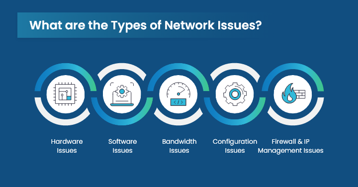

---
tags:
  - Arch Linux Suspend
  - Reyee Router Freeze
  - Troubleshooting
  - NetworkManager
  - Power Management

icon: material/router-network-wireless
---

<div style="display: none;"><h1>Header</h1></div>

{: style="display: block; margin: 0 auto"}

---

<H2 style="text-align: center;">  🛠️ Arch Linux Suspend & Reyee Router Freeze Troubleshooting</H2>

!!! deep-dive "Part 1: Environment & Symptoms"

    ## Part 1: Environment & Symptoms {.toc-hidden-header}
    
    A comprehensive technical summary documenting the investigation, diagnosis, and resolution of an intermittent network freeze occurring during system power state transitions.
    
---

!!! example "🔍 The Anatomy of the Bug"

    ### 🔍 The Anatomy of the Bug {.toc-hidden-header}
    
    ***Initial Problem Environment***
    ### Initial Problem Environment {.toc-hidden-header}
    
    *   **Host System:** Arch Linux x86_64 (Kernel: 7.1.6-zen1-1-zen)
    *   **Desktop Environment:** GNOME 50.4 running on Wayland (Mutter)
    *   **Target Interface:** enp9s0 (Wired Cat 5 Ethernet)
    *   **Network Infrastructure:** A Reyee EW1200G-PRO router (Firmware: ReyeeOS 1.219.1821) operating as a wireless bridge, connected physically to the host via a Cat 5 cable.
    
!!! desc "Symptoms & Failure Mode"

    ### Symptoms & Failure Mode {.toc-hidden-header}
    
    1.  The host PC is configured to "Automatic Suspend" after 2 hours of inactivity.
    2.  The suspend process behaves erratically, stalling frequently on a notify-send announcement ("Preparing to suspend").
    3.  Upon system wake-up, the network icon indicates "No Connection", and the network adapter enters an unmanaged state.
    4.  Concurrently, the Reyee router's physical LAN bridge software crashes. The router's hardware LED remains a deceptive solid blue, but all network traffic halts, requiring a hard power cycle of the routing hardware to recover.
    
---

!!! deep-dive "🔬 Part 2: Root Cause Analysis"

    ## 🔬 Part 2: Root Cause Analysis {.toc-hidden-header}
    
    The failure was determined to be a cascading layer-1 and layer-2 network loop freeze caused by flawed power-state handling within the Linux network stack:
    
    [GNOME Suspend Triggered] ↴
        ⇣
    [NetworkManager Tries to Sleep Interface] ↴
        ⇣
    [Internal Daemon Race Condition / Hangs for 25s] ↴
        ⇣
    [NIC Emits Fluctuating Voltages / EEE Garbage Data over Cat 5] ↴
        ⇣
    [Reyee Router Switch Bridge Flooded & Crashes Software Layer] ↴
    
    *   The OS Choke Point: During suspend, NetworkManager attempted to transition the network adapter into a low-power state. Due to driver constraints on the zen kernel, this triggered an internal daemon freeze, resulting in a 25-second timeout loop.
    
    *   The Router Impact: While NetworkManager stalled, the physical ethernet controller fluctuated voltages and sent malformed Energy-Efficient Ethernet (EEE) states down the Cat 5 cable. The Reyee router, processing this as a bridged wireless client, suffered a software panic on its localized switch port, locking up the entire routing engine.
    
---

!!! deep-dive "🛠️ Part 3: Remediation & Verification"

    ## 🛠️ Part 3: Remediation & Verification {.toc-hidden-header}
    
    🛠️ ***Step-by-Step Remediation Strategy***
    ### 🛠️ Step-by-Step Remediation Strategy {.toc-hidden-header}
    
    To resolve the issue, the network management logic was altered to bypass the stalled software stack and cut the physical hardware link instantly before the OS enters power management stages.
    
!!! desc "Step 1: Disabling Energy-Efficient Ethernet (EEE)"

    ### Step 1: Disabling Energy-Efficient Ethernet (EEE) {.toc-hidden-header}
    
    To prevent the network adapter from generating corrupt low-power signals that confuse the router's hardware switch, EEE was disabled on the active interface.
    
    ```bash
    # Explicitly disable EEE on the target network interface
    sudo ethtool --set-eee enp9s0 eee off
    ```
    
!!! desc "Step 2: Restricting NetworkManager Power Management"

    ### Step 2: Restricting NetworkManager Power Management {.toc-hidden-header}
    
    We updated the global NetworkManager configuration file to prevent the daemon from trying to auto-negotiate power transitions or Wake-on-LAN signatures on the ethernet hardware.
    
    The `/etc/NetworkManager/NetworkManager.conf` file was modified to contain the following strict parameters:
    
    ```ini
    # /etc/NetworkManager/NetworkManager.conf
    # Configuration file for NetworkManager.
    # See "man 5 NetworkManager.conf" for details.
    
    [device]
    wifi.scan-rand-mac-address=no
    
    [connection]
    
    ethernet.wake-on-lan=0
    ```
    
!!! desc "Step 3: Engineering the Immediate Hardware Disconnect Script"

    ### Step 3: Engineering the Immediate Hardware Disconnect Script {.toc-hidden-header}
    
    A custom systemd power management script was designed to step in *ahead* of the OS sleep cycle. Instead of relying on `nmcli` (which times out when NetworkManager hangs), the script executes a raw kernel command (`ip link set ... down`) to cut the physical connection instantly.
    
    The executable script was generated at `/usr/lib/systemd/system-sleep/disconnect-ethernet.sh`:
    
    ```bash
    #!/bin/sh
    case $1/$2 in
      pre/*)
        echo "Force killing physical link on enp9s0..."
        # Drop physical line power instantly to trigger a clean disconnect on the router
        ip link set enp9s0 down
        ;;
      post/*)
        echo "Force waking physical link on enp9s0..."
        # Re-engage link power and flush the NetworkManager daemon state
        ip link set enp9s0 up
        systemctl restart NetworkManager
        ;;
    esac
    ```
    
    The script was granted system privileges to run inside systemd environments:
    
    ```bash
    sudo chmod +x /usr/lib/systemd/system-sleep/disconnect-ethernet.sh
    ```
    
---

{ .center-image }


!!! decision "📊 Verification & System Health Check"

    ## 📊 Verification & System Health Check {.toc-hidden-header}
    
    Following a comprehensive service restart via `sudo systemctl restart NetworkManager`, the network stack successfully modernised its state handling:
    
    ```text
    ● NetworkManager.service - Network Manager
    
         Active: active (running) since Sun 2026-08-09 07:16:51 SAST; 1min 26s ago
         
         ... device (enp9s0): state change: ip-config -> ip-check (managed-type: 'assume')
         ... manager: NetworkManager state is now CONNECTED_GLOBAL
    ```
    
!!! version-added "Key Takeaways from Successful State Logs:"

    ### Key Takeaways from Successful State Logs: {.toc-hidden-header}
    
    *   **`managed-type: 'assume'`**: NetworkManager now picking up the pre-existing hardware link cleanly without cycling register power.
    
    *   **Router Isolation**: When sleep cycles hit, the router instantly experiences a clean "Link Down" status rather than 25 seconds of corrupt electrical noise. The router remains online, and the PC reconnects instantly upon waking.
    
{ .center-image }
