---
# This tells MkDocs to ignore the 'caption' features for this page
caption:
  figure:
    enable: false
  table:
    enable: false
  custom:
    enable: false


icon: octicons/markdown-16
---

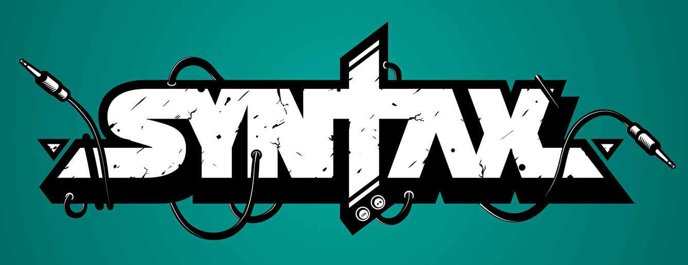{ .center-image }
<H1 style="text-align: center;">BasicSyntax</H1>

[ **uv**](https://github.com/astral-sh/uv)


[](https://github.com/astral-sh/uv)[](https://pypi.python.org/pypi/uv)[](https://pypi.python.org/pypi/uv)[](https://pypi.python.org/pypi/uv)[](https://github.com/astral-sh/uv/actions)[](https://discord.gg/astral-sh)

<p align="center">
An extremely fast Python package and project manager, written in Rust.
</p>

<p align="center">
  <picture align="center">
    <source media="(prefers-color-scheme: dark)" srcset="https://github.com/astral-sh/uv/assets/1309177/03aa9163-1c79-4a87-a31d-7a9311ed9310">
    <source media="(prefers-color-scheme: light)" srcset="https://github.com/astral-sh/uv/assets/1309177/629e59c0-9c6e-4013-9ad4-adb2bcf5080d">
    
  </picture>
</p>

<style>
  @media (prefers-color-scheme: dark) {
    picture img {
      filter: invert(1) hue-rotate(180deg);
    }
  }
</style>

<p align="center">
  <i>Installing <a href="https://trio.readthedocs.io/">Trio</a>'s dependencies with a warm cache.</i>
</p>
</div>

!!! example "uv Install"
    === "macOS and Linux"
        <pre><code>$ curl -LsSf https://astral.sh/uv/install.sh | sh</code></pre>

    === "Windows"
        <pre><code>PS> powershell -ExecutionPolicy ByPass -c "irm https://astral.sh/uv/install.ps1 | iex"</code></pre>
        


!!! note "Installation"
    Use the following command to install uv:
    ```bash
    python -m ensurepip && python -m pip install uv
    ```

!!! example "Website HEX codes."
    * I spent some time investigating and I believe any colors that follow the following HEX code will work: 
        * `#FF0099` - 255, 0, 153 - PinkPurple
        * `#FF9900` - 255, 153, 0 - OrangeYellow
        * `#99FF00` - 153, 255, 0 - Lime Green - **NOT GOOD**
        * `#9900FF` - 153, 0, 255 - PurpleViolet
        * `#0099FF` - 0, 153, 255 - BlueCyan
        * `#00FF99` - 0, 255, 153 - Sea Green - **NOT GOOD**

    ---

    * This pattern places all of these color codes on the Web Safe list of colors; I was unaware of that before I started investigating this. 
    
    * For a full list of all the web safe colors, check out the [Web Safe Colors Chart](https://websafecolors.info) and the [HTML Color Codes Chart](https://htmlcolorcodes.com).

    ---

    * This is the website I used to check the colors (icons, not text unfortunately) on both light and dark background: [Notion Icons Atlas](https://notionicons.so)
        * `#FF0099` - 255, 0, 153 - PinkPurple
        * `#FF9900` - 255, 153, 0 - OrangeYellow
        * `#66CC00` - 102, 204, 0 - GreenBlue
        * `#9900FF` - 153, 0, 255 - PurpleViolet
        * `#0099FF` - 0, 153, 255 - BlueCyan
        * `#00CC66` - 0, 204, 102 - BlueGreen

    !!! danger "Warning"
        Please be aware that the names I chose to describe the colours are not official names.
        
        Looking at the colours of the icons as you switch a theme from dark to light several times can create optical illusions in which the colours appear to be different on different themes.


<!-- Block 3 Container - WRAPPED -->
<div markdown="1">

<div class="isolated-table-container">
  <style>
    .isolated-table-container .wikitable {
      border-collapse: collapse;
      width: 100%;
      max-width: 800px;
      margin: 20px auto;
      border: 1px solid #ccc;
      font-size: 16px;
    }
    .isolated-table-container .wikitable th,
    .isolated-table-container .wikitable td {
      border: 1px solid #ccc;
      padding: 8px;
      text-align: left;
    }
    .isolated-table-container .wikitable th {
      background-color: #FFFFFF;
      font-weight: bold;
      color: #333333;
    }
    .isolated-table-container .wikitable a {
      color: #0064d2;
      text-decoration: underline;
    }
    @media (prefers-color-scheme: dark) {
      .isolated-table-container .wikitable {
        border-color: #F0F0F0;
      }
      .isolated-table-container .wikitable th,
      .isolated-table-container .wikitable td {
        border-color: #D0D0D0;
      }
      .isolated-table-container .wikitable th {
        background-color: #006C3B;
        color: #e0e0e0;
      }
      .isolated-table-container .wikitable a {
        color: #6BDDEA;
      }
      .isolated-table-container .wikitable td {
        color: #008B72;
      }
      .isolated-table-container .wikitable td.note a {
        color: #fff;
      }
    }
  </style>
  <table class="wikitable">
    <tbody>
      <tr>
        <th>Action</th>
        <th>Command</th>
        <th>Note</th>
      </tr>
      <tr>
        <th colspan="3">Analyzing JohnPC's System State</th>
      </tr>
      <tr>
        <td class="action"><b>Show system status</b></td>
        <td><code>systemctl status</code></td>
        <td></td>
      </tr>
      <tr>
        <td class="action"><b>List running</b> units</td>
        <td><code>systemctl</code> or<br><code>systemctl list-units</code></td>
        <td></td>
      </tr>
      <tr>
        <td class="action"><b>List failed</b> units</td>
        <td><code>systemctl --failed</code></td>
        <td></td>
      </tr>
      <tr>
        <td class="action"><b>List installed</b> unit files<sup>1</sup></td>
        <td><code>systemctl list-unit-files</code></td>
        <td></td>
      </tr>
      <tr>
        <td class="action"><b>Show process status</b> for a PID</td>
        <td><code>systemctl status <i>pid</i></code></td>
        <td><a href="https://wiki.archlinux.org/title/Cgroups" title="Cgroups">cgroup slice</a>, memory and parent</td>
      </tr>
      <tr>
        <th colspan="3">Checking the unit status</th>
      </tr>
      <tr>
        <td class="action"><b>Show a manual page</b> associated with a unit</td>
        <td><code>systemctl help <i>unit</i></code></td>
        <td>as supported by the unit</td>
      </tr>
      <tr>
        <td class="action"><b>Status</b> of a unit</td>
        <td><code>systemctl status <i>unit</i></code></td>
        <td>including whether it is running or not</td>
      </tr>
      <tr>
        <td class="action"><b>Check</b> whether a unit is enabled</td>
        <td><code>systemctl is-enabled <i>unit</i></code></td>
        <td></td>
      </tr>
      <tr>
        <th colspan="3">Starting, restarting, reloading a unit</th>
      </tr>
      <tr>
        <td class="action"><b>Start</b> a unit immediately</td>
        <td><code>systemctl start <i>unit</i></code> as root</td>
        <td></td>
      </tr>
      <tr>
        <td class="action"><b>Stop</b> a unit immediately</td>
        <td><code>systemctl stop <i>unit</i></code> as root</td>
        <td></td>
      </tr>
      <tr>
        <td class="action"><b>Restart</b> a unit</td>
        <td><code>systemctl restart <i>unit</i></code> as root</td>
        <td></td>
      </tr>
      <tr>
        <td class="action"><b>Reload</b> a unit and its configuration</td>
        <td><code>systemctl reload <i>unit</i></code> as root</td>
        <td></td>
      </tr>
      <tr>
        <td class="action"><b>Reload systemd manager</b> configuration<sup>2</sup></td>
        <td><code>systemctl daemon-reload</code> as root</td>
        <td>scan for new or changed units</td>
      </tr>
      <tr>
        <th colspan="3">Enabling a unit</th>
      </tr>
      <tr>
        <td class="action"><b>Enable</b> a unit to start automatically at boot</td>
        <td><code>systemctl enable <i>unit</i></code> as root</td>
        <td></td>
      </tr>
      <tr>
        <td class="action"><b>Enable</b> a unit to start automatically at boot and <b>start</b> it immediately</td>
        <td><code>systemctl enable --now <i>unit</i></code> as root</td>
        <td></td>
      </tr>
      <tr>
        <td class="action"><b>Disable</b> a unit to no longer start at boot</td>
        <td><code>systemctl disable <i>unit</i></code> as root</td>
        <td></td>
      </tr>
      <tr>
        <td class="action"><b>Reenable</b> a unit<sup>3</sup></td>
        <td><code>systemctl reenable <i>unit</i></code> as root</td>
        <td>i.e. disable and enable anew</td>
      </tr>
      <tr>
        <th colspan="3">Masking a unit</th>
      </tr>
      <tr>
        <td class="action"><b>Mask</b> a unit to make it impossible to start<sup>4</sup></td>
        <td><code>systemctl mask <i>unit</i></code> as root</td>
        <td></td>
      </tr>
      <tr>
        <td class="action"><b>Unmask</b> a unit</td>
        <td><code>systemctl unmask <i>unit</i></code> as root</td>
        <td></td>
      </tr>
    </tbody>
  </table>
</div>

</div>


~~~

blank line before
blank line after

~~~

1.  List item

    Not an indented code block, but a second paragraph
    in the list item

~~~~
This is a code block, fenced-style
~~~~

~~~~~~~~~~~~~~~~~~~~~~~~~~~~ {.html #example-1}
<p>paragraph <b>emphasis</b>
~~~~~~~~~~~~~~~~~~~~~~~~~~~~

Some markdown content here.

<div class="custom-class">
HTML content
</div>

!!! warning "Admonition after HTML"
    This should work with proper spacing.

<!-- md:option type:bug -->
!!! bug "Bug"

        Admonitions, also known as <em>call-outs</em>, are an excellent choice for including side content without significantly interrupting the document flow. Material for MkDocs provides several different types of admonitions and allows for the inclusion and nesting of arbitrary content.
        
<!-- md:option type:q -->
!!! quote "Quote"

    Admonitions, also known as <em>call-outs</em>, are an excellent choice for including side content without significantly
    interrupting the document flow. Material for MkDocs provides several different types of admonitions and allows for the inclusion and nesting of arbitrary content.


!!! pied-piper "Pied Piper"

    ``` markdown title="The last 3 special directories."


    NB: The last 3 special directories (last, week and month) which links repectively
    to the last synced repository, to the last Monday and to the first of the current month.
    ```


!!! bug "The Title"

    The content is correctly parsed because it's separated by blank lines
    from the raw HTML block tags.
    


!!! success "Installation"
    Use the following command to install uv:
    ```bash
    python -m ensurepip && python -m pip install uv
    ```

| Source | Name | Version | description |
| :--- | :--- | :--- | :--- |
| aur | dict-gcide | 0.53-4 | GNU version of the Collaborative International Dictionary of English for dictd et al. |
| aur | openide-bin | 243.26053.27.8-1 | OpenID is an open source software development tool for Java, Python, and other programming languages. |
| aur | friidump | [0.5.3.1-1 ](https://github.com/bradenmcd/friidump) | A program to dump Nintendo Wii and GameCube disc |
| aur | rsvndump | [0.6.2-1](https://aur.archlinux.org/packages?O=0&K=rsvndump) | Remote Subversion repository dump. |
| [aur](https://aur.archlinux.org/#) | aurvote-utils-git | [1.1.0.r7.g3e82548-1](https://aur.archlinux.org/packages?O=0&K=aurvote-utils-git) | A set of utilities for managing AUR votes |

!!! bug "Note."
    If the ESP is not mounted to `/boot`, make sure to not rely on the [systemd automount mechanism](https://wiki.archlinux.org/title/Fstab#Automount_with_systemd) (including that of [systemd-gpt-auto-generator](https://wiki.archlinux.org/title/Systemd#GPT_partition_automounting)) during kernel upgrades. Always mount it manually prior to any system or kernel update, otherwise you may not be able to mount it after the update, locking you in the currently running kernel with no ability to update the copy of kernel on the ESP.

    Alternatively [preload the required kernel modules on boot](https://wiki.archlinux.org/title/Kernel_module#systemd), e.g.:

    ```
    /etc/modules-load.d/vfat.conf
    vfat nls_cp437 nls_ascii
    ```

!!! settings "Install Mercurial"
    === "Debian/Ubuntu"
        ```bash
        apt install mercurial
        ```

    === "Fedora"
        ```bash
        dnf install mercurial
        ```

    === "Arch Linux"
        ```bash
        pacman -S mercurial
        ```

    === "Gentoo"
        ```bash
        emerge mercurial
        ```

    === "macOS (Homebrew)"
        ```bash
        brew install mercurial
        ```

    === "FreeBSD"
        Binary packages can be installed using `pkg`:

        ```bash
        pkg install mercurial
        ```

        Alternatively, you can install from source via the ports collection:

        ```bash
        cd /usr/ports/devel/mercurial
        make install
        ```

    === "Windows (Mercurial)"
        Using the `winget` package manager:

        ```bash
        winget install Mercurial.Mercurial -e
        ```

        Or download from the list of [binary releases](https://www.mercurial-scm.org).

    === "Windows (TortoiseHg)"
        Using the `winget` package manager:

        ```bash
        winget install TortoiseHg.TortoiseHg -e
        ```

        Or download from the list of [binary releases](https://mercurial-book.readthedocs.io/en/latest/working-together/collab.html?highlight=windows+tortoisehg).


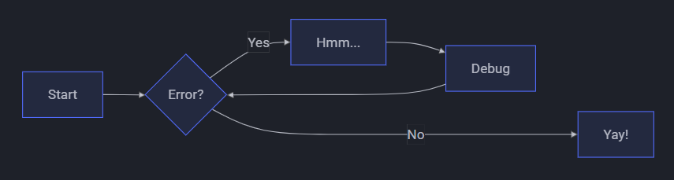

---


---

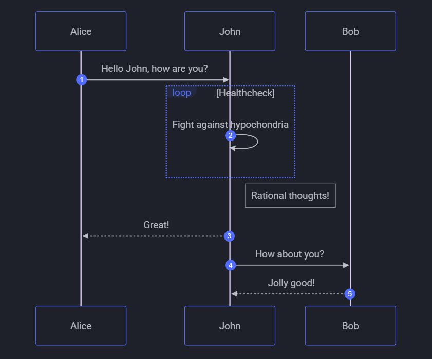

---

:octicons-heart-fill-24:{ .heart }

:fontawesome-brands-youtube:{ .youtube }

⟶ *Detailed article: [Images in terminal](terminal-images.md)*

| Terminal              | Environment    | Images support | Protocol |
| --------------------- | --------- | ------------- | --------- |
| uxterm                |   X11     |   yes         |   Sixel   |
| mlterm                |   X11     |   yes         |   Sixel   |
| kitty                 |   X11     |   yes         |   Kitty   |
| wezterm               |   X11     |   yes         |   IIP     |
| Darktile              |   X11     |   yes         |   Sixel   |
| Jexer                 |   X11     |   yes         |   Sixel   |
| GNOME Terminal        |   X11     |   [in-progress](https://gitlab.gnome.org/GNOME/vte/-/issues/253) |   Sixel   |
| alacritty             |   X11     |   [in-progress](https://github.com/alacritty/alacritty/issues/910) |  Sixel   |
| foot                  |  Wayland  |   yes         |   Sixel   |
| DomTerm               |   Web     |   yes         |   Sixel   |
| Yaft                  |   FB      |   yes         |   Sixel   |
| iTerm2                |   Mac OS X|   yes         |   IIP     |
| mintty                | Windows   |   yes         |   Sixel   |
| Windows Terminal  |   Windows     |   [in-progress](https://github.com/microsoft/terminal/issues/448) |   Sixel   |
| [RLogin](http://nanno.dip.jp/softlib/man/rlogin/) | Windows | yes         |   Sixel   |   |


## Internationalization and localization

wttr.in supports multilingual locations names that can be specified in any language in the world
(it may be surprising, but many locations in the world don't have an English name).

The query string should be specified in Unicode (hex-encoded or not). Spaces in the query string
must be replaced with `+`:

    $ curl wttr.in/станция+Восток
    Weather report: станция Восток

                   Overcast
          .--.     -65 – -47 °C
       .-(    ).   ↑ 23 km/h
      (___.__)__)  15 km
                   0.0 mm

The language used for the output (except the location name) does not depend on the input language and it is either English (by default) or the preferred language of the browser (if the query was issued from a browser) that is specified in the query headers (`Accept-Language`).


## wttr.in usage stats

As of the end of August 2025, *wttr.in* handles 22-27 million queries per day from 170,000 to 190,000 users, according to the access logs.

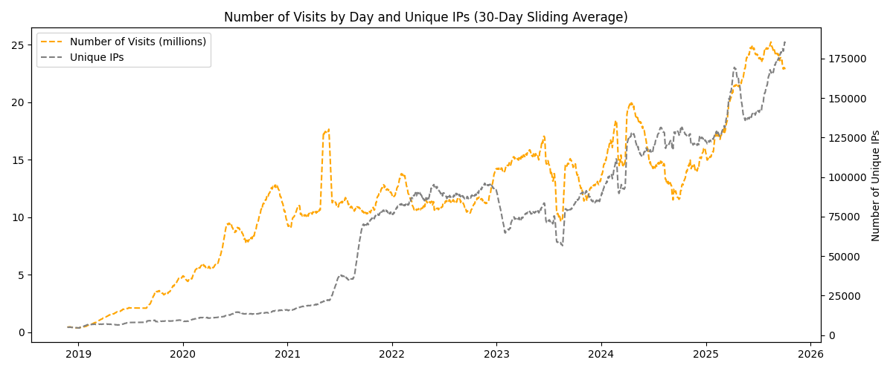


| Name | License | Website | Description |
|:-----|:-------:|:-------:|:------------|
| [Max](https://wiki.hydrogenaudio.org/index.php?title=Max) | GPL | [here](https://max.macupdate.com/) | A secure ripper for OS X that uses additional cdparanoia functionality |
| [XLD](https://wiki.hydrogenaudio.org/index.php?title=XLD) | GPL | [here](https://x-lossless-decoder.macupdate.com/) | X Lossless Decoder(XLD) is a tool for Mac OS X that is able to decode/convert/play various 'lossless' audio files. The supported audio files can be split into some tracks with cue sheet when decoding. Can convert between many lossless and lossy formats. Plugin oriented design, for easy exchange for new encoders. |

| Name | License | Website | Description |
|:-----|:-------:|:-------:|:------------|
| CUERipper | GPL | [here](http://cue.tools/wiki/CUERipper) | A secure ripper for Windows that includes Accurate Stream functionality. [Forum](https://hydrogenaud.io/index.php/board,74.0.html) |
| [dBpoweramp](https://wiki.hydrogenaudio.org/index.php?title=DBpoweramp) | commercial | [here](http://www.dbpoweramp.com/) | A secure ripper for Windows that includes Accurate Stream functionality. |
| [EAC](https://wiki.hydrogenaudio.org/index.php?title=Exact_Audio_Copy) | Free | [here](http://www.exactaudiocopy.de/) | A secure ripper for Windows, C2 error pointers, Accurate Stream, etc. |
| [fre:ac](https://wiki.hydrogenaudio.org/index.php?title=Fre:ac) | GPL | [here](http://www.freac.org/) | fre:ac is a free audio converter and CD ripper with support for various popular formats and encoders. Plus supports the CDDB/freedb online CD database which allows you query song information. |

| name | license | website | description |
|:-----|:-------:|:-------:|:------------|
| abcde | gpl | [here](https://abcde.einval.com/wiki/) | a command-line based ripper with cdparanoia functionality |
| [cdparanoia](https://wiki.hydrogenaudio.org/index.php?title=Cdparanoia) | bsd, gpl | [here](https://xiph.org/paranoia/) | one of the first secure standalone rippers for the linux platform |
| grip | gpl | [here](https://sourceforge.net/projects/grip/) | an open-source gnome interface ripper that uses cdparanoia functionality |
| [Rubyripper](https://wiki.hydrogenaudio.org/index.php?title=Rubyripper) | gpl | [here](https://github.com/bleskodev/rubyripper) | a secure ripper for linux that uses additional cdparanoia functionality |
| [Whipper](https://wiki.hydrogenaudio.org/index.php?title=Whipper) | gpl | [here](https://github.com/whipper-team/whipper) | a secure ripper for the linux command-line built on cdparanoia |

!!! info "Molecule"

    Molecule will remove any options matching '^[v]+$', and pass ``-vvv`` to the underlying ``ansible-galaxy`` command when executing `molecule --debug`.
    
    ```yaml
    dependency:
      name: galaxy
      options:
        ignore-certs: True
        ignore-errors: True
        role-file: requirements.yml
        requirements-file: collections.yml
    ```
    
---
$$
E(\mathbf{v}, \mathbf{h}) = -\sum_{i,j}w_{ij}v_i h_j - \sum_i b_i v_i - \sum_j c_j h_j
$$

\[3 < 4\]

\begin{align}
    p(v_i=1|\mathbf{h}) & = \sigma\left(\sum_j w_{ij}h_j + b_i\right) \\
    p(h_j=1|\mathbf{v}) & = \sigma\left(\sum_i w_{ij}v_i + c_j\right)
\end{align}


$p(x|y) = \frac{p(y|x)p(x)}{p(y)}$, \(p(x|y) = \frac{p(y|x)p(x)}{p(y)}\).


```math
\begin{align}
    p(v_i=1|\mathbf{h}) & = \sigma\left(\sum_j w_{ij}h_j + b_i\right) \\
    p(h_j=1|\mathbf{v}) & = \sigma\left(\sum_i w_{ij}v_i + c_j\right)
\end{align}
```

\begin{align}
    p(v_i=1|\mathbf{h}) & = \sigma\left(\sum_j w_{ij}h_j + b_i\right) \\
    p(h_j=1|\mathbf{v}) & = \sigma\left(\sum_i w_{ij}v_i + c_j\right)
\end{align}


`Lorem ipsum dolor sit amet`

:   Sed sagittis eleifend rutrum. Donec vitae suscipit est. Nullam tempus
    tellus non sem sollicitudin, quis rutrum leo facilisis.

`Cras arcu libero`

:   Aliquam metus eros, pretium sed nulla venenatis, faucibus auctor ex. Proin
    ut eros sed sapien ullamcorper consequat. Nunc ligula ante.

    Duis mollis est eget nibh volutpat, fermentum aliquet dui mollis.
    Nam vulputate tincidunt fringilla.
    Nullam dignissim ultrices urna non auctor.
    
    - [x] Lorem ipsum dolor sit amet, consectetur adipiscing elit
- [ ] Vestibulum convallis sit amet nisi a tincidunt
    * [x] In hac habitasse platea dictumst
    * [x] In scelerisque nibh non dolor mollis congue sed et metus
    * [ ] Praesent sed risus massa
- [ ] Aenean pretium efficitur erat, donec pharetra, ligula non scelerisque

\begin{align}
    p(v_i=1|\mathbf{h}) & = \sigma\left(\sum_j w_{ij}h_j + b_i\right) \\
    p(h_j=1|\mathbf{v}) & = \sigma\left(\sum_i w_{ij}v_i + c_j\right)
\end{align}


\begin{align}
\int_{-\infty}^{\infty} e^{-x^2} dx = \sqrt{\pi}
\end{align}

\[
\int_{-\infty}^{\infty} e^{-x^2} dx = \sqrt{\pi}
\]

$$x = \frac{-b \pm \sqrt{b^{2}-4ac}}{2a}$$

\[
\begin{pmatrix} a & b \\ c & d \end{pmatrix} \begin{pmatrix} x \\ y \end{pmatrix} = \begin{pmatrix} ax+by \\ cx+dy \end{pmatrix}
\]

$$i\hbar\frac{\partial}{\partial t}\Psi = \left[-\frac{\hbar^2}{2m}\nabla^2+V\right]\Psi$$

\[
\begin{pmatrix} a & b \\ c & d \end{pmatrix} \begin{pmatrix} x \\ y \end{pmatrix} = \begin{pmatrix} ax+by \\ cx+dy \end{pmatrix}
\]
---

The mathematical expression of the Second Law of Thermodynamics is often presented in terms of the change in entropy (\(\Delta S\)) for an isolated system or the universe. Here are examples of the MathJax code for common formulations of the Second Law: General Statement (Entropy of the Universe) The most common and general mathematical statement is that the total entropy of an isolated system (the universe) can never decrease. 

MathJax Code (inline):
Renders as: $\Delta S_{\text{univ}} \ge 0$ 

---

$$\Delta S_{\text{total}} = \Delta S_{\text{sys}} + \Delta S_{\text{surr}} \geq 0$$

---

For a System and its Surroundings:
The total entropy change is the sum of the changes in the system and the surroundings, which must be greater than or equal to zero. 

MathJax Code (display mode):
Renders as:  $$\Delta S_{\text{total}} = \Delta S_{\text{sys}} + \Delta S_{\text{surr}} \ge 0$$
---
For any process, the change in entropy of a system is greater than or equal to the heat transfer (\(Q\)) divided by the absolute temperature (\(T\)). The equality holds for reversible processes, and the inequality for irreversible (real spontaneous) processes. 

MathJax Code (inline)
Renders as: $dS \ge \frac{\delta Q}{T}$
---
```math
\begin{align}
    p(v_i=1|\mathbf{h}) & = \sigma\left(\sum_j w_{ij}h_j + b_i\right) \\
    p(h_j=1|\mathbf{v}) & = \sigma\left(\sum_i w_{ij}v_i + c_j\right)
\end{align}
```

!!! info "Molecule"

    Molecule will remove any options matching '^[v]+$', and pass ``-vvv`` to the underlying ``ansible-galaxy`` command when executing `molecule --debug`.
    
    ```yaml
    dependency:
      name: galaxy
      options:
        ignore-certs: True
        ignore-errors: True
        role-file: requirements.yml
        requirements-file: collections.yml
    ```
    
!!! info "Molecule"

    Molecule will remove any options matching '^[v]+$', and pass ``-vvv`` to the underlying ``ansible-galaxy`` command when executing `molecule --debug`.
    
    ```yaml
    dependency:
      name: galaxy
      options:
        ignore-certs: True
        ignore-errors: True
        role-file: requirements.yml
        requirements-file: collections.yml
    ```
    
| name | license | website | description |
|:-----|:-------:|:-------:|:------------|
| abcde | gpl | [here](https://abcde.einval.com/wiki/) | a command-line based ripper with cdparanoia functionality |
| [cdparanoia](https://wiki.hydrogenaudio.org/index.php?title=Cdparanoia) | bsd, gpl | [here](https://xiph.org/paranoia/) | one of the first secure standalone rippers for the linux platform |
| grip | gpl | [here](https://sourceforge.net/projects/grip/) | an open-source gnome interface ripper that uses cdparanoia functionality |
| [Rubyripper](https://wiki.hydrogenaudio.org/index.php?title=Rubyripper) | gpl | [here](https://github.com/bleskodev/rubyripper) | a secure ripper for linux that uses additional cdparanoia functionality |
| [Whipper](https://wiki.hydrogenaudio.org/index.php?title=Whipper) | gpl | [here](https://github.com/whipper-team/whipper) | a secure ripper for the linux command-line built on cdparanoia |


When $a \ne 0$, there are two solutions to $(ax^2 + bx + c = 0)$ and they are

$$ x = {-b \pm \sqrt{b^2-4ac} \over 2a} $$

This sentence uses `$` delimiters to show math inline: $\sqrt{3x-1}+(1+x)^2$

**The Cauchy-Schwarz Inequality**

$$\left( \sum_{k=1}^n a_k b_k \right)^2 \leq \left( \sum_{k=1}^n a_k^2 \right) \left( \sum_{k=1}^n b_k^2 \right)$$

---

$\sqrt{\$4}$

$$\sqrt{\$4}$$

\[
\sqrt{\$4}
\]

---

When $a \ne 0$, there are two solutions to $(ax^2 + bx + c = 0)$ and they are:  $\ x = {-b \pm \sqrt{b^2-4ac} \over 2a}$

\[
\sum_{x=0}^n f(x)
\]


$$\sum_{x=0}^n f(x)$$

$$
\cos x=\sum_{k=0}^{\infty}\frac{(-1)^k}{(2k)!}x^{2k}
$$

---

$$
E(\mathbf{v}, \mathbf{h}) = -\sum_{i,j}w_{ij}v_i h_j - \sum_i b_i v_i - \sum_j c_j h_j
$$

\[3 < 4\]

\begin{align}
    p(v_i=1|\mathbf{h}) & = \sigma\left(\sum_j w_{ij}h_j + b_i\right) \\
    p(h_j=1|\mathbf{v}) & = \sigma\left(\sum_i w_{ij}v_i + c_j\right)
\end{align}

!!! info "Auto-generated code"
    This repository is **auto-generated** from the Immich OpenAPI specification.
    Pull requests are welcome, but modifications to auto-generated code will be rejected. See [Contributing](MkDocs-Material/contributing.md) for more details.

!!! info "Auto-synced with Immich"
    This project is [auto-synced](MkDocs-Material/auto-sync.md) with the **latest Immich release**.

!!! info "Not affiliated with Immich"
    This project is not affiliated with or endorsed by Immich.
    

---

Everybody should know Euler's formula: $e^{ \pm i\theta } = \cos \theta \pm i\sin \theta$ 

These are Euler's most famous equations:

$$
\begin{aligned}
e^{ \pm i\theta } & = \cos \theta \pm i\sin \theta    \\
e^{i \pi} & = -1
\end{aligned}
$$

### Table 2. Orbital Elements of S2 and S4716

| Source | a (mpc) | e | i (deg) | ω (deg) | Ω (deg) | t_closest (yr) |
| :--- | :--- | :--- | :--- | :--- | :--- | :--- |
| S2 | 5.09 ± 0.01 | 0.886 ± 0.002 | 133.49 ± 0.40 | 65.89 ± 0.75 | 227.46 ± 1.03 | 2018.37 ± 0.02 |
| S4716 (estimated) | 1.93 ± 0.02 | 0.756 ± 0.02 | 161.24 ± 2.80 | 0.073 ± 0.02 | 151.54 ± 1.54 | 2017.41 ± 0.004 |
| S4716 (max. likelihood) | 1.94 ± 0.02 | 0.756 ± 0.02 | 161.13 ± 2.80 | 2.25 ± 0.02 | 153.55 ± 1.54 | 2017.41 ± 0.004 |

**Note.** The estimated values for S4716 are based on a Keplerian fit model, while the maximum likelihood stems from the MCMC simulation. See Appendix B for a discussion of these values.


<style>
  /* Force the table to fit the page width exactly */
  .md-typeset table {
    width: 100%;
    display: table;
    table-layout: fixed; /* This is the magic: it forces columns to obey set widths */
  }

  /* Specific column widths */
  /* Column 1 (Source) - let it take the most space */
  .md-typeset td:nth-child(1) { width: 25%; }
  
  /* Column 3 (e) - force it to be very narrow */
  .md-typeset td:nth-child(3) { width: 10%; }
</style>

### Table 2. Orbital Elements of S2 and S4716

| Source | a (mpc) | e | i (deg) | ω (deg) | Ω (deg) | t_closest (yr) |
| :--- | :---: | :---: | :---: | :---: | :---: | :---: |
| S2 | 5.09 ± 0.01 | 0.886 ± 0.002 | 133.49 ± 0.40 | 65.89 ± 0.75 | 227.46 ± 1.03 | 2018.37 ± 0.02 |
| S4716 (est) | 1.93 ± 0.02 | 0.756 ± 0.02 | 161.24 ± 2.80 | 0.073 ± 0.02 | 151.54 ± 1.54 | 2017.41 ± 0.004 |
| S4716 (ML) | 1.94 ± 0.02 | 0.756 ± 0.02 | 161.13 ± 2.80 | 2.25 ± 0.02 | 153.55 ± 1.54 | 2017.41 ± 0.004 |

**Note.** The estimated values for S4716 are based on a Keplerian fit model, while the maximum likelihood stems from the MCMC simulation. See Appendix B for a discussion of these values.

---

#### Summary Guide for your "Related Pages" link system.

- Here is the Complete Summary Guide for your "Related Pages" link system.
- You can copy and save this as a local text file.

---

##### Part 1: Folder Structure & Config
- Ensure your project directory looks like this:

!!! tip "Folder Structure."

    ```bash
    my-project/
    ├── mkdocs.yml
    ├── docs/
    │  ├── UV.md
    │  └── UV_Style/
    │     └── STYLE.md
    └── overrides/
       └── main.html
    ```
    
!!! info ""
    In your mkdocs.yml, add the custom_dir setting to the theme:
    
    ```bash {.no-copy}
    theme:
      name: material
      custom_dir: overrides
    ```
    
##### Part 2: The Logic Template (overrides/main.html)

Create this file and paste the code below. This handles two scenarios:

 1. Manual: You specify a link in a specific file.

 2. Automatic: Any file in the MkDocs-Material/ folder automatically gets a link back to its main page.


html

???+ info "html for Site Logic Summary"

    #### Site Logic Summary
    To create your `overrides/main.html` file, copy the code block below:

    ```html
    

    
      {# 1. Check for manual links in page metadata #}
      
        <p>
          <strong>Related:</strong> 
          <a href="{{ page.meta.related_link | url }}">{{ page.meta.related_title | default('Click here') }}</a>
        </p>
        <hr>

      {# 2. Auto-link for the MkDocs-Material folder #}
      
        <p>
          <strong>Return to:</strong> 
          <a href="{{ 'MkDocs-Material/setting-up-tags.md' | url }}">Main Setup Guide</a>
        </p>
        <hr>

      {# 3. Auto-link for the Arch_OS_Docs folder #}
      
        <p>
          <strong>Return to:</strong> 
          <a href="{{ 'DOCS.md' | url }}">Main Arch OS Index</a>
        </p>
        <hr>

      {# 4. Auto-link for the UV_Style folder #}
      
        <p>
          <strong>Return to:</strong> 
          <a href="{{ 'UV.md' | url }}">Main UV Documentation</a>
        </p>
        <hr>

      

      {{ super() }}
    
    ```

##### Part 3: How to Use in Your Markdown Files

!!! info "Method A: For Unique Pages"

    Method A: For Unique Pages (e.g., UV and Style)
    
    - Add this "Front Matter" (the YAML block) to the very top of your .md files.
    
    - In docs/UV.md:
    
    ```yaml
    ---
    related_link: UV_Style/STYLE.md
    related_title: "View UV Style Guide"
    ---
    ```
    
    UV Main Page
    
    
    - In docs/UV_Style/STYLE.md:
    
    ```yaml
    ---
    related_link: UV.md
    related_title: "Return to UV Main"
    ---
    ```
    
    Style Guide
    

!!! info "Method B: For Bulk Folders (e.g., MkDocs-Material)"

    Method B: For Bulk Folders (e.g., MkDocs-Material)
    
    You don't have to do anything. Because of the code in Part 2 (Scenario 2), every page inside the MkDocs-Material/ folder will automatically display a "Return to Main Setup Guide" link at the top, except for the main guide page itself.
    
    Troubleshooting Tips:
    
    The "not_in_nav" pages:
    
    These pages will still show the link box! As long as the file exists in the folder, the template will find it and display the link.
    
    Paths: If a link doesn't work, try using the path relative to the docs/ folder (e.g., Folder/Subfolder/file.md).
    
    Icons: If the icons don't show up, make sure you have python-markdown extensions enabled in your mkdocs.yml, specifically pymdownx.emoji.
    
    Would you like me to generate a similar "Bulk Rule" for any other folders you have (like "Arch OS Docs") before you go?
    

##### Summary of how to add more Bulk Rules later:


!!! info "Bulk Folder More Than One .md File"

    - If you find another folder (e.g., Networking/) and want all 20 pages in it to link back to Networking_Home.md, just add another  block before the final :
    
    
    ```bash {.no-copy}
    1. Check the path: "Folder_Name/" in page.file.src_uri
    2. Exclude the main page: and page.file.src_uri != "Folder_Name/Main_Page.md"
       (This prevents the link from appearing on the main page itself).
    3. Set the link: <a href="{{ 'Path/to/Main.md' | url }}">
    ```
    
    - Quick Checklist for your local setup:
    
    ```bash {.no-copy}
    1. mkdocs.yml: Ensure custom_dir: overrides is present.
    2. overrides/main.html: Paste the code above.
    3. Icons: If icons don't show, ensure you have this in your mkdocs.yml under markdown_extensions:
    ```
    

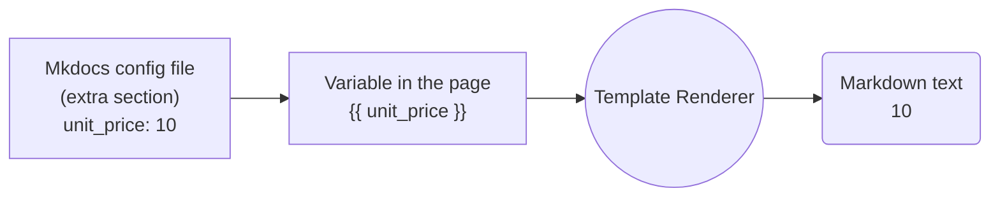


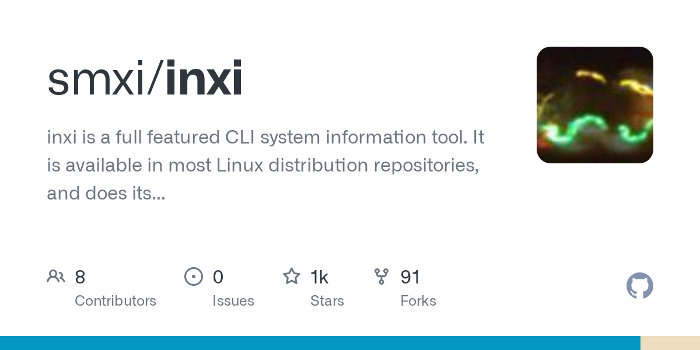{ .center-image }

## smxi/<b>inxi</b>

!!! danger "Home Page"
    
    Home Page :: [inxi](https://codeberg.org/smxi/inxi) [smxi](https://codeberg.org/smxi/smxi) [sgfxi](https://codeberg.org/smxi/sgfxi) [svmi](https://codeberg.org/smxi/svmi) [rbxi](https://codeberg.org/smxi/rbxi)
    
[smxi](https://smxi.org/)

Winner of the [Distrowatch.com March 2009](http://distrowatch.com/weekly.php?issue=20090406#donation) award donation.

Welcome to the smxi/sgfxi/svmi + inxi + rbxi group of tools main site. Documentation is being updated and improved routinely, so check out the various sections and see if what you needed to know has been answered already.

[Donations](https://smxi.org/site/donations.htm) are always welcome! The smallest amount is still more than nothing.

##### Script Documentation Resources

!!! info ""

    There are a range of help and end user resources available, as well as more developer oriented materials.
    
    ---
    
    **You can find them here:**
    
    1 - General [documentation](https://smxi.org/docs/) (manuals, options, how-to's).
    2 - [Inxi Docs.](https://smxi.org/docs/inxi.htm) (manuals, options, how-to's).
    3 - [About-tools.](https://smxi.org/site/about.htm) A  brief introduction to what smxi, sgfxi, svmi, inxi, and rbxi do.
    4 - [The smxi-story.](https://smxi.org/site/smxi-story.htm) The story of smxi. How it started, what it does, and its current options.
    5 - [Install-tools.](https://smxi.org/site/install.htm) How to install tools (smxi, sgfxi, svmi, inxi, and rbxi).
    6 - [FAQs](https://smxi.org/site/faqs.htm) FAQs. Answers to questions about the tools in general.
    7 - [FAQs-smxi](https://smxi.org/site/faqs-smxi.htm) smxi FAQs. Smxi specific questions.
    8 - [FAQs-sgfxi](https://smxi.org/site/faqs-sgfxi.htm) sgfxi FAQs. Sgfxi specific questions (video drivers etc).
    9 - [smxi-change-blog](https://smxi.org/site/changeblog.htm) smxi change log/blog. Random thoughts and change notes, nothing exciting.
    
##### Script Forums and Contact Resources  

!!! pied-piper ""

    The tools have support forums, which I encourage you to use to file bug reports, feature requests, and so on. Also note the changeblog, which is sometimes up-to date.
    
    ---
    
    Please use the existing bug report or feature requests threads to report issues for the tool in question. That helps keep the forums reasonably uncluttered and readable for other users. Thanks.
    
    ---
    
    1 - [user-forums](http://techpatterns.com/forums/forum-33.html), where you can post bugs, issues, questions.
    2 - [Dev-forums](http://techpatterns.com/forums/forum-32.html), talk about code and other more dev oriented things.
    3 - [Contact project.](https://smxi.org/site/contact.php) But generally use forums, IRC, or git repo issues.
    4 - Follow on [fosstodon.org/@smxi](https://fosstodon.org/@smxi) (nope, not on twitter, never).
    
##### Code Repositories  

!!! warning "Code Repositories"

    The tools all have their own code repositories, where you can check out the code (and see if you can figure out how it all works), file issues, or checkout documentation.
    
    ---
    
    Here's what's available:
    
    ---
    
    <div class="grid cards" markdown>
    
    1. [smxi](https://codeberg.org/smxi/smxi)
    2. [sgfxi](https://codeberg.org/smxi/sgfxi)
    3. [svmi](https://codeberg.org/smxi/svmi)
    4. [rbxi](https://codeberg.org/smxi/rbxi)
    5. [inxi](https://codeberg.org/smxi/inxi)
    6. [pinxi](https://codeberg.org/smxi/pinxi)
    7. [acxi](https://codeberg.org/smxi/acxi)
    
    
    </div>
    

!!! warning "Code Repositories"

    The tools all have their own code repositories, where you can check out the code (and see if you can figure out how it all works), file issues, or checkout documentation.
    
    ---
    
    Here's what's available:
    
    ---
    
    <div class="grid cards" markdown>
    
    -   :simple-codeberg:&nbsp; **[1. smxi](https://codeberg.org/smxi/smxi)** — _Check out the main tool code, file issues, or read the docs._
    -   :simple-codeberg:&nbsp; **[2. sgfxi](https://codeberg.org/smxi/sgfxi)** — _Graphics driver installer for Debian and Ubuntu based systems._
    -   :simple-codeberg:&nbsp; **[3. svmi](https://codeberg.org/smxi/svmi)** — _VirtualBox helper script for managing VM installations._
    -   :simple-codeberg:&nbsp; **[4. rbxi](https://codeberg.org/smxi/rbxi)** — _A specialized tool for managing Ruby-on-Rails environments._
    -   :simple-codeberg:&nbsp; **[5. inxi](https://codeberg.org/smxi/inxi)** — _The classic full-featured CLI system information tool._
    -   :simple-codeberg:&nbsp; **[6. pinxi](https://codeberg.org/smxi/pinxi)** — _The development (preview) version of the inxi system tool._
    -   :simple-codeberg:&nbsp; **[7. acxi](https://codeberg.org/smxi/acxi)** — _Audio convert script for FLAC, MP3, OGG and more._
    
    </div>

---


---

##### Test 2 Mermaid Flow Chart

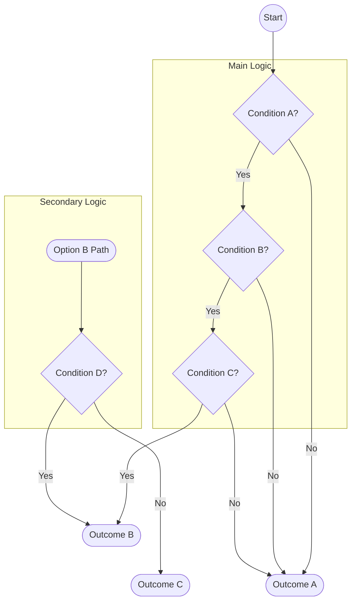

---


---


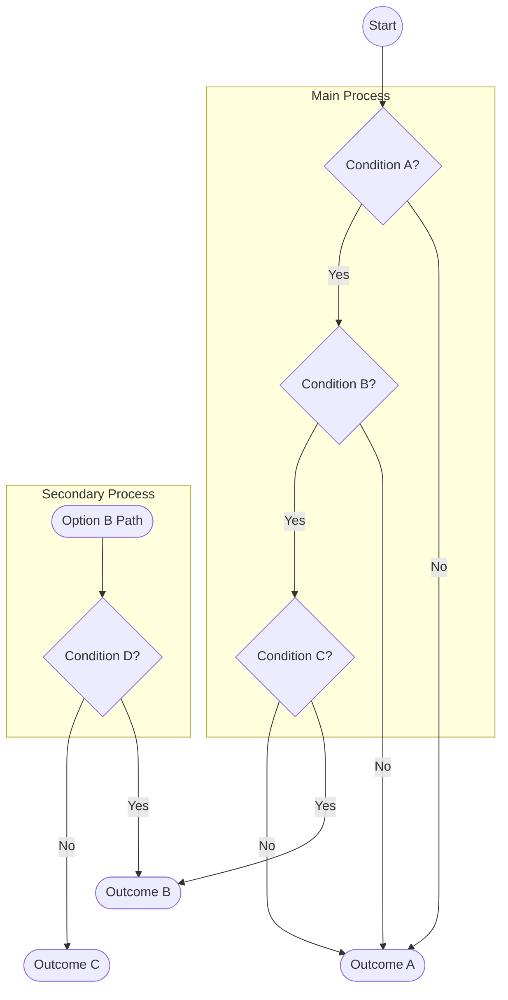

---


---


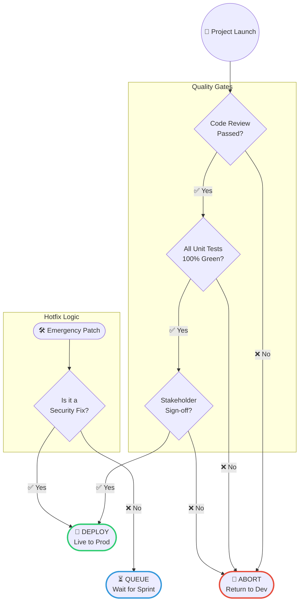

---


---


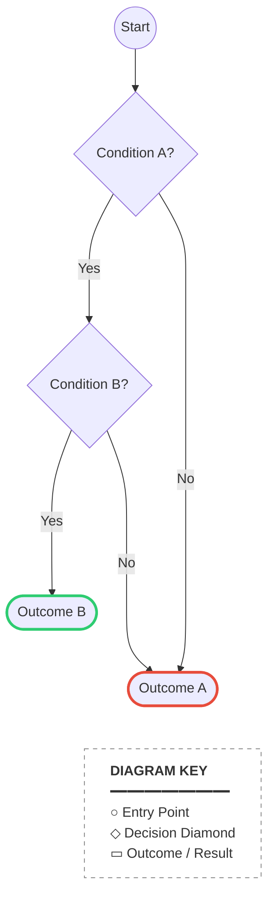

---


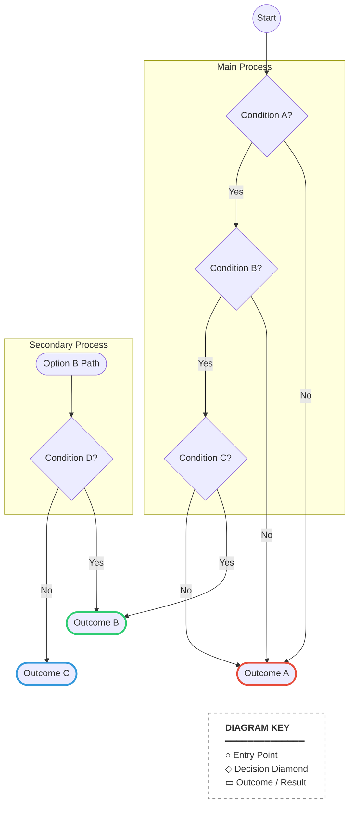

---


---


---


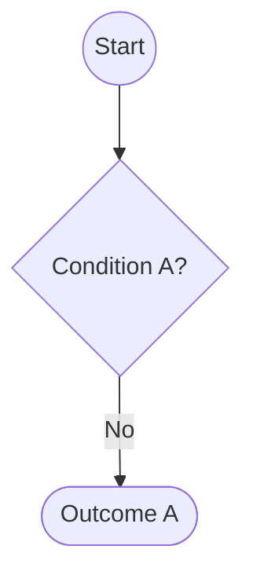

---


---

#### Enlightenment Lao Tse 1.

```mermaid
graph TD
    %% Title with a "Zen" Hexagon shape
    Title{{<b>✨ ENLIGHTENMENT ✨</b><br/>Lao Tse}}
    
    %% Intro Section
    P1["<i>The enlightened possess understanding<br/>so profound they cannot be understood.</i>"]
    P2["<i>Because they cannot be understood,<br/>I can only describe their appearance:</i>"]

    Title --> P1
    P1 --> P2

    %% THE FIX: Bridge Node for Qualities
    P2 --> H1["<i>The Seven Qualities</i>"]

    subgraph Qualities [" "]
        direction TB
        H1 --> C1
        C1["<b>❄️ Cautious</b> as one crossing thin ice"]
        C2["<b>⚠️ Undecided</b> as one surrounded by danger"]
        C3["<b>🤝 Modest</b> as one who is a guest"]
        C4["<b>🌊 Unbounded</b> as melting ice"]
        C5["<b>🌲 Genuine</b> as unshaped wood"]
        C6["<b>⛰️ Broad</b> as a valley"]
        C7["<b>☁️ Seamless</b> as muddy water"]
        
        C1 --> C2 --> C3 --> C4 --> C5 --> C6 --> C7
    end

    %% THE FIX: Bridge Node for Actions
    C7 --> H2["<i>The Way of the Sage</i>"]

    subgraph Actions [" "]
        direction TB
        H2 --> A1
        A1["Stills the water that the mud may settle"]
        A2["Seeks to stop that he may travel on"]
        A3["Desires less than what may transpire"]
        A4["Decays, but will not renew"]
        
        A1 --> A2 --> A3 --> A4
    end

    %% --- THE "GHOST BOX" STYLING ---
    classDef head stroke:#d4af37,stroke-width:4px,fill:#8882;
    classDef intro stroke:#888,stroke-width:2px,fill:#8882;
    classDef quality stroke:#5b6d5b,stroke-width:2px,fill:#8882;
    classDef action stroke:#4e5d6c,stroke-width:2px,fill:#8882;
    
    %% Frame for the Sub-headings (Bordered, No Fill)
    classDef header fill:none,stroke:#888,stroke-width:1px,stroke-dasharray: 5 5;

    class Title head;
    class P1,P2 intro;
    class C1,C2,C3,C4,C5,C6,C7 quality;
    class A1,A2,A3,A4 action;
    class H1,H2 header;

    %% Subgraph Outlines
    style Qualities fill:none,stroke:#888,stroke-dasharray: 5 5;
    style Actions fill:none,stroke:#888,stroke-dasharray: 5 5;
```

---

#### Enlightenment Lao Tse 2.

```mermaid
---
config:
  look: classic
  layout: dagre
---
graph TD
    Title{{"<b>✨ ENLIGHTENMENT ✨</b><br/>Lao Tse"}}
    P1["<i>The enlightened possess understanding<br/>so profound they cannot be understood.</i>"]
    P2["<i>Because they cannot be understood,<br/>I can only describe their appearance:</i>"]

    Title --> P1 
    P1 --> P2

    %% The Bridge Headers
    P2 --> H1["<i>The Seven Qualities</i>"]

    subgraph Qualities [" "]
        direction TB
        H1 --> C1
        C1["<b>❄️ Cautious</b> as one crossing thin ice"]
        C2["<b>⚠️ Undecided</b> as one surrounded by danger"]
        C3["<b>🤝 Modest</b> as one who is a guest"]
        C4["<b>🌊 Unbounded</b> as melting ice"]
        C5["<b>🌲 Genuine</b> as unshaped wood"]
        C6["<b>⛰️ Broad</b> as a valley"]
        C7["<b>☁️ Seamless</b> as muddy water"]
        
        C1 --> C2 --> C3 --> C4 --> C5 --> C6 --> C7
    end

    C7 --> H2["<i>The Way of the Sage</i>"]

    subgraph Actions [" "]
        direction TB
        H2 --> A1
        A1["Stills the water that the mud may settle"]
        A2["Seeks to stop that he may travel on"]
        A3["Desires less than what may transpire"]
        A4["Decays, but will not renew"]
        
        A1 --> A2 --> A3 --> A4
    end

    %% STYLING
    classDef head fill:#cc9900,stroke:#997300,color:#fff,stroke-width:2px;
    classDef intro fill:#666666,stroke:#444444,color:#fff;
    classDef quality fill:#4e7a5b,stroke:#34523d,color:#fff;
    classDef action fill:#456a8e,stroke:#2e475f,color:#fff;
    
    %% Updated Header: Bordered, No Fill, Dashed for style
    classDef header fill:none,stroke:#888,stroke-width:1px,stroke-dasharray: 5 5,color:#888;

    class Title head;
    class P1,P2 intro;
    class C1,C2,C3,C4,C5,C6,C7 quality;
    class A1,A2,A3,A4 action;
    class H1,H2 header;

    style Qualities fill:none,stroke:#888,stroke-dasharray: 5 5;
    style Actions fill:none,stroke:#888,stroke-dasharray: 5 5;
```

---

!!! example "Pro-Tips"

    1. The "Micro-Update" Method: If we are working on a long project (like your cheat-sheet), feel free to ask me to provide updates in smaller, bite-sized sections. It’s easier to copy-paste as we go!
       
        ---
    
    2. The Resume Command:
        **A:** If a response hangs or vanishes mid-sentence, just type "Continue from [last line]".
        **B:** I can usually pick up the thread right where we left off.
        
        ---
    
    3. Version Control:
        **A:** Whenever we hit a milestone, I can give you a "Clean Export" version of everything we've covered so you have a fresh master copy to save.
        
        ---
    
    4. Handy Tools for your Cheat-Sheet:
        **A: Backup & Sync:**
        **B:** If you are using Obsidian, check out the Obsidian Git plugin to automatically back up your notes so nothing gets lost.
        
        ---
    
    5. Note Organisation: Use the Periodic Notes plugin to keep track of when you added specific tips to your sheet.
    
        ---
    
    6. CSS Troubleshooting: If your custom colors aren't showing up, the Obsidian Forum is the best place to find specific CSS fixes for different themes.
