---
# This tells MkDocs to ignore the 'caption' features for this page
caption:
  figure:
    enable: false
  table:
    enable: false
  custom:
    enable: false


icon: octicons/markdown-16
---

{ .center-image }
<H1 style="text-align: center;">BasicSyntax</H1>

[ **uv**](https://github.com/astral-sh/uv)


[](https://github.com/astral-sh/uv)[](https://pypi.python.org/pypi/uv)[](https://pypi.python.org/pypi/uv)[](https://pypi.python.org/pypi/uv)[](https://github.com/astral-sh/uv/actions)[](https://discord.gg/astral-sh)

<p align="center">
An extremely fast Python package and project manager, written in Rust.
</p>

<p align="center">
  <picture align="center">
    <source media="(prefers-color-scheme: dark)" srcset="https://github.com/astral-sh/uv/assets/1309177/03aa9163-1c79-4a87-a31d-7a9311ed9310">
    <source media="(prefers-color-scheme: light)" srcset="https://github.com/astral-sh/uv/assets/1309177/629e59c0-9c6e-4013-9ad4-adb2bcf5080d">
    
  </picture>
</p>

<style>
  @media (prefers-color-scheme: dark) {
    picture img {
      filter: invert(1) hue-rotate(180deg);
    }
  }
</style>

<p align="center">
  <i>Installing <a href="https://trio.readthedocs.io/">Trio</a>'s dependencies with a warm cache.</i>
</p>
</div>

### uv Install

!!! ex "uv Install"
    === "macOS and Linux"
        <pre><code>$ curl -LsSf https://astral.sh/uv/install.sh | sh</code></pre>

    === "Windows"
        <pre><code>PS> powershell -ExecutionPolicy ByPass -c "irm https://astral.sh/uv/install.ps1 | iex"</code></pre>
        


!!! git "Installation"
    #### Installation {.toc-hidden-header}
    
    Use the following command to install uv:
    ```bash
    python -m ensurepip && python -m pip install uv
    ```

!!! ex "Website HEX codes."
    
    #### Website HEX codes {.toc-hidden-header}
    
    * I spent some time investigating and I believe any colors that follow the following HEX code will work: 
        * `#FF0099` - 255, 0, 153 - PinkPurple
        * `#FF9900` - 255, 153, 0 - OrangeYellow
        * `#99FF00` - 153, 255, 0 - Lime Green - **NOT GOOD**
        * `#9900FF` - 153, 0, 255 - PurpleViolet
        * `#0099FF` - 0, 153, 255 - BlueCyan
        * `#00FF99` - 0, 255, 153 - Sea Green - **NOT GOOD**

    ---

    * This pattern places all of these color codes on the Web Safe list of colors; I was unaware of that before I started investigating this. 
    
    * For a full list of all the web safe colors, check out the [Web Safe Colors Chart](https://websafecolors.info) and the [HTML Color Codes Chart](https://htmlcolorcodes.com).

    ---

    * This is the website I used to check the colors (icons, not text unfortunately) on both light and dark background: [Notion Icons Atlas](https://notionicons.so)
        * `#FF0099` - 255, 0, 153 - PinkPurple
        * `#FF9900` - 255, 153, 0 - OrangeYellow
        * `#66CC00` - 102, 204, 0 - GreenBlue
        * `#9900FF` - 153, 0, 255 - PurpleViolet
        * `#0099FF` - 0, 153, 255 - BlueCyan
        * `#00CC66` - 0, 204, 102 - BlueGreen

    !!! danger "Warning"
        Please be aware that the names I chose to describe the colours are not official names.
        
        Looking at the colours of the icons as you switch a theme from dark to light several times can create optical illusions in which the colours appear to be different on different themes.

### Systemctl Table

<!-- Block 3 Container - WRAPPED -->
<div markdown="1">

<div class="isolated-table-container">
  <style>
    .isolated-table-container .wikitable {
      border-collapse: collapse;
      width: 100%;
      max-width: 800px;
      margin: 20px auto;
      border: 1px solid #ccc;
      font-size: 16px;
    }
    .isolated-table-container .wikitable th,
    .isolated-table-container .wikitable td {
      border: 1px solid #ccc;
      padding: 8px;
      text-align: left;
    }
    .isolated-table-container .wikitable th {
      background-color: #FFFFFF;
      font-weight: bold;
      color: #333333;
    }
    .isolated-table-container .wikitable a {
      color: #0064d2;
      text-decoration: underline;
    }
    @media (prefers-color-scheme: dark) {
      .isolated-table-container .wikitable {
        border-color: #F0F0F0;
      }
      .isolated-table-container .wikitable th,
      .isolated-table-container .wikitable td {
        border-color: #D0D0D0;
      }
      .isolated-table-container .wikitable th {
        background-color: #006C3B;
        color: #e0e0e0;
      }
      .isolated-table-container .wikitable a {
        color: #6BDDEA;
      }
      .isolated-table-container .wikitable td {
        color: #008B72;
      }
      .isolated-table-container .wikitable td.note a {
        color: #fff;
      }
    }
  </style>
  <table class="wikitable">
    <tbody>
      <tr>
        <th>Action</th>
        <th>Command</th>
        <th>Note</th>
      </tr>
      <tr>
        <th colspan="3">Analyzing JohnPC's System State</th>
      </tr>
      <tr>
        <td class="action"><b>Show system status</b></td>
        <td><code>systemctl status</code></td>
        <td></td>
      </tr>
      <tr>
        <td class="action"><b>List running</b> units</td>
        <td><code>systemctl</code> or<br><code>systemctl list-units</code></td>
        <td></td>
      </tr>
      <tr>
        <td class="action"><b>List failed</b> units</td>
        <td><code>systemctl --failed</code></td>
        <td></td>
      </tr>
      <tr>
        <td class="action"><b>List installed</b> unit files<sup>1</sup></td>
        <td><code>systemctl list-unit-files</code></td>
        <td></td>
      </tr>
      <tr>
        <td class="action"><b>Show process status</b> for a PID</td>
        <td><code>systemctl status <i>pid</i></code></td>
        <td><a href="https://wiki.archlinux.org/title/Cgroups" title="Cgroups">cgroup slice</a>, memory and parent</td>
      </tr>
      <tr>
        <th colspan="3">Checking the unit status</th>
      </tr>
      <tr>
        <td class="action"><b>Show a manual page</b> associated with a unit</td>
        <td><code>systemctl help <i>unit</i></code></td>
        <td>as supported by the unit</td>
      </tr>
      <tr>
        <td class="action"><b>Status</b> of a unit</td>
        <td><code>systemctl status <i>unit</i></code></td>
        <td>including whether it is running or not</td>
      </tr>
      <tr>
        <td class="action"><b>Check</b> whether a unit is enabled</td>
        <td><code>systemctl is-enabled <i>unit</i></code></td>
        <td></td>
      </tr>
      <tr>
        <th colspan="3">Starting, restarting, reloading a unit</th>
      </tr>
      <tr>
        <td class="action"><b>Start</b> a unit immediately</td>
        <td><code>systemctl start <i>unit</i></code> as root</td>
        <td></td>
      </tr>
      <tr>
        <td class="action"><b>Stop</b> a unit immediately</td>
        <td><code>systemctl stop <i>unit</i></code> as root</td>
        <td></td>
      </tr>
      <tr>
        <td class="action"><b>Restart</b> a unit</td>
        <td><code>systemctl restart <i>unit</i></code> as root</td>
        <td></td>
      </tr>
      <tr>
        <td class="action"><b>Reload</b> a unit and its configuration</td>
        <td><code>systemctl reload <i>unit</i></code> as root</td>
        <td></td>
      </tr>
      <tr>
        <td class="action"><b>Reload systemd manager</b> configuration<sup>2</sup></td>
        <td><code>systemctl daemon-reload</code> as root</td>
        <td>scan for new or changed units</td>
      </tr>
      <tr>
        <th colspan="3">Enabling a unit</th>
      </tr>
      <tr>
        <td class="action"><b>Enable</b> a unit to start automatically at boot</td>
        <td><code>systemctl enable <i>unit</i></code> as root</td>
        <td></td>
      </tr>
      <tr>
        <td class="action"><b>Enable</b> a unit to start automatically at boot and <b>start</b> it immediately</td>
        <td><code>systemctl enable --now <i>unit</i></code> as root</td>
        <td></td>
      </tr>
      <tr>
        <td class="action"><b>Disable</b> a unit to no longer start at boot</td>
        <td><code>systemctl disable <i>unit</i></code> as root</td>
        <td></td>
      </tr>
      <tr>
        <td class="action"><b>Reenable</b> a unit<sup>3</sup></td>
        <td><code>systemctl reenable <i>unit</i></code> as root</td>
        <td>i.e. disable and enable anew</td>
      </tr>
      <tr>
        <th colspan="3">Masking a unit</th>
      </tr>
      <tr>
        <td class="action"><b>Mask</b> a unit to make it impossible to start<sup>4</sup></td>
        <td><code>systemctl mask <i>unit</i></code> as root</td>
        <td></td>
      </tr>
      <tr>
        <td class="action"><b>Unmask</b> a unit</td>
        <td><code>systemctl unmask <i>unit</i></code> as root</td>
        <td></td>
      </tr>
    </tbody>
  </table>
</div>

</div>

### Various Misc

~~~

blank line before
blank line after

~~~

1.  List item

    Not an indented code block, but a second paragraph
    in the list item

~~~~
This is a code block, fenced-style
~~~~

~~~~~~~~~~~~~~~~~~~~~~~~~~~~ {.html #example-1}
<p>paragraph <b>emphasis</b>
~~~~~~~~~~~~~~~~~~~~~~~~~~~~

Some markdown content here.

<div class="custom-class">
HTML content
</div>

!!! warning "Admonition after HTML"
    This should work with proper spacing.

<!-- md:option type:bug -->
!!! bug "Bug"

        Admonitions, also known as <em>call-outs</em>, are an excellent choice for including side content without significantly interrupting the document flow. Material for MkDocs provides several different types of admonitions and allows for the inclusion and nesting of arbitrary content.
        
<!-- md:option type:q -->
!!! quote "Quote"

    Admonitions, also known as <em>call-outs</em>, are an excellent choice for including side content without significantly
    interrupting the document flow. Material for MkDocs provides several different types of admonitions and allows for the inclusion and nesting of arbitrary content.


!!! pied-piper "Pied Piper"

    ``` markdown title="The last 3 special directories."


    NB: The last 3 special directories (last, week and month) which links repectively
    to the last synced repository, to the last Monday and to the first of the current month.
    ```


!!! bug "The Title"

    The content is correctly parsed because it's separated by blank lines
    from the raw HTML block tags.
    


!!! success "Installation"
    Use the following command to install uv:
    ```bash
    python -m ensurepip && python -m pip install uv
    ```

| Source | Name | Version | Description |
| :--- | :--- | :--- | :--- |
| aur | dict-gcide | [0.53-4](https://aur.archlinux.org/packages/dict-gcide) | GNU version of the Collaborative International Dictionary of English for dictd et al. |
| aur | openide-bin | [253.28294.334.8-1](https://aur.archlinux.org/packages/openide-bin) | OpenID is an open source software development tool for Java, Python, and other programming languages. |
| aur | friidump | [0.5.3.1-1 ](https://github.com/bradenmcd/friidump) | A program to dump Nintendo Wii and GameCube disc |
| aur | rsvndump | [0.6.2-1](https://aur.archlinux.org/packages?O=0&K=rsvndump) | Remote Subversion repository dump. |
| [aur](https://aur.archlinux.org/#) | aurvote-utils-git | [1.1.0.r7.g3e82548-1](https://aur.archlinux.org/packages?O=0&K=aurvote-utils-git) | A set of utilities for managing AUR votes |

!!! bug "Note."
    If the ESP is not mounted to `/boot`, make sure to not rely on the [systemd automount mechanism](https://wiki.archlinux.org/title/Fstab#Automount_with_systemd) (including that of [systemd-gpt-auto-generator](https://wiki.archlinux.org/title/Systemd#GPT_partition_automounting)) during kernel upgrades. Always mount it manually prior to any system or kernel update, otherwise you may not be able to mount it after the update, locking you in the currently running kernel with no ability to update the copy of kernel on the ESP.

    Alternatively [preload the required kernel modules on boot](https://wiki.archlinux.org/title/Kernel_module#systemd), e.g.:

    ```
    /etc/modules-load.d/vfat.conf
    vfat nls_cp437 nls_ascii
    ```

!!! settings "Install Mercurial"
    === "Debian/Ubuntu"
        ```bash
        apt install mercurial
        ```

    === "Fedora"
        ```bash
        dnf install mercurial
        ```

    === "Arch Linux"
        ```bash
        pacman -S mercurial
        ```

    === "Gentoo"
        ```bash
        emerge mercurial
        ```

    === "macOS (Homebrew)"
        ```bash
        brew install mercurial
        ```

    === "FreeBSD"
        Binary packages can be installed using `pkg`:

        ```bash
        pkg install mercurial
        ```

        Alternatively, you can install from source via the ports collection:

        ```bash
        cd /usr/ports/devel/mercurial
        make install
        ```

    === "Windows (Mercurial)"
        Using the `winget` package manager:

        ```bash
        winget install Mercurial.Mercurial -e
        ```

        Or download from the list of [binary releases](https://www.mercurial-scm.org).

    === "Windows (TortoiseHg)"
        Using the `winget` package manager:

        ```bash
        winget install TortoiseHg.TortoiseHg -e
        ```

        Or download from the list of [binary releases](https://mercurial-book.readthedocs.io/en/latest/working-together/collab.html?highlight=windows+tortoisehg).


---


---


---

:octicons-heart-fill-24:{ .heart }

:fontawesome-brands-youtube:{ .youtube }

⟶ *Detailed article: [Images in terminal](terminal-images.md)*

| Terminal              | Environment    | Images support | Protocol |
| --------------------- | --------- | ------------- | --------- |
| uxterm                |   X11     |   yes         |   Sixel   |
| mlterm                |   X11     |   yes         |   Sixel   |
| kitty                 |   X11     |   yes         |   Kitty   |
| wezterm               |   X11     |   yes         |   IIP     |
| Darktile              |   X11     |   yes         |   Sixel   |
| Jexer                 |   X11     |   yes         |   Sixel   |
| GNOME Terminal        |   X11     |   [in-progress](https://gitlab.gnome.org/GNOME/vte/-/issues/253) |   Sixel   |
| alacritty             |   X11     |   [in-progress](https://github.com/alacritty/alacritty/issues/910) |  Sixel   |
| foot                  |  Wayland  |   yes         |   Sixel   |
| DomTerm               |   Web     |   yes         |   Sixel   |
| Yaft                  |   FB      |   yes         |   Sixel   |
| iTerm2                |   Mac OS X|   yes         |   IIP     |
| mintty                | Windows   |   yes         |   Sixel   |
| Windows Terminal  |   Windows     |   [in-progress](https://github.com/microsoft/terminal/issues/448) |   Sixel   |
| [RLogin](http://nanno.dip.jp/softlib/man/rlogin/) | Windows | yes         |   Sixel   |   |


## Internationalization and localization

wttr.in supports multilingual locations names that can be specified in any language in the world
(it may be surprising, but many locations in the world don't have an English name).

The query string should be specified in Unicode (hex-encoded or not). Spaces in the query string
must be replaced with `+`:

    $ curl wttr.in/станция+Восток
    Weather report: станция Восток

                   Overcast
          .--.     -65 – -47 °C
       .-(    ).   ↑ 23 km/h
      (___.__)__)  15 km
                   0.0 mm

The language used for the output (except the location name) does not depend on the input language and it is either English (by default) or the preferred language of the browser (if the query was issued from a browser) that is specified in the query headers (`Accept-Language`).


## wttr.in usage stats

As of the end of August 2025, *wttr.in* handles 22-27 million queries per day from 170,000 to 190,000 users, according to the access logs.


| Name | License | Website | Description |
|:-----|:-------:|:-------:|:------------|
| [Max](https://wiki.hydrogenaudio.org/index.php?title=Max) | GPL | [here](https://max.macupdate.com/) | A secure ripper for OS X that uses additional cdparanoia functionality |
| [XLD](https://wiki.hydrogenaudio.org/index.php?title=XLD) | GPL | [here](https://x-lossless-decoder.macupdate.com/) | X Lossless Decoder(XLD) is a tool for Mac OS X that is able to decode/convert/play various 'lossless' audio files. The supported audio files can be split into some tracks with cue sheet when decoding. Can convert between many lossless and lossy formats. Plugin oriented design, for easy exchange for new encoders. |

| Name | License | Website | Description |
|:-----|:-------:|:-------:|:------------|
| CUERipper | GPL | [here](http://cue.tools/wiki/CUERipper) | A secure ripper for Windows that includes Accurate Stream functionality. [Forum](https://hydrogenaud.io/index.php/board,74.0.html) |
| [dBpoweramp](https://wiki.hydrogenaudio.org/index.php?title=DBpoweramp) | commercial | [here](http://www.dbpoweramp.com/) | A secure ripper for Windows that includes Accurate Stream functionality. |
| [EAC](https://wiki.hydrogenaudio.org/index.php?title=Exact_Audio_Copy) | Free | [here](http://www.exactaudiocopy.de/) | A secure ripper for Windows, C2 error pointers, Accurate Stream, etc. |
| [fre:ac](https://wiki.hydrogenaudio.org/index.php?title=Fre:ac) | GPL | [here](http://www.freac.org/) | fre:ac is a free audio converter and CD ripper with support for various popular formats and encoders. Plus supports the CDDB/freedb online CD database which allows you query song information. |

| name | license | website | description |
|:-----|:-------:|:-------:|:------------|
| abcde | gpl | [here](https://abcde.einval.com/wiki/) | a command-line based ripper with cdparanoia functionality |
| [cdparanoia](https://wiki.hydrogenaudio.org/index.php?title=Cdparanoia) | bsd, gpl | [here](https://xiph.org/paranoia/) | one of the first secure standalone rippers for the linux platform |
| grip | gpl | [here](https://sourceforge.net/projects/grip/) | an open-source gnome interface ripper that uses cdparanoia functionality |
| [Rubyripper](https://wiki.hydrogenaudio.org/index.php?title=Rubyripper) | gpl | [here](https://github.com/bleskodev/rubyripper) | a secure ripper for linux that uses additional cdparanoia functionality |
| [Whipper](https://wiki.hydrogenaudio.org/index.php?title=Whipper) | gpl | [here](https://github.com/whipper-team/whipper) | a secure ripper for the linux command-line built on cdparanoia |

!!! info "Molecule"

    Molecule will remove any options matching '^[v]+$', and pass ``-vvv`` to the underlying ``ansible-galaxy`` command when executing `molecule --debug`.
    
    ```yaml
    dependency:
      name: galaxy
      options:
        ignore-certs: True
        ignore-errors: True
        role-file: requirements.yml
        requirements-file: collections.yml
    ```
    
---

!!! desc "Equations"

    - The Restricted Boltzmann Machine (RBM) Set
    - The first and third blocks are intrinsically linked. They describe a Restricted Boltzmann Machine, a type of generative neural network.
    
    - Equation 1: The Energy Function
    
    $$
    E(\mathbf{v}, \mathbf{h}) = -\sum_{i,j}w_{ij}v_i h_j - \sum_i b_i v_i - \sum_j c_j h_j
    $$
    
    ---
    
    - Equation 2: Basic Inequality
    
    $$[3 < 4]$$
     
     - This is a simple mathematical truth (three is less than four). In this context, it is a separate entity and likely just a placeholder or a syntax test in your document.
    
    ---
    
    Equation 3: Conditional Probabilities (The Activation Functions)
    
    \begin{align}
        p(v_i=1|\mathbf{h}) & = \sigma\left(\sum_j w_{ij}h_j + b_i\right) \\
        p(h_j=1|\mathbf{v}) & = \sigma\left(\sum_i w_{ij}v_i + c_j\right)
    \end{align}
    
    These go directly with the Energy Function. They show how to update the state of one layer given the other, which is the core of the RBM's learning and sampling process.
    
    ---
    
    - Equation 4: Bayes' Theorem
    
    
    $p(x|y) = \frac{p(y|x)p(x)}{p(y)}$ + \(p(x|y) = \frac{p(y|x)p(x)}{p(y)}\).
    
    This is Bayes' Rule, the foundation of Bayesian statistics. While RBMs are probabilistic models, this specific equation is a general law of probability used across almost all of science and math. It stands alone as its own fundamental concept.
    
    ---
            
    
    ??? desc "Click to see Code for Equation Below"
        ```math
        \begin{align}
            p(v_i=1|\mathbf{h}) & = \sigma\left(\sum_j w_{ij}h_j + b_i\right) \\
            p(h_j=1|\mathbf{v}) & = \sigma\left(\sum_i w_{ij}v_i + c_j\right)
        \end{align}
        ```
        
    \begin{align}
        p(v_i=1|\mathbf{h}) & = \sigma\left(\sum_j w_{ij}h_j + b_i\right) \\
        p(h_j=1|\mathbf{v}) & = \sigma\left(\sum_i w_{ij}v_i + c_j\right)
    \end{align}
    
!!! desc ""

    `Lorem ipsum dolor sit amet`
    
    :   Sed sagittis eleifend rutrum. Donec vitae suscipit est. Nullam tempus tellus non sem sollicitudin, quis rutrum leo facilisis.
    
!!! desc ""

    `Cras arcu libero`
    
    :   Aliquam metus eros, pretium sed nulla venenatis, faucibus auctor ex. Proin ut eros sed sapien ullamcorper consequat. Nunc ligula ante.
    
    Duis mollis est eget nibh volutpat, fermentum aliquet dui mollis.
    Nam vulputate tincidunt fringilla.
    Nullam dignissim ultrices urna non auctor.
    
    - [x] Lorem ipsum dolor sit amet, consectetur adipiscing elit
    - [ ] Vestibulum convallis sit amet nisi a tincidunt
    * [x] In hac habitasse platea dictumst
    * [x] In scelerisque nibh non dolor mollis congue sed et metus
    * [ ] Praesent sed risus massa
    - [ ] Aenean pretium efficitur erat, donec pharetra, ligula non scelerisque
    

# Mathematical Pillars

### 1. The Gaussian Integral

!!! desc "The Gaussian Integral"

    **What it is:** A fundamental result in calculus showing the area under a bell curve.
    
    
    **Why it matters:** Even though $e^{-x^2}$ has no standard antiderivative, its total area across the entire real line is exactly $\sqrt{\pi}$. This is the backbone of **statistics and probability**, forming the basis of the Normal Distribution.
    
    
    $\int_{-\infty}^{\infty} e^{-x^2} dx = \sqrt{\pi}$
    
### 2. The Quadratic Formula

!!! desc "The Quadratic Formula"

    **What it is:** The standard method for finding the roots of any quadratic equation $ax^2 + bx + c = 0$
    
    **Why it matters:** It tells you exactly where a parabola crosses the horizontal axis using the formula $x = \frac{-b \pm \sqrt{b^{2}-4ac}}{2a}$. It’s the "Swiss Army Knife" of **algebra**.
    
    
    $x = \frac{-b \pm \sqrt{b^{2}-4ac}}{2a}$
    
### 3. Matrix-Vector Multiplication

!!! desc "Matrix-Vector Multiplication"

    **What it is:** A core operation where a matrix $\begin{pmatrix} a & b \\ c & d \end{pmatrix}$ transforms a vector.
    
    
    **Why it matters:** It results in a new vector $\begin{pmatrix} ax+by \\ cx+dy \end{pmatrix}$. This is how **computers** handle graphics and AI; it’s the math of moving and stretching space.
    
    
    $\begin{pmatrix} a & b \\ c & d \end{pmatrix} \begin{pmatrix} x \\ y \end{pmatrix} = \begin{pmatrix} ax+by \\ cx+dy \end{pmatrix}$
    
### 4. The Schrödinger Equation

!!! desc "The Schrödinger Equation"

    **What it is:** The fundamental equation of **Quantum Mechanics**.
    
    
    **Why it matters:** It describes how the "wave function" $\Psi$ of a system changes over time. It’s the reason we understand how atoms behave.
    
    
    $i\hbar\frac{\partial}{\partial t}\Psi = \left[-\frac{\hbar^2}{2m}\nabla^2+V\right]\Psi$
    
---

!!! desc "The above equations listed together"

    - **The Gaussian Integral** $\int_{-\infty}^{\infty} e^{-x^2} dx = \sqrt{\pi}$
    
    ??? desc "Click to see Code"
        ```math
        \[
        \int_{-\infty}^{\infty} e^{-x^2} dx = \sqrt{\pi}
        \]
        ```

    ---
    
    - **The Quadratic Formula** $x = \frac{-b \pm \sqrt{b^{2}-4ac}}{2a}$
    
    ??? desc "Click to see Code"
        ```math
        $$x = \frac{-b \pm \sqrt{b^{2}-4ac}}{2a}$$
        ```
    
    ---
    
    - **Matrix-Vector Multiplication** $\begin{pmatrix} a & b \\ c & d\end{pmatrix} \begin{pmatrix} x \\ y \end{pmatrix} = \begin{pmatrix} ax+by \\ cx+dy \end{pmatrix}$

    ??? desc "Click to see Code"
        ```math
        \[
        \begin{pmatrix} a & b \\ c & d \end{pmatrix} \begin{pmatrix} x \\ y \end{pmatrix} = \begin{pmatrix} ax+by \\ cx+dy \end{pmatrix}
        \]
        ```

    ---
    
    - **The Schrödinger Equation** $i\hbar\frac{\partial}{\partial t}\Psi = \left[-\frac{\hbar^2}{2m}\nabla^2+V\right]\Psi$

    ??? desc "Click to see Code"
        ```math
        $$i\hbar\frac{\partial}{\partial t}\Psi = \left[-\frac{\hbar^2}{2m}\nabla^2+V\right]\Psi$$
        ```

---

The mathematical expression of the Second Law of Thermodynamics is often presented in terms of the change in entropy (\(\Delta S\)) for an isolated system or the universe. Here are examples of the MathJax code for common formulations of the Second Law: General Statement (Entropy of the Universe) The most common and general mathematical statement is that the total entropy of an isolated system (the universe) can never decrease. 

MathJax Code (inline):
Renders as: $\Delta S_{\text{univ}} \ge 0$ 

---

$$\Delta S_{\text{total}} = \Delta S_{\text{sys}} + \Delta S_{\text{surr}} \geq 0$$

---

For a System and its Surroundings:
The total entropy change is the sum of the changes in the system and the surroundings, which must be greater than or equal to zero. 

MathJax Code (display mode):
Renders as:  $\Delta S_{\text{total}} = \Delta S_{\text{sys}} + \Delta S_{\text{surr}} \geq 0$
---
For any process, the change in entropy of a system is greater than or equal to the heat transfer (\(Q\)) divided by the absolute temperature (\(T\)). The equality holds for reversible processes, and the inequality for irreversible (real spontaneous) processes. 

MathJax Code (inline)
Renders as: $dS \ge \frac{\delta Q}{T}$

---

!!! desc "Probabilistic Models"

    #### Restricted Boltzmann Machines {.toc-hidden-header}
    
    - While RBMs are probabilistic models, these specific equations define the conditional layer activation probabilities using the sigmoid function (\(\sigma\)) rather than Bayes' rule directly.
    
    Inline equation code: \(p(v_i=1\vert{}\mathbf{h}) = \sigma\left(\sum_j w_{ij}h_j + b_i\right), \ p(h_j=1\vert{}\mathbf{v}) = \sigma\left(\sum_i w_{ij}v_i + c_j\right)\) for Restricted Boltzmann Machines (RBMs)

    \(\begin{flalign}     p(v_i=1\vert{}\mathbf{h}) & = \sigma\left(\sum_j w_{ij}h_j + b_i\right) & \\     p(h_j=1\vert{}\mathbf{v}) & = \sigma\left(\sum_i w_{ij}v_i + c_j\right) &     \end{flalign}\)

    ??? deep-dive "Code"
        
        ```math
        \begin{align}
        p(v_i=1|\mathbf{h}) & = \sigma\left(\sum_j w_{ij}h_j + b_i\right) \\
        p(h_j=1|\mathbf{v}) & = \sigma\left(\sum_i w_{ij}v_i + c_j\right)
        \end{align}
        ```
        
        ```math
        \begin{flalign}
        p(v_i=1|\mathbf{h}) & = \sigma\left(\sum_j w_{ij}h_j + b_i\right) & \\
        p(h_j=1|\mathbf{v}) & = \sigma\left(\sum_i w_{ij}v_i + c_j\right) &
        \end{flalign}
        ```
        
        ```math
        \(p(v_i=1\vert{}\mathbf{h}) = \sigma\left(\sum_j w_{ij}h_j + b_i\right)\), \(p(h_j=1\vert{}\mathbf{v}) = \sigma\left(\sum_i w_{ij}v_i + c_j\right)\)
        ```

!!! desc "Bayes' Theorem"

    #### Bayes' Theorem {.toc-hidden-header}
    
    This is Bayes' Rule, the foundation of Bayesian statistics. This specific equation is a general law of probability used across almost all of science and math. It stands alone as its own fundamental concept.
    
    Bayes' Rule with two different rendering methods, one:  $p(x|y) = \frac{p(y|x)p(x)}{p(y)}$, and two:  \(p(x|y) = \frac{p(y|x)p(x)}{p(y)}\), see the code below showing the difference.
    
    ---
    
    ??? deep-dive "Click to see code"
    
        ```math
        $p(x|y) = \frac{p(y|x)p(x)}{p(y)}$
        
        \(p(x|y) = \frac{p(y|x)p(x)}{p(y)}\)
        ```
    
!!! info "Molecule"

    Molecule will remove any options matching `^[v]+$`, and pass ``-vvv`` to the underlying ``ansible-galaxy`` command when executing `molecule --debug`.
    
    ```yaml
    dependency:
      name: galaxy
      options:
        ignore-certs: True
        ignore-errors: True
        role-file: requirements.yml
        requirements-file: collections.yml
    ```
    
!!! info "Molecule"

    Molecule will remove any options matching `^[v]+$`, and pass ``-vvv`` to the underlying ``ansible-galaxy`` command when executing `molecule --debug`.
    
    ```yaml
    dependency:
      name: galaxy
      options:
        ignore-certs: True
        ignore-errors: True
        role-file: requirements.yml
        requirements-file: collections.yml
    ```
    
| name | license | website | description |
|:-----|:-------:|:-------:|:------------|
| abcde | gpl | [here](https://abcde.einval.com/wiki/) | a command-line based ripper with cdparanoia functionality |
| [cdparanoia](https://wiki.hydrogenaudio.org/index.php?title=Cdparanoia) | bsd, gpl | [here](https://xiph.org/paranoia/) | one of the first secure standalone rippers for the linux platform |
| grip | gpl | [here](https://sourceforge.net/projects/grip/) | an open-source gnome interface ripper that uses cdparanoia functionality |
| [Rubyripper](https://wiki.hydrogenaudio.org/index.php?title=Rubyripper) | gpl | [here](https://github.com/bleskodev/rubyripper) | a secure ripper for linux that uses additional cdparanoia functionality |
| [Whipper](https://wiki.hydrogenaudio.org/index.php?title=Whipper) | gpl | [here](https://github.com/whipper-team/whipper) | a secure ripper for the linux command-line built on cdparanoia |

!!! desc "Two Solutions"

    When $a \ne 0$, there are two solutions to $(ax^2 + bx + c = 0)$ and they are:  $\ x = {-b \pm \sqrt{b^2-4ac} \over 2a}$
    
    ---
    
    This sentence uses `$` delimiters to show math inline: $\sqrt{3x-1}+(1+x)^2$
    
!!! desc "The Cauchy-Schwarz Inequality"

    **The Cauchy-Schwarz Inequality**
    
    $\left( \sum_{k=1}^n a_k b_k \right)^2 \leq \left( \sum_{k=1}^n a_k^2 \right) \left( \sum_{k=1}^n b_k^2 \right)$
    

!!! desc "The \(\sqrt{\$4}\) and the True Inequality"

    In the initial text dump provided, the raw fragment reads as follows:
    
    $E(\mathbf{v}, \mathbf{h}) = -\sum_{i,j}w_{ij}v_i h_j - \sum_i b_i v_i - \sum_j c_j h_j$
    
    $3 < 4$
    
    \(\begin{align} p(v_i=1\vert{}\mathbf{h}) & = \sigma\left(\sum_j w_{ij}h_j + b_i\right) \\ p(h_j=1\vert{}\mathbf{v}) & = \sigma\left(\sum_i w_{ij}v_i + c_j\right) \end{align}\)
    
    The string $[3 < 4]$ sits explicitly between the global energy definition and the local node update equations. It has zero mathematical or conceptual connection to the structural physics of Restricted Boltzmann Machines or neural networks. It operates purely as an arbitrary, detached example of an inequality statement sitting mid-document.
    
!!! desc " Why These Strange Fragments Exist"

    The inclusion of these specific elements points directly to a LaTeX syntax stress test or a formatting template. Document developers frequently mix these exact symbols to test parser edge cases for three specific reasons:
    
    *   **Delimiter Escape Validation**: Putting a literal dollar sign ($\$$) inside a square root ($\sqrt{\$4}$) checks if the rendering engine can distinguish between currency symbols and mathematical math-mode triggers.
    
    *   **HTML Tag Conflict Testing**: The less-than sign in $[3 < 4]$ is used to see ifan aggressive Markdown or HTML parser will accidentally interpret $<$ as the start of an invalid code tag and break the display.
    
    *   **Bracket Priority Checks**: Combining standard square brackets $[...]$ right next to LaTeX display math brackets $\backslash[...\backslash]$ verifies if the layout engine properly separates normal document text from centered equations.
    
    Essentially, they serve as a diagnostic checklist to ensure the formatting software does not break when encountering complex real-world text.
    
    ---
    
    The direct mathematical relationship between them is structured as follows:
    
    *   **The Energy Equation ($E(\mathbf{v}, \mathbf{h})$)**: This defines a single scalar value measuring the total "compatibility" or "badness" of the entire system state across all nodes simultaneously. It is a global calculation.
    
    *   **The Probability Equations ($p(v_i = 1|\mathbf{h})$ and $p(h_j = 1|\mathbf{v})$)**
    : These calculate the probability of a single specific neuron turning on (setting its binary state to 1) given what the other layer is currently doing. 
    
    ---
    
    The Derivation Link
    
    The conditional probabilities are mathematically derived directly out of the global energy function using the Boltzmann distribution formula:
    
    $\displaystyle p(\mathbf{v}, \mathbf{h}) = \frac{e^{-E(\mathbf{v}, \mathbf{h})}}{\sum_{\mathbf{v}', \mathbf{h}'} e^{-E(\mathbf{v}', \mathbf{h}')}}$
    
    Because there are no connections between nodes within the same layer of an RBM, taking the conditional probability rules of standard statistics ($p(\mathbf{v},\mathbf{h}) / p(\mathbf{v})$) and expanding that fraction causes almost all variables to cancel out perfectly. The algebraic remainder simplifies down to exactly the logistic sigmoid function (\(\sigma \)) shown in your inline equations. In practice, the network uses the Energy equation to score its overall state, and uses the Probability equations as a localized blueprint to actually update its nodes one by one during training.
    
---

!!! info "Auto-generated code"
    This repository is **auto-generated** from the Immich OpenAPI specification.
    Pull requests are welcome, but modifications to auto-generated code will be rejected. See [Contributing](MkDocs-Material/contributing.md) for more details.

!!! info "Auto-synced with Immich"
    This project is [auto-synced](MkDocs-Material/auto-sync.md) with the **latest Immich release**.

!!! info "Not affiliated with Immich"
    This project is not affiliated with or endorsed by Immich.
    

---

Everybody should know Euler's formula: $e^{ \pm i\theta } = \cos \theta \pm i\sin \theta$ 

These are Euler's most famous equations:

$$
\begin{aligned}
e^{ \pm i\theta } & = \cos \theta \pm i\sin \theta    \\
e^{i \pi} & = -1
\end{aligned}
$$

### Table 2. Orbital Elements of S2 and S4716

| Source | a (mpc) | e | i (deg) | ω (deg) | Ω (deg) | t_closest (yr) |
| :--- | :--- | :--- | :--- | :--- | :--- | :--- |
| S2 | 5.09 ± 0.01 | 0.886 ± 0.002 | 133.49 ± 0.40 | 65.89 ± 0.75 | 227.46 ± 1.03 | 2018.37 ± 0.02 |
| S4716 (estimated) | 1.93 ± 0.02 | 0.756 ± 0.02 | 161.24 ± 2.80 | 0.073 ± 0.02 | 151.54 ± 1.54 | 2017.41 ± 0.004 |
| S4716 (max. likelihood) | 1.94 ± 0.02 | 0.756 ± 0.02 | 161.13 ± 2.80 | 2.25 ± 0.02 | 153.55 ± 1.54 | 2017.41 ± 0.004 |

**Note.** The estimated values for S4716 are based on a Keplerian fit model, while the maximum likelihood stems from the MCMC simulation. See Appendix B for a discussion of these values.


<style>
  /* Force the table to fit the page width exactly */
  .md-typeset table {
    width: 100%;
    display: table;
    table-layout: fixed; /* This is the magic: it forces columns to obey set widths */
  }

  /* Specific column widths */
  /* Column 1 (Source) - let it take the most space */
  .md-typeset td:nth-child(1) { width: 25%; }
  
  /* Column 3 (e) - force it to be very narrow */
  .md-typeset td:nth-child(3) { width: 10%; }
</style>

### Table 2. Orbital Elements of S2 and S4716

| Source | a (mpc) | e | i (deg) | ω (deg) | Ω (deg) | t_closest (yr) |
| :--- | :---: | :---: | :---: | :---: | :---: | :---: |
| S2 | 5.09 ± 0.01 | 0.886 ± 0.002 | 133.49 ± 0.40 | 65.89 ± 0.75 | 227.46 ± 1.03 | 2018.37 ± 0.02 |
| S4716 (est) | 1.93 ± 0.02 | 0.756 ± 0.02 | 161.24 ± 2.80 | 0.073 ± 0.02 | 151.54 ± 1.54 | 2017.41 ± 0.004 |
| S4716 (ML) | 1.94 ± 0.02 | 0.756 ± 0.02 | 161.13 ± 2.80 | 2.25 ± 0.02 | 153.55 ± 1.54 | 2017.41 ± 0.004 |

**Note.** The estimated values for S4716 are based on a Keplerian fit model, while the maximum likelihood stems from the MCMC simulation. See Appendix B for a discussion of these values.

---

#### Summary Guide for your "Related Pages" link system.

- Here is the Complete Summary Guide for your "Related Pages" link system.
- You can copy and save this as a local text file.

---

##### Part 1: Folder Structure & Config
- Ensure your project directory looks like this:

!!! tip "Folder Structure."

    ```bash
    my-project/
    ├── mkdocs.yml
    ├── docs/
    │  ├── UV.md
    │  └── UV_Style/
    │     └── STYLE.md
    └── overrides/
       └── main.html
    ```
    
!!! info ""
    In your mkdocs.yml, add the custom_dir setting to the theme:
    
    ```bash {.no-copy}
    theme:
      name: material
      custom_dir: overrides
    ```
    
##### Part 2: The Logic Template (overrides/main.html)

Create this file and paste the code below. This handles two scenarios:

 1. Manual: You specify a link in a specific file.

 2. Automatic: Any file in the MkDocs-Material/ folder automatically gets a link back to its main page.


html

??? info "html for Site Logic Summary"

    #### Site Logic Summary
    To create your `overrides/main.html` file, copy the code block below:

    ```html
    

    
      {# 1. Check for manual links in page metadata #}
      
        <p>
          <strong>Related:</strong> 
          <a href="{{ page.meta.related_link | url }}">{{ page.meta.related_title | default('Click here') }}</a>
        </p>
        <hr>

      {# 2. Auto-link for the MkDocs-Material folder #}
      
        <p>
          <strong>Return to:</strong> 
          <a href="{{ 'MkDocs-Material/setting-up-tags.md' | url }}">Main Setup Guide</a>
        </p>
        <hr>

      {# 3. Auto-link for the Arch_OS_Docs folder #}
      
        <p>
          <strong>Return to:</strong> 
          <a href="{{ 'DOCS.md' | url }}">Main Arch OS Index</a>
        </p>
        <hr>

      {# 4. Auto-link for the UV_Style folder #}
      
        <p>
          <strong>Return to:</strong> 
          <a href="{{ 'UV.md' | url }}">Main UV Documentation</a>
        </p>
        <hr>

      

      {{ super() }}
    
    ```

##### Part 3: How to Use in Your Markdown Files

!!! info "Method A: For Unique Pages"

    Method A: For Unique Pages (e.g., UV and Style)
    
    - Add this "Front Matter" (the YAML block) to the very top of your .md files.
    
    - In docs/UV.md:
    
    ```yaml
    ---
    related_link: UV_Style/STYLE.md
    related_title: "View UV Style Guide"
    ---
    ```
    
    UV Main Page
    
    
    - In docs/UV_Style/STYLE.md:
    
    ```yaml
    ---
    related_link: UV.md
    related_title: "Return to UV Main"
    ---
    ```
    
    Style Guide
    

!!! info "Method B: For Bulk Folders (e.g., MkDocs-Material)"

    Method B: For Bulk Folders (e.g., MkDocs-Material)
    
    You don't have to do anything. Because of the code in Part 2 (Scenario 2), every page inside the MkDocs-Material/ folder will automatically display a "Return to Main Setup Guide" link at the top, except for the main guide page itself.
    
    Troubleshooting Tips:
    
    The "not_in_nav" pages:
    
    These pages will still show the link box! As long as the file exists in the folder, the template will find it and display the link.
    
    Paths: If a link doesn't work, try using the path relative to the docs/ folder (e.g., Folder/Subfolder/file.md).
    
    Icons: If the icons don't show up, make sure you have python-markdown extensions enabled in your mkdocs.yml, specifically pymdownx.emoji.
    
    Would you like me to generate a similar "Bulk Rule" for any other folders you have (like "Arch OS Docs") before you go?
    

##### Summary of how to add more Bulk Rules later:


!!! info "Bulk Folder More Than One .md File"

    - If you find another folder (e.g., Networking/) and want all 20 pages in it to link back to Networking_Home.md, just add another  block before the final :
    
    
    ```bash {.no-copy}
    1. Check the path: "Folder_Name/" in page.file.src_uri
    2. Exclude the main page: and page.file.src_uri != "Folder_Name/Main_Page.md"
       (This prevents the link from appearing on the main page itself).
    3. Set the link: <a href="{{ 'Path/to/Main.md' | url }}">
    ```
    
    - Quick Checklist for your local setup:
    
    ```bash {.no-copy}
    1. mkdocs.yml: Ensure custom_dir: overrides is present.
    2. overrides/main.html: Paste the code above.
    3. Icons: If icons don't show, ensure you have this in your mkdocs.yml under markdown_extensions:
    ```
    

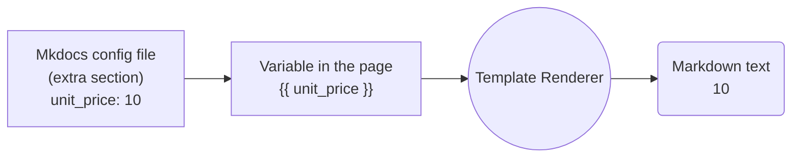


{ .center-image }

## smxi/<b>inxi</b>

!!! danger "Home Page"
    
    Home Page :: [inxi](https://codeberg.org/smxi/inxi) [smxi](https://codeberg.org/smxi/smxi) [sgfxi](https://codeberg.org/smxi/sgfxi) [svmi](https://codeberg.org/smxi/svmi) [rbxi](https://codeberg.org/smxi/rbxi)
    
[smxi](https://smxi.org/)

Winner of the [Distrowatch.com March 2009](http://distrowatch.com/weekly.php?issue=20090406#donation) award donation.

Welcome to the smxi/sgfxi/svmi + inxi + rbxi group of tools main site. Documentation is being updated and improved routinely, so check out the various sections and see if what you needed to know has been answered already.

[Donations](https://smxi.org/site/donations.htm) are always welcome! The smallest amount is still more than nothing.

##### Script Documentation Resources

!!! info ""

    There are a range of help and end user resources available, as well as more developer oriented materials.
    
    ---
    
    **You can find them here:**
    
    1 - General [documentation](https://smxi.org/docs/) (manuals, options, how-to's).
    2 - [Inxi Docs.](https://smxi.org/docs/inxi.htm) (manuals, options, how-to's).
    3 - [About-tools.](https://smxi.org/site/about.htm) A  brief introduction to what smxi, sgfxi, svmi, inxi, and rbxi do.
    4 - [The smxi-story.](https://smxi.org/site/smxi-story.htm) The story of smxi. How it started, what it does, and its current options.
    5 - [Install-tools.](https://smxi.org/site/install.htm) How to install tools (smxi, sgfxi, svmi, inxi, and rbxi).
    6 - [FAQs](https://smxi.org/site/faqs.htm) FAQs. Answers to questions about the tools in general.
    7 - [FAQs-smxi](https://smxi.org/site/faqs-smxi.htm) smxi FAQs. Smxi specific questions.
    8 - [FAQs-sgfxi](https://smxi.org/site/faqs-sgfxi.htm) sgfxi FAQs. Sgfxi specific questions (video drivers etc).
    9 - [smxi-change-blog](https://smxi.org/site/changeblog.htm) smxi change log/blog. Random thoughts and change notes, nothing exciting.
    
##### Script Forums and Contact Resources  

!!! pied-piper ""

    The tools have support forums, which I encourage you to use to file bug reports, feature requests, and so on. Also note the changeblog, which is sometimes up-to date.
    
    ---
    
    Please use the existing bug report or feature requests threads to report issues for the tool in question. That helps keep the forums reasonably uncluttered and readable for other users. Thanks.
    
    ---
    
    1 - [user-forums](http://techpatterns.com/forums/forum-33.html), where you can post bugs, issues, questions.
    2 - [Dev-forums](http://techpatterns.com/forums/forum-32.html), talk about code and other more dev oriented things.
    3 - [Contact project.](https://smxi.org/site/contact.php) But generally use forums, IRC, or git repo issues.
    4 - Follow on [fosstodon.org/@smxi](https://fosstodon.org/@smxi) (nope, not on twitter, never).
    
##### Code Repositories  

!!! warning "Code Repositories"

    The tools all have their own code repositories, where you can check out the code (and see if you can figure out how it all works), file issues, or checkout documentation.
    
    ---
    
    Here's what's available:
    
    ---
    
    <div class="grid cards" markdown>
    
    1. [smxi](https://codeberg.org/smxi/smxi)
    2. [sgfxi](https://codeberg.org/smxi/sgfxi)
    3. [svmi](https://codeberg.org/smxi/svmi)
    4. [rbxi](https://codeberg.org/smxi/rbxi)
    5. [inxi](https://codeberg.org/smxi/inxi)
    6. [pinxi](https://codeberg.org/smxi/pinxi)
    7. [acxi](https://codeberg.org/smxi/acxi)
    
    
    </div>
    

!!! warning "Code Repositories"

    The tools all have their own code repositories, where you can check out the code (and see if you can figure out how it all works), file issues, or checkout documentation.
    
    ---
    
    Here's what's available:
    
    ---
    
    <div class="grid cards" markdown>
    
    -   :simple-codeberg:&nbsp; **[1. smxi](https://codeberg.org/smxi/smxi)** — _Check out the main tool code, file issues, or read the docs._
    -   :simple-codeberg:&nbsp; **[2. sgfxi](https://codeberg.org/smxi/sgfxi)** — _Graphics driver installer for Debian and Ubuntu based systems._
    -   :simple-codeberg:&nbsp; **[3. svmi](https://codeberg.org/smxi/svmi)** — _VirtualBox helper script for managing VM installations._
    -   :simple-codeberg:&nbsp; **[4. rbxi](https://codeberg.org/smxi/rbxi)** — _A specialized tool for managing Ruby-on-Rails environments._
    -   :simple-codeberg:&nbsp; **[5. inxi](https://codeberg.org/smxi/inxi)** — _The classic full-featured CLI system information tool._
    -   :simple-codeberg:&nbsp; **[6. pinxi](https://codeberg.org/smxi/pinxi)** — _The development (preview) version of the inxi system tool._
    -   :simple-codeberg:&nbsp; **[7. acxi](https://codeberg.org/smxi/acxi)** — _Audio convert script for FLAC, MP3, OGG and more._
    
    </div>

---


---

##### Test 2 Mermaid Flow Chart

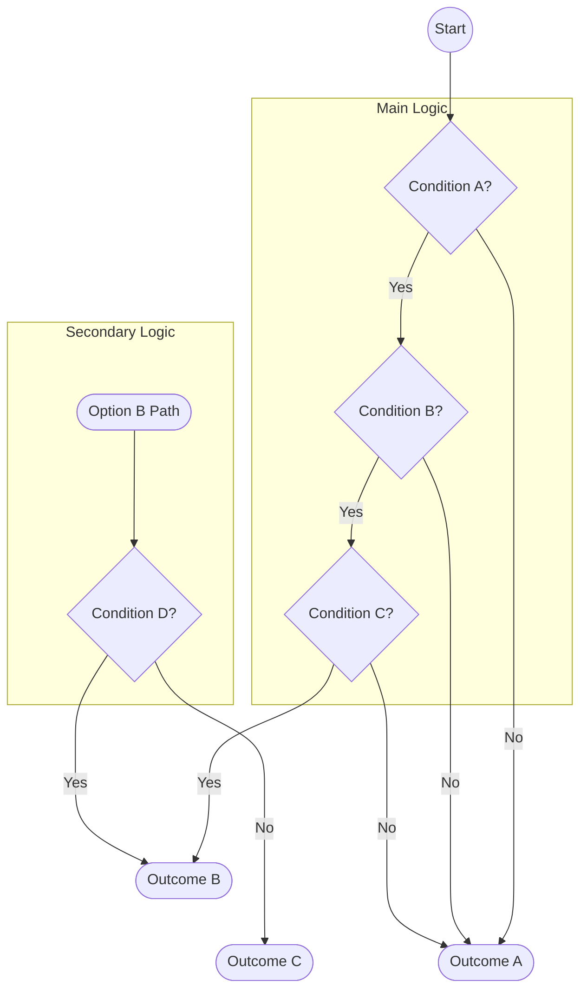

---

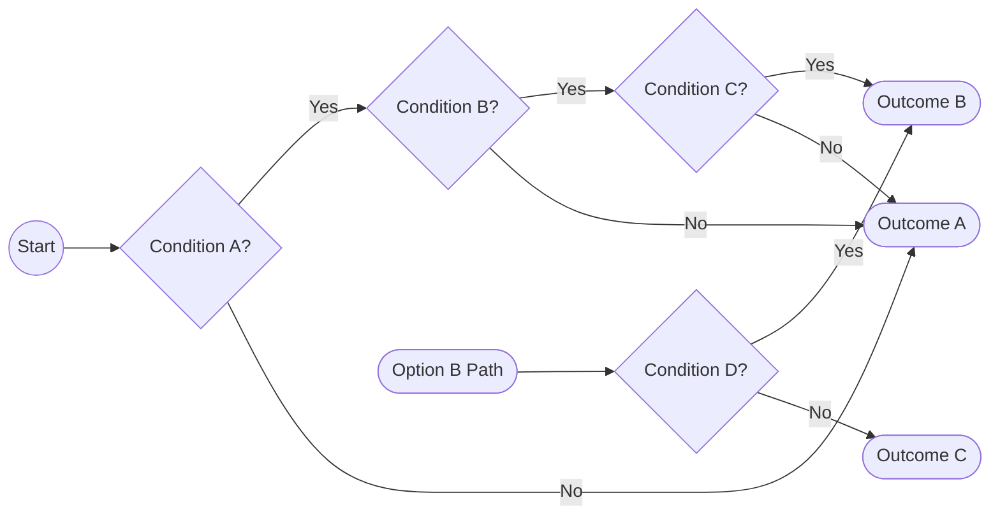

---


---


---


---


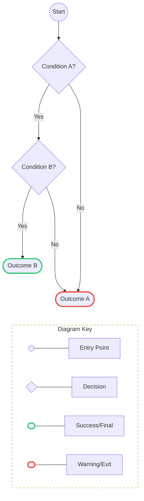

---


---


---


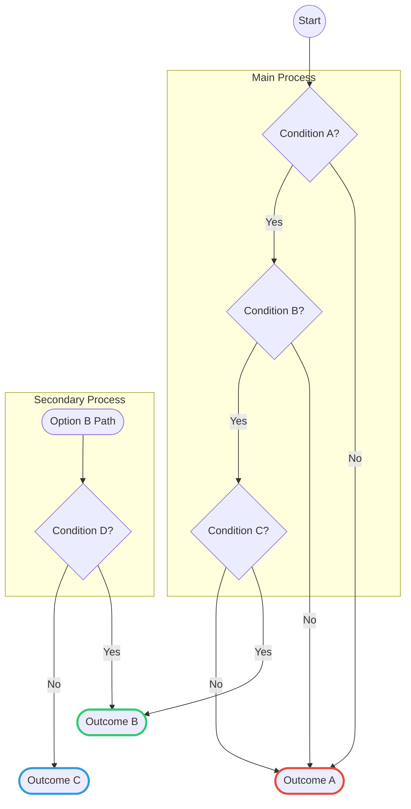

---


---


---

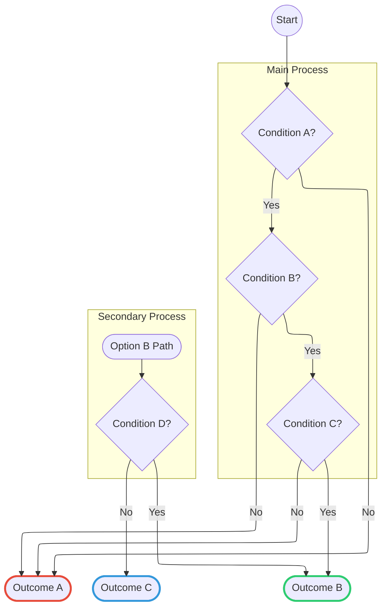

---

#### Enlightenment Lao Tse 1.

```mermaid
graph TD
    %% Title with a "Zen" Hexagon shape
    Title{{<b>✨ ENLIGHTENMENT ✨</b><br/>Lao Tse}}
    
    %% Intro Section
    P1["<i>The enlightened possess understanding<br/>so profound they cannot be understood.</i>"]
    P2["<i>Because they cannot be understood,<br/>I can only describe their appearance:</i>"]

    Title --> P1
    P1 --> P2

    %% THE FIX: Bridge Node for Qualities
    P2 --> H1["<i>The Seven Qualities</i>"]

    subgraph Qualities [" "]
        direction TB
        H1 --> C1
        C1["<b>❄️ Cautious</b> as one crossing thin ice"]
        C2["<b>⚠️ Undecided</b> as one surrounded by danger"]
        C3["<b>🤝 Modest</b> as one who is a guest"]
        C4["<b>🌊 Unbounded</b> as melting ice"]
        C5["<b>🌲 Genuine</b> as unshaped wood"]
        C6["<b>⛰️ Broad</b> as a valley"]
        C7["<b>☁️ Seamless</b> as muddy water"]
        
        C1 --> C2 --> C3 --> C4 --> C5 --> C6 --> C7
    end

    %% THE FIX: Bridge Node for Actions
    C7 --> H2["<i>The Way of the Sage</i>"]

    subgraph Actions [" "]
        direction TB
        H2 --> A1
        A1["Stills the water that the mud may settle"]
        A2["Seeks to stop that he may travel on"]
        A3["Desires less than what may transpire"]
        A4["Decays, but will not renew"]
        
        A1 --> A2 --> A3 --> A4
    end

    %% --- THE "GHOST BOX" STYLING ---
    classDef head stroke:#d4af37,stroke-width:4px,fill:#8882;
    classDef intro stroke:#888,stroke-width:2px,fill:#8882;
    classDef quality stroke:#5b6d5b,stroke-width:2px,fill:#8882;
    classDef action stroke:#4e5d6c,stroke-width:2px,fill:#8882;
    
    %% Frame for the Sub-headings (Bordered, No Fill)
    classDef header fill:none,stroke:#888,stroke-width:1px,stroke-dasharray: 5 5;

    class Title head;
    class P1,P2 intro;
    class C1,C2,C3,C4,C5,C6,C7 quality;
    class A1,A2,A3,A4 action;
    class H1,H2 header;

    %% Subgraph Outlines
    style Qualities fill:none,stroke:#888,stroke-dasharray: 5 5;
    style Actions fill:none,stroke:#888,stroke-dasharray: 5 5;
```

---

#### Enlightenment Lao Tse 2.

```mermaid
---
config:
  look: classic
  layout: dagre
---
graph TD
    Title{{"<b>✨ ENLIGHTENMENT ✨</b><br/>Lao Tse"}}
    P1["<i>The enlightened possess understanding<br/>so profound they cannot be understood.</i>"]
    P2["<i>Because they cannot be understood,<br/>I can only describe their appearance:</i>"]

    Title --> P1 
    P1 --> P2

    %% The Bridge Headers
    P2 --> H1["<i>The Seven Qualities</i>"]

    subgraph Qualities [" "]
        direction TB
        H1 --> C1
        C1["<b>❄️ Cautious</b> as one crossing thin ice"]
        C2["<b>⚠️ Undecided</b> as one surrounded by danger"]
        C3["<b>🤝 Modest</b> as one who is a guest"]
        C4["<b>🌊 Unbounded</b> as melting ice"]
        C5["<b>🌲 Genuine</b> as unshaped wood"]
        C6["<b>⛰️ Broad</b> as a valley"]
        C7["<b>☁️ Seamless</b> as muddy water"]
        
        C1 --> C2 --> C3 --> C4 --> C5 --> C6 --> C7
    end

    C7 --> H2["<i>The Way of the Sage</i>"]

    subgraph Actions [" "]
        direction TB
        H2 --> A1
        A1["Stills the water that the mud may settle"]
        A2["Seeks to stop that he may travel on"]
        A3["Desires less than what may transpire"]
        A4["Decays, but will not renew"]
        
        A1 --> A2 --> A3 --> A4
    end

    %% STYLING
    classDef head fill:#cc9900,stroke:#997300,color:#fff,stroke-width:2px;
    classDef intro fill:#666666,stroke:#444444,color:#fff;
    classDef quality fill:#4e7a5b,stroke:#34523d,color:#fff;
    classDef action fill:#456a8e,stroke:#2e475f,color:#fff;
    
    %% Updated Header: Bordered, No Fill, Dashed for style
    classDef header fill:none,stroke:#888,stroke-width:1px,stroke-dasharray: 5 5,color:#888;

    class Title head;
    class P1,P2 intro;
    class C1,C2,C3,C4,C5,C6,C7 quality;
    class A1,A2,A3,A4 action;
    class H1,H2 header;

    style Qualities fill:none,stroke:#888,stroke-dasharray: 5 5;
    style Actions fill:none,stroke:#888,stroke-dasharray: 5 5;
```

---

!!! tldr "Pro-Tips"

    1. The "Micro-Update" Method: If we are working on a long project (like your cheat-sheet), feel free to ask me to provide updates in smaller, bite-sized sections. It’s easier to copy-paste as we go!
       
        ---
    
    2. The Resume Command:
        **A:** If a response hangs or vanishes mid-sentence, just type "Continue from [last line]".
        **B:** I can usually pick up the thread right where we left off.
        
        ---
    
    3. Version Control:
        **A:** Whenever we hit a milestone, I can give you a "Clean Export" version of everything we've covered so you have a fresh master copy to save.
        
        ---
    
    4. Handy Tools for your Cheat-Sheet:
        **A: Backup & Sync:**
        **B:** If you are using Obsidian, check out the Obsidian Git plugin to automatically back up your notes so nothing gets lost.
        
        ---
    
    5. Note Organisation: Use the Periodic Notes plugin to keep track of when you added specific tips to your sheet.
    
        ---
    
    6. CSS Troubleshooting: If your custom colors aren't showing up, the Obsidian Forum is the best place to find specific CSS fixes for different themes.

??? ex "HTML Code for the table below"

    ```html
    <div class="isolated-table-container">
      <style>
        /* Use CSS Variables instead of hardcoded colors for dynamic theming */
        .isolated-table-container .table.table-bordered {
          border-collapse: collapse;
          width: 100%;
          max-width: 800px;
          margin: 20px auto;
          /* Use theme default border color */
          border: 1px solid var(--md-default-fg-color--light); 
          font-size: 16px;
          /* Default background color */
          background-color: var(--md-default-bg-color); 
          /* Default text color */
          color: var(--md-default-fg-color);
        }
        .isolated-table-container .table.table-bordered th,
        .isolated-table-container .table.table-bordered td {
          /* Use theme default border color */
          border: 1px solid var(--md-default-fg-color--light); 
          padding: 8px;
          text-align: left;
        }
        .isolated-table-container .table.table-bordered thead th {
          /* Use primary theme color for header background */
          background-color: var(--md-primary-fg-color); 
          font-weight: bold;
          /* Ensure header text is readable against primary color */
          color: var(--md-primary-bg-color); 
        }
        .isolated-table-container .table.table-bordered tbody tr:nth-child(odd) {
            /* Add some striping using a slightly different background color variable */
            background-color: var(--md-default-bg-color--light);
        }
        .isolated-table-container .table.table-bordered a {
          /* Use theme accent color for links */
          color: var(--md-accent-fg-color); 
          text-decoration: underline;
        }
      </style>

      <!-- Your original HTML table code starts here -->
      <table class="table table-bordered">
        <thead class="thead-light">
          <tr>
            <th>Markdown</th>
            <th>HTML</th>
            <th>Rendered Output</th>
          </tr>
        </thead>
        <tbody>
          <tr>
            <td><code class="highlighter-rouge"># Heading level 1</code></td>
            <td><code class="highlighter-rouge">&lt;h1&gt;Heading level 1&lt;/h1&gt;</code></td>
            <td><h1 class="no-anchor" data-toc-skip="" id="heading-level-1">Heading level 1</h1></td>
          </tr>
          <tr>
            <td><code class="highlighter-rouge">## Heading level 2</code></td>
            <td><code class="highlighter-rouge">&lt;h2&gt;Heading level 2&lt;/h2&gt;</code></td>
            <td><h2 class="no-anchor" data-toc-skip="" id="heading-level-2">Heading level 2</h2></td>
          </tr>
          <tr>
            <td><code class="highlighter-rouge">### Heading level 3</code></td>
            <td><code class="highlighter-rouge">&lt;h3&gt;Heading level 3&lt;/h3&gt;</code></td>
            <td><h3 class="no-anchor" data-toc-skip="" id="heading-level-3">Heading level 3</h3></td>
          </tr>
          <tr>
            <td><code class="highlighter-rouge">#### Heading level 4</code></td>
            <td><code class="highlighter-rouge">&lt;h4&gt;Heading level 4&lt;/h4&gt;</code></td>
            <td><h4 class="no-anchor" id="heading-level-4">Heading level 4</h4></td>
          </tr>
          <tr>
            <td><code class="highlighter-rouge">##### Heading level 5</code></td>
            <td><code class="highlighter-rouge">&lt;h5&gt;Heading level 5&lt;/h5&gt;</code></td>
            <td><h5 class="no-anchor" id="heading-level-5">Heading level 5</h5></td>
          </tr>
          <tr>
            <td><code class="highlighter-rouge">###### Heading level 6</code></td>
            <td><code class="highlighter-rouge">&lt;h6&gt;Heading level 6&lt;/h6&gt;</code></td>
            <td><h6 class="no-anchor">Heading level 6</h6></td>
          </tr>
        </tbody>
      </table>
    </div>
    ```


<div class="isolated-table-container">
  <style>
    /* Use CSS Variables instead of hardcoded colors for dynamic theming */

    .isolated-table-container .table.table-bordered {
      border-collapse: collapse;
      width: 100%;
      max-width: 800px;
      margin: 20px auto;
      /* Use theme default border color */
      border: 1px solid var(--md-default-fg-color--light); 
      font-size: 16px;
      /* Default background color */
      background-color: var(--md-default-bg-color); 
      /* Default text color */
      color: var(--md-default-fg-color);
    }
    .isolated-table-container .table.table-bordered th,
    .isolated-table-container .table.table-bordered td {
      /* Use theme default border color */
      border: 1px solid var(--md-default-fg-color--light); 
      padding: 8px;
      text-align: left;
    }
    .isolated-table-container .table.table-bordered thead th {
      /* Use primary theme color for header background */
      background-color: var(--md-primary-fg-color); 
      font-weight: bold;
      /* Ensure header text is readable against primary color */
      color: var(--md-primary-bg-color); 
    }
    .isolated-table-container .table.table-bordered tbody tr:nth-child(odd) {
        /* Add some striping using a slightly different background color variable */
        background-color: var(--md-default-bg-color--light);
    }
    .isolated-table-container .table.table-bordered a {
      /* Use theme accent color for links */
      color: var(--md-accent-fg-color); 
      text-decoration: underline;
    }

    /* 
      You don't need the @media (prefers-color-scheme: dark) block anymore 
      because the CSS variables handle the dark/light mode switching dynamically.
    */
  </style>

<!-- Your original HTML table code starts here -->
<table class="table table-bordered">
  <thead class="thead-light">
    <tr>
      <th>Markdown</th>
      <th>HTML</th>
      <th>Rendered Output</th>
    </tr>
  </thead>
  <tbody>
    <tr>
      <td><code class="highlighter-rouge"># Heading level 1</code></td>
      <td><code class="highlighter-rouge">&lt;h1&gt;Heading level 1&lt;/h1&gt;</code></td>
      <td><h1 class="no-anchor" data-toc-skip="" id="heading-level-1">Heading level 1</h1></td>
    </tr>
    <tr>
      <td><code class="highlighter-rouge">## Heading level 2</code></td>
      <td><code class="highlighter-rouge">&lt;h2&gt;Heading level 2&lt;/h2&gt;</code></td>
      <td><h2 class="no-anchor" data-toc-skip="" id="heading-level-2">Heading level 2</h2></td>
    </tr>
    <tr>
      <td><code class="highlighter-rouge">### Heading level 3</code></td>
      <td><code class="highlighter-rouge">&lt;h3&gt;Heading level 3&lt;/h3&gt;</code></td>
      <td><h3 class="no-anchor" data-toc-skip="" id="heading-level-3">Heading level 3</h3></td>
    </tr>
    <tr>
      <td><code class="highlighter-rouge">#### Heading level 4</code></td>
      <td><code class="highlighter-rouge">&lt;h4&gt;Heading level  4&lt;/h4&gt;</code></td>
      <td><h4 class="no-anchor" id="heading-level-4">Heading level 4</h4></td>
    </tr>
    <tr>
      <td><code class="highlighter-rouge">##### Heading level 5</code></td>
      <td><code class="highlighter-rouge">&lt;h5&gt;Heading level 5&lt;/h5&gt;</code></td>
      <td><h5 class="no-anchor" id="heading-level-5">Heading level 5</h5></td>
    </tr>
    <tr>
      <td><code class="highlighter-rouge">###### Heading level 6</code></td>
      <td><code class="highlighter-rouge">&lt;h6&gt;Heading level 6&lt;/h6&gt;</code></td>
      <td><h6 class="no-anchor">Heading level 6</h6></td>
    </tr>
  </tbody>
</table>

</div> <!-- Ends the isolated-table-container div -->

### Table converted from html to markdown as a ref.

??? ex "Table converted from html to markdown as a ref."

    ```markdown

    | Markdown | HTML | Rendered Output |
    | :--- | :--- | :--- |
    | `# Heading level 1` | `<h1>Heading level 1</h1>` | <h1>Heading level 1</h1> |
    | `## Heading level 2` | `<h2>Heading level 2</h2>` | <h2>Heading level 2</h2> |
    | `### Heading level 3` | `<h3>Heading level 3</h3>` | <h3>Heading level 3</h3> |
    | `#### Heading level 4` | `<h4>Heading level 4</h4>` | <h4>Heading level 4</h4> |
    | `##### Heading level 5` | `<h5>Heading level 5</h5>` | <h5>Heading level 5</h5> |
    | `###### Heading level 6` | `<h6>Heading level 6</h6>` | <h6>Heading level 6</h6> |
    ```


| Markdown | HTML | Rendered Output |
| :--- | :--- | :--- |
| `# Heading level 1` | `<h1>Heading level 1</h1>` | <h1>Heading level 1</h1> |
| `## Heading level 2` | `<h2>Heading level 2</h2>` | <h2>Heading level 2</h2> |
| `### Heading level 3` | `<h3>Heading level 3</h3>` | <h3>Heading level 3</h3> |
| `#### Heading level 4` | `<h4>Heading level 4</h4>` | <h4>Heading level 4</h4> |
| `##### Heading level 5` | `<h5>Heading level 5</h5>` | <h5>HEADING LEVEL 5</h5> |
| `###### Heading level 6` | `<h6>Heading level 6</h6>` | <h6>Heading level 6</h6> |


### Configure Cybersmart email with Gmail

!!! desc "Configure Cybersmart email"

    To configure Cybersmart email with Gmail using POP and SMTP (for sending and receiving), use the following settings. Note that Cybersmart has transitioned to requiring SSL for secure connections.
    
    #### Cybersmart Email Settings (For Gmail)
    
    !!! recommendation "Cybersmart Email Settings (For Gmail)"
        ```bash
        Incoming Mail Server (POP3): mail.yourdomainname (e.g., mail.example.co.za)
        Incoming Port (POP3): 995 (SSL enabled)
        Outgoing Mail Server (SMTP): mail.yourdomainname (e.g., mail.example.co.za)
        Outgoing Port (SMTP): 587 (requires authentication) or 465 (SSL/TLS)
        Username: Your full email address
        Password: Your email password
        Authentication: Required for outgoing mail (use same settings as incoming)
        ```
        
    
### Steps to Add Cybersmart to Gmail (POP3)

!!! desc "Steps to Add"

    ```bash
    Open Gmail on a computer.
    Click the Settings gear icon in the top right, then See all settings.
    Go to the Accounts and Import tab.
    Under "Check mail from other accounts," click Add a mail account.
    Enter your Cybersmart email address and click Next.
    Select "Import emails from my other account (POP3)" and click Next.
    ```
    
    ---
    
    ```bash
    Enter the settings:
    Username: Full email address.
    Password: Your email password.
    POP Server: mail.yourdomainname | Port: 995.
    Check Always use a secure connection (SSL).
    Click Add Account.
    Select "Yes, I want to be able to send mail as..." to configure SMTP for sending.
    ```
    
    ---
    
    ```bash
    To Send Through Cybersmart (SMTP) in Gmail
    When asked to send mail through your SMTP server, enter:
    SMTP Server: mail.yourdomainname
    Port: 587 (or 465 if 587 fails)
    Username/Password: Same as incoming.
    Select Secured connection using TLS (for 587) or SSL (for 465).
    ```
    
    ---
    
    !!! info "Note"
        If you are using a very old domain, pop3.cybersmart.co.za might be used, but generally, mail.yourdomainname is recommended.
        
!!! education " Adaptive Rendering-Insufficient Space"

    If there's insufficient space to render grid items next to each other, the items will stretch to the full width of the viewport, e.g. on mobile viewports. If there's more space available, grids will render in items of 3 and more, e.g. when [hiding both sidebars].
    
  [mkdocs-material]: https://pypistats.org/packages/mkdocs-material
  [pip]: ../MkDocs-Material-Start.md#with-pip
  [getting started]: ../MkDocs-Material-Start.md
  [customization]: customization.md
  [license]: license.md
  [GitHub]: https://github.com/squidfunk/mkdocs-material
  [hiding both sidebars]: MkDocs-Material/setting-up-navigation.md#hiding-the-sidebars

#### Block Syntax

??? grey "Block Syntax. Click to see Code!"

    The block syntax allows for arranging cards in grids __together with other elements__, as explained in the section on [generic grids]. Just add the `card` class to any block element inside a `grid`:
    
    ``` html title="Card grid, blocks"
    <div class="grid" markdown>
    
    :fontawesome-brands-html5: __HTML__ for content and structure
    { .card }
    
    :fontawesome-brands-js: __JavaScript__ for interactivity
    { .card }
    
    :fontawesome-brands-css3: __CSS__ for text running out of boxes
    { .card }
    
    > :fontawesome-brands-internet-explorer: __Internet Explorer__ ... huh?
    
    </div>
    ```
    
<div class="result" markdown>
  <div class="grid" markdown>

:fontawesome-brands-html5: __HTML__ for content and structure
{ .card }

:fontawesome-brands-js: __JavaScript__ for interactivity
{ .card }

:fontawesome-brands-css3: __CSS__ for text running out of boxes
{ .card }

> :fontawesome-brands-internet-explorer: __Internet Explorer__ ... huh?

  </div>
</div>

!!! deep-dive "Syntax Above: ⤴️"
    While this syntax may seem unnecessarily verbose at first, the previous example shows how card grids can now be mixed with other elements that will also stretch to the grid.
    
### Using Generic Grids

!!! recommendation "Using Generic Grids"

    Generic grids allow for arranging arbitrary block elements in a grid, including [admonitions], [code blocks], [content tabs] and more. Just wrap a set of blocks by using a `div` with the `grid` class:
    
    ??? grey "Click to see Code"
    
        ```` markdown title="Generic Grid"
        <div class="grid" markdown>
        
        === "Unordered list"
        
            * First Normal Form (1NF)
            * Second Normal Form (2NF)
            * Third Normal Form (3NF)
        
        === "Ordered list"
        
            1. HTML5 (Structure)
            2. CSS3 (Styling)
            3. JavaScript (Behavior)
        
        !!! recommendation "⚖️"

            ``` markdown title="Content Tabs"
            === "Unordered list"

                * First Normal Form (1NF)
                * Second Normal Form (2NF)
                * Third Normal Form (3NF)

            === "Ordered list"

                1. HTML5 (Structure)
                2. CSS3 (Styling)
                3. JavaScript (Behavior)
            ```
        
        </div>
        ````

<div class="result" markdown>
  <div class="grid" markdown>

=== "Unordered list"

    * First Normal Form (1NF)
    * Second Normal Form (2NF)
    * Third Normal Form (3NF)

=== "Ordered list"

    1. HTML5 (Structure)
    2. CSS3 (Styling)
    3. JavaScript (Behavior)

!!! recommendation "⚖️"

    ``` title="Content Tabs"
    === "Unordered list"
    
        * First Normal Form (1NF)
        * Second Normal Form (2NF)
        * Third Normal Form (3NF)
        
    === "Ordered list"
    
        1. HTML5 (Structure)
        2. CSS3 (Styling)
        3. JavaScript (Behavior)
    ```
    
  </div>
</div>

  [admonitions]: admonitions.md
  [code blocks]: MkDocs-Material/code-blocks.md
  [content tabs]: MkDocs-Material/content-tabs.md

!!! tldr "The Quick Version"
    This article explores how custom CSS can transform boring documentation into a high-end user interface.
    
    * Save 50% more time
    * Higher reader retention
    * Looks significantly cooler


!!! deep-dive "Deep Dive/Core Concepts: Technical Details"

    This text will use a monospace-style header to signal it's for the "techies" and will have a nice dark grey beaker icon.
    
    
!!! important "Important"

    Seeing what this does!
    
!!! recommendation "Recommendation"

    Seeing what this does!
    

!!! instruction "Instruction"

    Seeing what this does!
    

!!! decision "Decision"

    Seeing what this does!
    
!!! assumption "Assumption"

    Seeing what this does!
   
!!! dollar "Dollar"

    Seeing What This Does!
    

!!! grey "Grey"

    Seeing What This Does!
    
!!! education "Education"

    Seeing What This Does!
    
!!! version-added "version-added"

    Seeing What This Does!
    
!!! version-changed "version-changed"

    Seeing What This Does!
    
!!! version-removed "version-removed"

    Seeing What This Does!
    
!!! git "Git"

    New Git
    
!!! copyright "copyright"

    New copyright
    
!!! soundcloud "soundcloud"

    New soundcloud
    
!!! lyrics "lyrics"

    New lyrics
    
!!! heart "heart"

    New heart!
    
    wttr.in supports multilingual locations names that can be specified in any language in the world (it may be surprising, but many locations in the world don't have an English name).
    
<div class="grid" markdown>

=== "Unordered list"

    * First Normal Form (1NF)
    * Second Normal Form (2NF)
    * Third Normal Form (3NF)

=== "Ordered list"

    1. HTML5 (Structure)
    2. CSS3 (Styling)
    3. JavaScript (Behavior)

!!! recommendation "⚖️"

    ``` markdown title="Content Tabs"
    === "Unordered list"

        * First Normal Form (1NF)
        * Second Normal Form (2NF)
        * Third Normal Form (3NF)

    === "Ordered list"

        1. HTML5 (Structure)
        2. CSS3 (Styling)
        3. JavaScript (Behavior)
    ```

</div>

??? grey "Test"

    wttr.in supports multilingual locations names that can be specified in any language in the world (it may be surprising, but many locations in the world don't have an English name).
    
??? education "Test"

    wttr.in supports multilingual locations names that can be specified in any language in the world (it may be surprising, but many locations in the world don't have an English name).
    
??? assumption "Test"

    wttr.in supports multilingual locations names that can be specified in any language in the world (it may be surprising, but many locations in the world don't have an English name).
    
    
??? copyright "Test"

    wttr.in supports multilingual locations names that can be specified in any language in the world (it may be surprising, but many locations in the world don't have an English name).
    
??? info "Test"

    wttr.in supports multilingual locations names that can be specified in any language in the world (it may be surprising, but many locations in the world don't have an English name).
    
---

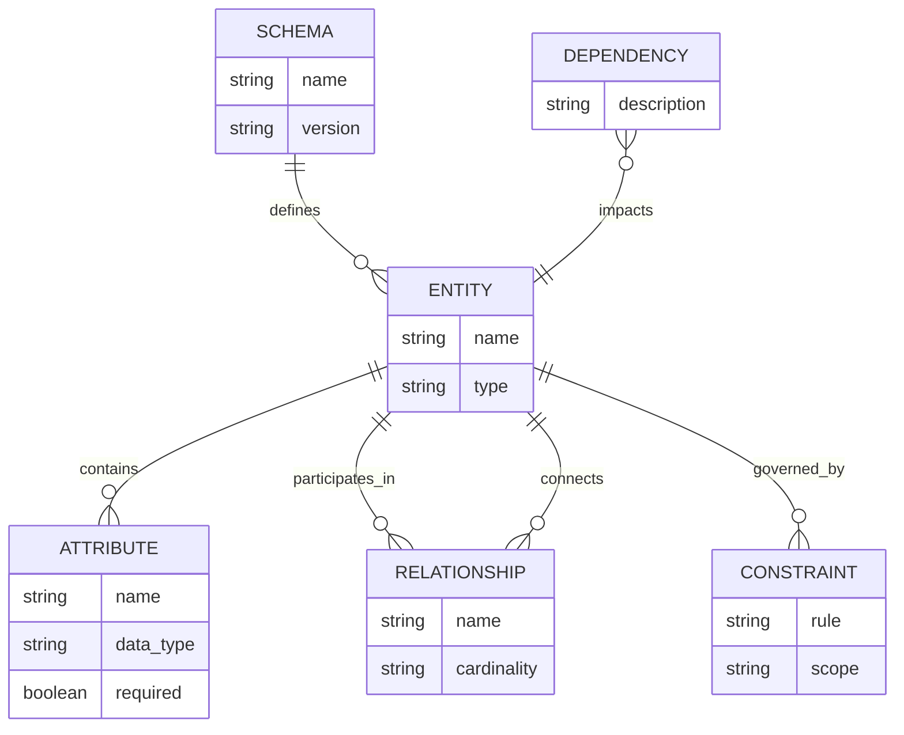


---

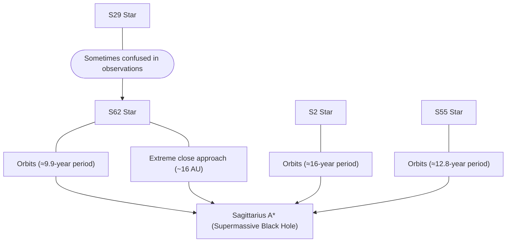

---


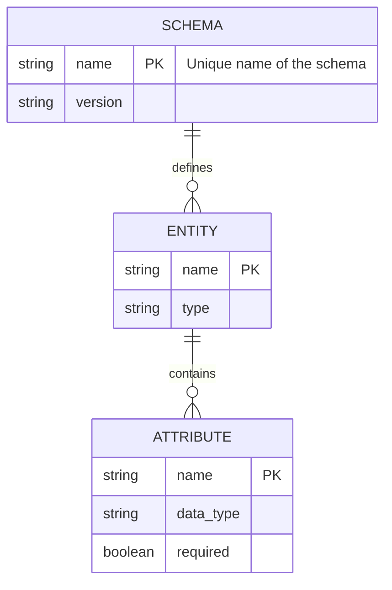


---


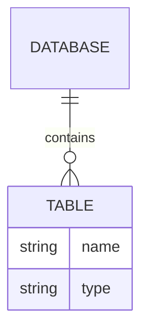

---


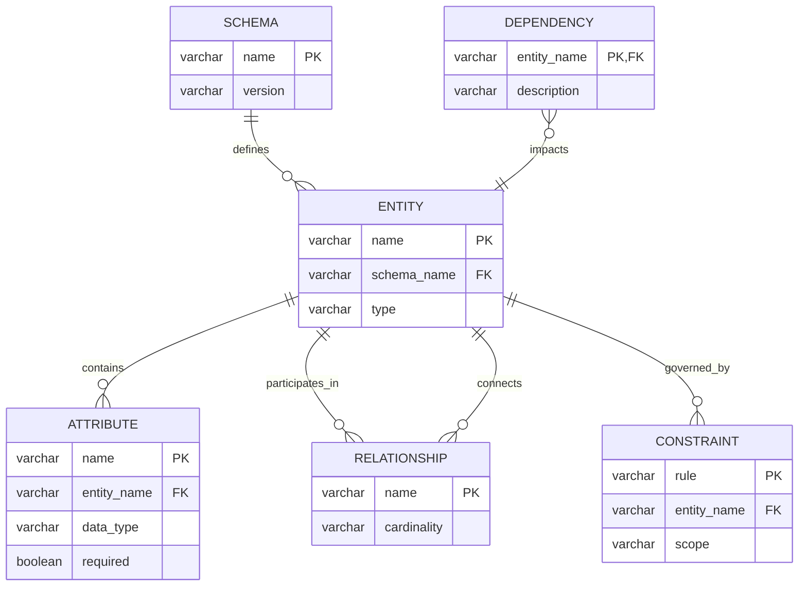

---

``` mermaid
erDiagram
  CUSTOMER {
    string name
  }
  DELIVERY-ADDRESS {
    string address
  }
  LINE-ITEM {
    string product
    int pricePerUnit
  }
  CUSTOMER ||--o{ DELIVERY-ADDRESS : uses
  CUSTOMER ||--o{ LINE-ITEM : contains
```

``` mermaid
block
columns 1
  db(("DB"))
  blockArrowId6<["&nbsp;&nbsp;&nbsp;"]>(down)
  block:ID
    A
    B["A wide one in the middle"]
    C
  end
  space
  D
  ID --> D
  C --> D
  style B fill:#969,stroke:#333,stroke-width:4px
```
    
---

``` mermaid
architecture-beta
    group api(cloud)[API]

    service db(database)[Database] in api
    service disk1(disk)[Storage] in api
    service disk2(disk)[Storage] in api
    service server(server)[Server] in api

    db:L -- R:server
    disk1:T -- B:server
    disk2:T -- B:db
```

---

``` mermaid
architecture-beta
    service left_disk(disk)[Disk]
    service top_disk(disk)[Disk]
    service bottom_disk(disk)[Disk]
    service top_gateway(internet)[Gateway]
    service bottom_gateway(internet)[Gateway]
    junction junctionCenter
    junction junctionRight

    left_disk:R -- L:junctionCenter
    top_disk:B -- T:junctionCenter
    bottom_disk:T -- B:junctionCenter
    junctionCenter:R -- L:junctionRight
    top_gateway:B -- T:junctionRight
    bottom_gateway:T -- B:junctionRight
```

---

``` mermaid
classDiagram
  Person <|-- Student
  Person <|-- Professor
  Person : +String name
  Person : +String phoneNumber
  Person : +String emailAddress
  Person : +purchaseParkingPass()
  Address "1" <-- "0..1" Person : lives at
  class Student{
    +int studentNumber
    +int averageMark
    +isEligibleToEnrol()
    +getSeminarsTaken()
  }
  class Professor{
    +int salary
  }
  class Address{
    +String street
    +String city
    +String state
    +int postalCode
    +String country
    -validate()
    +outputAsLabel()
  }
```

---

``` mermaid
classDiagram
  Person <|-- Professor
  Person : +String name
  Person : +String phoneNumber
  Person : +String emailAddress
  Person : +purchaseParkingPass()
  Address "1" --> "0..1" Person : lives at
  class Student{
s1}
  class Professor{
s2}
  class Address{
s3}
```

---

# 🖋️ Playwrite AR Guides (Arch Linux System Integration)

A summary documentation page tracking the installation, filesystem diagnostics, and OpenType rendering features for the **Playwrite AR Guides** typeface.

## 📋 Quick Status Summary
* **Package Source:** Upstream Google Fonts / TypeTogether GitHub repository.
* **Installation Scope:** Local User (`~/.local/share/fonts/PlaywriteARGuides-Regular.ttf`).
* **System Integrity:** Verified. System-wide `fc-cache` anomalies (`looped directory detected`) are identified as safe, superficial Fontconfig engine duplication warnings. Fonts are caching successfully.

---

## 🔍 System Verification & Diagnostics

### 1. Confirm Font Recognition
To verify that the system successfully registers and indexes the font family, run:
```bash
fc-list : family | grep -i "Playwrite"
```
**Expected Output:** `Playwrite AR Guides`

### 2. Suppress/Ignore Fontconfig Cache Artifacts
If `fc-cache -fv` outputs `skipping, looped directory detected` errors for `/usr/share/fonts/` subdirectories, it can be safely ignored. 
* **The Cause:** Fontconfig triggers a false-positive tracking flag during its second-pass explicit array check after completing its initial recursive filesystem scan.
* **The Proof:** Ensure the final engine line outputs: `fc-cache: succeeded`.

---

## 🛠️ Enabling Cursive Connections (OpenType Features)

Because Playwrite is a highly specialized primary school education font, it relies heavily on **OpenType feature tags** to dynamically link letters together into seamless cursive scripts. Without these features enabled, letters will appear disconnected.

### 🌐 Web & MkDocs Custom CSS
To use this font natively on a website or custom MkDocs theme, ensure you load the local file or standard web font, and explicitly declare the standard ligatures layout:

```css
.playwrite-cursive {
    font-family: 'Playwrite AR Guides', sans-serif;
    
    /* Mandatory properties for cursive script linking */
    font-feature-settings: "liga" 1, "calt" 1;
    font-variant-ligatures: common-ligatures contextual;
    
    /* Optional: Optimizes rendering speed vs legibility */
    text-rendering: optimizeLegibility;
}
```

### 📄 LibreOffice / OpenOffice
To use the font inside office suites with proper connecting lines, append the mandatory feature tags directly inside the **Font Name** selector box:

1. Click on the Font Name drop-down menu.
2. Type or change the string to exactly match this syntax:
   `Playwrite AR Guides:liga=1&calt=1`
3. Press **Enter**. The system will now actively link the characters as you type.

### 🎨 Graphic Design Tools (Inkscape / GIMP)
* **Inkscape:** Open the **Text and Font** sidebar (`Ctrl+Shift+T`), click the **Features** tab, and ensure **Standard Ligatures** (`liga`) and **Contextual Alternates** (`calt`) are ticked.
* **GIMP:** Standard ligatures are turned on by default in the text tool layer options.

## Blogs

<div class="grid cards cols-3" markdown>

-   <span style="color: #008000">:material-download:</span> **Basics Inc. Post Metadata**
    [:octicons-arrow-right-24: View Guide](https://squidfunk.github.io/mkdocs-material/tutorials/blogs/basic/){ .md-button style="border-color: #008000; color: #008000" }

    Covers basics of setting up a blog, including post metadata. (20 min)

-   <span style="color: #d93026">:material-cog:</span> **Nav, Pgn, et al. Authors**
    [:octicons-arrow-right-24: View Config](https://squidfunk.github.io/mkdocs-material/tutorials/blogs/navigation/){ .md-button style="border-color: #d93026; color: #d93026" }

    Describes how to make it easier for your readers to find content. (30 min)

-   <span style="color: #2094f3">:material-rocket-launch:</span> **Eng. and Dissemination**
    [:octicons-arrow-right-24: View Guide](https://squidfunk.github.io/mkdocs-material/tutorials/blogs/engage/){ .md-button style="border-color: #2094f3; color: #2094f3" }

    Walks you through ways of increasing engagement with your content. (30 min)

-   [:octicons-repo-template-24: Template Repository](https://github.com/mkdocs-material/create-blog)

</div>

## Social Cards

<div class="grid cards" markdown>

-   <span style="color: #008000">:material-download:</span> **Basics**
    [:octicons-arrow-right-24: View Guide](https://squidfunk.github.io/mkdocs-material/tutorials/social/basic/){ .md-button style="color: #008000 !important; border: 1px solid rgba(255,255,255,0.1); background-color: rgba(255, 255, 255, 0.05) !important;" }

    Shows how to configure MaterialX to create social cards for your content. (20 min)

-   <span style="color: #2094f3">:material-palette:</span> **Custom Cards**
    [:octicons-arrow-right-24: View Guide](https://squidfunk.github.io/mkdocs-material/tutorials/social/custom/){ .md-button style="color: #2094f3 !important; border: 1px solid rgba(255,255,255,0.1); background-color: rgba(255, 255, 255, 0.05) !important;" }

    Shows you how to design your own custom social cards. (15 min)

-   [:octicons-repo-template-24: Template Repository](https://github.com/mkdocs-material/create-social-cards)

</div>


## Social Cards

<div class="grid cards" markdown>

-   <span style="color: #008000">:material-download:</span> **Basics**
    [:octicons-arrow-right-24: View Guide](https://squidfunk.github.io/mkdocs-material/tutorials/social/basic/){ .md-button style="border-color: #008000; color: #008000" }

    Shows how to configure MaterialX to create social cards for your content. (20 min)

-   <span style="color: #2094f3">:material-palette:</span> **Custom Cards**
    [:octicons-arrow-right-24: View Guide](https://squidfunk.github.io/mkdocs-material/tutorials/social/custom/){ .md-button style="border-color: #2094f3; color: #2094f3" }

    Shows you how to design your own custom social cards. (15 min)

-   [:octicons-repo-template-24: Template Repository](https://github.com/mkdocs-material/create-social-cards)

</div>

<!-- 
---
icon: simple/amd

title: Linux GTK/WebKit Nothing Renders Checklist
description: A 2-minute diagnostic and troubleshooting tree for WebKitWebProcess crashes and Mesa/AMD rendering issues on Arch Linux.
tags:
  - webkit
search:
  keywords:
    - blank screen
    - white screen
---
-->

<div style="display: none;"><h1>Header</h1></div>

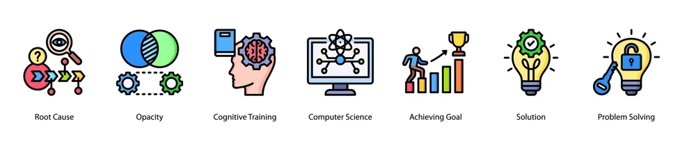{ .center-image }

<H2 style="text-align: center;"> Linux GTK/WebKit "Nothing Renders" Checklist</H2>

!!! info "Operational Diagnostic Guide"

    #### `Operational Diag Guide` {.toc-hidden-header}
    
    - An <b>`Operational Diagnostic Guide`</b> for troubleshooting instances where GTK/WebKit-based applications (e.g., *Remarkable*, *Devhelp*, *Yelp*, *GNOME Help*) launch successfully but render a completely blank content pane.
    
---

### ⚡ Quick Triage (The 2-Minute Version)

!!! deep-dive "Quick Triage"

    - Before executing the full diagnostic tree, run these four commands to immediately isolate the root cause.
    
    ```bash { .sh .no-copy }
    pkill WebKitWebProcess
    
    fc-match monospace
    
    coredumpctl list WebKitWebProcess | tail
    
    LIBGL_ALWAYS_SOFTWARE=1 devhelp
    ```
    
### 🔍 Immediate Indicator Matrix

| Diagnostic Signal | Identified Subsystem | Immediate Action |
| :--- | :--- | :--- |
| **`pkill` resolves issue** | Stale Render Process | Document incident; restart application. |
| **`fc-match` fails/hangs** | Font Config Subsystem | Proceed directly to **Step 5 (Cache Reset)**. |
| **`coredumpctl` shows fresh logs** | WebKit Core Crash | Proceed to **Step 2 (Crash Analysis)**. |
| **`LIBGL` variable resolves issue** | GPU / Mesa Driver | Proceed to **Step 6 (Hardware Isolation)**. |

!!! success "Core Diagnostic Rule"
    If multiple WebKitGTK applications suddenly render blank content simultaneously, suspect the **shared WebKit rendering stack** before troubleshooting the individual applications.

---

## 🎮 Cross-Hardware Graphics Triage

!!! grey "Cross-Hardware Graphics Triage"

    When an application works under `LIBGL_ALWAYS_SOFTWARE=1`, the issue lies within your hardware acceleration pipeline. Select your active GPU architecture below to run targeted environment overrides before resorting to full software fallback.
    
    === "AMD Radeon (My Setup)"

        Because you are running an **AMD Radeon RX 580** via the open-source Mesa drivers, rendering issues are often caused by WebKit fighting with hardware acceleration, WebGL, or driver compilation layers. 

        *   **Disable GPU Sandboxing (WebKit Flag)**
            ```bash
            devhelp --disable-gpu-sandbox
            ```
            *Use Case:* WebKit's security sandbox often clashes with AMD driver memory allocation. If this works, the issue is sandboxing, not your GPU.
        *   **Bypass Driver Shaders (Mesa Toggles)**
            ```bash
            R600_DEBUG=nocall devhelp
            # OR (For newer Vulkan-based WebKit paths)
            RADV_DEBUG=nocache devhelp
            ```
            *Use Case:* Disables specific hardware-level optimization steps in the AMD driver to see if a driver bug is misdrawing the app window.
        *   **Disable Compositing Mode**
            ```bash
            WEBKIT_DISABLE_COMPOSITING_MODE=1 devhelp
            ```
            *Use Case:* Forces WebKit to draw the window layout using standard rendering instead of hardware acceleration, bypassing deep driver layers entirely.

    === "Nvidia GeForce"

        The proprietary Nvidia driver stack utilizes a completely different rendering path than Mesa. WebKit failures here usually relate to GLX contexts, thread management, or power-saving states.

        *   **Force Legacy GLX Indirect Rendering**
            ```bash
            __GLX_FORCE_VENDOR_LIBRARY_0=1 devhelp
            ```
            *Use Case:* Bypasses Nvidia's direct rendering infrastructure if there is a context mismatch between GTK and the display server.
        *   **Disable Threaded Optimizations**
            ```bash
            __GL_THREADED_OPTIMUS=0 devhelp
            ```
            *Use Case:* Resolves timing-related race conditions where WebKit threads collapse while communicating with the Nvidia binary driver.
        *   **Force WebKit WebGL Disabling**
            ```bash
            WEBKIT_DISABLE_DMABUF_RENDERER=1 devhelp
            ```
            *Use Case:* Fixes blank screens on Nvidia setups caused by broken DMA-BUF memory sharing protocols between the GPU and WebKit processes.

    === "Intel Iris / Arc"

        Intel graphics rely heavily on the modern `iris` driver within Mesa. Under production stress, it can experience severe rendering sync drops or memory caching faults.

        *   **Force Older Intel Driver Generation**
            ```bash
            MESA_LOADER_DRIVER_OVERRIDE=i965 devhelp
            ```
            *Use Case:* Forces the system to fall back from the modern Iris driver to the mature, stable legacy i965 driver path.
        *   **Disable Performance Cache Compilations**
            ```bash
            INTEL_DEBUG=nocache devhelp
            ```
            *Use Case:* Instructs the Intel driver to bypass the internal shader cache, clearing up pipeline errors caused by corrupted system shader trees.


## 📋 Comprehensive Diagnostic Steps

### Step 0 — Isolate Scope

!!! grey "Isolate Scope"

    Determine if the rendering failure is isolated or system-wide by testing at least two independent WebKit applications (e.g., `remarkable` and `devhelp`).

    === "Step 0 Execution"

        Run the following test suite in your terminal:
        ```bash
        remarkable & devhelp &
        ```

    === "Scope Analysis"


        | Observation | Diagnostic Deductible | Operational Focus |
        | :--- | :--- | :--- |
        | **One application broken** | App-Specific Configuration Error | Check local app configs, dotfiles, or extensions. |
        | **Both applications broken** | Shared Stack Corruption | Target shared libraries (WebKit, GTK, Fonts, GPU). |


{ .center-image }

### Step 1 — Check for WebKit Crashes

!!! grey "Check for Webkit Crashes"

    Inspect the system core dump manager to verify if the underlying WebKit process is actively terminating.
    
    ```bash { .sh .no-copy }
    coredumpctl list WebKitWebProcess
    ```
    
!!! bug "Analysis of Outputs"
    If fresh entries are populated in the list, extract the specific crash metadata using the Process ID (`PID`):
    ```bash { .sh .no-copy }
    coredumpctl info <PID>
    ```
    *   **Critical Signal to Look For:** `Signal: 6 (ABRT)` or any explicit `WebKitWebProcess` failure tracking.
    *   **Verdict:** If present, the WebKit engine itself is unstable. Proceed to package integrity validation.

---

### Step 2 — Trace Terminal Standard Outputs

!!! grey "Trace Terminal Standard Outputs"

    Launch the affected application directly from an active terminal session to capture real-time stdout and stderr diagnostic streams.
    
    ```bash { .sh .no-copy }
    devhelp
    # OR
    remarkable
    ```
    
!!! danger "Error Signature Branching"
    *   **Signature:** `Segmentation fault`
        👉 **Verdict:** Memory corruption or binary incompatibility. Skip rendering checks; review system memory or package versions.
    *   **Signature:** References to `GLib`, `WebKit`, or `JavaScriptCore`
        👉 **Verdict:** Broken rendering stack. Proceed with the checklist sequentially.

---

### Step 3 — Terminate Stale WebKit Renderers

!!! grey "Terminate Stale WebKit Renderers"

    Stale background rendering processes can lock shared resources and prevent new instances from drawing GUI surfaces.
    
    ```bash { .sh .no-copy }
    pkill WebKitWebProcess
    ```
    
!!! success "Validation"
    Relaunch the target application. If the interface renders correctly, a stale or orphaned renderer state was blocking execution. 

---

### Step 4 — Verify Font Subsystem Integrity

!!! grey "Verify Font Subsystem Integrity"

    A corrupted, missing, or hanging system font configuration can completely block text-heavy WebKit canvas initialization.
    
    ```bash { .sh .no-copy }
    fc-match monospace
    
    fc-list | head
    ```
    
!!! info "Output Evaluation"
    *   **Positive Indicators:** Clean, instant stdout mapping to local fonts (e.g., `Noto Sans`, `DejaVu`).
    *   **Negative Indicators:** Missing output, explicitly logged errors, or a terminal hang. Proceed immediately to Step 5.

---

### Step 5 — Rebuild Font Subsystem Caches

!!! grey "Rebuild Font Subsystem Caches"

    Force a complete purge and regeneration of the font configuration binaries. Execute this if Step 4 yielded any anomalies.
    
    ```bash { .sh .no-copy }
    rm -rf ~/.cache/fontconfig
    
    fc-cache -rv
    ```
    
!!! recommendation "Post-Execution Action"
    Relaunch your WebKit applications to verify if the fresh font map resolves the rendering block.

---

### Step 6 — Isolate GPU and Mesa Driver Conflicts

!!! recommendation "Isolate GPU and Mesa Driver Conflicts"

    Determine if hardware acceleration or the graphics driver stack is causing rendering failures by forcing a pure software rendering fallback.
    
    ```bash { .sh .no-copy }
    LIBGL_ALWAYS_SOFTWARE=1 devhelp
    # OR
    LIBGL_ALWAYS_SOFTWARE=1 remarkable
    ```
    
!!! info "Deductible Outcomes"
    *   **Resolved:** A direct incompatibility exists between the user-space driver, kernel GPU module, and WebKit's hardware pipeline. Move to the **Cross-Hardware Graphics Triage** section to find an architectural workaround.
    *   **Unchanged:** The hardware acceleration pipeline is highly unlikely to be the root cause.

---

### Step 7 — Validate Package Integrity

!!! grey "Validate Package Integrity"

    Verify that the shared WebKit libraries and components are complete, uncorrupted, and synchronized via `pacman`.
    
    
    **Verify versions**
    
    ```bash
    pacman -Q webkit2gtk-4.1 javascriptcoregtk-4.1
    ```
    
    **Verify file hashes and permissions**
    
    ```bash
    pacman -Qkk webkit2gtk-4.1
    ```
    
!!! danger "Package Discrepancies"
    Look closely for warnings concerning **Missing files**, **Modified files**, or **Partial upgrades**. If any are found, force-reinstall the packages:
    ```bash
    sudo pacman -S webkit2gtk-4.1 javascriptcoregtk-4.1
    ```

---

### Step 8 — Query System Logs for Component Failures

!!! grey "Query System Logs for Component Failures"

    Filter user and system journals specifically for WebKit engine events generated during the current boot cycle.
    
    ```bash
    journalctl -b --user | grep -i webkit
    ```
    
    ```bash
    journalctl -b | grep -i webkit
    ```
    
!!! abstract "Log Analysis"
    This step regularly surfaces hidden segmentation faults, pointer errors, or system library linkage omissions not printed to the application's standard terminal output.

---

### Step 9 — Isolate Local User Profile Corruption

!!! grey "Isolate Local User Profile Corruption"

    Determine if the root cause resides within user configuration directories (`~/.config`, `~/.local`) or is a persistent system-wide fault.
    
    ```bash
    sudo useradd -m testwebkit
    ```
    
    ```bash
    sudo passwd testwebkit
    ```
    
!!! abstract "Test Protocol"
    1. Log out of your desktop environment.
    2. Log in as the newly created `testwebkit` user profile.
    3. Execute `devhelp` from a terminal window.


    | Result Profile | Root Cause Domain |
    | :--- | :--- |
    | **Interface Renders Successfully** | Dotfile/Cache corruption within your primary home directory. |
    | **Interface Remains Blank** | System-wide package, library, or hardware driver failure. |

---

### Step 10 — Nuclear User Cache Reset

!!! grey "Nuclear User Cache Reset"

    If Step 9 proved the issue is isolated to your primary user profile, execute a complete clearance of local transient caches.
    
    ```bash
    rm -rf ~/.cache/*
    ```
    
!!! warning "Precautionary Step"
    Ensure all work is saved. Log completely out of your desktop session, then log back in to force all background user processes to re-initialize clean caches.

---

## 📝 Incident Data Collection Protocol

!!! grey "Incident Data Collection Protocol"

    When anomalous rendering behaviors occur, immediately dump the system state metrics. Preserving this timeline context prevents trial-and-error debugging later.
    
    <b>`Capture operational snapshot`</b>
        
    ```bash
    date > issue.log
    ```
    
    ```bash
    uname -a >> issue.log
    ```
    
    ```bash
    pacman -Q webkit2gtk-4.1 javascriptcoregtk-4.1 mesa >> issue.log
    ```
    
    <b>`Extract the recent delta of the system log`</b>
        
    ```bash
    journalctl -b --since "10 minutes ago" >> issue.log
    ```
    
---

!!! abstract "Lessons Learned Notebook"
    *Always record the exact packages updated in the transaction preceding a WebKit crash event. Correlating package rollouts to application behavior reduces diagnostic mazes into predictable, 2-minute resolutions.*
    
{ .center-image }

[👉 Advanced-Configuration  :fontawesome-solid-paper-plane:](MkDocs-Material-Start.md/#advanced-configuration){ .md-button .md-button--custom }

!!! recommendation "⚖️"

    <b>`Content Tabs`</b>
     
    ---
    
    === "Unordered list"
    
        * First Normal Form (1NF)
        * Second Normal Form (2NF)
        * Third Normal Form (3NF)
        
    === "Ordered list"
    
        1. HTML5 (Structure)
        2. CSS3 (Styling)
        3. JavaScript (Behavior)
    

!!! heart "Power Bus Results"

    The power flow bus results are defined as:
    
    ---
    
    $\begin{aligned}
    &vm\_pu_{phase} = \lvert \underline{V_{phase}}_{bus} \rvert \\
    &va\_degree_{phase} = \angle \underline{V_{phase}}_{bus} \\
    &p\_mw_{phase} = Re(\sum_{n=1}^N  \underline{S_{phase}}_{bus, n}) \\
    &q\_mvar_{phase} = Im(\sum_{n=1}^N  \underline{S_{phase}}_{bus, n})
    \end{aligned}$


!!! heart "Power Bus Results"

    $\begin{aligned}
    &vm\_pu_{phase} = \lvert \underline{V_{phase}}_{bus} \rvert \\
    &va\_degree_{phase} = \angle \underline{V_{phase}}_{bus} \\
    &p\_mw_{phase} = Re(\sum_{n=1}^N  \underline{S_{phase}}_{bus, n}) \\
    &q\_mvar_{phase} = Im(\sum_{n=1}^N  \underline{S_{phase}}_{bus, n})
    \end{aligned}$
    
!!! heart "`net.res_bus`"

    $\begin{align*}
    &vm\_pu = \lvert \underline{V}_{bus} \rvert \\
    &va\_degree = \angle \underline{V}_{bus} \\
    &p\_mw = Re(\sum_{n=1}^N  \underline{S}_{bus, n}) \\
    &q\_mvar = Im(\sum_{n=1}^N  \underline{S}_{bus, n})
    \end{align*}$
    
!!! desc "`Power Equation`"

    The power equation in each phase is therefore given as $S_{ph-e} = \frac{V_{ph-ph} \cdot I_{ph-ph}}{\sqrt3 }$
    
    $\begin{align*}
    S_{ph-e} = \frac{V_{ph-ph} \cdot I_{ph-ph}}{\sqrt3 }
    \end{align*}$
    
# MathJax & MaterialX Configuration Summary

A complete, neat summary of everything finalized for the MaterialX for MkDocs (v9.7.0) site.

## 1. Updated JavaScript Configuration File
Replace the entire contents of your `javascripts/mathjax.js` file with this clean, optimized version. It fixes the trailing pipe regex bug, preserves your dynamic page-switching hooks, and forces your single-click zoom layout for everyone sitewide.

??? desc "MathJax .js config"

    ```javascript
    window.MathJax = {
      tex: {
        inlineMath: [["\\(", "\\)"]],
        displayMath: [["\\[", "\\]"]],
        processEscapes: true,
        processEnvironments: true
      },
      options: {
        ignoreHtmlClass: ".*", // FIXED: Cleaned up the trailing pipe '|' to prevent parsing bugs
        processHtmlClass: "arithmatex",
        
        // LOCKS USER ZOOM PREFERENCES SITEWIDE FOR ALL VISITORS
        menuOptions: {
          settings: {
            zoom: 'Click',     // Forces a simple left-mouse click to trigger the zoom window
            zscale: '200%'     // Sets the default zoom scaling level to 200%
          }
        }
      }
    };

    // CRITICAL FOR MATERIALX / MKDOCS: Handles dynamic theme changes and SPA page switches
    document\$.subscribe(() => { 
      MathJax.startup.output.clearCache()
      MathJax.typesetClear()
      MathJax.texReset()
      MathJax.typesetPromise()
    })
    ```

## 2. Streamlined mkdocs.yml Settings
Configuration blocks are clean and perfectly structured. Active components load immediately, while unused options are safely preserved as plain comments for future reference without causing layout compile errors:

??? desc "`yaml restructure`"

    ```yaml
    extra_css:
      # Future Reference (KaTeX Toggle):
      # https://unpkg.com/katex@0/dist/katex.min.css
      - styles/custom.css
    
    extra_javascript:
      - javascripts/mathjax.js
      - javascripts/expand-code.js
      - https://unpkg.com/mathjax@3/es5/tex-mml-chtml.js
      # Future Reference (MathJax Toggles):
      # https://cdn.jsdelivr.net/npm/mathjax@3/es5/tex-mml-chtml.js
      - javascripts/theme_extra.js
      # Future Reference (KaTeX Toggles):
      # javascripts/katex.js
      # https://unpkg.com/katex@0/dist/katex.min.js
      # https://unpkg.com/katex@0/dist/contrib/auto-render.min.js
      - https://unpkg.com/tablesort@5.3.0/dist/tablesort.min.js
      - https://unpkg.com/tablesort@5.3.0/dist/sorts/tablesort.number.min.js
      - javascripts/tablesort.js
      - javascripts/iconsearch.js
    ```

## 3. Page Layout Cheat Sheet (The 3 Math Situations)

Use these exact Markdown syntax patterns depending on the alignment and sizing goals for page sections:

!!! desc "Situation 1"

    **Situation 1: Inline Math (Inside a Text Sentence)**
    
    * **Goal:** Blend equations directly into sentences without disrupting regular line heights.
    * **How to write it:** Use single dollar signs (`$`) on the same line as your text.

    !!! desc "Rogers-Ramanujan Identity 1"

        Placed inside a sentence,  $1 + \frac{q^2}{(1-q)} + \frac{q^6}{(1-q)(1-q^2)} + \dots = \prod_{j=0}^{\infty} \frac{1}{(1-q^{5j+2})(1-q^{5j+3})}, \quad \text{for } |q| < 1$ this is what a Rogers-Ramanujan Identity looks like.


!!! desc "Situation 1"

    **Situation 1: Inline Math (Inside a Text Sentence)**
    
    * **Goal:** Blend equations directly into sentences without disrupting regular line heights.
    * **How to write it:** Use single dollar signs (`$`) on the same line as your text.

    !!! desc "Inline Equation Example"

        The famous Euler identity, $e^{i\pi} + 1 = 0$, connects five fundamental mathematical constants seamlessly within a single sentence.


!!! desc "Situation 2"

    **Situation 2: Left-Aligned Display Math (Full Sized)**
    
    * **Goal:** Display mathematical symbols at full scale (large fractions, stacked summation/product symbols) but align them neatly with your left text margin.
    * **How to write it:** Put your formula on a new line, open with a single `$`, and immediately lead with `\displaystyle`.

    !!! desc "Rogers-Ramanujan Identity 2"

        A Rogers-Ramanujan Identity:
    
        $\displaystyle 1 + \frac{q^2}{(1-q)} + \frac{q^6}{(1-q)(1-q^2)} + \dots = \prod_{j=0}^{\infty} \frac{1}{(1-q^{5j+2})(1-q^{5j+3})}, \quad \text{for } |q| < 1$

!!! desc "Situation 3"

    **Situation 3: Centered Display Math (Standalone)**
    
    * **Goal:** Give highly important formulas full breathing room by centering them standalone on their own structural block.
    * **How to write it:** Isolate the equation completely on its own line wrapped in double dollar signs (`$$`).

    !!! desc "Rogers-Ramanujan Identity 3"

        A Rogers-Ramanujan Identity:

        $$
        1 + \frac{q^2}{(1-q)} + \frac{q^6}{(1-q)(1-q^2)} + \dots = \prod_{j=0}^{\infty} \frac{1}{(1-q^{5j+2})(1-q^{5j+3})}, \quad \text{for } |q| < 1
        $$


## The Chandrasekhar Limit & Supernova Catalysts

### 🌌 The Chandrasekhar Limit

!!! tldr "The Chandrasekhar Limit"

    The Chandrasekhar limit is the maximum mass a white dwarf star can support against its own gravity.
    
    * **The Threshold:** Exactly **1.44 solar masses**.
    * **The Mechanism:** Electron degeneracy pressure provides the outward push.
    * **The Trigger:** Exceeding this mass destroys the star's structural equilibrium.
    * **The Outcome:** Runaway carbon fusion triggers a catastrophic **Type Ia supernova**.
    
### 🔥 Core-Collapse Candidates

Massive, active stars bypass the white dwarf stage entirely and end their lives in violent collapses.
* **The Threshold:** Stars born with at least **8 to 10 solar masses**.
* **The Mechanism:** Iron buildup in the core stops energy production.
* **The Trigger:** Gravity instantly crushes the unsupported core.
* **The Outcome:** A violent rebound flings the outer layers into a **Type II, Ib, or Ic supernova**.
* **The Targets:** Red and blue supergiants like **Betelgeuse** and **Antares** are prime active candidates.

## Next Steps to Explore

### 1. Core Fusion Sequences

* Track how massive stars transition from burning Hydrogen to Helium.
* Explore the creation of heavy cosmic elements up to Iron.

### 2. Supernova Classification

* Learn how light spectrums differentiate Type Ia from core-collapse explosions.
* Discover why the presence or absence of Hydrogen lines matters to astronomers.

### 3. Supergiant Life Cycles

* Examine the final, volatile evolutionary stages of massive stars.
* See how stellar winds and mass loss affect their ultimate explosive fate.

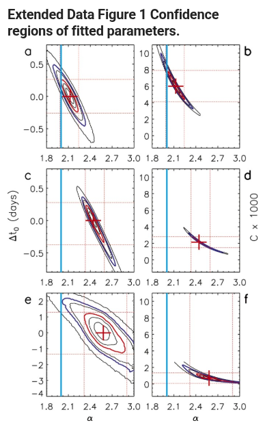

### Customised Tables

!!! heart ""
    Please note that ALL tables below are rendered 1st, with the collapsed admonition BELOW it, containing the `markdown code` within a `code box`.
    
#### Basic Table {.toc-hidden-header}

First Header  | Second Header
------------- | -------------
Content Cell  | Content Cell

??? grey "Basic Table - Click To See Code"

    ```bash
    First Header  | Second Header
    ------------- | -------------
    Content Cell  | Content Cell
    ```

#### Alignment Table {.toc-hidden-header}
    
| Item      | Value  |
| :-------: | -----: |
| Centered  | Right  |

??? grey "Alignment - Click To See Code"

    ```bash
    | Item      | Value  |
    | :-------: | -----: |
    | Centered  | Right  |
    ```

#### Column Spanning {.toc-hidden-header}
    
|            | Grouping ||
| Header     | A        | B        |
| ---------- | :------: | -------: |
| Data       | spans    ||

??? grey "Column Spanning - Click To See Code"

    ```bash
    |            | Grouping ||
    | Header     | A        | B        |
    | ---------- | :------: | -------: |
    | Data       | spans    ||
    ```

#### Row Spanning {.toc-hidden-header}

| A      | B  | C  |
| ------ | -- | -- |
| tall   | 1  | x  |
| ^^     | 2  | y  |

??? grey "Row Spanning `(rowspan: true)` - Click To See Code"

    ```bash
    | A      | B  | C  |
    | ------ | -- | -- |
    | tall   | 1  | x  |
    | ^^     | 2  | y  |
    ```

#### Caption With Label {.toc-hidden-header}
    
[Sales Data][sales]
| Q1   | Q2   |
| ---- | ---- |
| R100 000  | R120 000  |

??? grey "Caption With Label - Click To See Code"

    ```bash
    [Sales Data][sales]
    | Q1   | Q2   |
    | ---- | ---- |
    | R100 000  | R120 000  |
    ```
    
#### Multiline Cells {.toc-hidden-header}

| Code            | Output  |
| --------------- | ------- |
| ```python      |         |\
| print("hello") | hello   |\
| ```            |         |

??? grey "Multiline Cells `(multiline: true)` - Click To See Code"

    ```bash
    | Code            | Output  |
    | --------------- | ------- |
    | ```python      |         |\
    | print("hello") | hello   |\
    | ```            |         |
    ```
    
#### Headerless Table {.toc-hidden-header}

| -------- | ----- |
| No header| here  |

??? grey "Headerless Table `(headerless: true)` - Click To See Code"

    ```bash
    | -------- | ----- |
    | No header| here  |
    ```
    
#### Attribute Lists Cells Rows {.toc-hidden-header}

| Header                        |
| ----------------------------- |
| plain cell                    |
| styled cell {.highlight}      |
| id cell {#cell-1}             |
| full {#c2 .bold data-x="1"}   |

??? grey "Attribute Lists on Cells and Rows `(attr_list: true)` - Click To See Code"

    ```bash
    | Header                        |
    | ----------------------------- |
    | plain cell                    |
    | styled cell {.highlight}      |
    | id cell {#cell-1}             |
    | full {#c2 .bold data-x="1"}   |
    ```
    
#### Row Attributes - append {.toc-hidden-header}

| A | B |
| - | - |
| x | y |{.even}
| p | q |{.odd #row-2}

??? grey "Row Attributes - append `{…}` after the last `|` of a row: Click To See Code"

    ```bash
    | A | B |
    | - | - |
    | x | y |{.even}
    | p | q |{.odd #row-2}
    ```
    
#### Cell Row Attribs used together {.toc-hidden-header}

| H                  |
| ------------------ |
| cell {.myclass} |{.myrow}


??? grey "Combined Cell and Row Attribs can be used together - Click To See Code"

    ```bash
    | H                  |
    | ------------------ |
    | cell {.myclass} |{.myrow}
    ```
    
#### Multiline {.toc-hidden-header}

|   Markdown   | Rendered HTML |
|--------------|---------------|
|    *Italic*  | *Italic*      | \
|              |               |
|    - Item 1  | - Item 1      | \
|    - Item 2  | - Item 2      |
|    ```python | ```python       \
|    .1 + .2   | .1 + .2         \
|    ```       | ```           |

??? grey "Multiline"

    ```bash
    |   Markdown   | Rendered HTML |
    |--------------|---------------|
    |    *Italic*  | *Italic*      | \
    |              |               |
    |    - Item 1  | - Item 1      | \
    |    - Item 2  | - Item 2      |
    |    ```python | ```python       \
    |    .1 + .2   | .1 + .2         \
    |    ```       | ```           |
    ```
    
#### Rowspan {.toc-hidden-header}

Stage | Direct Products | ATP Yields
:---- | --------------: | ---------:
Glycolysis: Fundamental Metabolic pathway breaks down Glucose into two molecules of Pyruvate. | 2 ATP ||
^^ | 2 NADH | 3--5 ATP |
Pyruvate Oxidation | 2 NADH | 5 ATP |
Citric Acid Cycle | 2 ATP ||
^^ | 6 NADH | 15 ATP |
^^ | 2 FADH2 | 3 ATP |
**30--32** ATP |||
[Net ATP yields per hexose]

??? grey "Rowspan"

    ```bash
    Stage | Direct Products | ATP Yields
    ----: | --------------: | ---------:
    Glycolysis | 2 ATP ||
    ^^ | 2 NADH | 3--5 ATP |
    Pyruvate oxidation | 2 NADH | 5 ATP |
    Citric acid cycle | 2 ATP ||
    ^^ | 6 NADH | 15 ATP |
    ^^ | 2 FADH2 | 3 ATP |
    **30--32** ATP |||
    [Net ATP yields per hexose]
    ```
    
#### Headerless 2 {.toc-hidden-header}

|--|--|--|--|--|--|--|--|
|♜|  |♝|♛|♚|♝|♞|♜|
|  |♟|♟|♟|  |♟|♟|♟|
|♟|  |♞|  |  |  |  |  |
|  |♗|  |  |♟|  |  |  |
|  |  |  |  |♙|  |  |  |
|  |  |  |  |  |♘|  |  |
|♙|♙|♙|♙|  |♙|♙|♙|
|♖|♘|♗|♕|♔|  |  |♖|

??? grey "Headerless"

    ```bash
    |--|--|--|--|--|--|--|--|
    |♜|  |♝|♛|♚|♝|♞|♜|
    |  |♟|♟|♟|  |♟|♟|♟|
    |♟|  |♞|  |  |  |  |  |
    |  |♗|  |  |♟|  |  |  |
    |  |  |  |  |♙|  |  |  |
    |  |  |  |  |  |♘|  |  |
    |♙|♙|♙|♙|  |♙|♙|♙|
    |♖|♘|♗|♕|♔|  |  |♖|
    ```
    
[👉 Advanced-Configuration  :fontawesome-solid-paper-plane:](MkDocs-Material-Start.md/#advanced-configuration){ .md-button .md-button--custom }

``` markdown hl_lines="2" title="Data table, columns aligned to left"
| Method      | Description                          |
| :---------- | :----------------------------------- |
| `GET`       | :material-check:     Fetch resource  |
| `PUT`       | :material-check-all: Update resource |
| `DELETE`    | :material-close:     Delete resource |
```

<div class="result" markdown>

| Method      | Description                          |
| :---------- | :----------------------------------- |
| `GET`       | :material-check:     Fetch resource  |
| `PUT`       | :material-check-all: Update resource |
| `DELETE`    | :material-close:     Delete resource |

</div>

``` markdown hl_lines="2" title="Data table, columns centered"
| Method      | Description                          |
| :---------: | :----------------------------------: |
| `GET`       | :material-check:     Fetch resource  |
| `PUT`       | :material-check-all: Update resource |
| `DELETE`    | :material-close:     Delete resource |
```

<div class="result" markdown>

| Method      | Description                          |
| :---------: | :----------------------------------: |
| `GET`       | :material-check:     Fetch resource  |
| `PUT`       | :material-check-all: Update resource |
| `DELETE`    | :material-close:     Delete resource |

</div>

``` markdown hl_lines="2" title="Data table, columns aligned to right"
| Method      | Description                          |
| ----------: | -----------------------------------: |
| `GET`       | :material-check:     Fetch resource  |
| `PUT`       | :material-check-all: Update resource |
| `DELETE`    | :material-close:     Delete resource |
```

<div class="result" markdown>

| Method      | Description                          |
| ----------: | -----------------------------------: |
| `GET`       | :material-check:     Fetch resource  |
| `PUT`       | :material-check-all: Update resource |
| `DELETE`    | :material-close:     Delete resource |

</div>

| Method      | Description                          |
| ----------- | ------------------------------------ |
| `GET`       | :material-check:     Fetch resource  |
| `PUT`       | :material-check-all: Update resource |
| `DELETE`    | :material-close:     Delete resource |

---

### 🚀 Afridyne Systems: GitHub Pages Deployment Blueprint


!!! desc

    Follow this step-by-step guide to completely reset your repository and configure automated Markdown building via GitHub Actions.
    
---

### Part 1: Organize Your Local Backup Directory

!!! git "Local Project Root"

    Ensure your local project root directory matches this exact structure. Note that files like `mathjax.js` must live inside the `docs/` subdirectory.
    
    
    ```text
    Afridyne-Systems/ (Your local project root)
    ├── .github/
    │   └── workflows/
    │       └── deploy.yml
    ├── docs/
    │   ├── index.md
    │   ├── MathJax.md
    │   ├── [your other .md files/folders...]
    │   └── javascripts/
    │       └── mathjax.js
    └── mkdocs.yml
    ```
    
---

### Part 2: Configuration & Asset Code Files

###### 📂 File 1: `mkdocs.yml`

!!! abstract "`mkdocs.yml`"

    Place this in your **project root folder**. Make sure the `site_url` points to your project subfolder.
    
    ```yaml
    site_url: https://github.io
    site_name: Afridyne Systems Documentation
    
    theme:
      name: material  # Swap to 'materialx' if using the specific MaterialX package
    
    extra_javascript:
      - javascripts/mathjax.js
      - https://unpkg.com
    ```
    
###### 📂 File 2: `docs/javascripts/mathjax.js`

??? desc "`mathjax.js` `Click To See Code`"

    Place this inside your **`docs/javascripts/`** directory. It contains the Material lifecycles and your specific user menu preferences.

    ```javascript
    window.MathJax = {
      tex: {
        inlineMath: [["\\(", "\\)"]],
        displayMath: [["\\[", "\\]"]],
        processEscapes: true,
        processEnvironments: true
      },
      options: {
        ignoreHtmlClass: ".*",
        processHtmlClass: "arithmatex",
        menuOptions: {
          settings: {
            zoom: 'Click',     // Locks left-mouse click as the zoom trigger
            zscale: '200%'     // Zoom scale default
          }
        }
      }
    };

    // Lifecycles for Material theme SPA dynamic page loading switching
    document\$.subscribe(() => { 
      if (typeof MathJax !== "undefined" && MathJax.startup) {
        MathJax.startup.output.clearCache();
        MathJax.typesetClear();
        MathJax.texReset();
        MathJax.typesetPromise();
      }
    });
    ```


###### 📂 File 3: `.github/workflows/deploy.yml`

??? desc "`deploy.yml` `Click To See Code`"

    Place this exactly in the subfolder path **`.github/workflows/`** relative to your project root. This manages your compiler.
    
    ```yaml
    name: ci
    on:
      push:
        branches:
          - main

    permissions:
      contents: write

    jobs:
      deploy:
        runs-on: ubuntu-latest
        steps:
          - uses: actions/checkout@v4
          
          - uses: actions/setup-python@v5
            with:
              python-version: 3.x
              
          - run: echo "cache_id=\((date +\%Y\%m\%d)" >> \)GITHUB_ENV
          
          - uses: actions/cache@v4
            with:
              key: mkdocs-materialx-\${{ env.cache_id }}
              path: .cache

          - name: Install pngquant system package
            run: sudo apt-get update && sudo apt-get install -y pngquant

          # Sets up uv cleanly on GitHub Actions
          - name: Install uv
            uses: astral-sh/setup-uv@v5

          # Installs every plugin and MaterialX using uv straight from your requirements.txt
          - name: Install MaterialX Dependencies
            run: |
              uv pip install --system --upgrade pip
              uv pip install --system -r requirements.txt

          - run: mkdocs build --clean
          
          - run: sed -i 's|/assets/local_icons/|/Afridyne-Systems/assets/local_icons/|g' site/search/search_index.json site/assets/javascripts/*.js 2>/dev/null || true
          
          - uses: peaceiris/actions-gh-pages@v4
            with:
              github_token: \${{ secrets.GITHUB_TOKEN }}
              publish_dir: ./site
    ```

---

### Part 3: Clear and Recreate the Repository

#### Step 1: Nuke the old GitHub Repo

!!! desc "Nuke the old GitHub Repo"

    1. Go to your repo at `https://github.com`.
    2. Click **Settings** (the gear icon on the top tab row).
    3. Scroll all the way down to the bottom **Danger Zone**.
    4. Click **Delete this repository**.
    5. Type out the required repository path confirmation string and authorize the deletion.
    
#### Step 2: Create a Fresh Repository

!!! desc "Create a Fresh Repository"

    1. On GitHub, click **New repository** (or go to `https://github.com`).
    2. Name it exactly: `Afridyne-Systems`.
    3. Set visibility to **Public**.
    4. **CRITICAL:** Do NOT initialize with a README, `.gitignore`, or License. Keep it completely empty.
    5. Click **Create repository**.
    
---

### Part 4: Push Your Backup Files (Terminal Actions)

!!! desc "Push Your Backup Files (Terminal Actions)"

    Open your terminal or command prompt, navigate into your clean local project backup root directory (`Afridyne-Systems/`), and run these commands to push your project files for the first time:
    
    ```bash
    1. Initialize a clean git tree local tracker.
       git init
    
    2. Add all local files (docs/, .github/, mkdocs.yml) into stage tracking.
       git add
    
    3. Commit your changes.
       git commit -m "Initial automated MkDocs structure setup"
    
    4. Target the main default branch.
       git branch -M main
    
    5. Link your local project directory to your new remote GitHub repository.
       git remote add origin https://github.com.git
    
    6. Push to main (this will automatically launch the GitHub Actions compiler!).
       git push -u origin main
    ```
    
---

### Part 5: One-Time GitHub Pages Setup (Web Dashboard)

!!! desc "One-Time GitHub Pages Setup (Web Dashboard)"

    Once you push your code, the GitHub Action workflow will compile your site and automatically generate a background branch named `gh-pages`. To activate the public URL route:
    
    1. Go back to your new repository on **GitHub.com**.
    2. Go to **Settings** -> **Pages** (in the left sidebar configuration panel).
    3. Under **Build and deployment** -> **Source**, make sure it says **Deploy from a branch**.
    4. Under **Branch**, change the dropdown selection from `None` to **`gh-pages`**.
    5. Keep the folder path field set to **`/(root)`** and hit **Save**.
    
    Your clean, interactive site will load live at `https://github.io` in under 2 minutes!
    
---
### Phase 1

!!! desc ""
    Phase 1: Overcoming the Pipeline Obstacles. This phase covers how you resolved the environment conflicts between your cutting-edge Arch Linux machine and GitHub's virtual runner environment.
    
### 1. The Core Issue

!!! desc "The Core Issue"
    * Your local project relies on a modern, independent fork called `mkdocs-materialx`.
    * GitHub's clean servers did not possess your specialized plugins or system-level dependencies.
    * The standard `mkdocs gh-deploy` script repeatedly crashed due to automated Git `fast-import` permission restrictions.
    
### 2. The Resolutions

!!! desc "The Resolutions"
    * **Namespace Fixes:** Updated plugin names in `mkdocs.yml` from `material/` (e.g., blog, social, optimize) to `materialx/` for direct compatibility.
    
    * **Typographic Errors:** Removed the non-existent `- material/typeset` plugin line entirely.
    
    * **System Packages:** Added a native Linux layer command to the pipeline to automatically install `pngquant` for image compression.
    
    * **Dependency Chain:** Explicitly listed all standalone utilities (`glightbox`, `table-reader`, `markdown-exec`, `section-index`, `open-in-new-tab`, `schema-reader`, `caption`, `minify-plugin`) so the server downloads them instantly.
    
    * **Deployment Engine Swap:** Replaced the broken `gh-deploy` script with a native GitHub Actions direct-upload plugin (`peaceiris/actions-gh-pages`), bypassing the Git transfer limits completely.
    

### Phase 2

!!! desc ""
    Phase 2: Final Synchronization & Repository ProtectionThis phase details how you secured your project and synchronized your local workstation with the live cloud framework.
    
### 1. Intellectual Property Protection

!!! desc "Intellectual Property Protection"

    * **Action:** Overwrote the boilerplate repository text by editing `README.md` directly via your web browser.
    
    * **Result:** Cleared the default configuration noise and established a clear, public notice asserting your copyright over all explicit data, branding profiles, and proprietary assets relating directly to Afridyne Systems.
    
### 2. Workstation Synchronization

!!! desc "Workstation Synchronization"
    * **Action:** Ran `git pull origin main` in your local Tilix terminal.
    * **Result:** Downloaded the updated copyright file to your hard drive, locking your Arch PC and GitHub in a 100% matched state.
    
### 3. Future Update Workflow

!!! desc "Future Update Workflow"
    To publish new documentation files or update equations moving forward, run this streamlined sequence:
    
    1. `git add`
    2. `git commit -m "Your description here"`
    3. `git push`
    
    *Note: GitHub Actions automatically triggers, compiles your MaterialX code, and deploys your fully interactive MathJax pages to the web completely on its own.*
    
# 🗺️ Afridyne Project Synchronization Blueprint

!!! info "Current System Status: Fully Synchronized"
    This reference covers the seamless sync workflow across your 4 active deployment legs:
    
    1. 💻 **Working Site:** Local real-time engine (`http://127.0.0`)
    2. 🗂️ **Git Site:** Local synchronization hub (`/mnt/sdb/AfridyneSystems`)
    3. 🚀 **Cloud Pipeline:** GitHub Actions Runner (`://github.com...`)
    4. 🌐 **Live Website:** Public Production Front (`johnpiers.github.io/...`)

=== "🔄 The 3-Step Update Workflow"

    ### 📦 Step 1: Copy Assets Across
    Copy your updated `.md` file or image asset from your **Working** directory into the exact same path inside your **Git** directory:
    
    `Working/docs/your-page.md` ➔ 📁 **Overwrite** ➔ `Git/docs/your-page.md`

    ### 💻 Step 2: Navigate to Git Hub
    Open your terminal window and pivot cleanly into your active tracking repository:
    ```bash
    cd /mnt/sdb/AfridyneSystems
    ```

    ### 🚀 Step 3: Run the Git Pipeline
    Execute the core sequence to stage your files, log your message, and deploy to the cloud:
    ```bash
    git add docs/your-page.md
    git commit -m "docs: update content page assets"
    git push origin main
    ```

=== "🛡️ Safety Checklist"

    ### ⚠️ Rule #1: The Pre-Work Pull
    Always run a local pull inside your **Git Site** folder *before* dragging new files over. This prevents cloud sync conflicts if you ever make adjustments directly on the GitHub web interface:
    ```bash
    cd /mnt/sdb/AfridyneSystems && git pull origin main
    ```

    ### 🎯 Rule #2: File Hygiene
    Ensure your target file name layout contains no unexpected space bars or double extensions. Your active file structure requires lowercase, standard syntax naming rules.

??? success "⚡ Pro Automation: The One-Line Mirror Command"
    If you want to completely skip dragging and dropping individual files through your file manager, you can use this lightning-fast terminal syncing script inside your terminal. It will instantly wipe, mirror, and synchronize your entire workspace folder structure in a split second:
    
    ```bash
    rsync -av --delete --exclude='.git/' --exclude='.github/' /home/johnpc/path/to/your/primary/AfridyneSystems/ /mnt/sdb/AfridyneSystems/
    ```

# 🎛️ MaterialX Environment Layout Matrix

!!! abstract "Core Dependency Engine (`requirements.txt`)"
    This matrix tracks the lean, high-speed documentation compilation engine running on your system. It is stripped of all local Linux system bloat to prevent GitHub Actions runner crashes.

=== "📦 The 10 Core Packages"

    | Package Name | Purpose / Functionality | Role in Ecosystem |
    | :--- | :--- | :--- |
    | `mkdocs-materialx==10.1.7` | Primary Theme Fork | Handles total layout rendering & modern UI |
    | `mkdocs==1.6.1` | Base Framework | Core static site engine |
    | `markdown==3.10.2` | Core Processor | Converts raw `.md` files into valid web pages |
    | `jinja2` | Template Engine | Generates underlying HTML document patterns |
    | `pymdown-extensions` | Markdown Extras | Supercharges text formatting (Icons, Admonitions) |
    | `mkdocs-document-dates` | Metadata Automation | Automatically extracts page modification times |
    | `mkdocs-include-markdown-plugin` | Page Inheritance | Allows nesting markdown documents inside other pages |
    | `mkdocs-autorefs` | Cross-Linking | Resolves linking conflicts across subfolders automatically |
    | `mkdocstrings` | Code Documentation | Automatically formats programmatic structures |
    | `pymdown-multimd-table` | Complex Matrixes | Renders advanced rows and custom table spacing |

=== "🔌 Advanced Layout Extensions"

    ```text
    mkdocs-click                 # Compiles command-line text layouts and interactive code help blocks
    mkdocs-rss-plugin            # Generates dynamic syndication feeds for your Blog index layout
    mkdocs-table-reader-plugin   # Dynamically imports live CSV/Excel data arrays onto pages
    mkdocs-glightbox             # Image zoom overlay lightbox system for pictures
    markdown-exec                # Enables code execution blocks natively inside documentation pages
    mkdocs-section-index         # Transforms static folder drop-downs into active, clickable index links
    mkdocs-open-in-new-tab       # Forces external links to process securely in a fresh browser page
    mkdocs-schema-reader         # Structured data data injector for optimized web visibility
    mkdocs-caption               # Automates numeric labeling for your images and figures
    pillow                       # Python image manipulation pipeline needed for dynamic asset building
    cairosvg                     # Specialized asset vector compiler for rendering icons
    ```

!!! danger "Critical Enforcement Rule"
    **NEVER** run a blanket global `pip freeze > requirements.txt` command inside this repository directory. Doing so will dump your local Arch Linux system utilities back into the file and instantly break the automated GitHub runner again!

# 🎨 MaterialX Content Formatting & Grid Card Blocks

!!! note "Component Library"
    Use these pre-formatted snippets inside your Markdown files to build visually stunning layouts with modern grid frameworks and interactive cards.

=== "🎴 Responsive Grid Cards"

    ```markdown
    ### 🛠️ Core Project Frameworks
    
    <div class="grid cards" markdown>
    
    -   :material-language-markdown:{ .lg .middle } __Markdown Engine__
    
        ---
    
        Clean, highly formatted documentation layout utilizing standard theme structures.
    
        [:octicons-arrow-right-24: Open Workspace Component](#)
    
    -   :material-github:{ .lg .middle } __Automated Deployments__
    
        ---
    
        Powered natively by `uv` and high-speed cloud build compilation runners.
    
        [:octicons-arrow-right-24: Check Actions Log](https://github.com)
    
    -   :material-magnify:{ .lg .middle } __Precious Icon Search__
    
        ---
    
        Seamless interactive local indexing engine with deeply optimized search path layers.
    
        [:octicons-arrow-right-24: Open Finder Control](#)
    
    </div>
    ```

=== "💡 Custom Admonition Variants"

    ```markdown
    !!! danger "System Failure Point (Red Highlight)"
        This block indicates critical pipeline errors, broken dependency names, or unresolvable path flags.

    !!! bug "Visual or Syntax Mismatch (Orange Highlight)"
        Use this specific container variant to document trailing file-extension typos or formatting glitches.

    !!! quote "System Verbatim Output (Grey Border Accent)"
        Perfect for framing exact code responses or tracebacks directly from terminal log dumps.
    ```

=== "🎨 Inline Text Magic"

    ```markdown
    * Add crisp keyboard shortcut styling tags: ++ctrl+alt+del++
    * Apply clean colored badges to text segments: {--Deletions look red--} and {++Insertions look green++}
    * Utilize precise inline styling markers: `#!yaml nav:` { .annotate }
    ```

# ✍️ MaterialX Blog Post & Metadata Blueprint

!!! tip "Blog Optimization Engine"
    MaterialX compiles blog pages using a highly specialized **Front Matter** configuration block. By declaring explicit keys (like authors, dates, and categories) inside the top dashed lines `---`, the theme automatically structures your layouts, generates summary snippets, and links tag archives.

=== "📝 Fresh Post Template"

    ```markdown
    ---
    title: Modern System Synchronization Architectures
    description: A deep-dive exploration into aligning multi-leg local storage environments with automated cloud compilation builders.
    date: 2026-06-26
    authors: [johnpiers]
    categories:
      - Infrastructure
      - Git Operations
    tags:
      - MaterialX
      - Environment Sync
      - Terminal Automation
    ---

    # Modern System Synchronization Architectures

    When dealing with separate development environments, maintaining a strict tracking rhythm is paramount. Today we take a look at stabilizing active project trunks.

    <!-- more -->

    Everything written below this explicit divider line acts as the main content body. Everything above it serves as the short summary text card displayed directly on your primary blog index page index layout!

    ### Key Discoveries
    * High-speed `uv` deployment execution cuts processing limits down instantly.
    * Modular requirements tracking isolates native system utilities completely.
    ```

=== "👥 Global Authors Profile Configuration"

    To keep your post headers clean without typing out your full bio every time, place this structure directly inside your main project configuration file `mkdocs.yml` under the active blog section:

    ```yaml
    plugins:
      - blog:
          authors:
            johnpiers:
              name: John Piers
              description: Chief Systems Architect & Lead Platform Developer
              avatar: https://github.com
              url: https://github.com
    ```

=== "🎨 Blog Accent UI Components"

    ```markdown
    ### 🏷️ Content Tag Badges
    Inject custom color accents directly into your blog inline paragraphs:
    * Highlight active code blocks: [MaterialX]{ .md-tag }
    * Highlight stable state releases: [v10.1.7]{ .md-tag .md-tag--green }
    * Highlight alert conditions: [Critical System Phase]{ .md-tag .md-tag--red }

    ### 📌 Custom Sidebar Callouts
    ```yaml
    # To change how your archive sidebars render, tweak these flags in mkdocs.yml
    plugins:
      - blog:
          archive_format: MMMM YYYY  # Displays "June 2026" instead of "2026/06"
          pagination_per_page: 5     # Keeps your scroll heights tightly compact
          categories_allowed: true   # Activates the structural grouping layout
    ```

# ⚡ MaterialX Native Interactive Hover Previews (Rich Tooltips)

!!! info "The Native Preview System"
    No extra Python packages are required! MaterialX features built-in **Rich Tooltips** that automatically turn standard Markdown page links and anchor tags into beautiful interactive hover popup cards site-wide.

=== "⚙️ Global Configuration (`mkdocs.yml`)"

    Add the `content.tooltips` feature flag directly inside your main theme settings block to turn on hover previews globally:
    
    ```yaml
    theme:
      name: materialx
      features:
        - content.tooltips  # <-- Add this line to activate automatic hover cards
    ```

=== "🔗 Writing Scannable Links"

    Write standard, natural Markdown links. The native theme engine automatically scans the target page's title and top text blocks to render the popup layout:
    
    ```markdown
    Make sure to activate your tracking parameters inside the core configuration file. 
    You can easily verify the active nesting boundaries using the site's [SuperFences](#) module architecture.
    
    * Links targeting section headers work perfectly too: [Check Table Settings](#)
    ```

=== "💡 Manual Annotations Feature"

    To append numbered, clickable dropdown comment buttons directly inside code blocks (like the screen snippet markers), ensure `pymdownx.superfences` is turned on under your markdown extensions list:
    
    ```markdown
    ```yaml
    nav:
      - blog/ # (1)
    ```

    1.  This special notation marker instructs the theme engine to compile folder structures as dynamic blogs.
    ```

??? desc "Click To See Code for Table below"

    ```bash
    | Right oriented rendering |
    |-------------------------:|
    | 150.0                    |
    | or text                  |
    ```
    
| Right oriented rendering |
|-------------------------:|
| 150.0                    |
| or text                  |

??? desc "Click To See Code for Table below"

    ```bash
    | Left oriented rendering |
    | :---------------------- |
    | 150.0                   |
    | or text                 |
    ```

| Left oriented rendering |
| :---------------------- |
| 150.0                   |
| or text                 |

??? desc "Click To See Code for Table below"

    ```bash
    | Centered rendering |
    | :----------------: |
    |       150.0        |
    |      or text       |
    ```
    
| Centered rendering |
| :----------------: |
|       150.0        |
|      or text       |

