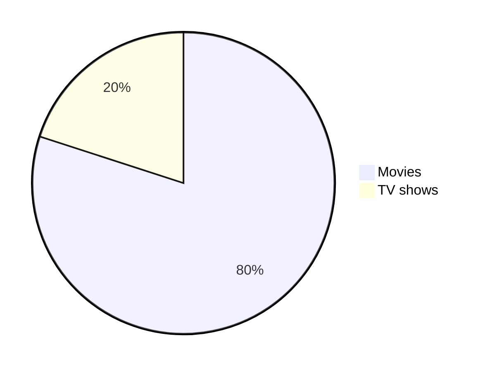

{ .center-image }

{ .center-image }

<h1 align="center" tabindex="-1" class="heading-element" dir="auto">
  ⚫ The Ultimate Markdown Cheat Sheet ⚫
</h1>

<div align="center">

  <a href="https://github.com/lifeparticle/Markdown-Cheatsheet/actions/workflows/readme-checker.yml">
    
  </a>

</div>

<a name="top"></a>

<br/>
!!! pied-piper "Important"

    Check out the official documentation on <a href="https://docs.github.com/en/get-started/writing-on-github/getting-started-with-writing-and-formatting-on-github/basic-writing-and-formatting-syntax">GitHub</a> to learn more about writing and formatting syntax. Additionally, you can read the latest updates and features on Markdown by visiting the <a href="https://github.blog/tag/markdown/" rel="nofollow">GitHub blog</a>.</p>
    
!!! tip "For hands-on learning:"
    
    Explore the module on <a href="https://learn.microsoft.com/en-us/training/modules/communicate-using-markdown/" rel="nofollow">Microsoft Learn</a>.</p>
    
    
<kbd> <br> [Markdown-Cheatsheet](https://github.com/lifeparticle/Markdown-Cheatsheet) ↗️ <br> </kbd>

<div class="grid cards cols-3" markdown>

-   <span style="color: #009688">:material-cursor-default:</span> **Introduction**
    [:octicons-arrow-right-24: View Introduction](#introduction){ .md-button style="border-color: #009688; color: #009688" }

    Markdown is a way of writing rich-text content using plain text formatting syntax.

-   <span style="color: #0288d1">:material-format-header-equal:</span> **Headings**
    [:octicons-arrow-right-24: View Headings](#headings){ .md-button style="border-color: #0288d1; color: #0288d1" }

    Organise your content levels using standard ATX-style hash headings.

-   <span style="color: #388e3c">:material-format-text:</span> **Text styles**
    [:octicons-arrow-right-24: View Styles](#text-styles){ .md-button style="border-color: #388e3c; color: #388e3c" }

    An overview of how to apply different visual formats to your text.

-   <span style="color: #0097a7">:material-format-text-variant:</span> **Normal**
    [:octicons-arrow-right-24: View Normal](https://github.com/lifeparticle/Markdown-Cheatsheet/blob/main/README.md#normal){ .md-button style="border-color: #0097a7; color: #0097a7" }

    Standard body text formatting for general paragraphs.

-   <span style="color: #f57c00">:material-format-bold:</span> **Bold**
    [:octicons-arrow-right-24: View Bold](https://github.com/lifeparticle/Markdown-Cheatsheet/blob/main/README.md#bold){ .md-button style="border-color: #f57c00; color: #f57c00" }

    Use double asterisks to give your text strong emphasis.

-   <span style="color: #455a64">:material-format-italic:</span> **Italic**
    [:octicons-arrow-right-24: View Italic](#italic){ .md-button style="border-color: #455a64; color: #455a64" }

    Use single underscores or asterisks for subtle emphasis.

-   <span style="color: #5d4037">:material-format-text-variant:</span> **Bold and Italic**
    [:octicons-arrow-right-24: View Combined](#bold-and-italic){ .md-button style="border-color: #5d4037; color: #5d4037" }

    Combine both styles for maximum impact on specific words.

-   <span style="color: #00796b">:material-format-quote-close:</span> **Blockquotes**
    [:octicons-arrow-right-24: View Blockquotes](#blockquotes){ .md-button style="border-color: #00796b; color: #00796b" }

    Highlight external quotes or callouts using the `>` syntax.

-   <span style="color: #1976d2">:material-code-tags:</span> **Monospaced**
    [:octicons-arrow-right-24: View Monospaced](#monospaced){ .md-button style="border-color: #1976d2; color: #1976d2" }

    Fixed-width text often used for technical terms or code.

-   <span style="color: #689f38">:material-format-underline:</span> **Underlined**
    [:octicons-arrow-right-24: View Underlined](#underlined){ .md-button style="border-color: #689f38; color: #689f38" }

    Applying underlines to text via HTML or specific extensions.

-   <span style="color: #afb42b">:material-format-strikethrough:</span> **Strike-through**
    [:octicons-arrow-right-24: View Strike](#strike-through){ .md-button style="border-color: #afb42b; color: #afb42b" }

    Draw a line through text to indicate deletions or corrections.

-   <span style="color: #00838f">:material-checkbox-blank-outline:</span> **Boxed**
    [:octicons-arrow-right-24: View Boxed](#boxed){ .md-button style="border-color: #00838f; color: #00838f" }

    Wraps text in a visual container or border.

-   <span style="color: #2e7d32">:material-format-subscript:</span> **Subscript**
    [:octicons-arrow-right-24: View Subscript](#subscript){ .md-button style="border-color: #2e7d32; color: #2e7d32" }

    Position text slightly below the normal line (e.g., H₂O).

-   <span style="color: #1565c0">:material-format-superscript:</span> **Superscript**
    [:octicons-arrow-right-24: View Superscript](#superscript){ .md-button style="border-color: #1565c0; color: #1565c0" }

    Position text slightly above the normal line (e.g., X²).

-   <span style="color: #ef6c00">:material-format-size:</span> **Small Text**
    [:octicons-arrow-right-24: View Small](#small-text){ .md-button style="border-color: #ef6c00; color: #ef6c00" }

    Render text at a reduced size for fine print or captions.

</div>

<div class="grid cards cols-3" markdown>

-   <span style="color: #009688">:material-palette:</span> **Text Color**
    [:octicons-arrow-right-24: View Color](#text-color){ .md-button style="border-color: #009688; color: #009688" }

    Changing the foreground color of your text elements.

-   <span style="color: #0288d1">:material-format-list-bulleted-type:</span> **Multiline**
    [:octicons-arrow-right-24: View Multiline](#multiline){ .md-button style="border-color: #0288d1; color: #0288d1" }

    Handling text blocks that span across several lines.

-   <span style="color: #388e3c">:material-xml:</span> **Syntax Highlighting**
    [:octicons-arrow-right-24: View Syntax](#syntax-highlighting){ .md-button style="border-color: #388e3c; color: #388e3c" }

    Applying color and formatting to various programming languages.

-   <span style="color: #0097a7">:material-code-braces:</span> **Inline code**
    [:octicons-arrow-right-24: View Inline](#inline-code){ .md-button style="border-color: #0097a7; color: #0097a7" }

    Embedding short snippets of code within a sentence.

-   <span style="color: #f57c00">:material-format-list-numbered:</span> **Code block**
    [:octicons-arrow-right-24: View Block](#code-block){ .md-button style="border-color: #f57c00; color: #f57c00" }

    Dedicated sections for multi-line source code.

-   <span style="color: #455a64">:material-table:</span> **Diff Code block**
    [:octicons-arrow-right-24: View Diff](#diff-code-block){ .md-button style="border-color: #455a64; color: #455a64" }

    Visualising changes, additions, and deletions in code.

-   <span style="color: #5d4037">:material-format-align-center:</span> **Alignments**
    [:octicons-arrow-right-24: View Alignments](#alignments){ .md-button style="border-color: #5d4037; color: #5d4037" }

    Positioning text to the left, right, or center.

-   <span style="color: #00796b">:material-table:</span> **Tables**
    [:octicons-arrow-right-24: View Tables](#tables){ .md-button style="border-color: #00796b; color: #00796b" }

    Organising data into structured rows and columns.

-   <span style="color: #1976d2">:material-link-variant:</span> **Links**
    [:octicons-arrow-right-24: View Links](#links){ .md-button style="border-color: #1976d2; color: #1976d2" }

    Hyperlinking text to URLs or internal document anchors.

-   <span style="color: #689f38">:material-link:</span> **Inline Link**
    [:octicons-arrow-right-24: View Inline](#inline){ .md-button style="border-color: #689f38; color: #689f38" }

    Standard links defined immediately with the text.

-   <span style="color: #afb42b">:material-bookmark-outline:</span> **Reference Link**
    [:octicons-arrow-right-24: View Ref](#reference){ .md-button style="border-color: #afb42b; color: #afb42b" }

    Defining link destinations elsewhere in the document.

-   <span style="color: #00838f">:material-format-list-numbered:</span> **Footnote**
    [:octicons-arrow-right-24: View Footnote](#footnote){ .md-button style="border-color: #00838f; color: #00838f" }

    Adding citations or extra notes at the bottom of the page.

-   <span style="color: #2e7d32">:material-file-tree:</span> **Relative Link**
    [:octicons-arrow-right-24: View Relative](#relative){ .md-button style="border-color: #2e7d32; color: #2e7d32" }

    Linking to other files within the same project or folder.

-   <span style="color: #1565c0">:material-email-outline:</span> **Auto Link**
    [:octicons-arrow-right-24: View Auto](#auto){ .md-button style="border-color: #1565c0; color: #1565c0" }

    Automatic conversion of URLs and emails into clickable links.

-   <span style="color: #ef6c00">:material-pound:</span> **Section Link**
    [:octicons-arrow-right-24: View Section](#section){ .md-button style="border-color: #ef6c00; color: #ef6c00" }

    Jump directly to a specific heading or anchor on the page.

</div>

<div class="grid cards cols-3" markdown>

-   <span style="color: #009688">:material-cursor-pointer:</span> **Hover**
    [:octicons-arrow-right-24: View Hover](#hover){ .md-button style="border-color: #009688; color: #009688" }

    Adding tooltips or titles that appear on mouseover.

-   <span style="color: #0288d1">:material-code-parentheses:</span> **Enclosed**
    [:octicons-arrow-right-24: View Enclosed](#enclosed){ .md-button style="border-color: #0288d1; color: #0288d1" }

    Wrapping links within specific characters or delimiters.

-   <span style="color: #388e3c">:material-marker:</span> **Highlight & Link**
    [:octicons-arrow-right-24: View Link](#highlight-words-and-link-it-to-a-url){ .md-button style="border-color: #388e3c; color: #388e3c" }

    Applying highlights to text that also functions as a link.

-   <span style="color: #0097a7">:material-image-outline:</span> **Images**
    [:octicons-arrow-right-24: View Images](#images){ .md-button style="border-color: #0097a7; color: #0097a7" }

    Embedding and formatting visual assets in your content.

-   <span style="color: #f57c00">:material-brightness-6:</span> **Theme**
    [:octicons-arrow-right-24: View Theme](#theme){ .md-button style="border-color: #f57c00; color: #f57c00" }

    Handling image styles based on user preferences.

-   <span style="color: #455a64">:material-image-multiple:</span> **Picture tag**
    [:octicons-arrow-right-24: View Picture](#using-picture-tag){ .md-button style="border-color: #455a64; color: #455a64" }

    Using HTML5 picture tags for advanced image handling.

-   <span style="color: #5d4037">:material-theme-light-dark:</span> **Dark/Light mode**
    [:octicons-arrow-right-24: View Mode](#using-dark-and-light-mode){ .md-button style="border-color: #5d4037; color: #5d4037" }

    Swapping images based on the active theme.

-   <span style="color: #00796b">:material-view-module:</span> **Group**
    [:octicons-arrow-right-24: View Group](#group){ .md-button style="border-color: #00796b; color: #00796b" }

    Displaying multiple images together in a gallery or set.

-   <span style="color: #1976d2">:material-shield-check-outline:</span> **Badges**
    [:octicons-arrow-right-24: View Badges](#badges){ .md-button style="border-color: #1976d2; color: #1976d2" }

    Small status indicators often used for versioning or CI/CD.

-   <span style="color: #689f38">:material-video-outline:</span> **Videos**
    [:octicons-arrow-right-24: View Videos](#videos){ .md-button style="border-color: #689f38; color: #689f38" }

    Embedding external video content or local media files.

-   <span style="color: #afb42b">:material-format-list-bulleted:</span> **Lists**
    [:octicons-arrow-right-24: View Lists](#lists){ .md-button style="border-color: #afb42b; color: #afb42b" }

    Structuring content using various list types.

-   <span style="color: #00838f">:material-format-list-numbered:</span> **Ordered**
    [:octicons-arrow-right-24: View Ordered](#ordered){ .md-button style="border-color: #00838f; color: #00838f" }

    Creating sequential, numbered lists of items.

-   <span style="color: #2e7d32">:material-format-list-bulleted:</span> **Unordered**
    [:octicons-arrow-right-24: View Unordered](#unordered){ .md-button style="border-color: #2e7d32; color: #2e7d32" }

    Bullet-point lists for non-sequential information.

-   <span style="color: #1565c0">:material-checkbox-marked-outline:</span> **Task**
    [:octicons-arrow-right-24: View Tasks](#task){ .md-button style="border-color: #1565c0; color: #1565c0" }

    Interactive or static checklists for project tracking.

-   <span style="color: #ef6c00">:material-gesture-tap-button:</span> **Buttons**
    [:octicons-arrow-right-24: View Buttons](#buttons){ .md-button style="border-color: #ef6c00; color: #ef6c00" }

    Creating call-to-action buttons within your documentation.

</div>

<div class="grid cards cols-3" markdown>

-   <span style="color: #009688">:material-emoticon-outline:</span> **Emoji Button**
    [:octicons-arrow-right-24: View Button](#button-with-emoji){ .md-button style="border-color: #009688; color: #009688" }

    Enhancing buttons with decorative or functional icons.

-   <span style="color: #0288d1">:material-unfold-more-horizontal:</span> **Collapsible**
    [:octicons-arrow-right-24: View Collapsible](#collapsible-items-28-july-2023){ .md-button style="border-color: #0288d1; color: #0288d1" }

    Using details and summary tags to hide/show content.

-   <span style="color: #388e3c">:material-minus:</span> **Horizontal Rule**
    [:octicons-arrow-right-24: View Rule](#horizontal-rule){ .md-button style="border-color: #388e3c; color: #388e3c" }

    Inserting thematic breaks or dividers between sections.

-   <span style="color: #0097a7">:material-sitemap:</span> **Diagrams**
    [:octicons-arrow-right-24: View Diagrams](#diagrams-19-july-2022){ .md-button style="border-color: #0097a7; color: #0097a7" }

    Flowcharts and sequence diagrams using Mermaid or similar.

-   <span style="color: #f57c00">:material-math-compass:</span> **Mathematics**
    [:octicons-arrow-right-24: View Math](#mathematical-expressions-19-july-2022){ .md-button style="border-color: #f57c00; color: #f57c00" }

    Rendering LaTeX or MathJax equations and formulas.

-   <span style="color: #455a64">:material-alert-circle-outline:</span> **Alerts**
    [:octicons-arrow-right-24: View Alerts](#alerts-8-january-2024){ .md-button style="border-color: #455a64; color: #455a64" }

    Warning, info, and success callouts (admonitions).

-   <span style="color: #5d4037">:material-account-group:</span> **Mentions**
    [:octicons-arrow-right-24: View Mentions](#mention-people-and-teams){ .md-button style="border-color: #5d4037; color: #5d4037" }

    Syntax for tagging specific users or teams.

-   <span style="color: #00796b">:material-source-pull:</span> **PRs & Issues**
    [:octicons-arrow-right-24: View Refs](#reference-issues-and-pull-requests){ .md-button style="border-color: #00796b; color: #00796b" }

    Automatically linking to repository issues and pull requests.

-   <span style="color: #1976d2">:material-invert-colors:</span> **Color models**
    [:octicons-arrow-right-24: View Models](#color-models){ .md-button style="border-color: #1976d2; color: #1976d2" }

    Working with HEX, RGB, and HSL color values.

-   <span style="color: #689f38">:material-eye-outline:</span> **View Code**
    [:octicons-arrow-right-24: View Code](#view-code){ .md-button style="border-color: #689f38; color: #689f38" }

    Techniques for displaying raw source code to users.

-   <span style="color: #afb42b">:material-format-title:</span> **Code in titles**
    [:octicons-arrow-right-24: View Titles](#code-in-titles){ .md-button style="border-color: #afb42b; color: #afb42b" }

    Using backticks within header levels.

-   <span style="color: #00838f">:material-label-outline:</span> **Ref Labels**
    [:octicons-arrow-right-24: View Labels](#reference-labels){ .md-button style="border-color: #00838f; color: #00838f" }

    Advanced usage of labels for document cross-referencing.

-   <span style="color: #2e7d32">:material-dots-horizontal:</span> **Miscellaneous**
    [:octicons-arrow-right-24: View Misc](#miscellaneous){ .md-button style="border-color: #2e7d32; color: #2e7d32" }

    A collection of extra tips and less common features.

-   <span style="color: #1565c0">:material-comment-text-outline:</span> **Comments**
    [:octicons-arrow-right-24: View Comments](#comments){ .md-button style="border-color: #1565c0; color: #1565c0" }

    Adding hidden developer notes within the source file.

-   <span style="color: #ef6c00">:material-slash-forward:</span> **Escaping**
    [:octicons-arrow-right-24: View Escaping](#escaping-markdown-characters){ .md-button style="border-color: #ef6c00; color: #ef6c00" }

    Using backslashes to render literal Markdown characters.

</div>

<div class="grid cards cols-3" markdown>

-   <span style="color: #009688">:material-emoticon-happy-outline:</span> **Emojis**
    [:octicons-arrow-right-24: View Emojis](#emojis){ .md-button style="border-color: #009688; color: #009688" }

    Inserting icons and smileys using shortcode syntax.

-   <span style="color: #0288d1">:material-keyboard-return:</span> **Line break**
    [:octicons-arrow-right-24: View Break](#line-break){ .md-button style="border-color: #0288d1; color: #0288d1" }

    Forcing new lines without starting a new paragraph.

-   <span style="color: #388e3c">:material-arrow-up-circle-outline:</span> **Back to top**
    [:octicons-arrow-right-24: View Top](#back-to-top){ .md-button style="border-color: #388e3c; color: #388e3c" }

    Adding navigation links to return to the page start.

-   <span style="color: #0097a7">:material-bitbucket:</span> **Bitbucket**
    [:octicons-arrow-right-24: View Bitbucket](#bitbucket){ .md-button style="border-color: #0097a7; color: #0097a7" }

    Specific Markdown flavors and features for Bitbucket.

-   <span style="color: #f57c00">:material-microsoft-azure-devops:</span> **Azure DevOps**
    [:octicons-arrow-right-24: View Azure](#azure-devops-project-wiki){ .md-button style="border-color: #f57c00; color: #f57c00" }

    Guide to Markdown usage within Azure Project Wikis.

-   <span style="color: #455a64">:material-react:</span> **MDX**
    [:octicons-arrow-right-24: View MDX](#mdx){ .md-button style="border-color: #455a64; color: #455a64" }

    Using JSX components directly inside your Markdown files.

-   <span style="color: #00796b">:material-tools:</span> **Tools**
    [:octicons-arrow-right-24: View Tools](#tools){ .md-button style="border-color: #00796b; color: #00796b" }

    Recommended editors and plugins for Markdown development.

-   <span style="color: #ff9800">:material-home-circle:</span> **Zensical Start Page**
    [:octicons-arrow-right-24: Return to](MkDocs-Material-Start.md){ .md-button style="border-color: #ff9800; color: #ff9800" }

    Back to the project's main landing page.

-   <span style="color: #ff9800">:material-arrow-u-left-top:</span> **MkDocs-Material**
    [:octicons-arrow-right-24: Return to](index.md){ .md-button style="border-color: #ff9800; color: #ff9800" } 

    Back to the root documentation.

</div>

### Introduction

!!! quote ""

    Markdown is a way of writing rich-text (formatted text) content using plain text formatting syntax. It is also a tool that converts the plain text formatting to HTML.
    
    - **2004:** [John Gruber](https://daringfireball.net/projects/markdown/) developed Markdown.
    - **2014:** [CommonMark](https://commonmark.org/) was established as a standard specification for Markdown to resolve inconsistencies and ambiguities in Markdown implementations. This initiative was spearheaded by [John MacFarlane](https://github.com/jgm) and backed by other Markdown enthusiasts to ensure a reliable and consistent specification.
    
    This guide will provide you with a comprehensive understanding of the key commands in [GitHub Flavored Markdown (GFM)](https://github.github.com/gfm/), it is a strict superset of CommonMark. You can read the full article, [The Ultimate Markdown Cheat Sheet](https://towardsdatascience.com/the-ultimate-markdown-cheat-sheet-3d3976b31a0) on Medium.
    
### Headings

!!! pied-piper "Headings"
    Headings
        
    ```md
    # Heading 1
    ## Heading 2
    ### Heading 3
    #### Heading 4
    ##### Heading 5
    ###### Heading 6
    ```
    
    ---
    
    ```md
    <h1>Heading 1</h1>
    <h2>Heading 2</h2>
    <h3>Heading 3</h3>
    <h4>Heading 4</h4>
    <h5>Heading 5</h5>
    <h6>Heading 6</h6>
    ```
    
    ---
    
    ```md
    Heading 1
    =
    Heading 2
    -
    ```

!!! pied-piper "Headings"
    Headings
    
    ```md
    # Heading 1
    ## Heading 2
    ### Heading 3
    #### Heading 4
    ##### Heading 5
    ###### Heading 6
    ```
    
    **Renders as:** Heading 1 (largest) → Heading 6 (smallest)

## Text Styles

!!! abstract "Text styles"
    Normal
    
    ```md
    The quick brown fox jumps over the lazy dog.
    ```
    <p>The quick brown fox jumps over the lazy dog.</p>

!!! abstract "Text styles"
    Bold
    
    Mac: <kbd>command+B</kbd>
    Windows: <kbd>control+B</kbd>
    ```md
    **The quick brown fox jumps over the lazy dog.**
    
    __The quick brown fox jumps over the lazy dog.__
    
    <strong>The quick brown fox jumps over the lazy dog.</strong>
    ```

### Italic

!!! info "Italic"

    Mac: <kbd>command+I</kbd>
    
    Windows: <kbd>control+I</kbd>
    
    ```md
    *The quick brown fox jumps over the lazy dog.*
    _The quick brown fox jumps over the lazy dog._
    <em>The quick brown fox jumps over the lazy dog.</em>
    ```
    
    *The quick brown fox jumps over the lazy dog.*
    <!-- markdownlint-disable-next-line MD049 -->
    _The quick brown fox jumps over the lazy dog._
    
    <em>The quick brown fox jumps over the lazy dog.</em>
    
### Bold and Italic

!!! info "Bold and Italic"

    ```md
    **_The quick brown fox jumps over the lazy dog._**
    ***The quick brown fox jumps over the lazy dog.***
    <strong><em>The quick brown fox jumps over the lazy dog.</em></strong>
    ```
    **_The quick brown fox jumps over the lazy dog._**
    
    ***The quick brown fox jumps over the lazy dog.***
    
    <strong><em>The quick brown fox jumps over the lazy dog.</em></strong>
    
### Blockquotes

!!! info "Blockquotes"

    Mac: <kbd>command+shift+.</kbd>
    
    Windows: <kbd>control+shift+.</kbd>
    
    ```md
    > The quick brown fox jumps over the lazy dog.
    ```
    
    ```md
    > The quick brown fox jumps over the lazy dog.
    >
    > The quick brown fox jumps over the lazy dog.
    >
    > The quick brown fox jumps over the lazy dog.
    ```
    
    ---
    
    ```md
    > The quick brown fox jumps over the lazy dog.
    >> The quick brown fox jumps over the lazy dog.
    >>> The quick brown fox jumps over the lazy dog.
    ```
    
    ---
    
    ```md
    > **The quick brown fox** *jumps over the lazy dog.*
    ```
    
    ---
    
    > The quick brown fox jumps over the lazy dog.
    
    ---
    
    > The quick brown fox jumps over the lazy dog.
    >
    > The quick brown fox jumps over the lazy dog.
    >
    > The quick brown fox jumps over the lazy dog.
    
    
    ---
    
    
    > The quick brown fox jumps over the lazy dog.
    >> The quick brown fox jumps over the lazy dog.
    >>> The quick brown fox jumps over the lazy dog.
    
    
    ---
    
    
    > **The quick brown fox** *jumps over the lazy dog.*
    
### Monospaced

!!! info "Monospaced"

    ```md
    <samp>The quick brown fox jumps over the lazy dog.</samp>
    ```
    
    <samp>The quick brown fox jumps over the lazy dog.</samp>
    
### Underlined

!!! info "Underlined"

    ```md
    <ins>The quick brown fox jumps over the lazy dog.</ins>
    ```
    
    <ins>The quick brown fox jumps over the lazy dog.</ins>
    
### Strike-through

!!! info "Strike-through"

    ```md
    ~~The quick brown fox jumps over the lazy dog.~~
    ```
    
    ~~The quick brown fox jumps over the lazy dog.~~
    
    ---
    
    ```md
    Lorem ipsum dolor sit amet, consectetur adipiscing elit. ~~Sed do eiusmod tempor incididunt ut labore et dolore magna aliqua.~~ Ut enim ad minim veniam, quis nostrud exercitation ullamco laboris nisi ut aliquip ex ea commodo consequat. Duis aute irure dolor in reprehenderit in voluptate velit esse cillum dolore eu fugiat nulla pariatur. ~~Excepteur sint occaecat cupidatat non proident, sunt in culpa qui officia deserunt mollit anim id est laborum.~~
    ```
    
    ---
    
    Lorem ipsum dolor sit amet, consectetur adipiscing elit. ~~Sed do eiusmod tempor incididunt ut labore et dolore magna aliqua.~~ Ut enim ad minim veniam, quis nostrud exercitation ullamco laboris nisi ut aliquip ex ea commodo consequat. Duis aute irure dolor in reprehenderit in voluptate velit esse cillum dolore eu fugiat nulla pariatur. ~~Excepteur sint occaecat cupidatat non proident, sunt in culpa qui officia deserunt mollit anim id est laborum.~~
    
    ---
    
    
    ````md
    <strike>
    
    ```js
    console.log('Error');
    ```
    
    </strike>
    ````
    
    <strike>
    
    ```js
    console.log('Error');
    ```
    
    </strike>
    
### Boxed

!!! info "Boxed"

    ```md
    <table><tr><td>The quick brown fox jumps over the lazy dog.</td></tr></table>
    ```
    
    <table><tr><td>The quick brown fox jumps over the lazy dog.</td></tr></table>
    
### Subscript

!!! info "Subscript"

    ```md
    log<sub>2</sub>(x)
    Subscript <sub>The quick brown fox jumps over the lazy dog.</sub>
    ```
    
    log<sub>2</sub>(x)
    
    Subscript <sub>The quick brown fox jumps over the lazy dog.</sub>
    
### Superscript

!!! info "Superscript"

    ```md
    2 <sup>53-1</sup> and -2 <sup>53-1</sup>
    Superscript <sup>The quick brown fox jumps over the lazy dog.</sup>
    ```
    
    2 <sup>53-1</sup> and -2 <sup>53-1</sup>
    
    Superscript <sup>The quick brown fox jumps over the lazy dog.</sup>
    
### Small Text

!!! info "Small Text"

    Start <sup><sub>The quick brown fox jumps over the lazy dog.</sub></sup> End
    
    Start <sub><sup>The quick brown fox jumps over the lazy dog.</sup></sub> End
    
    ```md
    Start <sup><sub>The quick brown fox jumps over the lazy dog.</sub></sup> End
    
    Start <sub><sup>The quick brown fox jumps over the lazy dog.</sup></sub> End
    ```
    
### Text Color

Using [MathJax](#mathematical-expressions-19-july-2022) syntax:


| Color Name | Code Syntax | Example (Hover for Hex) |
| :--- | :--- | :--- |
| **Apricot** | `<font color="#FBB982">...</font>` | <span title="Hex: #FBB982"><font color="#FBB982">The quick brown fox jumps over the lazy dog.</font></span> |
| **Aquamarine** | `<font color="#00B5BE">...</font>` | <span title="Hex: #00B5BE"><font color="#00B5BE">The quick brown fox jumps over the lazy dog.</font></span> |
| **Bittersweet** | `<font color="#C04F17">...</font>` | <span title="Hex: #C04F17"><font color="#C04F17">The quick brown fox jumps over the lazy dog.</font></span> |
| **Black** | `<font color="#221E1F">...</font>` | <span title="Hex: #221E1F" style="background-color: #BBB; padding: 2px; border-radius: 3px;"><font color="#221E1F">The quick brown fox jumps over the lazy dog.</font></span> |
| **Blue** | `<font color="#2D2F92">...</font>` | <span title="Hex: #2D2F92" style="background-color: #CCC; padding: 2px; border-radius: 3px;"><font color="#2D2F92">The quick brown fox jumps over the lazy dog.</font></span> |
| **BlueGreen** | `<font color="#00B3B8">...</font>` | <span title="Hex: #00B3B8"><font color="#00B3B8">The quick brown fox jumps over the lazy dog.</font></span> |
| **BlueViolet** | `<font color="#473992">...</font>` | <span title="Hex: #473992"><font color="#473992">The quick brown fox jumps over the lazy dog.</font></span> |
| **BrickRed** | `<font color="#B6321C">...</font>` | <span title="Hex: #B6321C"><font color="#B6321C">The quick brown fox jumps over the lazy dog.</font></span> |
| **Brown** | `<font color="#792500">...</font>` | <span title="Hex: #792500"><font color="#792500">The quick brown fox jumps over the lazy dog.</font></span> |
| **BurntOrange** | `<font color="#F7921D">...</font>` | <span title="Hex: #F7921D"><font color="#F7921D">The quick brown fox jumps over the lazy dog.</font></span> |
| **CadetBlue** | `<font color="#74729A">...</font>` | <span title="Hex: #74729A"><font color="#74729A">The quick brown fox jumps over the lazy dog.</font></span> |
| **CarnationPink** | `<font color="#F282B4">...</font>` | <span title="Hex: #F282B4"><font color="#F282B4">The quick brown fox jumps over the lazy dog.</font></span> |
| **Cerulean** | `<font color="#00A2E3">...</font>` | <span title="Hex: #00A2E3"><font color="#00A2E3">The quick brown fox jumps over the lazy dog.</font></span> |
| **CornflowerBlue** | `<font color="#41B0E4">...</font>` | <span title="Hex: #41B0E4"><font color="#41B0E4">The quick brown fox jumps over the lazy dog.</font></span> |
| **Cyan** | `<font color="#00AEEF">...</font>` | <span title="Hex: #00AEEF"><font color="#00AEEF">The quick brown fox jumps over the lazy dog.</font></span> |
| **Dandelion** | `<font color="#FDBC42">...</font>` | <span title="Hex: #FDBC42"><font color="#FDBC42">The quick brown fox jumps over the lazy dog.</font></span> |
| **DarkOrchid** | `<font color="#A4538A">...</font>` | <span title="Hex: #A4538A"><font color="#A4538A">The quick brown fox jumps over the lazy dog.</font></span> |
| **Emerald** | `<font color="#00A99D">...</font>` | <span title="Hex: #00A99D"><font color="#00A99D">The quick brown fox jumps over the lazy dog.</font></span> |
| **ForestGreen** | `<font color="#009B55">...</font>` | <span title="Hex: #009B55"><font color="#009B55">The quick brown fox jumps over the lazy dog.</font></span> |
| **Fuchsia** | `<font color="#8C368C">...</font>` | <span title="Hex: #8C368C"><font color="#8C368C">The quick brown fox jumps over the lazy dog.</font></span> |
| **Goldenrod** | `<font color="#FFDF42">...</font>` | <span title="Hex: #FFDF42"><font color="#FFDF42">The quick brown fox jumps over the lazy dog.</font></span> |
| **Gray** | `<font color="#949698">...</font>` | <span title="Hex: #949698"><font color="#949698">The quick brown fox jumps over the lazy dog.</font></span> |
| **Green** | `<font color="#00A64F">...</font>` | <span title="Hex: #00A64F"><font color="#00A64F">The quick brown fox jumps over the lazy dog.</font></span> |
| **GreenYellow** | `<font color="#DFE674">...</font>` | <span title="Hex: #DFE674"><font color="#DFE674">The quick brown fox jumps over the lazy dog.</font></span> |
| **JungleGreen** | `<font color="#00A99A">...</font>` | <span title="Hex: #00A99A"><font color="#00A99A">The quick brown fox jumps over the lazy dog.</font></span> |
| **Lavender** | `<font color="#F49EC4">...</font>` | <span title="Hex: #F49EC4"><font color="#F49EC4">The quick brown fox jumps over the lazy dog.</font></span> |
| **LimeGreen** | `<font color="#8DC73E">...</font>` | <span title="Hex: #8DC73E"><font color="#8DC73E">The quick brown fox jumps over the lazy dog.</font></span> |
| **Magenta** | `<font color="#EC008C">...</font>` | <span title="Hex: #EC008C"><font color="#EC008C">The quick brown fox jumps over the lazy dog.</font></span> |
| **Mahogany** | `<font color="#A9341F">...</font>` | <span title="Hex: #A9341F"><font color="#A9341F">The quick brown fox jumps over the lazy dog.</font></span> |
| **Maroon** | `<font color="#AF3235">...</font>` | <span title="Hex: #AF3235"><font color="#AF3235">The quick brown fox jumps over the lazy dog.</font></span> |
| **Melon** | `<font color="#F89E7B">...</font>` | <span title="Hex: #F89E7B"><font color="#F89E7B">The quick brown fox jumps over the lazy dog.</font></span> |
| **MidnightBlue** | `<font color="#006795">...</font>` | <span title="Hex: #006795" style="background-color: #AAA; padding: 2px; border-radius: 3px;"><font color="#006795">The quick brown fox jumps over the lazy dog.</font></span> |
| **Mulberry** | `<font color="#A93C93">...</font>` | <span title="Hex: #A93C93"><font color="#A93C93">The quick brown fox jumps over the lazy dog.</font></span> |
| **NavyBlue** | `<font color="#006EB8">...</font>` | <span title="Hex: #006EB8" style="background-color: #AAA; padding: 2px; border-radius: 3px;"><font color="#006EB8">The quick brown fox jumps over the lazy dog.</font></span> |
| **OliveGreen** | `<font color="#3C8031">...</font>` | <span title="Hex: #3C8031"><font color="#3C8031">The quick brown fox jumps over the lazy dog.</font></span> |
| **Orange** | `<font color="#F58137">...</font>` | <span title="Hex: #F58137"><font color="#F58137">The quick brown fox jumps over the lazy dog.</font></span> |
| **OrangeRed** | `<font color="#ED135A">...</font>` | <span title="Hex: #ED135A"><font color="#ED135A">The quick brown fox jumps over the lazy dog.</font></span> |
| **Orchid** | `<font color="#AF72B0">...</font>` | <span title="Hex: #AF72B0"><font color="#AF72B0">The quick brown fox jumps over the lazy dog.</font></span> |
| **Peach** | `<font color="#F7965A">...</font>` | <span title="Hex: #F7965A"><font color="#F7965A">The quick brown fox jumps over the lazy dog.</font></span> |
| **Periwinkle** | `<font color="#7977B8">...</font>` | <span title="Hex: #7977B8"><font color="#7977B8">The quick brown fox jumps over the lazy dog.</font></span> |
| **PineGreen** | `<font color="#008B72">...</font>` | <span title="Hex: #008B72"><font color="#008B72">The quick brown fox jumps over the lazy dog.</font></span> |
| **Plum** | `<font color="#92268F">...</font>` | <span title="Hex: #92268F"><font color="#92268F">The quick brown fox jumps over the lazy dog.</font></span> |
| **ProcessBlue** | `<font color="#00B0F0">...</font>` | <span title="Hex: #00B0F0"><font color="#00B0F0">The quick brown fox jumps over the lazy dog.</font></span> |
| **Purple** | `<font color="#99479B">...</font>` | <span title="Hex: #99479B"><font color="#99479B">The quick brown fox jumps over the lazy dog.</font></span> |
| **RawSienna** | `<font color="#974006">...</font>` | <span title="Hex: #974006"><font color="#974006">The quick brown fox jumps over the lazy dog.</font></span> |
| **Red** | `<font color="#ED1B23">...</font>` | <span title="Hex: #ED1B23"><font color="#ED1B23">The quick brown fox jumps over the lazy dog.</font></span> |
| **RedOrange** | `<font color="#F26035">...</font>` | <span title="Hex: #F26035"><font color="#F26035">The quick brown fox jumps over the lazy dog.</font></span> |
| **RedViolet** | `<font color="#A1246B">...</font>` | <span title="Hex: #A1246B"><font color="#A1246B">The quick brown fox jumps over the lazy dog.</font></span> |
| **Rhodamine** | `<font color="#EF559F">...</font>` | <span title="Hex: #EF559F"><font color="#EF559F">The quick brown fox jumps over the lazy dog.</font></span> |
| **RoyalBlue** | `<font color="#0071BC">...</font>` | <span title="Hex: #0071BC"><font color="#0071BC">The quick brown fox jumps over the lazy dog.</font></span> |
| **RoyalPurple** | `<font color="#613F99">...</font>` | <span title="Hex: #613F99"><font color="#613F99">The quick brown fox jumps over the lazy dog.</font></span> |
| **RubineRed** | `<font color="#ED017D">...</font>` | <span title="Hex: #ED017D"><font color="#ED017D">The quick brown fox jumps over the lazy dog.</font></span> |
| **Salmon** | `<font color="#F69289">...</font>` | <span title="Hex: #F69289"><font color="#F69289">The quick brown fox jumps over the lazy dog.</font></span> |
| **SeaGreen** | `<font color="#3FBC9D">...</font>` | <span title="Hex: #3FBC9D"><font color="#3FBC9D">The quick brown fox jumps over the lazy dog.</font></span> |


[Full Table](./MathJax.md)

### Multiline

!!! info "Multiline"

    The quick\
    brown fox\
    jumps over\
    the lazy dog.
    
    ```md
    The quick\
    brown fox\
    jumps over\
    the lazy dog.
    ```
    
### Syntax Highlighting

## Inline Code

!!! quote "Inline Code"

    A class method is an instance method of the class object. When a new class is created, an object of type `Class` is initialized and assigned to a global constant (Mobile in this case).
    
    You can use <kbd>command + e </kbd> on Mac or <kbd>control + e</kbd> on Windows to insert inline code.
    
## Code Block

??? info "Code Block"

    <!-- markdownlint-disable MD040 -->
    
    ```
    public static String monthNames[] = {"January", "February", "March", "April", "May", "June", "July", "August", "September", "October", "November", "December"};
    ```
    
    <!-- markdownlint-enable MD040 -->
    
    ````md
    ```
    public static String monthNames[] = {"January", "February", "March", "April", "May", "June", "July", "August", "September", "October", "November", "December"};
    ```
    ````
    
    ```java
    public static String monthNames[] = {"January", "February", "March", "April", "May", "June", "July", "August", "September", "October", "November", "December"};
    ```
    
    ````md
    ```java
    public static String monthNames[] = {"January", "February", "March", "April", "May", "June", "July", "August", "September", "October", "November", "December"};
    ```
    ````
    
    Refer to [this](https://github.com/github-linguist/linguist/blob/master/lib/linguist/languages.yml) and [this](https://github.com/github-linguist/linguist/tree/master/vendor) GitHub document to find all the valid keywords.
    

## Diff Code Block

??? pied-piper "Diff Code Block"

    ```diff
    ## git diff a/test.txt b/test.txt
    diff --git a/a/test.txt b/b/test.txt
    index 309ee57..c995021 100644
    --- a/a/test.txt
    +++ b/b/test.txt
    @@ -1,8 +1,6 @@
    -The quick brown fox jumps over the lazy dog
    +The quick brown fox jumps over the lazy cat
    
     a
    -b
     c
     d
    -e
     f
    ```
    
    ````md
    ```diff
    ## git diff a/test.txt b/test.txt
    diff --git a/a/test.txt b/b/test.txt
    index 309ee57..c995021 100644
    --- a/a/test.txt
    +++ b/b/test.txt
    @@ -1,8 +1,6 @@
    -The quick brown fox jumps over the lazy dog
    +The quick brown fox jumps over the lazy cat
    
     a
    -b
     c
     d
    -e
     f
    ```
    ````
    
    ```diff
    - Text in Red
    + Text in Green
    ! Text in Orange
    # Text in Gray
    @@ Text in Purple and bold @@
    ```
    
    ````md
    ```diff
    --- a/file
    +++ b/file
    - Text in Red
    + Text in Green
    ! Text in Orange
    # Text in Gray
    @@ -1,1 +1,1 @@ Text in Purple and bold
    ```
    ````
    
    
## Alignments

!!! info "Alignments"

    ??? info "Click to see code"

        ```html
        <p align="left">
          
        </p>
        ```

    <p align="left">
      
    </p>


!!! info "Alignments"

    ??? info "Click To See Code"

        ```html
        <p align="center">
          
        </p>
        ```

    <p align="center">
      
    </p>


!!! info "Alignments"

    ??? info "Click To See Code"

        ```html
        <p align="right">
          
        </p>
        ```

    <p align="right">
      
    </p>


!!! info ""

    ```md
    <h3 align="center"> My latest Medium posts </h3>
    ```
    
    <!-- omit in toc -->
    <h3 align="center"> My latest Medium posts </h3>
    
## Tables

!!! pied-piper "Tables"

    <div style="margin-bottom: -160px;">

    ```html
    <table>
      <tr>
        <td width="33%">The quick brown fox...</td>
        <td width="33%">The quick brown fox...</td>
        <td width="33%">The quick brown fox...</td>
      </tr>
    </table>
    ```
    
    ---

    </div>
    <table style="width:100%; border-collapse: collapse; margin-top: 0;">
      <tr>
        <td style="width:33.3%; border: 1px solid #333; padding: 15px;">The quick brown fox jumps over the lazy dog.</td>
        <td style="width:33.3%; border: 1px solid #333; padding: 15px;">The quick brown fox jumps over the lazy dog.</td>
        <td style="width:33.3%; border: 1px solid #333; padding: 15px;">The quick brown fox jumps over the lazy dog.</td>
      </tr>
    </table>


??? info "Code:Tables Below"

    ```md
    | Default | Left align | Center align | Right align |
    | - | :- | :-: | -: |
    | 9999999999 | 9999999999 | 9999999999 | 9999999999 |
    | 999999999 | 999999999 | 999999999 | 999999999 |
    | 99999999 | 99999999 | 99999999 | 99999999 |
    | 9999999 | 9999999 | 9999999 | 9999999 |
    ```
    
    --- 
    
    ```
    | Default    | Left align | Center align | Right align |
    | ---------- | :--------- | :----------: | ----------: |
    | 9999999999 | 9999999999 | 9999999999   | 9999999999  |
    | 999999999  | 999999999  | 999999999    | 999999999   |
    | 99999999   | 99999999   | 99999999     | 99999999    |
    | 9999999    | 9999999    | 9999999      | 9999999     |
    ```
    
    ---
    
    ```
    Default    | Left align | Center align | Right align
    ---------- | :--------- | :----------: | ----------:
    9999999999 | 9999999999 | 9999999999   | 9999999999
    999999999  | 999999999  | 999999999    | 999999999
    99999999   | 99999999   | 99999999     | 99999999
    9999999    | 9999999    | 9999999      | 9999999
    ```
    
   
| Default | Left align | Center align | Right align |
| - | :- | :-: | -: |
| 9999999999 | 9999999999 | 9999999999 | 9999999999 |
| 999999999 | 999999999 | 999999999 | 999999999 |
| 99999999 | 99999999 | 99999999 | 99999999 |
| 9999999 | 9999999 | 9999999 | 9999999 |

| Default    | Left align | Center align | Right align |
| ---------- | :--------- | :----------: | ----------: |
| 9999999999 | 9999999999 | 9999999999   | 9999999999  |
| 999999999  | 999999999  | 999999999    | 999999999   |
| 99999999   | 99999999   | 99999999     | 99999999    |
| 9999999    | 9999999    | 9999999      | 9999999     |

<!-- markdownlint-disable MD055 -->
Default    | Left align | Center align | Right align
---------- | :--------- | :----------: | ----------:
9999999999 | 9999999999 | 9999999999   | 9999999999
999999999  | 999999999  | 999999999    | 999999999
99999999   | 99999999   | 99999999     | 99999999
9999999    | 9999999    | 9999999      | 9999999
<!-- markdownlint-enable MD055 -->

---

??? info "Code: tables Below"

    ```
    <table>
    <tr>
    <th>Heading 1</th>
    <th>Heading 2</th>
    </tr>
    <tr>
    
    <td>
    
    | A | B | C |
    |--|--|--|
    | 1 | 2 | 3 |
    
    </td><td>
    
    | A | B | C |
    |--|--|--|
    | 1 | 2 | 3 |
    
    </td></tr> </table>
    ```
    
<div class="grid cards" markdown>

-   **Heading 1**


    | A | B | C |
    | :--- | :--- | :--- |
    | 1 | 2 | 3 |

-   **Heading 2**


    | A | B | C |
    | :--- | :--- | :--- |
    | 1 | 2 | 3 |

</div>

---

!!! info ""

    ```md
    | A | B | C |
    |---|---|---|
    | 1 | 2 | 3 <br/> 4 <br/> 5 |
    ```
    
    ---
    
    | A | B | C |
    |---|---|---|
    | 1 | 2 | 3 <br/> 4 <br/> 5 |
    

??? info "Code: Table Below"

    ```md
    <table>
    <tr>
    <th>Before Hoisting</th>
    <th>After Hoisting</th>
    </tr>
    <tr>
    <td>
    <pre lang="js">
    console.log(fullName); // undefined
    fullName = "Dariana Trahan";
    console.log(fullName); // Dariana Trahan
    var fullName;
    </pre>
    </td>
    <td>
    <pre lang="js">
    var fullName;
    console.log(fullName); // undefined
    fullName = "Dariana Trahan";
    console.log(fullName); // Dariana Trahan
    </pre>
    </td>
    </tr>
    </table>
    ```
    
<table>
<tr>
<th>Before Hoisting</th>
<th>After Hoisting</th>
</tr>
<tr>
<td>
<pre lang="js">
console.log(fullName); // undefined
fullName = "Dariana Trahan";
console.log(fullName); // Dariana Trahan
var fullName;
</pre>
</td>
<td>
<pre lang="js">
var fullName;
console.log(fullName); // undefined
fullName = "Dariana Trahan";
console.log(fullName); // Dariana Trahan
</pre>
</td>
</tr>
</table>

# Links

## Inline

```md
[The-Ultimate-Markdown-Cheat-Sheet](https://github.com/lifeparticle/Markdown-Cheatsheet)
```

[The-Ultimate-Markdown-Cheat-Sheet](https://github.com/lifeparticle/The-Ultimate-Markdown-Cheat-Sheet)

## Reference

```md
[The-Ultimate-Markdown-Cheat-Sheet][reference text]

[The-Ultimate-Markdown-Cheat-Sheet][1]

[Markdown-Cheat-Sheet]

[reference text]: https://github.com/lifeparticle/Markdown-Cheatsheet
[1]: https://github.com/lifeparticle/Markdown-Cheatsheet
[Markdown-Cheat-Sheet]: https://github.com/lifeparticle/Markdown-Cheatsheet
```

[The-Ultimate-Markdown-Cheat-Sheet][reference text]

[The-Ultimate-Markdown-Cheat-Sheet][1]

[Markdown-Cheat-Sheet]

[reference text]: https://github.com/lifeparticle/The-Ultimate-Markdown-Cheat-Sheet
[1]: https://github.com/lifeparticle/The-Ultimate-Markdown-Cheat-Sheet
[Markdown-Cheat-Sheet]: https://github.com/lifeparticle/The-Ultimate-Markdown-Cheat-Sheet

## Footnote

Footnote.[^1]

Some other important footnote.[^2]

[^1]: This is footnote number one.
[^2]: Here is the second footnote.

```md
Footnote.[^1]

Some other important footnote.[^2]

[^1]: This is footnote number one.
[^2]: Here is the second footnote.
```


## Relative

```md
[Example of a relative link](rl.md)
```

[Example of a relative link](rl.md)

## Auto

```md
Visit https://github.com/
```

Visit https://github.com/

```md
Email at example@example.com
```

Email at example@example.com

## Section


## Hover

You can use [BinaryTree](https://binarytree.dev/ "Array of Developer Productivity Tools Designed to Help You Save Time") to create markdown tables.

<!-- markdownlint-disable MD051 -->
You can use [BinaryTree]( "Array of Developer Productivity Tools Designed to Help You Save Time") to create markdown tables.

## Enclosed

```md
<https://github.com/>
```

<https://github.com/>

## Highlight words and link it to a URL

```md
[BinaryTree](https://binarytree.dev/)
```

[BinaryTree](https://binarytree.dev/)


# Images

Alt text and title are optional.

```md

```


```md
![alt text][image]


[image]: https://images.unsplash.com/photo-1415604934674-561df9abf539?ixlib=rb-1.2.1&ixid=eyJhcHBfaWQiOjEyMDd9&auto=format&fit=crop&w=100&q=80 "Title text"
```

![alt text][image]

[image]: https://images.unsplash.com/photo-1415604934674-561df9abf539?ixlib=rb-1.2.1&ixid=eyJhcHBfaWQiOjEyMDd9&auto=format&fit=crop&w=100&q=80 "Title text"


```md

```

<!-- markdownlint-disable-next-line MD013 -->


```md

```


```md

```

Animated SVG of the text 'Markdown-Cheatsheet' in white letters.


```md

```

[](https://binarytree.dev)
[](https://binarytree.dev)

## Theme

### Using picture tag

The HTML `<picture>` element, along with the `prefers-color-scheme` media feature, enables you to dynamically adjust images according to the user's color scheme preference, providing options for both light and dark modes.

For example, the code snippet below demonstrates how to display a dark-themed BinaryTree logo when the user's device is set to a dark mode, and a light-themed BinaryTree logo for light mode settings:


### Using dark and light mode

```md
[![Badge][Logo-dark]](https://binarytree.dev#gh-dark-mode-only)
[![Badge][Logo-light]](https://binarytree.dev#gh-light-mode-only)

[Logo-dark]: https://github-readme-stats.vercel.app/api?username=lifeparticle&theme=graywhite&show_icons=true#gh-light-mode-only
[Logo-light]: https://github-readme-stats.vercel.app/api?username=lifeparticle&theme=dark&show_icons=true#gh-dark-mode-only
```


[Logo-light]: https://github-readme-stats.vercel.app/api?username=lifeparticle&theme=graywhite&show_icons=true#gh-light-mode-only
[Logo-dark]: https://github-readme-stats.vercel.app/api?username=lifeparticle&theme=dark&show_icons=true#gh-dark-mode-only

This image shows a summary of Mahbub Zaman's GitHub statistics.

<p dir="auto"><a target="_blank" rel="noopener noreferrer nofollow" href="https://camo.githubusercontent.com/0920686b7ae4ccba8c9397450dd70919eedc0ff57781e74502ae15737b4babbc/68747470733a2f2f7265732e636c6f7564696e6172792e636f6d2f616e7572616768617a72612f696d6167652f75706c6f61642f76313539353137343533362f6772732d7468656d65735f6c34796e6a612e706e67"></a></p>


## Group

Horizontal Images

<p>
  
  
  
</p>

??? info "Horizontal Images"

    ```md
      <p>
        
        
        
      </p>
    ```
      
Horizontal Images With Gap

<p>
  
  
  
</p>

??? info "Horizontal Images With Gap"

    ```md
      <p>
        
        
        
      </p>
    ```

Vertical Images

<p>
  
  <br>
  
  <br>
  
</p>

??? info "Vertical Images"

    ```md
      <p>
        
      <br>
        
      <br>
        
      </p>
    ```

Vertical images With Gap

<p>
  
  <br><br>
  
  <br><br>
  
</p>

??? info "Vertical Images"

    ```md
      <p>
        
      <br><br>
        
      <br><br>
        
      </p>
    ```

# Badges

```md

```


# Videos

To embed a video in Markdown, you need to first upload the video file and then reference it inline:

https://github.com/user-attachments/assets/90c624e0-f46b-47a7-8509-97585dc3688a

```md
https://github.com/user-attachments/assets/90c624e0-f46b-47a7-8509-97585dc3688a
```

# Lists

## Ordered

Mac: <kbd>command+shift+7</kbd>

Windows: <kbd>control+shift+7</kbd>

```md
1. One
2. Two
3. Three
```

1. One
2. Two
3. Three

```md
1. First level
    1. Second level
        - Third level
            - Fourth level
2. First level
    1. Second level
3. First level
    1. Second level
```

1. First level
    1. Second level
        - Third level
            - Fourth level
2. First level
    1. Second level
3. First level
    1. Second level

## Unordered

Mac: <kbd>command+shift+8</kbd>

Windows: <kbd>control+shift+8</kbd>

```md
* 1
* 2
* 3

+ 1
+ 2
+ 3


- 1
- 2
- 3
```

<!-- markdownlint-disable MD004 -->

* 1
* 2
* 3

+ 1
+ 2
+ 3

<!-- markdownlint-enable MD004 -->

- 1
- 2
- 3

```md
- First level
  - Second level
    - Third level
      - Fourth level
- First level
  - Second level
- First level
  - Second level
```

- First level
  - Second level
    - Third level
      - Fourth level
- First level
  - Second level
- First level
  - Second level

```md
<ul>
<li>First item</li>
<li>Second item</li>
<li>Third item</li>
<li>Fourth item</li>
</ul>
```

<ul>
<li>First item</li>
<li>Second item</li>
<li>Third item</li>
<li>Fourth item</li>
</ul>

## Task

```md
- [x] Fix Bug 223
- [ ] Add Feature 33
- [ ] Add unit tests
```

- [x] Fix Bug 223
- [ ] Add Feature 33
- [ ] Add unit tests

# Buttons

```md
<kbd>cmd + shift + p</kbd>
```

<kbd>cmd + shift + p</kbd>

```md
<kbd> <br> cmd + shift + p <br> </kbd>
```

<kbd> <br> cmd + shift + p <br> </kbd>

```md
<kbd>[Markdown-Cheatsheet](https://github.com/lifeparticle/Markdown-Cheatsheet)</kbd>
```

<kbd>[Markdown-Cheatsheet](https://github.com/lifeparticle/Markdown-Cheatsheet)</kbd>

```md
[<kbd>Markdown-Cheatsheet</kbd>](https://github.com/lifeparticle/Markdown-Cheatsheet)
```

[<kbd>Markdown-Cheatsheet</kbd>](https://github.com/lifeparticle/Markdown-Cheatsheet)

## Button with emoji

<!-- markdownlint-disable-next-line MD013 -->
<kbd> <br> [Markdown-Cheatsheet](https://github.com/lifeparticle/Markdown-Cheatsheet) ↗️ <br> </kbd>

```md
<kbd> <br> [Markdown-Cheatsheet](https://github.com/lifeparticle/Markdown-Cheatsheet) ↗️ <br> </kbd>
```

# Collapsible items (28 July 2023)

```md
<details>
  <summary>Markdown</summary>

-  <kbd>[Markdown Editor](https://binarytree.dev/me)</kbd>
-  <kbd>[Table Of Content](https://binarytree.dev/toc)</kbd>
-  <kbd>[Markdown Table Generator](https://binarytree.dev/md_table_generator)</kbd>

</details>
```

<details>
  <summary>Markdown</summary>

- <kbd>[Markdown Editor](https://binarytree.dev/me)</kbd>
- <kbd>[Table Of Content](https://binarytree.dev/toc)</kbd>
- <kbd>[Markdown Table Generator](https://binarytree.dev/md_table_generator)</kbd>

</details>

# Horizontal Rule

```md
---
***
___
```

---

<!-- markdownlint-disable-next-line MD035 -->
***

<!-- markdownlint-disable-next-line MD035 -->
___

# Diagrams (19 July 2022)

````md

````


# Mathematical expressions (19 July 2022)

> [!IMPORTANT]
> Check out the official documentation on [GitHub](https://docs.github.com/en/get-started/writing-on-github/working-with-advanced-formatting/writing-mathematical-expressions) to learn more about writing and formatting MathJax syntax.

```md
This is an inline math expression $x = {-b \pm \sqrt{b^2-4ac} \over 2a}$
```

This is an inline math expression $x = {-b \pm \sqrt{b^2-4ac} \over 2a}$

```md
$$
x = {-b \pm \sqrt{b^2-4ac} \over 2a}
$$
```

$$
x = {-b \pm \sqrt{b^2-4ac} \over 2a}
$$

# Alerts (8 January 2024)

```md
> [!NOTE]
> Essential details that users should not overlook, even when browsing quickly.

<br>

> [!TIP]
> Additional advice to aid users in achieving better outcomes.

<br>

> [!IMPORTANT]
> Vital information required for users to attain success.

<br>

> [!WARNING]
> Urgent content that requires immediate user focus due to possible risks.

<br>

> [!CAUTION]
> Possible negative outcomes resulting from an action.
```

> [!NOTE]
> Essential details that users should not overlook, even when browsing quickly.

<br>

> [!TIP]
> Additional advice to aid users in achieving better outcomes.

<br>

> [!IMPORTANT]
> Vital information required for users to attain success.

<br>

> [!WARNING]
> Urgent content that requires immediate user focus due to possible risks.

<br>

> [!CAUTION]
> Possible negative outcomes resulting from an action.

# Mention people and teams

In issues:

```md
@lifeparticle
```

[Example shown in issue](https://github.com/lifeparticle/Markdown-Cheatsheet/issues/1)

In markdown file:

```md
https://github.com/lifeparticle
```

https://github.com/lifeparticle

# Reference issues and pull requests

In issues:

```md
#1
#10
```

[Example shown in issue](https://github.com/lifeparticle/Markdown-Cheatsheet/issues/1)

In markdown file:

```md
https://github.com/lifeparticle/Markdown-Cheatsheet/issues/1
https://github.com/lifeparticle/Markdown-Cheatsheet/pull/10
```

https://github.com/lifeparticle/Markdown-Cheatsheet/issues/1

https://github.com/lifeparticle/Markdown-Cheatsheet/pull/10

# Color models

In issues:

```md
`#ffffff`
`#000000`
```

[Example shown in issue](https://github.com/lifeparticle/Markdown-Cheatsheet/issues/1)


# View Code

Click either the Code (top right) or Raw (top left) option to see the markdown code.


> [!NOTE]
> Make sure you have clicked the markdown file to see the above view.


# Code in titles

In issue, and pull request titles.

`TEST` ISSUE

```md

`TEST` ISSUE

```


# Reference Labels

Labels referenced by URLs in Markdown are now automatically rendered.

https://github.com/lifeparticle/Markdown-Cheatsheet/labels/documentation

```md
https://github.com/lifeparticle/Markdown-Cheatsheet/labels/documentation
```

# Miscellaneous

## Comments

<!--
Lorem ipsum dolor sit amet
-->

```md
<!--
Lorem ipsum dolor sit amet
-->
```

## Escaping Markdown Characters

- **Before escaping**

```md
* Asterisk
\ Backslash
` Backtick
{} Curly braces
. Dot
! Exclamation mark
# Hash symbol

- Hyphen symbol

() Parentheses

+ Plus symbol

[] Square brackets
_ Underscore`
```

* Asterisk <!-- markdownlint-disable-line MD004 -->
\ Backslash
` Backtick
{} Curly braces
. Dot
! Exclamation mark
<!-- omit in toc -->
# Hash symbol <!-- markdownlint-disable-line MD022 -->

- Hyphen symbol

() Parentheses

+ Plus symbol <!-- markdownlint-disable-line MD004 -->

[] Square brackets
_ Underscore

- **After escaping**

```md
\* Asterisk
\\ Backslash
\` Backtick
\{} Curly braces
\. Dot
\! Exclamation mark
\# Hash symbol
\- Hyphen symbol
\() Parentheses
\+ Plus symbol
\[] Square brackets
\_ Underscore
```

\* Asterisk
\\ Backslash
\` Backtick
\{} Curly braces
\. Dot
\! Exclamation mark
\# Hash symbol
\- Hyphen symbol
\() Parentheses
\+ Plus symbol
\[] Square brackets
\_ Underscore

## Emojis

```md
:octocat:
```

:octocat:

[Complete list of github markdown emoji markup](https://gist.github.com/rxaviers/7360908)

## Line break

<!-- markdownlint-disable-next-line MD038 -->
You can use `<br>` to insert a single line break. Make sure to use an em space ` `. For example:

```md
<table><tr><td> <br> The quick brown fox jumps over the lazy dog. <br> </td></tr></table>
```

<table><tr><td> <br> The
 quick brown fox jumps over the lazy
  dog. <br> </td></tr></table>

Or

```md
<table><tr><td> <br><br><br> The quick brown fox jumps over the lazy dog. <br><br><br> </td></tr></table>
```

<table><tr><td> <br><br><br> The
 quick brown fox jumps over the lazy
  dog. <br><br><br> </td></tr></table>

## Back to top

First place the following code at start of your markdown file

```md
<a name="top"></a>
```

Then use one of the following code at the place you want to return to top.

[Back to top](#top)

[:arrow_up:](#top)

```md
[Back to top](#top)

[:arrow_up:](#top)
```

# Bitbucket

Bitbucket Supported Markdown for [READMEs](https://confluence.atlassian.com/bitbucketserver/markdown-syntax-guide-776639995.html). Also, create a [table of contents](https://support.atlassian.com/bitbucket-cloud/docs/add-a-table-of-contents-to-a-wiki/).

# Azure DevOps Project wiki

Azure DevOps Supported Markdown for [Project wiki](https://learn.microsoft.com/en-us/azure/devops/project/wiki/markdown-guidance?view=azure-devops).

# MDX

You can write JSX in your markdown document using [MDX](https://mdxjs.com/).

# Tools

1. Create a Markdown table of content - [binarytree](https://binarytree.dev/markdown/toc), [github-markdown-toc](https://github.com/ekalinin/github-markdown-toc)
2. Create an empty Markdown table - [Tablesgenerator](https://www.tablesgenerator.com/markdown_tables)
3. Convert Excel to Markdown table - [Tableconvert](https://tableconvert.com/)
4. Markdown preview for Sublime Text 3 - [Packagecontrol](https://packagecontrol.io/packages/MarkdownPreview)
5. Markdown preview Visual Studio Code - [Markdown Preview Enhanced](https://marketplace.visualstudio.com/items?itemName=shd101wyy.markdown-preview-enhanced)
6. A collection of awesome markdown goodies - [Awesome Markdown](https://github.com/mundimark/awesome-markdown)
7. Markdownlint - [markdownlint](https://github.com/DavidAnson/markdownlint), [markdownlint-cli2](https://github.com/DavidAnson/markdownlint-cli2), [markdownlint-cli2-action](https://github.com/DavidAnson/markdownlint-cli2-action), [vscode-markdownlint](https://marketplace.visualstudio.com/items?itemName=DavidAnson.vscode-markdownlint)
8. A lightweight Python utility for converting various files to Markdown - [Markitdown](https://github.com/microsoft/markitdown)
9. A SSE MCP server for calling MarkItDown - [MarkItDown-MCP](https://github.com/microsoft/markitdown/tree/main/packages/markitdown-mcp)

---
<table frame="void">


<tbody valign="top">
<tr>
<th>Author:</th>
<td>IGT Developers &lt;<a href="mailto:igt-dev@lists.freedesktop.org">igt-dev@lists.freedesktop.org</a>&gt;</td>
</tr>
<tr>
<th>Date:</th>
<td>2023-01-27</td>
</tr>
<tr>
<th>Version:</th>
<td>|PACKAGE_STRING|</td>
</tr>
<tr>
<th>Copyright:</th>
<td>2009,2011,2012,2016,2018,2019,2020,2023,2025 Intel Corporation</td>
</tr>
<tr>
<th>Manual section:</th>
<td>|MANUAL_SECTION|</td>
</tr>
<tr>
<th>Manual group:</th>
<td>|MANUAL_GROUP|</td>
</tr>
</tbody>
</table>


# Basic writing and formatting syntax

Create sophisticated formatting for your prose and code on GitHub with simple syntax.

## Headings

To create a heading, add one to six <kbd>#</kbd> symbols before your heading text. The number of <kbd>#</kbd> you use will determine the hierarchy level and typeface size of the heading.

```markdown
# A first-level heading
## A second-level heading
### A third-level heading
```


When you use two or more headings, GitHub automatically generates a table of contents that you can access by clicking the "Outline" menu icon <svg version="1.1" width="16" height="16" viewBox="0 0 16 16" class="octicon octicon-list-unordered" aria-label="Table of Contents" role="img"><path d="M5.75 2.5h8.5a.75.75 0 0 1 0 1.5h-8.5a.75.75 0 0 1 0-1.5Zm0 5h8.5a.75.75 0 0 1 0 1.5h-8.5a.75.75 0 0 1 0-1.5Zm0 5h8.5a.75.75 0 0 1 0 1.5h-8.5a.75.75 0 0 1 0-1.5ZM2 14a1 1 0 1 1 0-2 1 1 0 0 1 0 2Zm1-6a1 1 0 1 1-2 0 1 1 0 0 1 2 0ZM2 4a1 1 0 1 1 0-2 1 1 0 0 1 0 2Z"></path></svg> within the file header. Each heading title is listed in the table of contents and you can click a title to navigate to the selected section.


## Styling text

You can indicate emphasis with bold, italic, strikethrough, subscript, or superscript text in comment fields and `.md` files.

| Style                  | Syntax              | Keyboard shortcut                                                                     | Example                                  | Output                                 |                                                   |
| ---------------------- | ------------------- | ------------------------------------------------------------------------------------- | ---------------------------------------- | -------------------------------------- | ------------------------------------------------- |
| Bold                   | `** **` or `__ __`  | <kbd>Command</kbd>+<kbd>B</kbd> (Mac) or <kbd>Ctrl</kbd>+<kbd>B</kbd> (Windows/Linux) | `**This is bold text**`                  | **This is bold text**                  |                                                   |
| Italic                 | `* *` or `_ _`      | <kbd>Command</kbd>+<kbd>I</kbd> (Mac) or <kbd>Ctrl</kbd>+<kbd>I</kbd> (Windows/Linux) | `_This text is italicized_`              | *This text is italicized*              |                                                   |
| Strikethrough          | `~~ ~~` or `~ ~`    | None                                                                                  | `~~This was mistaken text~~`             | ~~This was mistaken text~~             |                                                   |
| Bold and nested italic | `** **` and `_ _`   | None                                                                                  | `**This text is _extremely_ important**` | **This text is *extremely* important** |                                                   |
| All bold and italic    | `*** ***`           | None                                                                                  | `***All this text is important***`       | ***All this text is important***       | <!-- markdownlint-disable-line emphasis-style --> |
| Subscript              | `<sub> </sub>`      | None                                                                                  | `This is a <sub>subscript</sub> text`    | This is a <sub>subscript</sub> text    |                                                   |
| Superscript            | `<sup> </sup>`      | None                                                                                  | `This is a <sup>superscript</sup> text`  | This is a <sup>superscript</sup> text  |                                                   |
| Underline              | `<ins> </ins>`      | None                                                                                  | `This is an <ins>underlined</ins> text`  | This is an <ins>underlined</ins> text  |                                                   |


## Quoting text

You can quote text with a <kbd>></kbd>.

```markdown
Text that is not a quote

> Text that is a quote
```

Quoted text is indented with a vertical line on the left and displayed using gray type.


!!! abstract "NOTE!"

    When viewing a conversation, you can automatically quote text in a comment by highlighting the text, then typing <kbd>R</kbd>. You can quote an entire comment by clicking <svg version="1.1" width="16" height="16" viewBox="0 0 16 16" class="octicon octicon-kebab-horizontal" aria-label="The horizontal kebab icon" role="img"><path d="M8 9a1.5 1.5 0 1 0 0-3 1.5 1.5 0 0 0 0 3ZM1.5 9a1.5 1.5 0 1 0 0-3 1.5 1.5 0 0 0 0 3Zm13 0a1.5 1.5 0 1 0 0-3 1.5 1.5 0 0 0 0 3Z"></path></svg>, then **Quote reply**. For more information about keyboard shortcuts, see [Keyboard shortcuts](https://docs.github.com/en/get-started/accessibility/keyboard-shortcuts).
    
## Quoting code

You can call out code or a command within a sentence with single backticks. The text within the backticks will not be formatted. You can also press the <kbd>Command</kbd>+<kbd>E</kbd> (Mac) or <kbd>Ctrl</kbd>+<kbd>E</kbd> (Windows/Linux) keyboard shortcut to insert the backticks for a code block within a line of Markdown.

```markdown
Use `git status` to list all new or modified files that haven't yet been committed.
```


To format code or text into its own distinct block, use triple backticks.

!!! tip "Tip"

    ````Some basic Git commands are:
    ```
    git status
    git add
    git commit
    ```
    ````
    


For more information, see [Creating and highlighting code blocks](https://docs.github.com/en/get-started/writing-on-github/working-with-advanced-formatting/creating-and-highlighting-code-blocks).

If you are frequently editing code snippets and tables, you may benefit from enabling a fixed-width font in all comment fields on GitHub. For more information, see [About writing and formatting on GitHub](https://docs.github.com/en/get-started/writing-on-github/getting-started-with-writing-and-formatting-on-github/about-writing-and-formatting-on-github#enabling-fixed-width-fonts-in-the-editor).

## Supported color models

In issues, pull requests, and discussions, you can call out colors within a sentence by using backticks. A supported color model within backticks will display a visualization of the color.

```markdown
The background color is `#ffffff` for light mode and `#000000` for dark mode.
```


Here are the currently supported color models.

| Color | Syntax                      | Example                             | Output                                                                                                                                                                         |
| ----- | --------------------------- | ----------------------------------- | ------------------------------------------------------------------------------------------------------------------------------------------------------------------------------ |
| HEX   | <code>\`#RRGGBB\`</code>    | <code>\`#0969DA\`</code>            |        |
| RGB   | <code>\`rgb(R,G,B)\`</code> | <code>\`rgb(9, 105, 218)\`</code>   |    |
| HSL   | <code>\`hsl(H,S,L)\`</code> | <code>\`hsl(212, 92%, 45%)\`</code> |  |

!!! abstract "NOTE!"

    * A supported color model cannot have any leading or trailing spaces within the backticks.
    * The visualization of the color is only supported in issues, pull requests, and discussions.
    
