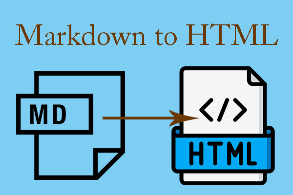

---
caption:
  figure:
    enable: false
  table:
    enable: false
  custom:
    enable: false


icon: octicons/markdown-16
---

{: style="display: block; margin: 0 auto"}
<H1 style="text-align: center;">Various Markdown / HTML</H1>


Nearly all Markdown applications support the basic syntax outlined in the original Markdown design document. There are minor variations and discrepancies between Markdown processors — those are noted inline wherever possible.

---

!!! pied-piper "Install uv"
    === "macOS and Linux"
        ```shell
        $ curl -LsSf astral.sh | sh
        ```
    === "Windows" 
        ```powershell
        PS> powershell -ExecutionPolicy ByPass -c "irm astral.sh | iex"
        ```

!!! pied-piper "Install Mercurial"
    === "Debian/Ubuntu"
        ```bash
        apt install mercurial
        ```

    === "Fedora"
        ```bash
        dnf install mercurial
        ```

    === "Arch Linux"
        ```bash
        pacman -S mercurial
        ```

    === "Gentoo"
        ```bash
        emerge mercurial
        ```

    === "macOS (Homebrew)"
        ```bash
        brew install mercurial
        ```

    === "FreeBSD"
        Binary packages can be installed using `pkg`:

        ```bash
        pkg install mercurial
        ```

        Alternatively, you can install from source via the ports collection:

        ```bash
        cd /usr/ports/devel/mercurial
        make install
        ```

    === "Windows (Mercurial)"
        Using the `winget` package manager:

        ```bash
        winget install Mercurial.Mercurial -e
        ```

        Or download from the list of [binary releases](https://www.mercurial-scm.org).

    === "Windows (TortoiseHg)"
        Using the `winget` package manager:

        ```bash
        winget install TortoiseHg.TortoiseHg -e
        ```

        Or download from the list of [binary releases](https://mercurial-book.readthedocs.io/en/latest/working-together/collab.html?highlight=windows+tortoisehg).
        

!!! tip "Tip"

    - Format and beautify markdown online for free. Fix syntax errors, standardize formatting, and lint [markdown](https://markdownlivepreview.dev/tools/markdown-formatter) files with professional Prettier integration.
    
    - Perfect for clean, consistent markdown.
    
---

!!! abstract " Note"

    - Packages often have [optional dependencies](https://wiki.archlinux.org/title/PKGBUILD#optdepends) which are packages that provide additional functionality to the application but not strictly required for running it. When installing a package, <i>pacman</i> will list a package's optional dependencies, but they will not be found in <code>pacman.log</code>. Use the [#Querying package databases](https://wiki.archlinux.org/title/Pacman#Querying_package_databases) command to view the optional dependencies of a package.
    
    - When installing a package which you require only as a (optional) dependency of some other package (i.e. not required by you explicitly), it is recommended to use the <code>--asdeps</code> option. For details, see the [#Installation reason](https://wiki.archlinux.org/title/Pacman#Installation_reason) section.
    

---

!!! tip "Tip"

    When there are multiple candidates, the list of choices presented will sort first by [repositories](https://wiki.archlinux.org/title/Repository) in the order they appear in <code>pacman.conf</code>, then alphabetically when multiple results exist from the same repository.
    

---

???+warning "Warning"

    - The Docker container is intended for local previewing purposes only and is not suitable for deployment.
    
    - This is because the web server used by MkDocs for live previews is not designed for production use and may have security vulnerabilities.
    

---

!!! quote "Danger"

    If the ESP is not mounted to `/boot`, make sure to not rely on the [systemd automount mechanism](https://wiki.archlinux.org/title/Fstab#Automount_with_systemd "Fstab") (including that of [systemd-gpt-auto-generator](https://wiki.archlinux.org/title/Systemd#GPT_partition_automounting "Systemd")) during kernel upgrades. Always mount it manually prior to any system or kernel update, otherwise you may not be able to mount it after the update, locking you in the currently running kernel with no ability to update the copy of kernel on the ESP.

    Alternatively [preload the required kernel modules on boot](https://wiki.archlinux.org/title/Kernel_module#systemd "Kernel module"), e.g.:

    ```text {.no-copy .no-style}
    /etc/modules-load.d/vfat.conf
    ```

    ---

    ```text {.no-copy .no-style}
    vfat
    nls_cp437
    nls_ascii
    ```

!!! note
    Some text.

    ```bash
    echo "some code"
    ```


---
> ⚠️ **Warning:**
>  *Users are expected to follow the guidance in the* [System maintenance#Upgrading the system](https://wiki.archlinux.org/title/System_maintenance#Upgrading_the_system) *section to upgrade their systems regularly and not blindly run the following command.*
>  *Arch only supports full system upgrades.* See [System maintenance#Partial upgrades are unsupported](https://wiki.archlinux.org/title/System_maintenance#Partial_upgrades_are_unsupported) and [#Installing packages](https://wiki.archlinux.org/title/Pacman#Installing_packages) for details.

---

> 📝 **Note:**
> *Pacman* will not remove configurations that the application itself creates (for example "dotfiles" in the home directory).
---

> You can [enable/start](https://wiki.archlinux.org/title/Enable/start) the `pacman-filesdb-refresh.timer` (provided within the [pacman-contrib](https://archlinux.org/packages/?name=pacman-contrib) package to refresh *pacman* files database weekly.

---

!!! tip "Tip"

    If <i>dracut</i> works on your machine <b>after you test it</b>, you can [uninstall](https://wiki.archlinux.org/title/Uninstall) [mkinitcpio](https://archlinux.org/packages/?name=mkinitcpio)
    

---

!!! note "📝 To generate an initramfs for the running kernel::"

    ```bash
    # dracut --add-confdir no-network /boot/initramfs-linux.img
    ```
    
    ---
    
    
    - In some cases, especially when installing a system for the first time, the above command will not work. Use the following:
    
    ```bash
    $ dracut -f --regenerate-all
    ```
    
---

!!! abstract "Note"

    - Packages often have [optional dependencies](https://wiki.archlinux.org/title/PKGBUILD#optdepends) which are packages that provide additional functionality to the application but not strictly required for running it. When installing a package, <i>pacman</i> will list a package's optional dependencies, but they will not be found in <code>pacman.log</code>. Use the [#Querying package databases](https://wiki.archlinux.org/title/Pacman#Querying_package_databases) command to view the optional dependencies of a package.
    
    - When installing a package which you require only as a (optional) dependency of some other package (i.e. not required by you explicitly), it is recommended to use the <code>--asdeps</code> option.
    
    - For details, see the [#Installation reason](https://wiki.archlinux.org/title/Pacman#Installation_reason) section.
    
    
---

!!! tip "Tip"

    When there are multiple candidates, the list of choices presented will sort first by [repositories](https://wiki.archlinux.org/title/Repository) in the order they appear in <code>pacman.conf</code>, then alphabetically when multiple results exist from the same repository.
    

---

???+ warning "Warning"

    - The Docker container is intended for local previewing purposes only and is not suitable for deployment.
    
    - This is because the web server used by MkDocs for live previews is not designed for production use and may have security vulnerabilities.
    
---

!!! pied-piper "Pied Piper"

    ``` markdown title="The last 3 special directories."


     NB: The last 3 special directories (last, week and month) which links
     repectively to the last synced repository, to the last Monday and to the first of
     the current month.
    ```
---

!!! note "Note"

    If the ESP is not mounted to `/boot`, make sure to not rely on the [systemd automount mechanism](https://wiki.archlinux.org/title/Fstab#Automount_with_systemd Fstab) (including that of [systemd-gpt-auto-generator](https://wiki.archlinux.org/title/Systemd#GPT_partition_automounting Systemd)) during kernel upgrades. Always mount it manually prior to any system or kernel update, otherwise you may not be able to mount it after the update, locking you in the currently running kernel with no ability to update the copy of kernel on the ESP.

    Alternatively [preload the required kernel modules on boot](https://wiki.archlinux.org/title/Kernel_module#systemd Kernel module), e.g.:

    ```text {.no-copy .no-style}
    /etc/modules-load.d/vfat.conf
    ```

    ---

    ```text {.no-copy .no-style}
    vfat
    nls_cp437
    nls_ascii
    ```

---

!!! note "Note"

    <h5>alert alert-info</h5>
    
    Several drivers has been removed from the main branch, and now live on in the [Amber](https://docs.mesa3d.org/amber.html) branch where they are community maintained and only receive critical fixes.
    
    
???+ question "Recommended: [configuration validation and auto-complete](https://x.com/squidfunk/status/1487746003692400642)"

    In order to minimize friction and maximize productivity, Material for MkDocs provides its own [`schema.json`](https://github.com/squidfunk/mkdocs-material/blob/master/docs/schema.json) for `mkdocs.yml`. If your editor supports YAML schema validation, it's definitely recommended to set it up:

    === "Visual Studio Code"

        1. Install [`vscode-yaml`](https://marketplace.visualstudio.com/items?itemName=redhat.vscode-yaml) for YAML language support.
        2. Add the schema under the `yaml.schemas` key in your user or workspace [`settings.json`](https://code.visualstudio.com/docs/getstarted/settings):

           ```json
           {
             "yaml.schemas": {
               "https://squidfunk.github.io/mkdocs-material/schema.json": "mkdocs.yml"
             },
             "yaml.customTags": [ 
               "!ENV scalar",
               "!ENV sequence",
               "!relative scalar",
               "tag:yaml.org,2002:python/name:material.extensions.emoji.to_svg",
               "tag:yaml.org,2002:python/name:material.extensions.emoji.twemoji",
               "tag:yaml.org,2002:python/object/apply:pymdownx.superfences.fence_code_format",
               "tag:yaml.org,2002:python/object/apply:pymdownx.slugs.slugify mapping"
             ]
           }
           ```

    === "Other"

        1. Ensure your editor of choice has support for YAML schema validation.
        2. Add the following lines at the top of `mkdocs.yml`:

           ```yaml
           # yaml-language-server: $schema=https://squidfunk.github.io/mkdocs-material/schema.json
           ```
  
---

???+ question "How to add plugins to the Docker image?"

    Material for MkDocs only bundles selected plugins in order to keep the size of the official image small. If the plugin you want to use is not included, you can add them easily:

    === "Material for MkDocs"

        Create a `Dockerfile` and extend the official image:

        ```Dockerfile title="Dockerfile"
        FROM squidfunk/mkdocs-material
        RUN pip install mkdocs-macros-plugin
        RUN pip install mkdocs-glightbox
        ```

    === "Insiders"

        Clone or fork the Insiders repository, and create a file called `user-requirements.txt` in the root of the repository. Then, add the plugins that should be installed to the file, e.g.:

        ```text title="user-requirements.txt"
        mkdocs-macros-plugin
        mkdocs-glightbox
        ```

    Next, build the image with the following command:

    ```bash
    docker build -t squidfunk/mkdocs-material .
    ```

    The new image will have additional packages installed and can be used exactly like the official image.

---

???+ question "Change The Colour Palette"

    - If you intend to change the entire colour palette of the bar, all you have to do is create a new colour palette and paste it in the config.

    - No need to change individual colours of all modules and sub-items.
    

??? question "Change The Colour Palette"

    - If you intend to change the entire colour palette of the bar, all you have to do is create a new colour palette and paste it in the config.

    - No need to change individual colours of all modules and sub-items.
    

---

!!! pied-piper "Note"

    To activate Python virtual environment on [Windows](http://www.w3.org/2000/svg" viewBox="0 0 24 24") Type <code>.\venv\Scripts\activate</code> instead.
    
    
    ---
    
    To check Python location on [Windows](http://www.w3.org/2000/svg" viewBox="0 0 24 24" ) Type<code>where python</code> instead on the command prompt or Powershell terminal
    
    
---

!!! example "Change the background color"

    To change the background color to an attention-grabbing hot pink, you might add:

    ```yaml title="config.yml"
    plugins:
      - social:
          cards_layout_options:
            background_color: "#ff1493"
    ```

---

!!! example "Social cards for event pages"

    First, create a directory in your `docs` directory to hold the event pages:

    ```text title="Terminal"
    $ mkdir docs/events
    ```

    Then, add a file `.meta.yml` inside this new directory with settings for the page icon and a hot pink background color that will stand out on social media. Note that you can override the background image by setting it to `null` here since it is not visible anyway because of the opaque coloring.

    ```yaml title=".meta.yml"
    ---
    icon: material/calendar-plus
    social:
      cards_layout_options:
        background_image: null
        background_color: "#ff1493"
    ---
    ```

    Now add a page within the `docs/events` directory. It does not need to have any special content, just a top level header.

    To turn on the `default/variant` layout in `mkdocs.yml`, add the `cards_layout` option and also add the meta plugin:

    ```yaml title="mkdocs.yml"
    plugins:
      - meta
      - social:
          cards_layout: default/variant
    ```

    After running `mkdocs build`, you can see that the social card at `site/assets/images/social/events/index.png` features the page icon.

---

!!! abstarct "Built-in plugins not working after upgrade?"

    - Built-in plugins not working after upgrade? If one of the built-in plugins (search or tags) doesn't work anymore without any apparent error or cause, it is very likely related to custom overrides.
    
    - [MkDocs 1.4.1](https://github.com/mkdocs/mkdocs/releases/tag/1.4.1) and above allow themes to namespace built-in plugins, which Material for MkDocs 9 now does in order to allow authors to use third-party plugins with the same name as built-in plugins.
    
    - Search your overrides for ["in config.plugins"](https://github.com/squidfunk/mkdocs-material/search?q=%22in+config.plugins%22)  and add the <code>material/</code> namespace. Affected partials:
    
    - [content.html](https://github.com/squidfunk/mkdocs-material/blob/master/src/templates/partials/content.html")
    
    - [header.html](https://github.com/squidfunk/mkdocs-material/blob/master/src/templates/partials/header.html)
    
---

!!! danger "Warning"

    This operation is recursive, and must be used with care since it can remove many potentially needed packages. <pre># pacman -Rsc <i>package_name</i> 
    

<div class="isolated-table-container" markdown="1">

| Action | Command | Note |
|:-------|:--------|:-----|
| **Analyzing the system state.** | | |
| **Show system status.** | `systemctl status` | JohnAMD State: Running. Units: Loaded. |
| **List running.** units | `systemctl` or `systemctl list-units` | |
| **List failed.** units | `systemctl --failed` | |
| **List installed.** unit files<sup>1</sup>. | `systemctl list-unit-files` | |
| **Show process status.** for a PID | `systemctl status *pid*` | [Cgroup slice](https://wiki.archlinux.org/title/Cgroups "Cgroups"), memory and parent |

| **Checking the unit status.** | | |
|:-------|:--------|:-----|
| **Show a manual page** Associated with a unit. | `systemctl help *unit*` | As supported by the unit. |
| **Status** of a unit. | `systemctl status *unit*` | Including whether it is running or not. |
| **Check** whether a unit is enabled. | `systemctl is-enabled *unit*` | |

| **Start, restart, reload unit** | | |
|:-------|:--------|:-----|
| **Start** a unit immediately. | `systemctl start *unit*` as root | |
| **Stop** a unit immediately. | `systemctl stop *unit*` as root | |
| **Restart** a unit. | `systemctl restart *unit*` as root | |
| **Reload** a unit and its configuration. | `systemctl reload *unit*` as root | |
| **Reload systemd manager** configuration.<sup>2</sup> | `systemctl daemon-reload` as root | scan for new or changed units |

| Enabling a unit. | | |
|:-------|:--------|:-----|
| **Enable** a unit to start automatically at boot. | `systemctl enable *unit*` as root | |
| **Enable** a unit to start automatically at boot and **start** it immediately. | `systemctl enable --now *unit*` as root | |
| **Disable** a unit to no longer start at boot. | `systemctl disable *unit*` as root | |
| **Reenable** a unit<sup>3</sup>. | `systemctl reenable *unit*` as root | i.e. disable and enable anew |

| Masking a unit. | | |
|:-------|:--------|:-----|
| **Mask** a unit to make it impossible to start<sup>4</sup>. | `systemctl mask *unit*` as root | |
| **Unmask** a unit. | `systemctl unmask *unit*` as root | Unmask a unit to make it start |

</div>


---

???tip "A Forest Green Background."

    • For a forest green background, selecting a border color that ensures high contrast and readability in both light and dark modes is essential. In dark mode, a light gray or off-white border, such as #F0F0F0, can provide sufficient contrast against a forest green background like #3E5641, enhancing visual separation without overwhelming the design.
    
    • This approach maintains clarity and aligns with best practices for dark mode color schemes, where subtle borders or shadows are recommended to define elements.
    
    • In light mode, a slightly darker shade of gray or a muted neutral tone, such as #D0D0D0, works well as a border color to contrast with the forest green background while avoiding visual fatigue. This ensures that the border remains visible and functional across both modes.
    
    • For consistency and dynamic adaptation, consider defining these colors as paired values in your design system—using a dynamic color provider that automatically adjusts the border color based on the current mode. This ensures the border remains legible and aesthetically appropriate regardless of the user’s selected theme.
    


---

####For Web Development (CSS/JavaScript)  

The most robust approach uses CSS variables to define colors and a media query to switch those variables based on the user's system preference or a manual toggle.

---

1\. Using CSS and the prefers-color-scheme media query This method respects the user's operating system setting automatically.

**CSS:** 

!!! pied-piper "CSS"

    ```markdown title="• Define variables for different modes."
    /* Define variables for light mode first (default) */
    :root {
      --border-color: #000000; /* Black border for light mode */
      --background-color: #ffffff;
      color-scheme: light dark; /* Informs the user agent about supported schemes */
    }
    
    /* Override variables for dark mode */
    @media (prefers-color-scheme: dark) {
      :root {
        --border-color: #ffffff; /* White border for dark mode */
        --background-color: #121212;
      }
    }
    
    /* Apply the variable to an element */
    .my-element {
      border: 2px solid var(--border-color);
      background-color: var(--background-color);
      padding: 1rem;
    }
    ```
    
    ---
    
    
    - Include the `<meta name="color-scheme" content="light dark">` tag in your HTML's `<head>` to prevent flashes of unstyled content on page load.
    

---

2\. Using the `light-dark()` CSS function 

A newer CSS function, `light-dark()`, provides complete control over light and dark mode colors in one declaration. This also requires the `color-scheme` property to be set on the `:root` element. 

CSS:

!!! pied-piper "CSS Function"

    ```markdown title="• A newer CSS function."
    :root {
      color-scheme: light dark;
    }
    
    .my-element {
    /* First value for light mode, second for dark mode */
      border: 2px solid light-dark(#000000, #ffffff);
    }
    ```
    
---

3\. Combining with JavaScript for a manual toggle 

If you want to allow users to manually switch modes, use JavaScript to add a class to the `<body>` tag and define the dark mode styles under that class. 

CSS:

!!! warning "CSS, manually switching modes"

    ```markdown title="• Combining with JavaScript for a manual toggle."
    :root {
      --border-color: #000000;
    }
    
    body.dark-mode {
      --border-color: #ffffff; /* Override the variable for manual dark mode */
    }
    
    .my-element {
      border: 2px solid var(--border-color);
    }
    ```
    
---

 JavaScript:
 
!!! warning "JavaScript manually switching modes"
 
    ```markdown title="• Manually switching modes."
    // Function to toggle the dark-mode class on the body
    function toggleDarkMode() {
      document.body.classList.toggle('dark-mode');
    }
    
    // Example button click handler (assuming a button with id="theme-toggle")
    document.getElementById('theme-toggle').addEventListener('click', toggleDarkMode);
    
    // Optionally, detect the initial system preference
    const prefersDark = window.matchMedia('(prefers-color-scheme: dark)');
    if (prefersDark.matches) {
      document.body.classList.add('dark-mode');
    }
    ```
    
---

html:

??? pied-piper "HTML Source Code"

    ```html
    <!DOCTYPE html>
    <html lang="en">
    <head>
        <meta charset="UTF-8">
        <meta name="viewport" content="width=device-width, initial-scale=1.0">
        <title>Dynamic Color Provider</title>
        <style>
            /* Define CSS variables for light mode (default) */
            :root {
                --background-color: #ffffff;
                --text-color: #000000;
                --border-color: #000000; /* Default border color */
            }

            /* Define CSS variables for dark mode */
            body.dark-mode {
                --background-color: #1a1a1a;
                --text-color: #ffffff;
                --border-color: #ffffff; /* Dark mode border color */
            }

            body {
                background-color: var(--background-color);
                color: var(--text-color);
                transition: background-color 0.3s, color 0.3s;
                font-family: sans-serif;
                display: flex;
                flex-direction: column;
                align-items: center;
                justify-content: center;
                height: 100vh;
                margin: 0;
            }

            .content-box {
                padding: 20px;
                border: 5px solid var(--border-color); /* The dynamic border */
                transition: border-color 0.3s;
                text-align: center;
            }

            button {
                margin-top: 20px;
                padding: 10px 15px;
                cursor: pointer;
            }
        </style>
    </head>
    <body>
        <div class="content-box">
            <h1>Dynamic Border Color</h1>
            <p>The border color of this box changes with the mode.</p>
        </div>

        <button onclick="toggleMode()">Toggle Mode</button>

        <script>
            function toggleMode() {
                const body = document.body;
                // Toggle the 'dark-mode' class on the body
                body.classList.toggle('dark-mode');
            }
        </script>
    </body>
    </html>
    ```


#### For PC's without wifi/bluetooth hardware.

!!! info "For PC's without wifi/bluetooth hardware."

    The short answer is to execute the following command:
    
    ```bash
    cp /usr/share/gdm/default.pa ~/.config/pulse/
    ```
    
    ---
    
    So search the the global settings and find the `default.pa` file there. You might want to edit this file, which is what I did!
    
    ```bash
    sudo nano /etc/pulse/default.pa
    ```
    
    ---
    
    Comment out the lines below that loaded the bluetooth module. And the error will be removed.
    
    ```bash
    ### Automatically load driver modules for Bluetooth hardware (edited)
    #.ifexists module-bluetooth-policy.so
    #load-module module-bluetooth-policy
    #.endif
    
    #.ifexists module-bluetooth-discover.so
    #load-module module-bluetooth-discover
    #.endif
    ```
    
    ---
    
    Or if you don't like changing a global config file as root, you can copy the file from:
    
    ```bash
    /etc/pulse/default.pa
    ```
    
    to your
    
    ```bash
    ~/.config/pulse/default.pa
    ```
    
    and edit the file there and comment out these lines locally.
    
    ---
    
    
    !!! tip "Tip"
    
        Please note that this applies only to systems that do not have wifi/bluetooth hardware.

    

---

[ **uv**](https://github.com/astral-sh/uv)

---


<h3>Packages for common Linux and BSD distributions can be installed from the system specific repositories:</h3>
<H3>macOS & Linux:</h3>


!!! installation "Install uv"
    === "macOS and Linux"
        ```shell
        $ curl -LsSf astral.sh | sh
        ```
    === "Windows"
        ```powershell
        PS> powershell -ExecutionPolicy ByPass -c "irm astral.sh | iex"
        ```


---

!!! note "The Title"

    The content is correctly parsed because it's separated by blank lines from the raw HTML block tags.
    


!!! note "Installation"
    Use the following command to install uv:
    ```bash
    python -m ensurepip && python -m pip install uv
    ```

---

<H3>Mercurial</H3>

!!! warning " Mercurial"

    Mercurial is available on PyPI as wheels and sdist, so one can install the latest stable version with any PyPI front-ends (like [UV](https://docs.astral.sh/uv),  [pipx](https://pipx.pypa.io), [pip](https://pip.pypa.io, ...))
    

---
<div markdown="1">
!!! settings "Install Mercurial"
    === "Debian/Ubuntu"
        ```bash
        apt install mercurial
        ```

    === "Fedora"
        ```bash
        dnf install mercurial
        ```

    === "Arch Linux"
        ```bash
        pacman -S mercurial
        ```

    === "Gentoo"
        ```bash
        emerge mercurial
        ```

    === "macOS (Homebrew)"
        ```bash
        brew install mercurial
        ```

    === "FreeBSD"
        Binary packages can be installed using `pkg`:

        ```bash
        pkg install mercurial
        ```

        Alternatively, you can install from source via the ports collection:

        ```bash
        cd /usr/ports/devel/mercurial
        make install
        ```

    === "Windows (Mercurial)"
        Using the `winget` package manager:

        ```bash
        winget install Mercurial.Mercurial -e
        ```

        Or download from the list of [binary releases](https://www.mercurial-scm.org).

    === "Windows (TortoiseHg)"
        Using the `winget` package manager:

        ```bash
        winget install TortoiseHg.TortoiseHg -e
        ```

        Or download from the list of [binary releases](https://mercurial-book.readthedocs.io/en/latest/working-together/collab.html?highlight=windows+tortoisehg).

</div>
---

####Website Hex Codes.


!!! example "Website HEX codes."

    I spent some time investigating and I believe any colors that follow the following HEX code will work:
    
    ```css {.no-copy}
    • #FF0099 - 255, 0, 153 - PinkPurple
    • #FF9900 - 255, 153, 0 - OrangeYellow
    • #99FF00 - 153, 255, 0 - Lime Green - NOT GOOD
    • #9900FF - 153, 0, 255 - PurpleViolet
    • #0099FF - 0, 153, 255 - BlueCyan
    • #00FF99 - 0, 255, 153 - Sea Green  - NOT GOOD
    ```
    
    This pattern places all of these color codes on the Web Safe list of colors; I was unaware of that before I started investigating this. For a full list of all the web safe colors, check out this Web Safe Color Chart. [Colour Chart](https://websafecolors.info/color-chart) and [web-safe-color-chart](https://htmlcolorcodes.com/color-chart/web-safe-color-chart/) This is the website I used to check the colors (icons, not text unfortunately) on both light and dark background: [icon-set/atlas](https://notionicons.so/icon-set/atlas)
    
    
    ```css {.no-copy}
    • #FF0099 - 255, 0, 153 - PinkPurple
    • #FF9900 - 255, 153, 0 - OrangeYellow
    • #66CC00 - 102, 204, 0 - GreenBlue
    • #9900FF - 153, 0, 255 - PurpleViolet
    • #0099FF - 0, 153, 255 - BlueCyan
    • #00CC66 - 0, 204, 102 - BlueGreen
    ```
    
    
    !!! danger "Warning"
    
        Please be aware that the names I chose to describe the colours are not official names. Looking at the colours of the icons as you switch a theme from dark to light several times can create optical illusions in which the colours appear to be different on different themes
        
    

---

!!! danger "Warning"

    Please be aware that the names I chose to describe the colours are not official names. Looking at the colours of the icons as you switch a theme from dark to light several times can create optical illusions in which the colours appear to be different on different themes.
    
---


### UV

##### Installation

??? abstract "UV Installation"

    <b>Install uv with our standalone installers:</b>
    
    ---
    
    <b># On macOS and Linux.</b>
    
    ```css
    curl -LsSf https://astral.sh/uv/install.sh | sh
    ```
    
    ---
        
    <b># On Windows.</b>
    
    ```powershell
    powershell -ExecutionPolicy ByPass -c "irm https://astral.sh/uv/install.ps1 | iex"
    ```
    
    ---
    
    <b># With pip.</b>
    
    ```css
    $ pip install uv
    ```
    
    ---
    
    <b># Or pipx.</b>
    
    ```css
    $ pipx install uv
    ```
    
    ---
    
    <b>If installed via the standalone installer, uv can update itself to the latest version:</b>
    
    ```css
    $ uv self update
    ```

!!! tip "Tip"

    • uv may also be installed with pip, Homebrew, and more. See all of the methods on the [Getting-started](https://docs.astral.sh/uv/getting-started/)
    
    • See the [installation documentation](https://docs.astral.sh/uv/getting-started/installation/) for details and alternative installation methods.
    
#### Documentation
  
uv's documentation is available at [UV Docs](https://docs.astral.sh/uv).

!!! tip "Tip"

    uv may also be installed with pip, Homebrew, and more. See all of the methods on the [installation page](https://docs.astral.sh/uv/getting-started/installation/)
    

!!! tip "Tip"

    - uv manages project dependencies and environments, with support for lockfiles, workspaces, and more, similar to rye or poetry.
    
    ```bash {.no-copy}
    $ uv init example Initialized project example at /home/user/example
    $ cd example
    
    $ uv add ruff
    Creating virtual environment at: .venv
    Resolved 2 packages in 170ms
       Built example @ file:///home/user/example
    Prepared 2 packages in 627ms
    Installed 2 packages in 1ms
     + example==0.1.0 (from file:///home/user/example)
     + ruff==0.5.4
    
    $ uv run ruff check
    All checks passed!
    
    $ uv lock
    Resolved 2 packages in 0.33ms
    $ uv sync
    Resolved 2 packages in 0.70ms
    Audited 1 package in 0.02ms
    ```
    
---


##Scripts

!!! tip "Scripts"

    Create a new script and add inline metadata declaring its dependencies:
    
    ```bash {.no-copy}
    $ echo 'import requests; print(requests.get("https://astral.sh"))' > example.py
    
    $ uv add --script example.py requests
    Updated `example.py`
    ```
    
---

!!! note "Note"

    If you are not familiar with Python environments: every Python installation has an environment that packages can be installed in. Typically, creating [virtual environments](https://docs.python.org/3/library/venv.html) is recommended to isolate packages required by each script. uv automatically manages virtual environments for you and prefers a [declarative](https://docs.astral.sh/uv/guides/scripts/#declaring-script-dependencies) approach to dependencies.
    
    

<div class="grid cards" markdown>

-   :material-clock-fast:{ .lg .middle } __Set up in 5 minutes__

    ---

    Install [`mkdocs-material`](https://pypistats.org/packages/mkdocs-material) with [`pip`](https://squidfunk.github.io/mkdocs-material/getting-started/#with-pip) and get up
    and running in minutes

    [:octicons-arrow-right-24: Getting started](https://squidfunk.github.io/mkdocs-material/getting-started/)

-   :fontawesome-brands-markdown:{ .lg .middle } __It's just Markdown__

    ---

    Focus on your content and generate a responsive and searchable static site

    [:octicons-arrow-right-24: Reference](https://squidfunk.github.io/mkdocs-material/reference/)

-   :material-format-font:{ .lg .middle } __Made to measure__

    ---

    Change the colors, fonts, language, icons, logo and more with a few lines

    [:octicons-arrow-right-24: Customization](https://squidfunk.github.io/mkdocs-material/customization/)

-   :material-scale-balance:{ .lg .middle } __Open Source, MIT__

    ---

    Material for MkDocs is licensed under MIT and available on [GitHub](https://github.com/squidfunk/mkdocs-material)

    [:octicons-arrow-right-24: License](https://squidfunk.github.io/mkdocs-material/license/)

</div>

!!! tip "Tip"

    Add the above commands to a script and [autostart] (https://wiki.archlinux.org/title/Autostart) it to automate the process. Be sure to replace <code>alsa_output.pci-0000_00_14.2.analog-surround-40</code> with the name of your sound card. Adding a delay before the script executes may also make things work smoother.
    

!!! note "Note"

    - The Jack/Pipewire sinks seem to change name now and then.
    
    - In the above example, alsa_output.pci-0000_00_14.2.analog-surround-40:playback_FL, sometimes changes into <code>Built-in\ Audio\ Analog\ Surround\ 4.0:playback_FL</code>. As a quick workaround, you could add a second set of <code>pw-jack</code> commands in your autostart script with the second set of names.
    
    
> 🖥️ Create intelligent and beautiful documentation with ease.

!!! note "📝 Rich Text Formatting"

    Author in [reStructuredText](https://www.sphinx-doc.org/en/master/usage/restructuredtext/basics.html#rst-primer) or [MyST Markdown](https://www.sphinx-doc.org/en/master/usage/markdown.html#markdown%22) to create highly structured technical documents, including tables, highlighted code blocks, mathematical notations, and more.
    

!!! note "🔗 Powerful Cross-Referencing"

    Create [cross-references](https://www.sphinx-doc.org/en/master/usage/extensions/intersphinx.html#ext-intersphinx) within your project, and even across [different projects](https://www.sphinx-doc.org/en/master/usage/extensions/intersphinx.html#ext-intersphinx). Include references to sections, figures, tables, citations, glossaries, code objects, and more.
    
    
!!! note "📚 Versatile Documentation Formats"

    Generate documentation in the preferred formats of your audience, including HTML, LaTeX (for PDF), ePub, Texinfo, [and more](https://www.sphinx-doc.org/en/master/usage/builders/index.html#builders).
    
!!! note "🎨 Extensive Theme Support"

    Create visually appealing documentation, with a wide choice of [built-in](https://www.sphinx-doc.org/en/master/usage/theming.html#builtin-themes) and [third-party](https://www.sphinx-doc.org/en/master/usage/theming.html#third-party-themes) HTML themes and the ability to customize or [create new themes](http://127.0.0.1:8000/Various_HTML_Markdown/development/html_themes/index.html#extension-html-theme).
    
!!! note "🔌 Fully Extensible"

    Add custom functionality, via robust [extension mechanisms](https://www.sphinx-doc.org/en/master/development/index.html#extending-sphinx) with numerous [built-in](https://www.sphinx-doc.org/en/master/usage/extensions/index.html#builtin-extensions) and [third-party](https://www.sphinx-doc.org/en/master/usage/extensions/index.html#third-party-extensions) extensions available for tasks like creating diagrams, testing code, and more.
    
!!! note "🛠️ Automatic API Documentation"

    Generate API documentation for Python, C++ and other [software domains](https://www.sphinx-doc.org/en/master/usage/domains/index.html#usage-domains), manually or [automatically from docstrings](https://www.sphinx-doc.org/en/master/usage/extensions/autodoc.html#ext-autodoc), ensuring your code documentation stays up-to-date with minimal effort.
    
!!! note "🌍 Internationalization (i18n)"

    Add documentation [translations](https://www.sphinx-doc.org/en/master/usage/advanced/intl.html#intl) for multiple languages to reach a global audience.
    
!!! note "🌟 Active Community and Support"

    Benefit from an [active community](https://www.sphinx-doc.org/en/master/support.html#support-index), with numerous resources, tutorials, forums, and examples.
    
    

| Extension | Link | Description |
| --------- | ---- | ----------- |
| **cedit** | [CeditExtension](https://github.com/chaitanyarahalkar/Cedit) | Command line editor for configuration files, never manually edit hgrc files again |
| **config** | [ConfigExtensionCommandLine](https://mercurial-scm.org/search.html?q=Extension#) | Manage config files via command line only |
| **configexpress** | [ConfigExpressExtension](https://mercurial-scm.org/search.html?q=extension+express#) | Monitor and enforce client configuration from a server |
| **dynamic_username** | [DynamicUsernameExtension](https://mercurial-scm.org/help/topics/config) | Set your username per directory tree. |
| **hgcfg** | [HgcfgExtension](https://github.com/tue-robotics-graveyard/hgcfg) | Display or modify local, user, and global configuration. |
| **hgconfig** | [ConfigExtension](https://mercurial-scm.org/help/topics/config) | (dead) Manage hgrc files via dialogs and command line |
| **path_pattern** | [PathPatternExtension](https://pypi.org/project/mercurial-path-pattern/0.8.0/) | Define [paths] globally in your .hgrc (as patterns), and have them known all your repositories. |
| **projrc** | [ProjrcExtension](https://tortoisehg.readthedocs.io/en/latest/extensions.html) | Parse project specific config from .hg/projrc |
| **rcpath** | [RcpathExtension](https://mercurial-scm.org/help/topics/config) | Displays Mercurial configuration file paths and names |
| **reposettings** | [ReposettingsExtension](https://mercurial-scm.org/help/topics/config) | Allow repo specific configuration from central configuration files |

!!! info "Code Block"

    ```css {.no-copy}
    # code block
      print '3 backticks or'
      print 'indent 4 spaces'
    ```
    

!!! pied-piper "Pied Piper"

    ``` markdown title="The last 3 special directories."
    
    
    NB: The last 3 special directories (last, week and month) which links repectively to the last
    synced repository, to the last Monday and to the first of the current month.
    ```

---
<center>My Centered Heading</center>
`Inline code` with backticks

---

##### GElectrical

[](https://flathub.org/en/apps/com.kavilgroup.gelectrical)

##### GEstimator

[](https://flathub.org/en/apps/com.kavilgroup.gestimator)


---

!!!danger "Warning"

    In order to be able to log in, the login shell must be one of those listed in /etc/shells, otherwise the [PAM](https://man.archlinux.org/man/PAM.8) module [pam_shells(8)](https://man.archlinux.org/man/pam_shells.8) will deny the login request.
    
    
---
    
!!! info "[How to set up Material for MkDocs](https://www.youtube.com/watch?v=xlABhbnNrfI)"

    <p><span class="twemoji" style="color: #EE0F0F"><svg xmlns="http://www.w3.org/2000/svg" viewBox="0 0 576 512"><!-- Font Awesome Free 7.0.1 by @fontawesome - https://fontawesome.com License - https://fontawesome.com/license/free (Icons: CC BY 4.0, Fonts: SIL OFL 1.1, Code: MIT License) Copyright 2025 Fonticons, Inc.--><path d="M549.7 124.1c-6.2-23.7-24.8-42.3-48.3-48.6C458.9 64 288.1 64 288.1 64S117.3 64 74.7 75.5c-23.5 6.3-42 24.9-48.3 48.6C15 167 15 256.4 15 256.4s0 89.4 11.4 132.3c6.3 23.6 24.8 41.5 48.3 47.8C117.3 448 288.1 448 288.1 448s170.8 0 213.4-11.5c23.5-6.3 42-24.2 48.3-47.8 11.4-42.9 11.4-132.3 11.4-132.3s0-89.4-11.4-132.3zM232.2 337.6V175.2l142.7 81.2z"></path></svg></span> <strong><a href="https://www.youtube.com/watch?v=xlABhbnNrfI">How to set up Material for MkDocs</a></strong> by <a class="magiclink magiclink-github magiclink-mention" href="https://github.com/james-willett" title="GitHub User: james-willett">@james-willett</a> – <span class="twemoji"><svg xmlns="http://www.w3.org/2000/svg" viewBox="0 0 24 24"><path d="M12.5 7.25a.75.75 0 0 0-1.5 0v5.5c0 .27.144.518.378.651l3.5 2a.75.75 0 0 0 .744-1.302L12.5 12.315z"></path><path d="M12 1c6.075 0 11 4.925 11 11s-4.925 11-11 11S1 18.075 1 12 5.925 1 12 1M2.5 12a9.5 9.5 0 0 0 9.5 9.5 9.5 9.5 0 0 0 9.5-9.5A9.5 9.5 0 0 0 12 2.5 9.5 9.5 0 0 0 2.5 12"></path></svg></span> 27m – Learn how to create and host a documentation site using Material for MkDocs on GitHub Pages in a step-by-step guide.</p>

---

!!! tip "Tip"

    If you don't have prior experience with Python, we recommend reading [Using Python's pip to Manage Your Projects' Dependencies](https://realpython.com/what-is-pip/), which is a really good introduction on the mechanics of Python package management and helps you troubleshoot if you run into errors.
    

!!! tip "Tip"

    You can create a link from the user's former home directory to the new one. Doing this will allow programs to find files that have hardcoded paths.
    
    ```
    # ln -s /my/new/home/ /my/old/home
    ```
    
    Make sure there is no trailing / on /my/old/home.
    

---

<div class="isolated-table-container">
  <style>
    .isolated-table-container .wikitable {
      border-collapse: collapse;
      width: 100%;
      max-width: 800px;
      margin: 20px auto;
      border: 1px solid #ccc;
      font-size: 16px;
    }
    .isolated-table-container .wikitable th,
    .isolated-table-container .wikitable td {
      border: 1px solid #ccc;
      padding: 8px;
      text-align: left;
    }
    .isolated-table-container .wikitable th {
      background-color: #FFFFFF;
      font-weight: bold;
      color: #333333;
    }
    .isolated-table-container .wikitable a {
      color: #0064d2;
      text-decoration: underline;
    }
    @media (prefers-color-scheme: dark) {
      .isolated-table-container .wikitable {
        border-color: #F0F0F0;
      }
      .isolated-table-container .wikitable th,
      .isolated-table-container .wikitable td {
        border-color: #D0D0D0;
      }
      .isolated-table-container .wikitable th {
        background-color: #006C3B;
        color: #e0e0e0;
      }
      .isolated-table-container .wikitable a {
        color: #6BDDEA;
      }
      .isolated-table-container .wikitable td {
        color: #008B72;
      }
      .isolated-table-container .wikitable td.note a {
        color: #fff;
      }
    }
  </style>
  <table class="wikitable">
    <tbody>
      <tr>
        <th>Action</th>
        <th>Command</th>
        <th>Note</th>
      </tr>
      <tr>
        <th colspan="3">Analyzing the system state</th>
      </tr>
      <tr>
        <td class="action"><b>Show system status</b></td>
        <td><code>systemctl status</code></td>
        <td></td>
      </tr>
      <tr>
        <td class="action"><b>List running</b> units</td>
        <td><code>systemctl</code> or<br><code>systemctl list-units</code></td>
        <td></td>
      </tr>
      <tr>
        <td class="action"><b>List failed</b> units</td>
        <td><code>systemctl --failed</code></td>
        <td></td>
      </tr>
      <tr>
        <td class="action"><b>List installed</b> unit files<sup>1</sup></td>
        <td><code>systemctl list-unit-files</code></td>
        <td></td>
      </tr>
      <tr>
        <td class="action"><b>Show process status</b> for a PID</td>
        <td><code>systemctl status <i>pid</i></code></td>
        <td><a href="https://wiki.archlinux.org/title/Cgroups" title="Cgroups">cgroup slice</a>, memory and parent</td>
      </tr>
      <tr>
        <th colspan="3">Checking the unit status</th>
      </tr>
      <tr>
        <td class="action"><b>Show a manual page</b> associated with a unit</td>
        <td><code>systemctl help <i>unit</i></code></td>
        <td>as supported by the unit</td>
      </tr>
      <tr>
        <td class="action"><b>Status</b> of a unit</td>
        <td><code>systemctl status <i>unit</i></code></td>
        <td>including whether it is running or not</td>
      </tr>
      <tr>
        <td class="action"><b>Check</b> whether a unit is enabled</td>
        <td><code>systemctl is-enabled <i>unit</i></code></td>
        <td></td>
      </tr>
      <tr>
        <th colspan="3">Starting, restarting, reloading a unit</th>
      </tr>
      <tr>
        <td class="action"><b>Start</b> a unit immediately</td>
        <td><code>systemctl start <i>unit</i></code> as root</td>
        <td></td>
      </tr>
      <tr>
        <td class="action"><b>Stop</b> a unit immediately</td>
        <td><code>systemctl stop <i>unit</i></code> as root</td>
        <td></td>
      </tr>
      <tr>
        <td class="action"><b>Restart</b> a unit</td>
        <td><code>systemctl restart <i>unit</i></code> as root</td>
        <td></td>
      </tr>
      <tr>
        <td class="action"><b>Reload</b> a unit and its configuration</td>
        <td><code>systemctl reload <i>unit</i></code> as root</td>
        <td></td>
      </tr>
      <tr>
        <td class="action"><b>Reload systemd manager</b> configuration<sup>2</sup></td>
        <td><code>systemctl daemon-reload</code> as root</td>
        <td>scan for new or changed units</td>
      </tr>
      <tr>
        <th colspan="3">Enabling a unit</th>
      </tr>
      <tr>
        <td class="action"><b>Enable</b> a unit to start automatically at boot</td>
        <td><code>systemctl enable <i>unit</i></code> as root</td>
        <td></td>
      </tr>
      <tr>
        <td class="action"><b>Enable</b> a unit to start automatically at boot and <b>start</b> it immediately</td>
        <td><code>systemctl enable --now <i>unit</i></code> as root</td>
        <td></td>
      </tr>
      <tr>
        <td class="action"><b>Disable</b> a unit to no longer start at boot</td>
        <td><code>systemctl disable <i>unit</i></code> as root</td>
        <td></td>
      </tr>
      <tr>
        <td class="action"><b>Reenable</b> a unit<sup>3</sup></td>
        <td><code>systemctl reenable <i>unit</i></code> as root</td>
        <td>i.e. disable and enable anew</td>
      </tr>
      <tr>
        <th colspan="3">Masking a unit</th>
      </tr>
      <tr>
        <td class="action"><b>Mask</b> a unit to make it impossible to start<sup>4</sup></td>
        <td><code>systemctl mask <i>unit</i></code> as root</td>
        <td></td>
      </tr>
      <tr>
        <td class="action"><b>Unmask</b> a unit</td>
        <td><code>systemctl unmask <i>unit</i></code> as root</td>
        <td></td>
      </tr>
    </tbody>
  </table>
</div>

---

!!! settings "Install Mercurial"
    === "Debian/Ubuntu"
        ```bash
        apt install mercurial
        ```

    === "Fedora"
        ```bash
        dnf install mercurial
        ```

    === "Arch Linux"
        ```bash
        pacman -S mercurial
        ```

    === "Gentoo"
        ```bash
        emerge mercurial
        ```

    === "macOS (Homebrew)"
        ```bash
        brew install mercurial
        ```

    === "FreeBSD"
        Binary packages can be installed using `pkg`:

        ```bash
        pkg install mercurial
        ```

        Alternatively, you can install from source via the ports collection:

        ```bash
        cd /usr/ports/devel/mercurial
        make install
        ```

    === "Windows (Mercurial)"
        Using the `winget` package manager:

        ```bash
        winget install Mercurial.Mercurial -e
        ```

        Or download from the list of [binary releases](https://www.mercurial-scm.org).

    === "Windows (TortoiseHg)"
        Using the `winget` package manager:

        ```bash
        winget install TortoiseHg.TortoiseHg -e
        ```

        Or download from the list of [binary releases](https://mercurial-book.readthedocs.io/en/latest/working-together/collab.html?highlight=windows+tortoisehg).
        
        
        
        

??? question "How to add plugins to the Docker image?"

    Material for MkDocs only bundles selected plugins to keep the size of the official image small. If the plugin you want to use is not included, you can add them easily:

    === "Material for MkDocs"

        Create a `Dockerfile` and extend the official image:

        ```dockerfile title="Dockerfile"
        FROM squidfunk/mkdocs-material
        RUN pip install mkdocs-macros-plugin
        RUN pip install mkdocs-glightbox
        ```

    === "Insiders"

        Clone or fork the Insiders repository, and create a file called `user-requirements.txt` in the root of the repository. Then, add the plugins that should be installed to the file, e.g.:

        ```text title="user-requirements.txt"
        mkdocs-macros-plugin
        mkdocs-glightbox
        ```

    Next, build the image with the following command:

    ```bash
    docker build -t squidfunk/mkdocs-material .
    ```

    The new image will have additional packages installed and can be used exactly like the official image.


---

#### Brief Installation Guide for <code>gnome-user-share</code>.


!!! tip "Arch Linux <code>gnome-user-share</code>"

    - To use<code>gnome-user-share</code>on Arch Linux for user-level file sharing within GNOME, you need to ensure the necessary components are installed and configured.
    
    - The<code>gnome-user-share</code>package provides an easy way to share folders through GNOME, typically using<code>Samba</code>for network sharing.
    
    - It is part of the GNOME desktop environment and is designed to integrate with Nautilus (GNOME's file manager) to allow users to share folders via a simple right-click option in the file manager's properties.
    
#### Installation and Configuration Steps:

!!! tip ""

    - Install the necessary packages: Open a terminal and use pacman to install the<code><b>gnome-user-share</b></code>,<code><b>apache</b></code>, and<code><b>nss-mdns</b></code> packages.<code><b>nss-mdns</b></code>is needed for Avahi hostname resolution.
    

!!! info ""

    1\. Install the</b> <i><code>gnome-user-share</code></i> <b>package using</b> <i><code>pacman.</code></i></b>
    
    ```bash
    # sudo pacman -S gnome-user-share apache nss-mdns
    ```
    
- For file sharing to work properly over the local network, ensure that the <code>mDNS service</code> is correctly configured.

- While<code><b>systemd-resolved</b></code>provides basic<code>mDNS</code>functionality, it may not support all required features.

- The Arch Wiki recommends using<code>avahi-daemon</code>for full<code>mDNS (Multicast DNS Protocol)</code>support, which is necessary for the sharing feature to be discoverable on the network.

!!! pied-piper "Avahi Service"

    2\. To enable this, install and start the<code>avahi</code>service:
    
    ```bash
    # sudo pacman -S avahi
    # sudo systemctl enable avahi-daemon
    # sudo systemctl start avahi-daemon
    ```
    
!!! info ""

    Configure Avahi for hostname resolution: Edit the hosts line in <code>/etc/nsswitch.conf</code>to include mdns_minimal and [NOTFOUND=return] so that<code>mDNS</code>hostnames are resolved correctly. The line should look like this:
    
!!! tip "Tip"

    3\. Configure Avahi for Hostname Resolution.
    
    ```bash
    # hosts: mymachines resolve [!UNAVAIL=return] files myhostname dns hosts: mymachines mdns_minimal [NOTFOUND=return] resolve [!UNAVAIL=return] files myhostname dns
    ```
    

- Install<code>gvfs-smb</code><b>(Optional for Windows Interoperability)</b>: If you also want to browse and access Samba shares from your Arch Linux system (In other words, not host the<code>gnome-user-share</code> via<code>Samba</code>), install<code>gvfs-smb.</code>

!!! tip "Tip"

    4\. After installation, you may need to <b>enable</b> and <b>start</b> the<code>avahi daemon</code>for <b>zero-configuration networking</b>, which helps in discovering shared folders on the local network:
    
    ```bash
    # sudo systemctl enable avahi-daemon
    # sudo systemctl start avahi-daemon
    ```
    
!!! tip "Final Configuration"

    5\. Enable Sharing in GNOME Settings:
    
    ```bash {.no-copy style="padding-top: 5px; padding-bottom: 5px; margin-top: 0;"}
     1. Open the Activities overview and search for Settings.
     2. Navigate to the Sharing panel.
     3. Toggle the main Sharing switch to On.
     4. Select Personal File Sharing and switch it to On.
     5. This makes your ~/Public folder accessible on the local network.
     6. A URI will be displayed that other users can use to access your shared folder.
    ```

!!! danger "Warning"

    - NB - Do not proceed without reading this.
    - Note that gnome-user-share has been deprecated and marked as broken since June 30, 2025, due to unresolved build issues, including the missing libnautilus-extension dependency.
    - As a result, the package is no longer recommended for use in new installations. Users are encouraged to consider alternative file-sharing solutions such as Samba for more reliable and supported network sharing.
    
!!! warning "Warning"

    - From a configuration point of view, those are not equivalent to setting a compound "default" PCM device, since most users specify addressing type in there also, which actually may be the same, but the assignment itself still differs.
    
    - Also, <code>defaults.pcm.card</code> is referred to multiple times in ALSA configuration files, usually as a fallback assignment, where different environment variables take precedence.
    

---


!!! example "Misc"

    1. Import the main components:
    ```bash {.no-copy}
    1. From src.example import Calculator
    2. From src.example.utils import validate_input, format_number
    ```
    2. Validate inputs and perform calculation:
    ```bash {.no-copy style="padding-top: 2px; padding-bottom: 2px; margin-top: 0;"}
    1. a = validate_input("10.5")
    2. b = validate_input("5.2")
    3. result = calc.add(a, b)
    ```
    3. Format output:
    ```bash {.no-copy style="padding-top: 2px; padding-bottom: 2px; margin-top: 0;"}
    1. print(format_number(result))  # Output: 15.70
    ```
    
   

---

!!! tip "Recommended: [configuration validation and auto-complete](https://x.com/squidfunk/status/1487746003692400642)"

    In order to minimize friction and maximize productivity, Material for MkDocs provides its own [schema.json](https://github.com/squidfunk/mkdocs-material/blob/master/docs/schema.json) for `mkdocs.yml`. If your editor supports YAML schema validation, it's definitely recommended to set it up:

    === "Visual Studio Code"

        1.  Install [`vscode-yaml`](https://marketplace.visualstudio.com/items?itemName=redhat.vscode-yaml) for YAML language support.
        2.  Add the schema under the `yaml.schemas` key in your user or workspace [`settings.json`](https://code.visualstudio.com/docs/getstarted/settings):

            ```json
            {
              "yaml.schemas": {
                "https://squidfunk.github.io/mkdocs-material/schema.json": "mkdocs.yml"
              },
              "yaml.customTags": [
                "!ENV scalar",
                "!ENV sequence",
                "!relative scalar",
                "tag:yaml.org,2002:python/name:material.extensions.emoji.to_svg",
                "tag:yaml.org,2002:python/name:material.extensions.emoji.twemoji",
                "tag:yaml.org,2002:python/object/apply:pymdownx.superfences.fence_code_format",
                "tag:yaml.org,2002:python/object/apply:pymdownx.slugs.slugify mapping"
              ]
            }
            ```

    === "Other"

        1.  Ensure your editor of choice has support for YAML schema validation.
        2.  Add the following lines at the top of `mkdocs.yml`:

            ```yaml
            # yaml-language-server: $schema=https://squidfunk.github.io/mkdocs-material/schema.json
            ```


=== "Bash"

    ```bash
    echo 'eval "$(uv generate-shell-completion bash)"' >> ~/.bashrc
    ```

=== "Zsh"

    ```zsh
    echo 'eval "$(uv generate-shell-completion zsh)"' >> ~/.zshrc
    ```

=== "fish"

    ```fish
    echo 'uv generate-shell-completion fish | source' > ~/.config/fish/completions/uv.fish
    ```

=== "Elvish"

    ```elvish
    echo 'eval (uv generate-shell-completion elvish | slurp)' >> ~/.elvish/rc.elv
    ```

=== "PowerShell / pwsh"

    ```powershell
    if (!(Test-Path -Path $PROFILE)) {
      New-Item -ItemType File -Path $PROFILE -Force
    }
    Add-Content -Path $PROFILE -Value '(& uv generate-shell-completion powershell) | Out-String | Invoke-Expression'
    ```


!!! tip "Install Piers-Linux"

    Material for MkDocs only bundles selected plugins to keep the size of the official image small. If the plugin you want to use is not included, you can add them easily:

    === "CPU & Memory"

        ```text
        $ Requires Delegation: CPUAccounting, CPUWeight, CPUQuota, AllowedCPUs, AllowedMemoryNodes
        ```

    === "Memory Status"

        ```text
        $ Yes: MemoryLow, MemoryHigh, MemoryMax, MemorySwapMaxl
        ```

    === "Mercurial"

        ```bash
        $ pacman -S mercurial
        ```

    === "Tasks"

        ```text
        $ Yes: TasksMax
        ```

    === "Unknown"

        ```text
        $ No: ?
        ```

    === "FreeBSD / Arch"

        Binary packages can be installed using `pkg`:

        ```bash
        $ sudo pacman -S piers-linux
        ```

        Alternatively, install from yay:

        ```bash
        $ cd /usr/home/piers-linux
        $ make install
        ```

    === "Windows (Network)"

        Using the `winget` package manager:

        ```powershell
        PS> No: IPAddressDeny, DeviceAllow, DevicePolicy
        ```

        Or download from the list of binary releases.

    === "Windows (Linux Pkgs)"

        Using the `winget` package manager:

        ```powershell
        PS> Yes: Packages for common Linux
        ```

        Or download from the list of binary releases.


---

| Alignment | Environment | Command |
| :--- | :--- | :--- |
| Left justified | `flushleft` | `\raggedright` |
| Right justified | `flushright` | `\raggedleft` |
| Center | `center` | `\centering` |


| Metadata syntax | Start date | End date | ID |
|:---|:---|:---|:---|
| `<taskID>, <startDate>, <endDate>` | `startdate` as interpreted using `dateformat` | `endDate` as interpreted using `dateformat` | `Piers` |
| `<taskID>, <startDate>, <length>` | `startdate` as interpreted using `dateformat` | Start date + `length` | `taskID` |
| `<taskID>, after <otherTaskId>, <endDate>` | End date of previously specified task `otherTaskID` | `endDate` as interpreted using `dateformat` | `taskID` |
| `<taskID>, after <otherTaskId>, <length>` | End date of previously specified task `otherTaskID` | Start date + `length` | `taskID` |
| `<taskID>, <startDate>, until <otherTaskId>` | `startdate` as interpreted using `dateformat` | Start date of previously specified task `otherTaskID` | `taskID` |
| `<taskID>, after <otherTaskId>, until <otherTaskId>` | End date of previously specified task `otherTaskID` | Start date of previously specified task `otherTaskID` | `taskID` |
| `<startDate>, <endDate>` | `startdate` as interpreted using `dateformat` | `enddate` as interpreted using `dateformat` | n/a |
| `<startDate>, <length>` | `startdate` as interpreted using `dateformat` | Start date + `length` | n/a |
| `after <otherTaskID>, <endDate>` | End date of previously specified task `otherTaskID` | `enddate` as interpreted using `dateformat` | n/a |
| `after <otherTaskID>, <length>` | End date of previously specified task `otherTaskID` | Start date + `length` | n/a |
| `<startDate>, until <otherTaskId>` | `startdate` as interpreted using `dateformat` | Start date of previously specified task `otherTaskID` | n/a |
| `after <otherTaskId>, until <otherTaskId>` | End date of previously specified task `otherTaskID` | Start date of previously specified task `otherTaskID` | n/a |
| `<endDate>` | End date of preceding task | `enddate` as interpreted using `dateformat` | n/a |
| `<length>` | End date of preceding task | Start date + `length` | n/a |
| `until <otherTaskId>` | End date of preceding task | Start date of previously specified task `otherTaskID` | n/a |


---


| Method | Description |
|:---|:---|
| `GET` | Fetch resource |
| `PUT` | Update resource |
| `DELETE` | Delete resource |

---

| Method      | Description                          |
| ----------- | ------------------------------------ |
| `GET`       | :material-check:     Fetch resource  |
| `PUT`       | :material-check-all: Update resource |
| `DELETE`    | :material-close:     Delete resource |

---


| Material for MkDocs | Before | Now | Relative |
| :--- | ---: | ---: | ---: |
| Index size | 573 kB | **335 kB** | **–42%** |
| Index size (`gzip`) | 105 kB | **78 kB** | **–27%** |
| Indexing time | 265 ms | **177 ms** | **–34%** |
| **KJV Markdown** | **Before** | **Now** | **Relative** |
| Index size | 8.2 MB | **4.4 MB** | **–47%** |
| Index size (`gzip`) | 2.3 MB | **1.2 MB** | **–48%** |
| Indexing time | 2,700 ms | **1,390 ms** | **–48%** |


---

!!! failure "Failure"

    ``` markdown title="The last 3 special directories."
    
    
    NB: The last 3 special directories (last, week and month) which links repectively to the last
    synced repository, to the last Monday and to the first of the current month.
    ```
    
!!! bug "Bug"

    ``` markdown title="The last 3 special directories."
    
    
    NB: The last 3 special directories (last, week and month) which links repectively to the last
    synced repository, to the last Monday and to the first of the current month.
    ```

!!! pied-piper "→ xiph.org"

    I DON'T BELIEVE YOU! This article from the guys at xiph.org, (The people who brought you FLAC and Ogg Vorbis) who explain it better than I can at [xiph.org](https://wiki.xiph.org/)
    
    !!! abstract "NB: The last 3 special directories"
    
        NB: The last 3 special directories (last, week and month) which links repectively to the last synced repository, to the last Monday and to the first of the current month.
        
    

!!! example "Example"

    Lorem ipsum dolor sit amet, consectetur adipiscing elit. Nulla et euismod nulla. Curabitur feugiat, tortor non consequat finibus, justo purus auctor massa, nec semper lorem quam in massa.
    
    !!! abstract "Inner Note"

        Lorem ipsum dolor sit amet, consectetur adipiscing elit. Nulla et euismod nulla. Curabitur feugiat, tortor non consequat finibus, justo purus auctor massa, nec semper lorem quam in massa.


##### Sublime Text Cheatsheet

<div class="isolated-table-container" markdown="1">

##### Select & Expand

| Shortcut | Action |
| :--- | :--- |
| `⌘ D` | select current word (repeat to include next instance of word) |
| `⌘ L` | select current line (repeat to include next line) |
| `⌘ ⇧ L` | split selection into multiple lines |
| `⌘ ⇧ A` | select text inside tag (repeat to expand) |
| `Ctrl ⇧ M` | select to curly or angle brackets (repeat to expand) |

</div>

Replace ⌘ with Ctrl on Windows and Linux.

---

<div class="isolated-table-container" markdown="1">

##### Code Folding

| Shortcut | Action |
| :--- | :--- |
| `⌘ Alt [` | fold closest block |
| `⌘ Alt ]` | unfold closest block |
| `⌘ K` `⌘ 1` | fold all first level code blocks |
| `⌘ K` `⌘ 2` | fold all second level code blocks |
| `⌘ K` `⌘ 3 (etc)` | fold all third level code blocks (etc) |
| `⌘ K` `⌘ T` | fold all HTML attributes |
| `⌘ K` `⌘ 0` | unfold everything |

</div>

---

<div class="isolated-table-container" markdown="1">

##### Editing

| Shortcut | Action |
| :--- | :--- |
| `⌘ ⇧ D` | duplicate current line/selection |
| `⌘ ⇧ K` | delete current line/selection |
| `⇧ del` | delete current line/selection |
| `⌘ ⇧ ↑` | move line up |
| `⌘ ⇧ ↓` | move line down |

</div>

---

<div class="isolated-table-container" markdown="1">

##### Goto

| Shortcut | Action |
| :--- | :--- |
| `⌘ P` | goto anything |
| `⌘ G` | goto line number |
| `⌘ R` | goto symbol |
| `⌘ P, :` | goto line number (enter number after `:`) |
| `⌘ P, #` | goto and list fuzzy-matches of string (enter characters after `#`) |
| `⌘ P, @` | goto and list symbol (begin typing symbol name after `@`) |

</div>

---

##### Command line

`$ subl .`
`$ subl README.md`

Use `subl` to open files in Sublime from the terminal.

</div></section></div></section> </main> </div>

---

<div class="isolated-table-container" markdown="1">

| Expression | Example | Description |
|---|---|---|
| `!!` | `sudo !!` | Last cmd (`sudo !!`) |
| `!*` | `vim !*` | Last cmd's params (`vim !*`) |
| `!^` | | Last cmd's first param |
| `!$` | | Last cmd's last param |
| `!?ls` `<tab>` | `sudo !?mv` `<tab>` | cmd & params of last `ls` cmd |
| `!?ls?:*` `<tab>` | | Params of last `ls` cmd |
| `*(m0)` | `rm *(m0)` | Last modified today |
| `*(m-4)` | | Last modified <4 days ago |
{: .-headers}

</div>

---

##### Process Substitution


<table>
<thead>
<tr>
<th style="width: 17%">Expression</th>
<th style="width: 30%">Example</th>
<th style="width: 30%">Description</th>
</tr>
</thead>
<tbody>
<tr>
<td><code>&lt;(COMMAND)</code></td>
<td><code>grep "needle" &lt;(curl "https://haystack.io")</code></td>
<td>Replace argument with <em>named pipe/FIFO</em> (read-only) with command output</td>
</tr>
<tr>
<td><code>=(COMMAND)</code></td>
<td><code>vim =(curl "https://haystack.io")</code></td>
<td>Replace argument with <em>file</em> (writable) containing command output</td>
</tr>
</tbody>
</table>

</div>

---

<div class="isolated-table-container" markdown="1">

| Expression | Example | Description |
| :--- | :--- | :--- |
| `<(COMMAND)` | `grep "needle" <(curl "https://haystack.io")` | Replace arg. with *named pipe/FIFO* (RO) with cmd output |
| `=(COMMAND)` | `vim =(curl "https://haystack.io")` | Replace arg. with *file* (wrt) containing cmd output |

</div>
---

1. Einstein Field Equations (Foundation)

$R_{\mu\nu} - \frac{1}{2}g_{\mu\nu}R + \Lambda g_{\mu\nu} = \frac{8\pi G}{c^4}T_{\mu\nu}$

---

!!! info "Fixing Incorrect Printing and Erroneous ToC Entries"

    (1.) Use the correct CSS class:
    
    Instead of .unlisted (which requires that extra config), use the class .skip-toc or simply { data-toc-label="" }. However, the most reliable "MkDocs-Material" way to hide a heading from the ToC while keeping it on the page is:
    
    Option A: (Best for MkDocs-Material):
    
    ```
    #### Documentation for `MyClass` { #doc-myclass data-toc-label="" }
    ```
    
    Setting data-toc-label to an empty string effectively removes it from the sidebar in most Material setups.
    
    
    ---
    
    
    Option B: (The "Hidden" Heading trick):
    
    If Option A still shows a blank bullet point in the ToC, use this syntax which uses the attr_list to tell the TOC extension specifically to ignore it:
    
    ```
    #### Documentation for `MyClass` {: .ignore-toc }
    ```
    
    Note: This only works if we can tell the TOC to ignore that class, but since your TOC config is being picky, let's try the direct approach below.
    
    
    ---
    
    
        
    (2.) The "No-Fail" Approach:
    
    If you want to guarantee it never hits the ToC and never crashes your server, stop using the #### Markdown syntax for the Result tab only, and use plain HTML. MkDocs' TOC extension ignores raw HTML tags:
    
    
    ``` 
    === "Result"
    <h4 style="font-weight: bold; margin-top: 1em;">Documentation for <code>MyClass</code></h4>
    Print print print!
    
    <h4 style="font-weight: bold; margin-top: 1em;"><code>method_a(self)</code></h4>
    Print A!
    ```
    

!!! info "Fixing Incorrect Printing and Erroneous TOC Entries"

    1\. **Use the correct CSS class:**
    
    - Instead of `.unlisted` (Requires that extra config), use the class `.skip-toc` or simply `{ data-toc-label="" }`.
    - However, the most reliable "MkDocs-Material" way to hide a heading from the ToC while keeping it on the page is:
    
    **Option A: (Best for MkDocs-Material):**
    
    ```markdown
    #### Documentation for `MyClass` { #doc-myclass data-toc-label="" }
    ```
    
    Setting `data-toc-label` to an empty string effectively removes it from the sidebar in most Material setups.
    
    ---
    
    **Option B: (The "Hidden" Heading trick):**
    
    If Option A still shows a blank bullet point in the ToC, use this syntax which uses the `attr_list` to tell the TOC extension specifically to ignore it:
    
    ```markdown
    #### Documentation for `MyClass` {: .ignore-toc }
    ```
    
    Note: This only works if we can tell the TOC to ignore that class, but since your TOC config is being picky, let's try the direct approach below.
    
    ---

    2\. **The "No-Fail" Approach:**
    
    If you want to guarantee it never hits the ToC and never crashes your server, stop using the `####` Markdown syntax for the Result tab only, and use plain HTML. MkDocs' TOC extension ignores raw HTML tags:
    
    ```markdown 
    === "Result"
    <h4 style="font-weight: bold; margin-top: 1em;">Documentation for <code>MyClass</code></h4>
    Print print print!
    
    <h4 style="font-weight: bold; margin-top: 1em;"><code>method_a(self)</code></h4>
    Print A!
    ```


##### Useful Links

<div class="grid cards" markdown>

-   :material-download: **Installation Guide**
    [:octicons-arrow-right-24: View Guide](https://github.com/mkdocs/mkdocs/blob/master/docs/user-guide/installation.md){ .md-button }

    Step-by-step instructions to get MkDocs up and running.

-   :material-cog: **Configuration (docs_dir)**
    [:octicons-arrow-right-24: View Config](https://github.com/mkdocs/mkdocs/blob/master/docs/user-guide/configuration.md#docs_dir){ .md-button }

    Learn how to set up your source directory structure.

-   :material-rocket-launch: **Deploying Your Docs**
    [:octicons-arrow-right-24: View Guide](https://www.mkdocs.org/user-guide/deploying-your-docs/){ .md-button }

    How to publish your documentation to the web.

-   :material-map-legend: **Documentation Layout**
    [:octicons-arrow-right-24: View Layout](https://www.mkdocs.org/user-guide/configuration/#nav){ .md-button }

    Configure the navigation and global site structure.

-   :material-forum: **GitHub Discussions**
    [:octicons-arrow-right-24: Join Discussions](https://github.com/mkdocs/mkdocs/discussions){ .md-button }

    Ask questions and engage with the community.

-   :material-alert-circle: **GitHub Issues**
    [:octicons-arrow-right-24: View Issues](https://github.com/mkdocs/mkdocs/issues){ .md-button }

    Report bugs or request new features.

-   :material-card-text: **Site Name**
    [:octicons-arrow-right-24: View Settings](https://www.mkdocs.org/user-guide/configuration/#site_name){ .md-button }

    Define the title of your project and browser tab.

-   :material-brush: **Theme**
    [:octicons-arrow-right-24: View Theme](https://www.mkdocs.org/user-guide/configuration/#theme){ .md-button }

    Customise the look and feel of your documentation.

-   :material-book-open-variant: **User Guide**
    [:octicons-arrow-right-24: Open Guide](https://www.mkdocs.org/user-guide/){ .md-button }

    The complete manual for all MkDocs features.

</div>

---

<div class="grid cards cols-3" markdown>

-   <span style="color: #2094f3">:material-download:</span> **Installation Guide**
    [:octicons-arrow-right-24: View Guide](https://github.com/mkdocs/mkdocs/blob/master/docs/user-guide/installation.md){ .md-button style="border-color: #2094f3; color: #2094f3" }

    Step-by-step instructions to get MkDocs up and running.

-   <span style="color: #2094f3">:material-cog:</span> **Configuration (docs_dir)**
    [:octicons-arrow-right-24: View Config](https://github.com/mkdocs/mkdocs/blob/master/docs/user-guide/configuration.md#docs_dir){ .md-button style="border-color: #2094f3; color: #2094f3" }

    Learn how to set up your source directory structure.

-   <span style="color: #2094f3">:material-rocket-launch:</span> **Deploying Your Docs**
    [:octicons-arrow-right-24: View Guide](https://www.mkdocs.org/user-guide/deploying-your-docs/){ .md-button style="border-color: #2094f3; color: #2094f3" }

    How to publish your documentation to the web.

-   <span style="color: #4caf50">:material-map-legend:</span> **Documentation Layout**
    [:octicons-arrow-right-24: View Layout](https://www.mkdocs.org/user-guide/configuration/#nav){ .md-button style="border-color: #4caf50; color: #4caf50" }

    Configure the navigation and global site structure.

-   <span style="color: #4caf50">:material-forum:</span> **GitHub Discussions**
    [:octicons-arrow-right-24: Join Discussions](https://github.com/mkdocs/mkdocs/discussions){ .md-button style="border-color: #4caf50; color: #4caf50" }

    Ask questions and engage with the community.

-   <span style="color: #4caf50">:material-alert-circle:</span> **GitHub Issues**
    [:octicons-arrow-right-24: View Issues](https://github.com/mkdocs/mkdocs/issues){ .md-button style="border-color: #4caf50; color: #4caf50" }

    Report bugs or request new features.

-   <span style="color: #ff9800">:material-card-text:</span> **Site Name**
    [:octicons-arrow-right-24: View Settings](https://www.mkdocs.org/user-guide/configuration/#site_name){ .md-button style="border-color: #ff9800; color: #ff9800" }

    Define the title of your project and browser tab.

-   <span style="color: #ff9800">:material-brush:</span> **Theme**
    [:octicons-arrow-right-24: View Theme](https://www.mkdocs.org/user-guide/configuration/#theme){ .md-button style="border-color: #ff9800; color: #ff9800" }

    Customise the look and feel of your documentation.

-   <span style="color: #ff9800">:material-book-open-variant:</span> **User Guide**
    [:octicons-arrow-right-24: Open Guide](https://www.mkdocs.org/user-guide/){ .md-button style="border-color: #ff9800; color: #ff9800" }

    The complete manual for all MkDocs features.

</div>