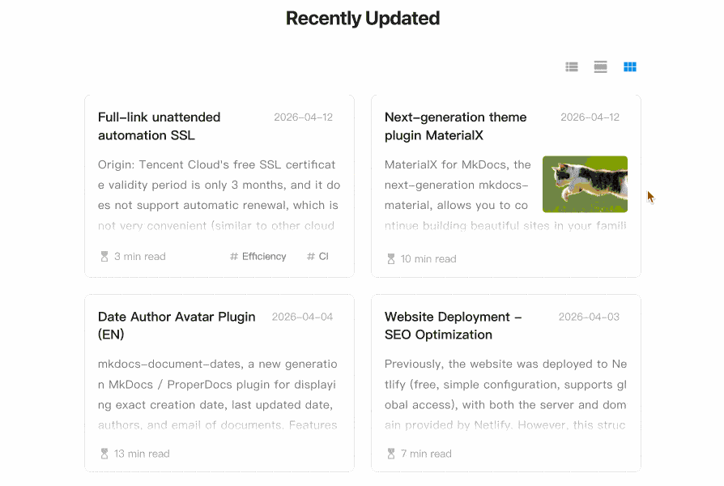

# Add Recent Updates Module

!!! desc "Add Recent Updates Module"
    The recent updates module displays site documentation information in a structured way, which is ideal for sites with **a large number of documents or frequent updates**, allowing readers to **quickly see what's new**.
    


## Features

!!! deep-dive "Features"

    - Display recently updated documents in descending order by update time, list items are dynamically updated
    - Support multiple view modes including list, detail and grid
    - Support automatic extraction of article summaries
    - Support for customizing article cover in Front Matter
    - Support automatic readtime estimation, compatible with all mainstream languages and mixed-language content
    - Support custom display quantity
    - Support exclude specified files or folders
    
## Installation

!!! recommendation "Installation"
    This feature is provided by the built-in plugin [document-dates] and requires no separate installation.
    
    [document-dates]: MkDocs-Material/date-author.md
    
## Configuration

!!! recommendation "Configuration"

    Configure the switch `recently-updated` in `document-dates`:

    ```yaml title="mkdocs.yml"
    - document-dates:
        ...
        recently-updated:
          limit: 10         # Limit the number of docs displayed
          exclude:          # Exclude documents you don't want to show
            - index.md          # Example: exclude the specified file
            - '*/index.md'      # Example: exclude all index.md files in any subfolders
            - blog/*            # Example: exclude all files in blog folder, including subfolders
    ```

## Add to Sidebar Navigation

!!! desc "Add to Sidebar Navigation"

    Download the sample template [nav.html](https://github.com), and override this path `docs/overrides/partials/nav.html`

## Add Anywhere in Document

!!! desc "Add Anywhere in Document"

    Insert this line anywhere in your document:

    ```yaml
    <!-- RECENTLY_UPDATED_DOCS -->
    ```

## Configure Article Cover

!!! desc "Configure Article Cover"

    Use the field `cover` in Front Matter to specify the article cover (supports URL paths and local file paths):

    ```yaml
    ---
    cover: assets/cat.jpg
    ---
    ```

## Summary Line Configuration

!!! desc "Summary Line Configuration"

    The plugin intelligently parses article content and simply refine the summary without manual configuration. The number of summary lines can be configured separately for **grid** and **detail** views:

    ```yaml hl_lines="9-11"
    plugins:

      - document-dates:
          type: timeago
          exclude: ['index.md', '*/index.md', 'blog/*']
          recently-updated:
            limit: 10
            exclude: ['index.md', 'tags.md', '*/index.md', 'blog/*']
            summary_lines:
              grid: 4
              detail: 6
    ```

    For a more complete and systematic introduction, please refer to [Built-in Date Plugin][document-dates].
