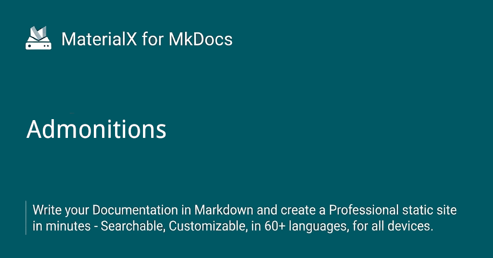

<div style="display: none;"><h1>Header</h1></div>

{: style="display: block; margin: 0 auto"}
<H1 style="text-align: center;"><ins>Admonitions</ins></H1>

!!! pied-piper "Important"
     
    Admonitions, also known as _call-outs_, are an excellent choice for including side content without significantly interrupting the document flow. Material for MkDocs provides several different types of admonitions and allows for the inclusion and nesting of arbitrary content.
    
### Configuration

!!! desc "Configuration"

    This configuration enables admonitions, allows to make them collapsible and to nest arbitrary content inside admonitions. Add the following lines to mkdocs.yml:
    
    ``` yaml
    markdown_extensions:
      - admonition
      - pymdownx.details
      - pymdownx.superfences
    ```
    
    ---
    
    See additional configuration options:
    
    <kbd> <br> [Python-Markdown-Extensions](http://127.0.0.1:8000/MkDocs-Material/python-markdown-extensions/) ↗️ <br> </kbd>
    
    - [Admonition]
    - [Details]
    - [SuperFences]
    
### Admonition Icons

??? warning "This configuration method is deprecated"

    <div style="opacity: 0.5" markdown>
    
    <!-- md:version 8.3.0 -->
    
    ~~Each of the supported admonition types has a distinct icon, which can be changed to any icon bundled with the theme, or even a [custom icon]. Add the following lines to `mkdocs.yml`:~~
    
    ``` yaml
    theme:
       icon:
         admonition:
              <type>: <icon>
    ```
    </div>
    
  [Admonition]: MkDocs-Material/python-markdown.md#admonition
  [Details]: ./MkDocs-Material/python-markdown-extensions.md#details
  [SuperFences]: ./MkDocs-Material/python-markdown-extensions.md#superfences

Please refer to the new, more powerful and flexible configuration: [Custom icons and colors](https://github.com/jaywhj/mkdocs-materialx/blob/main/docs/reference/admonitions.md#custom-icons-and-colors).

Icons can be any icon (search → (1)) bundled with the theme, or [custom icon]{target="_blank"}.
{ .annotate }

1.  Enter a few keywords to find the perfect icon using our [icon search] and click on the shortcode to copy it to your clipboard:

    <div class="mdx-iconsearch" data-mdx-component="iconsearch" style="margin-top: 5px !important; margin-bottom: 0px !important; padding-bottom: 0px !important;">
      <!-- Interactive Navigation Search Row Bar -->
      <div class="mdx-iconsearch__bar">
        <input
          class="md-input md-input--stretch mdx-iconsearch__input"
          placeholder="Search Icons Emojis"
          data-mdx-component="iconsearch-query"
        />
        <div class="mdx-iconsearch-result__meta" data-mdx-component="iconsearch-meta"></div>
        <select
          class="mdx-iconsearch-result__select"
          data-mdx-component="iconsearch-select"
        >
          <option value="all" selected>All</option>
          <option value="icons">Icons</option>
          <option value="emojis">Emojis</option>
        </select>
      </div>
      <!-- Required results container for injecting matching icons -->
      <div class="mdx-iconsearch-result" data-mdx-component="iconsearch-result" style="margin-bottom: 0px !important; padding-bottom: 0px !important;">
        <ol class="mdx-iconsearch-result__list" style="margin-bottom: 0px !important; padding-bottom: 0px !important;"></ol>
      </div>
    </div>

        
??? example "Expand to show alternate icon sets"

    === ":octicons-mark-github-16: Octicons"

        ``` yaml
        theme:
          icon:
            admonition:
              note: octicons/tag-16
              abstract: octicons/checklist-16
              info: octicons/info-16
              tip: octicons/squirrel-16
              success: octicons/check-16
              question: octicons/question-16
              warning: octicons/alert-16
              failure: octicons/x-circle-16
              danger: octicons/zap-16
              bug: octicons/bug-16
              example: octicons/beaker-16
              quote: octicons/quote-16
        ```


    === ":fontawesome-brands-font-awesome: FontAwesome"

        ``` yaml
        theme:
          icon:
            admonition:
              note: fontawesome/solid/note-sticky
              abstract: fontawesome/solid/book
              info: fontawesome/solid/circle-info
              tip: fontawesome/solid/bullhorn
              success: fontawesome/solid/check
              question: fontawesome/solid/circle-question
              warning: fontawesome/solid/triangle-exclamation
              failure: fontawesome/solid/bomb
              danger: fontawesome/solid/skull
              bug: fontawesome/solid/robot
              example: fontawesome/solid/flask
              quote: fontawesome/solid/quote-left
        ```

  [custom icon]: MkDocs-Material/changing-the-logo-and-icons.md
  [supported types]: #supported-types
  [icon search]: MkDocs-Material/icons-emojis.md#search

### Classic admonitions

In previous versions, admonitions had a slightly different appearance.

#### Prior to version 8.5.6

!!! classic "Note"

    Note: This is a classic note element. It is normally used for general information that you want to stand out to the reader.
    
!!! desc "Restoring Classic Appearance"

    If you want to restore this appearance, add the following CSS to an [additional style sheet]:
    
    <style>
      .md-typeset .admonition.classic {
        --md-admonition-title-bg-color: color-mix(in srgb, var(--md-admonition-color), transparent 90%);
        --md-admonition-border-color: var(--md-admonition-color);
        border-width: 0;
        border-left-width: 4px;
      }
    </style>

    === ":octicons-file-code-16: `docs/stylesheets/extra.css`"

        ``` css
        .md-typeset .admonition,
        .md-typeset details {
          --md-admonition-title-bg-color: color-mix(in srgb, var(--md-admonition-color), transparent 90%);
          --md-admonition-border-color: var(--md-admonition-color);
          border-width: 0;
          border-left-width: 4px;
        }
        ```

    === ":octicons-file-code-16: `mkdocs.yml`"

        ``` yaml
        extra_css:
          - stylesheets/extra.css
        ```

#### Prior to version 10.0.6

!!! classic2 "Note"

    Use a tip or note to provide optional information or helpful advice, like an alternative way of doing something.

!!! desc "Classic2"

    If you want to restore this appearance, add the following CSS to an [additional style sheet]:

    <style>
      .md-typeset .admonition.classic2 {
        --md-admonition-title-bg-color: color-mix(in srgb, var(--md-admonition-color), transparent 90%);
        --md-admonition-border-color: var(--md-admonition-color);
        border-width: 1.5px;
      }
    </style>

    === ":octicons-file-code-16: `docs/stylesheets/extra.css`"

        ``` css
        .md-typeset .admonition,
        .md-typeset details {
          --md-admonition-title-bg-color: color-mix(in srgb, var(--md-admonition-color), transparent 90%);
          --md-admonition-border-color: var(--md-admonition-color);
          border-width: 1.5px;
        }
        ```

    === ":octicons-file-code-16: `mkdocs.yml`"

        ``` yaml
        extra_css:
          - stylesheets/extra.css
        ```

## Usage

Admonitions follow a simple syntax: a block starts with `!!!`, followed by a single keyword used as a [type qualifier]. The content of the block follows on the next line, indented by four spaces:

``` markdown title="Admonition"
!!! note

    Lorem ipsum dolor sit amet, consectetur adipiscing elit. Nulla et euismod nulla. Curabitur feugiat, tortor non consequat finibus, justo purus auctor massa, nec semper lorem quam in massa.
```

<div class="result" markdown>

!!! note

    Lorem ipsum dolor sit amet, consectetur adipiscing elit. Nulla et euismod nulla. Curabitur feugiat, tortor non consequat finibus, justo purus auctor massa, nec semper lorem quam in massa.

</div>

  [type qualifier]: #supported-types

### Changing the Title

By default, the title will equal the type qualifier in titlecase. However, it can be changed by adding a quoted string containing valid Markdown (including links, formatting, ...) after the type qualifier:

``` markdown title="Admonition with custom title"
!!! note "Phasellus posuere in sem ut cursus"

    Lorem ipsum dolor sit amet, consectetur adipiscing elit. Nulla et euismod nulla. Curabitur feugiat, tortor non consequat finibus, justo purus auctor massa, nec semper lorem quam in massa.
```

<div class="result" markdown>

!!! note "Phasellus posuere in sem ut cursus"

    Lorem ipsum dolor sit amet, consectetur adipiscing elit. Nulla et euismod nulla. Curabitur feugiat, tortor non consequat finibus, justo purus auctor massa, nec semper lorem quam in massa.

</div>

### Nested Admonitions

You can also include nested admonitions in your documentation. To do this, you
can use your existing admonitions and indent the desired ones:

``` markdown title="Nested Admonition"
!!! note "Outer Note"

    Lorem ipsum dolor sit amet, consectetur adipiscing elit. Nulla et euismod
    nulla. Curabitur feugiat, tortor non consequat finibus, justo purus auctor
    massa, nec semper lorem quam in massa.
    
    !!! note "Inner Note"

        Lorem ipsum dolor sit amet, consectetur adipiscing elit. Nulla et euismod
        nulla. Curabitur feugiat, tortor non consequat finibus, justo purus auctor
        massa, nec semper lorem quam in massa.
```

<div class="result" markdown>

!!! note "Outer Note"

    Lorem ipsum dolor sit amet, consectetur adipiscing elit. Nulla et euismod nulla. Curabitur feugiat, tortor non consequat finibus, justo purus auctor massa, nec semper lorem quam in massa.
    
    !!! note "Inner Note"

        Lorem ipsum dolor sit amet, consectetur adipiscing elit. Nulla et euismod nulla. Curabitur feugiat, tortor non consequat finibus, justo purus auctor massa, nec semper lorem quam in massa.
</div>

### Removing the Title

Similar to [changing the title], the icon and title can be omitted entirely by adding an empty string directly after the type qualifier. Note that this will not work for [collapsible blocks]:

``` markdown title="Admonition without title"
!!! note ""

    Lorem ipsum dolor sit amet, consectetur adipiscing elit. Nulla et euismod
    nulla. Curabitur feugiat, tortor non consequat finibus, justo purus auctor
    massa, nec semper lorem quam in massa.
```

<div class="result" markdown>

!!! note ""

    Lorem ipsum dolor sit amet, consectetur adipiscing elit. Nulla et euismod nulla. Curabitur feugiat, tortor non consequat finibus, justo purus auctor massa, nec semper lorem quam in massa.

</div>

  [changing the title]: #changing-the-title
  [collapsible blocks]: #collapsible-blocks

### Collapsible Blocks

When [Details] is enabled and an admonition block is started with `???` instead
of `!!!`, the admonition is rendered as an expandable block with a small toggle
on the right side:

``` markdown title="Admonition, collapsible"
??? note

    Lorem ipsum dolor sit amet, consectetur adipiscing elit. Nulla et euismod
    nulla. Curabitur feugiat, tortor non consequat finibus, justo purus auctor
    massa, nec semper lorem quam in massa.
```

<div class="result" markdown>

??? note

    Lorem ipsum dolor sit amet, consectetur adipiscing elit. Nulla et euismod nulla. Curabitur feugiat, tortor non consequat finibus, justo purus auctor massa, nec semper lorem quam in massa.

</div>

Adding a `+` after the `???` token renders the block expanded:

``` markdown title="Admonition, collapsible and initially expanded"
???+ note

    Lorem ipsum dolor sit amet, consectetur adipiscing elit. Nulla et euismod
    nulla. Curabitur feugiat, tortor non consequat finibus, justo purus auctor
    massa, nec semper lorem quam in massa.
```

<div class="result" markdown>

???+ note

    Lorem ipsum dolor sit amet, consectetur adipiscing elit. Nulla et euismod nulla. Curabitur feugiat, tortor non consequat finibus, justo purus auctor massa, nec semper lorem quam in massa.

</div>

### Inline Blocks

Admonitions can also be rendered as inline blocks (e.g., for sidebars), placing them to the right using the `inline` + `end` modifiers, or to the left using only the `inline` modifier:

=== ":octicons-arrow-right-16: inline end"

    !!! info inline end "Lorem ipsum"

        Lorem ipsum dolor sit amet, consectetur adipiscing elit. Nulla et euismod nulla. Curabitur feugiat, tortor non consequat finibus, justo purus auctor massa, nec semper lorem quam in massa.

    ``` markdown
    !!! info inline end "Lorem ipsum"

        Lorem ipsum dolor sit amet, consectetur adipiscing elit. Nulla et euismod nulla. Curabitur feugiat, tortor non consequat finibus, justo purus auctor massa, nec semper lorem quam in massa.
    ```

    Use `inline end` to align to the right (left for rtl languages).

=== ":octicons-arrow-left-16: inline"

    !!! info inline "Lorem ipsum"

        Lorem ipsum dolor sit amet, consectetur adipiscing elit. Nulla et euismod nulla. Curabitur feugiat, tortor non consequat finibus, justo purus auctor massa, nec semper lorem quam in massa.

    ``` markdown
    !!! info inline "Lorem ipsum"

        Lorem ipsum dolor sit amet, consectetur adipiscing elit. Nulla et euismod nulla. Curabitur feugiat, tortor non consequat finibus, justo purus auctor massa, nec semper lorem quam in massa.
    ```

    Use `inline` to align to the left (right for rtl languages).

__Important__: admonitions that use the `inline` modifiers _must_ be declared prior to the content block you want to place them beside. If there's insufficient space to render the admonition next to the block, the admonition will stretch to the full width of the viewport, e.g., on mobile viewports.

### Supported Types

Following is a list of type qualifiers provided by Material for MkDocs, whereas the default type, and thus fallback for unknown type qualifiers, is `note`[^1]:

  [^1]:
    Previously, some of the supported types defined more than one qualifier. For example, authors could use `summary` or `tldr` as alternative qualifiers to render an [`abstract`](https://squidfunk.github.io/mkdocs-material/reference/admonitions/?h=supported+types#+type:abstract) admonition. As this increased the size of the CSS that is shipped with Material for MkDocs, the additional type qualifiers are now all deprecated and will be removed in the next major version. This will also be mentioned in the upgrade guide.
    
<!-- md:option type:note -->

!!! note "Note"

    Lorem ipsum dolor sit amet, consectetur adipiscing elit. Nulla et euismod nulla. Curabitur feugiat, tortor non consequat finibus, justo purus auctor massa, nec semper lorem quam in massa.

<!-- md:option type:abstract -->

!!! abstract "Abstract"

    Lorem ipsum dolor sit amet, consectetur adipiscing elit. Nulla et euismod nulla. Curabitur feugiat, tortor non consequat finibus, justo purus auctor massa, nec semper lorem quam in massa.

<!-- md:option type:info -->

!!! info "Info"

    Lorem ipsum dolor sit amet, consectetur adipiscing elit. Nulla et euismod nulla. Curabitur feugiat, tortor non consequat finibus, justo purus auctor massa, nec semper lorem quam in massa.

<!-- md:option type:tip -->

!!! tip "Tip"

    Lorem ipsum dolor sit amet, consectetur adipiscing elit. Nulla et euismod nulla. Curabitur feugiat, tortor non consequat finibus, justo purus auctor massa, nec semper lorem quam in massa.

<!-- md:option type:success -->

!!! success "Success"

    Lorem ipsum dolor sit amet, consectetur adipiscing elit. Nulla et euismod nulla. Curabitur feugiat, tortor non consequat finibus, justo purus auctor massa, nec semper lorem quam in massa.

<!-- md:option type:question -->

!!! question "Question"

    Lorem ipsum dolor sit amet, consectetur adipiscing elit. Nulla et euismod nulla. Curabitur feugiat, tortor non consequat finibus, justo purus auctor massa, nec semper lorem quam in massa.

<!-- md:option type:warning -->

!!! warning "Warning"

    Lorem ipsum dolor sit amet, consectetur adipiscing elit. Nulla et euismod nulla. Curabitur feugiat, tortor non consequat finibus, justo purus auctor massa, nec semper lorem quam in massa.


!!! failure "Failure"

    Lorem ipsum dolor sit amet, consectetur adipiscing elit. Nulla et euismod nulla. Curabitur feugiat, tortor non consequat finibus, justo purus auctor massa, nec semper lorem quam in massa.

<!-- md:option type:danger -->

!!! danger "Danger"

    Lorem ipsum dolor sit amet, consectetur adipiscing elit. Nulla et euismod nulla. Curabitur feugiat, tortor non consequat finibus, justo purus auctor massa, nec semper lorem quam in massa.

<!-- md:option type:bug -->

!!! bug "Bug"

    Lorem ipsum dolor sit amet, consectetur adipiscing elit. Nulla et euismod nulla. Curabitur feugiat, tortor non consequat finibus, justo purus auctor massa, nec semper lorem quam in massa.

<!-- md:option type:example -->

!!! example "Example"

    Lorem ipsum dolor sit amet, consectetur adipiscing elit. Nulla et euismod nulla. Curabitur feugiat, tortor non consequat finibus, justo purus auctor massa, nec semper lorem quam in massa.

<!-- md:option type:quote -->

!!! quote "Quote"

    Lorem ipsum dolor sit amet, consectetur adipiscing elit. Nulla et euismod nulla. Curabitur feugiat, tortor non consequat finibus, justo purus auctor massa, nec semper lorem quam in massa.

## Customization

### Custom icons and colors

You can configure the icon and color for each built-in admonition type, and also set up entirely new admonition types, simply add the following lines to `mkdocs.yml`: 

=== "Structure"

    ``` yaml
    theme:
      admonition:
        <type>:
          icon: <icon>
          color: <color>
    ```

=== "Example 1: Override built-in admonitions"

    ``` yaml
    theme:
      admonition:
        example:
          icon: material/format-list-group
    ```

    <div class="result" markdown>

    !!! example "← Reset icon for type `example`"

    </div>

=== "Example 2: Create new admonitions"

    ``` yaml
    theme:
      admonition:
        git:
          icon: simple/git
          color: '#f34f29'
        copyright:
          icon: material/copyright
          color: '#2b9b9b'
        heart:
          icon: octicons/heart-24
          color: '#9b2b9b'
        lyrics:
          icon: material/microphone
          color: '#2b2b9b'
        soundcloud:
          icon: simple/soundcloud
          color: '#ff7700'
    ```

    <div class="result" markdown>

    !!! git "git"
    !!! copyright "copyright"
    !!! heart "heart"
    !!! lyrics "lyrics"
    !!! soundcloud "soundcloud"

    </div>

Icons can be any icon (search → (1)) bundled with the theme, or [custom icon]{target="_blank"}.
{ .annotate }

1.  Enter a few keywords to find the perfect icon using our [icon search] and click on the shortcode to copy it to your clipboard:

    <div class="mdx-iconsearch" data-mdx-component="iconsearch" style="margin-top: 5px !important; margin-bottom: 0px !important; padding-bottom: 0px !important;">
      <!-- Interactive Navigation Search Row Bar -->
      <div class="mdx-iconsearch__bar">
        <input
          class="md-input md-input--stretch mdx-iconsearch__input"
          placeholder="Search Icons Emojis"
          data-mdx-component="iconsearch-query"
        />
        <div class="mdx-iconsearch-result__meta" data-mdx-component="iconsearch-meta"></div>
        <select
          class="mdx-iconsearch-result__select"
          data-mdx-component="iconsearch-select"
        >
          <option value="all" selected>All</option>
          <option value="icons">Icons</option>
          <option value="emojis">Emojis</option>
        </select>
      </div>
      <!-- Required results container for injecting matching icons -->
      <div class="mdx-iconsearch-result" data-mdx-component="iconsearch-result" style="margin-bottom: 0px !important; padding-bottom: 0px !important;">
        <ol class="mdx-iconsearch-result__list" style="margin-bottom: 0px !important; padding-bottom: 0px !important;"></ol>
      </div>
    </div>


??? quote "Expand to show alternate icon sets"

    === ":octicons-mark-github-16: Octicons"

        ``` yaml
        theme:
          icon:
            admonition:
              note: octicons/tag-16
              abstract: octicons/checklist-16
              info: octicons/info-16
              tip: octicons/squirrel-16
              success: octicons/check-16
              question: octicons/question-16
              warning: octicons/alert-16
              failure: octicons/x-circle-16
              danger: octicons/zap-16
              bug: octicons/bug-16
              example: octicons/beaker-16
              quote: octicons/quote-16
        ```

    === ":fontawesome-brands-font-awesome: FontAwesome"

        ``` yaml
        theme:
          icon:
            admonition:
              note: fontawesome/solid/note-sticky
              abstract: fontawesome/solid/book
              info: fontawesome/solid/circle-info
              tip: fontawesome/solid/bullhorn
              success: fontawesome/solid/check
              question: fontawesome/solid/circle-question
              warning: fontawesome/solid/triangle-exclamation
              failure: fontawesome/solid/bomb
              danger: fontawesome/solid/skull
              bug: fontawesome/solid/robot
              example: fontawesome/solid/flask
              quote: fontawesome/solid/quote-left
        ```

  [custom icon]: MkDocs-Material/changing-the-logo-and-icons.md#additional-icons
  [icon search]: MkDocs-Material/icons-emojis.md#search
  
### Custom Admonitions

If you want to add a custom admonition type, all you need is a color and an `*.svg` icon. Copy the icon's code from the [`.icons`][custom icons] folder and add the following CSS to an [additional style sheet]:

<style>
  :root {
    --md-admonition-icon--pied-piper: url('data:image/svg+xml;charset=utf-8,<svg xmlns="http://www.w3.org/2000/svg" viewBox="0 0 576 512"><path d="M244 246c-3.2-2-6.3-2.9-10.1-2.9-6.6 0-12.6 3.2-19.3 3.7l1.7 4.9zm135.9 197.9c-19 0-64.1 9.5-79.9 19.8l6.9 45.1c35.7 6.1 70.1 3.6 106-9.8-4.8-10-23.5-55.1-33-55.1zM340.8 177c6.6 2.8 11.5 9.2 22.7 22.1 2-1.4 7.5-5.2 7.5-8.6 0-4.9-11.8-13.2-13.2-23 11.2-5.7 25.2-6 37.6-8.9 68.1-16.4 116.3-52.9 146.8-116.7C548.3 29.3 554 16.1 554.6 2l-2 2.6c-28.4 50-33 63.2-81.3 100-31.9 24.4-69.2 40.2-106.6 54.6l-6.3-.3v-21.8c-19.6 1.6-19.7-14.6-31.6-23-18.7 20.6-31.6 40.8-58.9 51.1-12.7 4.8-19.6 10-25.9 21.8 34.9-16.4 91.2-13.5 98.8-10zM555.5 0l-.6 1.1-.3.9.6-.6zm-59.2 382.1c-33.9-56.9-75.3-118.4-150-115.5l-.3-6c-1.1-13.5 32.8 3.2 35.1-31l-14.4 7.2c-19.8-45.7-8.6-54.3-65.5-54.3-14.7 0-26.7 1.7-41.4 4.6 2.9 18.6 2.2 36.7-10.9 50.3l19.5 5.5c-1.7 3.2-2.9 6.3-2.9 9.8 0 21 42.8 2.9 42.8 33.6 0 18.4-36.8 60.1-54.9 60.1-8 0-53.7-50-53.4-60.1l.3-4.6 52.3-11.5c13-2.6 12.3-22.7-2.9-22.7-3.7 0-43.1 9.2-49.4 10.6-2-5.2-7.5-14.1-13.8-14.1-3.2 0-6.3 3.2-9.5 4-9.2 2.6-31 2.9-21.5 20.1L15.9 298.5c-5.5 1.1-8.9 6.3-8.9 11.8 0 6 5.5 10.9 11.5 10.9 8 0 131.3-28.4 147.4-32.2 2.6 3.2 4.6 6.3 7.8 8.6 20.1 14.4 59.8 85.9 76.4 85.9 24.1 0 58-22.4 71.3-41.9 3.2-4.3 6.9-7.5 12.4-6.9.6 13.8-31.6 34.2-33 43.7-1.4 10.2-1 35.2-.3 41.1 26.7 8.1 52-3.6 77.9-2.9 4.3-21 10.6-41.9 9.8-63.5l-.3-9.5c-1.4-34.2-10.9-38.5-34.8-58.6-1.1-1.1-2.6-2.6-3.7-4 2.2-1.4 1.1-1 4.6-1.7 88.5 0 56.3 183.6 111.5 229.9 33.1-15 72.5-27.9 103.5-47.2-29-25.6-52.6-45.7-72.7-79.9zm-196.2 46.1v27.2l11.8-3.4-2.9-23.8zm-68.7-150.4l24.1 61.2 21-13.8-31.3-50.9zm84.4 154.9l2 12.4c9-1.5 58.4-6.6 58.4-14.1 0-1.4-.6-3.2-.9-4.6-26.8 0-36.9 3.8-59.5 6.3z"/></svg>')
  }
  .md-typeset .admonition.pied-piper,
  .md-typeset details.pied-piper {
    border-color: rgb(43, 155, 70);
  }
  .md-typeset .pied-piper > .admonition-title,
  .md-typeset .pied-piper > summary {
    background-color: rgba(43, 155, 70, 0.1);
  }
  .md-typeset .pied-piper > .admonition-title::before,
  .md-typeset .pied-piper > summary::before {
    background-color: rgb(43, 155, 70);
    -webkit-mask-image: var(--md-admonition-icon--pied-piper);
            mask-image: var(--md-admonition-icon--pied-piper);
  }
</style>

??? Deep-dive "Click to see Code for pied-piper"

    === ":octicons-file-code-16: `docs/stylesheets/extra.css`"

        ```css
        :root {
          --md-admonition-icon--pied-piper: url('data:image/svg+xml;charset=utf-8,<svg xmlns="http://www.w3.org/2000/svg" viewBox="0 0 576 512"><path d="M244 246c-3.2-2-6.3-2.9-10.1-2.9-6.6 0-12.6 3.2-19.3 3.7l1.7 4.9zm135.9 197.9c-19 0-64.1 9.5-79.9 19.8l6.9 45.1c35.7 6.1 70.1 3.6 106-9.8-4.8-10-23.5-55.1-33-55.1zM340.8 177c6.6 2.8 11.5 9.2 22.7 22.1 2-1.4 7.5-5.2 7.5-8.6 0-4.9-11.8-13.2-13.2-23 11.2-5.7 25.2-6 37.6-8.9 68.1-16.4 116.3-52.9 146.8-116.7C548.3 29.3 554 16.1 554.6 2l-2 2.6c-28.4 50-33 63.2-81.3 100-31.9 24.4-69.2 40.2-106.6 54.6l-6.3-.3v-21.8c-19.6 1.6-19.7-14.6-31.6-23-18.7 20.6-31.6 40.8-58.9 51.1-12.7 4.8-19.6 10-25.9 21.8 34.9-16.4 91.2-13.5 98.8-10zM555.5 0l-.6 1.1-.3.9.6-.6zm-59.2 382.1c-33.9-56.9-75.3-118.4-150-115.5l-.3-6c-1.1-13.5 32.8 3.2 35.1-31l-14.4 7.2c-19.8-45.7-8.6-54.3-65.5-54.3-14.7 0-26.7 1.7-41.4 4.6 2.9 18.6 2.2 36.7-10.9 50.3l19.5 5.5c-1.7 3.2-2.9 6.3-2.9 9.8 0 21 42.8 2.9 42.8 33.6 0 18.4-36.8 60.1-54.9 60.1-8 0-53.7-50-53.4-60.1l.3-4.6 52.3-11.5c13-2.6 12.3-22.7-2.9-22.7-3.7 0-43.1 9.2-49.4 10.6-2-5.2-7.5-14.1-13.8-14.1-3.2 0-6.3 3.2-9.5 4-9.2 2.6-31 2.9-21.5 20.1L15.9 298.5c-5.5 1.1-8.9 6.3-8.9 11.8 0 6 5.5 10.9 11.5 10.9 8 0 131.3-28.4 147.4-32.2 2.6 3.2 4.6 6.3 7.8 8.6 20.1 14.4 59.8 85.9 76.4 85.9 24.1 0 58-22.4 71.3-41.9 3.2-4.3 6.9-7.5 12.4-6.9.6 13.8-31.6 34.2-33 43.7-1.4 10.2-1 35.2-.3 41.1 26.7 8.1 52-3.6 77.9-2.9 4.3-21 10.6-41.9 9.8-63.5l-.3-9.5c-1.4-34.2-10.9-38.5-34.8-58.6-1.1-1.1-2.6-2.6-3.7-4 2.2-1.4 1.1-1 4.6-1.7 88.5 0 56.3 183.6 111.5 229.9 33.1-15 72.5-27.9 103.5-47.2-29-25.6-52.6-45.7-72.7-79.9zm-196.2 46.1v27.2l11.8-3.4-2.9-23.8zm-68.7-150.4l24.1 61.2 21-13.8-31.3-50.9zm84.4 154.9l2 12.4c9-1.5 58.4-6.6 58.4-14.1 0-1.4-.6-3.2-.9-4.6-26.8 0-36.9 3.8-59.5 6.3z"/></svg>')
        }
        .md-typeset .admonition.pied-piper,
        .md-typeset details.pied-piper {
          border-color: rgb(43, 155, 70);
        }
        .md-typeset .pied-piper > .admonition-title,
        .md-typeset .pied-piper > summary {
          background-color: rgba(43, 155, 70, 0.1);
        }
        .md-typeset .pied-piper > .admonition-title::before,
        .md-typeset .pied-piper > summary::before {
          background-color: rgb(43, 155, 70);
          -webkit-mask-image: var(--md-admonition-icon--pied-piper);
                  mask-image: var(--md-admonition-icon--pied-piper);
        }
        ```

    === ":octicons-file-code-16: `mkdocs.yml`"

        ```yaml
        extra_css:
          - stylesheets/extra.css
        ```


After applying the customization, you can use the custom admonition type:

!!! pied-piper "Pied Piper"

    ``` markdown title="Admonition with custom type"


    Lorem ipsum dolor sit amet, consectetur adipiscing elit. Nulla et euismod nulla. Curabitur
    feugiat, tortor non consequat finibus, justo purus auctor massa, nec semper lorem quam in massa.
    ```


!!! pied-piper "Pied Piper"

    Lorem ipsum dolor sit amet, consectetur adipiscing elit. Nulla et euismod nulla. Curabitur feugiat, tortor non consequat finibus, justo purus auctor massa, nec semper lorem quam in massa.


  [custom icons]: https://github.com/squidfunk/mkdocs-material/tree/master/material/templates/.icons
  [additional style sheet]: MkDocs-Material/customization.md#additional-css


!!! ex "Structure Example"
    This uses your new custom purple list admonition!


!!! git "Git"

    Test Change
    
!!! desc  "Code Coverage Reports"

    Code coverage for unit tests, doc tests and integration tests is calculated using [`cargo-llvm-cov`].
    
!!! tldr "The Quick Version"
    This article explores how custom CSS can transform boring documentation into a high-end user interface.
    
    * Save 50% more time
    * Higher reader retention
    * Looks significantly cooler


!!! deep-dive "Under the Hood: Technical Details"

    This text will use a monospace-style header to signal it's for the "techies" and will have a nice dark grey beaker icon.
    
    
!!! important "Important"

    Seeing what this does!
    
!!! recommendation "Recommendation"

    Seeing what this does!
    

!!! instruction "Instruction"

    Seeing what this does!
    

!!! decision "Decision"

    Seeing what this does!
    
!!! assumption "Assumption"

    Seeing what this does!
   
!!! dollar "Dollar"

    Seeing What This Does!
    

!!! grey "Grey"

    Seeing What This Does!
    
!!! education "Education"

    Seeing What This Does!
    
!!! version-added "version-added"

    Seeing What This Does!
    
!!! version-changed "version-changed"

    Seeing What This Does!
    
!!! version-removed "version-removed"

    Seeing What This Does!
    
!!! git "Git"

    New Git Change
    
!!! copyright "copyright"

    New copyright Change
    
!!! soundcloud "soundcloud"

    New soundcloud
    
!!! lyrics "lyrics"

    New lyrics
    
!!! heart "heart"

    New heart
    

!!! note "Note"

    Lorem ipsum dolor sit amet, consectetur adipiscing elit. Nulla et euismod nulla. Curabitur feugiat, tortor non consequat finibus, justo purus auctor massa, nec semper lorem quam in massa.
        

!!! abstract "Abstract"

    Lorem ipsum dolor sit amet, consectetur adipiscing elit. Nulla et euismod nulla. Curabitur feugiat, tortor non consequat finibus, justo purus auctor massa, nec semper lorem quam in massa.
         

!!! note "Note"

    Lorem ipsum dolor sit amet, consectetur adipiscing elit. Nulla et euismod nulla. Curabitur feugiat, tortor non consequat finibus, justo purus auctor massa, nec semper lorem quam in massa.
    
[Back to: #Advanced-Configuration  :fontawesome-solid-paper-plane:](MkDocs-Material-Start.md/#advanced-configuration){ .md-button .md-button--custom }

### Style Overrides

Additionally, you can customize the icons and colors of admonitions using Additional CSS.

If you only need to customize icons and colors, I recommend using the **simpler method** described earlier [Custom icons and colors](#custom-icons-and-colors).

If you require full custom styling for admonitions, the Additional CSS approach is more appropriate. The following example will override the style for `pied-piper`:


??? Deep-dive "Click to see Code for pied-piper"


    === ":octicons-file-code-16: `docs/stylesheets/extra.css`"

        ``` css
        .md-typeset .admonition.pied-piper,
        .md-typeset details.pied-piper {
          --md-admonition-icon: url('data:image/svg+xml;charset=utf-8,<svg xmlns="http://www.w3.org/2000/svg" viewBox="0 0 576 512"><path d="M244 246c-3.2-2-6.3-2.9-10.1-2.9-6.6 0-12.6 3.2-19.3 3.7l1.7 4.9zm135.9 197.9c-19 0-64.1 9.5-79.9 19.8l6.9 45.1c35.7 6.1 70.1 3.6 106-9.8-4.8-10-23.5-55.1-33-55.1zM340.8 177c6.6 2.8 11.5 9.2 22.7 22.1 2-1.4 7.5-5.2 7.5-8.6 0-4.9-11.8-13.2-13.2-23 11.2-5.7 25.2-6 37.6-8.9 68.1-16.4 116.3-52.9 146.8-116.7C548.3 29.3 554 16.1 554.6 2l-2 2.6c-28.4 50-33 63.2-81.3 100-31.9 24.4-69.2 40.2-106.6 54.6l-6.3-.3v-21.8c-19.6 1.6-19.7-14.6-31.6-23-18.7 20.6-31.6 40.8-58.9 51.1-12.7 4.8-19.6 10-25.9 21.8 34.9-16.4 91.2-13.5 98.8-10zM555.5 0l-.6 1.1-.3.9.6-.6zm-59.2 382.1c-33.9-56.9-75.3-118.4-150-115.5l-.3-6c-1.1-13.5 32.8 3.2 35.1-31l-14.4 7.2c-19.8-45.7-8.6-54.3-65.5-54.3-14.7 0-26.7 1.7-41.4 4.6 2.9 18.6 2.2 36.7-10.9 50.3l19.5 5.5c-1.7 3.2-2.9 6.3-2.9 9.8 0 21 42.8 2.9 42.8 33.6 0 18.4-36.8 60.1-54.9 60.1-8 0-53.7-50-53.4-60.1l.3-4.6 52.3-11.5c13-2.6 12.3-22.7-2.9-22.7-3.7 0-43.1 9.2-49.4 10.6-2-5.2-7.5-14.1-13.8-14.1-3.2 0-6.3 3.2-9.5 4-9.2 2.6-31 2.9-21.5 20.1L15.9 298.5c-5.5 1.1-8.9 6.3-8.9 11.8 0 6 5.5 10.9 11.5 10.9 8 0 131.3-28.4 147.4-32.2 2.6 3.2 4.6 6.3 7.8 8.6 20.1 14.4 59.8 85.9 76.4 85.9 24.1 0 58-22.4 71.3-41.9 3.2-4.3 6.9-7.5 12.4-6.9.6 13.8-31.6 34.2-33 43.7-1.4 10.2-1 35.2-.3 41.1 26.7 8.1 52-3.6 77.9-2.9 4.3-21 10.6-41.9 9.8-63.5l-.3-9.5c-1.4-34.2-10.9-38.5-34.8-58.6-1.1-1.1-2.6-2.6-3.7-4 2.2-1.4 1.1-1 4.6-1.7 88.5 0 56.3 183.6 111.5 229.9 33.1-15 72.5-27.9 103.5-47.2-29-25.6-52.6-45.7-72.7-79.9zm-196.2 46.1v27.2l11.8-3.4-2.9-23.8zm-68.7-150.4l24.1 61.2 21-13.8-31.3-50.9zm84.4 154.9l2 12.4c9-1.5 58.4-6.6 58.4-14.1 0-1.4-.6-3.2-.9-4.6-26.8 0-36.9 3.8-59.5 6.3z"/></svg>');
          --md-admonition-color: #2b9b46;

          /* Set more other styles, if needed: */
          /*
          --md-admonition-title-bg-color: color-mix(in srgb, var(--md-admonition-color), transparent 90%);
          --md-admonition-border-color: var(--md-admonition-color);
          border-width: 2px;
          border-radius: 8px;
          */
        }
        ```
        > Icon codes can be copied from the [`.icons`][custom icons]{target="_blank"} folder.

    === ":octicons-file-code-16: `mkdocs.yml`"

        ``` yaml
        extra_css:
          - stylesheets/extra.css
        ```

After applying the customization, you can use the custom admonition type:

``` markdown title="Admonition with custom type"
!!! pied-piper "Pied Piper"

    Lorem ipsum dolor sit amet, consectetur adipiscing elit. Nulla et euismod
    nulla. Curabitur feugiat, tortor non consequat finibus, justo purus auctor
    massa, nec semper lorem quam in massa.
```

<div class="result" markdown>

!!! pied-piper "Pied Piper"

    Lorem ipsum dolor sit amet, consectetur adipiscing elit. Nulla et euismod nulla. Curabitur feugiat, tortor non consequat finibus, justo purus auctor massa, nec semper lorem quam in massa.

</div>

If both methods are configured at the same time, the Additional CSS method takes higher priority and overrides the theme configuration.

  [custom icons]: https://github.com/jaywhj/mkdocs-materialx/tree/main/material/templates/.icons

Icons can be any icon (search → (1)) bundled with the theme, or [custom icon]{target="_blank"}.
{ .annotate }

1.  Enter a few keywords to find the perfect icon using our [icon search] and click on the shortcode to copy it to your clipboard:

    <div class="mdx-iconsearch" data-mdx-component="iconsearch">
      <input class="md-input md-input--stretch mdx-iconsearch__input" placeholder="Search icon" data-mdx-component="iconsearch-query" value="alert" />
      <div class="mdx-iconsearch-result" data-mdx-component="iconsearch-result" data-mdx-mode="file">
        <div class="mdx-iconsearch-result__meta"></div>
        <ol class="mdx-iconsearch-result__list"></ol>
      </div>
    </div>
    

:simple-pythonanywhere: :japanese_castle: :jellyfish: :snake: :simple-python:  :party_popper:  :airplane_departure:  :lizard: :mouse: :mouse_face: :spider:
:sponge:  :sponge:
