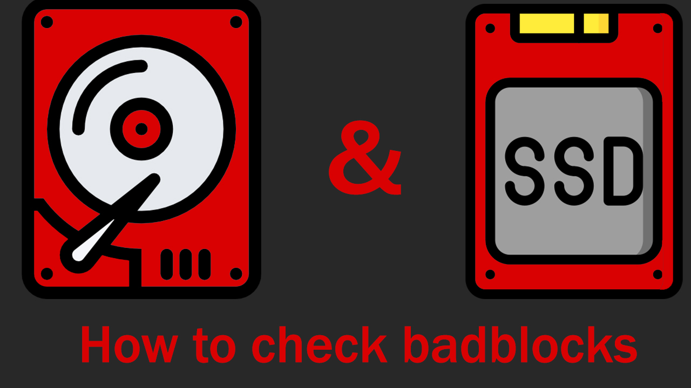

{ .center-image }
<H1 style="text-align: center;">BadBlocks</H1>

## Master the Linux ‘badblocks’ Command: A Comprehensive Guide
> *This article presents a comprehensive guide to the Linux command* `*badblocks*`*, designed with newbies in mind. It provides an in-depth look at the* `*badblocks*` *command, from its historical background to its various use cases. The guide details how to use* `*badblocks*` *and outlines the most common parameters along with their functionality. It also offers an exploration of other supported parameters. Additionally, it discusses some tricky skills and essential points to note when using this command to avoid potential pitfalls. This guide underscores the importance of* `*badblocks*` *in identifying bad sectors and its role in preventing data loss, emphasizing safe and responsible usage.*

## Instructions

In this article, we delve into the `badblocks` command, a utility in Linux for scanning storage devices for bad sectors. We cover the command's history, its purposes and usage, its parameters, and a few notable use cases. We'll also discuss some lesser-known but powerful tricks to utilize `badblocks`, alongside some precautionary measures to prevent unintended mishaps.

## History

`badblocks` is an age-old utility in Unix-like operating systems, including Linux. It's part of the e2fsprogs suite of utilities for maintaining the ext2, ext3, and ext4 file systems. It was designed to scan storage devices for 'bad blocks', which are sectors that can no longer be reliably used due to physical wear and tear, hardware failure, or other issues.

## When and why to use it

`badblocks` is predominantly used when there's a suspicion of hardware degradation or when you want to proactively check the health of your storage devices. As storage devices age, they can develop 'bad blocks'—sectors that can no longer reliably hold data. `badblocks` can scan a device for these defective blocks, providing you with an assessment of the device's health.

## How to use it

The most straightforward way to use `badblocks` is to provide the device you wish to scan as an argument:

$ badblocks /dev/sda

This command will run a non-destructive read-only test on the device represented by `/dev/sda`. The command outputs the numbers of any bad blocks it finds. Remember to replace `/dev/sda` with the appropriate representation of your device.

## The commonly used parameters

`badblocks` has a number of useful parameters that modify its behavior:

- `-v` : This stands for 'verbose'. When this parameter is used, `badblocks` will provide additional details about the operation as it proceeds.

$ badblocks -v /dev/sda

This command will output progress information and all block numbers as they are checked.

- `-s` : This stands for 'show progress'. This option will show a progress bar during the scan, which is especially helpful during long operations.

$ badblocks -s /dev/sda

This command will output a progress bar that’s updated every 5 minutes by default.

## Other supported parameters

Apart from the commonly used parameters, `badblocks` supports a wide range of other parameters:

- `-b block-size` : This allows you to specify a block size for the operation. The default is 1024 bytes.
- `-c blocks_at_once` : This defines the number of blocks to test at once. The default is 64.
- `-d test_pattern` : This specifies a test pattern for the read-write test. It can be 0 or 1.
- `-e max_errors` : This tells `badblocks` to stop checking after a certain number of errors.
- `-p num_passes` : This makes `badblocks` run through its tests multiple times.
- `-t test_pattern` : This provides a test pattern for the read-only test.
- `-w` : This invokes the destructive read-write test. Be careful when using this option, as it will erase any existing data on the drive.

## Most common use cases

One of the most common uses for `badblocks` is to verify the integrity of a disk that you suspect might have been damaged or be deteriorating. Here are a few examples:

## To perform a non-destructive read-write test

$ sudo badblocks -s -v -n -f /dev/sda

This will test the device `/dev/sda` for bad blocks in a non-destructive manner. `-s` shows the progress, `-v` gives verbose output, `-n` opts for a non-destructive read-write mode, and `-f` forces the test.

## To perform a destructive read-write test

$ sudo badblocks -w -s /dev/sda

This command will conduct a destructive write test on `/dev/sda`. Please be warned, `-w` option will erase all the data on the drive.

## To perform a test and write the bad blocks to a file

$ sudo badblocks -v /dev/sda > badblocks.txt

This will create a list of bad blocks in `badblocks.txt` file. This list can be used with `fsck` to avoid those blocks during the file system repair.

These are some of the most common use cases, but remember that `badblocks` is a very powerful tool that should be used with caution.

## The tricky skills

While `badblocks` is primarily a diagnostic tool, it can also be used in some clever ways to achieve unusual tasks:

## To zero out the bad blocks

$ sudo dd if=/dev/zero of=/dev/sda bs=512 count=1 seek=$(cat badblocks.txt)

This command will fill the bad blocks recorded in `badblocks.txt` with zeros. `dd` is a command-line utility for Unix and Unix-like operating systems whose primary purpose is to convert and copy files.

## To create a file system considering bad blocks

$ sudo mkfs -c /dev/sda

The `-c` option in `mkfs` command will run a bad blocks check on the drive before creating a file system. This can be useful when setting up a new drive.

Remember, these techniques are rather advanced and should only be used by those who are very familiar with Linux system administration and understand the potential risks.

## What needs to be noted

When running `badblocks`, keep the following points in mind:

1. The `badblocks` command is highly disk-intensive and can put a lot of stress on your drives. You should avoid running it on drives that are in use, especially in production environments.
2. While `badblocks` can detect physical issues on your hard drive, it's not capable of fixing them. If the command reports bad blocks, you might need to consider replacing the drive.
3. The `n` option should be used carefully. This is a destructive read-write test that can cause data loss if not used properly.
4. You should not run `badblocks` on a mounted filesystem to avoid data loss or corruption. Always unmount the filesystem or boot from a live CD/USB before running the test.

## Conclusion

In summary, `badblocks` is an essential utility in Linux for identifying bad sectors on your disk. Its extensive options allow for different types of tests, offering flexibility based on your specific needs. However, the use of `badblocks` should be approached with caution due to its intensive nature and potential for data loss if used incorrectly.

Although it cannot repair physical issues, identifying bad sectors early can save you from sudden disk failures and data loss. Therefore, understanding how to use `badblocks` effectively and safely is beneficial for any Linux user.

Remember, always back up your data and use `badblocks` responsibly. With the right precautions, `badblocks` can be a powerful tool in your Linux toolkit.