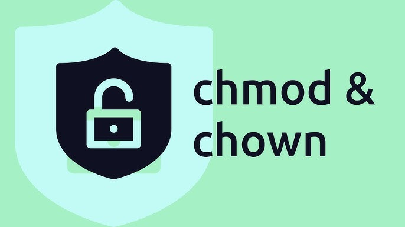

<div style="display: none;">
  <h1>Header</h1>
</div>

{ .center-image }

<div align="center">
<a href="https://www.cyberciti.biz/faq/how-to-use-chmod-and-chown-command/"" title="Return to the main page"><h2>How To Use chmod and chown Command in Linux</h2></a>
 </div>

!!! pied-piper "Important"

    How do I use chmod and chown command under Linux / Unix operating systems?
    
    Use the chown command to change file owner and group information. we run the chmod command command to change file access permissions such as read, write, and access. This page explains how to use chmod and chown command on Linux or Unix-like systems.
    
!!! abstract "Markdown"

    <b>Understanding file permissions for chmod and chown command.</b>
    

    ---

    ```text {.no-copy .no-style}
    One can use file permissions to control access to their files. Sysadmins can
    enforce a security policy based upon file permissions. All files have three types:
    ```
    
    ---
    
    ```text {.no-copy .no-style}
    1. Owner – Person or process who created the file.
    2. Group – All users have a primary group, and they own the file, which is useful
       for sharing files or giving access.
    3. Others – Users who are not the owner, nor a member of the group. Also,
       know as world permission.
    ```
    
!!! pied-piper "read (r), write (w), and execute (x) permission"

    We can set the following permissions on both files and directories:
    

<table>
<tbody><tr>
<th>Permission</th>
<th>File</th>
<th>Directory</th>
</tr>
<tr>
<td><kbd><strong>r</strong></kbd></td>
<td>Reading access/view file</td>
<td>Users can read file. In other words, they can run the ls command to list contents of the folder/directory.</td>
</tr>
<tr>
<td><kbd><strong>w</strong></kbd></td>
<td>Writing access/update/remove file</td>
<td>Users can update, write and delete a file from the directory.</td>
</tr>
<tr>
<td><kbd><strong>x</strong></kbd></td>
<td>Execution access. Run a file/script as command</td>
<td>Users can execute/run file as command and they have r permission too.</td>
</tr>
<tr>
<td><kbd><strong>-</strong></kbd></td>
<td>No access. When you want to remove r, w, and x permission</td>
<td>All access is taken away or removed.</td>
</tr>
</tbody></table>

!!! danger "Please Note that Permission Priority decided as follows by the kernel:"

    1. We can set the following permissions on both files and directories:
    <code>User permissions -&gt; Group permissions -&gt; Other permissions</code>
    2. It means user permission overrides group permission and group permissions overrides other permission.
    

<h3>Viewing Linux/Unix file permissions and ownership</h3>
<p>Run the ls command:<br>
<code>ls -l<br>
<span style="color: #999999;"># Show information about a file named file1 #</span><br>
ls -l file1<br>
ls -l /path/to/file1<br>
<span style="color: #999999;"># Get information about a directory named dir1 #</span><br>
ls -ld dir1<br>
ls -l -d /path/to/dir1</code><br>
For example, we can list permissions for /etc/hosts and /etc/ directory as follows:<br>
<code>ls -l /etc/hosts</code><br>
Pass the <kbd>-d</kbd> option to ls to list directories themselves, not their contents:</p>
<pre><strong>-rw-r--r--</strong> 1 root root 742 Jul  1 14:39 /etc/host</pre>
<p><code>ls -l -d /etc/</code></p>
<pre><strong>drwxr-xr-x </strong>175 root root 12288 Jul 30 08:53 /etc</pre>
<p>From above outputs it is clear that the first character indicate the file type in <strong>drwxr-xr-x </strong> and <strong>-rw-r–r–</strong> and the next 9 characters are the actual file permissions.</p>
<h3><strong><span style="color: rgb(255, 153, 0);">–</span>rw-r–r–</strong> file and <strong><span style="color: rgb(255, 153, 0);">d</span>rwxr-xr-x </strong> directory permission explained </h3>
<table>
<tbody><tr>
<th>First character</th>
<th>Description</th>
</tr>
<tr>
<td><kbd><strong>-</strong></kbd></td>
<td>Regular file.</td>
</tr>
<tr>
<td><kbd><strong>b</strong></kbd></td>
<td>Block special file.</td>
</tr>
<tr>
<td><kbd><strong>c</strong></kbd></td>
<td>Character special file.</td>
</tr>
<tr>
<td><kbd><strong>d</strong></kbd></td>
<td>Directory.</td>
</tr>
<tr>
<td><kbd><strong>l</strong></kbd></td>
<td>Symbolic link.</td>
</tr>
<tr>
<td><kbd><strong>p</strong></kbd></td>
<td>FIFO.</td>
</tr>
<tr>
<td><kbd><strong>s</strong></kbd></td>
<td>Socket.</td>
</tr>
<tr>
<td><kbd><strong>w</strong></kbd></td>
<td>Whiteout.</td>
</tr>
</tbody></table>
<p>Next nine characters are the file permissions divided into three sets/triad of three characters for owner permissions, group permissions, and other/world permissions as follows:</p>
<table>
<tbody><tr>
<th>Three permission triads defined what the user/group/others can do</th>
<th><span style="color: rgb(102, 204, 187);">First triad</span> defines what the owner can do</th>
<th><span style="color: rgb(235, 132, 91);">Second triad</span> explains what the group members can do</th>
<th><span style="color: rgb(237, 66, 66);">Third triad</span> defines what other users can do</th>
</tr>
<tr>
<td><kbd><strong><span style="color: rgb(102, 102, 204);"><span style="color: rgb(255, 153, 0);">-</span>rw-</span><span style="color: rgb(153, 51, 153);">r--</span><span style="color: rgb(255, 0, 0);">r--</span></strong></kbd></td>
<td>Owner has only read and write permission (<kbd><span style="color: rgb(102, 102, 204);">rw-</span></kbd>)</td>
<td>Group has read permission (<kbd><span style="color: rgb(153, 51, 153);">r--</span></kbd>)</td>
<td>Others has read permission (<kbd><span style="color: rgb(255, 0, 0);">r--</span></kbd>)</td>
</tr>
<tr>
<td><kbd><strong><span style="color: rgb(102, 102, 204);"><span style="color: rgb(255, 153, 0);">d</span>rwx</span><span style="color: rgb(153, 51, 153);">r-x</span><span style="color: rgb(255, 0, 0);">r-x</span></strong></kbd></td>
<td>Owner has full permission (<kbd><span style="color: rgb(102, 102, 204);">rwx</span></kbd>)</td>
<td>Group has read and execute permission (<kbd><span style="color: rgb(153, 51, 153);">r-x</span></kbd>)</td>
<td>Others has read and execute permission (<kbd><span style="color: rgb(255, 0, 0);">r-x</span></kbd>) </td>
</tr>
</tbody></table>
<h3>Displaying file permission using the stat command</h3>
<p>Run the following command:<br>
<code>stat file1<br>
stat dir1<br>
stat /etc/passwd<br>
stat /etc/resolv.conf</code></p>
<pre>  File: /etc/passwd
  Size: 3100      	Blocks: 8          IO Block: 4096   regular file
Device: fd02h/64770d	Inode: 25954314    Links: 1
Access: (0644/-rw-r--r--)  Uid: (    0/    root)   Gid: (    0/    root)
Access: 2020-07-29 23:09:01.865822913 +0530
Modify: 2020-07-02 19:16:43.743727913 +0530
Change: 2020-07-02 19:16:43.747727898 +0530
 Birth: -
</pre>
<p>GUI displaying file permissions:<br>
</p>
<h2>chown command</h2>
<p>The chown command changes the user and/or group ownership of for given file. The syntax is:</p>


<div class="wp-geshi-highlight-wrap5"><div class="wp-geshi-highlight-wrap4"><div class="wp-geshi-highlight-wrap3"><div class="wp-geshi-highlight-wrap2"><div class="wp-geshi-highlight-wrap"><div class="wp-geshi-highlight"><div class="bash"><pre class="de1"><span class="kw2">chown</span> owner-user <span class="kw2">file</span> 
<span class="kw2">chown</span> owner-user:owner-group <span class="kw2">file</span>
<span class="kw2">chown</span> owner-user:owner-group directory
<span class="kw2">chown</span> options owner-user:owner-group <span class="kw2">file</span></pre></div></div></div></div></div></div></div>


<h3>Examples</h3>
<p>First, list permissions for demo.txt, enter:<br>
<code># ls -l demo.txt</code><br>
Sample outputs:</p>
<pre>-rw-r--r-- 1 root root 0 Aug 31 05:48 demo.txt</pre>
<p>In this example change file ownership to vivek user and list the permissions, run:<br>
<code># chown vivek demo.txt<br>
# ls -l demo.txt</code><br>
Sample outputs:</p>
<pre>-rw-r--r-- 1 vivek root 0 Aug 31 05:48 demo.txt</pre>
<p>In this next example, the owner is set to vivek followed by a colon and a group onwership is also set to vivek group, run:<br>
<code># chown <span style="color: rgb(0, 153, 0);">vivek:vivek</span> demo.txt<br>
# ls -l demo.txt</code><br>
Sample outputs:</p>
<pre>-rw-r--r-- 1 vivek vivek 0 Aug 31 05:48 demo.txt</pre>
<p>In this example, change only the group of file. To do so, the colon and following GROUP-name ftp are given, but the owner is omitted, only the group of the files is changed:<br>
<code># chown :ftp demo.txt<br>
# ls -l demo.txt</code><br>
Sample outputs:</p>
<pre>-rw-r--r-- 1 vivek <span style="color: rgb(0, 153, 0);">ftp</span> 0 Aug 31 05:48 demo.txt</pre>
<p>Please note that if only a colon is given, or if NEW-OWNER is empty, neither the owner nor the group is changed:<br>
<code># chown : demo.txt</code><br>
In this example, change the owner of /foo to “root”, execute:<br>
<code># chown root /foo</code><br>
Likewise, but also change its group to “httpd”, enter:<br>
<code># chown root:httpd /foo</code><br>
Change the owner of /foo and subfiles to “root”, run:<br>
<code># chown -R root /u</code><br>
Where,</p>
<ul>
<li><kbd>-R</kbd> – Recursively change ownership of directories and their contents.</li>
</ul>
<h2>chmod command</h2>
<p>The syntax is:<br>
<code>chmod permission file<br>
chmod permission dir<br>
chmod <span style="color: rgb(102, 102, 204);">User</span><span style="color: rgb(153, 51, 153);">AccessRights</span><span style="color: rgb(255, 153, 0);">Permission</span> file</code><br>
We use the following letters for <span style="color: rgb(102, 102, 204);">user</span>:</p>
<ul>
<li><kbd><strong>u</strong></kbd> for user</li>
<li><kbd><strong>g</strong></kbd> for group</li>
<li><kbd><strong>o</strong></kbd> for others</li>
<li><kbd><strong>a</strong></kbd> for all</li>
</ul>
<p>We can set or remove (<span style="color: rgb(153, 51, 153);">user access rights</span>) file permission using the following letters:</p>
<ul>
<li><kbd><strong>+</strong></kbd> for adding </li>
<li><kbd><strong>-</strong></kbd> for removing </li>
<li><kbd><strong>=</strong></kbd> set exact permission</li>
</ul>
<p>File <span style="color: rgb(255, 153, 0);">permission</span> letter is as follows:</p>
<ul>
<li><kbd><strong>r</strong></kbd> for read-only</li>
<li><kbd><strong>w</strong></kbd> for write-only</li>
<li><kbd><strong>x</strong></kbd> for execute-only</li>
</ul>
<p>Now we can use the symbolic method for changing file permissions based upon the above letters.</p>
<h3>Examples</h3>
<p>Delete read and write permission for group and others on a file named config.php:<br>
<code>$ ls -l config.php<br>
<span style="color: #999999;"># State 'who' : g (group) and o (others)<br>
# State what to do with 'who': - (remove)<br>
# State permissions for 'who': r (read) and w (write) </span><br>
$ chmod -v go-rw config.php<br>
$ ls -l config.php<br>
$ stat config.php</code><br>
<br>
Let us adds read permission for all/everyone (a). In other words, give read permission to  user, group and others:<br>
<code>$ chmod a+r file.pl</code><br>
Delete execute permission for all everyone (a):<br>
<code>$ chmod a-x myscript.sh</code><br>
Adds read and execute permissions for everyone (a):<br>
<code>$ chmod a+rx pager.pl</code><br>
Next, sets read and write permission for user, sets read for group, and remove all access for others:<br>
<code>$ chmod u=rw,g=r,o= birthday.cgi</code><br>
In this file example, sets read and write permissions for user and group:<br>
<code>$ chmod ug=rw /var/www/html/data.php</code><br>
See “<a href="https://www.cyberciti.biz/tips/unix-or-linux-commands-for-changing-user-rights.html">how to use  change user rights using chomod command</a>” for more information.</p>
<h2>Conclusion</h2>
<p>We explained the chown and chmod command for Linux and Unix users. I strongly suggest that you read man pages by typing the following <a href="https://bash.cyberciti.biz/guide/Man_command" title="Man command - Linux Bash Shell Scripting Tutorial Wiki">man command</a> or see GNU <a href="https://www.gnu.org/software/coreutils/manual/html_node/chmod-invocation.html" rel="noopener noreferrer" target="_blank">coreutils online help</a> pages:<br>
<code>man chown</code><br>
<code>man chmod</code>
