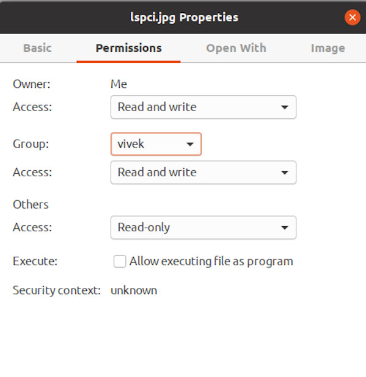
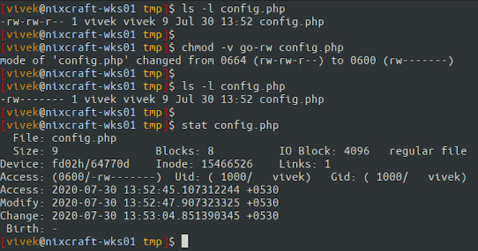

<div style="display: none;">
  <h1>Header</h1>
</div>

{ .center-image }

<div align="center">
<a href="https://www.cyberciti.biz/faq/how-to-use-chmod-and-chown-command/"" title="Return to the main page"><h2>How To Use chmod and chown Command in Linux</h2></a>
 </div>

!!! pied-piper "Important"

    How do I use chmod and chown command under Linux / Unix operating systems?
    
    Use the chown command to change file owner and group information. we run the chmod command command to change file access permissions such as read, write, and access. This page explains how to use chmod and chown command on Linux or Unix-like systems.
    
!!! abstract "Markdown"

    <b>Understanding file permissions for chmod and chown command.</b>
    

    ---

    ```text {.no-copy .no-style}
    One can use file permissions to control access to their files. Sysadmins can
    enforce a security policy based upon file permissions. All files have three types:
    ```
    
    ---
    
    ```text {.no-copy .no-style}
    1. Owner – Person or process who created the file.
    2. Group – All users have a primary group, and they own the file, which is useful
       for sharing files or giving access.
    3. Others – Users who are not the owner, nor a member of the group. Also,
       know as world permission.
    ```
    
!!! pied-piper "read (r), write (w), and execute (x) permission"

    We can set the following permissions on both files and directories:
    

| Permission | File | Directory |
| --- | --- | --- |
| **r** | Reading access/view file | Users can read file. In other words, they can run the ls command to list contents of the folder/directory. |
| **w** | Writing access/update/remove file | Users can update, write and delete a file from the directory. |
| **x** | Execution access. Run a file/script as command | Users can execute/run file as command and they have r permission too. |
| **-** | No access. When you want to remove r, w, and x permission | All access is taken away or removed. |

!!! danger "Please Note that Permission Priority decided as follows by the kernel:"

    1. We can set the following permissions on both files and directories:
    <code>User permissions -&gt; Group permissions -&gt; Other permissions</code>
    2. It means user permission overrides group permission and group permissions overrides other permission.
    

#####  Viewing Linux/Unix file permissions and ownership.

!!! info "Viewing Linux file Permissions"

    Run the ls command:
    
    ```Zsh
    `ls -l
    ```
    
    Show information about a file named file1 #
    
    ```Zsh
    ls -l file1
    ls -l /path/to/file1
    ```
    
    Get information about a directory named dir1 #
    
    ```Zsh
    ls -ld dir1
    ls -l -d /path/to/dir1
    ```
    
!!! info "List Permissions"

    For example, we can list permissions for /etc/hosts and /etc/ directory as follows:
    
    ```Zsh
    `ls -l /etc/hosts`
    ```
    
    Pass the -d option to ls to list directories themselves, not their contents:
    
    **-rw-r--r--** 1 root root 742 Jul  1 14:39 /etc/host
    
    `ls -l -d /etc/`
    
    **drwxr-xr-x** 175 root root 12288 Jul 30 08:53 /etc
    
    From above outputs it is clear that the first character indicate the file type in **drwxr-xr-x** and **-rw-r–r–** and the next 9 characters are the actual file permissions.
    

<h3><strong><span style="color: rgb(255, 153, 0);">–</span>rw-r–r–</strong> file and <strong><span style="color: rgb(255, 153, 0);">d</span>rwxr-xr-x </strong> directory permission explained </h3>

</br>

| First character | Description |
| --- | --- |
| **-** | Regular file. |
| **b** | Block special file. |
| **c** | Character special file. |
| **d** | Directory. |
| **l** | Symbolic link. |
| **p** | FIFO. |
| **s** | Socket. |
| **w** | Whiteout. |


<p>Next nine characters are the file permissions divided into three sets/triad of three characters for owner permissions, group permissions, and other/world permissions as follows:</p>
<table>
<tbody><tr>
<th>Three permission triads defined what the user/group/others can do</th>
<th><span style="color: rgb(102, 204, 187);">First triad</span> defines what the owner can do</th>
<th><span style="color: rgb(235, 132, 91);">Second triad</span> explains what the group members can do</th>
<th><span style="color: rgb(237, 66, 66);">Third triad</span> defines what other users can do</th>
</tr>
<tr>
<td><kbd><strong><span style="color: rgb(102, 102, 204);"><span style="color: rgb(255, 153, 0);">-</span>rw-</span><span style="color: rgb(153, 51, 153);">r--</span><span style="color: rgb(255, 0, 0);">r--</span></strong></kbd></td>
<td>Owner has only read and write permission (<kbd><span style="color: rgb(102, 102, 204);">rw-</span></kbd>)</td>
<td>Group has read permission (<kbd><span style="color: rgb(153, 51, 153);">r--</span></kbd>)</td>
<td>Others has read permission (<kbd><span style="color: rgb(255, 0, 0);">r--</span></kbd>)</td>
</tr>
<tr>
<td><kbd><strong><span style="color: rgb(102, 102, 204);"><span style="color: rgb(255, 153, 0);">d</span>rwx</span><span style="color: rgb(153, 51, 153);">r-x</span><span style="color: rgb(255, 0, 0);">r-x</span></strong></kbd></td>
<td>Owner has full permission (<kbd><span style="color: rgb(102, 102, 204);">rwx</span></kbd>)</td>
<td>Group has read and execute permission (<kbd><span style="color: rgb(153, 51, 153);">r-x</span></kbd>)</td>
<td>Others has read and execute permission (<kbd><span style="color: rgb(255, 0, 0);">r-x</span></kbd>) </td>
</tr>
</tbody></table>

### Displaying file permission using the stat command

!!! info "Stat Command"

    Run the following command:
    
    ```Zsh
    `stat file1 stat dir1 stat /etc/passwd stat /etc/resolv.conf`
    ```
    
    ```Zsh
    File: /etc/passwd
    Size: 3100   Blocks: 8  IO Block: 4096  regular file
    Device: fd02h/64770d	Inode: 25954314    Links: 1
    Access: (0644/-rw-r--r--)  Uid: (    0/    root)   Gid: (    0/    root)
    Access: 2020-07-29 23:09:01.865822913 +0530
    Modify: 2020-07-02 19:16:43.743727913 +0530
    Change: 2020-07-02 19:16:43.747727898 +0530
    Birth: -
    ```
    
#### GUI displaying file permissions:



#### Chown Command

!!! pied-piper "Chown Command"

    The chown command changes the user and/or group ownership of for given file. The syntax is:
    
    ```Zsh
    chown owner-user file
    chown owner-user:owner-group file
    chown owner-user:owner-group directory
    chown options owner-user:owner-group file
    ```
    
#### Examples

!!! info "Examples"

    First, list permissions for demo.txt, enter:
    
    ```Zsh
    # ls -l demo.txt
    
    Sample outputs:
    -rw-r--r-- 1 root root 0 Aug 31 05:48 demo.txt
    ```
    
    ---
    
    In this example change file ownership to vivek user and list the permissions, run:
    
    ```Zsh
    # chown vivek demo.txt
    # ls -l demo.txt
    
    Sample outputs:
    -rw-r--r-- 1 vivek root 0 Aug 31 05:48 demo.txt
    ```
    
!!! info "Next Example"

    In this next example, the owner is set to vivek followed by a colon and a group onwership is also set to vivek group, run:
    
    ```Zsh
    # chown vivek:vivek demo.txt
    # ls -l demo.txt
    
    Sample outputs:
    -rw-r--r-- 1 vivek vivek 0 Aug 31 05:48 demo.txt
    ```
    
    ---
    
    In this example, change only the group of file. To do so, the colon and following GROUP-name ftp are given, but the owner is omitted, only the group of the files is changed:
    
    ```Zsh
    # chown :ftp demo.txt
    # ls -l demo.txt
    
    Sample outputs:
    -rw-r--r-- 1 vivek ftp 0 Aug 31 05:48 demo.txt
    ```
    
!!! abstract "Colon Only"

    Please note that if only a colon is given, or if NEW-OWNER is empty, neither the owner nor the group is changed:
    
    ```Zsh
    # chown : demo.txt
    
    In this example, change the owner of /foo to “root”, execute:
    # chown root /foo
    
    Likewise, but also change its group to “httpd”, enter:
    # chown root:httpd /foo
    
    Change the owner of /foo and subfiles to “root”, run:
    # chown -R root /u
    ```
    
    Where, -R – Recursively change ownership of directories and their contents.
    

#### Chmod Command

!!! abstract "Chmod Command"

    The syntax is:
    `chmod permission file`
    `chmod permission dir`
    `chmod User` `AccessRights` `Permission file`
    
    ---
    
    We use the following letters for user:
    
     - `u for user`
     - `g for group`
     - `o for others`
     - `a for all`
     
    ---
     
    We can set or remove (user access rights) file permission using the following letters:
    
    - `+ for adding`
    - `- for removing`
    - `= set exact permission`
    
    ---
    
    File permission letter is as follows:
    
    - `r for read-only`
    - `w for write-only`
    - `x for execute-only`
    
    
!!! abstract "Examples"

    Now we can use the symbolic method for changing file permissions based upon the above letters.
    
    - Examples
    - `Delete`, `read` and `write` permission for group and others on a file named config.php:
    
    ```Zsh
    $ ls -l config.php
    # State 'who' : g (group) and o (others)
    # State what to do with 'who': - (remove)
    # State permissions for 'who': r (read) and w (write)
    $ chmod -v go-rw config.php
    $ ls -l config.php
    $ stat config.php
    ```
    


!!! abstract ""

    Let us add read permission for all/everyone (a). In other words, give read permission to user, group and others:
    
    ```Zsh
    $ chmod a+r file.pl
    ```
    
!!! abstract ""
    Delete execute permission for all everyone (a):
    
    ```Zsh
    $ chmod a-x myscript.sh
    ```
    
!!! abstract ""
    Adds read and execute permissions for everyone (a):
    
    ```Zsh
    $ chmod a+rx pager.pl
    ```
    
!!! abstract ""
    Next, sets read and write permission for user, sets read for group, and remove all access for others:
    
    ```Zsh
    $ chmod u=rw,g=r,o= birthday.cgi
    ```
    
!!! abstract ""
    In this file example, sets read and write permissions for user and group:
    
    ```Zsh
    $ chmod ug=rw /var/www/html/data.php
    ```
    
See [“how to use `change user rights` using the `chomod` command"](https://www.cyberciti.biz/tips/unix-or-linux-commands-for-changing-user-rights.html) for more information.

#### Conclusion


We explained the chown and chmod command for Linux and Unix users. I strongly suggest that you read man pages by typing the following [man command](https://bash.cyberciti.biz/guide/Man_command "Man command - Linux Bash Shell Scripting Tutorial Wiki") or see GNU [coreutils online help](https://www.gnu.org/software/coreutils/manual/html_node/chmod-invocation.html) pages:


!!! danger ""

    Man Pages
    
    ```Zsh
    man chown
    ```
    
    ---
    
    ```Zsh
    man chmod
    ```
    
 
