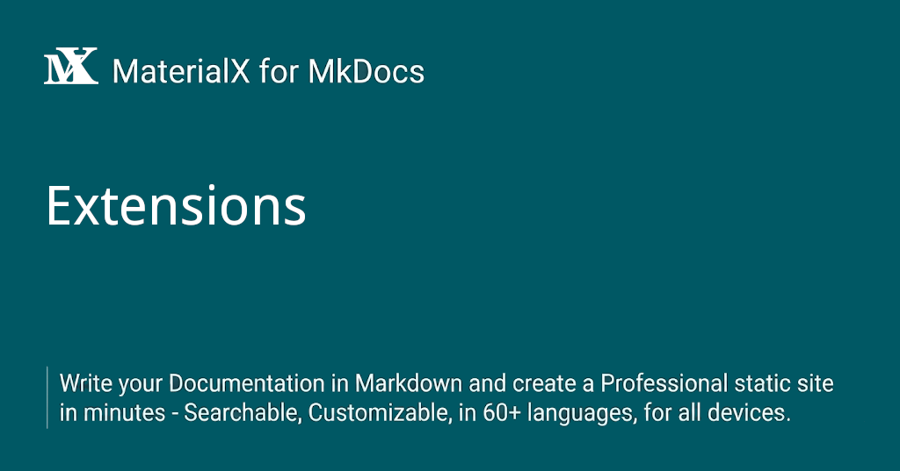

{ .center-image }
<H1 style="text-align: center;"><ins>Extensions</ins></H1>

Markdown is a very small language with a kind-of reference implementation called [John Gruber's Markdown]. [Python Markdown] and [Python Markdown Extensions] are two packages that enhance the Markdown writing experience, adding useful syntax extensions for technical writing.

  [John Gruber's Markdown]: https://daringfireball.net/projects/markdown/
  [Python Markdown]: MkDocs-Material/python-markdown.md
  [Python Markdown Extensions]: MkDocs-Material/python-markdown-extensions.md

## Supported extensions

The following extensions are all supported by MaterialX for MkDocs and therefore strongly recommended. Click on each extension to learn about its purpose and configuration:

<div class="mdx-columns" markdown>

- [Abbreviations]
- [Admonition]
- [Arithmatex]
- [Attribute Lists]
- [BetterEm]
- [Caret, Mark & Tilde]
- [Critic]
- [Definition Lists]
- [Details]
- [Emoji]
- [Footnotes]
- [Highlight]
- [Keys]
- [Markdown in HTML]
- [SmartSymbols]
- [Snippets]
- [SuperFences]
- [Tabbed]
- [Table of Contents]
- [Tables]
- [Tasklist]

</div>

  [Abbreviations]: MkDocs-Material/python-markdown.md#abbreviations
  [Admonition]: MkDocs-Material/python-markdown.md#admonitions
  [Arithmatex]: MkDocs-Material/python-markdown-extensions.md#arithmatex
  [Attribute Lists]: MkDocs-Material/python-markdown.md#attribute-lists
  [BetterEm]: MkDocs-Material/python-markdown-extensions.md#betterem
  [Caret, Mark & Tilde]: MkDocs-Material/python-markdown-extensions.md#caret-mark-tilde
  [Critic]: MkDocs-Material/python-markdown-extensions.md#critic
  [Definition Lists]: MkDocs-Material/python-markdown.md#definition-lists
  [Details]: MkDocs-Material/python-markdown-extensions.md#details
  [Emoji]: MkDocs-Material/python-markdown-extensions.md#emoji
  [Footnotes]: MkDocs-Material/python-markdown.md#footnotes
  [Highlight]: MkDocs-Material/python-markdown-extensions.md#highlight
  [Keys]: MkDocs-Material/python-markdown-extensions.md#keys
  [Markdown in HTML]: MkDocs-Material/python-markdown.md#markdown-in-html
  [SmartSymbols]: MkDocs-Material/python-markdown-extensions.md#smartsymbols
  [Snippets]: MkDocs-Material/python-markdown-extensions.md#snippets
  [SuperFences]: MkDocs-Material/python-markdown-extensions.md#superfences
  [Tabbed]: MkDocs-Material/python-markdown-extensions.md#tabbed
  [Table of Contents]: MkDocs-Material/python-markdown.md#table-of-contents
  [Tables]: MkDocs-Material/python-markdown.md#tables
  [Tasklist]: MkDocs-Material/python-markdown-extensions.md#tasklist

## Configuration

Extensions are configured as part of `mkdocs.yml` – the MkDocs configuration file. The following sections contain two example configurations to bootstrap your documentation project.

  [overview]: #advanced-configuration

### Minimal configuration

This configuration is a good starting point for when you're using MaterialX for MkDocs for the first time. The bestidea is to explore the [reference], and gradually add what you want to use:

``` yaml
markdown_extensions:

  # Python Markdown
  - toc:
      permalink: true

  # Python Markdown Extensions
  - pymdownx.highlight
  - pymdownx.superfences
```

  [reference]: MkDocsCaption/references.md

### Recommended configuration

This configuration enables all Markdown-related features of MaterialX for MkDocs and is great for experienced users bootstrapping a new documentation project:

``` yaml
markdown_extensions:

  # Python Markdown
  - abbr
  - admonition
  - attr_list
  - def_list
  - footnotes
  - md_in_html
  - toc:
      permalink: true

  # Python Markdown Extensions
  - pymdownx.arithmatex:
      generic: true
  - pymdownx.betterem
  - pymdownx.caret
  - pymdownx.details
  - pymdownx.emoji:
      emoji_index: !!python/name:material.extensions.emoji.twemoji
      emoji_generator: !!python/name:material.extensions.emoji.to_svg
  - pymdownx.highlight
  - pymdownx.inlinehilite
  - pymdownx.keys
  - pymdownx.mark
  - pymdownx.smartsymbols
  - pymdownx.superfences
  - pymdownx.tabbed:
      alternate_style: true
  - pymdownx.tasklist:
      custom_checkbox: true
  - pymdownx.tilde
```
