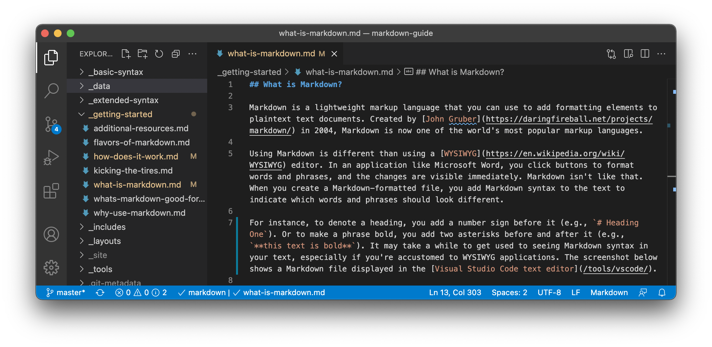

{ .center-image }
{ .center-image }

<H1 style="text-align: center;"> Awesome Markdown</H1>

### Getting Started

!!! desc "Getting Started"
    An overview of Markdown, how it works, and what you can do with it.
    
### What is Markdown?

!!! git "What is Markdown?"

    Markdown is a lightweight markup language that you can use to add formatting elements to plaintext text documents. Created by [John Gruber](https://daringfireball.net/projects/markdown/) in 2004, Markdown is now one of the world’s most popular markup languages.
    
    Using Markdown is different than using a [WYSIWYG](https://en.wikipedia.org/wiki/WYSIWYG) editor. In an application like Microsoft Word, you click buttons to format words and phrases, and the changes are visible immediately. Markdown isn’t like that. When you create a Markdown-formatted file, you add Markdown syntax to the text to indicate which words and phrases should look different.
    
    For example, to denote a heading, you add a number sign before it (e.g., <code class="language-plaintext highlighter-rouge"># Heading One</code>). Or to make a phrase bold, you add two asterisks before and after it (e.g., <code class="language-plaintext highlighter-rouge">**this text is bold**</code>). It may take a while to get used to seeing Markdown syntax in your text, especially if you’re accustomed to WYSIWYG applications. The screenshot below shows a Markdown file displayed in the [Visual Studio Code Text Editor](https://www.markdownguide.org/tools/vscode/).
    
    
    
    You can add Markdown formatting elements to a plaintext file using a text editor application. Or you can use one of the many Markdown applications for macOS, Windows, Linux, iOS, and Android operating systems. There are also several web-based applications specifically designed for writing in Markdown.
    
    Depending on the application you use, you may not be able to preview the formatted document in real time. But that’s okay. [According to Gruber](https://daringfireball.net/projects/markdown/), Markdown syntax is designed to be readable and unobtrusive, so the text in Markdown files can be read even if it isn’t rendered.

    !!! desc "Overriding Design Goal"

        The overriding design goal for Markdown’s formatting syntax is to make it as readable as possible. The idea is that a Markdown-formatted document should be publishable as-is, as plain text, without looking like it’s been marked up with tags or formatting instructions.
    
## Why Use Markdown?

!!! info "Why Use Markdown?"

    You might be wondering why people use Markdown instead of a WYSIWYG editor. Why write with Markdown when you can press buttons in an interface to format your text? As it turns out, there are several reasons why people use Markdown instead of WYSIWYG editors.

    *   **Markdown can be used for everything.** People use it to create [websites](https://www.markdownguide.org/getting-started/#websites), [documents](https://www.markdownguide.org/getting-started/#documents), [notes](#notes), [books](#books), [presentations](#presentations), [email messages](#email), and [technical documentation](#documentation).
    *   **Markdown is portable.** Files containing Markdown-formatted text can be opened using virtually any application. If you decide you don’t like the Markdown application you’re currently using, you can import your Markdown files into another Markdown application. That’s in stark contrast to word processing applications like Microsoft Word that lock your content into a proprietary file format.
    *   **Markdown is platform independent.** You can create Markdown-formatted text on any device running any operating system.
    *   **Markdown is future proof.** Even if the application you’re using stops working at some point in the future, you’ll still be able to read your Markdown-formatted text using a text editing application. This is an important consideration when it comes to books, university theses, and other milestone documents that need to be preserved indefinitely.
    *   **Markdown is everywhere.** Websites like [Reddit](https://www.reddit.com/) and GitHub support Markdown, and lots of desktop and web-based applications support it.

## Kicking the Tires

!!! info "Kicking the Tires"

    The best way to get started with Markdown is to use it. That’s easier than ever before thanks to a variety of free tools.

    You don’t even need to download anything. There are several online Markdown editors that you can use to try writing in Markdown. [Dillinger](https://dillinger.io/) is one of the best online Markdown editors. Just open the site and start typing in the left pane. A preview of the rendered document appears in the right pane.
    
    ---

    
    
    ---

    You’ll probably want to keep the Dillinger website open as you read through this guide. That way you can try the syntax as you learn about it. After you’ve become familiar with Markdown, you may want to use a Markdown application that can be installed on your desktop computer or mobile device.

## How Does it Work?

!!! info "How Does it Work?"

    Dillinger makes writing in Markdown easy because it hides the stuff happening behind the scenes, but it’s worth exploring how the process works in general.

    When you write in Markdown, the text is stored in a plaintext file that has an `.md` or `.markdown` extension. But then what? How is your Markdown-formatted file converted into HTML or a print-ready document?

    The short answer is that you need a *Markdown application* capable of processing the Markdown file. There are lots of applications available — everything from simple scripts to desktop applications that look like Microsoft Word. Despite their visual differences, all of the applications do the same thing. Like Dillinger, they all convert Markdown-formatted text to HTML so it can be displayed in web browsers.

    Markdown applications use something called a *Markdown processor* (also commonly referred to as a “parser” or an “implementation”) to take the Markdown-formatted text and output it to HTML format. At that point, your document can be viewed in a web browser or combined with a style sheet and printed. You can see a visual representation of this process below.

    !!! note "Technical Note"

        The Markdown application and processor are two separate components. For the sake of brevity, I've combined them into one element ("Markdown app") in the figure below.

    

    To summarize, this is a four-part process:

    1.  Create a Markdown file using a text editor or a dedicated Markdown application. The file should have an `.md` or `.markdown` extension.
    2.  Open the Markdown file in a Markdown application.
    3.  Use the Markdown application to convert the Markdown file to an HTML document.
    4.  View the HTML file in a web browser or use the Markdown application to convert it to another file format, like PDF.

    From your perspective, the process will vary somewhat depending on the application you use. For example, Dillinger essentially combines steps 1-3 into a single, seamless interface — all you have to do is type in the left pane and the rendered output magically appears in the right pane. But if you use other tools, like a text editor with a static website generator, you’ll find that the process is much more visible.

## What’s Markdown Good For?

!!! info "What’s Markdown Good For?"

    Markdown is a fast and easy way to take notes, create content for a website, and produce print-ready documents.

    It doesn’t take long to learn the Markdown syntax, and once you know how to use it, you can write using Markdown just about everywhere. Most people use Markdown to create content for the web, but Markdown is good for formatting everything from email messages to grocery lists.

    Here are some examples of what you can do with Markdown.

### Websites

!!! info "Websites"

    Markdown was designed for the web, so it should come as no surprise that there are plenty of applications specifically designed for creating website content.

    If you’re looking for the simplest possible way to create a website with Markdown files, check out [blot.im](https://blot.im). After you sign up for Blot, it creates a Dropbox folder on your computer. Just drag and drop your Markdown files into the folder and — poof! — they’re on your website. It couldn’t be easier.

    If you’re familiar with HTML, CSS, and version control, check out [Jekyll](https://jekyllrb.com), a popular static site generator that takes Markdown files and builds an HTML website. One advantage to this approach is that [GitHub Pages](https://github.com) provides free hosting for Jekyll-generated websites. If Jekyll isn’t your cup of tea, just pick one of the [many other static site generators available](https://jamstack.org).

!!! tip "Recommended Reading"
    Shameless plug! If you want to learn how to build static websites from scratch, check out [The Static Site Guide](https://markdownguide.org), another book I wrote.

    If you’d like to use a content management system (CMS) to power your website, take a look at [Ghost](https://ghost.org). It’s a free and open-source blogging platform with a nice Markdown editor. If you’re a WordPress user, you’ll be happy to know there’s [Markdown support](https://wordpress.com) for websites hosted on WordPress.com. Self-hosted WordPress sites can use the [Jetpack plugin](https://jetpack.com).

## Documents

!!! info "Documents"

    Markdown doesn’t have all the bells and whistles of word processors like Microsoft Word, but it’s good enough for creating basic documents like assignments and letters. You can use a Markdown document authoring application to create and export Markdown-formatted documents to PDF or HTML file format. The PDF part is key, because once you have a PDF document, you can do anything with it — print it, email it, or upload it to a website.

    Here are some Markdown document authoring applications I recommend:

    *   **Mac:** [MacDown](https://www.markdownguide.org/tools/macdown/), [iA Writer](https://www.markdownguide.org/tools/ia-writer/), or [Marked 2](https://www.markdownguide.org/tools/marked-2/)
    *   **iOS / Android:** [iA Writer](https://www.markdownguide.org/tools/ia-writer/)
    *   **Windows:** [ghostwriter](https://kde.github.io/ghostwriter/) or [Markdown Monster](https://markdownmonster.west-wind.com/)
    *   **Linux:** [ReText](https://github.com/retext-project/retext) or [ghostwriter](https://kde.github.io/ghostwriter/)
    *   **Web:** [Dillinger](https://www.markdownguide.org/tools/dillinger/) or [StackEdit](https://www.markdownguide.org/tools/stackedit/)

    !!! success "Pro Tip"

        [iA Writer](https://ia.net/writer/templates/) provides templates for previewing, printing, and exporting Markdown-formatted documents. For example, the "Academic – MLA Style" template indents paragraphs and adds double sentence spacing.

## Notes

!!! info "Notes"

    In nearly every way, Markdown is the ideal syntax for taking notes. Sadly, [Evernote](https://evernote.com/) and [OneNote](https://www.onenote.com/), two of the most popular note applications, don’t currently support Markdown. The good news is that several other note applications *do* support Markdown:

    *   [Obsidian](https://www.markdownguide.org/tools/obsidian/) is a popular Markdown note-taking application loaded with features.
    *   [Simplenote](https://www.markdownguide.org/tools/simplenote/) is a free, barebones note-taking application available for every platform.
    *   [Notable](https://www.markdownguide.org/tools/notable/) is a note-taking application that runs on a variety of platforms.
    *   [Bear](https://www.markdownguide.org/tools/bear/) is an Evernote-like application available for Mac and iOS devices. It doesn’t exclusively use Markdown by default, but you can enable Markdown compatibility mode.
    *   [Joplin](https://www.markdownguide.org/tools/joplin/) is a note taking application that respects your privacy. It’s available for every platform.
    *   [Boostnote](https://www.markdownguide.org/tools/boostnote/) bills itself as an “open source note-taking app designed for programmers.”

    If you can’t part with Evernote, check out [Marxico](https://marxi.co/), a subscription-based Markdown editor for Evernote, or use [Markdown Here](https://www.markdownguide.org/tools/markdown-here/) with the Evernote website.

### Books

!!! info "Books"

    Looking to self-publish a novel? Try [Leanpub](https://leanpub.com/), a service that takes your Markdown-formatted files and turns them into an electronic book. Leanpub outputs your book in PDF, EPUB, and MOBI file format. If you’d like to create paperback copies of your book, you can upload the PDF file to another service such as [Kindle Direct Publishing](https://kdp.amazon.com). To learn more about writing and self-publishing a book using Markdown, read [this blog post](https://medium.com/techspiration-ideas-making-it-happen/how-i-wrote-and-published-my-novel-using-only-open-source-tools-5cdfbd7c00ca).

### Presentations

!!! info "Presentations"

    Believe it or not, you can generate presentations from Markdown-formatted files. Creating presentations in Markdown takes a little getting used to, but once you get the hang of it, it’s a lot faster and easier than using an application like PowerPoint or Keynote. 

    [Remark](https://remarkjs.com) ([GitHub project](https://github.com/gnab/remark)) is a popular browser-based Markdown slideshow tool, as are [Cleaver](https://jdan.github.io/cleaver/) ([GitHub project](https://github.com/jdan/cleaver)) and [Marp](https://marp.app/) ([GitHub project](https://github.com/marp-team/marp)). If you use a Mac and would prefer to use an application, check out [Deckset](https://www.decksetapp.com/) or [Hyperdeck](https://hyperdeck.io/).

### Email

!!! info "Email"

    If you send a lot of email and you’re tired of the formatting controls available on most email provider websites, you’ll be happy to learn there’s an easy way to write email messages using Markdown. [Markdown Here](https://www.markdownguide.org/tools/markdown-here/) is a free and open-source browser extension that converts Markdown-formatted text into HTML that’s ready to send.

### Collaboration

!!! info "Collaboration"

    Collaboration and team messaging applications are a popular way of communicating with coworkers and friends at work and home. These applications don’t utilize all of Markdown’s features, but the features they do provide are fairly useful. For example, the ability to bold and italicize text without using the WYSIWYG interface is pretty handy. 

    [Slack](https://www.markdownguide.org/tools/slack/), [Discord](https://www.markdownguide.org/tools/discord/), [Wiki.js](https://www.markdownguide.org/tools/wiki-js/), and [Mattermost](https://www.markdownguide.org/tools/mattermost/) are all good collaboration applications.

### Documentation

!!! info "Documentation"

    Markdown is a natural fit for technical documentation. Companies like GitHub are increasingly switching to Markdown for their documentation — check out their [blog post](https://github.com/blog/1939-how-github-uses-github-to-document-github) about how they migrated to [Jekyll](https://jekyllrb.com/). If you write documentation, take a look at these tools:

    *   [Read the Docs](https://readthedocs.org) can generate a documentation website from your open source Markdown files. They also have a [service for commercial entities](https://readthedocs.com/).
    *   [MkDocs](https://www.mkdocs.org/) is a fast and simple static site generator geared towards building project documentation. It has several [built-in themes](https://www.mkdocs.org/user-guide/styling-your-docs/), including [MkDocs Material](https://squidfunk.github.io/mkdocs-material/).
    *   [Docusaurus](https://docusaurus.io/) is designed exclusively for documentation websites and supports translations, search, and versioning.
    *   [VuePress](https://vuepress.vuejs.org/) is powered by [Vue](https://vuejs.org/) and optimized for technical documentation.
    *   [Jekyll](https://jekyllrb.com/) is also a great option; check out the [Jekyll documentation theme](https://idratherbewriting.com/documentation-theme-jekyll/) if you go this route.

## Flavors of Markdown

!!! info "Flavors of Markdown"

    One of the most confusing aspects of using Markdown is that practically every application implements a slightly different version, commonly referred to as *flavors*. It’s your job to master whatever flavor your application has implemented.

    Think of them as language dialects. People in New York and London both speak English, but with substantial differences. Similarly, using [Dillinger](https://dillinger.io/) is a vastly different experience than using [Ulysses](https://ulysses.app/).

    Practically speaking, you never know exactly what a company means when they say they support “Markdown.” Are they talking about [basic syntax](https://www.markdownguide.org/basic-syntax/), [extended syntax](https://www.markdownguide.org/extended-syntax/), or an arbitrary combination? 

    **Pro Tip:** Pick an application with good support to maintain the portability of your files. You can use the [tool directory](https://www.markdownguide.org/tools/) to find one that fits the bill.

## Additional Resources

!!! info "Additional Resources"

    There are lots of resources you can use to learn Markdown:

    *   [John Gruber’s Markdown documentation](https://daringfireball.net/projects/markdown/) – The original guide by the creator.
    *   [Markdown Tutorial](https://www.markdowntutorial.com/) – Try Markdown in your browser.
    *   [Awesome Markdown](https://github.com/mundimark/awesome-markdown) – A massive list of tools and resources.
    *   [Typesetting Markdown](https://dave.autonoma.ca/blog/2019/05/22/typesetting-markdown-part-1) – A series on typesetting using [pandoc](https://pandoc.org/).

    ---
    **Awesome Series @ Write Kit**
    
    [Markdown (Syntax & Extensions, etc.)](https://github.com/writekit/awesome-markdown) • 
    [Markdown Editors & Viewers](https://github.com/writekit/awesome-markdown-editors) •
    [Books (Services & Open Data)](https://github.com/writekit/awesome-books)

# Awesome Markdown

!!! abstract "Awesome Markdown"
    A collection of awesome markdown goodies (libraries, services, editors, tools, cheatsheets, etc.)

    **Note:** :octocat: stands for the GitHub page and :gem: stands for the RubyGems page.

!!! info "Announcement"
    Looking for the latest news, tools, tips & tricks, and more about markdown and friends? Follow along the Manuscripts News ([@manuscriptsnews](https://twitter.com)) channel on twitter for updates.

!!! tip "Contributions welcome"
    Anything missing? Send in a pull request. Thanks.

## Table of Contents

* [Markdown](#markdown)
* [Markdown Syntax Extensions](#markdown-syntax-extensions)
* [Manuscripts](#manuscripts)
* [CommonMark](#commonmark-gfm)
* [GitHub Flavored Markdown (GFM)](#commonmark-gfm)
* [Documentation](#markdown-documentation)
* [Building Blocks](#markdown-building-blocks)
* [Conversion Tools](#conversion-tools)

---

## Markdown

_Email-style writing for the web by John Gruber and Aaron Swartz_ 

* **Markdown** ([daringfireball.net](http://daringfireball.net)) - original Markdown syntax write-up and processor in Perl by John Gruber; no longer maintained (last update in December 2004).

### History / Genesis

!!! quote "Introducing Markdown — March 15, 2004"
    I've written a text-to-HTML formatting tool called Markdown, which is now available for download. Markdown allows web writers to compose text using a simple, readable, plain text formatting syntax; Markdown takes care of translating it to valid XHTML (or, if you prefer, HTML).

!!! quote "Dive into Markdown — March 19, 2004"
    You don't need to "preview" an email before you send it -- you write it, you read it, you edit it, right there. Thus, Markdown. Email-style writing for the web.

!!! quote "Markdown by Aaron Swartz — March 22, 2004"
    For months I've been working with John Gruber on a new project. The idea was to make writing simple web pages, and especially weblog entries, as easy as writing an email... Together we pored over the syntax details from top to bottom, trying to develop the perfect format, and I think we've got something pretty darn great.

### Documentation

* [:material-wikipedia: **Markdown @ Wikipedia**](https://en.wikipedia.org/wiki/Markdown)

## Markdown Syntax Extensions

!!! info "Syntax Extensions"
    

    *   [SmartyPants](http://daringfireball.net/projects/smartypants) – Converts (c) into ©, "" into “”, etc.
    *   [Emojis](http://www.emoji-cheat-sheet.com) – [:octocat:](https://github.com/arvida/emoji-cheat-sheet.com)
    *   [CriticMarkup](http://criticmarkup.com) – [:octocat:](https://github.com/CriticMarkup)
    *   [GitHub Flavored Markup (GFM)](https://help.github.com/articles/github-flavored-markdown) – @mentions, task lists, and more.

### MultiMarkdown (MMD)

!!! info "MultiMarkdown"
    *   [MultiMarkdown (MMD)](http://fletcherpenney.net/multimarkdown) – Extensions by Fletcher Penney adding footnotes, tables, and metadata.
        *   [Cheatsheet](https://quickref.me/markdown) – Syntax quick reference.
        *   [Test Suite :octocat:](https://github.com/fletcher/MMD-Test-Suite)
    *   [MultiMarkdown.pl :octocat:](https://github.com/fletcher/MultiMarkdown) – Historic Perl converter script.

### Markdown Extra & Extended

!!! info "Extra & Extended"
    **Markdown Extra**
    *   [Markdown Extra](https://michelf.ca/projects/php-markdown/extra/) – Extensions by Michel Fortin.
    *   [Dingus](https://michelf.ca/projects/php-markdown/dingus/) – Try it in your browser.

    **Markdown Extended (MDE)**
    *   [MDE @ awesome-markdown](https://github.com/mundimark/awesome-markdown) ([Spec](https://github.com/qjebbs/vscode-markdown-extended) | [Cheatsheet](https://www.markdownguide.org/extended-syntax/))
    *   [Code :octocat:](https://github.com/e-picas/markdown-extended) – PHP converter script.

## Manuscripts

!!! info "Manuscripts"
    _Free book format for Markdown_

    [Manuscripts](http://manuscripts.github.io) ([:octocat:](https://github.com/manuscripts)) adds `book.yml` for metadata and `contents.yml` for structure.

    *   [Book Starter Kit :octocat:](https://github.com/manuscripts/book-starter)

## CommonMark & GFM

!!! info "CommonMark"
    _A highly compatible implementation of Markdown_

    *   [CommonMark.org](http://commonmark.org) ([Spec](http://spec.commonmark.org) | [Talk](http://talk.commonmark.org))
    *   [Code :octocat:](https://github.com/jgm/CommonMark) – Reference code in JS and C.

!!! info "GitHub Flavored Markdown (GFM)"
    _CommonMark with GitHub Extensions_

    *   [GFM Spec](https://github.github.com/gfm)
    *   [Code :octocat:](https://github.com/jgm/CommonMark) – Reference code in C.

    **Extensions include:**
    *   **Leaf Blocks:** Tables
    *   **Container Blocks:** Task lists
    *   **Inlines:** Strikethrough, Autolinks, and Disallowed Raw HTML.

## Vanilla Flavored Markdown (VFMD)

!!! info "Vanilla Flavored Markdown (VFMD)"
    _A variant with an unambiguous specification of its syntax._

    *   [VFMD](https://github.com/vfmd/vfmd-spec/wiki/commonmark-vs-vfmd) ([:octocat:](https://github.com/vfmd/vfmd-src))
    *   [Spec](https://github.com/vfmd/vfmd-spec/blob/c084378/specification.md#the-vfmd-specification) | [Code :octocat:](https://github.com/vfmd/vfmd-spec/wiki/commonmark-vs-vfmd) (C++)

    **Key Differences:**
    *   Intra-word emphasis & simplified link/image syntax.
    *   Strict 4-space rule for lists and better auto-link detection.
    *   Double blank lines to end blocks and character encoding improvements.

## Markdown Documentation

!!! info "Cheatsheets & Guides"
    **Cheatsheets**
    *   [Markdown Cheatsheet :octocat:](https://github.com/adam-p/markdown-here/wiki/Markdown-Cheatsheet)
    *   [The Ultimate Markdown Cheat Sheet](https://github.com/lifeparticle/Markdown-Cheatsheet)

    **Tutorials & Getting Started**
    *   [Markdown Tutorial](http://markdowntutorial.com) ([:octocat:](https://github.com/gjtorikian/markdowntutorial.com))
    *   [Mastering Markdown @ GitHub Guides](https://guides.github.com/features/mastering-markdown)
    *   [Markdown Guide](https://www.markdownguide.org/)

## Markdown Building Blocks

!!! info "Core Libraries & Tools"
    *   **Pandoc** ([web](http://pandoc.org) | [:octocat:](https://github.com/jgm/pandoc)) – The universal document converter (Haskell).
    *   **kramdown** ([web](http://kramdown.gettalong.org) | [:octocat:](https://github.com/gettalong/kramdown)) – Library & CLI tool (Ruby).
    *   **marked** ([web](https://marked.js.org) | [:octocat:](https://github.com/markedjs/marked)) – Built for speed (JavaScript).
    *   **markdown-it** ([web](https://markdown-it.github.io/) | [:octocat:](https://github.com/markdown-it/markdown-it)) – 100% CommonMark support + plugins (JS).

!!! tip "Workflow Utilities"
    *   **concat-md** ([github](https://github.com/ozum/concat-md)) – CLI to concatenate files and fix title levels.
    *   **mdcode** ([github](https://github.com/szkiba/mdcode)) – Syncs code blocks with source files.
    *   **quikdown** ([web](https://deftio.github.io/quikdown/) | [:octocat:](https://github.com/deftio/quikdown)) – Lightweight (10KB) parser with XSS protection.
    *   **mq** ([web](https://mqlang.org) | [:octocat:](https://github.com/harehare/mq)) – A `jq`-like tool for Markdown (Rust).

  
### Babelmark & Style Guides

!!! info "Babelmark"
    *   [Babelmark 3](https://babelmark.github.io) – Compare the output of various Markdown implementations.
    *   [The project Babelmark 3](https://github.com/babelmark/babelmark.github.io) is now hosted on github, accepting PR
    *   [Babelmark 3 F.A.Q.](https://babelmark.github.io/faq/) – Frequently asked questions.

!!! example "Style Guides"
    *   [Markdown Style Guides | Best Practices](https://github.com/mundimark/awesome-markdown/blob/master/README.md#markdown-style-guides--best-practices)

### Linting & Formatting

!!! info "Markdown Lint / Style Rule Checkers"
    *   **markdownlint** ([:octocat:](https://github.com/DavidAnson/markdownlint)) – Node.js style checker with customizable defaults.
    *   **mdformat** ([:octocat:](https://github.com/executablebooks/mdformat)) – CommonMark compliant formatter.
    *   **mdsf** ([:octocat:](https://github.com/hougesen/mdsf)) – Formats code snippets inside Markdown using your preferred code formatters.
    *   **vscode-markdownlint** ([:octocat:](https://github.com/DavidAnson/vscode-markdownlint)) – [VS Code Plugin](https://marketplace.visualstudio.com/items?itemName=DavidAnson.vscode-markdownlint) for in-place linting.
    *   **mado** ([:octocat:](https://github.com/akiomik/mado)) – Fast linter written in Rust; supports GitHub Actions.

### Web Components

!!! tip "Custom Elements"
    *   **Markdown-Tag** ([:octocat:](https://github.com/MarketingPipeline/Markdown-Tag)) – Render Markdown to HTML on any site using a `<md-block>` tag.

### Markdown to Website / Blog

!!! info "Static Site Generators"
    *   **Jekyll** ([web](http://jekyllrb.com) | [:octocat:](https://github.com/jekyll/jekyll)) – The Ruby-based classic for blogs and sites.
    *   **Middleman** ([web](https://middlemanapp.com) | [:octocat:](https://github.com/middleman/middleman)) – Professional site development in Ruby.
    *   **Slate** ([:octocat:](https://github.com/lord/slate)) – Beautiful API documentation (Middleman-based).
    *   **Shins** ([:octocat:](https://github.com/Mermade/shins)) – Node.js port of Slate for API docs.

!!! tip "Local Servers & Previewers"
    *   **md-fileserver** ([:octocat:](https://github.com/commenthol/md-fileserver)) – View Markdown files locally in your browser.
    *   **Compiiile** ([:octocat:](https://github.com/compiiile/compiiile)) – Serve folders with full-text search and presentation slide support.
    *   **ZenMD** ([:octocat:](https://github.com/randomor/zenmd)) – Simple folder-to-HTML site conversion.

### Email & Presentations

!!! info "Markdown to Email"
    *   **Markdown Here** ([web](http://markdown-here.com) | [:octocat:](https://github.com/adam-p/markdown-here)) – Extension for Chrome, Firefox, and Thunderbird. Works with Gmail, Evernote, and more.

!!! info "Presentations & Slideshows"
    *   **Slidev** ([:octocat:](http://github.com/slidevjs/slidev)) – Create slideshows with Vue components and HTML.
    *   **Deckset** ([web](http://www.decksetapp.com)) – macOS app for beautifully designed templates.
    *   **Slide Show (S9)** ([:octocat:](https://github.com/slideshow-s9)) – Ruby-based PowerPoint alternative.
    *   **GitPitch** ([:octocat:](https://github.com/gitpitch/gitpitch)) – Presentations for GitHub, GitLab, and Bitbucket.
    *   **zoetic** ([:octocat:](https://github.com/kantord/zoetic)) – Use your webcam as a background for Markdown slides.

### Publishing & Structure

!!! info "Books & PDF"
    *   **markdown-pdf** ([:octocat:](https://github.com/alanshaw/markdown-pdf)) – Node.js Markdown to PDF converter.
    *   **Hyper Book (H9)** ([:octocat:](https://github.com/hybook)) – Ruby-based book generator.
    *   **Zen Designs** – Collections for [Page Designs](https://github.com/pagedesigns) and [Book Designs](https://github.com/bookdesigns).

!!! tip "TOC & Pre-Processing"
    *   **markdown-toc** ([:octocat:](https://github.com/jonschlinkert/markdown-toc)) – Generate TOCs with Remarkable.
    *   **markedpp** ([:octocat:](https://github.com/commenthol/markedpp)) – Pre-processor for numbered headings and file includes.
    *   **mdtoc** ([:octocat:](https://github.com/tallclair/mdtoc)) – Standalone TOC generator for CI pipelines.

### Conversion Tools

!!! info "Office & Web to Markdown"
    *   **Word to Markdown** ([:octocat:](https://github.com/benbalter/word-to-markdown)) – "Liberate" content from .docx files.
    *   **heckyesmarkdown.com** – Instant web-to-markdown service using Readability.
    *   **Markitdown** ([:octocat:](https://github.com/bambax/markitdown.medusis.com)) – Paste rich text to get Markdown output.

!!! example "HTML to Markdown (By Language)"
    **Ruby**
    *   [reverse_markdown](https://github.com/xijo/reverse_markdown), [upmark](https://github.com/conversation/upmark), or [remark](https://github.com/mislav/remark).

    **JavaScript / Node.js**
    *   [turndown](https://github.com/domchristie/turndown) (formerly to-markdown) or [html2markdown](https://github.com/alexgorbatchev/html2markdown).

!!! info "Source Code & Data to Markdown"
    *   **widdershins** – OpenAPI/Swagger to Markdown.
    *   **Moxygen** – Doxygen (C++, PHP, Java, etc.) to Markdown.
    *   **jsdoc-to-markdown** – JavaScript JSDoc to Markdown.
    *   **json2md** / **ts-markdown** – Convert JSON/TypeScript objects to Markdown.

### Final Services

!!! success "Book Publishing Services"
    *   **Softcover.io** ([:octocat:](https://github.com/softcover/softcover)) – Command-line publishing by Michael Hartl.
    *   **GitBook.com** – Write and publish books with Markdown and Git.

