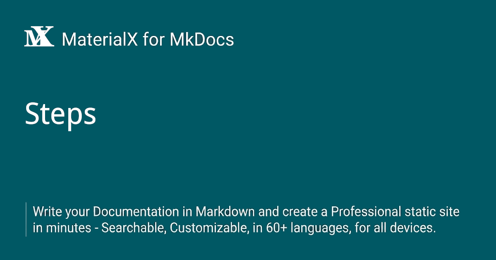

{: style="display: block; margin: 0 auto"}
<H1 style="text-align: center;"><ins>Steps</ins></H1>


The Steps container visually presents code execution or business workflows, linking related logic coherently to improve readability for readers.

This container is built into MaterialX with an extremely straightforward usage. Simply wrap ordered lists, unordered lists, or heading blocks with a `<div>` bearing the `steps` class.

## Usage

<!-- md:version 10.2.0 -->

<div class="steps" markdown>

1. Enable the extension that parses Markdown inside HTML tags:

```yaml title="mkdocs.yml"
markdown_extensions:
  - md_in_html
```

2. Wrap ordered lists, unordered lists, or heading blocks with the following snippet:

```html
<div class="steps" markdown>

</div>
```

</div>

Several usage examples are demonstrated below:

### List Mode

Supports wrapping both ordered and unordered lists.

=== "Syntax"

    ```markdown hl_lines="1 7"
    <div class="steps" markdown>

    1. Install
    2. Configure
    3. Run

    </div>
    ```

=== "Rendering"

    <div class="steps" markdown>

    1. Install
    2. Configure
    3. Run

    </div>

### Complex List Mode

You can also embed any Markdown content within list items, such as fenced blocks, admonitions, content tabs, and more.

=== "Syntax"

    ````markdown {hl_lines="1 16" data-fold="0"}
    <div class="steps" markdown>

    1. Install

    Install package:

    ```bash
    pip install xxx
    ```

    2. Result

    !!! success
        Everything is OK !

    </div>
    ````

=== "Rendering"

    <div class="steps" markdown>

    1. Install

    Install package:

    ```bash
    pip install xxx
    ```

    2. Result

    !!! success
        Everything is OK !

    </div>

### Heading Mode

You can also wrap headings of the same level to construct step sequences, where each heading represents one individual step.

=== "Syntax"

    ````markdown {hl_lines="1 19" data-fold="0"}
    <div class="steps" markdown>

    #### Install

    Install package:

    ```bash
    pip install xxx
    ```

    #### Run

    !!! quote ""
        === "Success"
            Everything is OK !
        === "Failed"
            Something went wrong !

    </div>
    ````

=== "Rendering"

    <div class="steps" markdown>

    #### Install

    Install package:

    ```bash
    pip install xxx
    ```

    #### Run

    !!! quote ""
        === "Success"
            Everything is OK !
        === "Failed"
            Something went wrong !

    </div>

## Custom Styling

You may customize the appearance of the Steps via the corresponding variables defined in `extra.css`:

<div class="steps" markdown>

1. Configure `mkdocs.yml`:

```yaml title="mkdocs.yml"
extra_css:
  - stylesheets/extra.css
```

2. Customize `extra.css`:

```css {title="extra.css" data-download}
.md-typeset .steps {
  --md-steps-fg-color: var(--md-code-fg-color);     /* Circle text color */
  --md-steps-bg-color: var(--md-code-bg-color);     /* Circle background color */
  --md-steps-circle-border: 1px solid var(--md-typeset-kbd-border-color);
  --md-steps-line-color: var(--md-default-fg-color--quote);
  --md-steps-circle-size: 28px;
  --md-steps-gap: 8px;          /* Gap between circle and connecting line */
  --md-steps-indent: 48px;      /* Indented space to the right of the circle */
}
```

</div>