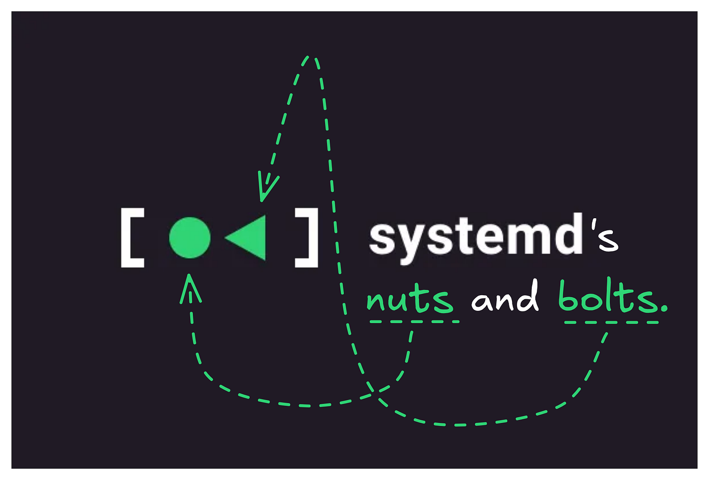
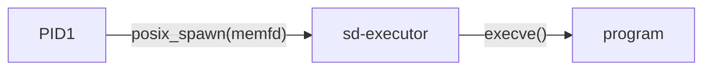
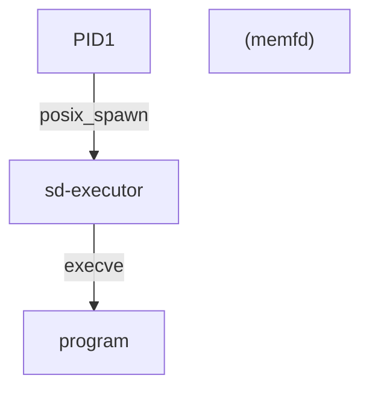
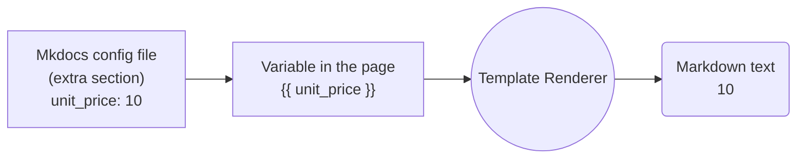

<h1>Header</h1>

{: style="display: block; margin: 0 auto"}

<H1 style="text-align: center;">systemd</H1>

!!! tip ""
    {: style="display: block; margin: 0 auto"}
    
    <H2 style="text-align: center;"><b>System and Service Manager</b></H2>
    
!!! pied-piper ""
              
    
## systemd

!!! bug ""

    Most documentation is available on [systemd's web site](https://systemd.io/).
    
!!! bug ""

    Assorted, older, general information about systemd can be found in the [systemd Wiki](https://www.freedesktop.org/wiki/Software/systemd).
    
!!! bug ""

    Information about build requirements is provided in the [README file](https://github.com/systemd/systemd/blob/main/README).
    
!!! bug ""

    Consult our [NEWS file](https://github.com/systemd/systemd/blob/main/NEWS) for information about what's new in the most recent systemd versions.
    
!!! bug ""

    Please see the [Code Map](https://github.com/systemd/systemd/blob/main/docs/ARCHITECTURE.md) for information about this repository's layout and content.
    
!!! bug ""

    Please see the [Hacking guide](https://github.com/systemd/systemd/blob/main/docs/HACKING.md) for information on how to hack on systemd and test your modifications.
    
!!! bug ""

    Please see our [Contribution Guidelines](https://github.com/systemd/systemd/blob/main/docs/CONTRIBUTING.md) for more information about filing GitHub Issues and posting GitHub Pull Requests.
    
!!! bug ""

    When preparing patches for systemd, please follow our [Coding Style Guidelines](https://github.com/systemd/systemd/blob/main/docs/CODING_STYLE.md).
    
!!! bug ""

    If you are looking for support, please contact our [mailing list](https://lists.freedesktop.org/mailman/listinfo/systemd-devel), join our [IRC channel #systemd on libera.chat](https://web.libera.chat/#systemd) or [Matrix channel](https://matrix.to/#/#systemd-project:matrix.org)
    
!!! bug ""

    Stable branches with backported patches are available in the [stable repo](https://github.com/systemd/systemd-stable).
    
!!! bug ""

    We have a security bug bounty program sponsored by the [Sovereign Tech Fund](https://www.sovereigntechfund.de/) hosted on [YesWeHack](https://yeswehack.com/programs/systemd-bug-bounty-program)
    
!!! bug ""

    Repositories with distribution packages built from git main are [available on OBS](https://software.opensuse.org//download.html?project=system%3Asystemd&package=systemd), and also repositories with [packages built from the latest stable release](https://software.opensuse.org//download.html?project=system%3Asystemd%3Astable&package=systemd)
    

---

<table class="wikitable">
<tbody><tr>
<th>Action</th>
<th>Command</th>
<th>Note</th></tr>
<tr>
<th colspan="3">Analyzing the system state</th></tr>
<tr>
<td class="action"><b>Show system status</b></td>
<td><code>systemctl status</code></td>
<td></td></tr>
<tr>
<td class="action"><b>List running</b> units</td>
<td><code>systemctl</code> or <code>systemctl list-units</code></td>
<td></td></tr>
<tr>
<td class="action"><b>List failed</b> units</td>
<td><code>systemctl --failed</code></td>
<td></td></tr>
<tr>
<td class="action"><b>List installed</b> unit files1</td>
<td><code>systemctl list-unit-files</code></td>
<td></td></tr>
<tr>
<td class="action"><b>Show process status</b> for a PID</td>
<td><code>systemctl status <i>pid</i></code></td>
<td><a href="https://wiki.archlinux.org/title/Cgroups" title="Cgroups">cgroup slice</a>, memory and parent</td></tr>
<tr>
<th colspan="3">Checking the unit status</th></tr>
<tr>
<td class="action"><b>Show a manual page</b> associated with a unit</td>
<td><code>systemctl help <i>unit</i></code></td>
<td>as supported by the unit</td></tr>
<tr>
<td class="action"><b>Status</b> of a unit</td>
<td><code>systemctl status <i>unit</i></code></td>
<td>including whether it is running or not</td></tr>
<tr>
<td class="action"><b>Check</b> whether a unit is enabled</td>
<td><code>systemctl is-enabled <i>unit</i></code></td>
<td></td></tr>
<tr>
<th colspan="3">Starting, restarting, reloading a unit</th></tr>
<tr>
<td class="action"><b>Start</b> a unit immediately</td>
<td><code>systemctl start <i>unit</i></code> as root</td>
<td></td></tr>
<tr>
<td class="action"><b>Stop</b> a unit immediately</td>
<td><code>systemctl stop <i>unit</i></code> as root</td>
<td></td></tr>
<tr>
<td class="action"><b>Restart</b> a unit</td>
<td><code>systemctl restart <i>unit</i></code> as root</td>
<td></td></tr>
<tr>
<td class="action"><b>Reload</b> a unit and its configuration</td>
<td><code>systemctl reload <i>unit</i></code> as root</td>
<td></td></tr>
<tr>
<td class="action"><b>Reload systemd manager</b> configuration2</td>
<td><code>systemctl daemon-reload</code> as root</td>
<td>scan for new or changed units</td></tr>
<tr>
<th colspan="3">Enabling a unit</th></tr>
<tr>
<td class="action"><b>Enable</b> a unit to start automatically at boot</td>
<td><code>systemctl enable <i>unit</i></code> as root</td>
<td></td></tr>
<tr>
<td class="action"><b>Enable</b> a unit to start automatically at boot and <b>start</b> it immediately</td>
<td><code>systemctl enable --now <i>unit</i></code> as root</td>
<td></td></tr>
<tr>
<td class="action"><b>Disable</b> a unit to no longer start at boot</td>
<td><code>systemctl disable <i>unit</i></code> as root</td>
<td></td></tr>
<tr>
<td class="action"><b>Reenable</b> a unit3</td>
<td><code>systemctl reenable <i>unit</i></code> as root</td>
<td>i.e. disable and enable anew</td></tr>
<tr>
<th colspan="3">Masking a unit</th></tr>
<tr>
<td class="action"><b>Mask</b> a unit to make it impossible to start4</td>
<td><code>systemctl mask <i>unit</i></code> as root</td>
<td></td></tr>
<tr>
<td class="action"><b>Unmask</b> a unit</td>
<td><code>systemctl unmask <i>unit</i></code> as root</td>
<td></td></tr></tbody></table>

##### The systemd Repository Architecture

##### Code Map

!!! abstract "📌 Code Structure Overview"

    The code that is shared between components is split into a few directories, each with a different purpose:

    - `src/include/uapi/` contains copy of kernel headers we use.
    - `src/include/override/` contains wrappers for libc and kernel headers, to provide several missing symbols.
    - `src/basic/` and `src/fundamental/` — those directories contain code primitives that are used by all other code.
    - `src/fundamental/` is stricter, because it is used for EFI and user-space code, while `src/basic/` is only used for user-space code.
    
    ---

    The code in `src/fundamental/` cannot depend on any other code in the tree, and `src/basic/` can depend only on itself and `src/fundamental/`.

    For user-space, a static library is built from this code and linked statically in various places.

    - `src/libsystemd/` implements the `libsystemd.so` shared library (also available as static `libsystemd.a`).
      This code may use anything in `src/basic/` or `src/fundamental/`.

    - `src/shared/` provides various utilities and code shared between other components that is exposed as the `libsystemd-shared-<nnn>.so` shared library.
      The other subdirectories implement individual components. They may depend only on `src/fundamental/` + `src/basic/`, or also on `src/libsystemd/`, or also on `src/shared/`.
      
    ---

    You might wonder what kind of code belongs where. In general, the rule is that code should be linked as few times as possible, ideally only once.

    Thus code that is used by "higher-level" components (e.g. our binaries which are linked to `libsystemd-shared-<nnn>.so`), would go to a subdirectory specific to that component if it is only used there.

    If the code is to be shared between components, it'd go to `src/shared/`. Shared code that is used by multiple components that do not link to `libsystemd-shared-<nnn>.so` may live either in `src/libsystemd/`, `src/basic/`, or `src/fundamental/`.

    Code used only for EFI goes under `src/boot/`, and under `src/fundamental/` if it is shared with non-EFI components.

    ---

    To summarize:

    - `src/include/uapi/`
      - copy of kernel headers

    - `src/include/override/`
      - wrappers for libc and kernel headers

    - `src/fundamental/`
      - may be used by all code in the tree
      - may not use any code outside of `src/fundamental/`

    - `src/basic/`
      - may be used by all code in the tree
      - may not use any code outside of `src/fundamental/` and `src/basic/`

    - `src/libsystemd/`
      - may be used by all code in the tree that links to `libsystemd.so`
      - may not use any code outside of `src/fundamental/`, `src/basic/`, and `src/libsystemd/`

    - `src/shared/`
      - may be used by all code in the tree, except for code in `src/basic/`, `src/libsystemd/`, `src/nss-*`, `src/login/pam_systemd.*`, and files under `src/journal/` that end up in `libjournal-client.a` convenience library.
      - may not use any code outside of `src/fundamental/`, `src/basic/`, `src/libsystemd/`, `src/shared/`
      

##### PID 1

Code located in `src/core/` implements the main logic of the systemd system (and user) service manager.

BPF helpers written in C and used by PID 1 can be found under `src/core/bpf/`.

##### Implementing Unit Settings

The system and session manager supports a large number of unit settings.
These can generally be configured in three ways:

1. Via textual, INI-style configuration files called *unit* *files*
2. Via D-Bus messages to the manager
3. Via the `systemd-run` and `systemctl set-property` commands

From a user's perspective, the third is a wrapper for the second.
To implement a new unit setting, it is necessary to support all three input methods:

1. *unit* *files* are parsed in `src/core/load-fragment.c`, with many simple and fixed-type unit settings being parsed by common helpers, with the definition in the generator file `src/core/load-fragment-gperf.gperf.in`
2. D-Bus messages are defined and parsed in `src/core/dbus-*.c`
3. `systemd-run` and `systemctl set-property` do client-side parsing and translation into D-Bus messages in `src/shared/bus-unit-util.c`

So that they are exercised by the fuzzing CI, new unit settings should also be listed in the text files under `test/fuzz/fuzz-unit-file/`.

##### systemd-udev

Sources for the udev daemon and command-line tool (single binary) can be found under `src/udev/`.

### Unit Tests

Source files found under `src/test/` implement unit-level testing, mostly for modules found in `src/basic/` and `src/shared/`, but not exclusively.
Each test file is compiled in a standalone binary that can be run to exercise the corresponding module.
While most of the tests can be run by any user, some require privileges, and will attempt to clearly log about what they need (mostly in the form of effective capabilities).
These tests are self-contained, and generally safe to run on the host without side effects.

Ideally, every module in `src/basic/` and `src/shared/` should have a corresponding unit test under `src/test/`, exercising every helper function.

### Fuzzing

Fuzzers are a type of unit tests that execute code on an externally-supplied input sample.
Fuzzers are called `fuzz-*`.
Fuzzers for `src/basic/` and `src/shared` live under `src/fuzz/`, and those for other parts of the codebase should be located next to the code they test.

Files under `test/fuzz/` contain input data for fuzzers, one subdirectory for each fuzzer.
Some of the files are "seed corpora", i.e. files that contain lists of settings and input values intended to generate initial coverage, and other files are samples saved by the fuzzing engines when they find an issue.

When adding new input samples under `test/fuzz/*/`, please use some short-but-meaningful names.
Names of meson tests include the input file name and output looks awkward if they are too long.

Fuzzers are invoked primarily in three ways:
firstly, each fuzzer is compiled as a normal executable and executed for each of the input samples under `test/fuzz/` as part of the test suite.
Secondly, fuzzers may be instrumented with sanitizers and invoked as part of the test suite (if `-Dfuzz-tests=true` is configured).
Thirdly, fuzzers are executed through fuzzing engines that try to find new "interesting" inputs through coverage feedback and massive parallelization; see the links for oss-fuzz in [Code quality](https://github.com/systemd/systemd/blob/main/docs/CODE_QUALITY.md).
For testing and debugging, fuzzers can be executed as any other program, including under `valgrind` or `gdb`.

## Integration Tests

Sources in `test/TEST-*` implement system-level testing for executables, libraries and daemons that are shipped by the project.

Most of those tests should be able to run via `systemd-nspawn`, which is orders-of-magnitude faster than `qemu`, but some tests require privileged operations like using `dm-crypt` or `loopdev`.
They are clearly marked if that is the case.

See [`test/integration-tests/README.md`](https://github.com/systemd/systemd/blob/main/test/integration-tests/README.md) for more specific details.

##### hwdb

Rules built in the static hardware database shipped by the project can be found under `hwdb.d/`.
Some of these files are updated automatically, some are filled by contributors.

##### Documentation

##### systemd.io

Markdown files found under `docs/` are automatically published on the [systemd.io](https://systemd.io) website using Github Pages.
A minimal unit test to ensure the formatting doesn't have errors is included in the `meson test -C build/ github-pages` run as part of the CI.

##### Man pages

Manpages for binaries and libraries, and the DBUS interfaces, can be found under `man/` and should ideally be kept in sync with changes to the corresponding binaries and libraries.

##### Translations

Translations files for binaries and daemons, provided by volunteers, can be found under `po/` in the usual format.
They are kept up to date by contributors and by automated tools.

##### System Configuration files and presets

Presets (or templates from which they are generated) for various daemons and tools can be found under various directories such as
`factory/`, `modprobe.d/`, `network/`, `presets/`, `rules.d/`, `shell-completion/`, `sysctl.d/`, `sysusers.d/`, `tmpfiles.d/`.

##### Utilities for Developers

`tools/`, `coccinelle/`, `.github/`, `.semaphore/`, `.mkosi/` host various utilities and scripts that are used by maintainers and developers.
They are not shipped or installed.

##### Service Manager Overview

!!! info "Service Manager Overview"

    - The Service Manager takes configuration in the form of unit files, credentials, kernel command line options and D-Bus commands, and based on those manages the system and spawns other processes.
    
    - It runs in system mode as PID1, and in user mode with one instance per user session.
    
    
    ---
    
    
    - When starting a unit requires forking a new process, configuration for the new process will be serialized and passed over to the new process, created via a posix_spawn() call.
    
    - This is done in order to avoid excessive processing after a fork() but before an exec(), which is against glibc's best practices and can also result in a copy-on-write trap. The new process will start as the `systemd-executor` binary, which will deserialize the configuration and apply all the options (sandboxing, namespacing, cgroup, etc.) before exec'ing the configured executable.
    

---

---

---

---

