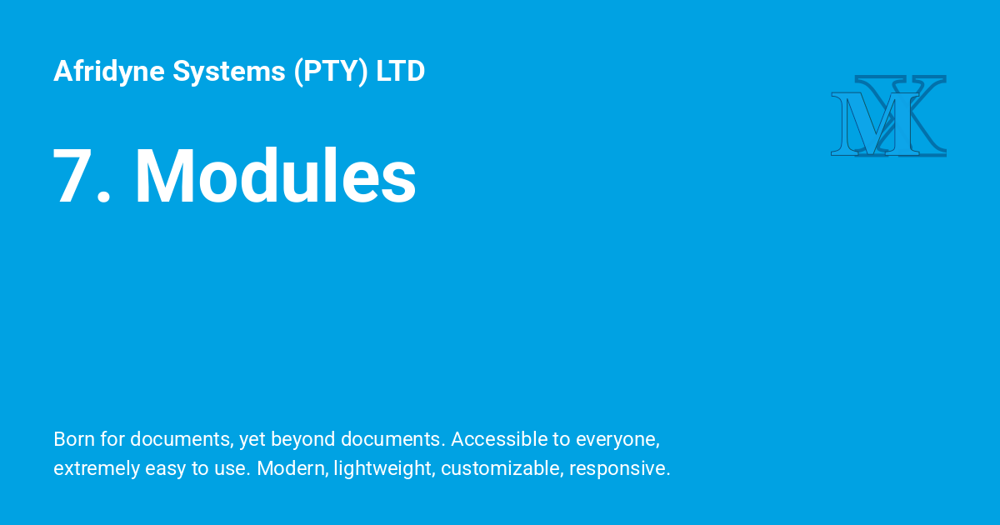

{ .center-image }

!!! git ""
    <h3 style="text-align: center;">Chapter 7: Modules and other bits and pieces <i>Not written.</i></h3>
    
!!! desc ""
    
    ### 7.1: Control over modules: `zmodload`
    
    #### 7.1.1: Modules defining parameters
    
    #### 7.1.2: Low-level system interaction
    
    #### 7.1.3: ZFTP
    
    ### 7.2: Contributed bits
    
    #### 7.2.1: Prompt themes
    
    ### 7.3: What's new in 4.1
    
Ch7 appendix fixed · TXT
!!! recommendation "Chapter 7: Modules"
 
    In Peter Stephenson's official ***[A User's Guide to the Z-Shell](https://zsh.sourceforge.io/Guide/zshguide.html)***, **Chapter 7: Modules and other bits and pieces** was **never actually written**. The outline for the unwritten chapter was intended to cover topics like the `zmodload` command, low-level system interaction, and contributed tools. 
    
    Since that chapter remains blank in the guide, here is a concise breakdown of how **Zsh modules** work and the core concepts you would have found there.
 
---
 
!!! instruction "📦 What are Zsh Modules?"
 
    Zsh modules are optional components that extend the core capabilities of the shell. They can be compiled directly into the shell binary or loaded dynamically at runtime to save memory when running non-interactive shells.
 
!!! pied-piper "🛠️ Managing Modules with `zmodload`"
 
    The `zmodload` builtin is used to view, load, or unload modules:
    
    * **List loaded modules:** `zmodload`
    * **Load a module:** `zmodload zsh/datetime`
    * **Silently load (no error if already loaded):** `zmodload -i zsh/mathfunc`
    * **Unload a module:** `zmodload -u zsh/datetime`
 
---
 
!!! abstract "🗃️ Essential Bundled Modules"
 
    While the chapter wasn't written, the official `zshmodules` manual documentation fills the gap. Some of the most useful modules include:
    
    * **`zsh/datetime`**: Adds time-tracking parameters and commands like `strftime`.
    * **`zsh/mathfunc`**: Enables standard scientific functions (like `sin()`, `cos()`, `log()`) inside mathematical evaluations `(( ... ))`.
    * **`zsh/parameter`**: Gives you direct access to the shell's internal hash tables using special associative arrays (e.g., `$commands`, `$functions`, `$history`).
    * **`zsh/stat`**: Provides a `stat` builtin to query file statistics directly within the shell without forking an external process.
    * **`zsh/system`**: Provides low-level system calls, such as file locking (`zsystem flock`) and raw system errors.
    * **`zsh/zle`**: The Zsh Line Editor, which handles everything you type interactively.
    
 
!!! abstract "🔩 Creating a Custom Zsh Module"
 
    To write a native module, you create a C file that hooks into the Zsh API.
    
    1. Include the headers: You need zsh.h (usually found in the Zsh source tree).
    
    2. Define the setup/cleanup functions: Zsh expects specific entry points to load and unload your features.
    
    3. Register builtins: Use the builtin struct to define new command.
    
    
    ```
    #include <zsh.h>
    
    // The core logic of your new shell command
    static int bin_hello(char *name, char **args, Options ops, int func) {
        printf("Hello from a custom Zsh module!\n");
        return 0;
    }
    
    // Define the builtin command metadata
    static struct builtin btab[] = {
        BUILTIN("hello", 0, bin_hello, 0, 0, 0, NULL, NULL),
    };
    
    // Called when the module is loaded
    int setup_(Module m) {
        return 0;
    }
    
    // Called to register features
    int boot_(Module m) {
        return !addbuiltins(m->nam, btab, sizeof(btab)/sizeof(*btab));
    }
    
    // Called when the module is unloaded
    int cleanup_(Module m) {
        deletebuiltins(m->nam, btab, sizeof(btab)/sizeof(*btab));
        return 0;
    }
    
    int finish_(Module m) {
        return 0;
    }
    ```
 
!!! abstract "🔨 Compiling and Loading"
 
    To test it, you compile it as a shared library and point Zsh to its directory:
    
    ```
    # Compile (exact flags vary by OS)
    gcc -shared -fPIC -o mymodule.so mymodule.c
    
    # Tell Zsh where to look for modules
    module_path=($module_path /path/to/your/module)
    
    # Load it up
    zmodload mymodule
    
    # Run your new native command
    hello
    ```