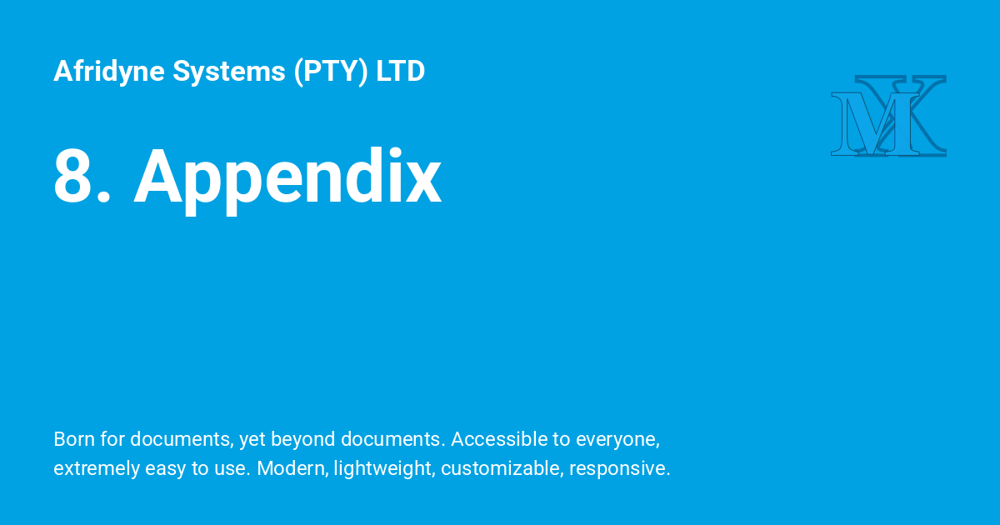

{ .center-image }

!!! git ""
    <h3 style="text-align: center;">Appendix 1: Obtaining zsh and getting more information. <i>Not written.</i></h3>
    
!!! recommendation "Chapter 8: Appendix — Obtaining Zsh and Modern Ecosystem Resources"
 
    Because the original 2003 manual left this section unwritten, this appendix serves as a practical modern resource. It guides you through obtaining the latest Zsh binaries, managing your environment, and navigating the vast community ecosystem that has matured since this guide's initial conception.
 
---
 
!!! pied-piper "8.1 Obtaining and Updating Zsh"
 
    While many modern Unix-like operating systems include Zsh by default, vendor-bundled versions are frequently outdated. To access modern features, optimizations, and security patches, it is highly recommended to install or update Zsh using your platform's primary package manager.
    
    *   **macOS:** Zsh has been the default login shell since macOS Catalina (10.15). However, Apple's system binary updates slowly. Install the latest version via [Homebrew](https://brew.sh):
        ```bash
        brew install zsh
        ```
    *   **Ubuntu / Debian:**
        ```bash
        sudo apt update && sudo apt install zsh
        ```
    *   **Fedora / RHEL / CentOS:**
        ```bash
        sudo dnf install zsh
        ```
    *   **Arch Linux:**
        ```bash
        sudo pacman -S zsh
        ```
    *   **Windows (WSL):** Install the [Windows Subsystem for Linux](https://learn.microsoft.com/windows/wsl/install) with your preferred distribution (e.g., Ubuntu), and use the respective Linux package manager above.
 
---
 
!!! ex "8.2 Initializing Zsh as Your Default Shell"
 
    Once installed, you must instruct your operating system to use Zsh as your default interactive login shell instead of legacy shells like Bash or Sh.
    
    1. Locate the absolute path of your newly installed Zsh binary:
       ```bash
       which zsh
       ```
       *(Standard paths are usually `/bin/zsh` or `/usr/local/bin/zsh`)*
    
    2. Ensure this path is registered in your system's allowed shells list. If it is missing, append it using administrative privileges:
       ```bash
       echo $(which zsh) | sudo tee -a /etc/shells
       ```
    
    3. Change your default shell using the `chsh` (change shell) utility:
       ```bash
       chsh -s $(which zsh)
       ```
    
    4. Restart your terminal application or log out of your system session for the changes to take effect.
 
---
 
!!! ex "8.3 The Modern Community Frameworks"
 
    In the era of Peter Stephenson's original text, users typically constructed their `.zshrc` configurations entirely from scratch. Today, the community offers modular frameworks that simplify configuration management, expose built-in optimization flags, and streamline plugin architectures.
    
    *   **Oh My Zsh:** The largest community-driven framework in existence. It comes pre-packaged with hundreds of plugins and visual themes. It is highly accessible for beginners, though it can become heavy if over-configured.
        *   *Resource:* [ohmyz.sh](https://ohmyz.sh)
    *   **Prezto:** A leaner, faster, and highly modular alternative, created by Sorin Ionescu for users who want an Oh My Zsh-style experience without sacrificing shell startup performance.
        *   *Resource:* [GitHub: sorin-ionescu/prezto](https://github.com/sorin-ionescu/prezto)
    *   **Antidote:** A modern, minimalist, and blazing-fast plugin manager. It uses a simple text file (`.zsh_plugins.txt`) to lazy-load community extensions asynchronously, keeping shell initialization time minimal.
        *   *Resource:* [getantidote.github.io](https://getantidote.github.io/)
 
---
 
!!! ex "8.4 Essential Interactive Enhancements"
 
    If you prefer a pure vanilla Zsh experience (as outlined in Chapters 1 through 6) but want the functional quality-of-life features found in modern interactive environments, these standalone plugins are highly recommended:
    
    *   **zsh-syntax-highlighting:** Provides real-time visual feedback by highlighting syntax as you type. Valid commands, aliases, and functions appear green; syntax errors, unclosed quotes, and invalid paths appear red.
        *   *Resource:* [GitHub: zsh-users/zsh-syntax-highlighting](https://github.com/zsh-users/zsh-syntax-highlighting)
    *   **zsh-autosuggestions:** Asynchronously suggests commands dynamically based on your underlying command history. Press `→` (Right Arrow) or `End` to automatically complete the predicted string.
        *   *Resource:* [GitHub: zsh-users/zsh-autosuggestions](https://github.com/zsh-users/zsh-autosuggestions)
    *   **fzf (Fuzzy Finder):** While not exclusive to Zsh, its native key-bindings completely overhaul Zsh history searches (`Ctrl+R`) and file completions with an interactive, real-time filtering menu.
        *   *Resource:* [GitHub: junegunn/fzf](https://github.com/junegunn/fzf)
 
---
 
!!! ex "8.5 Primary Documentation and Community Hubs"
 
    When your needs expand past the fundamentals covered in this manual, the following hubs serve as the definitive authorities on Zsh mechanics:
    
    *   **The Official Zsh Homepage:** The canonical reference site containing the full, unedited man pages, source mirrors, and FAQ archives.
        *   *URL:* [zsh.sourceforge.io](https://zsh.sourceforge.io/)
    *   **The Zsh Mailing Lists:** Where core development and deep technical user support occur transparently.
        *   *User Support:* `zsh-users@zsh.org`
        *   *Core Development:* `zsh-workers@zsh.org`
    *   **Awesome Zsh:** A massive, community-curated directory indexing hundreds of Zsh themes, plugins, tools, and alternative tutorials.
        *   *URL:* [GitHub: unixorn/awesome-zsh-plugins](https://github.com/unixorn/awesome-zsh-plugins)
 